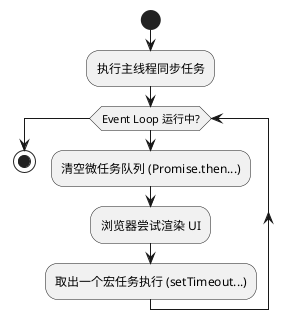

# JavaScript 核心原理 (拼多多真题标准)

---

## 一、闭包 (Closure)

### 1.1 解释闭包及其应用场景

**深度解析：**
闭包是指一个函数以及其捆绑的词法环境的引用。本质上，闭包让内部函数可以“记住”并访问外部函数的作用域，即使外部函数已经执行完毕并从调用栈中弹出。

**应用场景：**
1.  **数据私有化 (封装)**：模拟私有变量，防止外部修改。
2.  **回调函数与高阶函数**：如 `setTimeout` 中的变量引用。
3.  **偏函数/柯里化**：参数复用。
4.  **模块化模式**：在 ES 模块普及前，通过 IIFE 实现模块隔离。

---

## 二、事件循环 (Event Loop)

### 2.1 宏任务与微任务执行顺序详解

**执行模型：**
1.  执行当前主线程的同步任务（属于第一个宏任务）。
2.  同步任务执行完，检查 **微任务队列 (Microtask Queue)**。
3.  依次执行并清空微任务队列中的所有任务（如 `Promise.then`, `process.nextTick`）。
4.  开始下一次 **宏任务 (Macrotask)**（如 `setTimeout`, `setInterval`, `I/O`）。
5.  每个宏任务执行完后，都会立即检查并清空微任务队列。

---

## 三、2025 内存管理 (WeakRef)
... (此处省略其他已加固内容)
