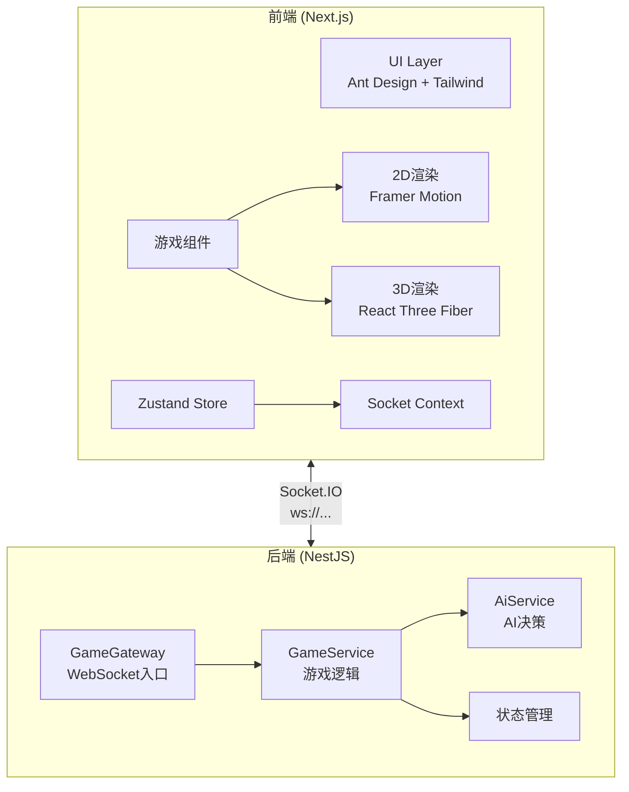

# 第5卷-项目实战案例

## 第3章 UnoThree

### 1.1 项目定位与STAR分析

UnoThree 是一个完整实现的 UNO 牌游戏的多人在线对战平台，采用现代化的 Web 技术栈构建，支持 2D 和 3D 两种渲染模式。项目名称 "UnoThree" 体现了其核心特性——UNO 牌游戏 + 3D 渲染能力。

**STAR 分析：**

| 维度 | 内容 |
|------|------|
| **Situation (背景)** | 团队希望构建一个具备完整游戏规则的多人在线对战平台，同时展示 3D Web 开发能力 |
| **Task (任务)** | 实现支持 2-10+ 玩家的 UNO 对战，包含 AI 对手、双渲染模式、完整游戏机制 |
| **Action (行动)** | 采用 Next.js + NestJS 全栈架构，React Three Fiber 实现 3D 渲染，Socket.IO 实现实时通信 |
| **Result (成果)** | 实现了完整的 UNO 规则引擎，支持质疑+4、喊UNO、抓UNO等核心机制，上线运行稳定 |

**核心特性：**
- 标准 UNO 卡牌系统（数字牌，功能牌，万能牌）
- 多人在线对战（支持 2-10+ 玩家）
- AI 对手系统（简单、中等、困难三种难度）
- 完整的游戏机制（喊 UNO、质疑 +4、被抓 UNO 等）
- 回合制游戏流程与计分系统

---

### 1.2 技术栈概览

**前端技术栈：**

| 类别 | 技术选型 | 版本 |
|------|----------|------|
| 框架 | Next.js | 16.1.6 |
| UI库 | React | 19.2.3 |
| 3D渲染 | Three.js + React Three Fiber + Drei | 0.182.0 / 9.5.0 / 10.7.7 |
| 动画 | Framer Motion + React Spring | 12.34.0 |
| 状态管理 | Zustand | 5.0.11 |
| UI组件 | Ant Design | 6.3.0 |
| 实时通信 | Socket.IO Client | 4.8.3 |
| 样式 | Tailwind CSS 4 + clsx + tailwind-merge | 4 |

**后端技术栈：**

| 类别 | 技术选型 | 版本 |
|------|----------|------|
| 框架 | NestJS | 11.0.1 |
| WebSocket | Socket.IO + @nestjs/websockets | 4.8.3 |
| 工具库 | UUID、RxJS | - |

**部署技术：**

| 组件 | 配置 |
|------|------|
| 反向代理 | Nginx |
| WebSocket转发 | Socket.IO Proxy |
| 静态资源 | CDN |

---

### 2.1 系统架构图



---

### 2.2 整体目录结构

```
frontend/src/
┣━━ app/                          # Next.js App Router
┃   ┣━━ layout.tsx               # 根布局组件
┃   ┗━━ page.tsx                 # 主页面
┣━━ components/
┃   ┣━━ Card.tsx                # 通用卡牌组件
┃   ┗━━ game/
┃       ┣━━ 2d/                 # 2D 渲染组件
┃       ┃   ┣━━ Card2D.tsx      # 2D 卡牌
┃       ┃   ┣━━ CardBack2D.tsx  # 2D 卡牌背面
┃       ┃   ┣━━ ColorPicker2D.tsx
┃       ┃   ┣━━ Deck2D.tsx
┃       ┃   ┣━━ DirectionIndicator2D.tsx
┃       ┃   ┣━━ DiscardPile2D.tsx
┃       ┃   ┣━━ Hand2D.tsx
┃       ┃   ┣━━ PlayerArea2D.tsx
┃       ┃   ┣━━ Scene2D.tsx
┃       ┃   ┣━━ ScoreBoard2D.tsx
┃       ┃   ┣━━ Table2D.tsx
┃       ┃   ┣━━ UnoButton2D.tsx
┃       ┃   ┗━━ index.ts
┃       ┣━━ 3d/                  # 3D 渲染组件
┃       ┣━━ classic/
┃       ┃   ┣━━ AnimatedCard.ts  # 动画卡牌类
┃       ┃   ┗━━ CardRenderer.ts
┃       ┣━━ CameraControl.tsx   # 3D 相机控制
┃       ┣━━ Card3D.tsx          # 3D 卡牌组件
┃       ┣━━ GameOverlay.tsx
┃       ┣━━ HUD.tsx
┃       ┣━━ NotificationLayer.tsx
┃       ┗━━ Scene3D.tsx         # 3D 主场景
┣━━ context/
┃   ┗━━ GameSocketContext.tsx  # WebSocket 上下文
┣━━ hooks/
┃   ┣━━ useResponsive.ts       # 响应式 Hook
┃   ┣━━ useSoundEffects.ts     # 音效 Hook
┃   ┗━━ useVoiceChat.ts
┣━━ store/
┃   ┗━━ useGameStore.ts        # Zustand 状态管理
┣━━ types/
┃   ┗━━ game.ts                # 游戏类型定义
┗━━ utils/
    ┣━━ audioManager.ts         # 音频管理器
    ┣━━ nicknameGenerator.ts
    ┗━━ unoSound.ts
```

---

### 3.1 组件层级架构

```
┏━━━━━━━━━━━━━━━━━━━━━━━━━━━━━━━━━━━━━━━━━━━━━━━━━━━━━━━━━━━━━━━━━┓
┃                        组件层级树                              ┃
┣━━━━━━━━━━━━━━━━━━━━━━━━━━━━━━━━━━━━━━━━━━━━━━━━━━━━━━━━━━━━━━━━━┫
┃                                                                 ┃
┃  page.tsx (根页面)                                             ┃
┃  ┗━━ GameContent (主逻辑容器)                                   ┃
┃      ┣━━ 未登录视图 (Login UI)                                  ┃
┃      ┃   ┣━━ Logo 展示                                          ┃
┃      ┃   ┗━━ 登录表单                                          ┃
┃      ┃                                                          ┃
┃      ┗━━ 已登录视图 (Game UI)                                   ┃
┃          ┣━━ NotificationLayer (通知层 z-1000)                  ┃
┃          ┣━━ GameOverlay (游戏覆盖层 z-60)                      ┃
┃          ┃   ┗━━ 颜色选择器 / 决策弹窗                           ┃
┃          ┃                                                      ┃
┃          ┣━━ 游戏场景层 (z-0)                                    ┃
┃          ┃   ┣━━ Scene3D (3D渲染模式)                          ┃
┃          ┃   ┃   ┣━━ 环境系统 (Stars/Particles/Orbs)           ┃
┃          ┃   ┃   ┣━━ 灯光系统                                   ┃
┃          ┃   ┃   ┣━━ 玩家区域 (PlayerArea3D)                   ┃
┃          ┃   ┃   ┗━━ 卡牌组件 (Card3D)                         ┃
┃          ┃   │                                              ┃
┃          ┃   ┣━━ Scene2D (2D渲染模式)                          ┃
┃          ┃   ┃   ┣━━ 玩家区域 (PlayerArea2D)                   ┃
┃          ┃   ┃   ┣━━ 手牌 (Hand2D)                            ┃
┃          ┃   ┃   ┣━━ 牌堆 (Deck2D)                            ┃
┃          ┃   ┃   ┣━━ 弃牌堆 (DiscardPile2D)                   ┃
┃          ┃   ┃   ┗━━ 颜色选择器 (ColorPicker2D)                ┃
┃          ┃   │                                              ┃
┃          ┃   ┗━━ ClassicGame (Canvas模式)                      ┃
┃          ┃       ┣━━ CardRenderer                             ┃
┃          ┃       ┗━━ AnimatedCard                              ┃
┃          ┃                                                      ┃
┃          ┣━━ 顶部状态栏 (ScoreBoard)                            ┃
┃          ┃                                                      ┃
┃          ┗━━ HUD 层 (z-40)                                     ┃
┃              ┗━━ 性能监控/音频控制/玩家信息                      ┃
┃                                                                 ┃
┗━━━━━━━━━━━━━━━━━━━━━━━━━━━━━━━━━━━━━━━━━━━━━━━━━━━━━━━━━━━━━━━━━┛
```

---

### 3.2 2D 渲染模式（Scene2D）

Scene2D 是 2D 模式下的主场景组件，负责整合所有 2D 游戏元素。

**响应式布局系统**：

组件内部维护了一套响应式配置系统，根据设备类型（mobile/tablet/desktop）和屏幕方向（portrait/landscape）动态调整布局参数：

```typescript
const config = useMemo(() => {
  if (isMobile) {
    return {
      cardSize: 'small' as const,
      handHeight: isPortraitMode ? 'h-20' : 'h-24',
      handCardOffset: 4,
      playerRadius: isPortraitMobile ? 20 : 28,
    };
  } else {
    return {
      cardSize: 'large' as const,
      handHeight: 'h-52',
      handCardOffset: 8,
      playerRadius: 46,
    };
  }
}, [isMobile, isTablet, isPortrait]);
```

**玩家位置算法**：

组件实现了基于圆弧分布的玩家位置计算算法，支持 2-10+ 玩家。

---

### 3.3 卡牌组件（Card2D）

Card2D 组件负责渲染单个 UNO 卡牌，采用经典的 UNO 配色方案：

```typescript
const UNO_COLORS = {
  [CardColor.RED]: { bg: '#EB2725', light: '#FF4545', dark: '#C42020', name: 'RED' },
  [CardColor.BLUE]: { bg: '#0090D1', light: '#40B4E0', dark: '#0077B5', name: 'BLUE' },
  [CardColor.GREEN]: { bg: '#4DAF4E', light: '#6FC46F', dark: '#3D9140', name: 'GREEN' },
  [CardColor.YELLOW]: { bg: '#FBC812', light: '#FDD835', dark: '#F9A825', name: 'YELLOW' },
  [CardColor.WILD]: { bg: '#1A1A1A', light: '#333333', dark: '#000000', name: 'WILD' },
};
```

---

### 3.4 手牌组件（Hand2D）

Hand2D 组件实现了玩家手牌的渲染与交互，包含自适应重叠算法。

---

### 4.1 Scene3D 主场景组件

Scene3D 是 3D 模式的核心组件，使用 React Three Fiber 构建，包含以下子系统：

**环境系统**：
- 星空背景（Stars 组件）
- 飘落彩带粒子（ConfettiParticles）
- 漂浮光点粒子（FloatingGlowParticles）
- 魔法光球（MagicOrbs）
- 氛围灯光（AmbientGlow）
- 背景浮动 UNO 牌

**灯光系统**：
```typescript
// 环境光 - 明亮柔和的整体照明
<ambientLight intensity={1.2} color="#ffffff" />

// 主光源 - 模拟头顶灯光
<pointLight position={[0, 30, 0]} intensity={150} castShadow color="#fff" />

// 聚光灯 - 牌桌中央
<spotLight position={[0, 50, 0]} angle={0.5} penumbra={0.6} intensity={200} castShadow color="#fef3c7" />
```

**相机系统**：
根据设备类型和玩家数量动态调整相机位置。

---

### 4.2 Card3D 组件

Card3D 组件使用 Three.js 实现真实的 3D 卡牌模型：

**卡牌结构**：
- 卡片主体：BoxGeometry（2.5 x 3.5 x 0.18）
- 正面：PlaneGeometry + 卡牌颜色材质
- 背面：黑色 + UNO 标志

**颜色映射**：
```typescript
const COLOR_MAP: Record<CardColor, string> = {
  [CardColor.RED]: '#FF6B6B',
  [CardColor.GREEN]: '#51CF66',
  [CardColor.BLUE]: '#339AF0',
  [CardColor.YELLOW]: '#FFD43B',
  [CardColor.WILD]: '#868E96',
};
```

**动画系统**：
使用 React Spring 实现平滑动画。

---

### 5.1 状态管理（useGameStore）

```typescript
interface GameStore {
  // 游戏状态
  gameState: GameState | null;
  playerId: string | null;
  playerName: string | null;
  roomId: string | null;
  inviteToken: string | null;

  // 音频与语音状态
  masterVolume: number;
  isMicMuted: boolean;

  // 响应式状态
  deviceType: DeviceType;
  orientation: Orientation;

  // 通知状态
  notifications: Notification[];

  // 方法
  setGameState: (state: GameState) => void;
  setPlayerInfo: (id: string, name: string) => void;
  setRoomId: (id: string | null) => void;
  setInviteToken: (token: string | null) => void;
  setAudioSettings: (volume: number, muted: boolean) => void;
  setLayout: (device: DeviceType, orientation: Orientation) => void;
  addNotification: (notification: Omit<Notification, 'id'>) => void;
  removeNotification: (id: string) => void;
  resetGame: () => void;
}
```

---

### 5.2 游戏类型定义

```typescript
export enum CardColor {
  RED = 'RED',
  GREEN = 'GREEN',
  BLUE = 'BLUE',
  YELLOW = 'YELLOW',
  WILD = 'WILD',
}

export enum CardType {
  NUMBER = 'NUMBER',
  SKIP = 'SKIP',
  REVERSE = 'REVERSE',
  DRAW_TWO = 'DRAW_TWO',
  WILD = 'WILD',
  WILD_DRAW_FOUR = 'WILD_DRAW_FOUR',
}

export interface Card {
  id: string;
  color: CardColor;
  type: CardType;
  value?: number;
}
```

---

### 5.3 实时通信（GameSocketContext）

**事件处理**：

| 事件名 | 方向 | 说明 |
|--------|------|------|
| `gameStateUpdate` | Server→Client | 游戏状态全量/增量更新 |
| `playerShoutedUno` | Server→Client | 玩家喊UNO事件 |
| `roomClosed` | Server→Client | 房间关闭事件 |
| `error` | Server→Client | 服务器错误 |
| `connect/disconnect` | Client↔Server | 连接状态变化 |
| `reconnectCredentials` | Server→Client | 重连凭据 |

---

### 6.1 游戏状态机

```
┏━━━━━━━━━━━━━━━━━━━━━━━━━━━━━━━━━━━━━━━━━━━━━━━━━━━━━━━━━━━━━━━━━┓
┃                      游戏全局状态流转                           ┃
┣━━━━━━━━━━━━━━━━━━━━━━━━━━━━━━━━━━━━━━━━━━━━━━━━━━━━━━━━━━━━━━━━━┫
┃                                                                 ┃
┃  WAITING (等待开始)                                             ┃
┃      │                                                          ┃
┃      │ startGame                                               ┃
┃      ▼                                                          ┃
┃  PLAYING (游戏中)                                               ┃
┃      │                                                          ┃
┃      │ 所有玩家已出完                                           ┃
┃      ▼                                                          ┃
┃  ROUND_END (回合结束)                                           ┃
┃      │                                                          ┃
┃      │ restart                                                 ┃
┃      ▼                                                          ┃
┃  WAITING                                                        ┃
┃      │                                                          ┃
┃      │ 游戏结束                                                 ┃
┃      ▼                                                          ┃
┃  GAME_END (游戏结束)                                            ┃
┃                                                                 ┃
┗━━━━━━━━━━━━━━━━━━━━━━━━━━━━━━━━━━━━━━━━━━━━━━━━━━━━━━━━━━━━━━━━━┛
```

---

### 6.2 回合状态机

```
WAITING_TURN → MY_TURN → playCard/drawCard → 特殊牌处理 → NEXT_PLAYER → WAITING
```

---

### 6.3 出牌合法性状态机

```
玩家选择出牌
      │
      ▼
是万能牌? ━━━否━━━▶ 检查颜色/类型/数值是否匹配
  ┃是
  ▼
选择新颜色
      │
      ▼
    允许出牌
      │
      ▼
处理特殊牌效果 (颜色变化/抽牌)
```

---

### 7.1 质疑机制（+4 质疑）

```
┏━━━━━━━━━━━━━━━━━━━━━━━━━━━━━━━━━━━━━━━━━━━━━━━━━━━━━━━━━━━━━━━━━┓
┃                      +4 质疑流程                               ┃
┣━━━━━━━━━━━━━━━━━━━━━━━━━━━━━━━━━━━━━━━━━━━━━━━━━━━━━━━━━━━━━━━━━┫
┃                                                                 ┃
┃  玩家A 出 +4 牌                                                ┃
┃      │                                                          ┃
┃      │ 玩家B 点击"质疑"                                        ┃
┃      ▼                                                          ┃
┃  检查质疑条件                                                    ┃
┃  ━━━▶ 上一张牌也是 +4?                                          ┃
┃      │                                                          ┃
┃      │ 是       │ 否                                            ┃
┃      ▼          ▼                                              ┃
┃  质疑失败      检查玩家A                                        ┃
┃  玩家B抓6张   是否有合法出牌                                    ┃
┃  (A不受影响)   │                                                ┃
┃                │ 有        │ 没有                               ┃
┃                ▼           ▼                                   ┃
┃            质疑成功     质疑失败                                 ┃
┃            玩家A抓6张  玩家B抓4张                                ┃
┃                                                                 ┃
┗━━━━━━━━━━━━━━━━━━━━━━━━━━━━━━━━━━━━━━━━━━━━━━━━━━━━━━━━━━━━━━━━━┛
```

---

### 7.2 UNO 抓漏机制

```
┏━━━━━━━━━━━━━━━━━━━━━━━━━━━━━━━━━━━━━━━━━━━━━━━━━━━━━━━━━━━━━━━━━┓
┃                      UNO 抓漏流程                              ┃
┣━━━━━━━━━━━━━━━━━━━━━━━━━━━━━━━━━━━━━━━━━━━━━━━━━━━━━━━━━━━━━━━━━┫
┃                                                                 ┃
┃  玩家A 手持1张牌                                               ┃
┃      │                                                          ┃
┃      │ 喊UNO / 未喊UNO                                         ┃
┃      ▼                                                          ┃
┃  启动2秒宽限期计时器                                            ┃
┃      │                                                          ┃
┃      │ 其他玩家点击"抓UNO"                                      ┃
┃      ▼                                                          ┃
┃  检查抓漏条件                                                    ┃
┃  ━━━▶ 玩家A是否已喊UNO?                                        ┃
┃      │                                                          ┃
┃      │ 是       │ 否                                            ┃
┃      ▼          ▼                                              ┃
┃  抓漏失败      抓漏成功                                          ┃
┃  无处罚       玩家A抓2张                                        ┃
┃                                                                 ┃
┃  计时器超时：自动确认UNO                                        ┃
┃                                                                 ┃
┗━━━━━━━━━━━━━━━━━━━━━━━━━━━━━━━━━━━━━━━━━━━━━━━━━━━━━━━━━━━━━━━━━┛
```

---

### 8.1 AI 策略分析

| 难度 | 策略描述 | 实现方式 |
|------|----------|----------|
| **EASY** | 随机选择 | 随机选择任意可出卡牌 |
| **MEDIUM** | 保守策略 | 优先打出颜色最多的普通牌 |
| **HARD** | 攻击策略 | 攻击下家 + 综合评估手牌 + 预留万能牌 |

---

### 9.1 AnimatedCard 动画类

基于 Lerp（线性插值）的物理动画引擎：

```typescript
export class AnimatedCard {
  x: number;
  y: number;
  rotation: number;
  scale: number;

  targetX: number;
  targetY: number;
  targetRotation: number;
  targetScale: number;

  update(speed: number = 0.12): void {
    this.x = this.lerp(this.x, this.targetX, speed);
    this.y = this.lerp(this.y, this.targetY, speed);
    this.rotation = this.lerp(this.rotation, this.targetRotation, speed);
    const scaleSpeed = 0.2;
    this.scale = this.lerp(this.scale, this.targetScale, scaleSpeed);
  }

  private lerp(start: number, end: number, factor: number): number {
    return start + (end - start) * factor;
  }
}
```

---

### 9.2 Framer Motion 动画

所有 2D 组件广泛使用 Framer Motion 实现动画效果：

```typescript
// 弹跳入场
<motion.div
  initial={{ scale: 0, opacity: 0 }}
  animate={{ scale: 1, opacity: 1 }}
  transition={{ type: 'spring', stiffness: 300, damping: 20 }}
/>

// 悬停效果
whileHover={{ scale: 1.05 }}
whileTap={{ scale: 0.95 }}
```

---

### 10.1 useResponsive Hook

```typescript
export const useResponsive = () => {
  const setLayout = useGameStore((state) => state.setLayout);

  useEffect(() => {
    const handleResize = () => {
      const width = window.innerWidth;
      const height = window.innerHeight;

      let device: DeviceType;
      if (height < 600) {
        device = 'mobile';
      } else if (width < 768) {
        device = 'mobile';
      } else if (width < 1024) {
        device = 'tablet';
      } else {
        device = height < 800 ? 'tablet' : 'desktop';
      }

      const orientation: Orientation = width > height ? 'landscape' : 'portrait';
      setLayout(device, orientation);
    };

    handleResize();
    window.addEventListener('resize', handleResize);
    return () => window.removeEventListener('resize', handleResize);
  }, [setLayout]);
};
```

---

### 11.1 audioManager 音频管理器

使用 Web Audio API 实现的单例音频管理器：

```typescript
export enum SoundEffect {
  LOGIN = '/sounds/login.mp3',
  MATCH_SUCCESS = '/sounds/match-success.mp3',
  GAME_START = '/sounds/game-start.mp3',
  PLAY_CARD = '/sounds/play-card.mp3',
  SHOUT_UNO = '/sounds/shout-uno.mp3',
  CHALLENGE = '/sounds/challenge.mp3',
  DRAW_CARD = '/sounds/draw-card.mp3',
  WIN = '/sounds/win.mp3',
  LOSE = '/sounds/lose.mp3',
  GAME_OVER = '/sounds/game-over.mp3',
}
```

---

### 12.1 游戏网关（GameGateway）

使用 NestJS WebSocket Gateway 实现，处理所有客户端请求：

**WebSocket 事件映射**：

| 客户端事件 | 处理函数 | 说明 |
|-----------|----------|------|
| `joinRoom` | handleJoinRoom | 加入房间 |
| `addAi` | handleAddAi | 添加 AI 对手 |
| `startGame` | handleStartGame | 开始游戏 |
| `playCard` | handlePlayCard | 出牌 |
| `drawCard` | handleDrawCard | 摸牌 |
| `shoutUno` | handleShoutUno | 喊 UNO |
| `catchUnoFailure` | handleCatchUno | 抓 UNO |
| `challenge` | handleChallenge | 质疑 +4 |

---

### 12.2 游戏服务（GameService）

游戏核心逻辑实现，包含完整的 UNO 规则引擎：

**UNO 牌生成**：
```typescript
private generateUnoDeck(deckCount: number = 1): Card[] {
  const deck: Card[] = [];
  const colors = [CardColor.RED, CardColor.GREEN, CardColor.BLUE, CardColor.YELLOW];

  for (let d = 0; d < deckCount; d++) {
    for (const color of colors) {
      deck.push({ id: uuidv4(), color, type: CardType.NUMBER, value: 0 });
      for (let i = 1; i <= 9; i++) {
        deck.push({ id: uuidv4(), color, type: CardType.NUMBER, value: i });
        deck.push({ id: uuidv4(), color, type: CardType.NUMBER, value: i });
      }
      // 功能牌...
    }
    // 万能牌...
  }
  return deck;
}
```

---

### 12.3 AI 服务（AiService）

实现三种难度的 AI 决策：

- **简单难度（EASY）**：随机选择可出卡牌
- **中等难度（MEDIUM）**：优先打出颜色最多的普通牌
- **困难难度（HARD）**：攻击下家 + 综合策略

---

### 13.1 数据流向闭环

```
┏━━━━━━━━━━━━━━━━━━━━━━━━━━━━━━━━━━━━━━━━━━━━━━━━━━━━━━━━━━━━━━━━━┓
┃                      前后端数据流转闭环                          ┃
┣━━━━━━━━━━━━━━━━━━━━━━━━━━━━━━━━━━━━━━━━━━━━━━━━━━━━━━━━━━━━━━━━━┫
┃                                                                 ┃
┃  前端事件 ─────────────────────────▶ 后端处理                   ┃
┃      │                                      │                   ┃
┃      │ joinRoom / playCard / drawCard       │                   ┃
┃      │                                      ▼                   ┃
┃      │                              GameService 处理             ┃
┃      │                                      │                   ┃
┃      │                              更新游戏状态                 ┃
┃      │                                      │                   ┃
┃      │                              广播状态更新                 ┃
┃      │                                      │                   ┃
┃      ◀───────────────────────────── 游戏状态推送                 ┃
┃      │                                      │                   ┃
┃      │ gameStateUpdate                      │                   ┃
┃      │                                      ▼                   ┃
┃      │                              Zustand Store 更新           ┃
┃      │                                      │                   ┃
┃      │                              触发组件渲染                 ┃
┃      ◀─────────────────────────────────────                     ┃
┃                                                                 ┃
┃  典型流程: 出牌 → 验证 → 状态更新 → 广播 → 前端渲染 → 下一回合  ┃
┃                                                                 ┃
┗━━━━━━━━━━━━━━━━━━━━━━━━━━━━━━━━━━━━━━━━━━━━━━━━━━━━━━━━━━━━━━━━━┛
```

---

### 14.1 UI 分层架构

```
屏幕 (100vw x 100vh)
┃
┣━━ 通知层 (z-index: 1000)
┃   ┗━━ NotificationLayer
┃
┣━━ 游戏覆盖层 (z-index: 60)
┃   ┗━━ GameOverlay (决策弹窗)
┃
┣━━ 顶部状态栏 (z-index: 50)
┃
┣━━ 游戏场景层 (z-index: 0)
┃   ┣━━ Scene3D / Scene2D / ClassicGame
┃
┣━━ HUD 层 (z-index: 40)
┃   ┗━━ 性能监控/音频控制/玩家信息
┃
┗━━ 相机控制 (z-index: 45)
```

---

### 15.1 前端亮点

1. **双渲染模式**：同时支持 2D（Framer Motion）和 3D（React Three Fiber）两种渲染方案
2. **完整游戏规则**：实现了标准 UNO 规则，包括质疑 +4、喊 UNO、抓 UNO 等
3. **响应式设计**：完善的移动端适配，支持竖屏/横屏
4. **动画系统**：基于 Lerp 的物理动画 + Framer Motion
5. **音效系统**：Web Audio API + 触感反馈
6. **实时通信**：Socket.IO + 心跳检测 + 重连机制

### 15.2 后端亮点

1. **NestJS WebSocket Gateway**：统一的 WebSocket 处理
2. **完整 UNO 规则引擎**：800+ 行游戏逻辑
3. **AI 对手系统**：三种难度级别
4. **游戏监控**：心跳检测 + 僵尸房间清理
5. **状态广播优化**：为每个玩家定制化状态
