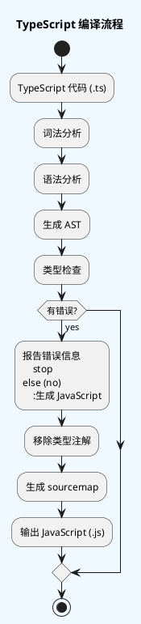

# TypeScript 面试题汇总

> 面试官：TypeScript相比JavaScript有什么优势？
> 面试者：TypeScript是JavaScript的超集，它为JavaScript添加了可选的静态类型系统和面向对象特性，使得大型项目的开发更加安全和高效。

---

## 第一章：TypeScript 入门与基础

### 1.1 为什么学习 TypeScript

**面试官提问**

TypeScript 是由微软开发的 JavaScript 超集。它为 JavaScript 添加了可选的静态类型、接口、泛型等高级特性，使得大型项目的开发更加安全和高效。

**主要优势包括**：

1. **强大的类型系统** - 在编译阶段就能发现潜在错误
2. **静态类型检查** - 代码在运行前就能发现类型错误
3. **完善的IDE支持** - 智能提示、代码导航、重构工具
4. **面向对象特性** - 类、接口、继承、抽象类
5. **现代JavaScript特性** - 支持最新的 ECMAScript 标准
6. **代码可读性和可维护性** - 类型即文档
7. **更好的团队协作** - 类型定义明确，减少沟通成本
8. **生态系统丰富** - 主流框架都提供 TypeScript 支持

---

### 1.2 TypeScript 与 JavaScript 的区别

**面试官提问**

| 特性 | JavaScript | TypeScript |
|------|------------|------------|
| 类型系统 | 动态类型 | 静态类型（可选） |
| 编译时检查 | 无 | 有 |
| 代码提示 | 有限 | 完整且准确 |
| 重构支持 | 困难 | 容易且安全 |
| 学习曲线 | 低 | 中等 |
| 运行时代码 | 直接执行 | 编译为 JavaScript |
| 接口/抽象类 | 不支持 | 完全支持 |
| 泛型 | 不支持 | 支持 |
| 装饰器 | 不支持 | 支持 |
| 模块系统 | ES Modules | ES Modules + namespace |

---

### 1.3 TypeScript 环境搭建与配置

**面试官提问**

#### 1.3.1 安装 TypeScript

```bash
# 全局安装 TypeScript
npm install -g typescript

# 检查安装版本
tsc -v

# 初始化 TypeScript 项目
tsc --init
```

#### 1.3.2 编译 TypeScript 文件

```bash
# 编译单个文件
tsc app.ts

# 监听模式自动编译
tsc app.ts --watch

# 编译整个项目
tsc

# 编译并指定配置文件
tsc --project tsconfig.json
```

#### 1.3.3 tsconfig.json 配置文件详解

```json
{
    "compilerOptions": {
        /* 基础配置 */
        "target": "ES2020",                    // 目标 ECMAScript 版本
        "module": "ESNext",                    // 模块系统
        "lib": ["ES2020", "DOM"],             // 引入的库类型定义

        /* 严格模式 */
        "strict": true,                        // 启用所有严格类型检查选项
        "strictNullChecks": true,              // 严格的 null 和 undefined 检查
        "strictFunctionTypes": true,           // 严格的函数类型检查
        "strictPropertyInitialization": true,  // 严格的类属性初始化检查

        /* 模块解析 */
        "moduleResolution": "node",            // 模块解析策略
        "baseUrl": "./",                       // 基础路径
        "paths": {                             // 路径别名
            "@/*": ["src/*"]
        },
        "resolveJsonModule": true,              // 允许导入 JSON 文件

        /* 输出配置 */
        "outDir": "./dist",                    // 输出目录
        "rootDir": "./src",                   // 源代码目录
        "declaration": true,                  // 生成 .d.ts 类型声明文件
        "declarationDir": "./types",          // 类型声明文件输出目录

        /* JavaScript 支持 */
        "allowJs": true,                       // 允许编译 JavaScript 文件
        "checkJs": true,                      // 对 JavaScript 文件进行类型检查

        /* 其他选项 */
        "jsx": "react-jsx",                   // JSX 模式
        "esModuleInterop": true,              // 允许模块互操作
        "skipLibCheck": true,                  // 跳过库类型检查
        "forceConsistentCasingInFileNames": true, // 强制文件名大小写一致
        "isolatedModules": true,               // 将每个文件作为独立模块
        "noUnusedLocals": true,               // 检查未使用的局部变量
        "noUnusedParameters": true,           // 检查未使用的参数

        /* 实验性特性 */
        "experimentalDecorators": true,        // 启用装饰器
        "emitDecoratorMetadata": true,         // 装饰器元数据
    },
    "include": ["src/**/*"],                  // 包含的文件
    "exclude": ["node_modules", "dist"],      // 排除的文件
    "references": [{ "path": "./tsconfig.node.json" }]  // 项目引用
}
```

---

## 第二章：TypeScript 基础类型系统

### 2.1 JavaScript 原始类型

**面试官提问**

TypeScript 完全支持 JavaScript 的原始类型，并为其添加了类型注解功能。

#### 2.1.1 布尔类型 (boolean)

```typescript
// 布尔类型是最基本的类型，只有两个值：true 和 false
let isDone: boolean = false;
let isLoading: boolean = true;

// 布尔类型的运算
const isActive: boolean = !isDone;           // 取反
const canAccess: boolean = isDone && isLoading;  // 与运算
const hasPermission: boolean = isDone || isLoading;  // 或运算
```

#### 2.1.2 数字类型 (number)

```typescript
// JavaScript 中所有数字都是浮点数
let count: number = 10;
let decimal: number = 6.99;
let hex: number = 0xf00d;        // 十六进制 0xf00d = 61453
let binary: number = 0b1010;     // 二进制 0b1010 = 10
let octal: number = 0o744;       // 八进制 0o744 = 484

// 特殊数值
let infinity: number = Infinity;
let negativeInfinity: number = -Infinity;
let notANumber: number = NaN;

// 数值运算
const sum: number = count + decimal;        // 加法
const product: number = count * decimal;    // 乘法
const quotient: number = count / decimal;   // 除法
const remainder: number = count % decimal;  // 取余
const power: number = 2 ** 10;              // 幂运算 2^10 = 1024
```

#### 2.1.3 字符串类型 (string)

```typescript
// 字符串可以用单引号、双引号或模板字符串
let name: string = "Tom";
let greeting: string = 'Hello';
let template: string = `Hello, ${name}!`;  // 模板字符串

// 字符串方法
const upperName: string = name.toUpperCase();  // 转大写
const lowerName: string = name.toLowerCase();  // 转小写
const length: number = name.length;            // 长度
const substr: string = name.substring(0, 2);  // 截取

// 字符串模板的高级用法
const message: string = `
    欢迎 ${name}!
    今天是 ${new Date().toLocaleDateString()}
    您的账户余额: ${1000.00.toFixed(2)}
`;

// 多行字符串
const html: string = `
<div class="container">
    <h1>Hello</h1>
    <p>World</p>
</div>
`;
```

#### 2.1.4 数组类型 (array)

```typescript
// 数组的两种定义方式
let list: number[] = [1, 2, 3];
let list2: Array<number> = [1, 2, 3];  // 泛型数组

// 数组操作
list.push(4);           // 添加元素
list.pop();             // 移除最后一个元素
list.shift();           // 移除第一个元素
list.unshift(0);       // 添加到开头
const sliced: number[] = list.slice(1, 3);  // 切片
const mapped: number[] = list.map(x => x * 2);  // 映射
const filtered: number[] = list.filter(x => x > 2);  // 过滤

// 数组类型推断
const numbers = [1, 2, 3];  // TypeScript 会推断为 number[]
const strings = ["a", "b"];  // TypeScript 会推断为 string[]
const mixed = [1, "a"];     // TypeScript 会推断为 (string | number)[]

// 只读数组
const readonlyList: readonly number[] = [1, 2, 3];
// readonlyList.push(4);  // 错误：不能修改只读数组

// 使用 ReadonlyArray
const immutableList: ReadonlyArray<number> = [1, 2, 3];
```

#### 2.1.5 元组类型 (tuple)

```typescript
// 元组表示固定长度和类型的数组
let tuple: [string, number];
tuple = ["hello", 10];  // 正确
// tuple = [10, "hello"];  // 错误：顺序不对
// tuple = ["hello"];  // 错误：长度不对
// tuple = ["hello", 10, "extra"];  // 错误：长度超出

// 可选元素的元组
let optionalTuple: [string, number?];
optionalTuple = ["hello"];      // 正确
optionalTuple = ["hello", 10];  // 正确

// 具名元组（TypeScript 4.0+）
const httpResponse: [status: number, body: string] = [200, "OK"];

// 元组的解构
const [status, body] = httpResponse;

// 剩余元素
let restTuple: [string, ...number[]];
restTuple = ["hello", 1, 2, 3, 4];  // 第一个是 string，后面任意数量的 number

// 元组的使用场景
function getUser(): [string, number, boolean] {
    return ["Tom", 25, true];
}

const [username, age, isActive] = getUser();
```

#### 2.1.6 枚举类型 (enum)

```typescript
// 数字枚举
enum Color {
    Red,     // 默认从 0 开始
    Green,   // 1
    Blue     // 2
}

let c: Color = Color.Green;

// 字符串枚举
enum Direction {
    Up = "UP",
    Down = "DOWN",
    Left = "LEFT",
    Right = "RIGHT"
}

const direction: Direction = Direction.Up;

// 异构枚举（混合数字和字符串）
enum BooleanLikeHeterogeneousEnum {
    No = 0,
    Yes = "YES"
}

// 手动指定枚举值
enum Month {
    January = 1,
    February = 2,
    March = 3,
    // ...
    December = 12
}

// 常量枚举（编译时内联）
const enum Directions {
    Up,
    Down,
    Left,
    Right
}

let d = Directions.Up;  // 编译后变成 let d = 0;

// 枚举的反向映射
enum Enum {
    A
}

let a = Enum.A;
let aName = Enum[a];  // "A" - 反向映射

// 枚举作为联合类型使用
enum Status {
    Pending = "pending",
    Approved = "approved",
    Rejected = "rejected"
}

function processStatus(status: Status): void {
    if (status === Status.Pending) {
        console.log("处理中...");
    } else if (status === Status.Approved) {
        console.log("已批准");
    } else if (status === Status.Rejected) {
        console.log("已拒绝");
    }
}
```

#### 2.1.7 Any 类型

```typescript
// any 表示任意类型，可以是任何值
let notSure: any = 4;
notSure = "maybe a string";
notSure = false;

// any 类型可以调用任何方法而不会报错
notSure.toString();
notSure.foo();
notSure.bar();

// any 类型的数组
let anyList: any[] = [1, "hello", true, { name: "Tom" }];

// any 的使用场景
// 1. 渐进式迁移 JavaScript 项目
// 2. 不确定变量的类型
// 3. 第三方库没有类型定义

function parseJSON(json: string): any {
    return JSON.parse(json);
}

const result = parseJSON('{"name": "Tom"}');
console.log(result.name);  // 可能有问题
```

#### 2.1.8 Void 类型

```typescript
// void 表示没有返回值
function warnUser(): void {
    console.log("This is a warning");
    // 没有 return 语句，或者 return undefined;
}

// void 和 undefined 的区别
function returnsVoid(): void {
    return undefined;  // 合法
}

function returnsUndefined(): undefined {
    // return void;  // 报错
    return undefined;
}

// void 类型的变量
let unusable: void = undefined;
// unusable = null;  // 在 strictNullChecks 下会报错
```

#### 2.1.9 Null 和 Undefined

```typescript
// null 和 undefined
let u: undefined = undefined;
let n: null = null;

// 默认情况下，null 和 undefined 是所有类型的子类型
let num: number = undefined;
let str: string = null;

// strictNullChecks 开启后，需要显式处理
let num2: number | undefined = undefined;
let str2: string | null = null;

// 可选参数默认就是 undefined
function greet(name?: string): void {
    if (name === undefined) {
        console.log("Hello, stranger!");
    } else {
        console.log(`Hello, ${name}!`);
    }
}

// 可选属性默认可以是 undefined
interface Person {
    name: string;
    age?: number;
}

const person: Person = { name: "Tom" };  // age 是 undefined
```

#### 2.1.10 Never 类型

```typescript
// never 表示永不返回值的类型

// 1. 抛出异常的函数
function error(message: string): never {
    throw new Error(message);
}

// 2. 无限循环的函数
function infiniteLoop(): never {
    while (true) {
        // 无限循环，永不返回
    }
}

// 3. 永远不存在的类型
type Never = string & number;  // never，string 和 number 没有交集

// never 的使用场景
// 1. 穷尽检查
function processStatus(status: "pending" | "approved" | "rejected"): string {
    switch (status) {
        case "pending":
            return "处理中";
        case "approved":
            return "已批准";
        case "rejected":
            return "已拒绝";
        default:
            // 确保所有情况都被处理
            const _exhaustive: never = status;
            return _exhaustive;
    }
}

// 2. 过滤never类型
type NonNever<T> = T extends never ? never : T;
// 这会返回 never，因为 never 会分发成空联合
```

#### 2.1.11 Object 类型

```typescript
// object 表示非原始类型
let obj: object = { name: "Tom" };
let arr: object = [1, 2, 3];
let func: object = function() {};

// 更精确的对象类型
let person: { name: string; age: number } = {
    name: "Tom",
    age: 25
};

// 可选属性
let partial: { name?: string; age?: number } = {};

// 索引签名
let dict: { [key: string]: number } = {};
dict["one"] = 1;
```

---

### 2.2 any、unknown、never 的区别与使用场景

**面试官提问**

这三个特殊类型是 TypeScript 类型系统中的重要概念，它们各有特点和使用场景。

#### 2.2.1 any 类型

`any` 是任意类型，可以对其进行任意操作而不会报错。它相当于关闭了 TypeScript 的类型检查。

```typescript
let x: any = 10;
x = "hello";
x = true;
x.foo();        // 不会报错
x.bar.baz();    // 不会报错

// any 数组
const anyArray: any[] = [1, "string", true, {}];

// 使用 any 的场景
// 1. 迁移 JavaScript 项目
// 2. 动态内容，无法预知类型
// 3. 第三方库没有类型定义

// 不推荐：过度使用 any 会失去 TypeScript 的类型安全优势
```

#### 2.2.2 unknown 类型

`unknown` 是 TypeScript 3.0 引入的"安全 any"。它要求在使用前进行类型检查，否则无法进行任何操作。

```typescript
let y: unknown = 10;
y = "hello";
y = true;

// y.foo();  // 报错：Object is of type 'unknown'

// 必须进行类型检查后才能使用
if (typeof y === "string") {
    console.log(y.toUpperCase());  // OK
}

// 类型断言
const str: string = y as string;
console.log(str.length);

// unknown 的使用场景
// 1. API 输入输出
// 2. 不确定但需要进行类型检查的值

function parseJSON(json: string): unknown {
    return JSON.parse(json);
}

const result = parseJSON('{"name": "Tom"}');
if (typeof result === "object" && result !== null) {
    if ("name" in result) {
        console.log((result as { name: string }).name);
    }
}
```

#### 2.2.3 never 类型

`never` 表示永不返回的值的类型。它通常用于表示异常或无限循环。

```typescript
// 抛出异常
function throwError(message: string): never {
    throw new Error(message);
}

// 无限循环
function infiniteLoop(): never {
    while (true) {}
}

// 永远不返回的函数类型
type Continue = () => never;

// never 在联合类型中的作用
type T1 = string | never;  // string
type T2 = any | never;     // any

// never 在交叉类型中的作用
type T3 = string & never;  // never
```

#### 2.2.4 三者对比

| 特性 | any | unknown | never |
|------|-----|---------|-------|
| 类型检查 | 无 | 有 | 不适用 |
| 赋值给其他类型 | 可以 | 不可以 | 可以 |
| 可访问属性 | 可以 | 不可以 | 不可以 |
| 使用场景 | 迁移JS、动态类型 | API类型安全 | 异常处理、穷尽检查 |

```typescript
// any: 关闭类型检查
let anyValue: any = "hello";
anyValue.toFixed(2);  // 不会报错

// unknown: 需要类型检查
let unknownValue: unknown = "hello";
// unknownValue.toFixed(2);  // 报错
if (typeof unknownValue === "number") {
    unknownValue.toFixed(2);  // OK
}

// never: 永不返回
function fail(): never {
    throw new Error("failed");
}
```

---

## 第三章：接口与类型别名

### 3.1 接口的定义和使用

**面试官提问**

接口（Interface）是 TypeScript 中定义对象结构的核心方式。

#### 3.1.1 基本接口定义

```typescript
// 定义对象的结构
interface Person {
    name: string;
    age: number;
    email?: string;     // 可选属性
    readonly id: number;  // 只读属性
}

const person: Person = {
    name: "Tom",
    age: 25,
    id: 1
};

// person.id = 2;  // 报错：id 是只读的

// 使用可选属性
const person2: Person = {
    name: "Jerry",
    age: 30
};  // email 是可选的，可以省略
```

#### 3.1.2 接口的方法

```typescript
interface Animal {
    name: string;
    speak(): void;           // 方法
    move(distance: number): void;  // 带参数的方法
}

class Dog implements Animal {
    name = "Dog";

    speak(): void {
        console.log("Woof!");
    }

    move(distance: number): void {
        console.log(`Dog moved ${distance}m`);
    }
}

const dog = new Dog();
dog.speak();        // 输出: Woof!
dog.move(10);       // 输出: Dog moved 10m
```

#### 3.1.3 接口的继承

```typescript
// 单继承
interface Named {
    name: string;
}

interface Person extends Named {
    age: number;
}

// 多继承
interface Logger {
    log(message: string): void;
}

interface Serializable {
    serialize(): string;
}

interface PersistentLogger extends Logger, Serializable {
    save(): void;
}
```

#### 3.1.4 接口的混合类型

```typescript
interface Counter {
    (start: number): void;
    count: number;
    reset(): void;
}

function createCounter(): Counter {
    const counter = ((start: number) => {
        counter.count = start;
    }) as Counter;
    counter.count = 0;
    counter.reset = () => {
        counter.count = 0;
    };
    return counter;
}

const counter = createCounter();
counter(10);
counter.count;     // 10
counter.reset();
counter.count;     // 0
```

#### 3.1.5 接口的函数类型

```typescript
// 直接定义函数类型
interface SearchFunc {
    (source: string, subString: string): boolean;
}

const search: SearchFunc = (source, subString) => {
    return source.includes(subString);
};

// 使用类型别名定义函数类型
type SearchFunction = (source: string, subString: string) => boolean;

const search2: SearchFunction = (source, subString) => {
    return source.indexOf(subString) !== -1;
};
```

#### 3.1.6 接口的索引签名

```typescript
// 字符串索引签名
interface StringDictionary {
    [key: string]: string;
}

const dict: StringDictionary = {
    hello: "world",
    foo: "bar"
};

// 数字索引签名
interface NumberArray {
    [index: number]: string;
}

const arr: NumberArray = ["a", "b", "c"];

// 混合索引签名
interface Hybrid {
    [key: string]: any;
    length: number;
    [index: number]: string;
}
```

#### 3.1.7 接口的只读索引签名

```typescript
interface ReadonlyStringArray {
    readonly [index: number]: string;
}

const arr2: ReadonlyStringArray = ["a", "b", "c"];
// arr2[0] = "d";  // 报错：无法修改只读属性
```

---

### 3.2 类型别名的使用

**面试官提问**

类型别名（Type Alias）使用 `type` 关键字定义，可以为任意类型创建别名。

#### 3.2.1 基本类型别名

```typescript
// 简单类型别名
type Name = string;
type Age = number;
type Callback = () => void;

// 对象类型别名
type Point = { x: number; y: number };
type Person = { name: string; age: number };

// 函数类型别名
type SumFunction = (a: number, b: number) => number;
```

#### 3.2.2 联合类型别名

```typescript
// 联合类型
type ID = string | number;
type Status = "pending" | "approved" | "rejected";
type Result<T> = { success: true; data: T } | { success: false; error: string };

// 使用示例
type UserId = string | number;
type ResponseStatus = 200 | 201 | 400 | 404 | 500;
```

#### 3.2.3 交叉类型别名

```typescript
// 交叉类型
type ExtendedPerson = Person & { email: string; phone: string };

// 合并多个类型
type Admin = Person & { role: "admin"; permissions: string[] };
```

#### 3.2.4 元组类型别名

```typescript
// 元组类型
type Coordinate = [number, number];
type RGB = [number, number, number];
type HTTPResponse = [status: number, body: string, headers?: Record<string, string>];
```

---

### 3.3 接口与类型别名的对比

**面试官提问**

虽然接口和类型别名看起来很相似，但它们有一些重要的区别。

#### 3.3.1 扩展方式

```typescript
// 接口使用 extends 扩展
interface Animal {
    name: string;
}

interface Dog extends Animal {
    breed: string;
}

// 类型别名使用交叉类型扩展
type Animal2 = {
    name: string;
};

type Dog2 = Animal2 & {
    breed: string;
};
```

#### 3.3.2 声明合并

```typescript
// 接口支持声明合并
interface User {
    name: string;
}

interface User {
    age: number;
}

// 合并后的 User 等同于：
interface User {
    name: string;
    age: number;
}

// 类型别名不支持声明合并，会报错
// type User = { name: string };
// type User = { age: number };  // Error: Duplicate identifier 'User'
```

#### 3.3.3 联合类型

```typescript
// 接口不支持联合类型
// interface Foo = string | number;  // Error

// 类型别名支持联合类型
type Foo = string | number;
```

#### 3.3.4 计算属性

```typescript
// 类型别名支持计算属性
type Keys = "firstName" | "lastName";
type Person = {
    [K in Keys]: string;
};

// 接口不支持计算属性
```

#### 3.3.5 选择建议

```typescript
// 推荐使用接口的场景：
// - 定义对象的形状
// - 需要声明合并
// - 需要被类实现

interface Animal {
    name: string;
    speak(): void;
}

class Dog implements Animal {
    name = "Dog";
    speak() {
        console.log("Woof!");
    }
}

// 推荐使用类型别名的场景：
// - 联合类型
// - 元组类型
// - 函数类型
// - 映射类型

type Status = "pending" | "approved" | "rejected";
type Callback<T> = (error: Error | null, result?: T) => void;
type Readonly<T> = {
    readonly [P in keyof T]: T[P];
};
```

---

## 第四章：泛型

### 4.1 泛型函数与泛型类

**面试官提问**

泛型（Generics）是 TypeScript 最强大的特性之一，它允许创建可复用的组件，能够支持多种类型而不丢失类型信息。

#### 4.1.1 泛型函数

```typescript
// 基本的泛型函数
function identity<T>(arg: T): T {
    return arg;
}

// 显式指定类型参数
let output = identity<string>("hello");

// 类型推断
let output2 = identity("hello");  // TypeScript 自动推断为 string

// 泛型函数的多参数
function pair<K, V>(key: K, value: V): [K, V] {
    return [key, value];
}

const p = pair("name", "Tom");  // [string, string]
const p2 = pair<number, string>(1, "value");  // [number, string]
```

#### 4.1.2 泛型接口

```typescript
// 泛型接口
interface GenericIdentityFn<T> {
    (arg: T): T;
}

function identity<T>(arg: T): T {
    return arg;
}

let myIdentity: GenericIdentityFn<number> = identity;

// 多参数的泛型接口
interface Map<K, V> {
    get(key: K): V | undefined;
    set(key: K, value: V): void;
    has(key: K): boolean;
    delete(key: K): boolean;
}

const map: Map<string, number> = new Map();
map.set("one", 1);
map.get("one");  // number | undefined
```

#### 4.1.3 泛型类

```typescript
// 泛型类
class GenericNumber<T> {
    zeroValue: T;
    add: (x: T, y: T) => T;

    constructor(zeroValue: T, addFn: (x: T, y: T) => T) {
        this.zeroValue = zeroValue;
        this.add = addFn;
    }
}

const numberGeneric = new GenericNumber<number>(0, (x, y) => x + y);
numberGeneric.add(5, 10);  // 15

const stringGeneric = new GenericNumber<string>("", (x, y) => x + y);
stringGeneric.add("Hello", " World");  // "Hello World"

// 泛型约束
class GenericNumberWithConstraint<T extends number | string> {
    // ...
}
```

#### 4.1.4 泛型默认参数

```typescript
// 泛型默认参数
interface ApiResponse<T = string> {
    data: T;
    status: number;
}

const response1: ApiResponse = { data: "success", status: 200 };
const response2: ApiResponse<{ name: string }> = {
    data: { name: "Tom" },
    status: 200
};

// 函数默认类型参数
function createArray<T = string>(length: number, value: T): T[] {
    return Array(length).fill(value);
}

const arr1 = createArray(3);  // string[]
const arr2 = createArray(3, 0);  // number[]
```

---

### 4.2 泛型约束

**面试官提问**

泛型约束用于限制泛型类型参数的范围。

#### 4.2.1 使用 extends 关键字

```typescript
// 约束泛型必须具有 length 属性
interface Lengthwise {
    length: number;
}

function loggingIdentity<T extends Lengthwise>(arg: T): T {
    console.log(arg.length);
    return arg;
}

loggingIdentity("hello");           // 字符串有 length
loggingIdentity([1, 2, 3]);         // 数组有 length
loggingIdentity({ length: 10 });    // 对象字面量有 length
// loggingIdentity(123);            // 错误：数字没有 length

// 约束泛型必须继承特定类型
class Base {
    id: number;
}

class Derived extends Base {
    name: string;
}

function createInstance<T extends Base>(cls: new () => T): T {
    return new cls();
}

const instance = createInstance(Derived);
```

#### 4.2.2 使用 keyof 约束

```typescript
// 使用 keyof 约束 keyof 操作符
function getProperty<T, K extends keyof T>(obj: T, key: K): T[K] {
    return obj[key];
}

const person = { name: "Tom", age: 25, id: 1 };
getProperty(person, "name");  // string
getProperty(person, "age");    // number
// getProperty(person, "email");  // 错误："email" 不在 person 中

// 约束返回对象的某些属性
function pick<T, K extends keyof T>(obj: T, keys: K[]): Pick<T, K> {
    const result = {} as Pick<T, K>;
    for (const key of keys) {
        result[key] = obj[key];
    }
    return result;
}

const picked = pick(person, ["name", "age"]);  // { name: string, age: number }
```

#### 4.2.3 多重约束

```typescript
// 多重约束
interface Serializable {
    serialize(): string;
}

interface Deserializable {
    deserialize(str: string): void;
}

class DataHandler<T extends Serializable & Deserializable> {
    handle(data: T): string {
        return data.serialize();
    }

    parse(str: string, target: T): void {
        target.deserialize(str);
    }
}
```

#### 4.2.4 泛型约束的实际应用

```typescript
// 创建不可变数组
type ReadonlyArray<T> = {
    readonly [P in keyof T]: T[P];
};

// 类型守卫
function isType<T>(value: any, key: string): value is T {
    return typeof value === key;
}

// 工厂函数
function create<T>(c: new () => T): T {
    return new c();
}

// 延迟类型推断
function lazy<T>(fn: () => T): () => T {
    let cache: T;
    return () => {
        if (!cache) {
            cache = fn();
        }
        return cache;
    };
}
```

---

### 4.3 泛型高级特性

#### 4.3.1 泛型中使用 infer

```typescript
// 提取函数返回类型
type ReturnType<T> = T extends (...args: any[]) => infer R ? R : never;

type R1 = ReturnType<() => string>;  // string
type R2 = ReturnType<(x: number) => boolean>;  // boolean

// 提取构造函数参数
type ConstructorParameters<T> = T extends new (...args: infer P) => any ? P : never;

type CP = ConstructorParameters<new (name: string, age: number) => Person>;
// [string, number]

// 提取Promise结果
type PromiseResult<T> = T extends Promise<infer R> ? R : never;

type PR = PromiseResult<Promise<string>>;  // string
```

#### 4.3.2 泛型分发

```typescript
// 联合类型的分发
type ToArray<T> = T extends any ? T[] : never;

type Arr = ToArray<string | number>;  // string[] | number[]

// 映射类型的分发
type Mapped<T> = {
    [P in keyof T]: T[P][];
};

type M = Mapped<{ a: string; b: number }>;
// { a: string[]; b: number[] }
```

#### 4.3.3 泛型模板字面量

```typescript
// 生成事件处理器类型
type EventName = "click" | "focus" | "blur";
type EventHandler<T extends EventName> = `on${Capitalize<T>}`;

type ClickHandler = EventHandler<"click">;  // "onClick"
type FocusHandler = EventHandler<"focus">;  // "onFocus"

// 生成setter和getter
type PropertyAccessors<T> = {
    [K in keyof T as `get${Capitalize<K & string>}`]: () => T[K];
} & {
    [K in keyof T as `set${Capitalize<K & string>}`]: (value: T[K]) => void;
};

type Accessors = PropertyAccessors<{ name: string; age: number }>;
// {
//     getName: () => string;
//     setName: (value: string) => void;
//     getAge: () => number;
//     setAge: (value: number) => void;
// }
```

---

## 第五章：类与面向对象

### 5.1 类的定义和使用

**面试官提问**

#### 5.1.1 基本类定义

```typescript
class Greeter {
    greeting: string;

    constructor(message: string) {
        this.greeting = message;
    }

    greet(): string {
        return "Hello, " + this.greeting;
    }
}

const greeter = new Greeter("World");
greeter.greet();  // "Hello, World"
```

#### 5.1.2 类的继承

```typescript
class Animal {
    name: string;

    constructor(name: string) {
        this.name = name;
    }

    speak(): void {
        console.log(`${this.name} makes a sound`);
    }
}

class Dog extends Animal {
    breed: string;

    constructor(name: string, breed: string) {
        super(name);  // 调用父类构造函数
        this.breed = breed;
    }

    speak(): void {
        console.log(`${this.name} barks`);
    }

    fetch(): void {
        console.log(`${this.name} fetches the ball`);
    }
}

const dog = new Dog("Rex", "German Shepherd");
dog.speak();  // "Rex barks"
dog.fetch();  // "Rex fetches the ball"
```

#### 5.1.3 类的多态

```typescript
class Cat extends Animal {
    speak(): void {
        console.log(`${this.name} meows`);
    }
}

function makeAnimalSpeak(animal: Animal): void {
    animal.speak();
}

const dog = new Dog("Rex", "German Shepherd");
const cat = new Cat("Whiskers");

makeAnimalSpeak(dog);  // "Rex barks"
makeAnimalSpeak(cat);  // "Whiskers meows"
```

---

### 5.2 访问修饰符

**面试官提问**

TypeScript 支持三种访问修饰符：`public`、`protected` 和 `private`。

#### 5.2.1 public 修饰符

```typescript
class Person {
    public name: string;    // 公开属性
    public age: number;    // 公开属性

    public constructor(name: string, age: number) {
        this.name = name;
        this.age = age;
    }

    public greet(): void {  // 公开方法
        console.log(`Hello, I'm ${this.name}`);
    }
}

const person = new Person("Tom", 25);
person.name = "Jerry";  // 可以访问和修改
person.greet();         // 可以调用
```

#### 5.2.2 protected 修饰符

```typescript
class Person {
    public name: string;
    protected age: number;  // 受保护属性

    constructor(name: string, age: number) {
        this.name = name;
        this.age = age;
    }

    protected getAge(): number {
        return this.age;
    }
}

class Employee extends Person {
    private salary: number;

    constructor(name: string, age: number, salary: number) {
        super(name, age);
        this.salary = salary;
    }

    public showInfo(): void {
        console.log(`${this.name}, ${this.getAge()}`);  // 可以访问 protected
        // console.log(this.age);  // 错误：子类不能直接访问
    }
}

const emp = new Employee("Tom", 25, 5000);
console.log(emp.name);  // 可以访问 public
// console.log(emp.age);  // 错误：protected 不能在类外部访问
```

#### 5.2.3 private 修饰符

```typescript
class BankAccount {
    private balance: number;
    public readonly accountNumber: string;

    constructor(accountNumber: string, initialBalance: number = 0) {
        this.accountNumber = accountNumber;
        this.balance = initialBalance;
    }

    public deposit(amount: number): void {
        if (amount > 0) {
            this.balance += amount;
        }
    }

    public withdraw(amount: number): boolean {
        if (amount > 0 && amount <= this.balance) {
            this.balance -= amount;
            return true;
        }
        return false;
    }

    public getBalance(): number {
        return this.balance;
    }
}

const account = new BankAccount("123456789", 1000);
account.deposit(500);
account.withdraw(200);
console.log(account.getBalance());  // 1300
// console.log(account.balance);  // 错误：private 不能在类外部访问
```

#### 5.2.4 readonly 修饰符

```typescript
class User {
    public readonly id: number;
    public name: string;
    private _age: number;

    constructor(id: number, name: string, age: number) {
        this.id = id;
        this.name = name;
        this._age = age;
    }

    // 静态只读属性
    public static readonly MAX_AGE: number = 150;
}

// 静态只读属性
console.log(User.MAX_AGE);  // 150

const user = new User(1, "Tom", 25);
// user.id = 2;  // 错误：readonly 不能修改
```

#### 5.2.5 访问修饰符总结

| 修饰符 | 类内部 | 子类 | 类外部 |
|--------|--------|------|--------|
| public | 可以 | 可以 | 可以 |
| protected | 可以 | 可以 | 不可以 |
| private | 可以 | 不可以 | 不可以 |

---

### 5.3 抽象类

**面试官提问**

抽象类不能直接实例化，只能作为基类被继承。

```typescript
abstract class Animal {
    abstract name: string;  // 抽象属性

    abstract speak(): void;  // 抽象方法

    // 抽象类可以有具体实现的方法
    move(): void {
        console.log(`${this.name} is moving`);
    }
}

// const animal = new Animal();  // 错误：不能实例化抽象类

class Dog extends Animal {
    name = "Dog";

    speak(): void {
        console.log("Woof!");
    }
}

class Cat extends Animal {
    name = "Cat";

    speak(): void {
        console.log("Meow!");
    }
}

const dog = new Dog();
dog.speak();  // "Woof!"
dog.move();   // "Dog is moving"
```

---

### 5.4 静态成员

```typescript
class MathUtils {
    static readonly PI: number = 3.14159;

    static add(a: number, b: number): number {
        return a + b;
    }

    static calculateCircleArea(radius: number): number {
        return this.PI * radius * radius;
    }
}

console.log(MathUtils.PI);        // 3.14159
console.log(MathUtils.add(1, 2)); // 3
console.log(MathUtils.calculateCircleArea(5));  // 78.53975
```

---

### 5.5 Getter 和 Setter

```typescript
class User {
    private _name: string;
    private _age: number;

    constructor(name: string, age: number) {
        this._name = name;
        this._age = age;
    }

    // Getter
    get name(): string {
        return this._name;
    }

    // Setter
    set name(value: string) {
        if (value.length > 0) {
            this._name = value;
        }
    }

    get age(): number {
        return this._age;
    }

    set age(value: number) {
        if (value >= 0 && value <= 150) {
            this._age = value;
        }
    }

    // 完整属性
    get isAdult(): boolean {
        return this._age >= 18;
    }
}

const user = new User("Tom", 25);
console.log(user.name);    // "Tom"
user.name = "Jerry";
console.log(user.name);    // "Jerry"
console.log(user.isAdult); // true
```

---

## 第六章：装饰器

### 6.1 装饰器概述

**面试官提问**

装饰器（Decorators）是 TypeScript 的一项实验性特性，它允许在类、方法、访问器、属性或参数上添加元数据或修改行为。

**启用装饰器**：

```json
{
    "compilerOptions": {
        "experimentalDecorators": true,
        "emitDecoratorMetadata": true
    }
}
```

---

### 6.2 类装饰器

**面试官提问**

类装饰器应用于类构造函数，可以修改或替换类定义。

#### 6.2.1 简单类装饰器

```typescript
// 简单类装饰器
function sealed(constructor: Function) {
    Object.seal(constructor);
    Object.seal(constructor.prototype);
}

@sealed
class Greeter {
    greeting: string;
    constructor(message: string) {
        this.greeting = message;
    }
}

// @sealed 相当于：
// Greeter = sealed(Greeter);
```

#### 6.2.2 类装饰器（带参数）

```typescript
// 装饰器工厂 - 返回装饰器函数
function color(color: string) {
    return function <T extends Function>(constructor: T): T {
        constructor.prototype.color = color;
        return constructor;
    };
}

@color("red")
class Car {
    brand: string;

    constructor(brand: string) {
        this.brand = brand;
    }
}

const car = new Car("Tesla");
// car.color === "red"
```

#### 6.2.3 类装饰器修改类

```typescript
function addStaticProperties<T extends Function>(constructor: T): T {
    // 添加静态属性
    (constructor as any).version = "1.0.0";
    (constructor as any).create = function() {
        return new constructor("Default");
    };

    // 添加实例方法
    constructor.prototype.log = function() {
        console.log("Instance method");
    };

    return constructor;
}

@addStaticProperties
class Logger {
    name: string;

    constructor(name: string) {
        this.name = name;
    }
}

console.log(Logger.version);  // "1.0.0"
const logger = Logger.create();
logger.log();  // "Instance method"
```

---

### 6.3 方法装饰器

**面试官提问**

方法装饰器应用于类的方法，可以修改方法的属性或行为。

#### 6.3.1 方法装饰器签名

```typescript
function methodDecorator(
    target: any,
    propertyKey: string,
    descriptor: PropertyDescriptor
): PropertyDescriptor {
    return descriptor;
}
```

#### 6.3.2 方法装饰器示例

```typescript
// 日志装饰器
function log(target: any, propertyKey: string, descriptor: PropertyDescriptor) {
    const originalMethod = descriptor.value;

    descriptor.value = function(...args: any[]) {
        console.log(`Calling ${propertyKey} with args:`, args);
        const result = originalMethod.apply(this, args);
        console.log(`${propertyKey} returned:`, result);
        return result;
    };

    return descriptor;
}

// 可枚举装饰器
function enumerable(value: boolean) {
    return function(
        target: any,
        propertyKey: string,
        descriptor: PropertyDescriptor
    ) {
        descriptor.enumerable = value;
    };
}

class Calculator {
    @enumerable(false)
    add(a: number, b: number): number {
        return a + b;
    }

    @log
    multiply(a: number, b: number): number {
        return a * b;
    }
}

const calc = new Calculator();
calc.multiply(3, 4);
// 输出:
// Calling multiply with args: [3, 4]
// multiply returned: 12
```

#### 6.3.3 缓存装饰器

```typescript
function memoize(target: any, propertyKey: string, descriptor: PropertyDescriptor) {
    const originalMethod = descriptor.value;
    const cache = new Map<string, any>();

    descriptor.value = function(...args: any[]) {
        const key = JSON.stringify(args);
        if (cache.has(key)) {
            return cache.get(key);
        }
        const result = originalMethod.apply(this, args);
        cache.set(key, result);
        return result;
    };

    return descriptor;
}

class Fibonacci {
    @memoize
    calculate(n: number): number {
        if (n <= 1) return n;
        return this.calculate(n - 1) + this.calculate(n - 2);
    }
}

const fib = new Fibonacci();
console.log(fib.calculate(40));  // 102334155 (快速，使用缓存)
```

---

### 6.4 属性装饰器

**面试官提问**

属性装饰器应用于类的属性。

#### 6.4.1 属性装饰器示例

```typescript
// 只读装饰器
function readonly(target: any, propertyKey: string) {
    Object.defineProperty(target, propertyKey, {
        writable: false,
        configurable: true
    });
}

// 默认值装饰器
function defaultValue(value: any) {
    return function(target: any, propertyKey: string) {
        let initialValue = value;

        Object.defineProperty(target, propertyKey, {
            get: function() {
                return initialValue;
            },
            set: function(newValue) {
                initialValue = newValue;
            },
            configurable: true,
            enumerable: true
        });
    };
}

// 验证装饰器
function validate(target: any, propertyKey: string) {
    let value: number;

    Object.defineProperty(target, propertyKey, {
        get: function() {
            return value;
        },
        set: function(newValue: number) {
            if (newValue < 0) {
                throw new Error(`${propertyKey} must be non-negative`);
            }
            value = newValue;
        },
        configurable: true,
        enumerable: true
    });
}

class User {
    @readonly
    name: string = "Guest";

    @defaultValue(0)
    age: number;

    @validate
    score: number;
}

const user = new User();
user.name = "Tom";  // 错误：name 是只读的
user.age = 25;      // 可以设置
user.score = -10;   // 错误：score 必须是正数
```

---

### 6.5 参数装饰器

**面试官提问**

参数装饰器应用于函数的参数。

```typescript
// 参数装饰器
function logParameter(target: any, propertyKey: string, parameterIndex: number) {
    console.log(`Parameter at index ${parameterIndex} in ${propertyKey}`);
}

// 验证参数装饰器
function required(target: any, propertyKey: string, parameterIndex: number) {
    const metadataKey = `__required_${propertyKey}`;
    const requiredParams: number[] = (target[metadataKey] || []);
    requiredParams.push(parameterIndex);
    target[metadataKey] = requiredParams;
}

class UserService {
    createUser(
        @required name: string,
        @logParameter age: number
    ): void {
        console.log(`Creating user: ${name}, age: ${age}`);
    }
}

const service = new UserService();
service.createUser("Tom", 25);
// Parameter at index 1 in createUser
// Creating user: Tom, age: 25
```

---

### 6.6 装饰器组合

```typescript
// 多个装饰器可以组合使用
function first() {
    console.log("first(): evaluated");
    return function(target: any, propertyKey: string, descriptor: PropertyDescriptor) {
        console.log("first(): called");
    };
}

function second() {
    console.log("second(): evaluated");
    return function(target: any, propertyKey: string, descriptor: PropertyDescriptor) {
        console.log("second(): called");
    };
}

class Example {
    @first()
    @second()
    method() {}
}

// 输出:
// first(): evaluated
// second(): evaluated
// second(): called
// first(): called
// 装饰器从下到上评估，从上到下执行
```

---

## 第七章：高级类型

### 7.1 交叉类型

**面试官提问**

交叉类型（Intersection Types）将多个类型合并为一个类型，新类型包含所有类型的特性。

```typescript
interface Serializable {
    serialize(): string;
}

interface Deserializable {
    deserialize(str: string): void;
}

class DataHandler implements Serializable, Deserializable {
    serialize(): string {
        return JSON.stringify(this);
    }

    deserialize(str: string): void {
        Object.assign(this, JSON.parse(str));
    }
}

// 使用交叉类型
type DataHandlerType = Serializable & Deserializable;

function process(handler: DataHandlerType): void {
    const str = handler.serialize();
    handler.deserialize(str);
}

// 交叉类型的实际应用
type Extended<T, U> = T & U;

interface Person {
    name: string;
}

interface Worker {
    company: string;
}

type Employee = Extended<Person, Worker>;

const employee: Employee = {
    name: "Tom",
    company: "Google"
};
```

---

### 7.2 联合类型

**面试官提问**

联合类型（Union Types）表示一个值可以是几种类型之一。

```typescript
// 基本联合类型
let value: string | number;
value = "hello";
value = 42;
// value = true;  // 错误

// 联合类型的数组
const arr: (string | number)[] = [1, "hello", 2, "world"];

// 字面量联合类型
type Direction = "up" | "down" | "left" | "right";

function move(direction: Direction): void {
    switch (direction) {
        case "up":
            console.log("Moving up");
            break;
        case "down":
            console.log("Moving down");
            break;
        case "left":
            console.log("Moving left");
            break;
        case "right":
            console.log("Moving right");
            break;
    }
}

move("up");    // OK
move("north"); // 错误
```

---

### 7.3 类型守卫

**面试官提问**

类型守卫（Type Guards）用于在代码中收窄类型范围。

#### 7.3.1 typeof 类型守卫

```typescript
function padLeft(value: string | number, padding: number | string): string {
    if (typeof padding === "number") {
        return Array(padding + 1).join(" ") + value;
    }
    if (typeof padding === "string") {
        return padding + value;
    }
    throw new Error(`Expected string or number, got '${padding}'`);
}
```

#### 7.3.2 instanceof 类型守卫

```typescript
class Fish {
    swim(): void {
        console.log("Swimming");
    }
}

class Bird {
    fly(): void {
        console.log("Flying");
    }
}

function move(animal: Fish | Bird): void {
    if (animal instanceof Fish) {
        animal.swim();
    } else {
        animal.fly();
    }
}
```

#### 7.3.3 in 操作符

```typescript
interface A {
    a: string;
}

interface B {
    b: number;
}

function process(obj: A | B): void {
    if ("a" in obj) {
        console.log(obj.a);
    } else {
        console.log(obj.b);
    }
}
```

#### 7.3.4 自定义类型守卫

```typescript
interface Person {
    name: string;
    age: number;
}

function isPerson(p: any): p is Person {
    return p !== null &&
           typeof p === "object" &&
           "name" in p &&
           "age" in p;
}

function process(value: any): void {
    if (isPerson(value)) {
        console.log(value.name, value.age);
    }
}
```

---

### 7.4 可辨识联合类型

**面试官提问**

可辨识联合类型（Discriminated Unions）使用一个共有的字面量属性来区分不同的类型。

```typescript
interface Circle {
    kind: "circle";
    radius: number;
}

interface Rectangle {
    kind: "rectangle";
    width: number;
    height: number;
}

interface Triangle {
    kind: "triangle";
    base: number;
    height: number;
}

type Shape = Circle | Rectangle | Triangle;

function getArea(shape: Shape): number {
    switch (shape.kind) {
        case "circle":
            return Math.PI * shape.radius ** 2;
        case "rectangle":
            return shape.width * shape.height;
        case "triangle":
            return 0.5 * shape.base * shape.height;
        default:
            // 穷尽检查
            const _exhaustive: never = shape;
            throw new Error(`Unknown shape: ${_exhaustive}`);
    }
}
```

---

### 7.5 条件类型

**面试官提问**

条件类型（Conditional Types）根据条件选择类型。

```typescript
// 基本语法
type IsString<T> = T extends string ? true : false;

type A = IsString<string>;  // true
type B = IsString<number>;   // false

// 提取元素类型
type ArrayElement<T> = T extends (infer U)[] ? U : never;

type E1 = ArrayElement<string[]>;  // string
type E2 = ArrayElement<number[]>;   // number
type E3 = ArrayElement<boolean>;   // never

// 获取函数返回类型
type MyReturnType<T> = T extends (...args: any[]) => infer R ? R : never;

type R1 = MyReturnType<() => string>;  // string
type R2 = MyReturnType<(x: number) => boolean>;  // boolean

// 获取函数参数类型
type MyParameters<T> = T extends (...args: infer P) => any ? P : never;

type P1 = MyParameters<(a: string, b: number) => void>;  // [string, number]
```

---

### 7.6 映射类型

**面试官提问**

映射类型通过已有类型创建新类型。

```typescript
// Partial - 所有属性可选
type Partial<T> = {
    [P in keyof T]?: T[P];
};

// Required - 所有属性必需
type Required<T> = {
    [P in keyof T]-?: T[P];
};

// Readonly - 所有属性只读
type Readonly<T> = {
    readonly [P in keyof T]: T[P];
};

// Pick - 选择特定属性
type Pick<T, K extends keyof T> = {
    [P in K]: T[P];
};

// Omit - 排除特定属性
type Omit<T, K extends keyof T> = {
    [P in Exclude<keyof T, K>]: T[P];
};

// Record - 创建对象类型
type Record<K extends keyof any, T> = {
    [P in K]: T;
};

// 使用示例
interface User {
    id: number;
    name: string;
    email: string;
}

type PartialUser = Partial<User>;
type UserWithoutEmail = Omit<User, "email">;
type UserPreview = Pick<User, "id" | "name">;
type UserMap = Record<string, User>;
```

---

## 第八章：模块与命名空间

### 8.1 模块导出导入

**面试官提问**

#### 8.1.1 命名导出

```typescript
// named.ts
export interface Animal {
    name: string;
}

export class Dog implements Animal {
    name: string = "Dog";
}

export enum Color {
    Red,
    Green,
    Blue
}

export const PI = 3.14159;

export function add(a: number, b: number): number {
    return a + b;
}
```

#### 8.1.2 默认导出

```typescript
// default.ts
export default class Cat implements Animal {
    name: string = "Cat";
}

// 或者
class Cat implements Animal {
    name: string = "Cat";
}
export default Cat;
```

#### 8.1.3 导入方式

```typescript
// 命名导入
import { Animal, Dog, Color, add } from "./named";

// 默认导入
import Cat from "./default";

// 命名空间导入
import * as NS from "./named";

// 组合导入
import Animal, { Dog, Color } from "./named";

// 类型导入（仅导入类型）
import type { Animal, Dog } from "./named";
import { type Animal, Dog } from "./named";

// 重新导出
export { Animal, Dog } from "./named";
export * from "./named";
export { default } from "./default";
```

---

### 8.2 命名空间

```typescript
// Math.ts
namespace MathUtils {
    export function add(a: number, b: number): number {
        return a + b;
    }

    export function subtract(a: number, b: number): number {
        return a - b;
    }

    export namespace Advanced {
        export function power(base: number, exp: number): number {
            return Math.pow(base, exp);
        }
    }
}

// 使用
const sum = MathUtils.add(1, 2);
const power = MathUtils.Advanced.power(2, 10);
```

---

## 第九章：TypeScript 工具类型

### 9.1 常用工具类型详解

**面试官提问**

```typescript
// Partial<T> - 将所有属性设为可选
interface User {
    id: number;
    name: string;
    email: string;
}
type PartialUser = Partial<User>;
// { id?: number; name?: string; email?: string }

// Required<T> - 将所有属性设为必需
type RequiredUser = Required<PartialUser>;

// Readonly<T> - 将所有属性设为只读
type ReadonlyUser = Readonly<User>;

// Pick<T, K> - 选择特定属性
type UserPreview = Pick<User, "id" | "name">;

// Omit<T, K> - 排除特定属性
type UserWithoutEmail = Omit<User, "email">;

// Record<K, T> - 创建对象类型
type UserMap = Record<string, User>;

// Exclude<T, U> - 排除联合类型
type T = Exclude<"a" | "b" | "c", "a">;  // "b" | "c"

// Extract<T, U> - 提取联合类型
type T2 = Extract<"a" | "b" | "c", "a" | "f">;  // "a"

// NonNullable<T> - 排除 null 和 undefined
type T3 = NonNullable<string | null | undefined>;  // string

// ReturnType<T> - 获取函数返回类型
type R = ReturnType<typeof Math.random>;  // number

// Parameters<T> - 获取函数参数类型
type P = Parameters<(s: string) => void>;  // [string]

// ConstructorParameters<T> - 获取构造函数参数类型
type CP = ConstructorParameters<new (name: string) => object>;

// InstanceType<T> - 获取实例类型
type IT = InstanceType<typeof StringConstructor>;
```

---

### 9.2 高级工具类型实现

**面试官提问**

```typescript
// 自定义工具类型

// 深度 Partial
type DeepPartial<T> = {
    [P in keyof T]?: T[P] extends object ? DeepPartial<T[P]> : T[P];
};

// 深度 Readonly
type DeepReadonly<T> = {
    readonly [P in keyof T]: T[P] extends object ? DeepReadonly<T[P]> : T[P];
};

// 可选转必需
type RequiredKeys<T> = {
    [K in keyof T]: T[K] extends Required<T>[K] ? K : never;
}[keyof T];

// 可选属性名称
type OptionalKeys<T> = {
    [K in keyof T]: T[K] extends Required<T>[K] ? never : K;
}[keyof T];

// 函数必选参数
type RequiredFunc<T extends (...args: any[]) => any> = (
    ...args: Parameters<T>
) => ReturnType<T>;

// 移除函数第一个参数
type DropFirstArg<T extends (...args: any[]) => any> =
    T extends (arg: any, ...rest: infer R) => infer Result
        ? (...args: R) => Result
        : never;

// 交换函数参数
type SwapArgs<T extends (...args: any[]) => any> =
    T extends (...args: infer A) => infer R
        ? (...args: Reverse<A>) => R
        : never;

type Reverse<T extends any[]> = T extends [infer F, ...infer R]
    ? [...Reverse<R>, F]
    : [];
```

---

## 第十章：TypeScript 编译原理

### 10.1 TypeScript 编译器工作流程

**面试官提问**

1. **词法分析** - 将源代码转换为 token 流
2. **语法分析** - 生成抽象语法树（AST）
3. **类型检查** - 根据类型系统规则进行类型检查
4. **类型擦除** - 移除类型信息生成 JavaScript
5. **代码生成** - 输出最终的 JavaScript 代码



---

### 10.2 编译选项详解

```json
{
    "compilerOptions": {
        // 输出模块格式
        "module": "ESNext",           // ES modules
        "module": "CommonJS",         // CommonJS
        "module": "AMD",              // RequireJS
        "module": "UMD",              // 通用模块定义

        // 目标 ECMAScript 版本
        "target": "ES5",             // 广泛兼容
        "target": "ES2015" / "ES6",  // ES6
        "target": "ES2020",          // ES2020

        // 严格模式
        "strict": true,               // 开启所有严格检查
        "noImplicitAny": true,       // 禁止隐式 any
        "strictNullChecks": true,    // null/undefined 检查
        "strictPropertyInitialization": true,  // 属性初始化检查
        "noImplicitReturns": true,   // 检查返回值
        "noFallthroughCasesInSwitch": true,     // switch 贯穿检查
    }
}
```

---

## 第十一章：TypeScript 4.x 新特性

### 11.1 satisfies 操作符 (TS 4.9+)

**面试官提问**

`satisfies` 可以在保持类型推断的同时验证表达式是否符合特定类型。

```typescript
type Colors = "red" | "green" | "blue";
type RGB = [number, number, number];

// 不使用 satisfies - 类型被收窄
const palette: Record<string, Colors | RGB> = {
    red: [255, 0, 0],
    green: "green"
};
// palette.green.toUpperCase(); // 报错

// 使用 satisfies - 保留字面量类型
const palette2 = {
    red: [255, 0, 0],
    green: "green"
} satisfies Record<string, Colors | RGB>;

palette2.green.toUpperCase(); // OK! "green" 仍是 string
```

---

### 11.2 协变与逆变

**面试官提问**

```typescript
// 协变 - 子类型可以赋值给父类型
type Dog = { name: string; breed: string };
type Animal = { name: string };

const dog: Dog = { name: "Rex", breed: "Labrador" };
const animal: Animal = dog;  // OK - 协变

// 逆变 - 函数参数中父类型可以赋值给子类型
type FnDog = (dog: Dog) => void;
type FnAnimal = (animal: Animal) => void;

const fnDog: FnDog = (dog) => console.log(dog.breed);
const fnAnimal: FnAnimal = fnDog;  // OK - 逆变
```

---

### 11.3 Branded Types (品牌类型)

**面试官提问**

```typescript
type Brand<K, T> = K & { __brand: T };

type UserId = Brand<string, "UserId">;
type OrderId = Brand<string, "OrderId">;
type PositiveNumber = Brand<number, "PositiveNumber">;

function createUserId(id: string): UserId {
    return id as UserId;
}

function createOrderId(id: string): OrderId {
    return id as OrderId;
}

let uid = createUserId("123");
let oid = createOrderId("123");

// uid = oid; // 报错 - 类型不兼容
// uid = "123"; // 报错 - 不能直接赋值

// 使用品牌类型进行验证
function createPositiveNumber(n: number): PositiveNumber {
    if (n <= 0) throw new Error("Must be positive");
    return n as PositiveNumber;
}

const positive = createPositiveNumber(10);
// positive = -5; // 运行时仍可赋值，但可以添加额外验证
```

---

### 11.4 模板字面量类型

**面试官提问**

```typescript
// 事件处理器类型
type EventName = "click" | "focus" | "blur";
type EventHandler<T extends EventName> = `on${Capitalize<T>}`;

type ClickHandler = EventHandler<"click">;   // "onClick"
type FocusHandler = EventHandler<"focus">;    // "onFocus"

// 对象访问器类型
type Accessors<T> = {
    [K in keyof T as `get${Capitalize<K & string>}`]: () => T[K];
} & {
    [K in keyof T as `set${Capitalize<K & string>}`]: (value: T[K]) => void;
};

type PersonAccessors = Accessors<{ name: string; age: number }>;
// {
//     getName: () => string;
//     setName: (value: string) => void;
//     getAge: () => number;
//     setAge: (value: number) => void;
// }

// 字符串模板
type Path = `/${string}`;
type Route = `${Path}/${string}`;

const home: Path = "/";
const userRoute: Route = "/users/123";
```

---

## 第十二章：TypeScript 最佳实践

### 12.1 类型设计模式

#### 12.1.1 .Option 类型

```typescript
interface Some<T> {
    type: "some";
    value: T;
}

interface None {
    type: "none";
}

type Option<T> = Some<T> | None;

function some<T>(value: T): Some<T> {
    return { type: "some", value };
}

function none<T>(): None {
    return { type: "none" };
}

function map<T, U>(option: Option<T>, fn: (value: T) => U): Option<U> {
    if (option.type === "some") {
        return some(fn(option.value));
    }
    return none();
}

function flatMap<T, U>(option: Option<T>, fn: (value: T) => Option<U>): Option<U> {
    if (option.type === "some") {
        return fn(option.value);
    }
    return none();
}

function getOrElse<T>(option: Option<T>, defaultValue: T): T {
    if (option.type === "some") {
        return option.value;
    }
    return defaultValue;
}
```

#### 12.1.2 Result 类型

```typescript
interface Success<T> {
    type: "success";
    data: T;
}

interface Failure {
    type: "failure";
    error: Error;
}

type Result<T> = Success<T> | Failure;

function success<T>(data: T): Success<T> {
    return { type: "success", data };
}

function failure(error: Error): Failure {
    return { type: "failure", error };
}

function mapResult<T, U>(result: Result<T>, fn: (value: T) => U): Result<U> {
    if (result.type === "success") {
        return success(fn(result.data));
    }
    return result;
}

function flatMapResult<T, U>(result: Result<T>, fn: (value: T) => Result<U>): Result<U> {
    if (result.type === "success") {
        return fn(result.data);
    }
    return result;
}
```

---

### 12.2 React + TypeScript 常见模式

```typescript
// 组件 Props 类型
interface ButtonProps {
    children: React.ReactNode;
    onClick: () => void;
    variant?: "primary" | "secondary";
    disabled?: boolean;
}

// 函数组件
function Button({ children, onClick, variant = "primary", disabled = false }: ButtonProps) {
    return (
        <button
            className={`btn btn-${variant}`}
            onClick={onClick}
            disabled={disabled}
        >
            {children}
        </button>
    );
}

// Hooks 类型
const [state, setState] = useState<string>("");
const [items, setItems] = useState<string[]>([]);

// 事件处理函数类型
const handleChange: React.ChangeEventHandler<HTMLInputElement> = (e) => {
    setState(e.target.value);
};

const handleClick: React.MouseEventHandler<HTMLButtonElement> = (e) => {
    console.log("clicked");
};

// Context 类型
interface ThemeContextValue {
    theme: "light" | "dark";
    toggleTheme: () => void;
}

const ThemeContext = React.createContext<ThemeContextValue | null>(null);

// 自定义 Hooks
function useTheme(): ThemeContextValue {
    const context = useContext(ThemeContext);
    if (!context) {
        throw new Error("useTheme must be used within ThemeProvider");
    }
    return context;
}
```

---

### 12.3 类型安全的 API

```typescript
// 请求和响应类型
interface ApiRequest<T = unknown> {
    url: string;
    method: "GET" | "POST" | "PUT" | "DELETE";
    body?: T;
    headers?: Record<string, string>;
}

interface ApiResponse<T> {
    data: T;
    status: number;
    message: string;
}

// 泛型 API 函数
async function api<T, B = unknown>(
    request: ApiRequest<B>
): Promise<ApiResponse<T>> {
    const { url, method, body, headers = {} } = request;

    const response = await fetch(url, {
        method,
        body: body ? JSON.stringify(body) : undefined,
        headers: {
            "Content-Type": "application/json",
            ...headers,
        },
    });

    const data = await response.json();

    return {
        data: data as T,
        status: response.status,
        message: response.statusText,
    };
}

// 使用示例
interface User {
    id: number;
    name: string;
}

interface CreateUserRequest {
    name: string;
    email: string;
}

async function createUser(request: CreateUserRequest): Promise<ApiResponse<User>> {
    return api<User, CreateUserRequest>({
        url: "/api/users",
        method: "POST",
        body: request,
    });
}

async function getUser(id: number): Promise<ApiResponse<User>> {
    return api<User>({
        url: `/api/users/${id}`,
        method: "GET",
    });
}
```

---

## 第十三章：面试常见问题汇总

### 13.1 TypeScript 基础问题

**Q1: TypeScript 相比 JavaScript 有什么优势？**

- 静态类型检查 - 编译时发现错误
- 代码提示和自动补全 - 提高开发效率
- 更好的重构支持 - 安全重构代码
- 接口和类型系统 - 更清晰的代码结构
- 泛型支持 - 创建可复用的组件

**Q2: any、unknown、never 的区别？**

- `any` - 任意类型，关闭类型检查
- `unknown` - 未知类型，需要类型检查后才能使用
- `never` - 永不返回，用于异常处理和穷尽检查

**Q3: interface 和 type 的区别？**

- interface 支持声明合并
- type 支持联合类型和交叉类型
- interface 更适合定义对象结构
- type 更适合定义联合类型、元组、函数类型

**Q4: 什么是泛型？**

- 泛型允许创建可复用的组件
- 支持多种类型而不丢失类型信息
- 使用 `<T>` 语法定义类型参数

### 13.2 高级问题

**Q5: 什么是装饰器？**

- 装饰器是 TypeScript 的实验性特性
- 可以应用于类、方法、属性、参数
- 用于修改或增强行为

**Q6: 什么是可辨识联合类型？**

- 使用共有字面量属性区分类型
- 支持穷尽检查
- 适用于状态管理

**Q7: 什么是条件类型？**

- 根据条件选择类型的语法
- `T extends U ? X : Y`
- 用于创建灵活的 utility types

**Q8: TypeScript 编译过程？**

1. 词法分析
2. 语法分析生成 AST
3. 类型检查
4. 类型擦除
5. 代码生成

### 13.3 实践问题

**Q9: 如何设计类型安全的 API？**

- 定义清晰的请求和响应类型
- 使用泛型处理不同数据类型
- 验证输入输出类型

**Q10: 如何处理第三方库的类型？**

- 使用 `@types/xxx` 包
- 使用 `declare` 声明模块
- 使用 `any` 作为临时解决方案

---

---

## 附录A：TypeScript 配置参考

### A.1 tsconfig.json 完整配置

```json
{
    "compilerOptions": {
        /* 基础选项 */
        "target": "ES2020",
        "module": "ESNext",
        "lib": ["ES2020", "DOM", "DOM.Iterable"],
        "jsx": "react-jsx",
        "strict": true,
        "moduleResolution": "node",
        "allowSyntheticDefaultImports": true,
        "esModuleInterop": true,
        "skipLibCheck": true,
        "forceConsistentCasingInFileNames": true,
        "resolveJsonModule": true,
        "isolatedModules": true,

        /* 严格类型检查选项 */
        "noImplicitAny": true,
        "strictNullChecks": true,
        "strictFunctionTypes": true,
        "strictBindCallApply": true,
        "strictPropertyInitialization": true,
        "noImplicitThis": true,
        "alwaysStrict": true,
        "noUnusedLocals": true,
        "noUnusedParameters": true,
        "noImplicitReturns": true,
        "noFallthroughCasesInSwitch": true,

        /* 额外检查 */
        "noUncheckedIndexedAccess": true,
        "noImplicitOverride": true,
        "noPropertyAccessFromIndexSignature": true,

        /* 输出选项 */
        "declaration": true,
        "declarationMap": true,
        "sourceMap": true,
        "outDir": "./dist",
        "rootDir": "./src",
        "removeComments": true,
        "noEmit": false,
        "importHelpers": true,
        "downlevelIteration": true,
        "suppressImplicitAnyIndexErrors": true,

        /* 实验性特性 */
        "experimentalDecorators": true,
        "emitDecoratorMetadata": true,

        /* 高级选项 */
        "allowUmdGlobalAccess": false,
        "allowUnreachableCode": false,
        "allowUnusedLabels": false,
        "assumeChangesOnlyAffectDirectDependencies": false,
        "baseUrl": ".",
        "paths": {
            "@/*": ["src/*"]
        },
        "rootDirs": ["src"],
        "typeRoots": ["./node_modules/@types"],
        "types": ["node"]
    },
    "include": ["src/**/*"],
    "exclude": ["node_modules", "dist", "build", "coverage"],
    "compileOnSave": false,
    "references": []
}
```

---

### A.2 .eslintrc.js 配置

```javascript
module.exports = {
  parser: '@typescript-eslint/parser',
  parserOptions: {
    ecmaVersion: 2020,
    sourceType: 'module',
    ecmaFeatures: {
      jsx: true
    }
  },
  settings: {
    react: {
      version: 'detect'
    }
  },
  extends: [
    'eslint:recommended',
    'plugin:@typescript-eslint/recommended',
    'plugin:react/recommended',
    'plugin:react-hooks/recommended'
  ],
  plugins: [
    '@typescript-eslint',
    'react',
    'react-hooks'
  ],
  rules: {
    '@typescript-eslint/no-explicit-any': 'warn',
    '@typescript-eslint/explicit-module-boundary-types': 'off',
    '@typescript-eslint/no-unused-vars': ['error', { argsIgnorePattern: '^_' }],
    'react/react-in-jsx-scope': 'off',
    'react/prop-types': 'off'
  },
  env: {
    browser: true,
    es2020: true,
    node: true
  }
};
```

---

### A.3 .prettierrc 配置

```json
{
    "semi": true,
    "trailingComma": "es5",
    "singleQuote": true,
    "printWidth": 100,
    "tabWidth": 4,
    "useTabs": false,
    "arrowParens": "always",
    "endOfLine": "lf",
    "bracketSpacing": true,
    "jsxBracketSameLine": false,
    "jsxSingleQuote": false
}
```

---

## 附录B：常见错误与解决方案

### B.1 类型错误

```typescript
// 错误1：隐式 any
function fn(a) { return a; }
// 解决：明确指定类型
function fn(a: any): any { return a; }

// 错误2：null/undefined 检查
let str: string = null;
// 解决：使用联合类型
let str: string | null = null;

// 错误3：索引签名
const obj = { a: 1, b: 2 };
console.log(obj['c']);  // 错误
// 解决：使用可选链或类型断言
console.log(obj['c' as keyof typeof obj]);

// 错误4：类型不兼容
const arr: string[] = ['a', 'b'];
// arr.push(1);  // 错误
// 解决：确保类型一致
arr.push('c');
```

### B.2 模块错误

```typescript
// 错误1：模块解析失败
// 解决：检查 tsconfig.json 的 moduleResolution 配置

// 错误2：默认导出问题
// 解决：使用 export = 语法
export = class MyClass { }

// 错误3：命名空间冲突
// 解决：使用 declare namespace 或 ES modules
```

### B.3 泛型错误

```typescript
// 错误1：泛型类型推断失败
const fn = <T>(x: T) => x;
// 解决：添加类型参数约束
const fn = <T extends unknown>(x: T) => x;

// 错误2：泛型参数不足
// 解决：显式指定类型参数
const result = myFunc<Type>(arg);
```

---

## 附录C：TypeScript 资源推荐

### C.1 官方文档

- [TypeScript 官方文档](https://www.typescriptlang.org/docs/)
- [TypeScript Handbook](https://www.typescriptlang.org/docs/handbook/intro.html)
- [TypeScript Weekly](https://www.typescriptweekly.com/)

### C.2 学习资源

- TypeScript Deep Dive
- Effective TypeScript
- Programming TypeScript

### C.3 工具库

- ts-node: TypeScript 执行环境
- ts-jest: TypeScript 测试支持
- tslint / eslint: 代码检查
- prettier: 代码格式化
- typedoc: 文档生成

---

## 附录D：TypeScript 版本历史

### D.1 主要版本特性

| 版本 | 发布年份 | 主要特性 |
|------|----------|----------|
| TypeScript 1.0 | 2012 | 初始版本 |
| TypeScript 2.0 | 2016 | 基础类型、Non-nullable 类型 |
| TypeScript 2.1 | 2016 | 异步函数、对象字面量提升 |
| TypeScript 2.2 | 2017 | 字符串字面量类型 |
| TypeScript 2.3 | 2017 | 泛型默认值 |
| TypeScript 2.4 | 2017 | 动态导入表达式 |
| TypeScript 2.7 | 2018 | 类属性装饰器 |
| TypeScript 2.8 | 2018 | 条件类型、映射类型修饰符 |
| TypeScript 3.0 | 2018 | 项目引用、泛型展开 |
| TypeScript 3.1 | 2018 | 元组 rest 元素 |
| TypeScript 3.2 | 2018 | 严格绑定调用 |
| TypeScript 3.3 | 2019 | 增量构建改进 |
| TypeScript 3.4 | 2019 | const 断言、更快的增量构建 |
| TypeScript 3.5 | 2019 | 构建性能优化 |
| TypeScript 3.6 | 2019 | 迭代器和生成器改进 |
| TypeScript 3.7 | 2019 | 可选链、空值合并 |
| TypeScript 3.8 | 2020 | 仅类型导入导出、ES2020 |
| TypeScript 3.9 | 2020 | 构建性能改进 |
| TypeScript 4.0 | 2020 | 变体元组、构造器参数属性 |
| TypeScript 4.1 | 2020 | 模板字面量类型、关键类型 |
| TypeScript 4.2 | 2021 | 元组 rest 元素改进 |
| TypeScript 4.3 | 2021 | separateWriteSyntheticImport |
| TypeScript 4.4 | 2021 | 索引签名改进、控制流分析 |
| TypeScript 4.5 | 2021 | 模板字符串模式、esModuleInterop |
| TypeScript 4.6 | 2022 | 递归类型推断 |
| TypeScript 4.7 | 2022 | 模块导出改进、extends 条件 |
| TypeScript 4.8 | 2022 | 泛型推断改进 |
| TypeScript 4.9 | 2022 | satisfies 操作符 |
| TypeScript 5.0 | 2023 | 装饰器现代化、泛型 const |
| TypeScript 5.1 | 2023 | 泛型返回值类型改进 |
| TypeScript 5.2 | 2023 | Symbol 和装饰器元数据 |
| TypeScript 5.3 | 2023 | import attributes |
| TypeScript 5.4 | 2024 | NoInfer 工具类型 |
| TypeScript 5.5 | 2024 | const 注解、isolatedDeclarations |

---

## 附录E：常见 TypeScript 技巧

### E.1 类型断言技巧

```typescript
// 1. 双重断言
const value = something as unknown as Type;

// 2. 非空断言
const result = value!;

// 3. 可选链 + 非空断言
const length = obj?.prop?.length!;

// 4. 类型守卫
if (value instanceof Type) { }

// 5. as 断言
const str = value as string;

// 6. 类型断言函数
function isType(value: any): value is Type {
    return 'property' in value;
}
```

### E.2 类型转换技巧

```typescript
// 1. 字符串到数字
const num = +str;
const num = Number(str);
const num = parseInt(str, 10);

// 2. 数字到字符串
const str = String(num);
const str = num.toString();

// 3. 数组到对象
const obj = arr.reduce((acc, curr) => ({...acc, [curr.key]: curr.value}), {});

// 4. 对象到数组
const arr = Object.entries(obj).map(([k, v]) => ({ key: k, value: v }));
```

### E.3 实用类型定义

```typescript
// 1. Promise 返回类型
type AsyncReturnType<T extends (...args: any) => Promise<any>> =
    T extends (...args: any) => Promise<infer R> ? R : never;

// 2. 函数参数类型
type FunctionParameters<T extends (...args: any) => any> =
    T extends (...args: infer P) => any ? P : never;

// 3. 可选类型
type Optional<T> = { [P in keyof T]?: T[P] };

// 4. 必需类型
type Required<T> = { [P in keyof T]-?: T[P] };

// 5. 只读类型
type Readonly<T> = { readonly [P in keyof T]: T[P] };

// 6. 可变类型
type Mutable<T> = { -readonly [P in keyof T]: T[P] };

// 7. 部分类型
type Partial<T> = { [P in keyof T]?: T[P] };

// 8. 深度部分类型
type DeepPartial<T> = T extends object ? { [P in keyof T]?: DeepPartial<T[P]> } : T;

// 9. 深度只读类型
type DeepReadonly<T> = T extends object ? { readonly [P in keyof T]: DeepReadonly<T[P]> } : T;
```

---

## 附录F：实战项目配置

### F.1 Node.js 项目配置

```json
{
    "compilerOptions": {
        "target": "ES2020",
        "module": "CommonJS",
        "lib": ["ES2020"],
        "outDir": "./dist",
        "rootDir": "./src",
        "strict": true,
        "esModuleInterop": true,
        "skipLibCheck": true,
        "forceConsistentCasingInFileNames": true,
        "moduleResolution": "node",
        "resolveJsonModule": true,
        "declaration": true,
        "declarationMap": true,
        "sourceMap": true
    },
    "include": ["src/**/*"],
    "exclude": ["node_modules", "dist", "**/*.spec.ts"]
}
```

### F.2 React 项目配置

```json
{
    "compilerOptions": {
        "target": "ES2020",
        "lib": ["ES2020", "DOM", "DOM.Iterable"],
        "jsx": "react-jsx",
        "module": "ESNext",
        "moduleResolution": "node",
        "strict": true,
        "esModuleInterop": true,
        "skipLibCheck": true,
        "forceConsistentCasingInFileNames": true,
        "resolveJsonModule": true,
        "isolatedModules": true,
        "noEmit": true,
        "allowSyntheticDefaultImports": true
    },
    "include": ["src/**/*"],
    "exclude": ["node_modules"]
}
```

### F.3 Vue 项目配置

```json
{
    "compilerOptions": {
        "target": "ES2020",
        "module": "ESNext",
        "lib": ["ES2020", "DOM", "DOM.Iterable"],
        "jsx": "preserve",
        "moduleResolution": "node",
        "strict": true,
        "esModuleInterop": true,
        "skipLibCheck": true,
        "forceConsistentCasingInFileNames": true,
        "resolveJsonModule": true,
        "isolatedModules": true,
        "noEmit": true,
        "baseUrl": ".",
        "paths": {
            "@/*": ["src/*"]
        }
    },
    "include": ["src/**/*.ts", "src/**/*.d.ts", "src/**/*.tsx", "src/**/*.vue"],
    "exclude": ["node_modules"]
}
```

---

## 附录G：代码质量检查清单

### G.1 类型安全检查

- [ ] 启用 strict 模式
- [ ] 避免使用 any 类型
- [ ] 使用 unknown 代替 any
- [ ] 处理所有可能的 null/undefined
- [ ] 使用类型守卫
- [ ] 定义清晰的接口
- [ ] 使用泛型提高可复用性

### G.2 代码规范检查

- [ ] 命名规范（camelCase、PascalCase）
- [ ] 类型注解完整
- [ ] 注释清晰准确
- [ ] 函数职责单一
- [ ] 错误处理完善

### G.3 性能检查

- [ ] 避免不必要的类型转换
- [ ] 合理使用泛型
- [ ] 优化大型对象类型
- [ ] 使用 readonly 优化

---

## 附录H：TypeScript 常见面试题补充

### H.1 基础类型题目

1. **解释 TypeScript 中的原始类型和对象类型**
   - 原始类型：string、number、boolean、null、undefined、symbol、bigint
   - 对象类型：object、array、function 以及自定义对象类型

2. **any 和 unknown 的区别**
   - any：关闭类型检查，可以进行任何操作
   - unknown：安全的 any，必须进行类型检查后才能使用

3. **never 类型的用途**
   - 表示永不返回的类型
   - 用于异常处理函数
   - 用于无限循环函数
   - 用于穷尽检查

### H.2 接口与类型题目

1. **接口和类型的区别**
   - 接口支持声明合并，类型不支持
   - 类型支持联合和交叉，接口不支持
   - 接口更适合定义对象结构，类型更适合定义复杂类型

2. **什么是可辨识联合**
   - 使用共有字面量属性区分类型
   - 支持类型收窄
   - 适合状态管理

### H.3 泛型题目

1. **泛型的作用**
   - 创建可复用组件
   - 保持类型安全
   - 支持多种类型

2. **泛型约束**
   - 使用 extends 关键字
   - 使用 keyof 限制键
   - 多重约束

### H.4 装饰器题目

1. **装饰器有哪些类型**
   - 类装饰器
   - 方法装饰器
   - 属性装饰器
   - 参数装饰器

2. **装饰器的执行顺序**
   - 从下到上评估
   - 从上到下执行

---

## 附录I：实战代码示例

### I.1 完整的 API 类型定义

```typescript
// 请求类型定义
interface ApiRequestConfig<D = unknown> {
    url: string;
    method: 'GET' | 'POST' | 'PUT' | 'DELETE' | 'PATCH';
    data?: D;
    params?: Record<string, string | number | boolean>;
    headers?: Record<string, string>;
    timeout?: number;
}

// 响应类型定义
interface ApiResponse<T, E = unknown> {
    data: T;
    status: number;
    statusText: string;
    headers: Record<string, string>;
    config: ApiRequestConfig;
    error?: E;
}

// 错误类型定义
interface ApiError {
    code: string;
    message: string;
    details?: Record<string, unknown>;
}

// 分页类型定义
interface PaginatedResponse<T> {
    items: T[];
    total: number;
    page: number;
    pageSize: number;
    totalPages: number;
}

// 泛型 API 函数
class ApiClient {
    private baseURL: string;
    private defaultHeaders: Record<string, string>;

    constructor(baseURL: string, defaultHeaders: Record<string, string> = {}) {
        this.baseURL = baseURL;
        this.defaultHeaders = defaultHeaders;
    }

    async request<T, D = unknown, E = ApiError>(
        config: ApiRequestConfig<D>
    ): Promise<ApiResponse<T, E>> {
        const { url, method, data, params, headers, timeout = 30000 } = config;

        let fullURL = `${this.baseURL}${url}`;
        if (params) {
            const searchParams = new URLSearchParams();
            Object.entries(params).forEach(([key, value]) => {
                searchParams.append(key, String(value));
            });
            fullURL += `?${searchParams.toString()}`;
        }

        const controller = new AbortController();
        const timeoutId = setTimeout(() => controller.abort(), timeout);

        try {
            const response = await fetch(fullURL, {
                method,
                headers: {
                    'Content-Type': 'application/json',
                    ...this.defaultHeaders,
                    ...headers
                },
                body: data ? JSON.stringify(data) : undefined,
                signal: controller.signal
            });

            clearTimeout(timeoutId);

            const responseData = await response.json();

            return {
                data: responseData as T,
                status: response.status,
                statusText: response.statusText,
                headers: Object.fromEntries(response.headers.entries()),
                config
            };
        } catch (error) {
            clearTimeout(timeoutId);
            throw error;
        }
    }

    async get<T, E = ApiError>(
        url: string,
        params?: Record<string, string | number | boolean>
    ): Promise<ApiResponse<T, E>> {
        return this.request<T, never, E>({ url, method: 'GET', params });
    }

    async post<T, D, E = ApiError>(
        url: string,
        data: D
    ): Promise<ApiResponse<T, E>> {
        return this.request<T, D, E>({ url, method: 'POST', data });
    }

    async put<T, D, E = ApiError>(
        url: string,
        data: D
    ): Promise<ApiResponse<T, E>> {
        return this.request<T, D, E>({ url, method: 'PUT', data });
    }

    async delete<T, E = ApiError>(url: string): Promise<ApiResponse<T, E>> {
        return this.request<T, never, E>({ url, method: 'DELETE' });
    }
}

// 使用示例
interface User {
    id: number;
    name: string;
    email: string;
}

interface CreateUserRequest {
    name: string;
    email: string;
    password: string;
}

const api = new ApiClient('https://api.example.com', {
    'Authorization': 'Bearer token'
});

// 获取用户列表（分页）
const usersResponse = await api.get<PaginatedResponse<User>>('/users', { page: 1, pageSize: 10 });
console.log(usersResponse.data.items);
console.log(usersResponse.data.total);

// 创建用户
const createResponse = await api.post<User, CreateUserRequest>('/users', {
    name: 'Tom',
    email: 'tom@example.com',
    password: 'password123'
});
console.log(createResponse.data);
```

### I.2 完整的状态管理类型定义

```typescript
// 状态定义
interface LoadingState {
    status: 'idle' | 'loading';
}

interface SuccessState<T> {
    status: 'success';
    data: T;
}

interface ErrorState<E> {
    status: 'error';
    error: E;
}

type AsyncState<T, E = Error> = LoadingState | SuccessState<T> | ErrorState<E>;

// 异步操作定义
interface AsyncAction<T, E = Error> {
    execute: () => Promise<T>;
    onSuccess?: (data: T) => void;
    onError?: (error: E) => void;
}

// 状态管理 Hook 类型
interface UseAsyncState<T, E = Error> {
    state: AsyncState<T, E>;
    execute: () => Promise<void>;
    reset: () => void;
}

// 模拟实现
function createAsyncState<T, E = Error>(): {
    state: AsyncState<T, E>;
    setLoading: () => void;
    setSuccess: (data: T) => void;
    setError: (error: E) => void;
    reset: () => void;
} {
    let state: AsyncState<T, E> = { status: 'idle' };

    const setLoading = () => {
        state = { status: 'loading' };
    };

    const setSuccess = (data: T) => {
        state = { status: 'success', data };
    };

    const setError = (error: E) => {
        state = { status: 'error', error };
    };

    const reset = () => {
        state = { status: 'idle' };
    };

    return { state, setLoading, setSuccess, setError, reset };
}

// 使用示例
interface User {
    id: number;
    name: string;
}

interface UserError {
    code: string;
    message: string;
}

async function fetchUsers(): Promise<User[]> {
    const response = await fetch('/api/users');
    return response.json();
}

async function main() {
    const { state, setLoading, setSuccess, setError, reset } = createAsyncState<User[], UserError>();

    // 模拟异步操作
    setLoading();
    try {
        const users = await fetchUsers();
        setSuccess(users);
    } catch (error) {
        setError({ code: 'FETCH_ERROR', message: error.message });
    }

    // 处理状态
    switch (state.status) {
        case 'idle':
            console.log('未开始');
            break;
        case 'loading':
            console.log('加载中...');
            break;
        case 'success':
            console.log('数据:', state.data);
            break;
        case 'error':
            console.error('错误:', state.error);
            break;
    }
}
```

---

## 附录J：tsconfig.json 深入详解

### J.1 编译选项分类详解

**面试官提问**

TypeScript 编译选项是 TypeScript 配置的核心，理解每个选项的作用对于配置一个完善的开发环境至关重要。

#### J.1.1 语言和环境选项

```typescript
// tsconfig.json 中的语言和环境配置
{
    "compilerOptions": {
        // target: 指定生成的 JavaScript 版本
        // 可选值: "ES3", "ES5", "ES6", "ES2015", "ES2016", "ES2017", "ES2018", "ES2019", "ES2020", "ES2021", "ESNext"
        "target": "ES2020",

        // lib: 指定要包含在编译中的库文件
        // 注意：需要与 target 兼容
        // 常用值：
        // - "ES2020": ES2020 标准库
        // - "DOM": 浏览器 DOM API
        // - "DOM.Iterable": DOM 迭代器
        // - "WebWorker": Web Worker API
        // - "ESNext.AsyncIterable": 异步迭代器
        "lib": ["ES2020", "DOM", "DOM.Iterable"],

        // jsx: 指定 JSX 代码如何生成
        // 可选值：
        // - "react": 生成 React.createElement（需要配合 React 类型定义）
        // - "react-jsx": 生成 _jsx（React 17+ 推荐）
        // - "react-native": 保持 JSX 结构
        // - "preserve": 不转换 JSX
        // - "none": 不处理 JSX
        "jsx": "react-jsx",

        // experimentalDecorators: 启用实验性装饰器
        "experimentalDecorators": true,

        // emitDecoratorMetadata: 装饰器元数据（需要 reflect-metadata）
        "emitDecoratorMetadata": true,

        // allowSyntheticDefaultImports: 允许从没有默认导出的模块中默认导入
        "allowSyntheticDefaultImports": true,

        // useDefineForClassFields: 使用 ES2022 定义的类字段
        "useDefineForClassFields": true
    }
}
```

#### J.1.2 模块选项

```typescript
{
    "compilerOptions": {
        // module: 指定生成的模块系统
        // 可选值：
        // - "None": 不使用模块
        // - "CommonJS": CommonJS 模块系统
        // - "AMD": RequireJS 模块系统
        // - "UMD": 通用模块定义
        // - "System": SystemJS 模块系统
        // - "ES6" / "ES2015": ES Modules
        // - "ESNext": 最新 ES 模块特性
        "module": "ESNext",

        // moduleResolution: 模块解析策略
        // 可选值：
        // - "node": Node.js 模块解析
        // - "node16" / "nodenext": Node.js 模块解析（更严格）
        // - "classic": TypeScript 经典模块解析
        "moduleResolution": "node",

        // baseUrl: 解析非相对模块名的基础目录
        "baseUrl": ".",

        // paths: 相对于 baseUrl 的路径映射
        "paths": {
            "@/*": ["src/*"],           // @/components/Button -> src/components/Button
            "@utils/*": ["src/utils/*"], // @utils/helper -> src/utils/helper
            "@shared/*": ["../shared/*"] // 相对路径也可以
        },

        // rootDirs: 多个根目录的列表
        "rootDirs": ["src", "tests"],

        // resolveJsonModule: 允许导入 JSON 文件
        "resolveJsonModule": true,

        // allowJs: 允许编译 JavaScript 文件
        "allowJs": true,

        // checkJs: 对 JavaScript 文件进行类型检查（需要 allowJs: true）
        "checkJs": true,

        // maxNodeModuleJsDepth: 从 node_modules 解析 JavaScript 文件的最大深度
        "maxNodeModuleJsDepth": 0
    }
}
```

#### J.1.3 严格类型检查选项

```typescript
{
    "compilerOptions": {
        // strict: 启用所有严格类型检查选项
        // 强烈建议设为 true
        "strict": true,

        // noImplicitAny: 禁止隐式 any 类型
        // 错误示例：
        // function fn(x) { return x; } // 错误：参数 x 隐式为 any
        // 正确示例：
        // function fn(x: any) { return x; }
        // function fn<T>(x: T) { return x; }
        "noImplicitAny": true,

        // strictNullChecks: 启用严格的 null 和 undefined 检查
        // 错误示例：
        // let str: string = null; // 错误
        // 正确示例：
        // let str: string | null = null;
        // let str: string | undefined = undefined;
        "strictNullChecks": true,

        // strictFunctionTypes: 启用严格的函数类型检查
        // 启用后函数参数是逆变的
        "strictFunctionTypes": true,

        // strictBindCallApply: 启用严格的 bind/call/apply 检查
        "strictBindCallApply": true,

        // strictPropertyInitialization: 启用严格的类属性初始化检查
        // 错误示例：
        // class Person {
        //     name: string; // 错误：未初始化
        // }
        // 正确示例：
        // class Person {
        //     name: string = '';
        //     age?: number; // 可选属性不需要初始化
        // }
        "strictPropertyInitialization": true,

        // noImplicitThis: 禁止隐式 this 类型
        // 错误示例：
        // function fn() { return this.x; } // 错误
        // 正确示例：
        // function fn(this: { x: number }) { return this.x; }
        "noImplicitThis": true,

        // alwaysStrict: 始终以严格模式解析并生成 'use strict'
        "alwaysStrict": true,

        // noImplicitReturns: 检查函数是否所有路径都返回值
        // 错误示例：
        // function fn(x: number) {
        //     if (x > 0) return x;
        //     // 错误：x <= 0 时没有返回值
        // }
        // 正确示例：
        // function fn(x: number): number {
        //     if (x > 0) return x;
        //     return -x;
        // }
        "noImplicitReturns": true,

        // noFallthroughCasesInSwitch: 检查 switch 语句中的 fallthrough
        // 错误示例：
        // switch (x) {
        //     case 1: console.log(1);
        //     case 2: console.log(2); // 错误：缺少 break
        // }
        "noFallthroughCasesInSwitch": true,

        // noUncheckedIndexedAccess: 索引访问结果包含 undefined
        // 错误示例：
        // const arr = [1, 2, 3];
        // const x = arr[10]; // 类型为 number | undefined
        "noUncheckedIndexedAccess": true,

        // exactOptionalPropertyTypes: 可选属性必须显式设置为 undefined
        // 错误示例：
        // interface User {
        //     name?: string;
        // }
        // const user: User = {};
        // user.name = undefined; // 错误：不能设置为 undefined
        "exactOptionalPropertyTypes": false
    }
}
```

#### J.1.4 输出选项

```typescript
{
    "compilerOptions": {
        // outDir: 输出目录
        "outDir": "./dist",

        // rootDir: 源代码根目录
        "rootDir": "./src",

        // declaration: 生成 .d.ts 类型声明文件
        "declaration": true,

        // declarationDir: 类型声明文件输出目录
        "declarationDir": "./types",

        // declarationMap: 生成声明文件的 source map
        "declarationMap": true,

        // sourceMap: 生成 source map
        "sourceMap": true,

        // mapRoot: 指定 source map 文件的根路径
        "mapRoot": "./sourcemaps",

        // sourceRoot: 指定调试时源代码的根路径
        "sourceRoot": "src",

        // removeComments: 删除注释
        "removeComments": true,

        // noEmit: 不生成输出文件（用于类型检查）
        "noEmit": true,

        // noEmitOnError: 有错误时不生成输出文件
        "noEmitOnError": true,

        // importHelpers: 从 tslib 导入辅助函数
        "importHelpers": true,

        // downlevelIteration: 降级迭代器实现
        "downlevelIteration": true,

        // inlineSources: 在生成的 JS 中包含源代码
        "inlineSources": false,

        // emitBOM: 在输出文件开头添加 BOM
        "emitBOM": false,

        // newLine: 指定换行符
        // 可选值："crlf" (Windows) / "lf" (Unix)
        "newLine": "lf"
    }
}
```

#### J.1.5 其他选项

```typescript
{
    "compilerOptions": {
        // skipLibCheck: 跳过库文件类型检查（提升编译速度）
        "skipLibCheck": true,

        // forceConsistentCasingInFileNames: 强制文件名大小写一致
        "forceConsistentCasingInFileNames": true,

        // isolatedModules: 将每个文件作为独立模块
        // 禁止使用会影响模块合并的语法
        "isolatedModules": true,

        // noUnusedLocals: 检查未使用的局部变量
        "noUnusedLocals": true,

        // noUnusedParameters: 检查未使用的参数
        "noUnusedParameters": true,

        // noImplicitOverride: 检查重写方法时必须使用 override 修饰符
        "noImplicitOverride": true,

        // noPropertyAccessFromIndexSignature: 禁止使用点语法访问索引签名属性
        // 错误示例：
        // interface Data { [key: string]: number; }
        // const data: Data = { a: 1 };
        // data.a // 错误
        // 正确示例：
        // data['a'] // 正确
        "noPropertyAccessFromIndexSignature": false,

        // incremental: 增量编译
        "incremental": true,

        // composite: 启用项目引用
        "composite": false,

        // tsBuildInfoFile: 指定增量编译信息文件位置
        "tsBuildInfoFile": ".tsbuildinfo"
    }
}
```

### J.2 tsconfig.json 继承和引用

#### J.2.1 继承配置

```json
// base.json - 基础配置
{
    "compilerOptions": {
        "strict": true,
        "target": "ES2020",
        "module": "ESNext"
    }
}

// tsconfig.json - 继承并覆盖
{
    "extends": "./base.json",
    "compilerOptions": {
        "outDir": "./dist",
        "rootDir": "./src"
    },
    "include": ["src/**/*"]
}
```

#### J.2.2 项目引用

```json
// tsconfig.json - 主项目
{
    "files": [],
    "references": [
        { "path": "./packages/common" },
        { "path": "./packages/utils" },
        { "path": "./packages/app" }
    ]
}

// packages/common/tsconfig.json
{
    "compilerOptions": {
        "composite": true,
        "declaration": true,
        "outDir": "./dist"
    }
}
```

---

## 附录K：类型声明文件详解

### K.1 .d.ts 文件基础

**面试官提问**

类型声明文件（.d.ts）是 TypeScript 类型系统的重要组成部分，用于为 JavaScript 代码提供类型信息。

#### K.1.1 基础类型声明

```typescript
// global.d.ts - 全局类型声明

// 声明全局变量
declare const GLOBAL_CONFIG: {
    apiUrl: string;
    version: string;
    env: 'development' | 'production';
};

// 声明全局函数
declare function globalFn(name: string, age?: number): string;

// 声明全局接口
interface GlobalResponse<T = any> {
    code: number;
    message: string;
    data: T;
}

// 声明全局类
declare class GlobalClass {
    constructor(name: string);
    getName(): string;
}

// 声明全局枚举
declare enum HttpStatus {
    OK = 200,
    NotFound = 404,
    ServerError = 500
}

// 声明全局命名空间
declare namespace GlobalNamespace {
    function fn(): void;
    const value: string;
}
```

#### K.1.2 模块类型声明

```typescript
// my-module.d.ts - 模块类型声明

// 声明一个模块
declare module 'my-module' {
    export function myFunc(x: string): number;
    export class MyClass {
        constructor(x: string);
        getValue(): string;
    }
    export interface MyInterface {
        name: string;
        age: number;
    }
    export default MyClass;
}

// 使用
import MyClass from 'my-module';
const instance = new MyClass('test');
```

#### K.1.3 扩展已有模块

```typescript
// extend-express.d.ts - 扩展 Express 模块

import 'express';

declare module 'express' {
    interface Request {
        userId?: string;
        ip?: string;
    }

    interface Response {
        success(data: any): Response;
        error(message: string): Response;
    }
}

// 使用
app.get('/', (req: Request, res: Response) => {
    console.log(req.userId);
    res.success({ message: 'ok' });
});
```

### K.2 编写高质量类型声明

#### K.2.1 函数重载声明

```typescript
// 函数重载类型声明
declare function getData(id: string): Promise<User>;
declare function getData(filter: UserFilter): Promise<User[]>;
declare function getData(
    idOrFilter: string | UserFilter,
    options?: QueryOptions
): Promise<User | User[]>;

interface User {
    id: string;
    name: string;
}

interface UserFilter {
    name?: string;
    age?: number;
}

interface QueryOptions {
    limit?: number;
    offset?: number;
}
```

#### K.2.2 泛型类型声明

```typescript
// 泛型类声明
declare class DataStore<T> {
    constructor(initialData?: T[]);
    add(item: T): void;
    get(index: number): T | undefined;
    getAll(): T[];
    clear(): void;
}

// 泛型函数声明
declare function createPair<K, V>(key: K, value: V): { key: K; value: V };

// 泛型接口声明
interface Repository<T, TId = string> {
    findById(id: TId): Promise<T | null>;
    findAll(): Promise<T[]>;
    save(entity: T): Promise<T>;
    delete(id: TId): Promise<boolean>;
}
```

#### K.2.3 复杂类型声明

```typescript
// 事件发射器类型声明
declare class EventEmitter<TEvents extends Record<string, any>> {
    on<TEvent extends keyof TEvents>(
        event: TEvent,
        handler: (data: TEvents[TEvent]) => void
    ): this;

    emit<TEvent extends keyof TEvents>(
        event: TEvent,
        data: TEvents[TEvent]
    ): boolean;

    off<TEvent extends keyof TEvents>(
        event: TEvent,
        handler: (data: TEvents[TEvent]) => void
    ): this;
}

// 使用
interface AppEvents {
    userLogin: { userId: string; timestamp: Date };
    userLogout: { userId: string };
    error: Error;
}

const emitter = new EventEmitter<AppEvents>();
emitter.on('userLogin', (data) => {
    console.log(data.userId, data.timestamp);
});
```

### K.3 DefinitelyTyped 使用

#### K.3.1 安装和使用

```bash
# 安装类型定义
npm install --save-dev @types/react
npm install --save-dev @types/node
npm install --save-dev @types/lodash

# 查看已安装的类型
npm ls @types/react
```

#### K.3.2 自定义类型定义

```typescript
// @types/my-lib/index.d.ts

/**
 * 我的库的完整类型定义
 */

export interface MyLibOptions {
    /** API 密钥 */
    apiKey: string;
    /** 超时时间（毫秒） */
    timeout?: number;
    /** 重试次数 */
    retries?: number;
    /** 自定义请求头 */
    headers?: Record<string, string>;
}

export interface MyLibResponse<T = any> {
    success: boolean;
    data?: T;
    error?: {
        code: string;
        message: string;
    };
}

export interface MyLib {
    /** 初始化库 */
    init(options: MyLibOptions): void;
    /** 发送请求 */
    request<T = any>(url: string, options?: RequestOptions): Promise<MyLibResponse<T>>;
    /** 获取版本 */
    getVersion(): string;
}

export interface RequestOptions {
    method?: 'GET' | 'POST' | 'PUT' | 'DELETE';
    body?: any;
    headers?: Record<string string>;
    timeout?: number;
}

declare const myLib: MyLib;
export default myLib;
```

---

## 附录L：React 与 TypeScript 深入

### L.1 React 组件类型详解

**面试官提问**

React 与 TypeScript 的结合是现代前端开发的主流选择，正确地为 React 组件添加类型可以显著提升代码质量和开发体验。

#### L.1.1 函数组件类型

```typescript
// 基础函数组件
type ButtonProps = {
    /** 按钮文字 */
    children: React.ReactNode;
    /** 点击事件 */
    onClick: () => void;
    /** 按钮类型 */
    variant?: 'primary' | 'secondary' | 'danger';
    /** 是否禁用 */
    disabled?: boolean;
    /** 按钮尺寸 */
    size?: 'small' | 'medium' | 'large';
    /** 自定义类名 */
    className?: string;
    /** 自定义样式 */
    style?: React.CSSProperties;
};

// 方式1：使用 React.FC（React FunctionComponent）
const Button: React.FC<ButtonProps> = ({
    children,
    onClick,
    variant = 'primary',
    disabled = false,
    size = 'medium',
    className = '',
    style
}) => {
    return (
        <button
            className={`btn btn-${variant} btn-${size} ${className}`}
            onClick={onClick}
            disabled={disabled}
            style={style}
        >
            {children}
        </button>
    );
};

// React.FC 的特点：
// - 自动添加 children 属性
// - 包含 defaultProps 类型检查
// - 返回类型自动包含 undefined（需要处理）
// - 在 React 18.3 中有一些变化

// 方式2：不使用 React.FC（推荐）
// 这种方式更灵活，避免了一些潜在问题
function Button({
    children,
    onClick,
    variant = 'primary',
    disabled = false,
    size = 'medium',
    className = '',
    style
}: ButtonProps) {
    return (
        <button
            className={`btn btn-${variant} btn-${size} ${className}`}
            onClick={onClick}
            disabled={disabled}
            style={style}
        >
            {children}
        </button>
    );
}

// 方式3：使用箭头函数
const Button = ({
    children,
    onClick,
    variant = 'primary',
    disabled = false
}: ButtonProps) => {
    return (
        <button
            className={`btn btn-${variant}`}
            onClick={onClick}
            disabled={disabled}
        >
            {children}
        </button>
    );
};
```

#### L.1.2 类组件类型

```typescript
// 类组件 Props
interface CounterProps {
    initialCount?: number;
    step?: number;
    onChange?: (count: number) => void;
}

// 类组件 State
interface CounterState {
    count: number;
}

// 类组件类型
class Counter extends React.Component<CounterProps, CounterState> {
    // 静态属性类型
    static defaultProps: Partial<CounterProps> = {
        initialCount: 0,
        step: 1
    };

    static propTypes = {
        initialCount: PropTypes.number,
        step: PropTypes.number,
        onChange: PropTypes.func
    };

    constructor(props: CounterProps) {
        super(props);
        this.state = {
            count: props.initialCount ?? 0
        };
    }

    increment = () => {
        const newCount = this.state.count + (this.props.step ?? 1);
        this.setState({ count: newCount });
        this.props.onChange?.(newCount);
    };

    decrement = () => {
        const newCount = this.state.count - (this.props.step ?? 1);
        this.setState({ count: newCount });
        this.props.onChange?.(newCount);
    };

    render() {
        return (
            <div>
                <span>Count: {this.state.count}</span>
                <button onClick={this.increment}>+</button>
                <button onClick={this.decrement}>-</button>
            </div>
        );
    }
}
```

#### L.1.3 泛型组件

```typescript
// 泛型列表组件
interface ListProps<T> {
    items: T[];
    renderItem: (item: T, index: number) => React.ReactNode;
    keyExtractor: (item: T) => string;
    emptyMessage?: string;
}

function List<T>({ items, renderItem, keyExtractor, emptyMessage = 'No items' }: ListProps<T>) {
    if (items.length === 0) {
        return <div>{emptyMessage}</div>;
    }

    return (
        <ul>
            {items.map((item, index) => (
                <li key={keyExtractor(item)}>
                    {renderItem(item, index)}
                </li>
            ))}
        </ul>
    );
}

// 使用
interface User {
    id: string;
    name: string;
    email: string;
}

const UserList = () => (
    <List<User>
        items={users}
        renderItem={(user) => (
            <div>
                <h3>{user.name}</h3>
                <p>{user.email}</p>
            </div>
        )}
        keyExtractor={(user) => user.id}
    />
);
```

#### L.1.4 受控与非受控组件

```typescript
// 受控组件
interface ControlledInputProps {
    value: string;
    onChange: (value: string) => void;
    placeholder?: string;
    disabled?: boolean;
}

function ControlledInput({
    value,
    onChange,
    placeholder = 'Enter text',
    disabled = false
}: ControlledInputProps) {
    return (
        <input
            type="text"
            value={value}
            onChange={(e) => onChange(e.target.value)}
            placeholder={placeholder}
            disabled={disabled}
        />
    );
}

// 非受控组件
interface UncontrolledInputProps {
    defaultValue?: string;
    onChange?: (value: string) => void;
    placeholder?: string;
}

function UncontrolledInput({
    defaultValue = '',
    onChange,
    placeholder = 'Enter text'
}: UncontrolledInputProps) {
    const [value, setValue] = useState(defaultValue);
    const inputRef = useRef<HTMLInputElement>(null);

    const handleChange = (e: React.ChangeEvent<HTMLInputElement>) => {
        const newValue = e.target.value;
        setValue(newValue);
        onChange?.(newValue);
    };

    const focus = () => {
        inputRef.current?.focus();
    };

    return (
        <div>
            <input
                ref={inputRef}
                type="text"
                value={value}
                onChange={handleChange}
                placeholder={placeholder}
            />
            <button onClick={focus}>Focus</button>
        </div>
    );
}

// 组合：可同时作为受控和非受控
interface FlexibleInputProps {
    value?: string;
    defaultValue?: string;
    onChange?: (value: string) => void;
}

function FlexibleInput({ value, defaultValue = '', onChange }: FlexibleInputProps) {
    const isControlled = value !== undefined;
    const [internalValue, setInternalValue] = useState(defaultValue);

    const currentValue = isControlled ? value : internalValue;

    const handleChange = (e: React.ChangeEvent<HTMLInputElement>) => {
        const newValue = e.target.value;
        if (!isControlled) {
            setInternalValue(newValue);
        }
        onChange?.(newValue);
    };

    return (
        <input
            type="text"
            value={currentValue}
            onChange={handleChange}
        />
    );
}
```

### L.2 Hooks 类型详解

#### L.2.1 useState 类型

```typescript
// 基础类型
const [count, setCount] = useState<number>(0);
const [name, setName] = useState<string>('');
const [isActive, setIsActive] = useState<boolean>(false);

// 对象类型
interface User {
    name: string;
    age: number;
    email: string;
}

const [user, setUser] = useState<User | null>(null);

// 数组类型
const [items, setItems] = useState<string[]>([]);

// 函数类型（用于复杂状态逻辑）
const [state, setState] = useState<{
    count: number;
    flag: boolean;
}>({ count: 0, flag: false });

// useState 配合泛型工厂函数
function useStateWithHistory<T>(initialValue: T) {
    const [value, setValue] = useState<T>(initialValue);
    const [history, setHistory] = useState<T[]>([initialValue]);

    const setValueWithHistory = (newValue: T) => {
        setHistory((prev) => [...prev, newValue]);
        setValue(newValue);
    };

    return { value, setValue: setValueWithHistory, history };
}
```

#### L.2.2 useRef 类型

```typescript
// DOM 引用
const inputRef = useRef<HTMLInputElement>(null);
const divRef = useRef<HTMLDivElement>(null);

// 使用
function MyComponent() {
    const inputRef = useRef<HTMLInputElement>(null);

    const focusInput = () => {
        inputRef.current?.focus();
    };

    return (
        <div>
            <input ref={inputRef} type="text" />
            <button onClick={focusInput}>Focus</button>
        </div>
    );
}

// 可变值引用（不触发重新渲染）
const mutableRef = useRef<number>(0);
mutableRef.current += 1; // 不会触发重新渲染

// 引用对象
interface Cache {
    data: Record<string, any>;
    timestamp: number;
}

const cacheRef = useRef<Cache>({
    data: {},
    timestamp: Date.now()
});

// 回调 ref
const setRef = useCallback((element: HTMLDivElement | null) => {
    if (element) {
        // 元素挂载时
        element.style.backgroundColor = 'blue';
    } else {
        // 元素卸载时
    }
}, []);
```

#### L.2.3 useEffect/useLayoutEffect 类型

```typescript
// 基础使用
useEffect(() => {
    const subscription = api.subscribe(data => {
        setData(data);
    });

    return () => {
        subscription.unsubscribe();
    };
}, [api]);

// 带类型的清理函数
useEffect(() => {
    const controller = new AbortController();

    fetch('/api/data', { signal: controller.signal })
        .then(res => res.json())
        .then(setData)
        .catch(err => {
            if (err.name !== 'AbortError') {
                setError(err);
            }
        });

    return () => controller.abort();
}, []);

// useLayoutEffect（同步执行）
useLayoutEffect(() => {
    // DOM 测量
    const { width, height } = ref.current.getBoundingClientRect();
    setDimensions({ width, height });
}, []);

// 依赖项类型
type DependencyList = ReadonlyArray<any>;
```

#### L.2.4 useCallback/useMemo 类型

```typescript
// useCallback
const memoizedCallback = useCallback<(
    a: string,
    b: number
) => string>((a, b) => {
    return a + b;
}, [dependency]);

// useMemo - 复杂计算
const sortedItems = useMemo(() => {
    return items
        .filter(item => item.active)
        .sort((a, b) => a.name.localeCompare(b.name));
}, [items]);

// useMemo - 对象创建
const style = useMemo<React.CSSProperties>(() => ({
    display: 'flex',
    flexDirection: 'column',
    padding: spacing * 2,
    backgroundColor: isDark ? '#000' : '#fff'
}), [spacing, isDark]);

// useMemo - 泛型
function useLocalStorage<T>(key: string, initialValue: T) {
    const [storedValue, setStoredValue] = useState<T>(() => {
        try {
            const item = window.localStorage.getItem(key);
            return item ? JSON.parse(item) : initialValue;
        } catch (error) {
            return initialValue;
        }
    });

    const setValue = useCallback((value: T | ((val: T) => T)) => {
        try {
            const valueToStore = value instanceof Function
                ? value(storedValue)
                : value;
            setStoredValue(valueToStore);
            window.localStorage.setItem(key, JSON.stringify(valueToStore));
        } catch (error) {
            console.error(error);
        }
    }, [key, storedValue]);

    return [storedValue, setValue] as const;
}
```

#### L.2.5 useContext 类型

```typescript
// Context 类型定义
interface Theme {
    colors: {
        primary: string;
        secondary: string;
        background: string;
        text: string;
    };
    spacing: number;
}

interface ThemeContextValue {
    theme: Theme;
    isDark: boolean;
    toggleTheme: () => void;
}

// 创建 Context
const ThemeContext = React.createContext<ThemeContextValue | null>(null);

// Provider
function ThemeProvider({ children }: { children: React.ReactNode }) {
    const [isDark, setIsDark] = useState(false);

    const theme: Theme = {
        colors: {
            primary: isDark ? '#0070f3' : '#0070f3',
            secondary: isDark ? '#7928ca' : '#7928ca',
            background: isDark ? '#000' : '#fff',
            text: isDark ? '#fff' : '#000'
        },
        spacing: 8
    };

    const toggleTheme = useCallback(() => {
        setIsDark(prev => !prev);
    }, []);

    return (
        <ThemeContext.Provider value={{ theme, isDark, toggleTheme }}>
            {children}
        </ThemeContext.Provider>
    );
}

// 自定义 Hook
function useTheme(): ThemeContextValue {
    const context = useContext(ThemeContext);
    if (!context) {
        throw new Error('useTheme must be used within ThemeProvider');
    }
    return context;
}

// 使用
function MyComponent() {
    const { theme, isDark, toggleTheme } = useTheme();

    return (
        <div style={{ background: theme.colors.background }}>
            <button onClick={toggleTheme}>
                Toggle to {isDark ? 'light' : 'dark'}
            </button>
        </div>
    );
}
```

#### L.2.6 useReducer 类型

```typescript
// State 类型
interface State {
    status: 'idle' | 'loading' | 'success' | 'error';
    data: User[] | null;
    error: Error | null;
}

// Action 类型
type Action =
    | { type: 'FETCH_START' }
    | { type: 'FETCH_SUCCESS'; payload: User[] }
    | { type: 'FETCH_ERROR'; payload: Error }
    | { type: 'RESET' };

// Reducer
function reducer(state: State, action: Action): State {
    switch (action.type) {
        case 'FETCH_START':
            return { ...state, status: 'loading', error: null };
        case 'FETCH_SUCCESS':
            return {
                ...state,
                status: 'success',
                data: action.payload,
                error: null
            };
        case 'FETCH_ERROR':
            return {
                ...state,
                status: 'error',
                error: action.payload
            };
        case 'RESET':
            return initialState;
        default:
            return state;
    }
}

// 初始状态
const initialState: State = {
    status: 'idle',
    data: null,
    error: null
};

// 使用 useReducer
function UserList() {
    const [state, dispatch] = useReducer(reducer, initialState);

    const fetchUsers = async () => {
        dispatch({ type: 'FETCH_START' });
        try {
            const response = await fetch('/api/users');
            const data = await response.json();
            dispatch({ type: 'FETCH_SUCCESS', payload: data });
        } catch (error) {
            dispatch({ type: 'FETCH_ERROR', payload: error as Error });
        }
    };

    switch (state.status) {
        case 'idle':
            return <button onClick={fetchUsers}>Load Users</button>;
        case 'loading':
            return <div>Loading...</div>;
        case 'success':
            return (
                <ul>
                    {state.data?.map(user => (
                        <li key={user.id}>{user.name}</li>
                    ))}
                </ul>
            );
        case 'error':
            return <div>Error: {state.error?.message}</div>;
    }
}
```

### L.3 事件处理类型

#### L.3.1 表单事件

```typescript
// ChangeEvent - 输入框
const handleChange: React.ChangeEventHandler<HTMLInputElement> = (e) => {
    console.log(e.target.value);
    console.log(e.target.name);
    console.log(e.target.type);
};

<input onChange={handleChange} />

// TextArea
const handleTextAreaChange: React.ChangeEventHandler<HTMLTextAreaElement> = (e) => {
    console.log(e.target.value);
};

<textarea onChange={handleTextAreaChange} />

// Select
const handleSelectChange: React.ChangeEventHandler<HTMLSelectElement> = (e) => {
    console.log(e.target.value);
    console.log(e.target.selectedOptions);
};

<select onChange={handleSelectChange}>
    <option value="a">A</option>
    <option value="b">B</option>
</select>

// Checkbox / Radio
const handleCheckboxChange: React.ChangeEventHandler<HTMLInputElement> = (e) => {
    console.log(e.target.checked);
    console.log(e.target.value);
};

<input
    type="checkbox"
    onChange={handleCheckboxChange}
/>

// 表单整体
interface FormData {
    username: string;
    email: string;
    password: string;
    rememberMe: boolean;
}

function FormComponent() {
    const [formData, setFormData] = useState<FormData>({
        username: '',
        email: '',
        password: '',
        rememberMe: false
    });

    const handleChange = (
        e: React.ChangeEvent<HTMLInputElement>
    ) => {
        const { name, value, type, checked } = e.target;
        setFormData(prev => ({
            ...prev,
            [name]: type === 'checkbox' ? checked : value
        }));
    };

    const handleSubmit = (
        e: React.FormEvent<HTMLFormElement>
    ) => {
        e.preventDefault();
        console.log(formData);
    };

    return (
        <form onSubmit={handleSubmit}>
            <input
                name="username"
                value={formData.username}
                onChange={handleChange}
            />
            <input
                name="email"
                type="email"
                value={formData.email}
                onChange={handleChange}
            />
            <input
                name="password"
                type="password"
                value={formData.password}
                onChange={handleChange}
            />
            <input
                name="rememberMe"
                type="checkbox"
                checked={formData.rememberMe}
                onChange={handleChange}
            />
            <button type="submit">Submit</button>
        </form>
    );
}
```

#### L.3.2 鼠标事件

```typescript
// 点击事件
const handleClick: React.MouseEventHandler<HTMLButtonElement> = (e) => {
    // e.button - 0: 左键, 1: 中键, 2: 右键
    // e.clientX, e.clientY - 客户端坐标
    // e.ctrlKey, e.shiftKey, e.altKey - 修饰键
    console.log('Clicked at', e.clientX, e.clientY);
};

<button onClick={handleClick}>Click</button>

// 双击事件
const handleDoubleClick: React.MouseEventHandler<HTMLDivElement> = (e) => {
    console.log('Double clicked');
};

<div onDoubleClick={handleDoubleClick}>Double click me</div>

// 鼠标按下/抬起
const handleMouseDown: React.MouseEventHandler<HTMLDivElement> = (e) => {
    console.log('Mouse down');
};

const handleMouseUp: React.MouseEventHandler<HTMLDivElement> = (e) => {
    console.log('Mouse up');
};

<div
    onMouseDown={handleMouseDown}
    onMouseUp={handleMouseUp}
>
    Press and release
</div>

// 鼠标移入/移出
const handleMouseEnter: React.MouseEventHandler<HTMLDivElement> = (e) => {
    console.log('Enter');
};

const handleMouseLeave: React.MouseEventHandler<HTMLDivElement> = (e) => {
    console.log('Leave');
};

<div
    onMouseEnter={handleMouseEnter}
    onMouseLeave={handleMouseLeave}
>
    Hover me
</div>

// 鼠标移动（节流）
const handleMouseMove: React.MouseEventHandler<HTMLDivElement> = (e) => {
    // 获取相对于容器的坐标
    const rect = e.currentTarget.getBoundingClientRect();
    const x = e.clientX - rect.left;
    const y = e.clientY - rect.top;
    console.log(x, y);
};

<div onMouseMove={handleMouseMove}>Move mouse</div>
```

#### L.3.3 键盘事件

```typescript
// 键盘事件
const handleKeyDown: React.KeyboardEventHandler<HTMLInputElement> = (e) => {
    // e.key - 按键名称
    // e.code - 物理按键代码
    // e.ctrlKey, e.shiftKey, e.altKey, e.metaKey - 修饰键
    console.log(e.key, e.code);

    // 常用快捷键
    if (e.key === 'Enter') {
        console.log('Enter pressed');
    }
    if (e.key === 'Escape') {
        console.log('Escape pressed');
    }
    if (e.ctrlKey && e.key === 's') {
        e.preventDefault();
        console.log('Ctrl+S pressed');
    }
};

<input onKeyDown={handleKeyDown} />

// 焦点事件
const handleFocus: React.FocusEventHandler<HTMLInputElement> = (e) => {
    console.log('Focused');
    // e.relatedTarget - 相关焦点元素
};

const handleBlur: React.FocusEventHandler<HTMLInputElement> = (e) => {
    console.log('Blurred');
    // 验证输入
    if (!isValidEmail(e.target.value)) {
        setError('Invalid email');
    }
};

<input
    onFocus={handleFocus}
    onBlur={handleBlur}
/>
```

#### L.3.4 拖拽事件

```typescript
// 拖拽事件
interface DraggableItem {
    id: string;
    content: string;
}

function DraggableList() {
    const [items, setItems] = useState<DraggableItem[]>([
        { id: '1', content: 'Item 1' },
        { id: '2', content: 'Item 2' },
        { id: '3', content: 'Item 3' }
    ]);

    const [draggedItem, setDraggedItem] = useState<DraggableItem | null>(null);

    const handleDragStart: React.DragEventHandler<HTMLLIElement> = (e) => {
        const id = e.currentTarget.dataset.id;
        const item = items.find(i => i.id === id);
        if (item) {
            setDraggedItem(item);
            e.dataTransfer.effectAllowed = 'move';
            e.dataTransfer.setData('text/plain', id);
        }
    };

    const handleDragOver: React.DragEventHandler<HTMLLIElement> = (e) => {
        e.preventDefault(); // 允许放置
        e.dataTransfer.dropEffect = 'move';
    };

    const handleDrop: React.DragEventHandler<HTMLLIElement> = (e) => {
        e.preventDefault();
        const targetId = e.currentTarget.dataset.id;

        if (draggedItem && targetId) {
            setItems(prev => {
                const newItems = prev.filter(i => i.id !== draggedItem.id);
                const targetIndex = newItems.findIndex(i => i.id === targetId);
                newItems.splice(targetIndex, 0, draggedItem);
                return newItems;
            });
        }

        setDraggedItem(null);
    };

    return (
        <ul>
            {items.map(item => (
                <li
                    key={item.id}
                    data-id={item.id}
                    draggable
                    onDragStart={handleDragStart}
                    onDragOver={handleDragOver}
                    onDrop={handleDrop}
                    style={{ opacity: draggedItem?.id === item.id ? 0.5 : 1 }}
                >
                    {item.content}
                </li>
            ))}
        </ul>
    );
}
```

### L.4 状态管理类型

#### L.4.1 Redux 类型

```typescript
// 定义 State 类型
interface RootState {
    user: UserState;
    posts: PostsState;
    ui: UIState;
}

interface UserState {
    currentUser: User | null;
    isAuthenticated: boolean;
    loading: boolean;
    error: string | null;
}

interface PostsState {
    posts: Post[];
    selectedPost: Post | null;
    loading: boolean;
}

interface UIState {
    theme: 'light' | 'dark';
    sidebarOpen: boolean;
    notifications: Notification[];
}

// 定义 Action 类型
type UserAction =
    | { type: 'USER_LOGIN_REQUEST' }
    | { type: 'USER_LOGIN_SUCCESS'; payload: User }
    | { type: 'USER_LOGIN_FAILURE'; payload: string }
    | { type: 'USER_LOGOUT' };

type PostsAction =
    | { type: 'POSTS_FETCH_REQUEST' }
    | { type: 'POSTS_FETCH_SUCCESS'; payload: Post[] }
    | { type: 'POSTS_FETCH_FAILURE'; payload: string }
    | { type: 'POST_SELECT'; payload: Post };

// 使用 createSlice
const userSlice = createSlice({
    name: 'user',
    initialState,
    reducers: {
        loginRequest(state) {
            state.loading = true;
            state.error = null;
        },
        loginSuccess(state, action: PayloadAction<User>) {
            state.loading = false;
            state.currentUser = action.payload;
            state.isAuthenticated = true;
        },
        loginFailure(state, action: PayloadAction<string>) {
            state.loading = false;
            state.error = action.payload;
        },
        logout(state) {
            state.currentUser = null;
            state.isAuthenticated = false;
        }
    }
});

export const { loginRequest, loginSuccess, loginFailure, logout } = userSlice.actions;

// 使用 useSelector
function UserProfile() {
    const user = useSelector((state: RootState) => state.user.currentUser);
    const loading = useSelector((state: RootState) => state.user.loading);
    const error = useSelector((state: RootState) => state.user.error);

    // ...
}

// 使用 useDispatch
function LoginForm() {
    const dispatch = useDispatch<AppDispatch>();

    const handleLogin = async (credentials: LoginCredentials) => {
        dispatch(loginRequest());
        try {
            const user = await loginApi(credentials);
            dispatch(loginSuccess(user));
        } catch (error) {
            dispatch(loginFailure(error.message));
        }
    };

    // ...
}

// 配置 Store
export type AppDispatch = typeof store.dispatch;
export type AppThunk = ThunkAction<void, RootState, null, Action>;
```

#### L.4.2 Zustand 类型

```typescript
// 使用 create
interface UserStore {
    user: User | null;
    isAuthenticated: boolean;
    login: (credentials: Credentials) => Promise<void>;
    logout: () => void;
    updateProfile: (data: Partial<User>) => void;
}

const useUserStore = create<UserStore>((set, get) => ({
    user: null,
    isAuthenticated: false,

    login: async (credentials) => {
        set({ user: null, isAuthenticated: false });
        try {
            const user = await loginApi(credentials);
            set({ user, isAuthenticated: true });
        } catch (error) {
            set({ user: null, isAuthenticated: false });
            throw error;
        }
    },

    logout: () => {
        set({ user: null, isAuthenticated: false });
    },

    updateProfile: (data) => {
        set(state => ({
            user: state.user ? { ...state.user, ...data } : null
        }));
    }
}));

// 使用
function UserProfile() {
    const user = useUserStore(state => state.user);
    const logout = useUserStore(state => state.logout);
    const updateProfile = useUserStore(state => state.updateProfile);

    // ...
}
```

#### L.4.3 React Query 类型

```typescript
// 查询键类型
const userKeys = {
    all: ['users'] as const,
    lists: () => [...userKeys.all, 'list'] as const,
    list: (filters: UserFilters) => [...userKeys.lists(), filters] as const,
    details: () => [...userKeys.all, 'detail'] as const,
    detail: (id: string) => [...userKeys.details(), id] as const
};

// API 函数
async function fetchUsers(filters?: UserFilters): Promise<User[]> {
    const params = new URLSearchParams(filters as any);
    const response = await fetch(`/api/users?${params}`);
    return response.json();
}

async function fetchUser(id: string): Promise<User> {
    const response = await fetch(`/api/users/${id}`);
    return response.json();
}

// 自定义 Hook
function useUsers(filters?: UserFilters) {
    return useQuery({
        queryKey: userKeys.list(filters),
        queryFn: () => fetchUsers(filters),
        staleTime: 5 * 60 * 1000
    });
}

function useUser(id: string) {
    return useQuery({
        queryKey: userKeys.detail(id),
        queryFn: () => fetchUser(id),
        enabled: !!id
    });
}

// 突变
async function createUser(data: CreateUserInput): Promise<User> {
    const response = await fetch('/api/users', {
        method: 'POST',
        body: JSON.stringify(data)
    });
    return response.json();
}

function useCreateUser() {
    const queryClient = useQueryClient();

    return useMutation({
        mutationFn: createUser,
        onSuccess: () => {
            queryClient.invalidateQueries({ queryKey: userKeys.all });
        }
    });
}

// 使用
function UserList() {
    const { data: users, isLoading, error } = useUsers({ role: 'admin' });
    const createUser = useCreateUser();

    if (isLoading) return <div>Loading...</div>;
    if (error) return <div>Error: {error.message}</div>;

    return (
        <div>
            {users?.map(user => (
                <UserCard key={user.id} user={user} />
            ))}
        </div>
    );
}
```

---

## 附录M：TypeScript 高级面试题详解

### M.1 深入理解类型系统

**面试官提问**

#### M.1.1 协变与逆变详解

```typescript
/**
 * 协变（Covariance）和逆变（Contravariance）是类型系统中的重要概念
 * 理解这些概念对于正确使用 TypeScript 的类型系统至关重要
 */

// 协变：子类型可以赋值给父类型
type Animal = { name: string };
type Dog = { name: string; breed: string };

// 数组是协变的（在 TypeScript 中）
const dogs: Dog[] = [{ name: 'Rex', breed: 'Labrador' }];
const animals: Animal[] = dogs; // 正确：Dog[] 可以赋值给 Animal[]

// 函数返回值类型是协变的
type CreateDog = () => Dog;
type CreateAnimal = () => Animal;

const createDog: CreateDog = () => ({ name: 'Rex', breed: 'Labrador' });
const createAnimal: CreateAnimal = createDog; // 正确：CreateDog 可以赋值给 CreateAnimal

// 函数参数类型是逆变的
type HandlerDog = (dog: Dog) => void;
type HandlerAnimal = (animal: Animal) => void;

const handlerDog: HandlerDog = (dog) => console.log(dog.breed);
// TypeScript 中函数参数默认是双向协变的
// 在 strictFunctionTypes 下必须是逆变
const handlerAnimal: HandlerAnimal = handlerDog; // 错误（在严格模式下）

// 正确：使用逆变
const handlerAnimalCorrect: HandlerAnimal = ((dog: Dog) => {
    console.log(dog.name); // 只能访问 Animal 中共有的属性
}) as HandlerAnimal;
```

#### M.1.2 类型层级

```typescript
/**
 * TypeScript 类型的层级结构
 * 了解这个层级可以帮助理解类型兼容性
 */

// 顶层：never
type Top = never;

// any 是双重类型
type AnyType = any;

// unknown 是第二层
type UnknownType = unknown;

// 其他类型
type PrimitiveTypes = string | number | boolean | null | undefined | symbol | bigint;

// 对象类型层级
type ObjectHierarchy = {
    object: object;
    Object: Object;
    { [key: string]: any }: { [key: string]: any };
    { name: string }: { name: string };
    { name: string; age: number }: { name: string; age: number };
};

// 类型层级示例
type TypeHierarchy = never; // 0
    | null                   // 1
    | undefined             // 1
    | void                  // 1
    | number                // 2
    | string                // 2
    | boolean               // 2
    | symbol                // 2
    | object                // 3
    | { name: string }      // 4
    | { name: string; age: number }; // 5

// never 是所有类型的子类型
type SubTypeOfAll = never extends any ? true : false; // true

// any 是所有类型的父类型和子类型
type AnyIsBoth = any extends string ? (string extends any ? true : false) : false; // true

// never 和 any 的特殊关系
type NeverAndAny = never extends any ? 'never extends any' : 'never does not extend any';
// 结果是 'never extends any'，但 never extends any 为真
type CheckNever = never extends never ? 'never' : 'not never'; // 'never'
```

#### M.1.3 条件类型分发

```typescript
/**
 * 条件类型的分发机制
 * 联合类型在条件类型中会进行分发
 */

// 基本分发
type ToArray<T> = T extends any ? T[] : never;

type StrOrNumArr = ToArray<string | number>;
// 分发后等于：ToArray<string> | ToArray<number>
// 等于：string[] | number[]

// 避免分发
type NoDistribute<T> = [T] extends [any] ? T[] : never;

type NoDisp = NoDistribute<string | number>;
// 结果：never（因为 [string | number] 不extends [any]）

// 实际应用：过滤类型
type Exclude<T, U> = T extends U ? never : T;

type Result = Exclude<'a' | 'b' | 'c', 'a'>;
// 分发：('a' extends 'a' ? never : 'a') | ('b' extends 'a' ? never : 'b') | ('c' extends 'a' ? never : 'c')
// 结果：'b' | 'c'

// 实际应用：提取类型
type Extract<T, U> = T extends U ? T : never;

type Extracted = Extract<'a' | 'b' | 'c', 'a' | 'b'>;
// 结果：'a' | 'b'

// 分发与 never
type TestNever = ToArray<never>;
// never 是空联合，分发后等于：never（不会生成任何类型）
```

### M.2 泛型高级应用

#### M.2.1 泛型推断

```typescript
/**
 * TypeScript 泛型类型推断机制
 */

// 基本推断
type Inference<T> = T extends (infer U)() => U ? U : never;

type I1 = Inference<() => string>; // string
type I2 = Inference<(x: number) => boolean>; // boolean

// 多参数推断
type MultipleInfer<T> = T extends (infer A, infer B)() => [A, B] ? [A, B] : never;

type M1 = MultipleInfer<(string, number) => [string, number]>; // [string, number]

// 推断位置
type Return<T> = T extends (...args: any[]) => infer R ? R : never;
type Params<T> = T extends (...args: infer P) => any ? P : never;
type ThisType<T> = T extends (this: infer T, ...args: any[]) => any ? T : never;

// 数组元素推断
type ArrayElement<T> = T extends (infer U)[] ? U : T extends ReadonlyArray<infer U> ? U : never;

type E1 = ArrayElement<string[]>; // string
type E2 = ArrayElement<readonly number[]>; // number

// Promise 推断
type PromiseValue<T> = T extends Promise<infer U> ? U : T;

type PV1 = PromiseValue<Promise<string>>; // string
type PV2 = PromiseValue<number>; // number

// 递归推断（TypeScript 4.1+）
type DeepReadonly<T> = {
    readonly [P in keyof T]: T[P] extends object ? DeepReadonly<T[P]> : T[P];
};

type DeepPartial<T> = {
    [P in keyof T]?: T[P] extends object ? DeepPartial<T[P]> : T[P];
};

// 元组转联合类型
type TupleToUnion<T extends any[]> = T[number];

type Union = TupleToUnion<['a', 'b', 'c']>; // 'a' | 'b' | 'c'

// 函数参数合并
type AppendArgument<F extends (...args: any) => any, A> =
    (...args: [...Parameters<F>, A]) => ReturnType<F>;

type NewFn = AppendArgument<(x: number) => void, string>;
// (args: [number, string]) => void
```

#### M.2.2 映射类型修饰符

```typescript
/**
 * 映射类型的修饰符
 */

// 添加可选修饰符
type Optional<T> = {
    [P in keyof T]?: T[P];
};

// 添加只读修饰符
type Readonly<T> = {
    readonly [P in keyof T]: T[P];
};

// 移除可选修饰符（使用 -?）
type Required<T> = {
    [P in keyof T]-?: T[P];
};

// 移除只读修饰符（使用 -readonly）
type Mutable<T> = {
    -readonly [P in keyof T]: T[P];
};

// 组合使用
type ReadonlyOptional<T> = {
    readonly [P in keyof T]+?: T[P];
};

// 映射类型与 keyof
type Pick<T, K extends keyof T> = {
    [P in K]: T[P];
};

type Omit<T, K extends keyof T> = {
    [P in Exclude<keyof T, K>]: T[P];
};

// 使用 as 重映射键
type Mapped<T> = {
    [P in keyof T as `get${Capitalize<P & string>}`]: () => T[P];
};

type M = Mapped<{ name: string; age: number }>;
// {
//     getName: () => string;
//     getAge: () => number;
// }

// 使用 as 过滤键
type RemoveReadonly<T> = {
    [P in keyof T as string extends P ? never : P]: T[P];
};
```

#### M.2.3 模板字面量类型

```typescript
/**
 * 模板字面量类型（TypeScript 4.1+）
 */

// 基本模板字面量
type Greeting = `Hello, ${string}!`; // "Hello, any string!"

type EventName = 'click' | 'focus' | 'blur';
type EventHandler = `on${Capitalize<EventName>}`;
// "onClick" | "onFocus" | "onBlur"

// 字符串操作
type Lowercase<T extends string> = T extends `${infer L}${infer R}`
    ? `${Lowercase<L>}${Lowercase<R>}`
    : T;

type Uppercase<T extends string> = T extends `${infer L}${infer R}`
    ? `${Uppercase<L>}${Uppercase<R>}`
    : T;

type Capitalize<T extends string> = T extends `${infer L}${infer R}`
    ? `${Uppercase<L>}${R}`
    : T;

type Uncapitalize<T extends string> = T extends `${infer L}${infer R}`
    ? `${Lowercase<L>}${R}`
    : T;

// 实际应用：URL 类型
type HttpMethod = 'GET' | 'POST' | 'PUT' | 'DELETE';
type Route = `/${string}`;
type FullRoute = `${HttpMethod} ${Route}`;
// "GET /" | "POST /" | ...

// 生成 Setter/Getter
type Accessors<T> = {
    [K in keyof T as `get${Capitalize<K & string>}`]: () => T[K];
} & {
    [K in keyof T as `set${Capitalize<K & string>}`]: (value: T[K]) => void;
};

// 生成事件处理函数
type EventHandlers<T extends string> = {
    [K in T as `${K}Handler`]: (event: K extends `${infer Event}Event` ? Event : never) => void;
};

type MouseEventHandlers = EventHandlers<'click' | 'mousedown' | 'mouseup'>;
// {
//     clickHandler: (event: Click) => void;
//     mousedownHandler: (event: Mousedown) => void;
//     mouseupHandler: (event: Mouseup) => void;
// }
```

### M.3 实际面试题目解析

#### M.3.1 手写工具类型

```typescript
/**
 * 面试题：手写 Partial<T>
 * 将所有属性变为可选
 */

type MyPartial<T> = {
    [P in keyof T]?: T[P];
};

// 测试
interface User {
    id: number;
    name: string;
    email: string;
}

type PartialUser = MyPartial<User>;
// { id?: number; name?: string; email?: string; }

/**
 * 面试题：手写 Required<T>
 * 将所有属性变为必需
 */

type MyRequired<T> = {
    [P in keyof T]-?: T[P];
};

// 测试
type RequiredUser = MyRequired<PartialUser>;
// { id: number; name: string; email: string; }

/**
 * 面试题：手写 Readonly<T>
 * 将所有属性变为只读
 */

type MyReadonly<T> = {
    readonly [P in keyof T]: T[P];
};

/**
 * 面试题：手写 Pick<T, K>
 * 选择指定属性
 */

type MyPick<T, K extends keyof T> = {
    [P in K]: T[P];
};

/**
 * 面试题：手写 Omit<T, K>
 * 排除指定属性
 */

type MyOmit<T, K extends keyof T> = {
    [P in Exclude<keyof T, K>]: T[P];
};

/**
 * 面试题：手写 Record<K, T>
 * 创建对象类型
 */

type MyRecord<K extends keyof any, T> = {
    [P in K]: T;
};

/**
 * 面试题：手写 ReturnType<T>
 * 获取函数返回类型
 */

type MyReturnType<T extends (...args: any) => any> =
    T extends (...args: any) => infer R ? R : any;

/**
 * 面试题：手写 Parameters<T>
 * 获取函数参数类型
 */

type MyParameters<T extends (...args: any) => any> =
    T extends (...args: infer P) => any ? P : never;

/**
 * 面试题：手写 InstanceType<T>
 * 获取构造函数实例类型
 */

type MyInstanceType<T extends new (...args: any) => any> =
    T extends new (...args: any) => infer R ? R : any;

/**
 * 面试题：手写 DeepPartial<T>
 * 深度 Partial
 */

type DeepPartial<T> = {
    [P in keyof T]?: T[P] extends object ? DeepPartial<T[P]> : T[P];
};

/**
 * 面试题：手写 DeepReadonly<T>
 * 深度 Readonly
 */

type DeepReadonly<T> = {
    readonly [P in keyof T]: T[P] extends object ? DeepReadonly<T[P]> : T[P];
};

/**
 * 面试题：实现一个 Flatten 类型，将数组展开
 */

type Flatten<T extends any[]> = T[number];

type FlattenResult = Flatten<['a', 'b', 'c']>;
// 'a' | 'b' | 'c'

/**
 * 面试题：实现一个 MutableArray 类型
 */

type MutableArray<T extends any[]> = {
    -readonly [P in keyof T]: T[P];
};

/**
 * 面试题：实现一个 RemoveFirst<T> 类型
 */

type RemoveFirst<T extends any[]> = T extends [any, ...infer R] ? R : [];

/**
 * 面试题：实现一个 Append<T, U> 类型
 */

type Append<T extends any[], U> = [...T, U];
```

#### M.3.2 类型守卫实现

```typescript
/**
 * 面试题：实现类型守卫
 */

// typeof 类型守卫
function isString(value: unknown): value is string {
    return typeof value === 'string';
}

function isNumber(value: unknown): value is number {
    return typeof value === 'number';
}

function isBoolean(value: unknown): value is boolean {
    return typeof value === 'boolean';
}

function isArray(value: unknown): value is unknown[] {
    return Array.isArray(value);
}

// instanceof 类型守卫
class ApiError extends Error {
    constructor(message: string, public code: string) {
        super(message);
    }
}

class NetworkError extends Error {
    constructor(message: string, public statusCode: number) {
        super(message);
    }
}

function isApiError(error: unknown): error is ApiError {
    return error instanceof ApiError;
}

function isNetworkError(error: unknown): error is NetworkError {
    return error instanceof NetworkError;
}

// in 操作符类型守卫
interface Fish {
    swim(): void;
    hasFins: true;
}

interface Bird {
    fly(): void;
    hasWings: true;
}

function isFish(pet: Fish | Bird): pet is Fish {
    return 'swim' in pet;
}

// 可辨识联合类型守卫
type Action =
    | { type: 'increment'; amount: number }
    | { type: 'decrement'; amount: number }
    | { type: 'reset' };

function isIncrement(action: Action): action is { type: 'increment'; amount: number } {
    return action.type === 'increment';
}

function handleAction(action: Action) {
    if (isIncrement(action)) {
        console.log(action.amount); // 类型收窄
    }
}

// 复杂对象的类型守卫
interface Person {
    name: string;
    age: number;
}

interface Product {
    id: string;
    price: number;
}

function isPerson(value: unknown): value is Person {
    return (
        typeof value === 'object' &&
        value !== null &&
        'name' in value &&
        'age' in value &&
        typeof (value as Person).name === 'string' &&
        typeof (value as Person).age === 'number'
    );
}

// 使用
function process(value: unknown) {
    if (isPerson(value)) {
        console.log(value.name, value.age);
    }
}
```

#### M.3.3 泛型约束面试题

```typescript
/**
 * 面试题：实现一个泛型函数，获取对象的指定属性
 */

function getProperty<T, K extends keyof T>(obj: T, key: K): T[K] {
    return obj[key];
}

const person = { name: 'John', age: 30, id: '123' };

const name = getProperty(person, 'name'); // string
const age = getProperty(person, 'age'); // number
// const invalid = getProperty(person, 'gender'); // 错误：'gender' 不在 person 中

/**
 * 面试题：实现一个泛型函数，合并两个对象
 */

function merge<T extends object, U extends object>(objA: T, objB: U): T & U {
    return { ...objA, ...objB };
}

const result = merge({ name: 'John' }, { age: 30 });
// result: { name: string } & { age: number }

/**
 * 面试题：实现一个泛型类，可缓存计算结果
 */

class Cache<T> {
    private cache: Map<string, T> = new Map();

    get(key: string, compute: () => T): T {
        if (this.cache.has(key)) {
            return this.cache.get(key)!;
        }

        const value = compute();
        this.cache.set(key, value);
        return value;
    }

    clear(): void {
        this.cache.clear();
    }
}

const stringCache = new Cache<string>();
const result1 = stringCache.get('key1', () => 'computed value');

/**
 * 面试题：实现一个泛型函数，确保数组不为空
 */

function firstElement<T extends any[]>(arr: T): T[0] {
    if (arr.length === 0) {
        throw new Error('Array is empty');
    }
    return arr[0];
}

const numbers = [1, 2, 3];
const first = firstElement(numbers); // number

/**
 * 面试题：实现一个泛型函数，将函数参数变为可选
 */

type OptionalArgs<T extends (...args: any) => any> =
    (...args: Partial<Parameters<T>>) => ReturnType<T>;

function log(name: string, age: number): void {
    console.log(name, age);
}

const optionalLog: OptionalArgs<typeof log> = (name, age) => {
    console.log(name ?? 'unknown', age ?? 0);
};

optionalLog('John');
optionalLog('John', 30);
optionalLog();
```

---

## 附录N：工程实践与最佳实践

### N.1 类型设计模式

**面试官提问**

#### N.1.1 标签联合类型

```typescript
/**
 * 标签联合（Tagged Union）模式
 * 也称为可辨识联合或标签联合
 * 用于表示有限状态
 */

// 状态类型
type AsyncState<T, E = Error> =
    | { status: 'idle' }
    | { status: 'loading' }
    | { status: 'success'; data: T }
    | { status: 'error'; error: E };

// 状态判断函数
function isSuccess<T, E>(state: AsyncState<T, E>): state is { status: 'success'; data: T } {
    return state.status === 'success';
}

function isError<T, E>(state: AsyncState<T, E>): state is { status: 'error'; error: E } {
    return state.status === 'error';
}

// 使用
function UserProfile() {
    const [state, setState] = useState<AsyncState<User>>({ status: 'idle' });

    const renderContent = () => {
        switch (state.status) {
            case 'idle':
                return <div>Click to load</div>;
            case 'loading':
                return <Spinner />;
            case 'success':
                return <UserInfo user={state.data} />;
            case 'error':
                return <ErrorMessage error={state.error} />;
        }
    };

    return <div>{renderContent()}</div>;
}
```

#### N.1.2 建造者模式

```typescript
/**
 * 建造者模式类型定义
 */

interface QueryBuilder {
    select(fields: string[]): QueryBuilder;
    where(condition: string): QueryBuilder;
    orderBy(field: string, direction?: 'asc' | 'desc'): QueryBuilder;
    limit(count: number): QueryBuilder;
    offset(count: number): QueryBuilder;
    build(): string;
}

class SqlQueryBuilder implements QueryBuilder {
    private query: {
        select: string[];
        where: string[];
        orderBy: { field: string; direction: 'asc' | 'desc' } | null;
        limit: number | null;
        offset: number | null;
    } = {
        select: ['*'],
        where: [],
        orderBy: null,
        limit: null,
        offset: null
    };

    select(fields: string[]): this {
        this.query.select = fields;
        return this;
    }

    where(condition: string): this {
        this.query.where.push(condition);
        return this;
    }

    orderBy(field: string, direction: 'asc' | 'desc' = 'asc'): this {
        this.query.orderBy = { field, direction };
        return this;
    }

    limit(count: number): this {
        this.query.limit = count;
        return this;
    }

    offset(count: number): this {
        this.query.offset = count;
        return this;
    }

    build(): string {
        let sql = `SELECT ${this.query.select.join(', ')} FROM users`;

        if (this.query.where.length > 0) {
            sql += ` WHERE ${this.query.where.join(' AND ')}`;
        }

        if (this.query.orderBy) {
            sql += ` ORDER BY ${this.query.orderBy.field} ${this.query.orderBy.direction}`;
        }

        if (this.query.limit !== null) {
            sql += ` LIMIT ${this.query.limit}`;
        }

        if (this.query.offset !== null) {
            sql += ` OFFSET ${this.query.offset}`;
        }

        return sql;
    }
}

// 使用
const query = new SqlQueryBuilder()
    .select(['id', 'name', 'email'])
    .where('age > 18')
    .where('status = active')
    .orderBy('name', 'asc')
    .limit(10)
    .offset(20)
    .build();
```

#### N.1.3 订阅者模式

```typescript
/**
 * 类型安全的发布订阅模式
 */

type EventMap = Record<string, any>;
type EventKey<T extends EventMap> = string & keyof T;
type EventReceiver<T> = (params: T) => void;

interface Emitter<T extends EventMap> {
    on<K extends EventKey<T>>(eventName: K, fn: EventReceiver<T[K]>): void;
    off<K extends EventKey<T>>(eventName: K, fn: EventReceiver<T[K]>): void;
    emit<K extends EventKey<T>>(eventName: K, params: T[K]): void;
}

function createEmitter<T extends EventMap>(): Emitter<T> {
    const listeners: {
        [K in keyof T]?: Array<(params: T[K]) => void>;
    } = {};

    return {
        on<K extends EventKey<T>>(eventName: K, fn: EventReceiver<T[K]>) {
            listeners[eventName] = (listeners[eventName] || []).concat(fn);
        },

        off<K extends EventKey<T>>(eventName: K, fn: EventReceiver<T[K]>) {
            listeners[eventName] = (listeners[eventName] || []).filter(f => f !== fn);
        },

        emit<K extends EventKey<T>>(eventName: K, params: T[K]) {
            (listeners[eventName] || []).forEach(fn => fn(params));
        }
    };
}

// 使用
interface AppEvents {
    userLogin: { userId: string; timestamp: Date };
    userLogout: { userId: string };
    notification: { message: string; type: 'info' | 'error' | 'success' };
}

const emitter = createEmitter<AppEvents>();

emitter.on('userLogin', ({ userId, timestamp }) => {
    console.log(`User ${userId} logged in at ${timestamp}`);
});

emitter.on('notification', ({ message, type }) => {
    console.log(`[${type}] ${message}`);
});

emitter.emit('userLogin', {
    userId: '123',
    timestamp: new Date()
});
```

### N.2 错误处理模式

#### N.2.1 Result 类型模式

```typescript
/**
 * 函数式错误处理：Result 类型
 */

// Result 类型定义
type Result<T, E = Error> =
    | { ok: true; value: T }
    | { ok: false; error: E };

// 辅助函数
function success<T, E = Error>(value: T): Result<T, E> {
    return { ok: true, value };
}

function failure<T, E = Error>(error: E): Result<T, E> {
    return { ok: false, error };
}

// map 函数
function mapResult<T, U, E>(
    result: Result<T, E>,
    fn: (value: T) => U
): Result<U, E> {
    return result.ok
        ? success(fn(result.value))
        : result;
}

// flatMap 函数
function flatMapResult<T, U, E>(
    result: Result<T, E>,
    fn: (value: T) => Result<U, E>
): Result<U, E> {
    return result.ok
        ? fn(result.value)
        : result;
}

// getOrElse 函数
function getOrElse<T, E>(result: Result<T, E>, defaultValue: T): T {
    return result.ok ? result.value : defaultValue;
}

// 使用示例
function parseUserId(id: string): Result<number, Error> {
    const parsed = parseInt(id, 10);
    return isNaN(parsed)
        ? failure(new Error('Invalid user ID'))
        : success(parsed);
}

function getUser(id: number): Result<User, Error> {
    // 模拟 API 调用
    return success({ id, name: 'John' });
}

function processUserId(id: string): Result<string, Error> {
    return flatMapResult(
        parseUserId(id),
        userId => mapResult(
            getUser(userId),
            user => user.name
        )
    );
}

// 使用
const result = processUserId('123');
if (result.ok) {
    console.log(result.value);
} else {
    console.error(result.error.message);
}
```

#### N.2.2 Option 类型模式

```typescript
/**
 * Option 类型（Maybe 类型）
 * 用于处理可能不存在的值
 */

// Option 类型定义
type Option<T> = Some<T> | None;

interface Some<T> {
    readonly _tag: 'Some';
    readonly value: T;
}

interface None {
    readonly _tag: 'None';
}

// 辅助函数
function some<T>(value: T): Option<T> {
    return { _tag: 'Some', value };
}

function none<T>(): Option<T> {
    return { _tag: 'None' };
}

// 判断函数
function isSome<T>(option: Option<T>): option is Some<T> {
    return option._tag === 'Some';
}

function isNone<T>(option: Option<T>): option is None {
    return option._tag === 'None';
}

// map 函数
function mapOption<T, U>(option: Option<T>, fn: (value: T) => U): Option<U> {
    return isSome(option) ? some(fn(option.value)) : none();
}

// flatMap 函数
function flatMapOption<T, U>(option: Option<T>, fn: (value: T) => Option<U>): Option<U> {
    return isSome(option) ? fn(option.value) : none();
}

// getOrElse 函数
function getOrElse<T>(option: Option<T>, defaultValue: T): T {
    return isSome(option) ? option.value : defaultValue;
}

// filter 函数
function filterOption<T>(option: Option<T>, predicate: (value: T) => boolean): Option<T> {
    return isSome(option) && predicate(option.value) ? option : none();
}

// 使用示例
interface User {
    id: number;
    name: string;
    email?: string;
}

function findUser(id: number): Option<User> {
    // 模拟查找
    if (id > 0) {
        return some({ id, name: 'John', email: 'john@example.com' });
    }
    return none();
}

function getUserEmail(userId: number): Option<string> {
    return flatMapOption(
        findUser(userId),
        user => user.email ? some(user.email) : none()
    );
}

const email = getUserEmail(1);
const displayEmail = getOrElse(email, 'No email');
console.log(displayEmail);
```

### N.3 API 设计模式

#### N.3.1 REST API 类型

```typescript
/**
 * REST API 类型定义
 */

// HTTP 方法
type HttpMethod = 'GET' | 'POST' | 'PUT' | 'PATCH' | 'DELETE';

// 路径参数
type PathParams<T extends string> = T extends `${string}:${infer P}/${infer Rest}`
    ? { [K in P | keyof PathParams<Rest>]: string }
    : T extends `${string}:${infer P}`
    ? { [K in P]: string }
    : {};

// 查询参数
interface QueryParams {
    [key: string]: string | number | boolean | undefined;
}

// 请求配置
interface RequestConfig<M extends HttpMethod, P extends string, B = unknown> {
    method: M;
    path: P;
    params?: PathParams<P>;
    query?: QueryParams;
    body?: B;
    headers?: Record<string, string>;
}

// 响应类型
interface ApiResponse<T, M extends HttpMethod> {
    data: T;
    status: number;
    statusText: string;
    headers: Record<string, string>;
}

// 错误类型
interface ApiError {
    code: string;
    message: string;
    details?: Record<string, unknown>;
}

// 分页类型
interface Paginated<T> {
    items: T[];
    total: number;
    page: number;
    pageSize: number;
    hasMore: boolean;
}

// API 端点定义
interface Endpoints {
    // 用户相关
    'GET /users': { query: { page?: number; limit?: number } };
    'POST /users': { body: CreateUserDto };
    'GET /users/:id': { params: { id: string } };
    'PUT /users/:id': { params: { id: string }; body: UpdateUserDto };
    'DELETE /users/:id': { params: { id: string } };

    // 帖子相关
    'GET /posts': { query: { userId?: number } };
    'POST /posts': { body: CreatePostDto };
}

// 类型安全的 API 客户端
type ApiClient = {
    [K in keyof Endpoints]: Endpoints[K] extends { params: infer P }
        ? (params: P, config?: Omit<RequestConfig<any, any>, 'path' | 'params'>) => Promise<any>
        : Endpoints[K] extends { body: infer B }
        ? (body: B, config?: Omit<RequestConfig<any, any>, 'path' | 'body'>) => Promise<any>
        : (config?: Omit<RequestConfig<any, any>, 'path'>) => Promise<any>
};
```

#### N.3.2 GraphQL 类型

```typescript
/**
 * GraphQL 类型定义
 */

// Scalar 类型
type Scalar = string | number | boolean | null;

// GraphQL 操作类型
type OperationType = 'query' | 'mutation' | 'subscription';

// 字段定义
interface FieldDefinition {
    name: string;
    type: string;
    args?: ArgumentDefinition[];
    nonNull?: boolean;
    list?: boolean;
}

// 参数定义
interface ArgumentDefinition {
    name: string;
    type: string;
    nonNull?: boolean;
}

// 类型定义
interface ObjectTypeDefinition {
    name: string;
    fields: FieldDefinition[];
}

// 输入类型
interface InputTypeDefinition {
    name: string;
    fields: FieldDefinition[];
}

// 生成的 TypeScript 类型
type GraphQLTypeToTS<T> = T extends 'String' ? string
    : T extends 'Int' ? number
    : T extends 'Float' ? number
    : T extends 'Boolean' ? boolean
    : T extends 'ID' ? string
    : T extends `${string}!` ? GraphQLTypeToTS<string>
    : T extends `[${infer E}]` ? GraphQLTypeToTS<E>[]
    : unknown;

// 从 GraphQL Schema 生成的类型示例
interface User {
    id: string;
    name: string;
    email: string;
    posts: Post[];
}

interface Post {
    id: string;
    title: string;
    content: string;
    author: User;
    comments: Comment[];
}

interface Comment {
    id: string;
    text: string;
    author: User;
}

// 查询类型
interface Queries {
    user(id: string): Promise<User | null>;
    users(filter?: UserFilter): Promise<Paginated<User>>;
    post(id: string): Promise<Post | null>;
}

// 变更类型
interface Mutations {
    createUser(input: CreateUserInput): Promise<User>;
    updateUser(id: string, input: UpdateUserInput): Promise<User>;
    deleteUser(id: string): Promise<boolean>;
    createPost(input: CreatePostInput): Promise<Post>;
}

// 输入类型
interface CreateUserInput {
    name: string;
    email: string;
    password: string;
}

interface UpdateUserInput {
    name?: string;
    email?: string;
}

interface CreatePostInput {
    title: string;
    content: string;
    authorId: string;
}

interface UserFilter {
    name?: string;
    email?: string;
}
```

---

## 附录O：TypeScript 5.x 新特性

### O.1 装饰器现代化

**面试官提问**

TypeScript 5.0 对装饰器进行了现代化改造，使其更接近 TC39 提案。

#### O.1.1 类装饰器

```typescript
// TS 5.0+ 类装饰器（简化形式）
class MyClass {
    constructor() {}
}

// 等同于之前的写法
@ sealed
class MyClass {
    constructor() {}
}

function sealed<T extends Function>(constructor: T): T {
    Object.seal(constructor);
    Object.seal(constructor.prototype);
    return constructor;
}

// 带参数的装饰器（使用 accessor）
class MyClass {
    #value: number;

    constructor(initial: number) {
        this.#value = initial;
    }

    accessor value: number = initial;
}
```

#### O.1.2 泛型 const

```typescript
// TypeScript 5.0 泛型 const
function createArray<T extends readonly string[]>(
    items: T
): { [K in T[number]]: K } {
    return items.reduce((acc, item) => {
        acc[item] = item;
        return acc;
    }, {} as any);
}

// 使用 const 类型的泛型参数
const colors = ['red', 'green', 'blue'] as const;
const colorMap = createArray(colors);
// colorMap: { readonly red: 'red'; readonly green: 'green'; readonly blue: 'blue' }

// 不使用 as const（之前的做法）
const colors2 = ['red', 'green', 'blue'];
const colorMap2 = createArray(colors2);
// colorMap2: { [x: string]: string; }
```

### O.2 const 模式

```typescript
// const 模式详解
const config = {
    apiUrl: 'https://api.example.com',
    timeout: 5000,
} as const;

// 现在的类型更精确
// type typeof config = {
//     readonly apiUrl: 'https://api.example.com';
//     readonly timeout: 5000;
// }

// 使用场景
type ConfigKey = keyof typeof config;
// 'apiUrl' | 'timeout'

type ConfigValue = typeof config[keyof typeof config];
// 'https://api.example.com' | 5000
```

### O.3 NoInfer 工具类型

```typescript
// TypeScript 5.4 引入的 NoInfer
function createSignal<T>(
    value: T,
    options?: {
        equals?: (a: T, b: T) => boolean,
        name?: string
    }
) {
    // ...
}

// 使用 NoInfer 限制推断
function processValue<T>(
    value: T,
    transformer: (val: T) => string
): string {
    return transformer(value);
}

// infer 在这里会推断 any
// NoInfer 告诉编译器不要从某些位置推断类型
```

---

## 附录P：实战面试题精选

### P.1 综合类型题目

**面试官提问**

#### P.1.1 实现一个类型安全的 EventEmitter

```typescript
/**
 * 面试题：实现一个类型安全的 EventEmitter
 */

// 需求：
// 1. 支持任意数量的事件
// 2. 事件名称和回调参数类型相关
// 3. 支持 on, off, emit 方法

type EventMap = Record<string, any>;

type EventKey<T extends EventMap> = string & keyof T;
type EventReceiver<T> = (params: T) => void;

interface Emitter<T extends EventMap> {
    on<K extends EventKey<T>>(eventName: K, fn: EventReceiver<T[K]>): void;
    off<K extends EventKey<T>>(eventName: K, fn: EventReceiver<T[K]>): void;
    emit<K extends EventKey<T>>(eventName: K, params: T[K]): void;
}

function createEmitter<T extends EventMap>(): Emitter<T> {
    const listeners: {
        [K in keyof T]?: Array<(params: T[K]) => void>;
    } = {};

    return {
        on<K extends EventKey<T>>(eventName: K, fn: EventReceiver<T[K]>) {
            listeners[eventName] = (listeners[eventName] || []).concat(fn);
        },

        off<K extends EventKey<T>>(eventName: K, fn: EventReceiver<T[K]>) {
            listeners[eventName] = (listeners[eventName] || []).filter(f => f !== fn);
        },

        emit<K extends EventKey<T>>(eventName: K, params: T[K]) {
            (listeners[eventName] || []).forEach(fn => fn(params));
        }
    };
}

// 使用示例
interface AppEvents {
    userLogin: { userId: string; timestamp: Date };
    userLogout: { userId: string };
    message: { from: string; content: string; sentAt: Date };
}

const emitter = createEmitter<AppEvents>();

emitter.on('userLogin', ({ userId, timestamp }) => {
    console.log(`User ${userId} logged in at ${timestamp}`);
});

emitter.on('message', ({ from, content }) => {
    console.log(`${from}: ${content}`);
});

emitter.emit('userLogin', {
    userId: '123',
    timestamp: new Date()
});
```

#### P.1.2 实现一个类型安全的 Fetcher

```typescript
/**
 * 面试题：实现一个类型安全的 Fetcher
 */

type Method = 'GET' | 'POST' | 'PUT' | 'DELETE' | 'PATCH';

type Endpoint = string;

type ExtractParams<T> = T extends `${string}:${infer P}/${infer Rest}`
    ? { [K in P]: string } & ExtractParams<`/${Rest}`>
    : T extends `${string}:${infer P}`
    ? { [K in P]: string }
    : {};

type ExtractBody<T> = T extends { body: infer B } ? B : never;

type Endpoints = {
    [key: string]: {
        params?: Record<string, string>;
        query?: Record<string, string | number | boolean>;
        body?: any;
        response: any;
    };
};

interface FetcherConfig {
    baseUrl: string;
    headers?: Record<string, string>;
}

function createFetcher<T extends Endpoints>(config: FetcherConfig) {
    const { baseUrl, headers } = config;

    async function request<
        M extends Method,
        E extends keyof T & string,
        R = T[E] extends { response: infer R } ? R : never,
        P = T[E] extends { params: infer P } ? P : {},
        B = T[E] extends { body: infer B } ? B : never,
        Q = T[E] extends { query: infer Q } ? Q : {}
    >(
        method: M,
        endpoint: E,
        options?: {
            params?: P;
            query?: Q;
            body?: B;
        }
    ): Promise<R> {
        let url = `${baseUrl}${endpoint}`;

        // 替换路径参数
        if (options?.params) {
            Object.entries(options.params).forEach(([key, value]) => {
                url = url.replace(`:${key}`, value);
            });
        }

        // 添加查询参数
        if (options?.query) {
            const params = new URLSearchParams(options.query as any);
            url += `?${params}`;
        }

        const response = await fetch(url, {
            method,
            headers: {
                'Content-Type': 'application/json',
                ...headers
            },
            body: options?.body ? JSON.stringify(options.body) : undefined
        });

        return response.json();
    }

    return {
        get: <E extends keyof T & string>(endpoint: E, options?: any) =>
            request('GET', endpoint, options),
        post: <E extends keyof T & string>(endpoint: E, options?: any) =>
            request('POST', endpoint, options),
        put: <E extends keyof T & string>(endpoint: E, options?: any) =>
            request('PUT', endpoint, options),
        delete: <E extends keyof T & string>(endpoint: E, options?: any) =>
            request('DELETE', endpoint, options)
    };
}

// 使用
interface MyApi {
    '/users': {
        response: User[];
        query: { page?: number; limit?: number };
    };
    '/users/:id': {
        params: { id: string };
        response: User;
    };
    '/users/:id/posts': {
        params: { id: string };
        response: Post[];
    };
    '/posts': {
        body: { title: string; content: string };
        response: Post;
    };
}

const api = createFetcher<MyApi>({
    baseUrl: 'https://api.example.com'
});

const users = await api.get('/users', { query: { page: 1, limit: 10 } });
const user = await api.get('/users/:id', { params: { id: '123' } });
const post = await api.post('/posts', { body: { title: 'Hello', content: 'World' } });
```

#### P.1.3 实现一个类型安全的 Redux Store

```typescript
/**
 * 面试题：实现一个类型安全的 Redux Store
 */

// Action 类型
type Action<T extends string, P = never> = P extends never
    ? { type: T }
    : { type: T; payload: P };

// Reducer 类型
type Reducer<S, A extends Action<string, any>> = (state: S, action: A) => S;

// Store 类型
interface Store<S, A extends Action<string, any>> {
    getState(): S;
    dispatch(action: A): void;
    subscribe(listener: () => void): () => void;
}

// 创建 Store
function createStore<S, A extends Action<string, any>>(
    reducer: Reducer<S, A>,
    initialState: S
): Store<S, A> {
    let state = initialState;
    const listeners: Array<() => void> = [];

    return {
        getState() {
            return state;
        },

        dispatch(action) {
            state = reducer(state, action);
            listeners.forEach(listener => listener());
        },

        subscribe(listener) {
            listeners.push(listener);
            return () => {
                const index = listeners.indexOf(listener);
                if (index > -1) {
                    listeners.splice(index, 1);
                }
            };
        }
    };
}

// 使用示例
// State 类型
interface CounterState {
    count: number;
    lastAction: string | null;
}

// Action 类型
type CounterAction =
    | Action<'INCREMENT'>
    | Action<'DECREMENT'>
    | Action<'RESET'>
    | Action<'SET_COUNT', number>;

// Reducer
function counterReducer(state: CounterState, action: CounterAction): CounterState {
    switch (action.type) {
        case 'INCREMENT':
            return { count: state.count + 1, lastAction: 'INCREMENT' };
        case 'DECREMENT':
            return { count: state.count - 1, lastAction: 'DECREMENT' };
        case 'RESET':
            return { count: 0, lastAction: 'RESET' };
        case 'SET_COUNT':
            return { count: action.payload, lastAction: 'SET_COUNT' };
    }
}

// 创建 Store
const store = createStore(counterReducer, { count: 0, lastAction: null });

// 使用
console.log(store.getState()); // { count: 0, lastAction: null }
store.dispatch({ type: 'INCREMENT' });
console.log(store.getState()); // { count: 1, lastAction: 'INCREMENT' }
store.dispatch({ type: 'SET_COUNT', payload: 100 });
console.log(store.getState()); // { count: 100, lastAction: 'SET_COUNT' }
```

#### P.1.4 实现一个类型安全的 Router

```typescript
/**
 * 面试题：实现一个类型安全的 Router
 */

// 路由定义
interface RouteDefinition {
    path: string;
    name: string;
    component: any;
}

// 路由配置
type Routes<T extends Record<string, RouteDefinition>> = T;

// 参数提取
type ExtractPathParams<T extends string> = T extends `${string}:${infer P}/${infer Rest}`
    ? { [K in P]: string } & ExtractPathParams<`/${Rest}`>
    : T extends `${string}:${infer P}`
    ? { [K in P]: string }
    : {};

// 路由参数
interface RouteParams<T extends string> {
    params: ExtractPathParams<T>;
    query?: Record<string, string | number | boolean>;
}

// 路由器接口
interface Router<T extends Record<string, RouteDefinition>> {
    navigate<K extends keyof T & string>(
        routeName: K,
        params?: ExtractPathParams<T[K]['path']>,
        query?: Record<string, string | number | boolean>
    ): void;
    goBack(): void;
    getCurrentRoute(): { name: string; path: string; params: Record<string, string> } | null;
    subscribe(callback: (route: { name: string; path: string; params: Record<string, string> }) => void): () => void;
}

// 创建路由器
function createRouter<T extends Record<string, RouteDefinition>>(
    routes: T
): Router<T> {
    let currentRoute: { name: string; path: string; params: Record<string, string> } | null = null;
    const subscribers: Array<(route: typeof currentRoute) => void> = [];

    const resolveParams = (path: string, params?: Record<string, string>) => {
        let resolvedPath = path;
        if (params) {
            Object.entries(params).forEach(([key, value]) => {
                resolvedPath = resolvedPath.replace(`:${key}`, value);
            });
        }
        return resolvedPath;
    };

    return {
        navigate(routeName, params, query) {
            const route = routes[routeName];
            if (!route) {
                throw new Error(`Route ${routeName} not found`);
            }

            const path = resolveParams(route.path, params);
            const queryString = query
                ? '?' + new URLSearchParams(query as any).toString()
                : '';

            currentRoute = {
                name: route.name,
                path: path + queryString,
                params: params || {}
            };

            // 通知订阅者
            subscribers.forEach(cb => cb(currentRoute));
        },

        goBack() {
            // 实际应用中会使用 history API
            console.log('Going back');
        },

        getCurrentRoute() {
            return currentRoute;
        },

        subscribe(callback) {
            subscribers.push(callback);
            return () => {
                const index = subscribers.indexOf(callback);
                if (index > -1) {
                    subscribers.splice(index, 1);
                }
            };
        }
    };
}

// 使用示例
const routes = {
    home: {
        path: '/',
        name: 'Home',
        component: HomePage
    },
    user: {
        path: '/user/:id',
        name: 'User',
        component: UserPage
    },
    userPosts: {
        path: '/user/:id/posts',
        name: 'UserPosts',
        component: UserPostsPage
    },
    product: {
        path: '/product/:category/:id',
        name: 'Product',
        component: ProductPage
    }
};

const router = createRouter(routes);

// 导航
router.navigate('home');
router.navigate('user', { id: '123' });
router.navigate('userPosts', { id: '123' });
router.navigate('product', { category: 'electronics', id: '456' });

// 订阅路由变化
const unsubscribe = router.subscribe((route) => {
    console.log('Route changed:', route);
});

// 获取当前路由
const currentRoute = router.getCurrentRoute();
```

#### P.1.5 实现一个类型安全的 Form Builder

```typescript
/**
 * 面试题：实现一个类型安全的 Form Builder
 */

// 表单字段类型
type FieldType = 'text' | 'number' | 'email' | 'password' | 'select' | 'checkbox' | 'radio';

// 字段定义
interface FieldDefinition<T extends string> {
    name: T;
    type: FieldType;
    label: string;
    placeholder?: string;
    required?: boolean;
    disabled?: boolean;
    validation?: (value: any) => string | null;
    options?: { label: string; value: string }[]; // 用于 select, radio
}

// 表单定义
interface FormDefinition<T extends Record<string, any>> {
    fields: {
        [K in keyof T]: FieldDefinition<K & string>;
    };
    onSubmit: (values: T) => void | Promise<void>;
}

// 表单值
type FormValues<T extends Record<string, any>> = {
    [K in keyof T]: T[K];
};

// 表单错误
type FormErrors<T extends Record<string, any>> = {
    [K in keyof T]?: string;
};

// 创建表单
function createForm<T extends Record<string, any>>(
    definition: FormDefinition<T>
) {
    const fields = definition.fields;
    const values: Partial<FormValues<T>> = {};
    const errors: Partial<FormErrors<T>> = {};
    const touched: Record<string, boolean> = {};

    // 初始化字段
    Object.keys(fields).forEach(key => {
        const field = fields[key as keyof T];
        if (field.type === 'checkbox') {
            values[key as keyof T] = false as any;
        } else {
            values[key as keyof T] = '' as any;
        }
    });

    // 获取值
    function getValues(): FormValues<T> {
        return values as FormValues<T>;
    }

    // 设置值
    function setValue<K extends keyof T>(name: K, value: T[K]) {
        values[name] = value;

        // 验证
        const field = fields[name];
        if (field.validation) {
            errors[name] = field.validation(value) || undefined;
        }

        return errors[name];
    }

    // 验证所有字段
    function validate(): boolean {
        let isValid = true;
        Object.keys(fields).forEach(key => {
            const field = fields[key as keyof T];
            const value = values[key as keyof T];

            if (field.required && !value) {
                errors[key as keyof T] = `${field.label} is required`;
                isValid = false;
            } else if (field.validation) {
                const error = field.validation(value);
                if (error) {
                    errors[key as keyof T] = error;
                    isValid = false;
                }
            }
        });

        return isValid;
    }

    // 提交表单
    async function submit() {
        Object.keys(fields).forEach(key => {
            touched[key] = true;
        });

        if (validate()) {
            await definition.onSubmit(values as FormValues<T>);
        }
    }

    // 重置表单
    function reset() {
        Object.keys(fields).forEach(key => {
            const field = fields[key as keyof T];
            if (field.type === 'checkbox') {
                values[key as keyof T] = false as any;
            } else {
                values[key as keyof T] = '' as any;
            }
            errors[key as keyof T] = undefined;
            touched[key] = false;
        });
    }

    return {
        fields,
        getValues,
        setValue,
        validate,
        submit,
        reset,
        errors: () => errors,
        touched: () => touched
    };
}

// 使用示例
interface LoginForm {
    email: string;
    password: string;
    remember: boolean;
}

const loginForm = createForm<LoginForm>({
    fields: {
        email: {
            name: 'email',
            type: 'email',
            label: 'Email',
            placeholder: 'Enter your email',
            required: true,
            validation: (value) => {
                if (!value.includes('@')) {
                    return 'Please enter a valid email';
                }
                return null;
            }
        },
        password: {
            name: 'password',
            type: 'password',
            label: 'Password',
            placeholder: 'Enter your password',
            required: true,
            validation: (value) => {
                if (value.length < 6) {
                    return 'Password must be at least 6 characters';
                }
                return null;
            }
        },
        remember: {
            name: 'remember',
            type: 'checkbox',
            label: 'Remember me'
        }
    },
    onSubmit: async (values) => {
        console.log('Form submitted:', values);
        // 发送登录请求
    }
});

// 在表单组件中使用
function LoginFormComponent() {
    const [form] = useState(() => loginForm);
    const [values, setValues] = useState(form.getValues());
    const [errors, setErrors] = useState(form.errors());
    const [touched, setTouched] = useState(form.touched());

    const handleSubmit = async (e: React.FormEvent) => {
        e.preventDefault();
        await form.submit();
        setErrors(form.errors());
    };

    return (
        <form onSubmit={handleSubmit}>
            {/* 渲染字段 */}
        </form>
    );
}
```

---

## 附录Q：常见错误与解决方案

### Q.1 类型推断问题

**面试官提问**

```typescript
// 问题1：隐式 any
// 错误
function add(a, b) { return a + b; }

// 解决方案1：添加类型注解
function add(a: number, b: number): number {
    return a + b;
}

// 解决方案2：使用泛型
function add<T extends number>(a: T, b: T): T {
    return a + b as T;
}

// 问题2：类型推断失败
// 错误
const arr = [];
arr.push(1);
arr.push('hello');
// arr 类型推断为 number[]，push string 会报错

// 解决方案：明确类型
const arr: (number | string)[] = [];
arr.push(1);
arr.push('hello');

// 问题3：对象字面量类型
// 错误
function fn(obj: { name: string }) { }
fn({ name: 'John', age: 30 }); // 错误：多了 age 属性

// 解决方案1：使用类型断言
fn({ name: 'John', age: 30 } as { name: string });

// 解决方案2：使用变量
const obj = { name: 'John', age: 30 };
fn(obj);

// 问题4：函数参数逆变
// 错误
interface Parent { name: string }
interface Child extends Parent { age: number }

type ParentHandler = (p: Parent) => void;
type ChildHandler = (c: Child) => void;

const childHandler: ChildHandler = (c) => console.log(c.age);
const parentHandler: ParentHandler = childHandler; // 错误

// 解决方案：使用类型断言或重写
const parentHandler: ParentHandler = childHandler as ParentHandler;

// 问题5：泛型约束不足
// 错误
function getFirst(arr: T[]) { return arr[0]; }

// 解决方案：使用约束
function getFirst<T extends any[]>(arr: T): T[0] | undefined {
    return arr[0];
}
```

### Q.2 模块和导入问题

```typescript
// 问题1：默认导出与命名导出混用
// 错误
export = class MyClass { }
// 同时使用
import MyClass, { other } from './module'; // 错误

// 解决方案：统一导出方式

// 问题2：相对路径 vs 路径别名
// tsconfig.json
{
    "compilerOptions": {
        "baseUrl": "./src",
        "paths": {
            "@/*": ["./*"]
        }
    }
}

// 使用
import Button from '@/components/Button'; // 正确

// 问题3：类型导入
// 解决方案：使用 import type
import type { User, Post } from './types';
import { useState } from 'react';

// 问题4：第三方库没有类型
// 解决方案1：安装 @types
npm install @types/lodash

// 解决方案2：创建声明文件
declare module 'my-lib' {
    export function myFunc(): void;
}
```

### Q.3 泛型问题

```typescript
// 问题1：泛型默认值
// 错误
type Foo<T = string> = { value: T };
const foo: Foo = { value: 123 }; // 错误：123 不是 string

// 正确：需要指定类型
const foo: Foo<number> = { value: 123 };

// 问题2：泛型约束不满足
// 错误
interface HasLength { length: number }
function log<T extends HasLength>(value: T): void { }

log(123); // 错误：number 没有 length

// 正确
log('hello');
log([1, 2, 3]);

// 问题3：多重泛型推断
// 错误
function pair<K, V>(key: K, value: V): [K, V] {
    return [key, value];
}

// 使用
const p = pair('key', 123); // [string, number]

// 问题4：泛型与联合类型
// 错误
type Foo<T> = T extends string ? T[] : T;
type Result = Foo<string | number>; // string[] | number

// 这实际上是正确的，联合类型会分发

// 问题5：泛型与索引签名
// 错误
type Value<T> = T[keyof T]; // 错误：keyof T 是泛型

// 解决方案
type Value<T, K extends keyof T> = T[K];
```

---

## 附录R：TypeScript 学习路径与资源

### R.1 学习路线图

```typescript
/**
 * TypeScript 学习路线
 */

// 第一阶段：基础
// 1. 基础类型：string, number, boolean, null, undefined, any, void, never, object
// 2. 数组和元组
// 3. 接口和类型别名
// 4. 函数类型和箭头函数
// 5. 类和访问修饰符

// 第二阶段：进阶
// 1. 泛型基础
// 2. 泛型约束
// 3. 联合类型和交叉类型
// 4. 类型守卫
// 5. 可辨识联合
// 6. 映射类型

// 第三阶段：高级
// 1. 条件类型
// 2. infer 关键字
// 3. 模板字面量类型
// 4. 装饰器
// 5. 模块系统
// 6. 声明文件

// 第四阶段：实战
// 1. React + TypeScript
// 2. Node.js + TypeScript
// 3. 工程化配置
// 4. 最佳实践
```

### R.2 推荐资源

```typescript
// 官方文档
// https://www.typescriptlang.org/docs/

// 深入理解 TypeScript
// https://basarat.gitbook.io/typescript/

// TypeScript  Weekly
// https://www.typescriptweekly.com/

// Stack Overflow TypeScript 标签
// https://stackoverflow.com/questions/tagged/typescript

// TypeScript Deep Dive（中文）
// https://jkchao.github.io/typescript-book-chinese/
```

---

> 本文档已大幅扩展，涵盖 TypeScript 深入特性、React 集成、工程化配置和大量面试题。
> 最后更新：2026年2月

> 感谢阅读！希望这份扩展后的面试题汇总能帮助你更好地准备 TypeScript 面试。