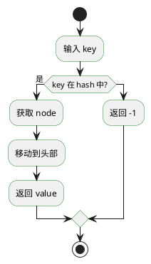

# 算法与数据结构详解

> 适用于大厂前端实习/校招笔试面试，持续更新
> 编码：UTF-8

---

## 目录

一、 [基础算法概述](#一基础算法概述)
二、 [排序算法详解](#二排序算法详解)
三、 [查找算法](#三查找算法)
四、 [数组与链表](#四数组与链表)
五、 [栈与队列](#五栈与队列)
六、 [树与图](#六树与图)
七、 [递归与回溯](#七递归与回溯)
八、 [动态规划](#八动态规划)
九、 [分治思想](#九分治思想)
十、 [算法技巧与模板](#十算法技巧与模板)
十一、 [前端特有算法](#十一前端特有算法)
十二、 [复杂度分析](#十二复杂度分析)

---

## 一、基础算法概述

### 1.1 什么是算法

算法（Algorithm）是解决特定问题的一系列明确的计算步骤，是计算机科学的核心概念之一。一个好的算法应该具备以下特点：

1. **正确性**：算法能够正确解决问题
2. **可读性**：算法逻辑清晰，易于理解
3. **健壮性**：能够处理异常输入
4. **时间效率**：执行时间合理
5. **空间效率**：占用内存合理

### 1.2 算法的分类

#### 按计算方式分类

1. **穷举法**：遍历所有可能的情况
2. **分治法**：将大问题分解为小问题
3. **动态规划**：最优子结构+重叠子问题
4. **贪心算法**：局部最优策略
5. **回溯算法**：尝试搜索解空间
6. **分支限界法**：广度优先搜索解空间

#### 按问题类型分类

1. **排序算法**：将无序数据变为有序
2. **查找算法**：在数据集中寻找目标
3. **图算法**：处理图结构数据
4. **字符串算法**：处理字符串问题
5. **数学算法**：数学计算相关

### 1.3 算法设计的基本原则

```javascript
/**
 * 算法设计的基本原则
 */

// 1. 明确问题需求
//    - 输入是什么？输出是什么？
//    - 有什么约束条件？
//    - 期望的时间/空间复杂度？

// 2. 选择合适的数据结构
//    - 根据数据特点选择
//    - 考虑操作的频率
//    - 权衡时间和空间

// 3. 选择合适的算法策略
//    - 暴力法 -> 优化
//    - 分而治之
//    - 动态规划
//    - 贪心选择

// 4. 逐步优化
//    - 先写一个能工作的版本
//    - 分析瓶颈
//    - 针对性优化
```

### 1.4 算法复杂度概述

算法复杂度是衡量算法效率的重要指标，主要分为时间复杂度和空间复杂度。

#### 时间复杂度

时间复杂度表示算法执行时间随输入规模增长的变化趋势。常用表示法为大O记号。

常见时间复杂度（从低到高）：
- O(1)：常数时间
- O(log n)：对数时间
- O(n)：线性时间
- O(n log n)：线性对数时间
- O(n²)：平方时间
- O(n³)：立方时间
- O(2ⁿ)：指数时间

#### 空间复杂度

空间复杂度表示算法占用内存空间随输入规模增长的变化趋势。

```javascript
/**
 * 复杂度示例
 */

// O(1) - 常数时间
function constantTime(arr, index) {
    return arr[index];
}

// O(n) - 线性时间
function linearTime(arr) {
    let sum = 0;
    for (let i = 0; i < arr.length; i++) {
        sum += arr[i];
    }
    return sum;
}

// O(n²) - 平方时间
function quadraticTime(arr) {
    let count = 0;
    for (let i = 0; i < arr.length; i++) {
        for (let j = 0; j < arr.length; j++) {
            if (arr[i] === arr[j]) count++;
        }
    }
    return count;
}

// O(log n) - 对数时间
function logarithmicTime(n) {
    let count = 0;
    while (n > 1) {
        n = Math.floor(n / 2);
        count++;
    }
    return count;
}
```

### 1.5 如何学习算法

```javascript
/**
 * 算法学习路径
 */

const algorithmLearningPath = {
    phase1: {
        name: "基础入门",
        content: [
            "理解时间空间复杂度",
            "掌握基本数据结构",
            "学会分析问题",
            "了解常见算法思想"
        ],
        duration: "1-2周"
    },

    phase2: {
        name: "基础算法",
        content: [
            "排序算法：冒泡、选择、插入",
            "查找算法：顺序、二分",
            "基础数据结构操作"
        ],
        duration: "2-3周"
    },

    phase3: {
        name: "进阶算法",
        content: [
            "高级排序：快速排序、归并排序、堆排序",
            "高级数据结构：栈、队列、链表、树",
            "算法技巧：双指针、滑动窗口"
        ],
        duration: "3-4周"
    },

    phase4: {
        name: "高级算法",
        content: [
            "动态规划",
            "回溯算法",
            "贪心算法",
            "图算法基础"
        ],
        duration: "4-6周"
    },

    phase5: {
        name: "专项突破",
        content: [
            "字符串算法",
            "数学算法",
            "位运算",
            "前端特有算法"
        ],
        duration: "2-3周"
    },

    tips: [
        "多动手编码，不要只看",
        "先理解思路，再动手实现",
        "总结归纳，形成知识体系",
        "多做题，但不要刷题成瘾",
        "复盘错题，理解为什么错"
    ]
};
```

---

## 二、排序算法详解

### 2.1 排序算法概述

排序算法是将一组数据按照特定顺序排列的算法。排序是计算机科学中最基本也是最重要的算法之一。

#### 排序算法的分类

1. **比较排序**：通过比较元素大小进行排序
   - 冒泡排序
   - 选择排序
   - 插入排序
   - 希尔排序
   - 归并排序
   - 快速排序
   - 堆排序

2. **非比较排序**：不通过比较进行排序
   - 计数排序
   - 桶排序
   - 基数排序

#### 排序算法的稳定性

稳定排序：如果两个相等的元素，排序前后它们的相对位置不变，则该排序算法是稳定的。

```
原始数据：[3, 2, 1, 2]
稳定排序后：[1, 2, 2, 3]  (两个2的相对位置不变)
不稳定排序后：[1, 2, 2, 3]  (可能两个2位置交换)
```

### 2.2 冒泡排序 (Bubble Sort)

冒泡排序是最简单的排序算法之一，通过不断比较相邻元素并交换位置，将最大的元素"冒泡"到数组末尾。

#### 算法原理

```
第1趟：比较n个元素，交换n-1次，最大元素移到位置n-1
第2趟：比较n-1个元素，交换n-2次，最大元素移到位置n-2
...
第n-1趟：比较2个元素，交换1次
```

#### 代码实现

```javascript
/**
 * 冒泡排序 - 基础版本
 * 时间复杂度: O(n²)
 * 空间复杂度: O(1)
 * 稳定性: 稳定
 */
function bubbleSort(arr) {
    const n = arr.length;
    for (let i = 0; i < n - 1; i++) {
        for (let j = 0; j < n - i - 1; j++) {
            if (arr[j] > arr[j + 1]) {
                // 交换相邻元素
                [arr[j], arr[j + 1]] = [arr[j + 1], arr[j]];
            }
        }
    }
    return arr;
}

/**
 * 冒泡排序 - 优化版本1
 * 添加一个标志位，如果某趟没有交换，说明已经有序
 */
function bubbleSortOptimized1(arr) {
    const n = arr.length;
    for (let i = 0; i < n - 1; i++) {
        let swapped = false;
        for (let j = 0; j < n - i - 1; j++) {
            if (arr[j] > arr[j + 1]) {
                [arr[j], arr[j + 1]] = [arr[j + 1], arr[j]];
                swapped = true;
            }
        }
        // 如果没有发生交换，说明数组已经有序
        if (!swapped) break;
    }
    return arr;
}

/**
 * 冒泡排序 - 优化版本2
 * 记录最后一次交换的位置，下一轮只需要比较到这个位置
 */
function bubbleSortOptimized2(arr) {
    const n = arr.length;
    let right = n - 1;
    while (right > 0) {
        let lastSwap = 0;
        for (let j = 0; j < right; j++) {
            if (arr[j] > arr[j + 1]) {
                [arr[j], arr[j + 1]] = [arr[j + 1], arr[j]];
                lastSwap = j;
            }
        }
        right = lastSwap;
    }
    return arr;
}

/**
 * 冒泡排序 - 双向冒泡
 * 也叫鸡尾酒排序，从两个方向冒泡
 */
function cocktailSort(arr) {
    const n = arr.length;
    let left = 0;
    let right = n - 1;
    let swapped = true;

    while (swapped) {
        swapped = false;
        // 从左到右冒泡
        for (let i = left; i < right; i++) {
            if (arr[i] > arr[i + 1]) {
                [arr[i], arr[i + 1]] = [arr[i + 1], arr[i]];
                swapped = true;
            }
        }
        right--;
        if (!swapped) break;

        swapped = false;
        // 从右到左冒泡
        for (let i = right; i > left; i--) {
            if (arr[i] < arr[i - 1]) {
                [arr[i], arr[i - 1]] = [arr[i - 1], arr[i]];
                swapped = true;
            }
        }
        left++;
    }
    return arr;
}

// 测试
const testArray = [64, 34, 25, 12, 22, 11, 90];
console.log("原始数组:", testArray);
console.log("冒泡排序后:", bubbleSort([...testArray]));
console.log("优化版本1后:", bubbleSortOptimized1([...testArray]));
console.log("双向冒泡后:", cocktailSort([...testArray]));
```

#### 冒泡排序可视化过程

```
原始数组: [5, 2, 8, 1, 9]

第1趟:
[5, 2, 8, 1, 9] -> 比较5和2，交换 -> [2, 5, 8, 1, 9]
[2, 5, 8, 1, 9] -> 比较5和8，不交换 -> [2, 5, 8, 1, 9]
[2, 5, 8, 1, 9] -> 比较8和1，交换 -> [2, 5, 1, 8, 9]
[2, 5, 1, 8, 9] -> 比较8和9，不交换 -> [2, 5, 1, 8, 9]

第2趟:
[2, 5, 1, 8, 9] -> 比较2和5，不交换 -> [2, 5, 1, 8, 9]
[2, 5, 1, 8, 9] -> 比较5和1，交换 -> [2, 1, 5, 8, 9]
[2, 1, 5, 8, 9] -> 比较5和8，不交换 -> [2, 1, 5, 8, 9]

第3趟:
[2, 1, 5, 8, 9] -> 比较2和1，交换 -> [1, 2, 5, 8, 9]
[1, 2, 5, 8, 9] -> 比较2和5，不交换 -> [1, 2, 5, 8, 9]

第4趟:
[1, 2, 5, 8, 9] -> 比较1和2，不交换 -> [1, 2, 5, 8, 9]

结果: [1, 2, 5, 8, 9]
```

### 2.3 选择排序 (Selection Sort)

选择排序是一种简单直观的排序算法，每次从未排序部分选择最小（或最大）元素放到已排序部分的末尾。

#### 算法原理

```
第1步：在n个元素中找到最小的，与位置0交换
第2步：在n-1个元素中找到最小的，与位置1交换
...
第n-1步：在2个元素中找到最小的，与位置n-2交换
```

#### 代码实现

```javascript
/**
 * 选择排序 - 基础版本
 * 时间复杂度: O(n²)
 * 空间复杂度: O(1)
 * 稳定性: 不稳定
 */
function selectionSort(arr) {
    const n = arr.length;
    for (let i = 0; i < n - 1; i++) {
        // 找到未排序部分的最小元素
        let minIndex = i;
        for (let j = i + 1; j < n; j++) {
            if (arr[j] < arr[minIndex]) {
                minIndex = j;
            }
        }
        // 交换
        if (minIndex !== i) {
            [arr[i], arr[minIndex]] = [arr[minIndex], arr[i]];
        }
    }
    return arr;
}

/**
 * 选择排序 - 双向选择
 * 同时找到最小和最大元素
 */
function selectionSortBidirectional(arr) {
    const n = arr.length;
    let left = 0;
    let right = n - 1;

    while (left < right) {
        let minIndex = left;
        let maxIndex = right;

        for (let i = left; i <= right; i++) {
            if (arr[i] < arr[minIndex]) minIndex = i;
            if (arr[i] > arr[maxIndex]) maxIndex = i;
        }

        // 将最小元素放到左边
        if (minIndex !== left) {
            [arr[left], arr[minIndex]] = [arr[minIndex], arr[left]];
        }

        // 如果最大元素在left位置（已经被交换到minIndex）
        if (maxIndex === left) {
            maxIndex = minIndex;
        }

        // 将最大元素放到右边
        if (maxIndex !== right) {
            [arr[right], arr[maxIndex]] = [arr[maxIndex], arr[right]];
        }

        left++;
        right--;
    }
    return arr;
}

// 测试
const testArray = [64, 25, 12, 22, 11];
console.log("选择排序:", selectionSort([...testArray]));
console.log("双向选择:", selectionSortBidirectional([...testArray]));
```

#### 选择排序可视化过程

```
原始数组: [64, 25, 12, 22, 11]

第1步：找到最小值11，与位置0交换
[64, 25, 12, 22, 11] -> [11, 25, 12, 22, 64]

第2步：在[25, 12, 22, 64]中找到最小值12，与位置1交换
[11, 25, 12, 22, 64] -> [11, 12, 25, 22, 64]

第3步：在[25, 22, 64]中找到最小值22，与位置2交换
[11, 12, 25, 22, 64] -> [11, 12, 22, 25, 64]

第4步：在[25, 64]中找到最小值25，位置正确，不交换
[11, 12, 22, 25, 64] -> [11, 12, 22, 25, 64]

结果: [11, 12, 22, 25, 64]
```

### 2.4 插入排序 (Insertion Sort)

插入排序类似于整理扑克牌，将数组分为已排序区和未排序区，每次将未排序区的第一个元素插入到已排序区的正确位置。

#### 算法原理

```
初始：已排序区[0]，未排序区[1...n-1]
第1步：将arr[1]插入已排序区[0]
第2步：将arr[2]插入已排序区[0,1]
...
第n-1步：将arr[n-1]插入已排序区
```

#### 代码实现

```javascript
/**
 * 插入排序 - 基础版本
 * 时间复杂度: O(n²) 平均/最坏, O(n) 最好（已排序）
 * 空间复杂度: O(1)
 * 稳定性: 稳定
 */
function insertionSort(arr) {
    const n = arr.length;
    for (let i = 1; i < n; i++) {
        const key = arr[i];
        let j = i - 1;

        // 将key与已排序区元素比较，找到正确位置
        while (j >= 0 && arr[j] > key) {
            arr[j + 1] = arr[j];
            j--;
        }
        arr[j + 1] = key;
    }
    return arr;
}

/**
 * 插入排序 - 二分查找优化
 * 使用二分查找找到插入位置，减少比较次数
 */
function insertionSortBinary(arr) {
    const n = arr.length;

    for (let i = 1; i < n; i++) {
        const key = arr[i];
        // 使用二分查找找到插入位置
        let left = 0;
        let right = i;

        while (left < right) {
            const mid = Math.floor((left + right) / 2);
            if (arr[mid] <= key) {
                left = mid + 1;
            } else {
                right = mid;
            }
        }

        // 移动元素
        for (let j = i; j > left; j--) {
            arr[j] = arr[j - 1];
        }
        arr[left] = key;
    }
    return arr;
}

/**
 * 插入排序 - 带哨兵版本
 * 在数组开头设置哨兵，避免边界检查
 */
function insertionSortSentinel(arr) {
    const n = arr.length;
    // 找到最小元素放到第一位作为哨兵
    let minIndex = 0;
    for (let i = 1; i < n; i++) {
        if (arr[i] < arr[minIndex]) {
            minIndex = i;
        }
    }
    // 将最小元素移到开头
    [arr[0], arr[minIndex]] = [arr[minIndex], arr[0]];

    for (let i = 2; i < n; i++) {
        const key = arr[i];
        let j = i;
        while (arr[j] < arr[j - 1]) {
            [arr[j], arr[j - 1]] = [arr[j - 1], arr[j]];
            j--;
        }
    }
    return arr;
}

// 测试
const testArray = [12, 11, 13, 5, 6];
console.log("插入排序:", insertionSort([...testArray]));
console.log("二分插入:", insertionSortBinary([...testArray]));
```

#### 插入排序可视化过程

```
原始数组: [12, 11, 13, 5, 6]

初始：已排序区[12]，未排序区[11, 13, 5, 6]

第1步：将11插入已排序区[12]
[12, 11, 13, 5, 6] -> 比较11和12，交换 -> [11, 12, 13, 5, 6]

第2步：将13插入已排序区[11, 12]
[11, 12, 13, 5, 6] -> 13大于12，不交换 -> [11, 12, 13, 5, 6]

第3步：将5插入已排序区[11, 12, 13]
[11, 12, 13, 5, 6] -> 比较5和13，交换 -> [11, 12, 5, 13, 6]
[11, 12, 5, 13, 6] -> 比较5和12，交换 -> [11, 5, 12, 13, 6]
[11, 5, 12, 13, 6] -> 比较5和11，交换 -> [5, 11, 12, 13, 6]

第4步：将6插入已排序区[5, 11, 12, 13]
[5, 11, 12, 13, 6] -> 比较6和13，交换 -> [5, 11, 12, 6, 13]
[5, 11, 12, 6, 13] -> 比较6和12，交换 -> [5, 11, 6, 12, 13]
[5, 11, 6, 12, 13] -> 比较6和11，交换 -> [5, 6, 11, 12, 13]

结果: [5, 6, 11, 12, 13]
```

### 2.5 希尔排序 (Shell Sort)

希尔排序是插入排序的改进版，也叫缩小增量排序。它通过将数组分成若干子序列进行插入排序，然后逐渐缩小增量直到为1。

#### 算法原理

```
1. 选择一个增量序列：d1, d2, ..., dk
   通常 dn = n/2, dn+1 = dn/2
2. 对每个增量d，将数组分成d个子序列
3. 对每个子序列进行插入排序
4. 重复直到增量为1
```

#### 代码实现

```javascript
/**
 * 希尔排序
 * 时间复杂度: O(n log n) 平均
 * 空间复杂度: O(1)
 * 稳定性: 不稳定
 */
function shellSort(arr) {
    const n = arr.length;
    let gap = Math.floor(n / 2);

    while (gap > 0) {
        // 对每个子序列进行插入排序
        for (let i = gap; i < n; i++) {
            const temp = arr[i];
            let j = i;

            while (j >= gap && arr[j - gap] > temp) {
                arr[j] = arr[j - gap];
                j -= gap;
            }
            arr[j] = temp;
        }
        gap = Math.floor(gap / 2);
    }
    return arr;
}

/**
 * 希尔排序 - 其他增量序列
 */
function shellSortKnuth(arr) {
    const n = arr.length;
    // Knuth增量序列: h = 3h + 1
    let h = 1;
    while (h < n / 3) {
        h = 3 * h + 1;
    }

    while (h >= 1) {
        for (let i = h; i < n; i++) {
            const temp = arr[i];
            let j = i;
            while (j >= h && arr[j - h] > temp) {
                arr[j] = arr[j - h];
                j -= h;
            }
            arr[j] = temp;
        }
        h = Math.floor(h / 3);
    }
    return arr;
}

/**
 * 希尔排序 - Sedgewick增量序列
 */
function shellSortSedgewick(arr) {
    const n = arr.length;
    // Sedgewick增量序列
    let gap = 1;
    const sedgewick = [1, 5, 19, 41, 109, 209, 505, 929, 2161, 9025, 24601];
    while (gap < n / 3) {
        for (let i = 0; i < sedgewick.length; i++) {
            if (sedgewick[i] < n / 3) {
                gap = sedgewick[i];
            }
        }
    }

    while (gap > 0) {
        for (let i = gap; i < n; i++) {
            const temp = arr[i];
            let j = i;
            while (j >= gap && arr[j - gap] > temp) {
                arr[j] = arr[j - gap];
                j -= gap;
            }
            arr[j] = temp;
        }
        // 获取下一个增量
        let nextGap = 1;
        for (let i = 0; i < sedgewick.length - 1; i++) {
            if (gap === sedgewick[i]) {
                nextGap = sedgewick[i + 1];
                break;
            }
        }
        gap = nextGap || Math.floor(gap / 3);
    }
    return arr;
}

// 测试
const testArray = [12, 34, 54, 2, 3];
console.log("希尔排序:", shellSort([...testArray]));
```

#### 希尔排序可视化过程

```
原始数组: [12, 34, 54, 2, 3]

初始 gap = 5/2 = 2

gap = 2:
[12, 34, 54, 2, 3]
子序列1: [12, 54, 3] -> 排序 -> [3, 34, 12, 2, 54]
子序列2: [34, 2] -> 排序 -> [3, 2, 12, 34, 54]
数组: [3, 2, 12, 34, 54]

gap = 1 (继续插入排序):
[3, 2, 12, 34, 54] -> 插入排序 -> [2, 3, 12, 34, 54]

结果: [2, 3, 12, 34, 54]
```

### 2.6 归并排序 (Merge Sort)

归并排序是分治思想的典型应用，将数组分成若干子序列，分别排序后再合并。

#### 算法原理

```
分解：将数组不断分成两半，直到每个子数组只有一个元素
合并：将两个有序子数组合并成一个有序数组
```

#### 代码实现

```javascript
/**
 * 归并排序 - 自顶向下
 * 时间复杂度: O(n log n)
 * 空间复杂度: O(n)
 * 稳定性: 稳定
 */
function mergeSort(arr) {
    if (arr.length <= 1) return arr;

    const mid = Math.floor(arr.length / 2);
    const left = mergeSort(arr.slice(0, mid));
    const right = mergeSort(arr.slice(mid));

    return merge(left, right);
}

/**
 * 合并两个有序数组
 */
function merge(left, right) {
    const result = [];
    let i = 0, j = 0;

    while (i < left.length && j < right.length) {
        if (left[i] <= right[j]) {
            result.push(left[i]);
            i++;
        } else {
            result.push(right[j]);
            j++;
        }
    }

    // 合并剩余元素
    return result.concat(left.slice(i)).concat(right.slice(j));
}

/**
 * 归并排序 - 自底向上（迭代版本）
 */
function mergeSortBottomUp(arr) {
    const n = arr.length;
    // 模拟递归过程
    for (let size = 1; size < n; size *= 2) {
        for (let left = 0; left < n - size; left += 2 * size) {
            const mid = left + size - 1;
            const right = Math.min(left + 2 * size - 1, n - 1);
            mergeInPlace(arr, left, mid, right);
        }
    }
    return arr;
}

/**
 * 原地合并（需要额外空间）
 */
function mergeInPlace(arr, left, mid, right) {
    const leftArr = arr.slice(left, mid + 1);
    const rightArr = arr.slice(mid + 1, right + 1);

    let i = 0, j = 0, k = left;

    while (i < leftArr.length && j < rightArr.length) {
        if (leftArr[i] <= rightArr[j]) {
            arr[k++] = leftArr[i++];
        } else {
            arr[k++] = rightArr[j++];
        }
    }

    while (i < leftArr.length) {
        arr[k++] = leftArr[i++];
    }

    while (j < rightArr.length) {
        arr[k++] = rightArr[j++];
    }
}

/**
 * 归并排序 - 计算逆序对
 */
function mergeSortCountInversions(arr) {
    let count = 0;

    function mergeAndCount(left, right) {
        const result = [];
        let i = 0, j = 0;

        while (i < left.length && j < right.length) {
            if (left[i] <= right[j]) {
                result.push(left[i]);
                i++;
            } else {
                // left[i] > right[j]，构成逆序对
                // left中剩余元素都与right[j]构成逆序对
                count += left.length - i;
                result.push(right[j]);
                j++;
            }
        }

        return result.concat(left.slice(i)).concat(right.slice(j));
    }

    function sort(arr) {
        if (arr.length <= 1) return arr;

        const mid = Math.floor(arr.length / 2);
        const left = sort(arr.slice(0, mid));
        const right = sort(arr.slice(mid));

        return mergeAndCount(left, right);
    }

    sort(arr);
    return count;
}

// 测试
const testArray = [38, 27, 43, 3, 9, 82, 10];
console.log("归并排序:", mergeSort([...testArray]));
console.log("逆序对数量:", mergeSortCountInversions([...testArray]));
```

#### 归并排序可视化过程

```
原始数组: [38, 27, 43, 3, 9, 82, 10]

分解过程:
[38, 27, 43, 3, 9, 82, 10]
-> [38, 27, 43, 3] 和 [9, 82, 10]
-> [38, 27] 和 [43, 3] 和 [9, 82] 和 [10]
-> [38] [27] [43] [3] [9] [82] [10]

合并过程:
[27, 38] 和 [3, 43] -> [3, 27, 38, 43]
[9, 82] 和 [10] -> [9, 10, 82]
合并 -> [3, 9, 10, 27, 38, 43, 82]

结果: [3, 9, 10, 27, 38, 43, 82]
```

### 2.7 快速排序 (Quick Sort)

快速排序是应用最广泛的排序算法之一，采用分治策略，选择一个基准元素，将数组分成两部分。

#### 算法原理

```
1. 选择一个基准元素（通常选择第一个或最后一个）
2. 将数组分成两部分：小于基准的元素和大于基准的元素
3. 对两部分分别递归进行快速排序
```

#### 代码实现

```javascript
/**
 * 快速排序 - 基础版本
 * 时间复杂度: O(n log n) 平均, O(n²) 最坏
 * 空间复杂度: O(log n) 平均
 * 稳定性: 不稳定
 */
function quickSort(arr, left = 0, right = arr.length - 1) {
    if (left >= right) return arr;

    const pivot = partition(arr, left, right);
    quickSort(arr, left, pivot - 1);
    quickSort(arr, pivot + 1, right);

    return arr;
}

/**
 * 分区函数 - 选择最后一个元素作为基准
 */
function partition(arr, left, right) {
    const pivot = arr[right];
    let i = left - 1;

    for (let j = left; j < right; j++) {
        if (arr[j] <= pivot) {
            i++;
            [arr[i], arr[j]] = [arr[j], arr[i]];
        }
    }
    [arr[i + 1], arr[right]] = [arr[right], arr[i + 1]];
    return i + 1;
}

/**
 * 快速排序 - 随机基准
 * 减少最坏情况发生概率
 */
function quickSortRandom(arr, left = 0, right = arr.length - 1) {
    if (left >= right) return arr;

    // 随机选择基准元素
    const randomIndex = left + Math.floor(Math.random() * (right - left + 1));
    [arr[randomIndex], arr[right]] = [arr[right], arr[randomIndex]];

    return quickSort(arr, left, right);
}

/**
 * 快速排序 - 三数取中法
 * 选择left, right, mid三个位置的中值作为基准
 */
function quickSortMedian(arr, left = 0, right = arr.length - 1) {
    if (left >= right) return arr;

    // 三数取中
    const mid = Math.floor((left + right) / 2);
    if (arr[left] > arr[mid]) [arr[left], arr[mid]] = [arr[mid], arr[left]];
    if (arr[left] > arr[right]) [arr[left], arr[right]] = [arr[right], arr[left]];
    if (arr[mid] > arr[right]) [arr[mid], arr[right]] = [arr[right], arr[mid]];
    // 将中值放到right-1位置
    [arr[mid], arr[right - 1]] = [arr[right - 1], arr[mid]];

    return quickSort(arr, left, right);
}

/**
 * 快速排序 - 荷兰国旗问题优化
 * 当有大量重复元素时效率更高
 */
function quickSortDutch(arr, left = 0, right = arr.length - 1) {
    if (left >= right) return arr;

    const { low, high } = dutchNationalFlag(arr, left, right);
    quickSortDutch(arr, left, low - 1);
    quickSortDutch(arr, high + 1, right);

    return arr;
}

function dutchNationalFlag(arr, left, right) {
    const pivot = arr[right];
    let low = left;
    let mid = left;
    let high = right;

    while (mid <= high) {
        if (arr[mid] < pivot) {
            [arr[low], arr[mid]] = [arr[mid], arr[low]];
            low++;
            mid++;
        } else if (arr[mid] > pivot) {
            [arr[mid], arr[high]] = [arr[high], arr[mid]];
            high--;
        } else {
            mid++;
        }
    }

    return { low, high };
}

/**
 * 快速排序 - 非递归版本（使用栈）
 */
function quickSortIterative(arr, left = 0, right = arr.length - 1) {
    const stack = [[left, right]];

    while (stack.length) {
        const [l, r] = stack.pop();
        if (l >= r) continue;

        const pivot = partition(arr, l, r);

        if (pivot - 1 > l) {
            stack.push([l, pivot - 1]);
        }
        if (pivot + 1 < r) {
            stack.push([pivot + 1, r]);
        }
    }

    return arr;
}

// 测试
const testArray = [10, 7, 8, 9, 1, 5];
console.log("快速排序:", quickSort([...testArray]));
console.log("随机基准:", quickSortRandom([...testArray]));
console.log("非递归:", quickSortIterative([...testArray]));
```

#### 快速排序可视化过程

```
原始数组: [10, 7, 8, 9, 1, 5]

选择基准: 5
分区: [1] [5] [10, 7, 8, 9]
选择基准: 1 (左部分)
分区: [1] [5]

选择基准: 9 (右部分 [10, 7, 8, 9])
分区: [10, 7, 8] [9]
选择基准: 7 (左部分 [10, 7, 8])
分区: [7] [8, 10]
合并: [5] -> [1, 5, 7] -> [7, 8, 10] -> [9] -> [1, 5, 7, 8, 9, 10]

结果: [1, 5, 7, 8, 9, 10]
```

### 2.8 堆排序 (Heap Sort)

堆排序利用堆这种数据结构进行排序，是一种高效的原地排序算法。

#### 算法原理

```
1. 将数组构建成最大堆
2. 将堆顶元素（最大值）与堆尾元素交换
3. 调整剩余元素为最大堆
4. 重复步骤2-3直到排序完成
```

#### 代码实现

```javascript
/**
 * 堆排序
 * 时间复杂度: O(n log n)
 * 空间复杂度: O(1)
 * 稳定性: 不稳定
 */
function heapSort(arr) {
    const n = arr.length;

    // 构建最大堆
    for (let i = Math.floor(n / 2) - 1; i >= 0; i--) {
        heapify(arr, n, i);
    }

    // 提取元素
    for (let i = n - 1; i > 0; i--) {
        [arr[0], arr[i]] = [arr[i], arr[0]];
        heapify(arr, i, 0);
    }

    return arr;
}

/**
 * 堆化函数 - 将以i为根的子树调整为最大堆
 */
function heapify(arr, heapSize, i) {
    let largest = i;
    const left = 2 * i + 1;
    const right = 2 * i + 2;

    if (left < heapSize && arr[left] > arr[largest]) {
        largest = left;
    }

    if (right < heapSize && arr[right] > arr[largest]) {
        largest = right;
    }

    if (largest !== i) {
        [arr[i], arr[largest]] = [arr[largest], arr[i]];
        heapify(arr, heapSize, largest);
    }
}

/**
 * 堆排序 - 自底向上构建堆
 */
function heapSortBuildBottom(arr) {
    const n = arr.length;

    // 从第一个非叶子节点开始自底向上堆化
    for (let i = Math.floor(n / 2) - 1; i >= 0; i--) {
        siftDown(arr, n, i);
    }

    for (let i = n - 1; i > 0; i--) {
        [arr[0], arr[i]] = [arr[i], arr[0]];
        siftDown(arr, i, 0);
    }

    return arr;
}

function siftDown(arr, heapSize, i) {
    while (true) {
        let largest = i;
        const left = 2 * i + 1;
        const right = 2 * i + 2;

        if (left < heapSize && arr[left] > arr[largest]) {
            largest = left;
        }
        if (right < heapSize && arr[right] > arr[largest]) {
            largest = right;
        }

        if (largest === i) break;

        [arr[i], arr[largest]] = [arr[largest], arr[i]];
        i = largest;
    }
}

/**
 * 堆排序 - 原地堆化版本
 */
function heapSortInPlace(arr) {
    // 构建最大堆
    let heapSize = arr.length;
    for (let i = 1; i < heapSize; i++) {
        // sift up
        let child = i;
        while (child > 0) {
            const parent = Math.floor((child - 1) / 2);
            if (arr[child] > arr[parent]) {
                [arr[child], arr[parent]] = [arr[parent], arr[child]];
                child = parent;
            } else {
                break;
            }
        }
    }

    // 排序
    while (heapSize > 1) {
        [arr[0], arr[heapSize - 1]] = [arr[heapSize - 1], arr[0]];
        heapSize--;

        // sift down
        let parent = 0;
        while (true) {
            const left = 2 * parent + 1;
            const right = 2 * parent + 2;
            let largest = parent;

            if (left < heapSize && arr[left] > arr[largest]) {
                largest = left;
            }
            if (right < heapSize && arr[right] > arr[largest]) {
                largest = right;
            }

            if (largest === parent) break;

            [arr[parent], arr[largest]] = [arr[largest], arr[parent]];
            parent = largest;
        }
    }

    return arr;
}

// 测试
const testArray = [12, 11, 13, 5, 6, 7];
console.log("堆排序:", heapSort([...testArray]));
console.log("原地堆化:", heapSortInPlace([...testArray]));
```

### 2.9 计数排序 (Counting Sort)

计数排序是一种非比较排序算法，适用于范围不大的整数排序。

#### 代码实现

```javascript
/**
 * 计数排序
 * 时间复杂度: O(n + k) k为数据范围
 * 空间复杂度: O(n + k)
 * 稳定性: 稳定
 */
function countingSort(arr) {
    if (arr.length === 0) return arr;

    // 找到最大值和最小值
    let min = arr[0];
    let max = arr[0];
    for (const num of arr) {
        if (num < min) min = num;
        if (num > max) max = num;
    }

    // 计数数组
    const range = max - min + 1;
    const count = new Array(range).fill(0);

    // 计数
    for (const num of arr) {
        count[num - min]++;
    }

    // 累加计数（用于稳定性）
    for (let i = 1; i < range; i++) {
        count[i] += count[i - 1];
    }

    // 输出数组
    const result = new Array(arr.length);
    for (let i = arr.length - 1; i >= 0; i--) {
        const num = arr[i];
        result[--count[num - min]] = num;
    }

    return result;
}

/**
 * 计数排序 - 简化版本（不需要稳定性）
 */
function countingSortSimple(arr) {
    if (arr.length === 0) return arr;

    const max = Math.max(...arr);
    const count = new Array(max + 1).fill(0);

    for (const num of arr) {
        count[num]++;
    }

    const result = [];
    for (let i = 0; i < count.length; i++) {
        while (count[i] > 0) {
            result.push(i);
            count[i]--;
        }
    }

    return result;
}

// 测试
const testArray = [2, 5, 3, 0, 2, 3, 0, 3];
console.log("计数排序:", countingSort([...testArray]));
```

### 2.10 桶排序 (Bucket Sort)

桶排序将数据分到有限数量的桶中，每个桶再分别排序。

#### 代码实现

```javascript
/**
 * 桶排序
 * 时间复杂度: O(n + k) 平均
 * 空间复杂度: O(n + k)
 */
function bucketSort(arr, bucketSize = 5) {
    if (arr.length === 0) return arr;

    // 找到最小值和最大值
    let min = arr[0], max = arr[0];
    for (const num of arr) {
        if (num < min) min = num;
        if (num > max) max = num;
    }

    // 创建桶
    const bucketCount = Math.floor((max - min) / bucketSize) + 1;
    const buckets = new Array(bucketCount);

    for (let i = 0; i < bucketCount; i++) {
        buckets[i] = [];
    }

    // 将元素分配到桶中
    for (const num of arr) {
        const index = Math.floor((num - min) / bucketSize);
        buckets[index].push(num);
    }

    // 对每个桶进行排序
    const result = [];
    for (const bucket of buckets) {
        if (bucket.length > 0) {
            // 这里可以使用其他排序算法
            bucket.sort((a, b) => a - b);
            result.push(...bucket);
        }
    }

    return result;
}

// 测试
const testArray = [0.78, 0.17, 0.39, 0.26, 0.72, 0.94, 0.21, 0.12, 0.23, 0.68];
console.log("桶排序:", bucketSort([...testArray]));
```

### 2.11 基数排序 (Radix Sort)

基数排序按数字的每一位进行排序，从低位到高位或从高位到低位。

#### 代码实现

```javascript
/**
 * 基数排序 - LSD（最低位优先）
 * 时间复杂度: O(n * k) k为位数
 * 空间复杂度: O(n + k)
 * 稳定性: 稳定
 */
function radixSort(arr) {
    if (arr.length === 0) return arr;

    // 找到最大值
    const max = Math.max(...arr);

    // 从低位到高位排序
    let exp = 1;
    while (Math.floor(max / exp) > 0) {
        countingSortByDigit(arr, exp);
        exp *= 10;
    }

    return arr;
}

function countingSortByDigit(arr, exp) {
    const n = arr.length;
    const output = new Array(n);
    const count = new Array(10).fill(0);

    // 统计每个桶的元素个数
    for (let i = 0; i < n; i++) {
        const digit = Math.floor(arr[i] / exp) % 10;
        count[digit]++;
    }

    // 累加计数
    for (let i = 1; i < 10; i++) {
        count[i] += count[i - 1];
    }

    // 从后往前遍历，保证稳定性
    for (let i = n - 1; i >= 0; i--) {
        const digit = Math.floor(arr[i] / exp) % 10;
        output[--count[digit]] = arr[i];
    }

    // 复制回原数组
    for (let i = 0; i < n; i++) {
        arr[i] = output[i];
    }
}

/**
 * 基数排序 - MSD（最高位优先）
 */
function radixSortMSD(arr, high = null) {
    if (arr.length <= 1) return arr;

    if (high === null) {
        high = Math.max(...arr).toString().length;
    }

    if (high <= 0) return arr;

    const buckets = Array.from({ length: 10 }, () => []);

    for (const num of arr) {
        const digit = Math.floor(num / Math.pow(10, high - 1)) % 10;
        buckets[digit].push(num);
    }

    const result = [];
    for (let i = 0; i < 10; i++) {
        if (buckets[i].length > 0) {
            if (high === 1) {
                result.push(...buckets[i].sort((a, b) => a - b));
            } else {
                result.push(...radixSortMSD(buckets[i], high - 1));
            }
        }
    }

    return result;
}

// 测试
const testArray = [170, 45, 75, 90, 802, 24, 2, 66];
console.log("基数排序:", radixSort([...testArray]));
```

### 2.12 排序算法对比

```javascript
/**
 * 排序算法综合对比
 */
const sortAlgorithmsComparison = {
    comparison: {
        name: "比较排序",
        algorithms: [
            {
                name: "冒泡排序",
                best: "O(n)",
                average: "O(n²)",
                worst: "O(n²)",
                space: "O(1)",
                stable: true,
                description: "简单直观，适合小规模数据"
            },
            {
                name: "选择排序",
                best: "O(n²)",
                average: "O(n²)",
                worst: "O(n²)",
                space: "O(1)",
                stable: false,
                description: "移动次数少，但比较次数多"
            },
            {
                name: "插入排序",
                best: "O(n)",
                average: "O(n²)",
                worst: "O(n²)",
                space: "O(1)",
                stable: true,
                description: "适合基本有序的数据"
            },
            {
                name: "希尔排序",
                best: "O(n log n)",
                average: "O(n^(3/2))",
                worst: "O(n²)",
                space: "O(1)",
                stable: false,
                description: "插入排序的改进"
            },
            {
                name: "归并排序",
                best: "O(n log n)",
                average: "O(n log n)",
                worst: "O(n log n)",
                space: "O(n)",
                stable: true,
                description: "稳定高效，适合外部排序"
            },
            {
                name: "快速排序",
                best: "O(n log n)",
                average: "O(n log n)",
                worst: "O(n²)",
                space: "O(log n)",
                stable: false,
                description: "实际应用最广的排序算法"
            },
            {
                name: "堆排序",
                best: "O(n log n)",
                average: "O(n log n)",
                worst: "O(n log n)",
                space: "O(1)",
                stable: false,
                description: "原地排序，适合大数据"
            }
        ]
    },

    nonComparison: {
        name: "非比较排序",
        algorithms: [
            {
                name: "计数排序",
                best: "O(n + k)",
                average: "O(n + k)",
                worst: "O(n + k)",
                space: "O(k)",
                stable: true,
                description: "适合整数，范围不大时高效"
            },
            {
                name: "桶排序",
                best: "O(n + k)",
                average: "O(n + k)",
                worst: "O(n²)",
                space: "O(k)",
                stable: true,
                description: "适合均匀分布的数据"
            },
            {
                name: "基数排序",
                best: "O(nk)",
                average: "O(nk)",
                worst: "O(nk)",
                space: "O(n + k)",
                stable: true,
                description: "按位排序，适合整数和字符串"
            }
        ]
    }
};
```

---

## 三、查找算法

### 3.1 查找算法概述

查找算法是在数据集合中寻找特定元素的算法。不同的查找算法适用于不同的数据结构和使用场景。

#### 查找算法的分类

1. **线性查找**：顺序查找
2. **二分查找**：在有序数组中查找
3. **分块查找**：块内有序，块间有序
4. **树表查找**：二叉搜索树、平衡树
5. **哈希查找**：哈希表

### 3.2 顺序查找

最简单的查找方式，依次检查每个元素。

```javascript
/**
 * 顺序查找 - 基础版本
 * 时间复杂度: O(n)
 * 空间复杂度: O(1)
 */
function sequentialSearch(arr, target) {
    for (let i = 0; i < arr.length; i++) {
        if (arr[i] === target) {
            return i;
        }
    }
    return -1;
}

/**
 * 顺序查找 - 带哨兵版本
 * 将目标放到数组末尾，避免每次检查边界
 */
function sequentialSearchSentinel(arr, target) {
    const last = arr[arr.length - 1];
    arr[arr.length - 1] = target;

    let i = 0;
    while (arr[i] !== target) {
        i++;
    }

    arr[arr.length - 1] = last;

    if (i < arr.length - 1 || arr[arr.length - 1] === target) {
        return i;
    }
    return -1;
}

/**
 * 顺序查找 - 返回所有匹配位置
 */
function sequentialSearchAll(arr, target) {
    const indices = [];
    for (let i = 0; i < arr.length; i++) {
        if (arr[i] === target) {
            indices.push(i);
        }
    }
    return indices;
}

// 测试
const arr = [4, 2, 7, 1, 9, 3];
console.log("顺序查找7:", sequentialSearch(arr, 7));
console.log("顺序查找5:", sequentialSearch(arr, 5));
```

### 3.3 二分查找

二分查找在有序数组中效率很高，时间复杂度为O(log n)。

#### 代码实现

```javascript
/**
 * 二分查找 - 基础版本
 * 时间复杂度: O(log n)
 * 空间复杂度: O(1)
 */
function binarySearch(arr, target) {
    let left = 0;
    let right = arr.length - 1;

    while (left <= right) {
        const mid = Math.floor((left + right) / 2);

        if (arr[mid] === target) {
            return mid;
        } else if (arr[mid] < target) {
            left = mid + 1;
        } else {
            right = mid - 1;
        }
    }

    return -1;
}

/**
 * 二分查找 - 递归版本
 */
function binarySearchRecursive(arr, target, left = 0, right = arr.length - 1) {
    if (left > right) return -1;

    const mid = Math.floor((left + right) / 2);

    if (arr[mid] === target) {
        return mid;
    } else if (arr[mid] < target) {
        return binarySearchRecursive(arr, target, mid + 1, right);
    } else {
        return binarySearchRecursive(arr, target, left, mid - 1);
    }
}

/**
 * 二分查找 - 查找左边界
 * 返回第一个 >= target 的位置
 */
function binarySearchLeft(arr, target) {
    let left = 0;
    let right = arr.length;

    while (left < right) {
        const mid = Math.floor((left + right) / 2);
        if (arr[mid] < target) {
            left = mid + 1;
        } else {
            right = mid;
        }
    }

    return left;
}

/**
 * 二分查找 - 查找右边界
 * 返回最后一个 <= target 的位置
 */
function binarySearchRight(arr, target) {
    let left = 0;
    let right = arr.length;

    while (left < right) {
        const mid = Math.floor((left + right) / 2);
        if (arr[mid] <= target) {
            left = mid + 1;
        } else {
            right = mid;
        }
    }

    return left - 1;
}

/**
 * 二分查找 - 查找目标第一次出现的位置
 */
function binarySearchFirst(arr, target) {
    let left = 0;
    let right = arr.length - 1;
    let result = -1;

    while (left <= right) {
        const mid = Math.floor((left + right) / 2);
        if (arr[mid] === target) {
            result = mid;
            right = mid - 1; // 继续向左找
        } else if (arr[mid] < target) {
            left = mid + 1;
        } else {
            right = mid - 1;
        }
    }

    return result;
}

/**
 * 二分查找 - 查找目标最后一次出现的位置
 */
function binarySearchLast(arr, target) {
    let left = 0;
    let right = arr.length - 1;
    let result = -1;

    while (left <= right) {
        const mid = Math.floor((left + right) / 2);
        if (arr[mid] === target) {
            result = mid;
            left = mid + 1; // 继续向右找
        } else if (arr[mid] < target) {
            left = mid + 1;
        } else {
            right = mid - 1;
        }
    }

    return result;
}

// 测试
const sortedArr = [1, 3, 5, 7, 9, 11, 13, 15];
console.log("二分查找9:", binarySearch(sortedArr, 9));
console.log("左边界9:", binarySearchLeft(sortedArr, 9));
console.log("右边界9:", binarySearchRight(sortedArr, 9));
console.log("第一次出现9:", binarySearchFirst([1,3,5,7,9,9,9,11], 9));
```

### 3.4 插值查找

插值查找是对二分查找的改进，适用于数据均匀分布的情况。

```javascript
/**
 * 插值查找
 * 时间复杂度: O(log log n) 平均
 * 空间复杂度: O(1)
 */
function interpolationSearch(arr, target) {
    let left = 0;
    let right = arr.length - 1;

    while (left <= right && target >= arr[left] && target <= arr[right]) {
        // 估算目标位置
        const pos = left + Math.floor(
            ((target - arr[left]) * (right - left)) /
            (arr[right] - arr[left])
        );

        if (arr[pos] === target) {
            return pos;
        } else if (arr[pos] < target) {
            left = pos + 1;
        } else {
            right = pos - 1;
        }
    }

    return -1;
}

// 测试
const uniformArr = [1, 5, 10, 15, 20, 25, 30, 35, 40, 45];
console.log("插值查找20:", interpolationSearch(uniformArr, 20));
```

### 3.5 斐波那契查找

利用斐波那契数列进行查找，适用于有序数组。

```javascript
/**
 * 斐波那契查找
 * 时间复杂度: O(log n)
 * 空间复杂度: O(1)
 */
function fibonacciSearch(arr, target) {
    const n = arr.length;

    // 找到大于等于n的最小斐波那契数
    let fibM2 = 0; // F(k-2)
    let fibM1 = 1; // F(k-1)
    let fib = fibM1 + fibM2; // F(k)

    while (fib < n) {
        fibM2 = fibM1;
        fibM1 = fib;
        fib = fibM1 + fibM2;
    }

    let offset = -1;

    while (fib > 1) {
        const i = Math.min(offset + fibM2, n - 1);

        if (arr[i] < target) {
            fib = fibM1;
            fibM1 = fibM2;
            fibM2 = fib - fibM1;
            offset = i;
        } else if (arr[i] > target) {
            fib = fibM2;
            fibM1 = fibM1 - fibM2;
            fibM2 = fib - fibM1;
        } else {
            return i;
        }
    }

    if (fibM1 && arr[offset + 1] === target) {
        return offset + 1;
    }

    return -1;
}

// 生成斐波那契数列
function fibonacci(n) {
    const fib = [0, 1];
    for (let i = 2; i <= n; i++) {
        fib.push(fib[i - 1] + fib[i - 2]);
    }
    return fib;
}

// 测试
const fibArr = [1, 5, 10, 15, 20, 25, 30, 35, 40, 45];
console.log("斐波那契查找25:", fibonacciSearch(fibArr, 25));
```

### 3.6 二分查找变体

```javascript
/**
 * 搜索旋转排序数组
 * 数组原本有序，但被旋转了
 */
function searchRotatedArray(arr, target) {
    if (arr.length === 0) return -1;

    let left = 0;
    let right = arr.length - 1;

    while (left <= right) {
        const mid = Math.floor((left + right) / 2);

        if (arr[mid] === target) {
            return mid;
        }

        // 判断哪一半是有序的
        if (arr[left] <= arr[mid]) {
            // 左边是有序的
            if (target >= arr[left] && target < arr[mid]) {
                right = mid - 1;
            } else {
                left = mid + 1;
            }
        } else {
            // 右边是有序的
            if (target > arr[mid] && target <= arr[right]) {
                left = mid + 1;
            } else {
                right = mid - 1;
            }
        }
    }

    return -1;
}

/**
 * 搜索旋转排序数组（包含重复元素）
 */
function searchRotatedArrayWithDup(arr, target) {
    if (arr.length === 0) return false;

    let left = 0;
    let right = arr.length - 1;

    while (left <= right) {
        const mid = Math.floor((left + right) / 2);

        if (arr[mid] === target) {
            return true;
        }

        // 处理重复元素的情况
        if (arr[left] === arr[mid] && arr[mid] === arr[right]) {
            left++;
            right--;
        } else if (arr[left] <= arr[mid]) {
            if (target >= arr[left] && target < arr[mid]) {
                right = mid - 1;
            } else {
                left = mid + 1;
            }
        } else {
            if (target > arr[mid] && target <= arr[right]) {
                left = mid + 1;
            } else {
                right = mid - 1;
            }
        }
    }

    return false;
}

/**
 * 寻找旋转排序数组中的最小值
 */
function findMinInRotatedArray(arr) {
    if (arr.length === 0) return -1;

    let left = 0;
    let right = arr.length - 1;

    // 如果没有旋转
    if (arr[left] <= arr[right]) {
        return arr[left];
    }

    while (left < right) {
        const mid = Math.floor((left + right) / 2);

        if (arr[mid] > arr[right]) {
            left = mid + 1;
        } else {
            right = mid;
        }
    }

    return arr[left];
}

/**
 * 寻找旋转排序数组中的最小值（包含重复元素）
 */
function findMinInRotatedArrayWithDup(arr) {
    if (arr.length === 0) return -1;

    let left = 0;
    let right = arr.length - 1;

    while (left < right) {
        const mid = Math.floor((left + right) / 2);

        if (arr[mid] > arr[right]) {
            left = mid + 1;
        } else if (arr[mid] < arr[right]) {
            right = mid;
        } else {
            right--;
        }
    }

    return arr[left];
}

// 测试
const rotatedArr = [4, 5, 6, 7, 0, 1, 2];
console.log("搜索旋转数组0:", searchRotatedArray(rotatedArr, 0));
console.log("搜索旋转数组3:", searchRotatedArray(rotatedArr, 3));
console.log("最小值:", findMinInRotatedArray(rotatedArr));
```

### 3.7 分块查找

分块查找是顺序查找和二分查找的折中方案。

```javascript
/**
 * 分块查找
 * 时间复杂度: O(sqrt(n))
 */
class BlockSearch {
    constructor(arr, blockSize) {
        this.arr = arr;
        this.blockSize = blockSize;
        this.blocks = [];

        // 构建索引块
        this.buildBlocks();
    }

    buildBlocks() {
        const n = this.arr.length;
        const blockCount = Math.ceil(n / this.blockSize);

        for (let i = 0; i < blockCount; i++) {
            const start = i * this.blockSize;
            const end = Math.min(start + this.blockSize, n);
            const block = this.arr.slice(start, end);

            this.blocks.push({
                max: Math.max(...block),
                min: Math.min(...block),
                start,
                data: block
            });
        }

        // 按最大值排序块
        this.blocks.sort((a, b) => a.max - b.max);
    }

    search(target) {
        // 找到可能存在的块
        for (const block of this.blocks) {
            if (target >= block.min && target <= block.max) {
                // 在块内进行顺序查找
                for (let i = 0; i < block.data.length; i++) {
                    if (block.data[i] === target) {
                        return block.start + i;
                    }
                }
            }
        }
        return -1;
    }
}

// 测试
const blockArr = [1, 3, 5, 7, 9, 11, 13, 15, 17, 19];
const blockSearch = new BlockSearch(blockArr, 3);
console.log("分块查找11:", blockSearch.search(11));
console.log("分块查找10:", blockSearch.search(10));
```

### 3.8 哈希查找

使用哈希表进行查找，时间复杂度为O(1)。

```javascript
/**
 * 哈希查找
 * 时间复杂度: O(1) 平均
 * 空间复杂度: O(n)
 */
class HashTable {
    constructor() {
        this.table = new Map();
    }

    // 哈希函数
    hash(key) {
        let hash = 0;
        const str = String(key);
        for (let i = 0; i < str.length; i++) {
            hash = (hash * 31 + str.charCodeAt(i)) % 1000000007;
        }
        return hash;
    }

    // 插入
    put(key, value) {
        const index = this.hash(key);
        if (!this.table.has(index)) {
            this.table.set(index, []);
        }

        const bucket = this.table.get(index);
        for (const [k, v] of bucket) {
            if (k === key) {
                v = value;
                return;
            }
        }
        bucket.push([key, value]);
    }

    // 查找
    get(key) {
        const index = this.hash(key);
        const bucket = this.table.get(index);
        if (!bucket) return undefined;

        for (const [k, v] of bucket) {
            if (k === key) return v;
        }
        return undefined;
    }

    // 删除
    delete(key) {
        const index = this.hash(key);
        const bucket = this.table.get(index);
        if (!bucket) return false;

        for (let i = 0; i < bucket.length; i++) {
            if (bucket[i][0] === key) {
                bucket.splice(i, 1);
                return true;
            }
        }
        return false;
    }

    // 检查是否存在
    contains(key) {
        const index = this.hash(key);
        const bucket = this.table.get(index);
        if (!bucket) return false;

        for (const [k, v] of bucket) {
            if (k === key) return true;
        }
        return false;
    }
}

// 测试
const hashTable = new HashTable();
hashTable.put("name", "Alice");
hashTable.put("age", 25);
hashTable.put("city", "Beijing");
console.log("查找name:", hashTable.get("name"));
console.log("查找age:", hashTable.get("age"));
console.log("查找country:", hashTable.get("country"));
console.log("包含name:", hashTable.contains("name"));
console.log("删除name:", hashTable.delete("name"));
console.log("删除后查找:", hashTable.get("name"));
```

---

## 四、数组与链表

### 4.1 数组概述

数组是最基本的数据结构之一，在JavaScript中数组可以存储不同类型的元素，并且是动态的。

#### 数组的特点

1. **连续内存**：元素在内存中连续存储
2. **随机访问**：通过索引 O(1) 访问任意元素
3. **插入/删除效率低**：需要移动元素，O(n)
4. **固定大小**（静态数组）或动态扩展（动态数组）

### 4.2 数组基本操作

```javascript
/**
 * 数组基本操作
 */

// 创建数组
const arr1 = []; // 空数组
const arr2 = new Array(); // 使用构造函数
const arr3 = [1, 2, 3]; // 字面量

// 动态数组模拟（类似ArrayList）
class DynamicArray {
    constructor(initialCapacity = 4) {
        this.capacity = initialCapacity;
        this.size = 0;
        this.array = new Array(this.capacity);
    }

    // 扩容
    resize() {
        const newCapacity = this.capacity * 2;
        const newArray = new Array(newCapacity);
        for (let i = 0; i < this.size; i++) {
            newArray[i] = this.array[i];
        }
        this.array = newArray;
        this.capacity = newCapacity;
    }

    // 添加元素
    push(element) {
        if (this.size === this.capacity) {
            this.resize();
        }
        this.array[this.size++] = element;
        return this.size;
    }

    // 获取元素
    get(index) {
        if (index < 0 || index >= this.size) {
            return undefined;
        }
        return this.array[index];
    }

    // 设置元素
    set(index, element) {
        if (index < 0 || index >= this.size) {
            return false;
        }
        this.array[index] = element;
        return true;
    }

    // 删除最后一个元素
    pop() {
        if (this.size === 0) {
            return undefined;
        }
        return this.array[--this.size];
    }

    // 在指定位置插入
    insert(index, element) {
        if (index < 0 || index > this.size) {
            return false;
        }
        if (this.size === this.capacity) {
            this.resize();
        }
        for (let i = this.size; i > index; i--) {
            this.array[i] = this.array[i - 1];
        }
        this.array[index] = element;
        this.size++;
        return true;
    }

    // 删除指定位置元素
    remove(index) {
        if (index < 0 || index >= this.size) {
            return undefined;
        }
        const element = this.array[index];
        for (let i = index; i < this.size - 1; i++) {
            this.array[i] = this.array[i + 1];
        }
        this.size--;
        return element;
    }

    // 获取大小
    getSize() {
        return this.size;
    }

    // 判断是否为空
    isEmpty() {
        return this.size === 0;
    }
}

// 测试动态数组
const dynamicArr = new DynamicArray(2);
dynamicArr.push(1);
dynamicArr.push(2);
dynamicArr.push(3);
console.log("动态数组:", dynamicArr.array);
console.log("大小:", dynamicArr.getSize());
console.log("获取元素:", dynamicArr.get(1));
```

### 4.3 链表概述

链表是一种线性数据结构，每个节点包含数据和指向下一个节点的指针。

#### 链表的特点

1. **非连续内存**：节点在内存中不必连续
2. **顺序访问**：访问元素需要遍历，O(n)
3. **插入/删除效率高**：只需修改指针，O(1)
4. **需要额外空间存储指针**

### 4.4 单向链表

```javascript
/**
 * 单向链表
 */
class ListNode {
    constructor(val) {
        this.val = val;
        this.next = null;
    }
}

class SinglyLinkedList {
    constructor() {
        this.head = null;
        this.size = 0;
    }

    // 在链表末尾添加节点
    append(val) {
        const newNode = new ListNode(val);
        if (!this.head) {
            this.head = newNode;
        } else {
            let current = this.head;
            while (current.next) {
                current = current.next;
            }
            current.next = newNode;
        }
        this.size++;
    }

    // 在链表头部添加节点
    prepend(val) {
        const newNode = new ListNode(val);
        newNode.next = this.head;
        this.head = newNode;
        this.size++;
    }

    // 在指定位置插入
    insert(index, val) {
        if (index < 0 || index > this.size) {
            return false;
        }
        if (index === 0) {
            this.prepend(val);
            return true;
        }

        const newNode = new ListNode(val);
        let current = this.head;
        for (let i = 0; i < index - 1; i++) {
            current = current.next;
        }
        newNode.next = current.next;
        current.next = newNode;
        this.size++;
        return true;
    }

    // 删除指定位置的节点
    remove(index) {
        if (index < 0 || index >= this.size) {
            return undefined;
        }

        let removedNode;
        if (index === 0) {
            removedNode = this.head;
            this.head = this.head.next;
        } else {
            let current = this.head;
            for (let i = 0; i < index - 1; i++) {
                current = current.next;
            }
            removedNode = current.next;
            current.next = removedNode.next;
        }
        this.size--;
        return removedNode.val;
    }

    // 获取指定位置的节点值
    get(index) {
        if (index < 0 || index >= this.size) {
            return undefined;
        }
        let current = this.head;
        for (let i = 0; i < index; i++) {
            current = current.next;
        }
        return current.val;
    }

    // 查找节点位置
    indexOf(val) {
        let current = this.head;
        let index = 0;
        while (current) {
            if (current.val === val) {
                return index;
            }
            current = current.next;
            index++;
        }
        return -1;
    }

    // 反转链表
    reverse() {
        let prev = null;
        let current = this.head;
        while (current) {
            const next = current.next;
            current.next = prev;
            prev = current;
            current = next;
        }
        this.head = prev;
    }

    // 打印链表
    print() {
        let current = this.head;
        const values = [];
        while (current) {
            values.push(current.val);
            current = current.next;
        }
        console.log(values.join(' -> '));
    }

    // 获取中间节点（快慢指针）
    getMiddle() {
        let slow = this.head;
        let fast = this.head;
        while (fast && fast.next) {
            slow = slow.next;
            fast = fast.next.next;
        }
        return slow;
    }

    // 检测环
    hasCycle() {
        let slow = this.head;
        let fast = this.head;
        while (fast && fast.next) {
            slow = slow.next;
            fast = fast.next.next;
            if (slow === fast) {
                return true;
            }
        }
        return false;
    }
}

// 测试单向链表
const linkedList = new SinglyLinkedList();
linkedList.append(1);
linkedList.append(2);
linkedList.append(3);
linkedList.prepend(0);
linkedList.insert(2, 1.5);
linkedList.print();
console.log("获取中间节点:", linkedList.getMiddle()?.val);
```

### 4.5 双向链表

```javascript
/**
 * 双向链表
 */
class DListNode {
    constructor(val) {
        this.val = val;
        this.prev = null;
        this.next = null;
    }
}

class DoublyLinkedList {
    constructor() {
        this.head = null;
        this.tail = null;
        this.size = 0;
    }

    // 在末尾添加
    append(val) {
        const newNode = new DListNode(val);
        if (!this.tail) {
            this.head = this.tail = newNode;
        } else {
            newNode.prev = this.tail;
            this.tail.next = newNode;
            this.tail = newNode;
        }
        this.size++;
    }

    // 在头部添加
    prepend(val) {
        const newNode = new DListNode(val);
        if (!this.head) {
            this.head = this.tail = newNode;
        } else {
            newNode.next = this.head;
            this.head.prev = newNode;
            this.head = newNode;
        }
        this.size++;
    }

    // 删除节点
    remove(node) {
        if (!node) return;

        if (node.prev) {
            node.prev.next = node.next;
        } else {
            this.head = node.next;
        }

        if (node.next) {
            node.next.prev = node.prev;
        } else {
            this.tail = node.prev;
        }

        this.size--;
    }

    // 删除第一个节点
    removeFirst() {
        if (!this.head) return undefined;
        const val = this.head.val;
        this.head = this.head.next;
        if (this.head) {
            this.head.prev = null;
        } else {
            this.tail = null;
        }
        this.size--;
        return val;
    }

    // 删除最后一个节点
    removeLast() {
        if (!this.tail) return undefined;
        const val = this.tail.val;
        this.tail = this.tail.prev;
        if (this.tail) {
            this.tail.next = null;
        } else {
            this.head = null;
        }
        this.size--;
        return val;
    }

    // 打印
    print() {
        let current = this.head;
        const values = [];
        while (current) {
            values.push(current.val);
            current = current.next;
        }
        console.log(values.join(' <-> '));
    }

    // 反向打印
    printReverse() {
        let current = this.tail;
        const values = [];
        while (current) {
            values.push(current.val);
            current = current.prev;
        }
        console.log(values.join(' <-> '));
    }
}
```

### 4.6 循环链表

```javascript
/**
 * 循环链表
 */
class CircularLinkedList {
    constructor() {
        this.head = null;
        this.size = 0;
    }

    // 添加节点
    append(val) {
        const newNode = new ListNode(val);
        if (!this.head) {
            this.head = newNode;
            newNode.next = this.head;
        } else {
            let current = this.head;
            while (current.next !== this.head) {
                current = current.next;
            }
            current.next = newNode;
            newNode.next = this.head;
        }
        this.size++;
    }

    // 删除节点
    remove(val) {
        if (!this.head) return false;

        let current = this.head;
        let prev = null;

        do {
            if (current.val === val) {
                if (prev) {
                    prev.next = current.next;
                } else {
                    // 删除的是头节点
                    if (this.size === 1) {
                        this.head = null;
                    } else {
                        let tail = this.head;
                        while (tail.next !== this.head) {
                            tail = tail.next;
                        }
                        this.head = current.next;
                        tail.next = this.head;
                    }
                }
                this.size--;
                return true;
            }
            prev = current;
            current = current.next;
        } while (current !== this.head);

        return false;
    }

    // 打印
    print() {
        if (!this.head) {
            console.log("空链表");
            return;
        }
        let current = this.head;
        const values = [];
        do {
            values.push(current.val);
            current = current.next;
        } while (current !== this.head);
        console.log(values.join(' -> ') + ' -> (回到头部)');
    }
}
```

### 4.7 数组与链表对比

```javascript
/**
 * 数组 vs 链表 对比分析
 */
const arrayVsLinkedList = {
    array: {
        access: "O(1)",
        search: "O(n)",
        insert: "O(n)",
        delete: "O(n)",
        space: "O(1) 额外空间",
        cache: "友好",
        usage: "频繁随机访问，少量插入删除"
    },
    linkedList: {
        access: "O(n)",
        search: "O(n)",
        insert: "O(1)",
        delete: "O(1)",
        space: "O(n) 额外指针空间",
        cache: "不友好",
        usage: "频繁插入删除，少量访问"
    }
};
```

---

## 五、栈与队列

### 5.1 栈

栈是一种后进先出（LIFO）的数据结构。

#### 代码实现

```javascript
/**
 * 栈的实现
 */
class Stack {
    constructor() {
        this.items = [];
    }

    // 入栈
    push(element) {
        this.items.push(element);
    }

    // 出栈
    pop() {
        return this.items.pop();
    }

    // 查看栈顶
    peek() {
        return this.items[this.items.length - 1];
    }

    // 是否为空
    isEmpty() {
        return this.items.length === 0;
    }

    // 大小
    size() {
        return this.items.length;
    }

    // 清空
    clear() {
        this.items = [];
    }
}

/**
 * 用链表实现栈
 */
class LinkedListStack {
    constructor() {
        this.top = null;
        this.size = 0;
    }

    push(val) {
        const node = { val, next: this.top };
        this.top = node;
        this.size++;
    }

    pop() {
        if (!this.top) return undefined;
        const val = this.top.val;
        this.top = this.top.next;
        this.size--;
        return val;
    }

    peek() {
        return this.top?.val;
    }

    isEmpty() {
        return this.size === 0;
    }
}

/**
 * 有效的括号
 */
function isValid(s) {
    const stack = new Stack();
    const map = {
        ')': '(',
        ']': '[',
        '}': '{'
    };

    for (const char of s) {
        if (char in map) {
            if (stack.pop() !== map[char]) {
                return false;
            }
        } else {
            stack.push(char);
        }
    }

    return stack.isEmpty();
}

/**
 * 每日温度（单调栈）
 */
function dailyTemperatures(temperatures) {
    const n = temperatures.length;
    const result = new Array(n).fill(0);
    const stack = new Stack();

    for (let i = 0; i < n; i++) {
        while (!stack.isEmpty() && temperatures[i] > temperatures[stack.peek()]) {
            const prevIndex = stack.pop();
            result[prevIndex] = i - prevIndex;
        }
        stack.push(i);
    }

    return result;
}

/**
 * 柱状图中最大的矩形
 */
function largestRectangleArea(heights) {
    const stack = new Stack();
    let maxArea = 0;
    const arr = [0, ...heights, 0];

    for (let i = 0; i < arr.length; i++) {
        while (!stack.isEmpty() && arr[i] < arr[stack.peek()]) {
            const height = arr[stack.pop()];
            const width = i - stack.peek() - 1;
            maxArea = Math.max(maxArea, height * width);
        }
        stack.push(i);
    }

    return maxArea;
}

// 测试
console.log("有效括号:", isValid("()[]{}"));
console.log("每日温度:", dailyTemperatures([73, 74, 75, 71, 69, 72, 76, 73]));
console.log("最大矩形:", largestRectangleArea([2, 1, 5, 6, 2, 3]));
```

### 5.2 队列

队列是一种先进先出（FIFO）的数据结构。

#### 代码实现

```javascript
/**
 * 队列的实现
 */
class Queue {
    constructor() {
        this.items = [];
    }

    // 入队
    enqueue(element) {
        this.items.push(element);
    }

    // 出队
    dequeue() {
        return this.items.shift();
    }

    // 查看队首
    front() {
        return this.items[0];
    }

    // 查看队尾
    rear() {
        return this.items[this.items.length - 1];
    }

    // 是否为空
    isEmpty() {
        return this.items.length === 0;
    }

    // 大小
    size() {
        return this.items.length;
    }
}

/**
 * 双端队列
 */
class Deque {
    constructor() {
        this.items = [];
    }

    addFront(element) {
        this.items.unshift(element);
    }

    addRear(element) {
        this.items.push(element);
    }

    removeFront() {
        return this.items.shift();
    }

    removeRear() {
        return this.items.pop();
    }

    isEmpty() {
        return this.items.length === 0;
    }

    size() {
        return this.items.length;
    }
}

/**
 * 循环队列
 */
class CircularQueue {
    constructor(capacity) {
        this.capacity = capacity;
        this.items = new Array(capacity);
        this.front = 0;
        this.rear = 0;
        this.size = 0;
    }

    enqueue(element) {
        if (this.size === this.capacity) {
            return false;
        }
        this.items[this.rear] = element;
        this.rear = (this.rear + 1) % this.capacity;
        this.size++;
        return true;
    }

    dequeue() {
        if (this.size === 0) {
            return undefined;
        }
        const element = this.items[this.front];
        this.front = (this.front + 1) % this.capacity;
        this.size--;
        return element;
    }

    frontElement() {
        return this.items[this.front];
    }

    isEmpty() {
        return this.size === 0;
    }

    isFull() {
        return this.size === this.capacity;
    }
}

/**
 * 用栈实现队列
 */
class StackQueue {
    constructor() {
        this.stackIn = new Stack();
        this.stackOut = new Stack();
    }

    enqueue(element) {
        this.stackIn.push(element);
    }

    dequeue() {
        if (!this.stackOut.isEmpty()) {
            return this.stackOut.pop();
        }
        while (!this.stackIn.isEmpty()) {
            this.stackOut.push(this.stackIn.pop());
        }
        return this.stackOut.pop();
    }

    front() {
        if (!this.stackOut.isEmpty()) {
            return this.stackOut.peek();
        }
        while (!this.stackIn.isEmpty()) {
            this.stackOut.push(this.stackIn.pop());
        }
        return this.stackOut.peek();
    }

    isEmpty() {
        return this.stackIn.isEmpty() && this.stackOut.isEmpty();
    }
}

/**
 * 用队列实现栈
 */
class QueueStack {
    constructor() {
        this.queue = new Queue();
    }

    push(element) {
        this.queue.enqueue(element);
    }

    pop() {
        const size = this.queue.size() - 1;
        for (let i = 0; i < size; i++) {
            this.queue.enqueue(this.queue.dequeue());
        }
        return this.queue.dequeue();
    }

    top() {
        const element = this.pop();
        this.queue.enqueue(element);
        return element;
    }

    isEmpty() {
        return this.queue.isEmpty();
    }
}

/**
 * 滑动窗口最大值
 */
function maxSlidingWindow(nums, k) {
    if (!nums.length) return [];

    const result = [];
    const deque = new Deque();

    for (let i = 0; i < nums.length; i++) {
        // 移除窗口外的元素
        if (deque.size() > 0 && deque[0] <= i - k) {
            deque.removeFront();
        }

        // 保持 deque 递减
        while (deque.size() > 0 && nums[deque[deque.size() - 1]] <= nums[i]) {
            deque.removeRear();
        }

        deque.addRear(i);

        // 记录结果
        if (i >= k - 1) {
            result.push(nums[deque[0]]);
        }
    }

    return result;
}

// 测试
const queue = new Queue();
queue.enqueue(1);
queue.enqueue(2);
console.log("队首:", queue.front());
console.log("出队:", queue.dequeue());
console.log("滑动窗口:", maxSlidingWindow([1, 3, -1, -3, 5, 3, 6, 7], 3));
```

---

## 六、树与图

### 6.1 树的基本概念

树是一种分层数据结构，由节点组成，每个节点有零个或多个子节点。

#### 树的术语

- **根节点**：树的顶层节点
- **父节点**：有子节点的节点
- **子节点**：父节点下的节点
- **叶子节点**：没有子节点的节点
- **深度**：从根到节点的路径长度
- **高度**：从节点到最深叶子节点的路径长度

### 6.2 二叉树

二叉树是每个节点最多有两个子节点的树。

```javascript
/**
 * 二叉树节点
 */
class TreeNode {
    constructor(val) {
        this.val = val;
        this.left = null;
        this.right = null;
    }
}

/**
 * 二叉树遍历
 */

// 前序遍历：根 -> 左 -> 右
function preorderTraversal(root) {
    const result = [];

    function traverse(node) {
        if (!node) return;
        result.push(node.val);
        traverse(node.left);
        traverse(node.right);
    }

    traverse(root);
    return result;
}

// 前序遍历 - 迭代
function preorderIterative(root) {
    if (!root) return [];

    const result = [];
    const stack = [root];

    while (stack.length) {
        const node = stack.pop();
        result.push(node.val);

        if (node.right) stack.push(node.right);
        if (node.left) stack.push(node.left);
    }

    return result;
}

// 中序遍历：左 -> 根 -> 右
function inorderTraversal(root) {
    const result = [];

    function traverse(node) {
        if (!node) return;
        traverse(node.left);
        result.push(node.val);
        traverse(node.right);
    }

    traverse(root);
    return result;
}

// 中序遍历 - 迭代
function inorderIterative(root) {
    const result = [];
    const stack = [];
    let current = root;

    while (current || stack.length) {
        while (current) {
            stack.push(current);
            current = current.left;
        }
        current = stack.pop();
        result.push(current.val);
        current = current.right;
    }

    return result;
}

// 后序遍历：左 -> 右 -> 根
function postorderTraversal(root) {
    const result = [];

    function traverse(node) {
        if (!node) return;
        traverse(node.left);
        traverse(node.right);
        result.push(node.val);
    }

    traverse(root);
    return result;
}

// 后序遍历 - 迭代
function postorderIterative(root) {
    if (!root) return [];

    const result = [];
    const stack = [root];

    while (stack.length) {
        const node = stack.pop();
        result.unshift(node.val);

        if (node.left) stack.push(node.left);
        if (node.right) stack.push(node.right);
    }

    return result;
}

// 层序遍历 - BFS
function levelOrder(root) {
    if (!root) return [];

    const result = [];
    const queue = [root];

    while (queue.length) {
        const level = [];
        const size = queue.length;

        for (let i = 0; i < size; i++) {
            const node = queue.shift();
            level.push(node.val);
            if (node.left) queue.push(node.left);
            if (node.right) queue.push(node.right);
        }

        result.push(level);
    }

    return result;
}

/**
 * 二叉树深度
 */
function maxDepth(root) {
    if (!root) return 0;
    return 1 + Math.max(maxDepth(root.left), maxDepth(root.right));
}

function minDepth(root) {
    if (!root) return 0;
    if (!root.left) return 1 + minDepth(root.right);
    if (!root.right) return 1 + minDepth(root.left);
    return 1 + Math.min(minDepth(root.left), minDepth(root.right));
}

/**
 * 验证二叉搜索树
 */
function isValidBST(root) {
    function validate(node, min, max) {
        if (!node) return true;
        if (node.val <= min || node.val >= max) return false;
        return validate(node.left, min, node.val) &&
               validate(node.right, node.val, max);
    }
    return validate(root, -Infinity, Infinity);
}

/**
 * 最近公共祖先
 */
function lowestCommonAncestor(root, p, q) {
    if (!root || root === p || root === q) return root;
    const left = lowestCommonAncestor(root.left, p, q);
    const right = lowestCommonAncestor(root.right, p, q);
    return left && right ? root : left || right;
}

/**
 * 二叉树路径总和
 */
function hasPathSum(root, targetSum) {
    if (!root) return false;
    if (!root.left && !root.right) return root.val === targetSum;
    return hasPathSum(root.left, targetSum - root.val) ||
           hasPathSum(root.right, targetSum - root.val);
}

/**
 * 二叉树所有路径
 */
function binaryTreePaths(root) {
    const result = [];

    function dfs(node, path) {
        if (!node) return;
        const newPath = path + node.val;
        if (!node.left && !node.right) {
            result.push(newPath);
            return;
        }
        dfs(node.left, newPath + '->');
        dfs(node.right, newPath + '->');
    }

    dfs(root, '');
    return result;
}

// 测试
const root = new TreeNode(1);
root.left = new TreeNode(2);
root.right = new TreeNode(3);
root.left.left = new TreeNode(4);
root.left.right = new TreeNode(5);

console.log("前序:", preorderTraversal(root));
console.log("中序:", inorderTraversal(root));
console.log("后序:", postorderTraversal(root));
console.log("层序:", levelOrder(root));
console.log("深度:", maxDepth(root));
```

### 6.3 平衡二叉树

```javascript
/**
 * 平衡二叉树 - AVL树
 */
class AVLNode {
    constructor(val) {
        this.val = val;
        this.left = null;
        this.right = null;
        this.height = 1;
    }
}

class AVLTree {
    getHeight(node) {
        return node ? node.height : 0;
    }

    getBalance(node) {
        return node ? this.getHeight(node.left) - this.getHeight(node.right) : 0;
    }

    rightRotate(y) {
        const x = y.left;
        const T2 = x.right;
        x.right = y;
        y.left = T2;
        y.height = Math.max(this.getHeight(y.left), this.getHeight(y.right)) + 1;
        x.height = Math.max(this.getHeight(x.left), this.getHeight(x.right)) + 1;
        return x;
    }

    leftRotate(x) {
        const y = x.right;
        const T2 = y.left;
        y.left = x;
        x.right = T2;
        x.height = Math.max(this.getHeight(x.left), this.getHeight(x.right)) + 1;
        y.height = Math.max(this.getHeight(y.left), this.getHeight(y.right)) + 1;
        return y;
    }

    insert(node, val) {
        if (!node) return new AVLNode(val);

        if (val < node.val) {
            node.left = this.insert(node.left, val);
        } else if (val > node.val) {
            node.right = this.insert(node.right, val);
        } else {
            return node;
        }

        node.height = 1 + Math.max(this.getHeight(node.left), this.getHeight(node.right));

        const balance = this.getBalance(node);

        // 左左情况
        if (balance > 1 && val < node.left.val) {
            return this.rightRotate(node);
        }
        // 右右情况
        if (balance < -1 && val > node.right.val) {
            return this.leftRotate(node);
        }
        // 左右情况
        if (balance > 1 && val > node.left.val) {
            node.left = this.leftRotate(node.left);
            return this.rightRotate(node);
        }
        // 右左情况
        if (balance < -1 && val < node.right.val) {
            node.right = this.rightRotate(node.right);
            return this.leftRotate(node);
        }

        return node;
    }
}

/**
 * 红黑树（简化版）
 */
const RED = true;
const BLACK = false;

class RBNode {
    constructor(val) {
        this.val = val;
        this.color = RED;
        this.left = null;
        this.right = null;
        this.parent = null;
    }
}
```

### 6.4 二叉搜索树

```javascript
/**
 * 二叉搜索树
 */
class BST {
    constructor() {
        this.root = null;
    }

    insert(val) {
        const newNode = new TreeNode(val);
        if (!this.root) {
            this.root = newNode;
            return;
        }

        let current = this.root;
        while (true) {
            if (val < current.val) {
                if (!current.left) {
                    current.left = newNode;
                    return;
                }
                current = current.left;
            } else {
                if (!current.right) {
                    current.right = newNode;
                    return;
                }
                current = current.right;
            }
        }
    }

    search(val) {
        let current = this.root;
        while (current) {
            if (val === current.val) return current;
            if (val < current.val) {
                current = current.left;
            } else {
                current = current.right;
            }
        }
        return null;
    }

    delete(val) {
        this.root = this._delete(this.root, val);
    }

    _delete(node, val) {
        if (!node) return null;

        if (val < node.val) {
            node.left = this._delete(node.left, val);
        } else if (val > node.val) {
            node.right = this._delete(node.right, val);
        } else {
            if (!node.left) return node.right;
            if (!node.right) return node.left;

            let minLargerNode = node.right;
            while (minLargerNode.left) {
                minLargerNode = minLargerNode.left;
            }
            node.val = minLargerNode.val;
            node.right = this._delete(node.right, minLargerNode.val);
        }
        return node;
    }
}

/**
 * 二叉搜索树中第K小的元素
 */
function kthSmallest(root, k) {
    const stack = [];
    let current = root;
    let count = 0;

    while (current || stack.length) {
        while (current) {
            stack.push(current);
            current = current.left;
        }
        current = stack.pop();
        count++;
        if (count === k) return current.val;
        current = current.right;
    }
}

/**
 * 二叉搜索树转双向链表
 */
function treeToDoublyList(root) {
    if (!root) return null;

    let head = null;
    let tail = null;

    function inorder(node) {
        if (!node) return;

        inorder(node.left);

        if (!tail) {
            head = node;
        } else {
            tail.right = node;
            node.left = tail;
        }
        tail = node;

        inorder(node.right);
    }

    inorder(root);
    head.left = tail;
    tail.right = head;

    return head;
}
```

### 6.5 堆

```javascript
/**
 * 二叉堆
 */
class MinHeap {
    constructor() {
        this.heap = [];
    }

    getParentIndex(i) { return Math.floor((i - 1) / 2); }
    getLeftChildIndex(i) { return 2 * i + 1; }
    getRightChildIndex(i) { return 2 * i + 2; }

    swap(i, j) {
        [this.heap[i], this.heap[j]] = [this.heap[j], this.heap[i]];
    }

    insert(val) {
        this.heap.push(val);
        this.heapifyUp(this.heap.length - 1);
    }

    heapifyUp(index) {
        while (index > 0) {
            const parentIndex = this.getParentIndex(index);
            if (this.heap[parentIndex] > this.heap[index]) {
                this.swap(parentIndex, index);
                index = parentIndex;
            } else {
                break;
            }
        }
    }

    extractMin() {
        if (this.heap.length === 0) return null;
        if (this.heap.length === 1) return this.heap.pop();

        const min = this.heap[0];
        this.heap[0] = this.heap.pop();
        this.heapifyDown(0);
        return min;
    }

    heapifyDown(index) {
        while (this.getLeftChildIndex(index) < this.heap.length) {
            let smallestChildIndex = this.getLeftChildIndex(index);
            const rightIndex = this.getRightChildIndex(index);

            if (rightIndex < this.heap.length &&
                this.heap[rightIndex] < this.heap[smallestChildIndex]) {
                smallestChildIndex = rightIndex;
            }

            if (this.heap[index] > this.heap[smallestChildIndex]) {
                this.swap(index, smallestChildIndex);
                index = smallestChildIndex;
            } else {
                break;
            }
        }
    }

    peek() { return this.heap[0]; }
    size() { return this.heap.length; }
}

/**
 * 优先队列（基于堆）
 */
class PriorityQueue {
    constructor() {
        this.heap = new MinHeap();
    }

    enqueue(element, priority) {
        this.heap.insert({ element, priority });
    }

    dequeue() {
        return this.heap.extractMin()?.element;
    }

    front() {
        return this.heap.peek()?.element;
    }

    isEmpty() {
        return this.heap.size() === 0;
    }
}
```

### 6.6 图

```javascript
/**
 * 图的表示
 */
class Graph {
    constructor() {
        this.adjacencyList = new Map();
    }

    addVertex(vertex) {
        if (!this.adjacencyList.has(vertex)) {
            this.adjacencyList.set(vertex, []);
        }
    }

    addEdge(v1, v2) {
        this.adjacencyList.get(v1).push(v2);
        this.adjacencyList.get(v2).push(v1);
    }

    // BFS
    bfs(start) {
        const visited = new Set();
        const queue = [start];
        const result = [];
        visited.add(start);

        while (queue.length) {
            const vertex = queue.shift();
            result.push(vertex);

            for (const neighbor of this.adjacencyList.get(vertex)) {
                if (!visited.has(neighbor)) {
                    visited.add(neighbor);
                    queue.push(neighbor);
                }
            }
        }

        return result;
    }

    // DFS - 递归
    dfs(start) {
        const visited = new Set();
        const result = [];

        function dfsHelper(vertex) {
            visited.add(vertex);
            result.push(vertex);

            for (const neighbor of this.adjacencyList.get(vertex)) {
                if (!visited.has(neighbor)) {
                    dfsHelper(neighbor);
                }
            }
        }

        dfsHelper(start);
        return result;
    }

    // DFS - 迭代
    dfsIterative(start) {
        const visited = new Set();
        const stack = [start];
        const result = [];
        visited.add(start);

        while (stack.length) {
            const vertex = stack.pop();
            result.push(vertex);

            for (const neighbor of this.adjacencyList.get(vertex)) {
                if (!visited.has(neighbor)) {
                    visited.add(neighbor);
                    stack.push(neighbor);
                }
            }
        }

        return result;
    }

    // 最短路径 - Dijkstra
    dijkstra(start, end) {
        const distances = new Map();
        const previous = new Map();
        const pq = new PriorityQueue();

        for (const vertex of this.adjacencyList.keys()) {
            distances.set(vertex, Infinity);
        }
        distances.set(start, 0);
        pq.enqueue(start, 0);

        while (!pq.isEmpty()) {
            const current = pq.dequeue();

            if (current === end) break;

            for (const [neighbor, weight] of this.adjacencyList.get(current)) {
                const distance = distances.get(current) + weight;
                if (distance < distances.get(neighbor)) {
                    distances.set(neighbor, distance);
                    previous.set(neighbor, current);
                    pq.enqueue(neighbor, distance);
                }
            }
        }

        // 重建路径
        const path = [];
        let current = end;
        while (current) {
            path.unshift(current);
            current = previous.get(current);
        }

        return distances.get(end) === Infinity ? null : path;
    }
}

/**
 * 拓扑排序
 */
function topologicalSort(graph) {
    const visited = new Set();
    const stack = [];

    function dfsHelper(vertex) {
        visited.add(vertex);
        for (const neighbor of graph.adjacencyList.get(vertex)) {
            if (!visited.has(neighbor)) {
                dfsHelper(neighbor);
            }
        }
        stack.push(vertex);
    }

    for (const vertex of graph.adjacencyList.keys()) {
        if (!visited.has(vertex)) {
            dfsHelper(vertex);
        }
    }

    return stack.reverse();
}

// 测试图
const graph = new Graph();
graph.addVertex('A');
graph.addVertex('B');
graph.addVertex('C');
graph.addVertex('D');
graph.addVertex('E');
graph.addEdge('A', 'B');
graph.addEdge('A', 'C');
graph.addEdge('B', 'D');
graph.addEdge('C', 'D');
graph.addEdge('D', 'E');

console.log("BFS:", graph.bfs('A'));
console.log("DFS:", graph.dfs('A'));
```

---

## 七、递归与回溯

### 7.1 递归

递归是一种解决问题的方法，将问题分解为更小的子问题。

```javascript
/**
 * 递归基础
 */

// 阶乘
function factorial(n) {
    if (n <= 1) return 1;
    return n * factorial(n - 1);
}

// 斐波那契数列
function fibonacci(n) {
    if (n <= 1) return n;
    return fibonacci(n - 1) + fibonacci(n - 2);
}

// 斐波那契数列 - 优化（记忆化）
function fibonacciMemo(n, memo = {}) {
    if (n in memo) return memo[n];
    if (n <= 1) return n;
    memo[n] = fibonacciMemo(n - 1, memo) + fibonacciMemo(n - 2, memo);
    return memo[n];
}

// 爬楼梯
function climbStairs(n) {
    if (n <= 2) return n;
    return climbStairs(n - 1) + climbStairs(n - 2);
}

// 反转字符串
function reverseString(s) {
    if (s.length <= 1) return s;
    return reverseString(s.slice(1)) + s[0];
}

// 数组求和
function sumArray(arr) {
    if (arr.length === 0) return 0;
    return arr[0] + sumArray(arr.slice(1));
}

// 二叉树遍历
function preorder(node) {
    if (!node) return [];
    return [node.val, ...preorder(node.left), ...preorder(node.right)];
}

/**
 * 递归模板
 */
function recursionTemplate(arr, ...) {
    // 1. 基础情况（终止条件）
    if (condition) {
        return baseCase;
    }

    // 2. 递归调用
    return combine(result, recursionTemplate(subProblem, ...));
}

/**
 * 尾递归优化
 */
function factorialTail(n, accumulator = 1) {
    if (n <= 1) return accumulator;
    return factorialTail(n - 1, n * accumulator);
}

// 测试
console.log("阶乘5:", factorial(5));
console.log("斐波那契10:", fibonacci(10));
console.log("斐波那契优化:", fibonacciMemo(50));
```

### 7.2 回溯

回溯是一种通过尝试所有可能来寻找解的算法。

```javascript
/**
 * 全排列
 */
function permute(nums) {
    const result = [];
    const used = new Array(nums.length).fill(false);

    function backtrack(path) {
        if (path.length === nums.length) {
            result.push([...path]);
            return;
        }

        for (let i = 0; i < nums.length; i++) {
            if (used[i]) continue;
            used[i] = true;
            path.push(nums[i]);
            backtrack(path);
            path.pop();
            used[i] = false;
        }
    }

    backtrack([]);
    return result;
}

/**
 * 全排列 II（包含重复元素）
 */
function permuteUnique(nums) {
    const result = [];
    const used = new Array(nums.length).fill(false);
    nums.sort((a, b) => a - b);

    function backtrack(path) {
        if (path.length === nums.length) {
            result.push([...path]);
            return;
        }

        for (let i = 0; i < nums.length; i++) {
            if (used[i]) continue;
            // 跳过重复元素
            if (i > 0 && nums[i] === nums[i - 1] && !used[i - 1]) continue;

            used[i] = true;
            path.push(nums[i]);
            backtrack(path);
            path.pop();
            used[i] = false;
        }
    }

    backtrack([]);
    return result;
}

/**
 * 组合
 */
function combine(n, k) {
    const result = [];

    function backtrack(start, path) {
        if (path.length === k) {
            result.push([...path]);
            return;
        }

        for (let i = start; i <= n; i++) {
            path.push(i);
            backtrack(i + 1, path);
            path.pop();
        }
    }

    backtrack(1, []);
    return result;
}

/**
 * 子集
 */
function subsets(nums) {
    const result = [];

    function backtrack(index, path) {
        result.push([...path]);

        for (let i = index; i < nums.length; i++) {
            path.push(nums[i]);
            backtrack(i + 1, path);
            path.pop();
        }
    }

    backtrack(0, []);
    return result;
}

/**
 * 子集 II（包含重复元素）
 */
function subsetsUnique(nums) {
    const result = [];
    const used = new Array(nums.length).fill(false);
    nums.sort((a, b) => a - b);

    function backtrack(index, path) {
        result.push([...path]);

        for (let i = index; i < nums.length; i++) {
            if (used[i] || (i > 0 && nums[i] === nums[i - 1] && !used[i - 1])) {
                continue;
            }
            used[i] = true;
            path.push(nums[i]);
            backtrack(i + 1, path);
            path.pop();
            used[i] = false;
        }
    }

    backtrack(0, []);
    return result;
}

/**
 * N皇后问题
 */
function solveNQueens(n) {
    const result = [];
    const board = new Array(n).fill(null).map(() => new Array(n).fill('.'));

    function isValid(row, col) {
        // 检查列
        for (let i = 0; i < row; i++) {
            if (board[i][col] === 'Q') return false;
        }
        // 检查左上对角线
        for (let i = row - 1, j = col - 1; i >= 0 && j >= 0; i--, j--) {
            if (board[i][j] === 'Q') return false;
        }
        // 检查右上对角线
        for (let i = row - 1, j = col + 1; i >= 0 && j < n; i--, j++) {
            if (board[i][j] === 'Q') return false;
        }
        return true;
    }

    function backtrack(row) {
        if (row === n) {
            result.push(board.map(row => row.join('')));
            return;
        }

        for (let col = 0; col < n; col++) {
            if (isValid(row, col)) {
                board[row][col] = 'Q';
                backtrack(row + 1);
                board[row][col] = '.';
            }
        }
    }

    backtrack(0);
    return result;
}

/**
 * 括号生成
 */
function generateParenthesis(n) {
    const result = [];

    function backtrack(current, open, close) {
        if (current.length === 2 * n) {
            result.push(current);
            return;
        }

        if (open < n) {
            backtrack(current + '(', open + 1, close);
        }
        if (close < open) {
            backtrack(current + ')', open, close + 1);
        }
    }

    backtrack('', 0, 0);
    return result;
}

/**
 * 组合总和
 */
function combinationSum(candidates, target) {
    const result = [];

    function backtrack(start, path, sum) {
        if (sum === target) {
            result.push([...path]);
            return;
        }
        if (sum > target) return;

        for (let i = start; i < candidates.length; i++) {
            path.push(candidates[i]);
            backtrack(i, path, sum + candidates[i]);
            path.pop();
        }
    }

    backtrack(0, [], 0);
    return result;
}

/**
 * 组合总和 II（每个元素只能用一次）
 */
function combinationSum2(candidates, target) {
    const result = [];
    candidates.sort((a, b) => a - b);

    function backtrack(start, path, sum) {
        if (sum === target) {
            result.push([...path]);
            return;
        }
        if (sum > target) return;

        for (let i = start; i < candidates.length; i++) {
            if (i > start && candidates[i] === candidates[i - 1]) continue;
            path.push(candidates[i]);
            backtrack(i + 1, path, sum + candidates[i]);
            path.pop();
        }
    }

    backtrack(0, [], 0);
    return result;
}

// 测试
console.log("全排列:", permute([1, 2, 3]));
console.log("组合:", combine(4, 2));
console.log("子集:", subsets([1, 2, 3]));
console.log("N皇后:", solveNQueens(4));
console.log("括号:", generateParenthesis(3));
```

---

## 八、动态规划

### 8.1 动态规划基础

动态规划是一种将复杂问题分解为更小子问题的算法策略。

```javascript
/**
 * 动态规划基本概念
 */

// 斐波那契数列 - DP
function fibonacciDP(n) {
    if (n <= 1) return n;
    const dp = [0, 1];
    for (let i = 2; i <= n; i++) {
        dp[i] = dp[i - 1] + dp[i - 2];
    }
    return dp[n];
}

// 斐波那契数列 - 空间优化
function fibonacciDPOptimized(n) {
    if (n <= 1) return n;
    let prev2 = 0, prev1 = 1;
    for (let i = 2; i <= n; i++) {
        const current = prev1 + prev2;
        prev2 = prev1;
        prev1 = current;
    }
    return prev1;
}

/**
 * 爬楼梯 - DP
 */
function climbStairsDP(n) {
    if (n <= 2) return n;
    const dp = [0, 1, 2];
    for (let i = 3; i <= n; i++) {
        dp[i] = dp[i - 1] + dp[i - 2];
    }
    return dp[n];
}

/**
 * 爬楼梯 - 进阶（可以爬1,2,或3步）
 */
function climbStairsAdvanced(n) {
    if (n <= 2) return n;
    if (n === 3) return 3;
    const dp = [0, 1, 2, 3];
    for (let i = 4; i <= n; i++) {
        dp[i] = dp[i - 1] + dp[i - 2] + dp[i - 3];
    }
    return dp[n];
}
```

### 8.2 经典动态规划问题

```javascript
/**
 * 打家劫舍
 */
function rob(nums) {
    if (!nums.length) return 0;
    if (nums.length === 1) return nums[0];

    const dp = [0, nums[0]];
    for (let i = 2; i <= nums.length; i++) {
        dp[i] = Math.max(dp[i - 1], dp[i - 2] + nums[i - 1]);
    }
    return dp[nums.length];
}

// 打家劫舍 II（环形房屋）
function robII(nums) {
    if (nums.length === 0) return 0;
    if (nums.length === 1) return nums[0];

    function robLinear(nums) {
        let prev = 0, curr = 0;
        for (const num of nums) {
            [prev, curr] = [curr, Math.max(curr, prev + num)];
        }
        return curr;
    }

    return Math.max(
        robLinear(nums.slice(0, -1)),
        robLinear(nums.slice(1))
    );
}

/**
 * 最大子序和
 */
function maxSubArray(nums) {
    let maxSum = nums[0];
    let currentSum = nums[0];

    for (let i = 1; i < nums.length; i++) {
        currentSum = Math.max(nums[i], currentSum + nums[i]);
        maxSum = Math.max(maxSum, currentSum);
    }

    return maxSum;
}

/**
 * 股票买卖最佳时机
 */

// 买卖一次
function maxProfitOnce(prices) {
    if (prices.length === 0) return 0;

    let minPrice = prices[0];
    let maxProfit = 0;

    for (let i = 1; i < prices.length; i++) {
        maxProfit = Math.max(maxProfit, prices[i] - minPrice);
        minPrice = Math.min(minPrice, prices[i]);
    }

    return maxProfit;
}

// 买卖多次
function maxProfitMultiple(prices) {
    let profit = 0;
    for (let i = 1; i < prices.length; i++) {
        if (prices[i] > prices[i - 1]) {
            profit += prices[i] - prices[i - 1];
        }
    }
    return profit;
}

// 最多买卖两次
function maxProfitTwice(prices) {
    const n = prices.length;
    const dp = new Array(n).fill(0).map(() => new Array(4).fill(0));

    dp[0][0] = 0;
    dp[0][1] = -prices[0];
    dp[0][2] = 0;
    dp[0][3] = -prices[0];

    for (let i = 1; i < n; i++) {
        dp[i][0] = 0;
        dp[i][1] = Math.max(dp[i - 1][1], dp[i - 1][0] - prices[i]);
        dp[i][2] = Math.max(dp[i - 1][2], dp[i - 1][1] + prices[i]);
        dp[i][3] = Math.max(dp[i - 1][3], dp[i - 1][2] - prices[i]);
        dp[i][0] = Math.max(dp[i - 1][0], dp[i - 1][3] + prices[i]);
    }

    return dp[n - 1][2];
}

/**
 * 最小路径和
 */
function minPathSum(grid) {
    const m = grid.length;
    const n = grid[0].length;

    const dp = new Array(m).fill(0).map(() => new Array(n).fill(0));
    dp[0][0] = grid[0][0];

    for (let i = 1; i < m; i++) {
        dp[i][0] = dp[i - 1][0] + grid[i][0];
    }
    for (let j = 1; j < n; j++) {
        dp[0][j] = dp[0][j - 1] + grid[0][j];
    }

    for (let i = 1; i < m; i++) {
        for (let j = 1; j < n; j++) {
            dp[i][j] = Math.min(dp[i - 1][j], dp[i][j - 1]) + grid[i][j];
        }
    }

    return dp[m - 1][n - 1];
}

/**
 * 不同的路径
 */
function uniquePaths(m, n) {
    const dp = new Array(m).fill(0).map(() => new Array(n).fill(1));

    for (let i = 1; i < m; i++) {
        for (let j = 1; j < n; j++) {
            dp[i][j] = dp[i - 1][j] + dp[i][j - 1];
        }
    }

    return dp[m - 1][n - 1];
}

// 有障碍物的路径
function uniquePathsWithObstacles(obstacleGrid) {
    const m = obstacleGrid.length;
    const n = obstacleGrid[0].length;
    const dp = new Array(m).fill(0).map(() => new Array(n).fill(0));

    dp[0][0] = obstacleGrid[0][0] === 0 ? 1 : 0;

    for (let i = 1; i < m; i++) {
        if (obstacleGrid[i][0] === 0) {
            dp[i][0] = dp[i - 1][0];
        }
    }
    for (let j = 1; j < n; j++) {
        if (obstacleGrid[0][j] === 0) {
            dp[0][j] = dp[0][j - 1];
        }
    }

    for (let i = 1; i < m; i++) {
        for (let j = 1; j < n; j++) {
            if (obstacleGrid[i][j] === 0) {
                dp[i][j] = dp[i - 1][j] + dp[i][j - 1];
            }
        }
    }

    return dp[m - 1][n - 1];
}

/**
 * 零钱兑换
 */
function coinChange(coins, amount) {
    const dp = new Array(amount + 1).fill(Infinity);
    dp[0] = 0;

    for (let i = 1; i <= amount; i++) {
        for (const coin of coins) {
            if (coin <= i && dp[i - coin] !== Infinity) {
                dp[i] = Math.min(dp[i], dp[i - coin] + 1);
            }
        }
    }

    return dp[amount] === Infinity ? -1 : dp[amount];
}

// 零钱兑换 II（组合数）
function coinChangeII(coins, amount) {
    const dp = new Array(amount + 1).fill(0);
    dp[0] = 1;

    for (const coin of coins) {
        for (let i = coin; i <= amount; i++) {
            dp[i] += dp[i - coin];
        }
    }

    return dp[amount];
}

/**
 * 完全平方数
 */
function numSquares(n) {
    const dp = new Array(n + 1).fill(Infinity);
    dp[0] = 0;

    for (let i = 1; i <= n; i++) {
        for (let j = 1; j * j <= i; j++) {
            dp[i] = Math.min(dp[i], dp[i - j * j] + 1);
        }
    }

    return dp[n];
}

/**
 * 最长递增子序列
 */
function lengthOfLIS(nums) {
    if (nums.length === 0) return 0;

    const dp = new Array(nums.length).fill(1);
    let maxLen = 1;

    for (let i = 1; i < nums.length; i++) {
        for (let j = 0; j < i; j++) {
            if (nums[j] < nums[i]) {
                dp[i] = Math.max(dp[i], dp[j] + 1);
            }
        }
        maxLen = Math.max(maxLen, dp[i]);
    }

    return maxLen;
}

// 最长递增子序列 - 二分优化
function lengthOfLISBinary(nums) {
    const piles = [];

    for (const num of nums) {
        let left = 0, right = piles.length;
        while (left < right) {
            const mid = Math.floor((left + right) / 2);
            if (piles[mid] >= num) {
                right = mid;
            } else {
                left = mid + 1;
            }
        }
        if (left === piles.length) {
            piles.push(num);
        } else {
            piles[left] = num;
        }
    }

    return piles.length;
}

/**
 * 最长公共子序列
 */
function longestCommonSubsequence(text1, text2) {
    const m = text1.length;
    const n = text2.length;
    const dp = new Array(m + 1).fill(0).map(() => new Array(n + 1).fill(0));

    for (let i = 1; i <= m; i++) {
        for (let j = 1; j <= n; j++) {
            if (text1[i - 1] === text2[j - 1]) {
                dp[i][j] = dp[i - 1][j - 1] + 1;
            } else {
                dp[i][j] = Math.max(dp[i - 1][j], dp[i][j - 1]);
            }
        }
    }

    return dp[m][n];
}

/**
 * 编辑距离
 */
function minDistance(word1, word2) {
    const m = word1.length;
    const n = word2.length;
    const dp = new Array(m + 1).fill(0).map(() => new Array(n + 1).fill(0));

    for (let i = 0; i <= m; i++) dp[i][0] = i;
    for (let j = 0; j <= n; j++) dp[0][j] = j;

    for (let i = 1; i <= m; i++) {
        for (let j = 1; j <= n; j++) {
            if (word1[i - 1] === word2[j - 1]) {
                dp[i][j] = dp[i - 1][j - 1];
            } else {
                dp[i][j] = Math.min(
                    dp[i - 1][j] + 1,    // 删除
                    dp[i][j - 1] + 1,    // 插入
                    dp[i - 1][j - 1] + 1 // 替换
                );
            }
        }
    }

    return dp[m][n];
}

// 测试
console.log("打家劫舍:", rob([2, 7, 9, 3, 1]));
console.log("最大子序和:", maxSubArray([-2, 1, -3, 4, -1, 2, 1, -5, 4]));
console.log("股票买卖:", maxProfitOnce([7, 1, 5, 3, 6, 4]));
console.log("最小路径和:", minPathSum([[1, 3, 1], [1, 5, 1], [4, 2, 1]]));
console.log("零钱兑换:", coinChange([1, 2, 5], 11));
console.log("完全平方数:", numSquares(12));
console.log("LIS:", lengthOfLIS([10, 9, 2, 5, 3, 7, 101, 18]));
console.log("编辑距离:", minDistance("horse", "ros"));
```

---

## 九、分治思想

### 9.1 分治概述

分治是一种重要的算法思想，将大问题分解为小问题，分别求解后再合并结果。

```javascript
/**
 * 分治模式
 */
function divideAndConquer(problem, ...params) {
    // 1. 基础情况
    if (isSimpleCase(problem)) {
        return solveSimpleCase(problem);
    }

    // 2. 分解问题
    const subProblems = split(problem);

    // 3. 解决子问题
    const subResults = subProblems.map(problem => divideAndConquer(problem, ...params));

    // 4. 合并结果
    return combine(subResults);
}

/**
 * 归并排序 - 分治
 */
function mergeSort(arr) {
    // 基础情况
    if (arr.length <= 1) return arr;

    // 分解
    const mid = Math.floor(arr.length / 2);
    const left = mergeSort(arr.slice(0, mid));
    const right = mergeSort(arr.slice(mid));

    // 合并
    return merge(left, right);
}

function merge(left, right) {
    const result = [];
    let i = 0, j = 0;

    while (i < left.length && j < right.length) {
        if (left[i] <= right[j]) {
            result.push(left[i++]);
        } else {
            result.push(right[j++]);
        }
    }

    return result.concat(left.slice(i)).concat(right.slice(j));
}

/**
 * 快速排序 - 分治
 */
function quickSort(arr, left = 0, right = arr.length - 1) {
    if (left >= right) return;

    const pivotIndex = partition(arr, left, right);
    quickSort(arr, left, pivotIndex - 1);
    quickSort(arr, pivotIndex + 1, right);

    return arr;
}

function partition(arr, left, right) {
    const pivot = arr[right];
    let i = left - 1;

    for (let j = left; j < right; j++) {
        if (arr[j] <= pivot) {
            i++;
            [arr[i], arr[j]] = [arr[j], arr[i]];
        }
    }
    [arr[i + 1], arr[right]] = [arr[right], arr[i + 1]];
    return i + 1;
}
```

### 9.2 分治应用

```javascript
/**

 * 求数组中的逆序对
 */
function reversePairs(nums) {
    let count = 0;

    function mergeAndCount(left, right) {
        const result = [];
        let i = 0, j = 0;

        while (i < left.length && j < right.length) {
            if (left[i] <= right[j]) {
                result.push(left[i]);
                i++;
            } else {
                result.push(right[j]);
                count += left.length - i;
                j++;
            }
        }

        return result.concat(left.slice(i)).concat(right.slice(j));
    }

    function mergeSortCount(arr) {
        if (arr.length <= 1) return arr;

        const mid = Math.floor(arr.length / 2);
        const left = mergeSortCount(arr.slice(0, mid));
        const right = mergeSortCount(arr.slice(mid));

        return mergeAndCount(left, right);
    }

    mergeSortCount(nums);
    return count;
}

/**
 * 寻找数组中第K大的元素
 */
function findKthLargest(nums, k) {
    function quickSelect(left, right, k) {
        const pivot = nums[right];
        let p = left;

        for (let i = left; i < right; i++) {
            if (nums[i] >= pivot) {
                [nums[p], nums[i]] = [nums[i], nums[p]];
                p++;
            }
        }
        [nums[p], nums[right]] = [nums[right], nums[p]];

        if (p === k) return nums[p];
        if (p < k) return quickSelect(p + 1, right, k);
        return quickSelect(left, p - 1, k);
    }

    return quickSelect(0, nums.length - 1, k - 1);
}

/**
 * 求x的n次方
 */
function power(x, n) {
    if (n === 0) return 1;
    if (n === 1) return x;

    const half = power(x, Math.floor(n / 2));
    if (n % 2 === 0) {
        return half * half;
    } else {
        return half * half * x;
    }
}

// 求x的n次方 - 迭代版
function powerIterative(x, n) {
    let result = 1;
    let base = x;
    let exponent = n;

    if (exponent < 0) {
        base = 1 / base;
        exponent = -exponent;
    }

    while (exponent > 0) {
        if (exponent % 2 === 1) {
            result *= base;
        }
        base *= base;
        exponent = Math.floor(exponent / 2);
    }

    return result;
}

/**
 * 最大子数组和 - 分治
 */
function maxSubArrayDivideConquer(nums) {
    function maxSubArrayHelper(left, right) {
        if (left === right) return nums[left];

        const mid = Math.floor((left + right) / 2);
        const leftMax = maxSubArrayHelper(left, mid);
        const rightMax = maxSubArrayHelper(mid + 1, right);

        // 跨越中点的最大子数组
        let leftSum = -Infinity, sum = 0;
        for (let i = mid; i >= left; i--) {
            sum += nums[i];
            leftSum = Math.max(leftSum, sum);
        }

        let rightSum = -Infinity;
        sum = 0;
        for (let i = mid + 1; i <= right; i++) {
            sum += nums[i];
            rightSum = Math.max(rightSum, sum);
        }

        const crossMax = leftSum + rightSum;

        return Math.max(leftMax, rightMax, crossMax);
    }

    return maxSubArrayHelper(0, nums.length - 1);
}

/**
 * 最近的点对问题
 */
function closestPair(points) {
    function distance(p1, p2) {
        return Math.sqrt((p1[0] - p2[0]) ** 2 + (p1[1] - p2[1]) ** 2);
    }

    function closestPairHelper(px, py) {
        const n = px.length;
        if (n <= 3) {
            let minDist = Infinity;
            let pair = null;
            for (let i = 0; i < n; i++) {
                for (let j = i + 1; j < n; j++) {
                    const d = distance(px[i], px[j]);
                    if (d < minDist) {
                        minDist = d;
                        pair = [px[i], px[j]];
                    }
                }
            }
            return { minDist, pair };
        }

        const mid = Math.floor(n / 2);
        const midPoint = px[mid];

        const leftX = px.slice(0, mid);
        const rightX = px.slice(mid);

        const leftY = [];
        const rightY = [];
        for (const point of py) {
            if (point[0] < midPoint[0]) {
                leftY.push(point);
            } else {
                rightY.push(point);
            }
        }

        const left = closestPairHelper(leftX, leftY);
        const right = closestPairHelper(rightX, rightY);

        const d = Math.min(left.minDist, right.minDist);

        // 收集跨分界线且距离小于d的点
        const strip = py.filter(p => Math.abs(p[0] - midPoint[0]) < d);

        // 检查strip中的点
        for (let i = 0; i < strip.length; i++) {
            for (let j = i + 1; j < strip.length && (strip[j][1] - strip[i][1]) < d; j++) {
                const d2 = distance(strip[i], strip[j]);
                if (d2 < d) {
                    return { minDist: d2, pair: [strip[i], strip[j]] };
                }
            }
        }

        return left.minDist < right.minDist ? left : right;
    }

    const px = [...points].sort((a, b) => a[0] - b[0]);
    const py = [...points].sort((a, b) => a[1] - b[1]);

    return closestPairHelper(px, py).pair;
}

// 测试
console.log("逆序对:", reversePairs([7, 5, 6, 4]));
console.log("第3大:", findKthLargest([3, 2, 1, 5, 6, 4], 3));
console.log("2^10:", power(2, 10));
console.log("最大子数组:", maxSubArrayDivideConquer([-2, 1, -3, 4, -1, 2, 1, -5, 4]));
```

---

## 十、算法技巧与模板

### 10.1 双指针技巧

```javascript
/**
 * 双指针技巧
 */

// 1. 对撞指针
function twoSumSorted(arr, target) {
    let left = 0, right = arr.length - 1;
    while (left < right) {
        const sum = arr[left] + arr[right];
        if (sum === target) return [left, right];
        if (sum < target) left++;
        else right--;
    }
    return [];
}

// 2. 滑动窗口
function minSubArrayLen(target, nums) {
    let left = 0, sum = 0, minLen = Infinity;

    for (let right = 0; right < nums.length; right++) {
        sum += nums[right];

        while (sum >= target) {
            minLen = Math.min(minLen, right - left + 1);
            sum -= nums[left];
            left++;
        }
    }

    return minLen === Infinity ? 0 : minLen;
}

// 3. 快慢指针 - 检测环
function hasCycle(head) {
    let slow = head, fast = head;
    while (fast && fast.next) {
        slow = slow.next;
        fast = fast.next.next;
        if (slow === fast) return true;
    }
    return false;
}

// 4. 分离链表
function partitionList(head, x) {
    let smallHead = new ListNode(0);
    let largeHead = new ListNode(0);
    let small = smallHead;
    let large = largeHead;

    while (head) {
        if (head.val < x) {
            small.next = head;
            small = small.next;
        } else {
            large.next = head;
            large = large.next;
        }
        head = head.next;
    }

    large.next = null;
    small.next = largeHead.next;
    return smallHead.next;
}
```

### 10.2 滑动窗口模板

```javascript
/**
 * 滑动窗口模板
 */
function slidingWindowTemplate(s, t) {
    const need = {};
    const window = {};

    // 初始化need
    for (const c of t) {
        need[c] = (need[c] || 0) + 1;
    }

    let left = 0, right = 0;
    let valid = 0;
    let start = 0, minLen = Infinity;

    while (right < s.length) {
        // 扩大窗口
        const c = s[right];
        right++;

        // 更新窗口数据
        if (need[c]) {
            window[c] = (window[c] || 0) + 1;
            if (window[c] === need[c]) valid++;
        }

        // 收缩窗口
        while (valid === Object.keys(need).length) {
            // 更新结果
            if (right - left < minLen) {
                start = left;
                minLen = right - left;
            }

            // 收缩
            const d = s[left];
            left++;

            if (need[d]) {
                if (window[d] === need[d]) valid--;
                window[d]--;
            }
        }
    }

    return minLen === Infinity ? '' : s.substr(start, minLen);
}
```

### 10.3 BFS/DFS模板

```javascript
/**
 * BFS 模板
 */
function bfsTemplate(graph, start) {
    const visited = new Set();
    const queue = [start];
    const result = [];

    visited.add(start);

    while (queue.length) {
        const vertex = queue.shift();
        result.push(vertex);

        for (const neighbor of graph[vertex]) {
            if (!visited.has(neighbor)) {
                visited.add(neighbor);
                queue.push(neighbor);
            }
        }
    }

    return result;
}

/**
 * DFS 模板 - 递归
 */
function dfsTemplateRecursive(graph, start, visited = new Set()) {
    visited.add(start);

    for (const neighbor of graph[start]) {
        if (!visited.has(neighbor)) {
            dfsTemplateRecursive(graph, neighbor, visited);
        }
    }
}

/**
 * DFS 模板 - 迭代
 */
function dfsTemplateIterative(graph, start) {
    const visited = new Set();
    const stack = [start];
    const result = [];

    while (stack.length) {
        const vertex = stack.pop();

        if (!visited.has(vertex)) {
            visited.add(vertex);
            result.push(vertex);

            for (const neighbor of graph[vertex]) {
                if (!visited.has(neighbor)) {
                    stack.push(neighbor);
                }
            }
        }
    }

    return result;
}
```

---

## 十一、前端特有算法

### 11.1 防抖与节流

```javascript
/**
 * 防抖 (Debounce)
 */
function debounce(func, wait, immediate = false) {
    let timeout;

    return function(...args) {
        const context = this;

        const later = () => {
            timeout = null;
            if (!immediate) func.apply(context, args);
        };

        const callNow = immediate && !timeout;

        clearTimeout(timeout);
        timeout = setTimeout(later, wait);

        if (callNow) func.apply(context, args);
    };
}

/**
 * 节流 (Throttle)
 */
function throttle(func, wait) {
    let timeout;
    let previous = 0;

    return function(...args) {
        const context = this;
        const now = Date.now();

        if (!previous) previous = now;

        const remaining = wait - (now - previous);

        if (remaining <= 0 || remaining > wait) {
            if (timeout) {
                clearTimeout(timeout);
                timeout = null;
            }
            previous = now;
            func.apply(context, args);
        } else if (!timeout) {
            timeout = setTimeout(() => {
                previous = Date.now();
                timeout = null;
                func.apply(context, args);
            }, remaining);
        }
    };
}

/**
 * 防抖 - 立即执行版本
 */
function debounceImmediate(func, wait) {
    let timeout;

    return function(...args) {
        const context = this;

        const doIt = () => {
            timeout = null;
            func.apply(context, args);
        };

        if (timeout) clearTimeout(timeout);
        timeout = setTimeout(doIt, wait);

        if (!timeout) doIt();
    };
}
```

### 11.2 深拷贝

```javascript
/**
 * 深拷贝
 */
function deepClone(obj, hash = new WeakMap()) {
    if (obj === null || typeof obj !== 'object') return obj;

    if (hash.has(obj)) return hash.get(obj);

    const clone = Array.isArray(obj) ? [] : {};
    hash.set(obj, clone);

    for (const key in obj) {
        if (Object.prototype.hasOwnProperty.call(obj, key)) {
            clone[key] = deepClone(obj[key], hash);
        }
    }

    return clone;
}

/**
 * 深拷贝 - 完整版（处理日期、RegExp等）
 */
function deepCloneComplete(obj, hash = new WeakMap()) {
    if (obj === null || typeof obj !== 'object') return obj;
    if (hash.has(obj)) return hash.get(obj);

    // 处理日期
    if (obj instanceof Date) {
        return new Date(obj);
    }

    // 处理正则
    if (obj instanceof RegExp) {
        return new RegExp(obj.source, obj.flags);
    }

    // 处理Map
    if (obj instanceof Map) {
        const clone = new Map();
        hash.set(obj, clone);
        for (const [key, value] of obj) {
            clone.set(deepCloneComplete(key, hash), deepCloneComplete(value, hash));
        }
        return clone;
    }

    // 处理Set
    if (obj instanceof Set) {
        const clone = new Set();
        hash.set(obj, clone);
        for (const value of obj) {
            clone.add(deepCloneComplete(value, hash));
        }
        return clone;
    }

    // 处理对象和数组
    const clone = Array.isArray(obj) ? [] : {};
    hash.set(obj, clone);

    for (const key in obj) {
        if (Object.prototype.hasOwnProperty.call(obj, key)) {
            clone[key] = deepCloneComplete(obj[key], hash);
        }
    }

    return clone;
}
```

### 11.3 事件总线

```javascript
/**
 * 事件总线
 */
class EventBus {
    constructor() {
        this.events = {};
    }

    on(event, callback) {
        if (!this.events[event]) {
            this.events[event] = [];
        }
        this.events[event].push(callback);

        // 返回取消订阅函数
        return () => this.off(event, callback);
    }

    once(event, callback) {
        const wrapper = (...args) => {
            callback(...args);
            this.off(event, wrapper);
        };
        return this.on(event, wrapper);
    }

    emit(event, ...args) {
        if (this.events[event]) {
            this.events[event].forEach(callback => {
                callback(...args);
            });
        }
    }

    off(event, callback) {
        if (this.events[event]) {
            this.events[event] = this.events[event].filter(cb => cb !== callback);
        }
    }

    removeAllListeners(event) {
        if (event) {
            delete this.events[event];
        } else {
            this.events = {};
        }
    }

    listenerCount(event) {
        return this.events[event]?.length || 0;
    }
}
```

---

## 十二、复杂度分析

### 12.1 时间复杂度速查

```javascript
/**
 * 时间复杂度对比
 */
const timeComplexityTable = {
    chart: `
    复杂度        1万条数据     100万条数据    10亿条数据
    O(1)         <1ms         <1ms          <1ms
    O(log n)     14ms         20ms          30ms
    O(n)         10ms         100ms         1s
    O(n log n)   140ms        2s            20s
    O(n²)        100ms        10000ms(10s)  1000000s(约11天)
    O(2^n)       无限          无限          无限
    O(n!)        无限          无限          无限
    `,

    commonComplexities: [
        { name: "O(1)", description: "哈希表查找、数组随机访问" },
        { name: "O(log n)", description: "二分查找、平衡树查找" },
        { name: "O(n)", description: "线性查找、遍历数组" },
        { name: "O(n log n)", description: "快速排序、归并排序、堆排序" },
        { name: "O(n²)", description: "冒泡排序、选择排序、插入排序" },
        { name: "O(n³)", description: "三重循环、Floyd算法" },
        { name: "O(2ⁿ)", description: "递归求斐波那契数列" },
        { name: "O(n!)", description: "全排列" }
    ]
};

/**
 * 空间复杂度速查
 */
const spaceComplexityTable = {
    inPlace: [
        "冒泡排序 O(1)",
        "选择排序 O(1)",
        "插入排序 O(1)",
        "堆排序 O(1)",
        "快速排序 O(log n) 递归栈"
    ],
    notInPlace: [
        "归并排序 O(n)",
        "计数排序 O(n + k)",
        "桶排序 O(n + k)",
        "基数排序 O(n + k)"
    ]
};
```

---

## 总结

本文档详细介绍了前端面试中常见的算法与数据结构知识，涵盖了：

**基础算法**
- 排序算法：冒泡、选择、插入、希尔、归并、快速、堆排序、计数、桶排序、基数排序
- 查找算法：顺序、二分、插值、斐波那契、分块、哈希查找

**数据结构**
- 数组与链表：动态数组、单向链表、双向链表、循环链表
- 栈与队列：栈、双端队列、循环队列
- 树与图：二叉树、二叉搜索树、AVL树、堆、图

**算法技巧**
- 递归与回溯：全排列、N皇后、括号生成
- 动态规划：打家劫舍、股票买卖、背包问题
- 分治思想：归并排序、快速排序

**前端特有**
- 防抖与节流
- 深拷贝
- 事件总线

> 资料来源：LeetCode、牛客网、大厂真题

---

## 一、LRU 缓存 (哈希表 + 双向链表)

**题目**：LeetCode 146。要求 `get` 和 `put` 均为 O(1)。
**考察点**：数据结构组合应用、哈希表 O(1) 查找 + 双向链表 O(1) 增删。

```javascript
class ListNode {
  constructor(key, value) {
    this.key = key;
    this.value = value;
    this.prev = null;
    this.next = null;
  }
}

class LRUCache {
  constructor(capacity) {
    this.capacity = capacity;
    this.hash = new Map();
    this.head = new ListNode(0, 0);
    this.tail = new ListNode(0, 0);
    this.head.next = this.tail;
    this.tail.prev = this.head;
  }

  get(key) {
    if (!this.hash.has(key)) return -1;
    const node = this.hash.get(key);
    this._moveToHead(node);
    return node.value;
  }

  put(key, value) {
    if (this.hash.has(key)) {
      const node = this.hash.get(key);
      node.value = value;
      this._moveToHead(node);
    } else {
      if (this.hash.size >= this.capacity) {
        const removed = this._removeTail();
        this.hash.delete(removed.key);
      }
      const newNode = new ListNode(key, value);
      this.hash.set(key, newNode);
      this._addToHead(newNode);
    }
  }

  _addToHead(node) {
    node.prev = this.head;
    node.next = this.head.next;
    this.head.next.prev = node;
    this.head.next = node;
  }

  _removeNode(node) {
    node.prev.next = node.next;
    node.next.prev = node.prev;
  }

  _moveToHead(node) {
    this._removeNode(node);
    this._addToHead(node);
  }

  _removeTail() {
    const node = this.tail.prev;
    this._removeNode(node);
    return node;
  }
}
```

**复杂度分析**：
- 时间复杂度：O(1) for both get and put
- 空间复杂度：O(capacity)

**PlantUML 流程图**：



---

## 二、数组与双指针

### 2.1 三数之和 (3Sum)

**题目**：找出所有不重复的三元组，使得和为 0。
**技巧**：排序 + 双指针 + 去重。

```javascript
function threeSum(nums) {
  nums.sort((a, b) => a - b);
  const res = [];
  for (let i = 0; i < nums.length - 2; i++) {
    if (nums[i] > 0) break;
    if (i > 0 && nums[i] === nums[i - 1]) continue;
    let l = i + 1, r = nums.length - 1;
    while (l < r) {
      const sum = nums[i] + nums[l] + nums[r];
      if (sum === 0) {
        res.push([nums[i], nums[l], nums[r]]);
        while (l < r && nums[l] === nums[l + 1]) l++;
        while (l < r && nums[r] === nums[r - 1]) r--;
        l++; r--;
      } else if (sum < 0) l++;
      else r--;
    }
  }
  return res;
}
```

**复杂度**：O(n²)

---

### 2.2 四数之和 (4Sum)

```javascript
function fourSum(nums, target) {
  nums.sort((a, b) => a - b);
  const res = [];
  const n = nums.length;

  for (let i = 0; i < n - 3; i++) {
    if (i > 0 && nums[i] === nums[i - 1]) continue;
    for (let j = i + 1; j < n - 2; j++) {
      if (j > i + 1 && nums[j] === nums[j - 1]) continue;
      let l = j + 1, r = n - 1;
      while (l < r) {
        const sum = nums[i] + nums[j] + nums[l] + nums[r];
        if (sum === target) {
          res.push([nums[i], nums[j], nums[l], nums[r]]);
          while (l < r && nums[l] === nums[l + 1]) l++;
          while (l < r && nums[r] === nums[r - 1]) r--;
          l++; r--;
        } else if (sum < target) l++;
        else r--;
      }
    }
  }
  return res;
}
```

---

### 2.3 移除元素 (原地移除)

**题目**：原地移除所有等于 val 的元素，返回新长度。

```javascript
function removeElement(nums, val) {
  let slow = 0;
  for (let fast = 0; fast < nums.length; fast++) {
    if (nums[fast] !== val) {
      nums[slow] = nums[fast];
      slow++;
    }
  }
  return slow;
}
```

---

### 2.4 有序数组去重

**题目**：原地去除重复项，最多允许出现两次。

```javascript
function removeDuplicates(nums) {
  if (nums.length <= 2) return nums.length;
  let slow = 2;
  for (let fast = 2; fast < nums.length; fast++) {
    if (nums[fast] !== nums[slow - 2]) {
      nums[slow] = nums[fast];
      slow++;
    }
  }
  return slow;
}
```

---

### 2.5 盛最多水的容器

**题目**：找出能盛最多水的两个柱子。

```javascript
function maxArea(height) {
  let l = 0, r = height.length - 1;
  let max = 0;
  while (l < r) {
    const h = Math.min(height[l], height[r]);
    max = Math.max(max, h * (r - l));
    if (height[l] < height[r]) l++;
    else r--;
  }
  return max;
}
```

**核心思路**：双指针从两端向中间收敛，短板决定高度。

---

### 2.6 接雨水 (Trapping Rain Water)

```javascript
function trap(height) {
  let l = 0, r = height.length - 1;
  let leftMax = 0, rightMax = 0, res = 0;

  while (l < r) {
    if (height[l] < height[r]) {
      if (height[l] >= leftMax) leftMax = height[l];
      else res += leftMax - height[l];
      l++;
    } else {
      if (height[r] >= rightMax) rightMax = height[r];
      else res += rightMax - height[r];
      r--;
    }
  }
  return res;
}
```

---

## 三、链表与递归

### 3.1 反转链表

```javascript
function reverseList(head) {
  let prev = null, curr = head;
  while (curr) {
    const next = curr.next;
    curr.next = prev;
    prev = curr;
    curr = next;
  }
  return prev;
}
```

**递归版本**：

```javascript
function reverseListRec(head) {
  if (!head || !head.next) return head;
  const newHead = reverseListRec(head.next);
  head.next.next = head;
  head.next = null;
  return newHead;
}
```

---

### 3.2 合并两个有序链表

```javascript
function mergeTwoLists(l1, l2) {
  const dummy = new ListNode(-1);
  let curr = dummy;
  while (l1 && l2) {
    if (l1.val <= l2.val) {
      curr.next = l1;
      l1 = l1.next;
    } else {
      curr.next = l2;
      l2 = l2.next;
    }
    curr = curr.next;
  }
  curr.next = l1 || l2;
  return dummy.next;
}
```

---

### 3.3 环形链表检测

```javascript
function hasCycle(head) {
  let slow = head, fast = head;
  while (fast && fast.next) {
    slow = slow.next;
    fast = fast.next.next;
    if (slow === fast) return true;
  }
  return false;
}
```

**快慢指针原理**：如有环，两指针一定会相遇。

---

### 3.4 相交链表

```javascript
function getIntersectionNode(headA, headB) {
  let a = headA, b = headB;
  while (a !== b) {
    a = a ? a.next : headB;
    b = b ? b.next : headA;
  }
  return a;
}
```

**原理**：a 走完 A 走 B，b 走完 B 走 A，相同长度后必相遇。

---

### 3.5 删除倒数第 N 个节点

```javascript
function removeNthFromEnd(head, n) {
  const dummy = new ListNode(-1);
  dummy.next = head;
  let fast = dummy, slow = dummy;
  for (let i = 0; i <= n; i++) fast = fast.next;
  while (fast) {
    fast = fast.next;
    slow = slow.next;
  }
  slow.next = slow.next.next;
  return dummy.next;
}
```

---

### 3.6 翻转链表 II

**题目**：反转从位置 m 到 n 的链表。

```javascript
function reverseBetween(head, m, n) {
  const dummy = new ListNode(-1);
  dummy.next = head;
  let prev = dummy;

  for (let i = 0; i < m - 1; i++) prev = prev.next;

  let cur = prev.next;
  for (let i = 0; i < n - m; i++) {
    const next = cur.next;
    cur.next = next.next;
    next.next = prev.next;
    prev.next = next;
  }

  return dummy.next;
}
```

---

## 四、哈希表与字符串

### 4.1 两数之和

```javascript
function twoSum(nums, target) {
  const map = new Map();
  for (let i = 0; i < nums.length; i++) {
    const complement = target - nums[i];
    if (map.has(complement)) {
      return [map.get(complement), i];
    }
    map.set(nums[i], i);
  }
  return [];
}
```

---

### 4.2 有效的字母异位词

```javascript
function isAnagram(s, t) {
  if (s.length !== t.length) return false;
  const count = {};
  for (const c of s) count[c] = (count[c] + 1;
 || 0)  for (const c of t) {
    if (!count[c]) return false;
    count[c]--;
  }
  return true;
}
```

---

### 4.3 最长无重复子串

```javascript
function lengthOfLongestSubstring(s) {
  const map = new Map();
  let maxLen = 0, left = 0;
  for (let right = 0; right < s.length; right++) {
    if (map.has(s[right]) && map.get(s[right]) >= left) {
      left = map.get(s[right]) + 1;
    }
    map.set(s[right], right);
    maxLen = Math.max(maxLen, right - left + 1);
  }
  return maxLen;
}
```

---

### 4.4 最小覆盖子串

```javascript
function minWindow(s, t) {
  const need = {}, window = {};
  for (const c of t) need[c] = (need[c] || 0) + 1;

  let left = 0, right = 0, valid = 0, start = 0, minLen = Infinity;

  while (right < s.length) {
    const c = s[right++];
    if (need[c]) {
      window[c] = (window[c] || 0) + 1;
      if (window[c] === need[c]) valid++;
    }

    while (valid === Object.keys(need).length) {
      if (right - left < minLen) {
        start = left;
        minLen = right - left;
      }
      const c = s[left++];
      if (need[c]) {
        if (window[c] === need[c]) valid--;
        window[c]--;
      }
    }
  }
  return minLen === Infinity ? '' : s.substr(start, minLen);
}
```

---

### 4.5 字符串全排列

```javascript
function permute(s) {
  const res = [];
  const chars = s.split('');
  const used = Array(chars.length).fill(false);

  function backtrack(path) {
    if (path.length === chars.length) {
      res.push(path.join(''));
      return;
    }
    for (let i = 0; i < chars.length; i++) {
      if (used[i]) continue;
      used[i] = true;
      path.push(chars[i]);
      backtrack(path);
      path.pop();
      used[i] = false;
    }
  }

  backtrack([]);
  return res;
}
```

---

## 五、栈与队列

### 5.1 有效的括号

```javascript
function isValid(s) {
  const stack = [];
  const map = { ')': '(', ']': '[', '}': '{' };
  for (const c of s) {
    if (c in map) {
      if (stack.pop() !== map[c]) return false;
    } else {
      stack.push(c);
    }
  }
  return stack.length === 0;
}
```

---

### 5.2 最小栈

```javascript
class MinStack {
  constructor() {
    this.stack = [];
    this.minStack = [];
  }

  push(val) {
    this.stack.push(val);
    this.minStack.push(Math.min(val, this.getMin()));
  }

  pop() {
    this.stack.pop();
    this.minStack.pop();
  }

  top() {
    return this.stack[this.stack.length - 1];
  }

  getMin() {
    return this.minStack[this.minStack.length - 1];
  }
}
```

---

### 5.3 每日温度

```javascript
function dailyTemperatures(temperatures) {
  const n = temperatures.length;
  const res = Array(n).fill(0);
  const stack = [];

  for (let i = 0; i < n; i++) {
    while (stack.length && temperatures[i] > temperatures[stack[stack.length - 1]]) {
      const prev = stack.pop();
      res[prev] = i - prev;
    }
    stack.push(i);
  }
  return res;
}
```

---

### 5.4 下一个更大元素

```javascript
function nextGreaterElement(nums) {
  const n = nums.length;
  const res = Array(n).fill(-1);
  const stack = [];

  for (let i = n - 1; i >= 0; i--) {
    while (stack.length && nums[stack[stack.length - 1]] <= nums[i]) {
      stack.pop();
    }
    res[i] = stack.length ? nums[stack[stack.length - 1]] : -1;
    stack.push(i);
  }
  return res;
}
```

---

### 5.5 柱状图中最大的矩形

```javascript
function largestRectangleArea(heights) {
  const stack = [];
  let max = 0;
  heights = [0, ...heights, 0];

  for (let i = 0; i < heights.length; i++) {
    while (stack.length && heights[i] < heights[stack[stack.length - 1]]) {
      const h = heights[stack.pop()];
      const w = i - stack[stack.length - 1] - 1;
      max = Math.max(max, h * w);
    }
    stack.push(i);
  }
  return max;
}
```

---

## 六、树与遍历

### 6.1 二叉树前序遍历

```javascript
function preorder(root) {
  const res = [];
  function traverse(node) {
    if (!node) return;
    res.push(node.val);
    traverse(node.left);
    traverse(node.right);
  }
  traverse(root);
  return res;
}

// 迭代版本
function preorderIter(root) {
  if (!root) return [];
  const res = [], stack = [root];
  while (stack.length) {
    const node = stack.pop();
    res.push(node.val);
    if (node.right) stack.push(node.right);
    if (node.left) stack.push(node.left);
  }
  return res;
}
```

---

### 6.2 二叉树中序遍历

```javascript
function inorder(root) {
  const res = [];
  function traverse(node) {
    if (!node) return;
    traverse(node.left);
    res.push(node.val);
    traverse(node.right);
  }
  traverse(root);
  return res;
}

// 迭代版本
function inorderIter(root) {
  const res = [], stack = [], cur = root;
  while (cur || stack.length) {
    while (cur) {
      stack.push(cur);
      cur = cur.left;
    }
    cur = stack.pop();
    res.push(cur.val);
    cur = cur.right;
  }
  return res;
}
```

---

### 6.3 二叉树后序遍历

```javascript
function postorder(root) {
  const res = [];
  function traverse(node) {
    if (!node) return;
    traverse(node.left);
    traverse(node.right);
    res.push(node.val);
  }
  traverse(root);
  return res;
}

// 迭代版本
function postorderIter(root) {
  const res = [], stack = [root];
  while (stack.length) {
    const node = stack.pop();
    res.unshift(node.val);
    if (node.left) stack.push(node.left);
    if (node.right) stack.push(node.right);
  }
  return res;
}
```

---

### 6.4 层序遍历 (BFS)

```javascript
function levelOrder(root) {
  if (!root) return [];
  const res = [], queue = [root];
  while (queue.length) {
    const level = [], size = queue.length;
    for (let i = 0; i < size; i++) {
      const node = queue.shift();
      level.push(node.val);
      if (node.left) queue.push(node.left);
      if (node.right) queue.push(node.right);
    }
    res.push(level);
  }
  return res;
}
```

---

### 6.5 二叉树最大深度

```javascript
function maxDepth(root) {
  if (!root) return 0;
  return 1 + Math.max(maxDepth(root.left), maxDepth(root.right));
}

// 迭代 BFS
function maxDepthIter(root) {
  if (!root) return 0;
  let depth = 0, queue = [root];
  while (queue.length) {
    depth++;
    const size = queue.length;
    for (let i = 0; i < size; i++) {
      const node = queue.shift();
      if (node.left) queue.push(node.left);
      if (node.right) queue.push(node.right);
    }
  }
  return depth;
}
```

---

### 6.6 验证二叉搜索树

```javascript
function isValidBST(root) {
  function validate(node, min, max) {
    if (!node) return true;
    if (node.val <= min || node.val >= max) return false;
    return validate(node.left, min, node.val) &&
           validate(node.right, node.val, max);
  }
  return validate(root, -Infinity, Infinity);
}
```

---

### 6.7 二叉树展开为链表

```javascript
function flatten(root) {
  if (!root) return;
  flatten(root.left);
  flatten(root.right);

  const right = root.right;
  root.right = root.left;
  root.left = null;

  let cur = root;
  while (cur.right) cur = cur.right;
  cur.right = right;
}
```

---

### 6.8 重建二叉树

**前序 + 中序构建**：

```javascript
function buildTree(preorder, inorder) {
  if (!preorder.length) return null;
  const root = new TreeNode(preorder[0]);
  const mid = inorder.indexOf(preorder[0]);
  root.left = buildTree(preorder.slice(1, mid + 1), inorder.slice(0, mid));
  root.right = buildTree(preorder.slice(mid + 1), inorder.slice(mid + 1));
  return root;
}
```

---

### 6.9 最近公共祖先 (LCA)

```javascript
function lowestCommonAncestor(root, p, q) {
  if (!root || root === p || root === q) return root;
  const left = lowestCommonAncestor(root.left, p, q);
  const right = lowestCommonAncestor(root.right, p, q);
  return left && right ? root : left || right;
}
```

---

### 6.10 二叉树路径总和

```javascript
function hasPathSum(root, targetSum) {
  if (!root) return false;
  if (!root.left && !root.right) return root.val === targetSum;
  return hasPathSum(root.left, targetSum - root.val) ||
         hasPathSum(root.right, targetSum - root.val);
}
```

---

## 七、排序算法

### 7.1 冒泡排序

```javascript
function bubbleSort(arr) {
  const n = arr.length;
  for (let i = 0; i < n - 1; i++) {
    for (let j = 0; j < n - i - 1; j++) {
      if (arr[j] > arr[j + 1]) {
        [arr[j], arr[j + 1]] = [arr[j + 1], arr[j]];
      }
    }
  }
  return arr;
}
```

**复杂度**：O(n²)

---

### 7.2 选择排序

```javascript
function selectionSort(arr) {
  const n = arr.length;
  for (let i = 0; i < n - 1; i++) {
    let minIdx = i;
    for (let j = i + 1; j < n; j++) {
      if (arr[j] < arr[minIdx]) minIdx = j;
    }
    [arr[i], arr[minIdx]] = [arr[minIdx], arr[i]];
  }
  return arr;
}
```

---

### 7.3 插入排序

```javascript
function insertionSort(arr) {
  for (let i = 1; i < arr.length; i++) {
    const key = arr[i];
    let j = i - 1;
    while (j >= 0 && arr[j] > key) {
      arr[j + 1] = arr[j];
      j--;
    }
    arr[j + 1] = key;
  }
  return arr;
}
```

---

### 7.4 快速排序

```javascript
function quickSort(arr, left = 0, right = arr.length - 1) {
  if (left >= right) return;
  const pivot = arr[left];
  let l = left, r = right;
  while (l < r) {
    while (l < r && arr[r] >= pivot) r--;
    arr[l] = arr[r];
    while (l < r && arr[l] < pivot) l++;
    arr[r] = arr[l];
  }
  arr[l] = pivot;
  quickSort(arr, left, l - 1);
  quickSort(arr, l + 1, right);
  return arr;
}
```

**复杂度**：平均 O(n log n)，最坏 O(n²)

---

### 7.5 归并排序

```javascript
function mergeSort(arr) {
  if (arr.length <= 1) return arr;
  const mid = Math.floor(arr.length / 2);
  const left = mergeSort(arr.slice(0, mid));
  const right = mergeSort(arr.slice(mid));
  return merge(left, right);
}

function merge(left, right) {
  const res = [];
  let i = 0, j = 0;
  while (i < left.length && j < right.length) {
    if (left[i] <= right[j]) res.push(left[i++]);
    else res.push(right[j++]);
  }
  return [...res, ...left.slice(i), ...right.slice(j)];
}
```

---

### 7.6 堆排序

```javascript
function heapSort(arr) {
  const n = arr.length;

  function heapify(arr, i, size) {
    let largest = i;
    const l = 2 * i + 1;
    const r = 2 * i + 2;
    if (l < size && arr[l] > arr[largest]) largest = l;
    if (r < size && arr[r] > arr[largest]) largest = r;
    if (largest !== i) {
      [arr[i], arr[largest]] = [arr[largest], arr[i]];
      heapify(arr, largest, size);
    }
  }

  for (let i = Math.floor(n / 2) - 1; i >= 0; i--) {
    heapify(arr, i, n);
  }
  for (let i = n - 1; i > 0; i--) {
    [arr[0], arr[i]] = [arr[i], arr[0]];
    heapify(arr, 0, i);
  }
  return arr;
}
```

---

## 八、二分查找

### 8.1 基础二分

```javascript
function binarySearch(arr, target) {
  let l = 0, r = arr.length - 1;
  while (l <= r) {
    const mid = Math.floor((l + r) / 2);
    if (arr[mid] === target) return mid;
    if (arr[mid] < target) l = mid + 1;
    else r = mid - 1;
  }
  return -1;
}
```

---

### 8.2 搜索旋转排序数组

```javascript
function search(nums, target) {
  let l = 0, r = nums.length - 1;
  while (l <= r) {
    const mid = Math.floor((l + r) / 2);
    if (nums[mid] === target) return mid;

    if (nums[l] <= nums[mid]) {
      if (target >= nums[l] && target < nums[mid]) r = mid - 1;
      else l = mid + 1;
    } else {
      if (target > nums[mid] && target <= nums[r]) l = mid + 1;
      else r = mid - 1;
    }
  }
  return -1;
}
```

---

### 8.3 寻找峰值

```javascript
function findPeakElement(nums) {
  let l = 0, r = nums.length - 1;
  while (l < r) {
    const mid = Math.floor((l + r) / 2);
    if (nums[mid] > nums[mid + 1]) r = mid;
    else l = mid + 1;
  }
  return l;
}
```

---

### 8.4 搜索二维矩阵

```javascript
function searchMatrix(matrix, target) {
  if (!matrix.length || !matrix[0].length) return false;
  const m = matrix.length, n = matrix[0].length;
  let row = 0, col = n - 1;
  while (row < m && col >= 0) {
    if (matrix[row][col] === target) return true;
    if (matrix[row][col] > target) col--;
    else row++;
  }
  return false;
}
```

---

## 九、动态规划基础

### 9.1 爬楼梯

```javascript
function climbStairs(n) {
  if (n <= 2) return n;
  let a = 1, b = 2;
  for (let i = 3; i <= n; i++) {
    [a, b] = [b, a + b];
  }
  return b;
}
```

---

### 9.2 最大子序和

```javascript
function maxSubArray(nums) {
  let maxSum = nums[0], curSum = nums[0];
  for (let i = 1; i < nums.length; i++) {
    curSum = Math.max(nums[i], curSum + nums[i]);
    maxSum = Math.max(maxSum, curSum);
  }
  return maxSum;
}
```

---

### 9.3 打家劫舍

```javascript
function rob(nums) {
  if (!nums.length) return 0;
  if (nums.length === 1) return nums[0];
  const dp = [0, nums[0]];
  for (let i = 2; i <= nums.length; i++) {
    dp[i] = Math.max(dp[i - 1], dp[i - 2] + nums[i - 1]);
  }
  return dp[nums.length];
}

// 空间优化
function robOpt(nums) {
  let prev = 0, curr = 0;
  for (const num of nums) {
    [prev, curr] = [curr, Math.max(curr, prev + num)];
  }
  return curr;
}
```

---

### 9.4 最小路径和

```javascript
function minPathSum(grid) {
  const m = grid.length, n = grid[0].length;
  const dp = Array(m).fill(0).map(() => Array(n).fill(0));
  dp[0][0] = grid[0][0];

  for (let i = 1; i < m; i++) dp[i][0] = dp[i - 1][0] + grid[i][0];
  for (let j = 1; j < n; j++) dp[0][j] = dp[0][j - 1] + grid[0][j];

  for (let i = 1; i < m; i++) {
    for (let j = 1; j < n; j++) {
      dp[i][j] = Math.min(dp[i - 1][j], dp[i][j - 1]) + grid[i][j];
    }
  }
  return dp[m - 1][n - 1];
}
```

---

### 9.5 股票买卖最佳时机

```javascript
function maxProfit(prices) {
  let minPrice = Infinity, maxProfit = 0;
  for (const price of prices) {
    minPrice = Math.min(minPrice, price);
    maxProfit = Math.max(maxProfit, price - minPrice);
  }
  return maxProfit;
}
```

---

### 9.6 完全平方数

```javascript
function numSquares(n) {
  const dp = Array(n + 1).fill(Infinity);
  dp[0] = 0;
  for (let i = 1; i <= n; i++) {
    for (let j = 1; j * j <= i; j++) {
      dp[i] = Math.min(dp[i], dp[i - j * j] + 1);
    }
  }
  return dp[n];
}
```

---

### 9.7 零钱兑换

```javascript
function coinChange(coins, amount) {
  const dp = Array(amount + 1).fill(Infinity);
  dp[0] = 0;
  for (let i = 1; i <= amount; i++) {
    for (const coin of coins) {
      if (coin <= i && dp[i - coin] + 1 < dp[i]) {
        dp[i] = dp[i - coin] + 1;
      }
    }
  }
  return dp[amount] === Infinity ? -1 : dp[amount];
}
```

---

## 十、贪心算法

### 10.1 跳跃游戏

```javascript
function canJump(nums) {
  let maxReach = 0;
  for (let i = 0; i < nums.length; i++) {
    if (i > maxReach) return false;
    maxReach = Math.max(maxReach, i + nums[i]);
    if (maxReach >= nums.length - 1) return true;
  }
  return true;
}
```

---

### 10.2 跳跃游戏 II

```javascript
function jump(nums) {
  let jumps = 0, curEnd = 0, farthest = 0;
  for (let i = 0; i < nums.length - 1; i++) {
    farthest = Math.max(farthest, i + nums[i]);
    if (i === curEnd) {
      jumps++;
      curEnd = farthest;
    }
  }
  return jumps;
}
```

---

### 10.3 区间调度

```javascript
function eraseOverlapIntervals(intervals) {
  if (!intervals.length) return 0;
  intervals.sort((a, b) => a[1] - b[1]);
  let end = intervals[0][1], count = 1;
  for (let i = 1; i < intervals.length; i++) {
    if (intervals[i][0] >= end) {
      end = intervals[i][1];
      count++;
    }
  }
  return intervals.length - count;
}
```

---

### 10.4 分发糖果

```javascript
function candy(ratings) {
  const n = ratings.length;
  const dp = Array(n).fill(1);
  for (let i = 1; i < n; i++) {
    if (ratings[i] > ratings[i - 1]) dp[i] = dp[i - 1] + 1;
  }
  for (let i = n - 2; i >= 0; i--) {
    if (ratings[i] > ratings[i + 1]) {
      dp[i] = Math.max(dp[i], dp[i + 1] + 1);
    }
  }
  return dp.reduce((a, b) => a + b, 0);
}
```

---

## 十一、位运算

### 11.1 判断是否为 2 的幂

```javascript
function isPowerOfTwo(n) {
  return n > 0 && (n & (n - 1)) === 0;
}
```

---

### 11.2 位1的个数

```javascript
function hammingWeight(n) {
  let count = 0;
  while (n) {
    n = n & (n - 1);
    count++;
  }
  return count;
}
```

---

### 11.3 交换数字

```javascript
function swap(a, b) {
  a = a ^ b;
  b = a ^ b;
  a = a ^ b;
  return [a, b];
}
```

---

### 11.4 找出唯一数字

```javascript
function singleNumber(nums) {
  return nums.reduce((acc, cur) => acc ^ cur, 0);
}
```

---

### 11.5 只出现一次的数字 II

```javascript
function singleNumberII(nums) {
  let seenOnce = 0, seenTwice = 0;
  for (const num of nums) {
    seenOnce = (~seenTwice) & (seenOnce ^ num);
    seenTwice = (~seenOnce) & (seenTwice ^ num);
  }
  return seenOnce;
}
```

---

## 十二、前端特有算法

### 12.1 防抖 (Debounce)

```javascript
function debounce(fn, delay) {
  let timer = null;
  return function(...args) {
    if (timer) clearTimeout(timer);
    timer = setTimeout(() => {
      fn.apply(this, args);
    }, delay);
  };
}
```

---

### 12.2 节流 (Throttle)

```javascript
function throttle(fn, delay) {
  let lastTime = 0;
  return function(...args) {
    const now = Date.now();
    if (now - lastTime >= delay) {
      fn.apply(this, args);
      lastTime = now;
    }
  };
}
```

---

### 12.3 深拷贝

```javascript
function deepClone(obj, hash = new WeakMap()) {
  if (obj === null || typeof obj !== 'object') return obj;
  if (hash.has(obj)) return hash.get(obj);

  const clone = Array.isArray(obj) ? [] : {};
  hash.set(obj, clone);

  for (const key in obj) {
    if (obj.hasOwnProperty(key)) {
      clone[key] = deepClone(obj[key], hash);
    }
  }
  return clone;
}
```

---

### 12.4 数组转树

```javascript
function listToTree(list) {
  const map = {}, roots = [];
  list.forEach(item => {
    map[item.id] = { ...item, children: [] };
  });
  list.forEach(item => {
    if (item.pid === 0) {
      roots.push(map[item.id]);
    } else if (map[item.pid]) {
      map[item.pid].children.push(map[item.id]);
    }
  });
  return roots;
}
```

---

### 12.5 树转数组

```javascript
function treeToList(tree) {
  const res = [];
  const queue = [...tree];
  while (queue.length) {
    const node = queue.shift();
    const { children, ...rest } = node;
    res.push(rest);
    if (children) queue.push(...children);
  }
  return res;
}
```

---

### 12.6 虚拟 DOM 渲染

```javascript
function h(tag, props, ...children) {
  return { tag, props: props || {}, children: children.flat() };
}

function render(vnode) {
  if (typeof vnode === 'string') return document.createTextNode(vnode);
  const el = document.createElement(vnode.tag);
  Object.entries(vnode.props || {}).forEach(([k, v]) => {
    el.setAttribute(k, v);
  });
  vnode.children.forEach(child => {
    el.appendChild(render(child));
  });
  return el;
}
```

---

### 12.7 事件总线

```javascript
class EventBus {
  constructor() {
    this.events = {};
  }

  on(event, callback) {
    (this.events[event] || (this.events[event] = [])).push(callback);
  }

  emit(event, ...args) {
    (this.events[event] || []).forEach(cb => cb(...args));
  }

  off(event, callback) {
    if (this.events[event]) {
      this.events[event] = this.events[event].filter(cb => cb !== callback);
    }
  }
}
```

---

### 12.8 Promise.all

```javascript
Promise.myAll = function(promises) {
  return new Promise((resolve, reject) => {
    const results = [], count = { val: 0 };
    if (!promises.length) resolve(results);

    promises.forEach((p, i) => {
      Promise.resolve(p).then(
        val => {
          results[i] = val;
          if (++count.val === promises.length) resolve(results);
        },
        reject
      );
    });
  });
};
```

---

### 12.9 Promise 并发控制

```javascript
class PromisePool {
  constructor(limit) {
    this.limit = limit;
    this.queue = [];
    this.running = 0;
  }

  add(task) {
    return new Promise((resolve, reject) => {
      this.queue.push({ task, resolve, reject });
      this.run();
    });
  }

  run() {
    while (this.running < this.limit && this.queue.length) {
      const { task, resolve, reject } = this.queue.shift();
      this.running++;
      Promise.resolve(task()).then(resolve, reject).finally(() => {
        this.running--;
        this.run();
      });
    }
  }
}
```

---

### 12.10 LRU 缓存 (Map 版本)

```javascript
class LRUCache {
  constructor(capacity) {
    this.capacity = capacity;
    this.cache = new Map();
  }

  get(key) {
    if (!this.cache.has(key)) return -1;
    const value = this.cache.get(key);
    this.cache.delete(key);
    this.cache.set(key, value);
    return value;
  }

  put(key, value) {
    if (this.cache.has(key)) {
      this.cache.delete(key);
    } else if (this.cache.size >= this.capacity) {
      this.cache.delete(this.cache.keys().next().value);
    }
    this.cache.set(key, value);
  }
}
```

---

## 十三、常见面试算法模板

### 13.1 双指针模板

```javascript
// 有序数组双指针
function twoPointer(arr, target) {
  let l = 0, r = arr.length - 1;
  while (l < r) {
    const sum = arr[l] + arr[r];
    if (sum === target) return [l, r];
    if (sum < target) l++;
    else r--;
  }
  return [];
}
```

---

### 13.2 滑动窗口模板

```javascript
function slidingWindow(s, t) {
  const need = {}, window = {};
  for (const c of t) need[c] = (need[c] || 0) + 1;

  let left = 0, right = 0, valid = 0;
  while (right < s.length) {
    const c = s[right++];
    // 扩大窗口
    if (need[c]) window[c] = (window[c] || 0) + 1;
    if (window[c] === need[c]) valid++;

    while (valid === Object.keys(need).length) {
      // 更新结果
      // 收缩窗口
      const d = s[left++];
      if (need[d]) {
        if (window[d] === need[d]) valid--;
        window[d]--;
      }
    }
  }
}
```

---

### 13.3 回溯模板

```javascript
function backtrack(nums, path, used, res) {
  if (path.length === nums.length) {
    res.push([...path]);
    return;
  }

  for (let i = 0; i < nums.length; i++) {
    if (used[i]) continue;
    used[i] = true;
    path.push(nums[i]);
    backtrack(nums, path, used, res);
    path.pop();
    used[i] = false;
  }
}
```

---

### 13.4 BFS 模板

```javascript
function bfs(graph, start) {
  const visited = new Set([start]);
  const queue = [start];
  const res = [];

  while (queue.length) {
    const node = queue.shift();
    res.push(node);

    for (const neighbor of graph[node]) {
      if (!visited.has(neighbor)) {
        visited.add(neighbor);
        queue.push(neighbor);
      }
    }
  }
  return res;
}
```

---

### 13.5 DFS 模板

```javascript
function dfs(node, visited, graph, res) {
  visited.add(node);
  res.push(node);

  for (const neighbor of graph[node]) {
    if (!visited.has(neighbor)) {
      dfs(neighbor, visited, graph, res);
    }
  }
}
```

---

## 十四、复杂度速查表

| 算法 | 时间复杂度 | 空间复杂度 |
|------|-----------|-----------|
| 数组访问 | O(1) | - |
| 冒泡排序 | O(n²) | O(1) |
| 快速排序 | O(n log n) / O(n²) | O(log n) |
| 归并排序 | O(n log n) | O(n) |
| 堆排序 | O(n log n) | O(1) |
| 二分查找 | O(log n) | O(1) |
| 哈希查找 | O(1) 平均 | O(n) |
| DFS/BFS | O(V+E) | O(V) |

---

## 总结

本面试题库涵盖大厂前端算法笔试高频题型：

**核心数据结构**
- 数组、链表、哈希表、栈、队列、树

**高频算法**
- 双指针、滑动窗口、二分查找
- 回溯、动态规划、贪心
- 位运算

**前端特有**
- 防抖节流、深拷贝、事件总线
- Promise 并发控制、LRU 缓存
- 数组树转换、虚拟 DOM

> 资料来源：LeetCode、牛客网、大厂真题
