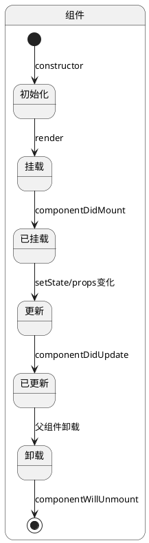
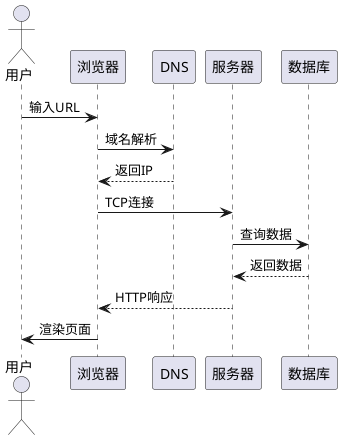

# React 19 深度进阶面试题库

---

## 一、React开发环境搭建与项目创建

### 1.1 Node.js环境配置

#### 1.1.1 Node.js简介与安装

**参考答案：**

Node.js是一个基于Chrome V8引擎的JavaScript运行时，它让JavaScript可以脱离浏览器在服务器端运行。在React开发中，Node.js是必不可少的运行环境，用于：
- 运行开发服务器
- 管理项目依赖（npm/yarn/pnpm）
- 执行构建脚本
- 运行测试

```
┌─────────────────────────────────────────────────────────────────┐
│                    Node.js 在 React 开发中的作用                   │
├─────────────────────────────────────────────────────────────────┤
│                                                                  │
│   ┌──────────────┐     ┌──────────────┐     ┌──────────────┐    │
│   │   npm/yarn   │────▶│   Vite/Webpack│────▶│ 浏览器运行   │    │
│   │  包管理器    │     │   构建工具    │     │   最终应用   │    │
│   └──────────────┘     └──────────────┘     └──────────────┘    │
│         │                    │                    │              │
│         ▼                    ▼                    ▼              │
│   ┌──────────────┐     ┌──────────────┐     ┌──────────────┐    │
│   │  node_modules│     │   开发服务器  │     │   HTML/CSS   │    │
│   │  依赖管理    │     │  HMR热更新   │     │   JS/JSX     │    │
│   └──────────────┘     └──────────────┘     └──────────────┘    │
│                                                                  │
└─────────────────────────────────────────────────────────────────┘
```

**Node.js安装步骤：**

```bash
# 1. 推荐使用 nvm（Node Version Manager）管理 Node.js 版本
# Windows 安装：https://github.com/coreybutler/nvm-windows

# 2. 或者直接下载 LTS 版本：https://nodejs.org/
# 推荐使用 LTS（长期支持）版本

# 3. 验证安装
node --version    # 查看 Node.js 版本
npm --version     # 查看 npm 版本

# 4. 常用 Node.js 命令
node -e "console.log('Hello Node.js')"  # 执行单行代码
node server.js                           # 运行 JS 文件

# 5. npm 常用命令
npm init -y              # 初始化项目
npm install <package>   # 安装依赖
npm install -D <package> # 安装开发依赖
npm install -g <package> # 全局安装
npm update               # 更新依赖
npm uninstall <package>  # 卸载依赖
npm list                 # 查看已安装的包
npm audit fix            # 安全修复

# 6. 推荐使用 pnpm（更快的包管理器）
npm install -g pnpm
pnpm --version

# 7. pnpm 常用命令
pnpm install             # 安装依赖
pnpm add <package>      # 添加依赖
pnpm add -D <package>   # 添加开发依赖
pnpm remove <package>   # 移除依赖
pnpm update              # 更新依赖
```

#### 1.1.2 nvm版本管理器使用详解

**参考答案：**

nvm（Node Version Manager）是管理Node.js版本的工具，可以轻松切换不同的Node.js版本。

```bash
# Windows 安装 nvm
# 下载并安装：https://github.com/coreybutler/nvm-windows

# macOS/Linux 安装 nvm
curl -o- https://raw.githubusercontent.com/nvm-sh/nvm/v0.39.7/install.sh | bash

# nvm 常用命令
nvm --version                           # 查看 nvm 版本
nvm list                                # 列出已安装的 Node 版本
nvm list available                      # 列出可安装的 Node 版本
nvm install 20.11.0                     # 安装指定版本
nvm install lts                         # 安装最新的 LTS 版本
nvm use 20.11.0                         # 切换到指定版本
nvm alias default 20.11.0              # 设置默认版本
nvm uninstall 18.19.0                   # 卸载指定版本
nvm current                             # 查看当前使用的版本

# .nvmrc 文件 - 项目中指定 Node 版本
# 在项目根目录创建 .nvmrc 文件，内容为版本号
echo "20.11.0" > .nvmrc
# 然后运行 nvm use 自动切换版本
nvm use
```

#### 1.1.3 开发环境最佳实践

**参考答案：**

```javascript
// package.json 完整配置示例
{
  "name": "my-react-app",
  "version": "1.0.0",
  "description": "React 应用项目",
  "type": "module",  // 启用 ES 模块
  "scripts": {
    "dev": "vite",                    // 启动开发服务器
    "build": "vite build",            // 生产构建
    "preview": "vite preview",        // 预览生产构建
    "lint": "eslint src --ext js,jsx", // 代码检查
    "format": "prettier --write src",  // 代码格式化
    "test": "vitest",                  // 运行测试
    "test:coverage": "vitest --coverage", // 测试覆盖率
    "prepare": "husky install"         // Git hooks
  },
  "dependencies": {
    "react": "^18.2.0",
    "react-dom": "^18.2.0",
    "react-router-dom": "^6.22.0",
    "zustand": "^4.5.0"
  },
  "devDependencies": {
    "@vitejs/plugin-react": "^4.2.1",
    "vite": "^5.1.0",
    "eslint": "^8.56.0",
    "prettier": "^3.2.0",
    "husky": "^8.0.3",
    "vitest": "^1.2.0"
  },
  "engines": {
    "node": ">=18.0.0",
    "npm": ">=9.0.0"
  },
  "browserslist": [
    ">0.2%",
    "not dead",
    "not op_mini all"
  ]
}
```

```bash
# 项目环境配置 checklist

# 1. 创建 .gitignore 文件
cat > .gitignore << 'EOF'
# 依赖
node_modules/
.pnp
.pnp.js

# 测试
coverage/

# 构建产物
dist/
build/

# 环境变量
.env
.env.local
.env.development.local
.env.test.local
.env.production.local

# IDE
.idea/
.vscode/
*.swp
*.swo

# OS
.DS_Store
Thumbs.db

# 日志
npm-debug.log*
yarn-debug.log*
yarn-error.log*
pnpm-debug.log*
EOF

# 2. 创建 .env 文件
cat > .env << 'EOF'
VITE_APP_TITLE=My React App
VITE_API_BASE_URL=http://localhost:3000
VITE_ENABLE_ANALYTICS=false
EOF

# 3. 配置 ESLint (.eslintrc.cjs)
module.exports = {
  root: true,
  env: {
    browser: true,
    es2021: true,
    node: true
  },
  extends: [
    'eslint:recommended',
    'plugin:react/recommended',
    'plugin:react/jsx-runtime',
    'plugin:react-hooks/recommended'
  ],
  parserOptions: {
    ecmaVersion: 'latest',
    sourceType: 'module',
    ecmaFeatures: {
      jsx: true
    }
  },
  settings: {
    react: {
      version: 'detect'
    }
  },
  rules: {
    'react/prop-types': 'off',
    'no-unused-vars': 'warn'
  }
};

# 4. 配置 Prettier (.prettierrc)
{
  "semi": true,
  "singleQuote": true,
  "tabWidth": 2,
  "trailingComma": "es5",
  "printWidth": 100,
  "bracketSpacing": true,
  "jsxSingleQuote": false,
  "arrowParens": "avoid"
}
```

---

### 1.2 使用Vite创建React项目

#### 1.2.1 Vite简介与优势

**参考答案：**

Vite是新一代前端构建工具，利用浏览器原生ES模块实现极速的开发体验。

```
┌─────────────────────────────────────────────────────────────────┐
│                        Vite 工作原理                              │
├─────────────────────────────────────────────────────────────────┤
│                                                                  │
│   开发模式：                                                     │
│   ┌─────────┐    ┌────────────┐    ┌─────────────────────┐    │
│   │ 浏览器   │───▶│ ES Modules │───▶│ 按需加载模块        │    │
│   │ 请求 .vue │    │   解析器   │    │ (无需打包)          │    │
│   └─────────┘    └────────────┘    └─────────────────────┘    │
│                                                │                │
│                                                ▼                │
│                                       ┌─────────────────────┐    │
│                                       │   Dev Server        │    │
│                                       │  (HMR 热更新)       │    │
│                                       └─────────────────────┘    │
│                                                                  │
│   生产模式：                                                     │
│   ┌─────────┐    ┌────────────┐    ┌─────────────────────┐    │
│   │ 源代码   │───▶│   Rollup   │───▶│   优化后的 bundle   │    │
│   └─────────┘    │   打包器   │    └─────────────────────┘    │
│                                                                  │
│   Vite 优势：                                                    │
│   ✦ 闪电般的冷启动（基于 ESM，无需等待打包）                      │
│   ✦ 即时的热模块替换（HMR）                                       │
│   ✦ 真正的按需编译（只处理被使用的模块）                          │
│   ✦ 开箱即用的 TypeScript、JSX、CSS 支持                         │
│                                                                  │
└─────────────────────────────────────────────────────────────────┘
```

#### 1.2.2 创建Vite React项目

**参考答案：**

```bash
# 方法一：使用 npm（推荐）
npm create vite@latest my-react-app -- --template react

# 方法二：使用 yarn
yarn create vite my-react-app --template react

# 方法三：使用 pnpm
pnpm create vite my-react-app --template react

# 方法四：交互式创建
npm create vite@latest
# 按照提示选择 React 和 JavaScript/TypeScript

# 进入项目目录
cd my-react-app

# 安装依赖
npm install

# 启动开发服务器
npm run dev

# 项目结构
my-react-app/
├── index.html          # 入口 HTML
├── package.json        # 项目配置
├── vite.config.js      # Vite 配置
├── src/
│   ├── main.jsx        # 入口 JS
│   ├── App.jsx         # 根组件
│   ├── App.css        # 样式
│   ├── index.css      # 全局样式
│   └── assets/        # 静态资源
└── public/            # 公共资源（不经过构建）
```

#### 1.2.3 Vite配置文件详解

**参考答案：**

```javascript
// vite.config.js 完整配置
import { defineConfig } from 'vite';
import react from '@vitejs/plugin-react';
import path from 'path';

// 路径别名配置
const resolve = (dir) => path.resolve(__dirname, dir);

export default defineConfig({
  // 插件配置
  plugins: [
    react({
      // 启用 Fast Refresh
      fastRefresh: true,
      // babel 配置
      babel: {
        plugins: [],
        presets: ['@babel/preset-react']
      }
    })
  ],

  // 基础路径配置
  base: '/',

  // 开发服务器配置
  server: {
    port: 3000,                    // 端口号
    host: '0.0.0.0',               // 监听地址
    open: true,                    // 启动时自动打开浏览器
    cors: true,                    // 启用 CORS
    proxy: {                       // 代理配置
      '/api': {
        target: 'http://localhost:8080',
        changeOrigin: true,
        rewrite: (path) => path.replace(/^\/api/, '')
      }
    }
  },

  // 预览服务器配置（用于生产构建后的预览）
  preview: {
    port: 4173,
    proxy: {
      '/api': 'http://localhost:8080'
    }
  },

  // 构建配置
  build: {
    outDir: 'dist',                // 输出目录
    assetsDir: 'assets',           // 静态资源目录
    sourcemap: false,             // 生成 sourcemap
    minify: 'esbuild',             // 压缩方式：esbuild | terser
    chunkSizeWarningLimit: 500,    // chunk 大小警告阈值
    rollupOptions: {               // Rollup 配置
      output: {
        // 手动分包
        manualChunks: {
          'vendor-react': ['react', 'react-dom', 'react-router-dom'],
          'vendor-utils': ['lodash', 'moment', 'axios']
        },
        // 文件名哈希
        entryFileNames: 'js/[name]-[hash].js',
        chunkFileNames: 'js/[name]-[hash].js',
        assetFileNames: '[ext]/[name]-[hash].[ext]'
      }
    }
  },

  // 解析配置
  resolve: {
    alias: {
      '@': resolve('src'),
      '@components': resolve('src/components'),
      '@utils': resolve('src/utils'),
      '@hooks': resolve('src/hooks'),
      '@services': resolve('src/services'),
      '@stores': resolve('src/stores')
    },
    extensions: ['.mjs', '.js', '.ts', '.jsx', '.tsx', '.json']
  },

  // CSS 配置
  css: {
    modules: {
      localsConvention: 'camelCase', // 类名转换方式
      generateScopedName: '[name]__[local]__[hash:base64:5]'
    },
    preprocessorOptions: {
      scss: {
        additionalData: `@import "@/styles/variables.scss";`
      }
    }
  },

  // 环境变量
  envPrefix: ['VITE_', 'REACT_APP_'],

  // 优化依赖
  optimizeDeps: {
    include: ['react', 'react-dom', 'react-router-dom'],
    exclude: []
  }
});
```

---

### 1.3 项目目录结构解析

#### 1.3.1 标准React项目结构

**参考答案：**

```
┌─────────────────────────────────────────────────────────────────┐
│                    React 项目目录结构                             │
├─────────────────────────────────────────────────────────────────┤
│                                                                  │
│ my-react-app/                                                   │
│ ├── public/                    # 公共静态资源                     │
│ │   ├── favicon.ico           # 网站图标                         │
│ │   ├── robots.txt           # 搜索引擎配置                      │
│ │   └── manifest.json         # PWA 清单文件                     │
│ │                                                                  │
│ ├── src/                       # 源代码目录                       │
│ │   ├── components/           # React 组件                       │
│ │   │   ├── common/           # 通用组件                          │
│ │   │   │   ├── Button/      # 按钮组件                          │
│ │   │   │   │   ├── Button.jsx│                                │
│ │   │   │   │   ├── Button.css│                                │
│ │   │   │   │   └── index.js │                                │
│ │   │   │   ├── Modal/        # 模态框                           │
│ │   │   │   ├── Input/       # 输入框                           │
│ │   │   │   └── Loading/     # 加载组件                          │
│ │   │   │                                                      │
│ │   │   ├── layout/           # 布局组件                         │
│ │   │   │   ├── Header.jsx   # 头部                            │
│ │   │   │   ├── Footer.jsx   # 底部                            │
│ │   │   │   ├── Sidebar.jsx  # 侧边栏                          │
│ │   │   │   └── Layout.jsx   # 主布局                          │
│ │   │   │                                                      │
│ │   │   └── features/         # 功能组件                         │
│ │   │       ├── User/        # 用户相关                          │
│ │   │       ├── Product/     # 产品相关                          │
│ │   │       └── Order/       # 订单相关                          │
│ │   │   │                                                      │
│ │   ├── pages/               # 页面组件                          │
│ │   │   ├── Home/            # 首页                              │
│ │   │   ├── About/           # 关于页                            │
│ │   │   ├── User/            # 用户页面                          │
│ │   │   └── NotFound/        # 404 页面                         │
│ │   │   │                                                      │
│ │   ├── hooks/               # 自定义 Hooks                     │
│ │   │   ├── useAuth.js       # 认证 hook                        │
│ │   │   ├── useFetch.js      # 数据获取 hook                    │
│ │   │   ├── useLocalStorage.js# 本地存储 hook                   │
│ │   │   └── useCountDown.js  # 倒计时 hook                     │
│ │   │   │                                                      │
│ │   ├── stores/              # 状态管理                          │
│ │   │   ├── index.js         # store 入口                       │
│ │   │   ├── userStore.js     # 用户状态                         │
│ │   │   └── cartStore.js     # 购物车状态                       │
│ │   │   │                                                      │
│ │   ├── services/            # API 服务                          │
│ │   │   ├── api.js           # Axios 配置                       │
│ │   │   ├── userService.js   # 用户 API                         │
│ │   │   └── productService.js# 产品 API                         │
│ │   │   │                                                      │
│ │   ├── utils/               # 工具函数                          │
│ │   │   ├── format.js        # 格式化函数                        │
│ │   │   ├── validation.js    # 验证函数                         │
│ │   │   └── helpers.js       # 辅助函数                          │
│ │   │   │                                                      │
│ │   ├── styles/              # 样式文件                          │
│ │   │   ├── variables.scss   # 变量定义                          │
│ │   │   ├── mixins.scss      # 混合宏                           │
│ │   │   └── global.scss      # 全局样式                          │
│ │   │   │                                                      │
│ │   ├── router/              # 路由配置                          │
│ │   │   ├── index.js         # 路由入口                          │
│ │   │   ├── routes.js        # 路由列表                          │
│ │   │   └── Guard.jsx        # 路由守卫                          │
│ │   │   │                                                      │
│ │   ├── constants/           # 常量定义                          │
│ │   │   ├── index.js         # 导出入口                          │
│ │   │   ├── status.js        # 状态常量                          │
│ │   │   └── config.js        # 配置常量                          │
│ │   │   │                                                      │
│ │   ├── context/             # React Context                     │
│ │   │   ├── ThemeContext.jsx # 主题上下文                        │
│ │   │   └── AuthContext.jsx  # 认证上下文                        │
│ │   │   │                                                      │
│ │   ├── App.jsx              # 根组件                            │
│ │   ├── main.jsx             # 入口文件                          │
│ │   └── index.css            # 全局样式                          │
│ │                                                                  │
│ ├── .env                      # 环境变量                         │
│ ├── .env.development         # 开发环境变量                      │
│ ├── .env.production          # 生产环境变量                      │
│ ├── .eslintrc.cjs            # ESLint 配置                       │
│ ├── .prettierrc              # Prettier 配置                     │
│ ├── .gitignore               # Git 忽略配置                      │
│ ├── index.html               # HTML 入口                         │
│ ├── package.json             # 项目配置                          │
│ └── vite.config.js           # Vite 配置                        │
│                                                                  │
└─────────────────────────────────────────────────────────────────┘
```

#### 1.3.2 组件文件组织最佳实践

**参考答案：**

```javascript
// 每个组件使用独立文件夹的示例
// components/Button/Button.jsx
import React from 'react';
import './Button.css';

/**
 * Button 组件
 * @param {string} variant - 按钮变体：primary | secondary | danger
 * @param {string} size - 按钮大小：small | medium | large
 * @param {boolean} disabled - 是否禁用
 * @param {function} onClick - 点击事件处理
 * @param {ReactNode} children - 子元素
 */
export const Button = ({
  variant = 'primary',
  size = 'medium',
  disabled = false,
  onClick,
  children
}) => {
  const className = `btn btn-${variant} btn-${size}`;

  return (
    <button
      className={className}
      disabled={disabled}
      onClick={onClick}
    >
      {children}
    </button>
  );
};

export default Button;

// components/Button/index.js
// 统一导出，方便导入
export { Button } from './Button';
export default Button;

// components/Button/Button.stories.jsx
// Storybook 故事文件（可选）
import React from 'react';
import { Button } from './Button';

export default {
  title: 'Components/Button',
  component: Button,
  argTypes: {
    variant: {
      control: 'select',
      options: ['primary', 'secondary', 'danger']
    },
    size: {
      control: 'select',
      options: ['small', 'medium', 'large']
    },
    disabled: {
      control: 'boolean'
    }
  }
};

const Template = (args) => <Button {...args} />;

export const Primary = Template.bind({});
Primary.args = {
  variant: 'primary',
  children: 'Primary Button'
};

export const Secondary = Template.bind({});
Secondary.args = {
  variant: 'secondary',
  children: 'Secondary Button'
};
```

```javascript
// barrel file - 统一导出入口
// components/index.js
export { Button } from './Button';
export { Modal } from './Modal';
export { Input } from './Input';
export { Loading } from './Loading';
// ... 其他组件

// 使用方式
import { Button, Modal, Input } from '@/components';
```

---

### 1.4 开发服务器配置

#### 1.4.1 Vite开发服务器详解

**参考答案：**

```javascript
// vite.config.js - 开发服务器详细配置
import { defineConfig } from 'vite';
import react from '@vitejs/plugin-react';
import path from 'path';

export default defineConfig({
  plugins: [react()],

  server: {
    // 端口配置
    port: 3000,
    strictPort: false,  // 端口被占用时自动尝试其他端口

    // 主机配置
    host: true,       // 监听所有网络接口
    // host: 'localhost', // 仅监听本地

    // 自动打开浏览器
    open: true,
    // open: '/',  // 指定打开的路径

    // CORS 配置
    cors: true,
    // cors: {
    //   origin: 'http://localhost:8080',
    //   methods: ['GET', 'POST'],
    //   allowedHeaders: ['Content-Type', 'Authorization']
    // },

    // 代理配置 - 开发环境解决跨域
    proxy: {
      // 字符串简写
      '/api': 'http://localhost:8080',

      // 完整配置
      '/api2': {
        target: 'http://localhost:8081',
        changeOrigin: true,
        rewrite: (path) => path.replace(/^\/api2/, ''),
        configure: (proxy, options) => {
          // 代理配置回调
        }
      },

      // WebSocket 代理
      '/ws': {
        target: 'ws://localhost:8080',
        ws: true
      },

      // 多个代理配置
      '/api': {
        target: 'http://localhost:8080',
        changeOrigin: true
      },
      '/proxy': {
        target: 'http://localhost:8081',
        changeOrigin: true
      }
    },

    // HMR 连接配置
    hmr: {
      port: 3001,
      overlay: true  // 显示错误遮罩层
    },

    // 监听文件变化
    watch: {
      ignored: ['**/node_modules/**', '**/dist/**']
    },

    // 中间件配置
    middlewareMode: false,

    // 自定义中间件
    configureServer: (server) => {
      server.middlewares.use((req, res, next) => {
        // 自定义中间件逻辑
        console.log(`[${new Date().toISOString()}] ${req.method} ${req.url}`);
        next();
      });
    }
  }
});
```

#### 1.4.2 开发环境常用工具配置

**参考答案：**

```javascript
// 开发环境常用配置示例

// 1. React DevTools 配置
// 安装 React Developer Tools 浏览器扩展
// https://chrome.google.com/webstore/detail/react-developer-tools/fmkadmapgofadopljbjfkapdkoienihi

// 2. Redux DevTools 配置
// store/index.js
import { configureStore } from '@reduxjs/toolkit';
import reducer from './reducer';

// 启用 Redux DevTools
const store = configureStore({
  reducer,
  devTools: process.env.NODE_ENV !== 'production',
  // 高级配置
  enhancers: (defaultEnhancers) => [
    ...defaultEnhancers,
    // 添加其他 enhancers
  ]
});

// 3. Vite 插件配置
// vite.config.js
import { defineConfig } from 'vite';
import react from '@vitejs/plugin-react';
import vitePluginImp from 'vite-plugin-imp';
import { resolve } from 'path';

export default defineConfig({
  plugins: [
    react(),
    // 导入优化插件
    vitePluginImp({
      libList: [
        {
          libName: 'antd',
          style: (name) => `antd/es/${name}/style`
        }
      ]
    })
  ],

  // 依赖预构建
  optimizeDeps: {
    include: [
      'react',
      'react-dom',
      'react-router-dom',
      'axios',
      'lodash'
    ]
  }
});
```

---

### 1.5 生产环境构建

#### 1.5.1 构建优化配置

**参考答案：**

```javascript
// vite.config.js - 生产构建优化配置
import { defineConfig } from 'vite';
import react from '@vitejs/plugin-react';
import path from 'path';

export default defineConfig({
  plugins: [react()],

  build: {
    // 输出目录
    outDir: 'dist',

    // 生成静态资源的目录
    assetsDir: 'assets',

    // 源代码映射（生产环境通常关闭）
    sourcemap: false,
    // sourcemap: 'hidden' // 隐藏 sourcemap 但仍生成

    // 最小化压缩
    minify: 'esbuild', // 'esbuild' | 'terser'

    // Terser 配置（如果使用 terser）
    terserOptions: {
      compress: {
        drop_console: true,    // 移除 console
        drop_debugger: true    // 移除 debugger
      },
      format: {
        comments: false        // 移除注释
      }
    },

    // chunk 大小限制
    chunkSizeWarningLimit: 500,

    // Rollup 分包配置
    rollupOptions: {
      output: {
        // 手动分包
        manualChunks: (id) => {
          // react 核心库
          if (id.includes('node_modules/react')) {
            return 'vendor-react';
          }
          // 其他第三方库
          if (id.includes('node_modules')) {
            return 'vendor';
          }
          // 页面代码
          if (id.includes('/src/pages/')) {
            return 'pages';
          }
          // 组件代码
          if (id.includes('/src/components/')) {
            return 'components';
          }
        },

        // 文件名哈希
        entryFileNames: 'js/[name].[hash].js',
        chunkFileNames: 'js/[name].[hash].js',
        assetFileNames: '[ext]/[name].[hash].[ext]',


        // 资源内联阈值
        inlineDynamicImports: false,

        // 导出格式
        format: 'es',

        // 手动指定暴露的全局变量
        globals: {
          react: 'React',
          'react-dom': 'ReactDOM'
        }
      }
    },

    // CSS 代码分割
    cssCodeSplit: true,

    // 模块预加载
    modulePreload: {
      polyfill: true
    },

    // 目标浏览器
    target: 'es2015',

    // 自定义打包逻辑
    lib: {
      entry: resolve(__dirname, 'lib/index.js'),
      name: 'MyLib',
      formats: ['es', 'umd'],
      fileName: (format) => `my-lib.${format}.js`
    }
  },

  // 压缩配置
  compressGzip: true,
  compressBrotli: true,

  // 依赖优化
  optimizeDeps: {
    include: ['react', 'react-dom'],
    exclude: []
  }
});
```

#### 1.5.2 构建结果分析

**参考答案：**

```javascript
// 使用 rollup-plugin-visualizer 分析构建结果
// vite.config.js
import { defineConfig } from 'vite';
import react from '@vitejs/plugin-react';
import { visualizer } from 'rollup-plugin-visualizer';

export default defineConfig({
  plugins: [
    react(),
    // 构建可视化
    visualizer({
      filename: 'dist/stats.html',
      open: true,
      gzipSize: true,
      brotliSize: true
    })
  ]
});

// 构建后分析命令
// npm run build -- --analyze
```

```bash
# 构建输出示例分析
# 运行 npm run build 后

# 输出目录结构
dist/
├── assets/
│   ├── index-a1b2c3d4.js      # 主应用代码 (~150KB)
│   ├── vendor-e5f6g7h8.js    # 第三方库 (~350KB)
│   └── index-i9j0k1l2.css     # 样式文件 (~30KB)
├── favicon.ico
├── index.html
└── robots.txt

# 优化建议
# 1. vendor 体积较大，考虑进一步拆分
# 2. 图片等资源应使用 CDN
# 3. 考虑启用 Gzip/Brotli 压缩
# 4. 使用动态导入减少首屏加载时间
```

---

## 二、React Router路由管理

### 2.1 BrowserRouter/HashRouter使用

#### 2.1.1 React Router v6简介

**参考答案：**

React Router是React生态系统中最流行的路由库，v6版本带来了重大的API变化和更好的体验。

```bash
# 安装 React Router
npm install react-router-dom
# 或
yarn add react-router-dom
# 或
pnpm add react-router-dom
```

```
┌─────────────────────────────────────────────────────────────────┐
│                    React Router 工作原理                          │
├─────────────────────────────────────────────────────────────────┤
│                                                                  │
│   ┌─────────────────────────────────────────────────────────┐   │
│   │                     URL 变化                             │   │
│   │  ┌─────────────┐  ┌─────────────┐  ┌─────────────┐     │   │
│   │  │ /           │  │ /about      │  │ /user/123   │     │   │
│   │  └─────────────┘  └─────────────┘  └─────────────┘     │   │
│   └─────────────────────────────────────────────────────────┘   │
│                              │                                   │
│                              ▼                                   │
│   ┌─────────────────────────────────────────────────────────┐   │
│   │              Router 组件（BrowserRouter/HashRouter）    │   │
│   │   - 监听 URL 变化                                        │   │
│   │   - 提供路由上下文                                       │   │
│   │   - 管理历史记录栈                                       │   │
│   └─────────────────────────────────────────────────────────┘   │
│                              │                                   │
│                              ▼                                   │
│   ┌─────────────────────────────────────────────────────────┐   │
│   │              Routes 组件                                  │   │
│   │   - 根据当前 URL 匹配路由                                 │   │
│   │   - 渲染匹配的组件                                       │   │
│   └─────────────────────────────────────────────────────────┘   │
│                              │                                   │
│                              ▼                                   │
│   ┌─────────────────────────────────────────────────────────┐   │
│   │              组件渲染                                    │   │
│   │   <Home />  <About />  <User />                         │   │
│   └─────────────────────────────────────────────────────────┘   │
│                                                                  │
└─────────────────────────────────────────────────────────────────┘
```

#### 2.1.2 BrowserRouter使用详解

**参考答案：**

```jsx
// 1. BrowserRouter - 使用 HTML5 History API
// 特点：URL 美观，需要服务器配置支持刷新

// main.jsx
import React from 'react';
import ReactDOM from 'react-dom/client';
import { BrowserRouter } from 'react-router-dom';
import App from './App';
import './index.css';

ReactDOM.createRoot(document.getElementById('root')).render(
  <React.StrictMode>
    <BrowserRouter
      future={{
        v7_startTransition: true,
        v7_relativeSplatPath: true
      }}
    >
      <App />
    </BrowserRouter>
  </React.StrictMode>
);

// App.jsx
import { Routes, Route, Link } from 'react-router-dom';
import Home from './pages/Home';
import About from './pages/About';
import User from './pages/User';

function App() {
  return (
    <div>
      {/* 导航链接 */}
      <nav>
        <Link to="/">首页</Link>
        <Link to="/about">关于</Link>
        <Link to="/user/123">用户</Link>
      </nav>

      {/* 路由配置 */}
      <Routes>
        <Route path="/" element={<Home />} />
        <Route path="/about" element={<About />} />
        <Route path="/user/:id" element={<User />} />
      </Routes>
    </div>
  );
}

export default App;
```

#### 2.1.3 HashRouter使用详解

**参考答案：**

```jsx
// 2. HashRouter - 使用 URL hash (#)
// 特点：兼容性好，不需要服务器配置，适合静态托管

// main.jsx
import React from 'react';
import ReactDOM from 'react-dom/client';
import { HashRouter } from 'react-router-dom';
import App from './App';

ReactDOM.createRoot(document.getElementById('root')).render(
  <React.StrictMode>
    <HashRouter>
      <App />
    </HashRouter>
  </React.StrictMode>
);

// HashRouter vs BrowserRouter 选择
// ┌─────────────────────────────────────────────────────────────┐
// │  特性        │  BrowserRouter      │  HashRouter           │
// ├──────────────┼────────────────────┼───────────────────────┤
// │  URL 格式     │  /user/123        │  /#/user/123          │
// │  美观性       │  更美观            │  有 # 号              │
// │  服务器支持    │  需要配置          │  无需配置             │
// │  SEO         │  更友好            │  不友好               │
// │  使用场景     │  SPA 应用          │  静态页面/兼容旧浏览器│
// └──────────────┴────────────────────┴───────────────────────┘
```

#### 2.1.4 MemoryRouter使用场景

**参考答案：**

```jsx
// 3. MemoryRouter - 内存路由，不改变 URL
// 适用于：测试环境、非浏览器环境

import { MemoryRouter, Routes, Route } from 'react-router-dom';

// 测试组件
function Test() {
  return <div>Test Page</div>;
}

// 在测试中使用
function test() {
  render(
    <MemoryRouter initialEntries={['/test']}>
      <Routes>
        <Route path="/test" element={<Test />} />
      </Routes>
    </MemoryRouter>
  );
}

// 在 React Native 中使用
import { NativeRouter } from 'react-router-native';
```

---

### 2.2 路由配置（Routes、Route）

#### 2.2.1 基础路由配置

**参考答案：**

```jsx
// 路由配置示例
import { Routes, Route } from 'react-router-dom';
import Home from './pages/Home';
import About from './pages/About';
import Contact from './pages/Contact';
import NotFound from './pages/NotFound';

function App() {
  return (
    <Routes>
      {/* 基础路由 */}
      <Route path="/" element={<Home />} />
      <Route path="/about" element={<About />} />
      <Route path="/contact" element={<Contact />} />

      {/* 404 页面 - 通配符匹配 */}
      <Route path="*" element={<NotFound />} />
    </Routes>
  );
}

// 多级路由配置
function App() {
  return (
    <Routes>
      <Route path="/" element={<Layout />}>
        <Route index element={<Home />} />
        <Route path="about" element={<About />} />
        <Route path="products" element={<Products />}>
          <Route path=":productId" element={<ProductDetail />} />
        </Route>
      </Route>
    </Routes>
  );
}

// Layout 组件
import { Outlet } from 'react-router-dom';

function Layout() {
  return (
    <div>
      <header>Header</header>
      <main>
        {/* 子路由渲染位置 */}
        <Outlet />
      </main>
      <footer>Footer</footer>
    </div>
  );
}
```

#### 2.2.2 路由嵌套配置

**参考答案：**

```jsx
// 嵌套路由示例
// 目录结构：
// pages/
//   ├── Admin/
//   │   ├── Admin.jsx       # 父路由
//   │   ├── Dashboard.jsx
//   │   ├── Users.jsx
//   │   └── Settings.jsx
//   └── App.jsx

// App.jsx - 主路由配置
import { Routes, Route } from 'react-router-dom';
import Admin from './pages/Admin/Admin';

function App() {
  return (
    <Routes>
      <Route path="/admin" element={<Admin />} />
    </Routes>
  );
}

// pages/Admin/Admin.jsx - 子路由配置
import { Routes, Route, Outlet, Link } from 'react-router-dom';
import Dashboard from './Dashboard';
import Users from './Users';
import Settings from './Settings';

function Admin() {
  return (
    <div className="admin-layout">
      <aside className="admin-sidebar">
        <nav>
          <Link to="/admin/dashboard">仪表盘</Link>
          <Link to="/admin/users">用户管理</Link>
          <Link to="/admin/settings">系统设置</Link>
        </nav>
      </aside>
      <main className="admin-content">
        {/* 子路由渲染位置 */}
        <Outlet />
      </main>
    </div>
  );
}

// 导出子路由配置
export default function AdminRoutes() {
  return (
    <Routes>
      <Route element={<Admin />}>
        <Route index element={<Dashboard />} />
        <Route path="dashboard" element={<Dashboard />} />
        <Route path="users" element={<Users />} />
        <Route path="settings" element={<Settings />} />
      </Route>
    </Routes>
  );
}
```

#### 2.2.3 路由索引配置

**参考答案：**

```jsx
// index 路由 - 父路由的默认显示

import { Routes, Route, Outlet, Link } from 'react-router-dom';

function Layout() {
  return (
    <div>
      <nav>
        <Link to="/">首页</Link>
        <Link to="/about">关于</Link>
      </nav>
      <hr />
      {/* Outlet 渲染匹配到的子路由 */}
      <Outlet />
    </div>
  );
}

function Home() {
  return <h2>首页</h2>;
}

function About() {
  return <h2>关于页面</h2>;
}

function App() {
  return (
    <Routes>
      <Route path="/" element={<Layout />}>
        {/* index 路由 - 当路径精确匹配 / 时渲染 */}
        <Route index element={<Home />} />

        {/* 其他子路由 */}
        <Route path="about" element={<About />} />
      </Route>
    </Routes>
  );
}
```

---

### 2.3 路由参数获取（useParams、useSearchParams）

#### 2.3.1 useParams使用详解

**参考答案：**

```jsx
// useParams - 获取 URL 参数

// 1. 动态路由参数
import { useParams, Routes, Route } from 'react-router-dom';

// 路由配置
function App() {
  return (
    <Routes>
      <Route path="/user/:id" element={<UserProfile />} />
      <Route path="/product/:category/:id" element={<ProductDetail />} />
    </Routes>
  );
}

// UserProfile 组件
function UserProfile() {
  // 获取 URL 参数
  const { id } = useParams();

  return (
    <div>
      <h2>用户ID: {id}</h2>
    </div>
  );
}

// ProductDetail 组件 - 多个参数
function ProductDetail() {
  const { category, id } = useParams();

  return (
    <div>
      <h2>分类: {category}</h2>
      <h3>产品ID: {id}</h3>
    </div>
  );
}

// 2. 使用示例 - 完整的用户页面
import { useParams, useNavigate } from 'react-router-dom';
import { useState, useEffect } from 'react';

function UserDetail() {
  const { userId } = useParams();
  const navigate = useNavigate();
  const [user, setUser] = useState(null);
  const [loading, setLoading] = useState(true);

  useEffect(() => {
    // 模拟 API 请求
    fetch(`/api/users/${userId}`)
      .then(res => res.json())
      .then(data => {
        setUser(data);
        setLoading(false);
      });
  }, [userId]);

  if (loading) return <div>加载中...</div>;

  return (
    <div>
      <button onClick={() => navigate('/users')}>返回用户列表</button>
      <h1>{user.name}</h1>
      <p>邮箱: {user.email}</p>
    </div>
  );
}
```

#### 2.3.2 useSearchParams使用详解

**参考答案：**

```jsx
// useSearchParams - 获取 URL 查询参数

import { useSearchParams, Link } from 'react-router-dom';
import { useState } from 'react';

function SearchPage() {
  // useSearchParams 返回一个数组：[searchParams, setSearchParams]
  const [searchParams, setSearchParams] = useSearchParams();

  // 获取查询参数
  const query = searchParams.get('q') || '';
  const page = parseInt(searchParams.get('page') || '1');
  const sort = searchParams.get('sort') || 'relevance';

  // 处理搜索
  const handleSearch = (e) => {
    e.preventDefault();
    const formData = new FormData(e.target);
    const q = formData.get('q');
    setSearchParams({ q, page: '1', sort });
  };

  // 切换排序
  const handleSortChange = (newSort) => {
    setSearchParams({ q: query, page: String(page), sort: newSort });
  };

  // 分页
  const handlePageChange = (newPage) => {
    setSearchParams({ q: query, page: String(newPage), sort });
  };

  return (
    <div>
      {/* 搜索表单 */}
      <form onSubmit={handleSearch}>
        <input
          name="q"
          defaultValue={query}
          placeholder="搜索..."
        />
        <button type="submit">搜索</button>
      </form>

      {/* 排序选项 */}
      <div>
        排序：
        <button onClick={() => handleSortChange('relevance')}>相关性</button>
        <button onClick={() => handleSortChange('price')}>价格</button>
        <button onClick={() => handleSortChange('date')}>时间</button>
      </div>

      {/* 当前搜索条件 */}
      <p>搜索: "{query}" | 页码: {page} | 排序: {sort}</p>

      {/* 分页 */}
      <div>
        <button
          disabled={page <= 1}
          onClick={() => handlePageChange(page - 1)}
        >
          上一页
        </button>
        <span>第 {page} 页</span>
        <button onClick={() => handlePageChange(page + 1)}>
          下一页
        </button>
      </div>

      {/* 链接跳转 */}
      <Link to="?q=react&page=2&sort=date">直接设置参数</Link>
    </div>
  );
}

// 完整的 URL 参数操作示例
function UrlParamsDemo() {
  const [searchParams, setSearchParams] = useSearchParams();

  // 获取所有参数
  console.log('所有参数:', Object.fromEntries(searchParams));

  // 判断参数是否存在
  console.log('是否有 q 参数:', searchParams.has('q'));

  // 获取参数值（带默认值）
  const page = searchParams.get('page') || '1';
  const limit = searchParams.get('limit') || '10';

  // 设置多个参数
  const updateParams = () => {
    setSearchParams({
      page: '2',
      limit: '20',
      sort: 'desc'
    });
  };

  // 删除参数
  const deleteParam = (key) => {
    searchParams.delete(key);
    setSearchParams(searchParams);
  };

  // 追加参数
  const appendParam = () => {
    searchParams.append('filter', 'active');
    setSearchParams(searchParams);
  };

  return (
    <div>
      <p>当前页码: {page}</p>
      <p>每页条数: {limit}</p>
      <button onClick={updateParams}>更新参数</button>
      <button onClick={() => deleteParam('page')}>删除 page 参数</button>
      <button onClick={appendParam}>追加参数</button>
    </div>
  );
}
```

#### 2.3.3 useLocation使用详解

**参考答案：**

```jsx
// useLocation - 获取当前位置信息

import { useLocation, useNavigate } from 'react-router-dom';

function LocationDemo() {
  const location = useLocation();

  // location 对象包含：
  // - pathname: 当前路径 '/user/123'
  // - search: 查询字符串 '?page=2&sort=name'
  // - hash: 哈希值 '#section'
  // - state: 传递的状态对象
  // - key: 唯一标识符

  return (
    <div>
      <h3>当前位置信息</h3>
      <p>路径: {location.pathname}</p>
      <p>查询参数: {location.search}</p>
      <p>哈希: {location.hash}</p>
      <p>状态: {JSON.stringify(location.state)}</p>
      <p>Key: {location.key}</p>
    </div>
  );
}

// 实际应用：页面访问追踪
function PageTracker() {
  const location = useLocation();

  useEffect(() => {
    // 记录页面访问
    console.log('页面访问:', location.pathname);
    // 可以发送到分析服务
    // analytics.track('page_view', { path: location.pathname });
  }, [location]);

  return null;
}

// 实际应用：根据 location 条件渲染
function ConditionalRender() {
  const location = useLocation();

  // 判断当前路径
  const isHome = location.pathname === '/';
  const isAdmin = location.pathname.startsWith('/admin');

  return (
    <div>
      {isHome && <HomeBanner />}
      {isAdmin && <AdminSidebar />}
    </div>
  );
}
```

---

### 2.4 路由跳转（useNavigate）

#### 2.4.1 useNavigate基础使用

**参考答案：**

```jsx
// useNavigate - 编程式路由跳转

import { useNavigate } from 'react-router-dom';

function LoginPage() {
  const navigate = useNavigate();

  const handleLogin = async (credentials) => {
    // 登录逻辑...
    const success = await login(credentials);

    if (success) {
      // 跳转到首页
      navigate('/');

      // 带状态跳转
      navigate('/', { state: { from: '/login', message: '登录成功' } });

      // 替换当前历史记录
      navigate('/', { replace: true });
    }
  };

  return (
    <form onSubmit={handleLogin}>
      {/* 表单内容 */}
    </form>
  );
}

// 基础跳转示例
function NavigationExample() {
  const navigate = useNavigate();

  return (
    <div>
      {/* 跳转到指定路径 */}
      <button onClick={() => navigate('/about')}>关于</button>

      {/* 返回上一页（-1 表示后退） */}
      <button onClick={() => navigate(-1)}>返回</button>

      {/* 跳转到指定索引的历史记录 */}
      <button onClick={() => navigate(-2)}>后退两步</button>

      {/* 替换而非推送 */}
      <button onClick={() => navigate('/home', { replace: true })}>
        替换当前
      </button>
    </div>
  );
}

// 带参数的跳转
function ProductList() {
  const navigate = useNavigate();

  const handleProductClick = (productId) => {
    // 跳转到产品详情
    navigate(`/product/${productId}`, {
      state: { from: '/products' } // 传递状态
    });
  };

  const handleSearch = (query) => {
    // 带查询参数跳转
    navigate({
      pathname: '/search',
      search: `?q=${encodeURIComponent(query)}`,
      hash: '#results'
    });
  };

  return (
    <div>
      {/* 产品列表 */}
    </div>
  );
}
```

#### 2.4.2 navigate函数详解

**参考答案：**

```jsx
// navigate 函数的多种调用方式

import { useNavigate } from 'react-router-dom';

function NavigateExamples() {
  const navigate = useNavigate();

  // 1. 字符串形式 - 简单路径
  const goToHome = () => navigate('/');

  // 2. 对象形式 - 详细配置
  const goToSearch = () => navigate({
    pathname: '/search',
    search: '?q=react',
    hash: '#results'
  });

  // 3. 数字形式 - 历史记录导航
  const goBack = () => navigate(-1);
  const goForward = () => navigate(1);

  // 4. 完整配置选项
  const advancedNavigate = () => navigate('/dashboard', {
    replace: false,       // 是否替换当前历史记录
    state: {              // 传递给目标页面的状态
      from: 'current-page',
      timestamp: Date.now()
    }
  });

  // 5. 实际应用场景

  // 登录成功后跳转
  const handleLogin = async () => {
    const result = await login();
    if (result.success) {
      // 获取来源页面，默认跳转首页
      const from = location.state?.from || '/';
      navigate(from, { replace: true });
    }
  };

  // 表单提交后跳转
  const handleSubmit = async (data) => {
    await saveData(data);
    navigate('/success', {
      state: { message: '保存成功' }
    });
  };

  // 带条件跳转
  const handleAction = () => {
    if (isValid) {
      navigate('/next-step');
    } else {
      navigate('/error', {
        state: { error: '验证失败' }
      });
    }
  };

  return (
    <div>
      <button onClick={goToHome}>首页</button>
      <button onClick={goToSearch}>搜索</button>
      <button onClick={goBack}>返回</button>
      <button onClick={goForward}>前进</button>
    </div>
  );
}

// 接收跳转状态
function TargetPage() {
  const location = useLocation();
  const message = location.state?.message;

  return <div>{message && <p>{message}</p>}</div>;
}
```

---

### 2.5 路由守卫与权限控制

#### 2.5.1 路由守卫实现

**参考答案：**

```jsx
// 路由守卫 - AuthGuard 组件

import { Navigate, useLocation } from 'react-router-dom';
import { useAuth } from '@/hooks/useAuth';

// 认证守卫
function AuthGuard({ children }) {
  const { isAuthenticated, loading } = useAuth();
  const location = useLocation();

  // 加载中显示
  if (loading) {
    return <div>加载中...</div>;
  }

  // 未认证，跳转到登录页
  if (!isAuthenticated) {
    // 记录当前路径，登录后可以返回
    return <Navigate to="/login" state={{ from: location }} replace />;
  }

  // 已认证，渲染子组件
  return children;
}

// 权限守卫 - 检查特定权限
function PermissionGuard({ children, requiredPermission }) {
  const { hasPermission } = useAuth();

  if (!hasPermission(requiredPermission)) {
    return <Navigate to="/403" replace />;
  }

  return children;
}

// 角色守卫 - 检查用户角色
function RoleGuard({ children, allowedRoles }) {
  const { user } = useAuth();

  if (!user || !allowedRoles.includes(user.role)) {
    return <Navigate to="/403" replace />;
  }

  return children;
}

// 使用守卫
function App() {
  return (
    <Routes>
      {/* 公开路由 */}
      <Route path="/login" element={<LoginPage />} />
      <Route path="/register" element={<RegisterPage />} />

      {/* 需要认证的路由 */}
      <Route
        path="/dashboard"
        element={
          <AuthGuard>
            <Dashboard />
          </AuthGuard>
        }
      />

      {/* 需要特定权限的路由 */}
      <Route
        path="/admin"
        element={
          <AuthGuard>
            <PermissionGuard requiredPermission="admin.access">
              <AdminPage />
            </PermissionGuard>
          </AuthGuard>
        }
      />

      {/* 需要特定角色的路由 */}
      <Route
        path="/settings"
        element={
          <AuthGuard>
            <RoleGuard allowedRoles={['admin', 'manager']}>
              <SettingsPage />
            </RoleGuard>
          </AuthGuard>
        }
      />
    </Routes>
  );
}
```

#### 2.5.2 完整权限控制系统

**参考答案：**

```jsx
// 完整的权限控制系统

// 1. 权限配置
const permissions = {
  'user.read': '读取用户',
  'user.create': '创建用户',
  'user.update': '更新用户',
  'user.delete': '删除用户',
  'product.read': '读取产品',
  'product.create': '创建产品',
  'product.update': '更新产品',
  'order.read': '读取订单',
  'order.process': '处理订单'
};

// 角色配置
const roles = {
  admin: ['*'], // 管理员拥有所有权限
  manager: [
    'user.read', 'user.create', 'user.update',
    'product.read', 'product.create', 'product.update',
    'order.read', 'order.process'
  ],
  staff: [
    'product.read',
    'order.read', 'order.process'
  ],
  customer: [
    'product.read',
    'order.read'
  ]
};

// 2. Auth Context
import { createContext, useContext, useState, useEffect } from 'react';

const AuthContext = createContext(null);

export function AuthProvider({ children }) {
  const [user, setUser] = useState(null);
  const [loading, setLoading] = useState(true);

  useEffect(() => {
    // 检查本地存储的登录状态
    checkAuth();
  }, []);

  const checkAuth = async () => {
    try {
      const token = localStorage.getItem('token');
      if (token) {
        const userData = await fetchUserProfile(token);
        setUser(userData);
      }
    } catch (error) {
      console.error('认证检查失败', error);
    } finally {
      setLoading(false);
    }
  };

  const login = async (credentials) => {
    const response = await fetch('/api/auth/login', {
      method: 'POST',
      body: JSON.stringify(credentials)
    });
    const data = await response.json();
    localStorage.setItem('token', data.token);
    setUser(data.user);
    return data;
  };

  const logout = () => {
    localStorage.removeItem('token');
    setUser(null);
  };

  const hasPermission = (permission) => {
    if (!user) return false;
    if (user.role === 'admin') return true;
    return roles[user.role]?.includes(permission) || false;
  };

  const hasAnyPermission = (permissionList) => {
    return permissionList.some(p => hasPermission(p));
  };

  const hasAllPermissions = (permissionList) => {
    return permissionList.every(p => hasPermission(p));
  };

  const value = {
    user,
    loading,
    login,
    logout,
    hasPermission,
    hasAnyPermission,
    hasAllPermissions,
    isAuthenticated: !!user
  };

  return (
    <AuthContext.Provider value={value}>
      {children}
    </AuthContext.Provider>
  );
}

export function useAuth() {
  const context = useContext(AuthContext);
  if (!context) {
    throw new Error('useAuth must be used within AuthProvider');
  }
  return context;
}

// 3. 权限按钮组件
function PermissionButton({ permission, children, fallback = null, ...props }) {
  const { hasPermission, isAuthenticated } = useAuth();

  if (!isAuthenticated) {
    return fallback;
  }

  if (!hasPermission(permission)) {
    return fallback;
  }

  return (
    <button {...props}>
      {children}
    </button>
  );
}

// 使用示例
function UserManagement() {
  return (
    <div>
      <h1>用户管理</h1>

      {/* 只有有权限的用户才能看到 */}
      <PermissionButton
        permission="user.create"
        onClick={handleCreateUser}
      >
        创建用户
      </PermissionButton>

      <PermissionButton
        permission="user.delete"
        onClick={handleDeleteUser}
        className="danger"
      >
        删除用户
      </PermissionButton>
    </div>
  );
}
```

---

### 2.6 懒加载路由

#### 2.6.1 React.lazy与Suspense

**参考答案：**

```jsx
// 路由懒加载 - 使用 React.lazy 和 Suspense

import { Suspense, lazy } from 'react';
import { Routes, Route } from 'react-router-dom';
import Loading from './components/Loading';

// 懒加载页面组件
const Home = lazy(() => import('./pages/Home'));
const About = lazy(() => import('./pages/About'));
const User = lazy(() => import('./pages/User'));
const Dashboard = lazy(() => import('./pages/Dashboard'));
const Settings = lazy(() => import('./pages/Settings'));
const NotFound = lazy(() => import('./pages/NotFound'));

// 懒加载配置示例
// import('./pages/Home') 返回 Promise
// 实际的文件结构：
// pages/
//   ├── Home.jsx
//   ├── About.jsx
//   └── ...

function App() {
  return (
    // Suspense 包裹懒加载的路由
    <Suspense fallback={<Loading />}>
      <Routes>
        <Route path="/" element={<Home />} />
        <Route path="/about" element={<About />} />
        <Route path="/user/:id" element={<User />} />
        <Route path="/dashboard" element={<Dashboard />} />
        <Route path="/settings" element={<Settings />} />
        <Route path="*" element={<NotFound />} />
      </Routes>
    </Suspense>
  );
}

// Loading 组件示例
function Loading() {
  return (
    <div className="loading-container">
      <div className="spinner"></div>
      <p>加载中...</p>
    </div>
  );
}
```

#### 2.6.2 路由级代码分割

**参考答案：**

```jsx
// 完整的代码分割路由配置

import { Suspense, lazy } from 'react';
import { Routes, Route } from 'react-router-dom';
import Loading from '@/components/Loading';
import MainLayout from '@/layouts/MainLayout';

// 懒加载 - 带预加载提示
const preloadHint = (importFn) => {
  return lazy(() => {
    // 预加载提示（可选）
    console.log('预加载:', importFn.name);
    return importFn();
  });
};

// 页面组件懒加载
const HomePage = lazy(() => import('@/pages/Home'));
const AboutPage = lazy(() => import('@/pages/About'));
const ProductsPage = lazy(() => import('@/pages/Products'));
const ProductDetailPage = lazy(() => import('@/pages/ProductDetail'));
const CartPage = lazy(() => import('@/pages/Cart'));
const CheckoutPage = lazy(() => import('@/pages/Checkout'));
const UserPage = lazy(() => import('@/pages/User'));
const LoginPage = lazy(() => import('@/pages/Login'));
const RegisterPage = lazy(() => import('@/pages/Register'));
const AdminPage = lazy(() => import('@/pages/Admin'));
const NotFoundPage = lazy(() => import('@/pages/NotFound'));

// 预加载 hook（鼠标悬停时预加载）
function usePreload(importFn) {
  const handleMouseEnter = () => {
    importFn();
  };
  return handleMouseEnter;
}

// 完整路由配置
function AppRoutes() {
  return (
    <Suspense
      fallback={
        <div className="full-page-loading">
          <Loading />
        </div>
      }
    >
      <Routes>
        {/* 公开路由 */}
        <Route path="/" element={<MainLayout />}>
          <Route index element={<HomePage />} />
          <Route path="about" element={<AboutPage />} />
          <Route path="products" element={<ProductsPage />} />
          <Route path="products/:id" element={<ProductDetailPage />} />
        </Route>

        {/* 购物车相关 */}
        <Route path="/cart" element={<CartPage />} />
        <Route path="/checkout" element={<CheckoutPage />} />

        {/* 用户相关 - 需要认证 */}
        <Route path="/user" element={<RequireAuth />}>
          <Route index element={<UserPage />} />
          <Route path="orders" element={<UserOrders />} />
          <Route path="settings" element={<UserSettings />} />
        </Route>

        {/* 登录注册 */}
        <Route path="/login" element={<LoginPage />} />
        <Route path="/register" element={<RegisterPage />} />

        {/* 管理后台 - 需要管理员权限 */}
        <Route path="/admin" element={<RequireAdmin />}>
          <Route path="*" element={<AdminPage />} />
        </Route>

        {/* 404 */}
        <Route path="*" element={<NotFoundPage />} />
      </Routes>
    </Suspense>
  );
}

// 认证保护组件
function RequireAuth({ children }) {
  const { isAuthenticated } = useAuth();
  const location = useLocation();

  if (!isAuthenticated) {
    return <Navigate to="/login" state={{ from: location }} replace />;
  }

  return children;
}

// 管理员保护组件
function RequireAdmin({ children }) {
  const { user } = useAuth();

  if (!user || user.role !== 'admin') {
    return <Navigate to="/403" replace />;
  }

  return children;
}
```

#### 2.6.3 预加载策略

**参考答案：**

```jsx
// 预加载策略 - 提升用户体验

import { lazy, Suspense, useState } from 'react';
import { Link } from 'react-router-dom';

// 1. 基础预加载
const ProductDetail = lazy(() => import('./pages/ProductDetail'));

// 2. 预加载组件 - 鼠标悬停时预加载
function PreloadLink({ to, children }) {
  const [preload, setPreload] = useState(null);

  const handleMouseEnter = () => {
    // 鼠标悬停时开始预加载
    if (!preload) {
      setPreload(
        import('./pages/ProductDetail')
          .then(module => module.default)
      );
    }
  };

  return (
    <Link to={to} onMouseEnter={handleMouseEnter}>
      {children}
    </Link>
  );
}

// 3. 智能预加载 Hook
function usePrefetch(routes) {
  const [preloadedRoutes, setPreloadedRoutes] = useState({});

  const prefetch = (routePath) => {
    if (!preloadedRoutes[routePath]) {
      // 触发动态导入但不等待
      import(/* webpackPrefetch: true */ `./pages/${routePath}`)
        .then(module => {
          setPreloadedRoutes(prev => ({
            ...prev,
            [routePath]: module.default
          }));
        });
    }
  };

  return { prefetch, preloadedRoutes };
}

// 4. 基于视口的预加载
import { useInView } from 'react-intersection-observer';

function ViewportPrefetch({ routePath, children }) {
  const { ref, inView } = useInView({
    threshold: 0,
    rootMargin: '100px' // 距离视口 100px 时开始预加载
  });

  useEffect(() => {
    if (inView) {
      // 视口可见时预加载
      import(/* webpackPrefetch: true */ `./pages/${routePath}`);
    }
  }, [inView, routePath]);

  return <div ref={ref}>{children}</div>;
}

// 5. 完整示例
function ProductList() {
  const products = [
    { id: 1, name: 'Product 1' },
    { id: 2, name: 'Product 2' },
    { id: 3, name: 'Product 3' }
  ];

  return (
    <div className="product-list">
      {products.map(product => (
        <ViewportPrefetch
          key={product.id}
          routePath="ProductDetail"
        >
          <Link to={`/products/${product.id}`}>
            {product.name}
          </Link>
        </ViewportPrefetch>
      ))}
    </div>
  );
}

// 6. 路由切换时的预加载
function SmartPrefetchRoutes() {
  const { pathname } = useLocation();

  useEffect(() => {
    // 根据当前路径预测可能的下一步操作
    const prefetchRoutes = {
      '/': ['About', 'Products', 'Contact'],
      '/products': ['ProductDetail', 'Cart'],
      '/cart': ['Checkout', 'Products']
    };

    const prefetchList = prefetchRoutes[pathname] || [];

    prefetchList.forEach(route => {
      // 预加载可能的下一个页面
      import(/* webpackPrefetch: true */ `./pages/${route}`);
    });
  }, [pathname]);

  return null;
}
```

---

## 三、Zustand状态管理

### 3.1 Zustand安装与配置

#### 3.1.1 Zustand简介

**参考答案：**

Zustand是一个轻量级的状态管理库，API简洁直观，比Redux和MobX更加简单。

```bash
# 安装 Zustand
npm install zustand
# 或
yarn add zustand
# 或
pnpm add zustand
```

```
┌─────────────────────────────────────────────────────────────────┐
│                    Zustand 核心概念                              │
├─────────────────────────────────────────────────────────────────┤
│                                                                  │
│   ┌─────────────────────────────────────────────────────────┐   │
│   │                    Store (状态仓库)                      │   │
│   │   ┌─────────────────────────────────────────────────┐   │   │
│   │   │  state: {                                       │   │   │
│   │   │    count: 0,                                    │   │   │
│   │   │    user: null,                                  │   │   │
│   │   │    posts: []                                    │   │   │
│   │   │  }                                              │   │   │
│   │   │                                                │   │   │
│   │   │  actions: {                                    │   │   │
│   │   │    increment: () => ...,                       │   │   │
│   │   │    setUser: (user) => ...,                     │   │   │
│   │   │    fetchPosts: async () => ...                 │   │   │
│   │   │  }                                              │   │   │
│   │   └─────────────────────────────────────────────────┘   │   │
│   └─────────────────────────────────────────────────────────┘   │
│                              │                                   │
│                              ▼                                   │
│   ┌─────────────────────────────────────────────────────────┐   │
│   │                    组件订阅                              │   │
│   │   const { count, increment } = useStore()              │   │
│   └─────────────────────────────────────────────────────────┘   │
│                                                                  │
│   Zustand 特点：                                                │
│   ✦ 极简 API - 只需创建一个 store                              │
│   ✦ 无 Provider 包裹 - 不需要嵌套 Provider                      │
│   ✦ 灵活订阅 - 只订阅需要的状态片段                              │
│   ✦ TypeScript 支持 - 完整类型推断                              │
│   ✦ 中间件支持 - devtools, persist, immer 等                   │
│                                                                  │
└─────────────────────────────────────────────────────────────────┘
```

#### 3.1.2 基础Store创建

**参考答案：**

```jsx
// 1. 最简单的 Store
import { create } from 'zustand';

const useStore = create((set) => ({
  count: 0,
  increment: () => set((state) => ({ count: state.count + 1 })),
  decrement: () => set((state) => ({ count: state.count - 1 })),
  reset: () => set({ count: 0 })
}));

// 使用 Store
function Counter() {
  const { count, increment, decrement, reset } = useStore();

  return (
    <div>
      <h2>Count: {count}</h2>
      <button onClick={increment}>+</button>
      <button onClick={decrement}>-</button>
      <button onClick={reset}>重置</button>
    </div>
  );
}

// 2. 带初始状态的 Store
import { create } from 'zustand';

const useUserStore = create((set) => ({
  // 初始状态
  user: null,
  isAuthenticated: false,
  loading: false,
  error: null,

  // Actions
  setUser: (user) => set({ user, isAuthenticated: !!user }),

  login: async (credentials) => {
    set({ loading: true, error: null });
    try {
      const response = await fetch('/api/login', {
        method: 'POST',
        body: JSON.stringify(credentials)
      });
      const user = await response.json();
      set({ user, isAuthenticated: true, loading: false });
      return user;
    } catch (error) {
      set({ error: error.message, loading: false });
      throw error;
    }
  },

  logout: () => set({ user: null, isAuthenticated: false }),

  updateProfile: (updates) => set((state) => ({
    user: { ...state.user, ...updates }
  }))
}));

// 使用
function UserProfile() {
  const { user, isAuthenticated, logout } = useUserStore();

  if (!isAuthenticated) {
    return <div>请先登录</div>;
  }

  return (
    <div>
      <h2>欢迎, {user.name}</h2>
      <button onClick={logout}>退出登录</button>
    </div>
  );
}
```

---

### 3.2 create创建store

#### 3.2.1 Store创建详解

**参考答案：**

```jsx
// create 函数详解

import { create } from 'zustand';

// 1. 基础语法
const useStore = create((set, get) => ({
  // state
  count: 0,
  data: [],

  // actions - set 用于更新状态
  increment: () => set((state) => ({ count: state.count + 1 })),

  // get 用于获取当前状态
  doubleCount: () => get().count * 2,

  // 异步 action
  fetchData: async () => {
    const response = await fetch('/api/data');
    const data = await response.json();
    set({ data });
  },

  // 条件更新
  conditionalUpdate: (value) => set((state) => ({
    count: state.count < 10 ? state.count + value : state.count
  }))
}));

// 2. 完整 Store 示例
const useCounterStore = create((set, get) => ({
  // ============ 状态 ============
  count: 0,
  step: 1,
  history: [],
  maxHistory: 10,

  // ============ 计算属性 (Getters) ============
  // 直接在 store 中定义 getter 函数
  doubleCount: () => get().count * 2,
  tripleCount: () => get().count * 3,
  isEven: () => get().count % 2 === 0,

  // ============ Actions ============

  // 同步 actions
  increment: () => set((state) => {
    const newCount = state.count + state.step;
    return {
      count: newCount,
      history: [...state.history, { type: 'increment', value: newCount, time: Date.now() }]
        .slice(-state.maxHistory)
    };
  }),

  decrement: () => set((state) => ({
    count: state.count - state.step
  })),

  setStep: (step) => set({ step: Math.max(1, step) }),

  reset: () => set({ count: 0, history: [] }),

  // 异步 actions
  incrementAsync: async () => {
    // 可以在这里处理异步逻辑
    await new Promise(resolve => setTimeout(resolve, 1000));
    get().increment();
  },

  // 带参数的异步 action
  incrementBy: async (amount) => {
    set({ loading: true });
    try {
      await new Promise(resolve => setTimeout(resolve, 500));
      set((state) => ({
        count: state.count + amount,
        loading: false
      }));
    } catch (error) {
      set({ loading: false, error: error.message });
    }
  },

  // 批量更新
  setCount: (count) => set({ count }),

  // 依赖其他状态更新
  incrementIfEven: () => {
    const { count, increment } = get();
    if (count % 2 === 0) {
      increment();
    }
  }
}));

// 3. TypeScript 完整示例
import { create } from 'zustand';

interface CounterState {
  count: number;
  increment: () => void;
  decrement: () => void;
  reset: () => void;
}

const useCounterStore = create<CounterState>((set) => ({
  count: 0,
  increment: () => set((state) => ({ count: state.count + 1 })),
  decrement: () => set((state) => ({ count: state.count - 1 })),
  reset: () => set({ count: 0 })
}));
```

#### 3.2.2 分离式的Store

**参考答案：**

```jsx
// 分离式的 Store 定义 - 更清晰的结构

// store/counterStore.js
import { create } from 'zustand';

export const useCounterStore = create((set, get) => ({
  // 状态
  count: 0,

  // Actions
  increment: () => set((state) => ({ count: state.count + 1 })),
  decrement: () => set((state) => ({ count: state.count - 1 })),
  setCount: (count) => set({ count }),

  // 复合 actions
  incrementBy: (amount) => set((state) => ({
    count: state.count + amount
  })),

  // 带验证的 actions
  decrementBy: (amount) => set((state) => {
    const newCount = state.count - amount;
    return {
      count: newCount >= 0 ? newCount : 0
    };
  })
}));

// store/userStore.js
import { create } from 'zustand';

export const useUserStore = create((set, get) => ({
  // 状态
  user: null,
  token: null,
  isAuthenticated: false,
  loading: false,
  error: null,

  // Actions
  setUser: (user) => set({ user, isAuthenticated: !!user }),

  login: async (credentials) => {
    set({ loading: true, error: null });
    try {
      const response = await fetch('/api/auth/login', {
        method: 'POST',
        headers: { 'Content-Type': 'application/json' },
        body: JSON.stringify(credentials)
      });

      if (!response.ok) {
        throw new Error('登录失败');
      }

      const { user, token } = await response.json();

      // 保存到 localStorage
      localStorage.setItem('token', token);

      set({ user, token, isAuthenticated: true, loading: false });
    } catch (error) {
      set({ error: error.message, loading: false });
    }
  },

  logout: () => {
    localStorage.removeItem('token');
    set({ user: null, token: null, isAuthenticated: false });
  },

  updateProfile: (updates) => set((state) => ({
    user: state.user ? { ...state.user, ...updates } : null
  })),

  // 初始化 - 检查登录状态
  initAuth: () => {
    const token = localStorage.getItem('token');
    if (token) {
      // 验证 token 并获取用户信息
      fetch('/api/auth/me', {
        headers: { Authorization: `Bearer ${token}` }
      })
        .then(res => res.json())
        .then(user => {
          set({ user, token, isAuthenticated: true });
        })
        .catch(() => {
          localStorage.removeItem('token');
        });
    }
  }
}));

// store/uiStore.js
import { create } from 'zustand';

export const useUIStore = create((set) => ({
  // UI 状态
  theme: 'light',
  sidebarOpen: true,
  modalOpen: false,
  modalContent: null,
  notifications: [],

  // Actions
  toggleTheme: () => set((state) => ({
    theme: state.theme === 'light' ? 'dark' : 'light'
  })),

  setTheme: (theme) => set({ theme }),

  toggleSidebar: () => set((state) => ({
    sidebarOpen: !state.sidebarOpen
  })),

  openModal: (content) => set({
    modalOpen: true,
    modalContent: content
  }),

  closeModal: () => set({
    modalOpen: false,
    modalContent: null
  }),

  addNotification: (notification) => set((state) => ({
    notifications: [
      ...state.notifications,
      { id: Date.now(), ...notification }
    ]
  })),

  removeNotification: (id) => set((state) => ({
    notifications: state.notifications.filter(n => n.id !== id)
  }))
}));

// 入口文件 - store/index.js
export { useCounterStore } from './counterStore';
export { useUserStore } from './userStore';
export { useUIStore } from './uiStore';
```

---

### 3.3 状态读取与更新

#### 3.3.1 状态选择器

**参考答案：**

```jsx
// 状态选择器 - 只订阅需要的状态片段

import { useCounterStore } from './store/counterStore';
import { useUserStore } from './store/userStore';

// 1. 基础选择器 - 选择单个状态
function Counter() {
  // 只订阅 count 状态，其他状态变化不会导致重新渲染
  const count = useCounterStore((state) => state.count);

  return <div>Count: {count}</div>;
}

// 2. 选择多个状态
function CounterDisplay() {
  const { count, step } = useCounterStore((state) => ({
    count: state.count,
    step: state.step
  }));

  return (
    <div>
      Count: {count}, Step: {step}
    </div>
  );
}

// 3. 使用箭头函数简写
function CounterButton() {
  const increment = useCounterStore((state) => state.increment);
  const decrement = useCounterStore((state) => state.decrement);

  return (
    <div>
      <button onClick={increment}>+</button>
      <button onClick={decrement}>-</button>
    </div>
  );
}

// 4. 计算属性选择器
function ComputedDisplay() {
  const doubleCount = useCounterStore((state) => state.count * 2);
  const isEven = useCounterStore((state) => state.count % 2 === 0);

  return (
    <div>
      Double: {doubleCount}, Is Even: {isEven ? 'Yes' : 'No'}
    </div>
  );
}

// 5. 使用 shallow 比较（当返回对象时）
import { shallow } from 'zustand/shallow';

function UserInfo() {
  // 使用 shallow 确保对象引用变化时才重新渲染
  const { user, isAuthenticated } = useUserStore(
    (state) => ({ user: state.user, isAuthenticated: state.isAuthenticated }),
    shallow
  );

  return (
    <div>
      {isAuthenticated ? `Hello, ${user.name}` : 'Please login'}
    </div>
  );
}

// 6. 全状态选择（需要小心使用）
function DebugView() {
  const state = useCounterStore();

  return <pre>{JSON.stringify(state, null, 2)}</pre>;
}
```

#### 3.3.2 状态更新模式

**参考答案：**

```jsx
// 状态更新最佳实践

import { create } from 'zustand';

// 1. 函数式更新 - 基于当前状态
const useStore = create((set) => ({
  count: 0,
  increment: () => set((state) => ({ count: state.count + 1 })),
  // 错误示例：直接使用外部变量
  // incrementWrong: () => set({ count: count + 1 }) // 闭包陷阱
}));

// 2. 批量更新 - 一次更新多个状态
const useStore2 = create((set) => ({
  name: '',
  age: 0,

  updateProfile: (name, age) => set({ name, age }),

  // 批量更新示例
  resetProfile: () => set({
    name: '',
    age: 0
  })
}));

// 3. 不可变性更新 - 使用展开运算符
const useListStore = create((set) => ({
  items: [],

  addItem: (item) => set((state) => ({
    items: [...state.items, item]
  })),

  removeItem: (id) => set((state) => ({
    items: state.items.filter(item => item.id !== id)
  })),

  updateItem: (id, updates) => set((state) => ({
    items: state.items.map(item =>
      item.id === id ? { ...item, ...updates } : item
    )
  })),

  reorderItems: (fromIndex, toIndex) => set((state) => {
    const newItems = [...state.items];
    const [removed] = newItems.splice(fromIndex, 1);
    newItems.splice(toIndex, 0, removed);
    return { items: newItems };
  })
}));

// 4. 嵌套对象更新
const useNestedStore = create((set) => ({
  user: {
    profile: {
      name: '',
      email: ''
    },
    settings: {
      theme: 'light',
      notifications: true
    }
  },

  // 深层更新
  updateProfile: (name, email) => set((state) => ({
    user: {
      ...state.user,
      profile: { name, email }
    }
  })),

  updateSettings: (settings) => set((state) => ({
    user: {
      ...state.user,
      settings: { ...state.user.settings, ...settings }
    }
  }))
}));

// 5. 条件更新
const useConditionalStore = create((set) => ({
  count: 0,
  maxCount: 10,

  increment: () => set((state) => ({
    count: state.count < state.maxCount ? state.count + 1 : state.count
  })),

  // 或使用 get 获取其他状态
  incrementSafe: () => set((state) => {
    const maxCount = state.maxCount;
    return {
      count: Math.min(state.count + 1, maxCount)
    };
  })
}));
```

---

### 3.4 异步actions

#### 3.4.1 异步状态管理

**参考答案：**

```jsx
// 异步 Actions 完整示例

import { create } from 'zustand';

// 带异步操作的 Store
const useAsyncStore = create((set, get) => ({
  // 状态
  data: null,
  loading: false,
  error: null,

  // 异步 Action
  fetchData: async (url) => {
    set({ loading: true, error: null });

    try {
      const response = await fetch(url);
      if (!response.ok) {
        throw new Error(`HTTP error! status: ${response.status}`);
      }
      const data = await response.json();
      set({ data, loading: false });
    } catch (error) {
      set({ error: error.message, loading: false });
    }
  },

  // 多个异步操作
  fetchUserData: async (userId) => {
    set({ loading: true, error: null });

    try {
      // 并行请求
      const [userResponse, postsResponse] = await Promise.all([
        fetch(`/api/users/${userId}`),
        fetch(`/api/users/${userId}/posts`)
      ]);

      if (!userResponse.ok || !postsResponse.ok) {
        throw new Error('Failed to fetch data');
      }

      const user = await userResponse.json();
      const posts = await postsResponse.json();

      set({
        data: { user, posts },
        loading: false
      });
    } catch (error) {
      set({ error: error.message, loading: false });
    }
  },

  // 链式异步操作
  processData: async (input) => {
    set({ loading: true, error: null });

    try {
      // 步骤 1: 验证
      const validation = await validateInput(input);
      if (!validation.valid) {
        throw new Error(validation.error);
      }

      // 步骤 2: 处理
      const processed = await processInput(input);

      // 步骤 3: 保存
      const saved = await saveData(processed);

      set({ data: saved, loading: false });
    } catch (error) {
      set({ error: error.message, loading: false });
    }
  },

  // 取消操作
  cancelFetch: () => {
    // 使用 AbortController
    set({ loading: false });
  }
}));

// 组件中使用异步 Store
function DataFetcher({ url }) {
  const { data, loading, error, fetchData } = useAsyncStore();

  useEffect(() => {
    fetchData(url);
  }, [url, fetchData]);

  if (loading) return <div>Loading...</div>;
  if (error) return <div>Error: {error}</div>;
  return <div>{JSON.stringify(data)}</div>;
}

// 完整的带分页的 Store
const usePaginatedStore = create((set, get) => ({
  items: [],
  page: 1,
  hasMore: true,
  loading: false,
  error: null,

  fetchPage: async (page) => {
    const { items } = get();
    set({ loading: true, error: null });

    try {
      const response = await fetch(`/api/items?page=${page}&limit=10`);
      const newItems = await response.json();

      set({
        items: page === 1 ? newItems : [...items, ...newItems],
        page,
        hasMore: newItems.length === 10,
        loading: false
      });
    } catch (error) {
      set({ error: error.message, loading: false });
    }
  },

  refresh: () => {
    get().fetchPage(1);
  },

  loadMore: () => {
    const { page, hasMore, loading, fetchPage } = get();
    if (!loading && hasMore) {
      fetchPage(page + 1);
    }
  }
}));
```

---

### 3.5 中间件使用（persist、devtools）

#### 3.5.1 persist中间件

**参考答案：**

```jsx
// persist 中间件 - 状态持久化

import { create } from 'zustand';
import { persist } from 'zustand/middleware';

// 1. 基础持久化
const usePersistedStore = create(
  persist(
    (set) => ({
      count: 0,
      increment: () => set((state) => ({ count: state.count + 1 })),
      decrement: () => set((state) => ({ count: state.count - 1 })),
      reset: () => set({ count: 0 })
    }),
    {
      name: 'counter-storage', // localStorage key
      // storage: localStorage // 默认使用 localStorage
    }
  )
);

// 2. 使用 sessionStorage
import { persist, createJSONStorage } from 'zustand/middleware';

const useSessionStore = create(
  persist(
    (set) => ({
      // 状态
    }),
    {
      name: 'session-storage',
      storage: createJSONStorage(() => sessionStorage)
    }
  )
);

// 3. 自定义存储
const useCustomStorageStore = create(
  persist(
    (set) => ({
      theme: 'light',
      setTheme: (theme) => set({ theme })
    }),
    {
      name: 'theme-storage',
      // 自定义存储实现
      storage: {
        getItem: (name) => {
          const value = localStorage.getItem(name);
          return value ? JSON.parse(value) : null;
        },
        setItem: (name, value) => {
          localStorage.setItem(name, JSON.stringify(value));
        },
        removeItem: (name) => {
          localStorage.removeItem(name);
        }
      }
    }
  )
);

// 4. 部分持久化
const usePartialPersistStore = create(
  persist(
    (set) => ({
      user: null,
      preferences: { theme: 'light', language: 'en' },
      cache: {}, // 不需要持久化

      setUser: (user) => set({ user }),
      setPreferences: (preferences) => set({ preferences }),
      setCache: (cache) => set({ cache })
    }),
    {
      name: 'app-storage',
      // 只持久化部分状态
      partialize: (state) => ({
        preferences: state.preferences
      })
    }
  )
);

// 5. 版本管理
const useVersionedStore = create(
  persist(
    (set) => ({
      count: 0,
      data: null,

      setCount: (count) => set({ count }),
      setData: (data) => set({ data })
    }),
    {
      name: 'versioned-storage',
      version: 1, // 版本号
      // 迁移函数
      migrate: (persistedState, version) => {
        if (version === 0) {
          // 从 version 0 迁移到 1
          return {
            ...persistedState,
            data: persistedState.data || { legacy: true }
          };
        }
        return persistedState;
      }
    }
  )
);

// 6. 完整示例 - 用户偏好设置 Store
const usePreferencesStore = create(
  persist(
    (set) => ({
      // 主题
      theme: 'light',
      setTheme: (theme) => set({ theme }),

      // 语言
      language: 'zh-CN',
      setLanguage: (language) => set({ language }),

      // 字体大小
      fontSize: 'medium',
      setFontSize: (fontSize) => set({ fontSize }),

      // 侧边栏状态
      sidebarCollapsed: false,
      toggleSidebar: () => set((state) => ({
        sidebarCollapsed: !state.sidebarCollapsed
      })),

      // 通知设置
      notifications: {
        email: true,
        push: true,
        sms: false
      },
      updateNotifications: (updates) => set((state) => ({
        notifications: { ...state.notifications, ...updates }
      })),

      // 重置所有设置
      resetPreferences: () => set({
        theme: 'light',
        language: 'zh-CN',
        fontSize: 'medium',
        sidebarCollapsed: false,
        notifications: { email: true, push: true, sms: false }
      })
    }),
    {
      name: 'preferences-storage',
      partialize: (state) => ({
        theme: state.theme,
        language: state.language,
        fontSize: state.fontSize,
        notifications: state.notifications
      })
    }
  )
);
```

#### 3.5.2 devtools中间件

**参考答案：**

```jsx
// devtools 中间件 - Redux DevTools 集成

import { create } from 'zustand';
import { devtools } from 'zustand/middleware';

// 1. 基础 devtools
const useDevtoolsStore = create(
  devtools(
    (set) => ({
      count: 0,
      increment: () => set((state) => ({ count: state.count + 1 })),
      decrement: () => set((state) => ({ count: state.count - 1 }))
    }),
    {
      name: 'CounterStore', // DevTools 中显示的名称
      enabled: process.env.NODE_ENV !== 'production'
    }
  )
);

// 2. 完整配置
const useFullDevtoolsStore = create(
  devtools(
    (set, get) => ({
      // 状态
      user: null,
      posts: [],

      // Actions
      setUser: (user) => set({ user }, false, 'setUser'),
      addPost: (post) => set((state) => ({
        posts: [...state.posts, post]
      }), false, 'addPost'),

      // 异步 Actions
      fetchPosts: async () => {
        // 开始
        set({ loading: true }, false, 'fetchPosts/start');

        try {
          const posts = await fetch('/api/posts').then(r => r.json());
          set({ posts, loading: false }, false, 'fetchPosts/success');
        } catch (error) {
          set({ error: error.message, loading: false }, false, 'fetchPosts/error');
        }
      },

      // 带有 get 的 Action
      updatePost: (id, updates) => {
        const { posts } = get();
        const updatedPosts = posts.map(p =>
          p.id === id ? { ...p, ...updates } : p
        );
        set({ posts: updatedPosts }, false, 'updatePost');
      }
    }),
    {
      name: 'AppStore',
      enabled: true,
      // 自定义 actions 序列化
      serialize: {
        options: true
      }
    }
  )
);

// 3. 结合多个中间件
import { persist, devtools } from 'zustand/middleware';

const useCombinedStore = create(
  devtools(
    persist(
      (set) => ({
        count: 0,
        increment: () => set((state) => ({ count: state.count + 1 }))
      }),
      {
        name: 'count-storage'
      }
    ),
    {
      name: 'CombinedStore'
    }
  )
);

// 4. 在 React 中使用
function CounterWithDevtools() {
  const { count, increment } = useDevtoolsStore();

  return (
    <div>
      <p>Count: {count}</p>
      <button onClick={increment}>Increment</button>
    </div>
  );
}
```

---

### 3.6 完整计数器示例

#### 3.6.1 完整计数器Store实现

**参考答案：**

```jsx
// 完整的计数器 Store 示例

import { create } from 'zustand';
import { devtools, persist } from 'zustand/middleware';

// 带完整功能的计数器 Store
const useCounterStore = create(
  devtools(
    persist(
      (set, get) => ({
        // ============ 状态 ============
        count: 0,
        step: 1,
        maxCount: 100,
        minCount: 0,
        history: [],
        maxHistory: 20,

        // 异步操作状态
        loading: false,
        error: null,

        // ============ 基础 Actions ============
        increment: () => set((state) => {
          const newCount = Math.min(state.count + state.step, state.maxCount);
          return {
            count: newCount,
            history: [
              ...state.history,
              { type: 'increment', value: newCount, time: Date.now() }
            ].slice(-state.maxHistory)
          };
        }, false, 'increment'),

        decrement: () => set((state) => {
          const newCount = Math.max(state.count - state.step, state.minCount);
          return {
            count: newCount,
            history: [
              ...state.history,
              { type: 'decrement', value: newCount, time: Date.now() }
            ].slice(-state.maxHistory)
          };
        }, false, 'decrement'),

        setCount: (count) => set((state) => ({
          count: Math.max(state.minCount, Math.min(count, state.maxCount))
        }), false, 'setCount'),

        setStep: (step) => set({ step: Math.max(1, step) }, false, 'setStep'),

        reset: () => set({
          count: 0,
          history: []
        }, false, 'reset'),

        // ============ 异步 Actions ============
        incrementAsync: async () => {
          set({ loading: true, error: null }, false, 'incrementAsync/start');

          try {
            // 模拟异步操作
            await new Promise(resolve => setTimeout(resolve, 500));

            const { count, step, maxCount } = get();
            const newCount = Math.min(count + step, maxCount);

            set((state) => ({
              count: newCount,
              loading: false,
              history: [
                ...state.history,
                { type: 'incrementAsync', value: newCount, time: Date.now() }
              ].slice(-state.maxHistory)
            }), false, 'incrementAsync/success');
          } catch (error) {
            set({ loading: false, error: error.message }, false, 'incrementAsync/error');
          }
        },

        decrementAsync: async () => {
          set({ loading: true, error: null }, false, 'decrementAsync/start');

          try {
            await new Promise(resolve => setTimeout(resolve, 500));

            const { count, step, minCount } = get();
            const newCount = Math.max(count - step, minCount);

            set((state) => ({
              count: newCount,
              loading: false,
              history: [
                ...state.history,
                { type: 'decrementAsync', value: newCount, time: Date.now() }
              ].slice(-state.maxHistory)
            }), false, 'decrementAsync/success');
          } catch (error) {
            set({ loading: false, error: error.message }, false, 'decrementAsync/error');
          }
        },

        // ============ 计算属性 (Getters) ============
        getDoubleCount: () => get().count * 2,
        getTripleCount: () => get().count * 3,
        isEven: () => get().count % 2 === 0,
        isMax: () => get().count >= get().maxCount,
        isMin: () => get().count <= get().minCount,

        // ============ 历史操作 ============
        undo: () => set((state) => {
          if (state.history.length < 2) return state;
          const newHistory = [...state.history];
          newHistory.pop(); // 移除当前
          const previous = newHistory[newHistory.length - 1];
          return {
            count: previous ? previous.value : 0,
            history: newHistory
          };
        }, false, 'undo'),

        clearHistory: () => set({ history: [] }, false, 'clearHistory')
      }),
      {
        name: 'counter-store',
        partialize: (state) => ({
          count: state.count,
          step: state.step
        })
      }
    ),
    {
      name: 'CounterStore'
    }
  )
);

// ============ 组件实现 ============

// 计数器主组件
function CounterApp() {
  const {
    count,
    step,
    loading,
    increment,
    decrement,
    setCount,
    setStep,
    reset
  } = useCounterStore();

  return (
    <div className="counter-app">
      <h1>计数器应用</h1>

      <div className="counter-display">
        <h2>当前值: {count}</h2>
        <p>步长: {step}</p>
      </div>

      <div className="counter-controls">
        <button
          onClick={decrement}
          disabled={loading}
        >
          - 减少
        </button>

        <button
          onClick={increment}
          disabled={loading}
        >
          {loading ? '加载中...' : '+ 增加'}
        </button>
      </div>

      <div className="step-control">
        <label>
          步长:
          <input
            type="number"
            value={step}
            onChange={(e) => setStep(parseInt(e.target.value) || 1)}
            min="1"
            max="100"
          />
        </label>
      </div>

      <div className="quick-actions">
        <button onClick={() => setCount(0)}>设为 0</button>
        <button onClick={() => setCount(50)}>设为 50</button>
        <button onClick={() => setCount(100)}>设为 100</button>
        <button onClick={reset}>重置</button>
      </div>
    </div>
  );
}

// 历史记录组件
function HistoryView() {
  const history = useCounterStore((state) => state.history);

  return (
    <div className="history">
      <h3>历史记录</h3>
      {history.length === 0 ? (
        <p>暂无记录</p>
      ) : (
        <ul>
          {history.slice().reverse().map((item, index) => (
            <li key={index}>
              {item.type}: {item.value} - {new Date(item.time).toLocaleTimeString()}
            </li>
          ))}
        </ul>
      )}
    </div>
  );
}

// 统计组件 - 使用计算属性
function StatsView() {
  const count = useCounterStore((state) => state.count);

  // 计算属性
  const doubleCount = count * 2;
  const tripleCount = count * 3;
  const isEven = count % 2 === 0;

  return (
    <div className="stats">
      <p>倍数统计:</p>
      <ul>
        <li>2倍: {doubleCount}</li>
        <li>3倍: {tripleCount}</li>
        <li>是偶数: {isEven ? '是' : '否'}</li>
      </ul>
    </div>
  );
}

// 完整应用
export default function App() {
  return (
    <div>
      <CounterApp />
      <hr />
      <HistoryView />
      <hr />
      <StatsView />
    </div>
  );
}
```

---

## 四、React函数式组件开发（以倒计时时钟为例）

### 4.1 useState状态管理

#### 4.1.1 useState基础用法

**参考答案：**

```jsx
// useState 基础用法

import { useState } from 'react';

// 1. 基础状态
function BasicState() {
  const [count, setCount] = useState(0);

  return (
    <div>
      <p>Count: {count}</p>
      <button onClick={() => setCount(count + 1)}>
        增加
      </button>
    </div>
  );
}

// 2. 多个状态
function MultipleStates() {
  const [name, setName] = useState('张三');
  const [age, setAge] = useState(25);
  const [isActive, setIsActive] = useState(true);

  return (
    <div>
      <p>姓名: {name}</p>
      <p>年龄: {age}</p>
      <p>状态: {isActive ? '活跃' : '不活跃'}</p>
    </div>
  );
}

// 3. 对象状态
function ObjectState() {
  const [user, setUser] = useState({
    name: '张三',
    email: 'zhangsan@example.com',
    age: 25
  });

  const updateName = () => {
    setUser({ ...user, name: '李四' });
  };

  const updateEmail = () => {
    setUser({ ...user, email: 'lisi@example.com' });
  };

  return (
    <div>
      <p>姓名: {user.name}</p>
      <p>邮箱: {user.email}</p>
      <p>年龄: {user.age}</p>
      <button onClick={updateName}>修改姓名</button>
      <button onClick={updateEmail}>修改邮箱</button>
    </div>
  );
}

// 4. 数组状态
function ArrayState() {
  const [items, setItems] = useState(['项目1', '项目2', '项目3']);

  const addItem = () => {
    const newItem = `项目${items.length + 1}`;
    setItems([...items, newItem]);
  };

  const removeItem = (index) => {
    setItems(items.filter((_, i) => i !== index));
  };

  return (
    <div>
      <ul>
        {items.map((item, index) => (
          <li key={index}>
            {item}
            <button onClick={() => removeItem(index)}>删除</button>
          </li>
        ))}
      </ul>
      <button onClick={addItem}>添加项目</button>
    </div>
  );
}

// 5. 惰性初始化 - 复杂计算
function ExpensiveInit() {
  // 只在首次渲染时执行
  const [data, setData] = useState(() => {
    // 复杂计算
    const initialData = [];
    for (let i = 0; i < 1000; i++) {
      initialData.push({ id: i, value: i * 2 });
    }
    return initialData;
  });

  return <div>数据长度: {data.length}</div>;
}
```

#### 4.1.2 useState函数式更新

**参考答案：**

```jsx
// 函数式更新 - 当新值依赖旧值时

import { useState } from 'react';

// 1. 基础函数式更新
function FunctionalUpdate() {
  const [count, setCount] = useState(0);

  // 推荐：使用函数式更新
  const increment = () => {
    setCount(prevCount => prevCount + 1);
  };

  // 错误示例：使用外部变量（闭包陷阱）
  // const incrementWrong = () => {
  //   // 这里的 count 永远是 0（如果是首次渲染时创建的闭包）
  //   setCount(count + 1);
  // };

  // 批量更新
  const incrementThree = () => {
    // React 18 会自动批处理这些更新
    setCount(c => c + 1);
    setCount(c => c + 1);
    setCount(c => c + 1);
  };

  return (
    <div>
      <p>Count: {count}</p>
      <button onClick={increment}>+1</button>
      <button onClick={incrementThree}>+3</button>
    </div>
  );
}

// 2. 对象更新
function ObjectUpdate() {
  const [form, setForm] = useState({
    username: '',
    email: '',
    password: ''
  });

  const updateField = (field, value) => {
    setForm(prevForm => ({
      ...prevForm,
      [field]: value
    }));
  };

  // 或者使用展开运算符
  const updateAll = (updates) => {
    setForm(prev => ({ ...prev, ...updates }));
  };

  return (
    <form>
      <input
        value={form.username}
        onChange={e => updateField('username', e.target.value)}
        placeholder="用户名"
      />
      <input
        value={form.email}
        onChange={e => updateField('email', e.target.value)}
        placeholder="邮箱"
      />
    </form>
  );
}

// 3. 数组更新
function ArrayUpdate() {
  const [items, setItems] = useState([
    { id: 1, name: 'Item 1' },
    { id: 2, name: 'Item 2' }
  ]);

  const addItem = (name) => {
    const newItem = {
      id: Date.now(),
      name
    };
    setItems(prev => [...prev, newItem]);
  };

  const removeItem = (id) => {
    setItems(prev => prev.filter(item => item.id !== id));
  };

  const updateItem = (id, updates) => {
    setItems(prev => prev.map(item =>
      item.id === id ? { ...item, ...updates } : item
    ));
  };

  const reorderItems = () => {
    setItems(prev => [...prev].reverse());
  };

  return (
    <div>
      {items.map(item => (
        <div key={item.id}>
          {item.name}
          <button onClick={() => removeItem(item.id)}>删除</button>
        </div>
      ))}
    </div>
  );
}
```

---

### 4.2 useEffect副作用处理

#### 4.2.1 useEffect基础用法

**参考答案：**

```jsx
// useEffect 基础用法

import { useState, useEffect } from 'react';

// 1. 组件挂载时执行（相当于 componentDidMount）
function MountEffect() {
  const [data, setData] = useState(null);

  useEffect(() => {
    console.log('组件挂载');

    // 模拟数据获取
    fetch('/api/data')
      .then(res => res.json())
      .then(setData);

    // 清理函数（组件卸载时执行）
    return () => {
      console.log('组件卸载');
    };
  }, []); // 空依赖数组表示只执行一次

  return <div>{data}</div>;
}

// 2. 依赖项变化时执行
function DependencyEffect() {
  const [count, setCount] = useState(0);
  const [name, setName] = useState('');

  // count 变化时执行
  useEffect(() => {
    console.log('Count 变化:', count);
    document.title = `Count: ${count}`;
  }, [count]); // 依赖 count

  // name 变化时执行
  useEffect(() => {
    console.log('Name 变化:', name);
  }, [name]); // 依赖 name

  // count 或 name 变化时都执行
  useEffect(() => {
    console.log('Count 或 Name 变化');
  }, [count, name]);

  return (
    <div>
      <p>Count: {count}</p>
      <button onClick={() => setCount(c => c + 1)}>增加</button>
      <input value={name} onChange={e => setName(e.target.value)} />
    </div>
  );
}

// 3. 清理函数
function CleanupEffect() {
  const [count, setCount] = useState(0);

  useEffect(() => {
    // 设置定时器
    const timer = setInterval(() => {
      console.log('Interval:', count);
    }, 1000);

    // 清理函数 - 清除定时器
    return () => {
      clearInterval(timer);
    };
  }, [count]); // 依赖 count

  return <div>{count}</div>;
}

// 4. 异步 useEffect
async function AsyncEffect() {
  const [data, setData] = useState(null);
  const [loading, setLoading] = useState(true);
  const [error, setError] = useState(null);

  useEffect(() => {
    let cancelled = false;

    async function fetchData() {
      try {
        setLoading(true);
        const response = await fetch('/api/data');

        if (!response.ok) {
          throw new Error('Network response was not ok');
        }

        const result = await response.json();

        if (!cancelled) {
          setData(result);
          setError(null);
        }
      } catch (err) {
        if (!cancelled) {
          setError(err.message);
        }
      } finally {
        if (!cancelled) {
          setLoading(false);
        }
      }
    }

    fetchData();

    // 清理函数 - 标记取消
    return () => {
      cancelled = true;
    };
  }, []); // 空依赖，只执行一次

  if (loading) return <div>加载中...</div>;
  if (error) return <div>错误: {error}</div>;
  return <div>{JSON.stringify(data)}</div>;
}
```

#### 4.2.2 useEffect实际应用场景

**参考答案：**

```jsx
// useEffect 实际应用场景

import { useState, useEffect } from 'react';

// 场景 1: 定时器
function Timer() {
  const [seconds, setSeconds] = useState(0);

  useEffect(() => {
    const id = setInterval(() => {
      setSeconds(s => s + 1);
    }, 1000);

    return () => clearInterval(id);
  }, []); // 只设置一次

  return <div>已运行: {seconds} 秒</div>;
}

// 场景 2: 监听窗口大小
function WindowSize() {
  const [size, setSize] = useState({
    width: window.innerWidth,
    height: window.innerHeight
  });

  useEffect(() => {
    function handleResize() {
      setSize({
        width: window.innerWidth,
        height: window.innerHeight
      });
    }

    window.addEventListener('resize', handleResize);

    // 清理
    return () => window.removeEventListener('resize', handleResize);
  }, []);

  return (
    <div>
      宽度: {size.width}, 高度: {size.height}
    </div>
  );
}

// 场景 3: 表单验证
function FormValidation() {
  const [email, setEmail] = useState('');
  const [error, setError] = useState('');

  useEffect(() => {
    // 邮箱验证
    if (email && !email.includes('@')) {
      setError('邮箱格式不正确');
    } else {
      setError('');
    }
  }, [email]);

  return (
    <div>
      <input
        value={email}
        onChange={e => setEmail(e.target.value)}
      />
      {error && <span style={{ color: 'red' }}>{error}</span>}
    </div>
  );
}

// 场景 4: 数据获取
function DataFetching({ userId }) {
  const [user, setUser] = useState(null);
  const [loading, setLoading] = useState(true);

  useEffect(() => {
    setLoading(true);

    fetch(`/api/users/${userId}`)
      .then(res => res.json())
      .then(data => {
        setUser(data);
        setLoading(false);
      })
      .catch(err => {
        console.error(err);
        setLoading(false);
      });
  }, [userId]); // userId 变化时重新获取

  if (loading) return <div>加载中...</div>;
  return <div>{user?.name}</div>;
}

// 场景 5: 动画
function Animation() {
  const [opacity, setOpacity] = useState(1);

  useEffect(() => {
    const id = setInterval(() => {
      setOpacity(o => o > 0 ? o - 0.1 : 1);
    }, 100);

    return () => clearInterval(id);
  }, []);

  return (
    <div style={{ opacity }}>
      渐变文字
    </div>
  );
}

// 场景 6: 键盘事件
function KeyboardHandler() {
  const [keys, setKeys] = useState([]);

  useEffect(() => {
    function handleKeyDown(e) {
      setKeys(k => [...k, e.key]);
    }

    window.addEventListener('keydown', handleKeyDown);

    return () => window.removeEventListener('keydown', handleKeyDown);
  }, []);

  return <div>按键: {keys.slice(-10).join(', ')}</div>;
}
```

---

### 4.3 useRef引用

#### 4.3.1 useRef基础用法

**参考答案：**

```jsx
// useRef 基础用法

import { useState, useEffect, useRef } from 'react';

// 1. 引用 DOM 元素
function InputFocus() {
  const inputRef = useRef(null);

  const handleClick = () => {
    // 聚焦输入框
    inputRef.current.focus();
  };

  return (
    <div>
      <input ref={inputRef} type="text" />
      <button onClick={handleClick}>聚焦</button>
    </div>
  );
}

// 2. 引用上一个状态值
function PreviousValue() {
  const [count, setCount] = useState(0);
  const prevCountRef = useRef();

  useEffect(() => {
    // 每次渲染后将当前值保存为上一个值
    prevCountRef.current = count;
  });

  const prevCount = prevCountRef.current;

  return (
    <div>
      <p>当前: {count}</p>
      <p>上一个: {prevCount}</p>
      <button onClick={() => setCount(c => c + 1)}>增加</button>
    </div>
  );
}

// 3. 存储不需要触发重新渲染的值
function MutableValue() {
  const [count, setCount] = useState(0);
  const renderCount = useRef(0);

  // 不会触发重新渲染
  renderCount.current++;

  return (
    <div>
      <p>渲染次数: {renderCount.current}</p>
      <p>状态次数: {count}</p>
      <button onClick={() => setCount(c => c + 1)}>增加</button>
    </div>
  );
}

// 4. 访问上一个 props 或 state
function PreviousProps({ value }) {
  const prevValueRef = useRef();

  useEffect(() => {
    prevValueRef.current = value;
  }, [value]);

  const prevValue = prevValueRef.current;

  return (
    <div>
      <p>当前: {value}</p>
      <p>上一个: {prevValue}</p>
    </div>
  );
}

// 5. 在定时器中引用最新值
function TimerWithRef() {
  const [count, setCount] = useState(0);
  const countRef = useRef(count);

  // 保持 ref 与 state 同步
  useEffect(() => {
    countRef.current = count;
  }, [count]);

  useEffect(() => {
    const id = setInterval(() => {
      // 使用 ref 获取最新值
      console.log('Count:', countRef.current);
      setCount(c => c + 1);
    }, 1000);

    return () => clearInterval(id);
  }, []);

  return <div>{count}</div>;
}

// 6. 动画引用
function AnimationRef() {
  const boxRef = useRef(null);

  const handleMove = () => {
    if (boxRef.current) {
      boxRef.current.style.transform = 'translateX(100px)';
    }
  };

  return (
    <div
      ref={boxRef}
      style={{
        width: 50,
        height: 50,
        background: 'blue',
        transition: 'transform 0.3s'
      }}
    >
      <button onClick={handleMove}>移动</button>
    </div>
  );
}
```

#### 4.3.2 useRef与useState对比

**参考答案：**

```jsx
// useRef vs useState 选择

import { useState, useEffect, useRef } from 'react';

// 选择 useState 的情况
// - 值需要触发组件重新渲染
// - 需要响应式更新 UI
function UseStateExample() {
  const [count, setCount] = useState(0);

  return (
    <div>
      <p>Count: {count}</p>
      <button onClick={() => setCount(c => c + 1)}>
        增加（会重新渲染）
      </button>
    </div>
  );
}

// 选择 useRef 的情况
// - 值不需要触发重新渲染
// - 需要在渲染之间保持值
// - 需要直接操作 DOM
function UseRefExample() {
  const [renderCount, setRenderCount] = useState(0);
  const notReactiveRef = useRef(0);

  const handleClick = () => {
    notReactiveRef.current++;
    setRenderCount(r => r + 1);
  };

  return (
    <div>
      <p>useState 值（响应式）: {renderCount}</p>
      <p>useRef 值（非响应式）: {notReactiveRef.current}</p>
      <button onClick={handleClick}>点击</button>
    </div>
  );
}

// 实际场景：表单输入 vs 搜索建议缓存
function SearchExample() {
  const [query, setQuery] = useState('');
  const suggestionsRef = useRef([]);

  useEffect(() => {
    // 获取搜索建议并缓存
    fetch(`/api/suggestions?q=${query}`)
      .then(res => res.json())
      .then(data => {
        suggestionsRef.current = data;
      });
  }, [query]);

  return (
    <div>
      <input
        value={query}
        onChange={e => setQuery(e.target.value)}
      />
      {/* 使用 suggestionsRef.current 获取缓存的建议 */}
    </div>
  );
}

// 典型错误：用 ref 存储 UI 相关状态
function WrongRefUsage() {
  // 错误：应该用 useState
  // const [count, setCount] = useState(0);
  // const countRef = useRef(0); // 这不会触发重新渲染！

  // 正确：需要更新 state 来触发重新渲染
  const [count, setCount] = useState(0);

  return (
    <div>
      <p>{count}</p>
      <button onClick={() => setCount(c => c + 1)}>增加</button>
    </div>
  );
}

// useRef 的正确使用模式
function CorrectRefUsage() {
  const inputRef = useRef(null);
  const timerRef = useRef(null);
  const previousPropsRef = useRef(null);

  useEffect(() => {
    // 1. DOM 引用
    inputRef.current?.focus();

    // 2. 定时器引用
    timerRef.current = setInterval(() => {}, 1000);

    return () => {
      if (timerRef.current) {
        clearInterval(timerRef.current);
      }
    };
  }, []);

  useEffect(() => {
    // 3. 上一个值引用
    previousPropsRef.current = 'some value';
  });

  return <input ref={inputRef} />;
}
```

---

### 4.4 useCallback/useMemo优化

#### 4.4.1 useCallback使用详解

**参考答案：**

```jsx
// useCallback - 缓存函数引用

import { useState, useCallback } from 'react';

// 1. 基础用法
function UseCallbackBasic() {
  const [count, setCount] = useState(0);

  // 缓存函数引用
  const increment = useCallback(() => {
    setCount(c => c + 1);
  }, []);

  const decrement = useCallback(() => {
    setCount(c => c - 1);
  }, []);

  return (
    <div>
      <p>Count: {count}</p>
      <Button onClick={increment}>+</Button>
      <Button onClick={decrement}>-</Button>
    </div>
  );
}

// 子组件 - 接收函数作为 props
function Button({ onClick, children }) {
  console.log('Button 渲染');

  return <button onClick={onClick}>{children}</button>;
}

// 2. 带依赖的 useCallback
function UseCallbackWithDeps() {
  const [count, setCount] = useState(0);
  const [name, setName] = useState('张三');

  // 只在 count 变化时重新创建
  const increment = useCallback(() => {
    setCount(c => c + 1);
  }, [count]);

  // name 变化时重新创建
  const greet = useCallback(() => {
    alert(`你好，${name}！`);
  }, [name]);

  return (
    <div>
      <p>Count: {count}</p>
      <Button onClick={increment}>增加</Button>
      <Button onClick={greet}>问候</Button>
    </div>
  );
}

// 3. 传递给子组件的回调
function ParentComponent() {
  const [value, setValue] = useState('');

  // 缓存传递给子组件的函数
  const handleChange = useCallback((e) => {
    setValue(e.target.value);
  }, []);

  const handleSubmit = useCallback(() => {
    console.log('提交:', value);
  }, [value]);

  return (
    <div>
      <ChildInput value={value} onChange={handleChange} />
      <ChildButton onClick={handleSubmit}>提交</ChildButton>
    </div>
  );
}

function ChildInput({ value, onChange }) {
  return <input value={value} onChange={onChange} />;
}

function ChildButton({ onClick, children }) {
  return <button onClick={onClick}>{children}</button>;
}

// 4. 避免过度使用 useCallback
function AvoidOveruse() {
  const [count, setCount] = useState(0);

  // 大多数情况下不需要 useCallback
  // React 的自动优化通常足够好
  const handleClick = () => {
    setCount(c => c + 1);
  };

  // 除非遇到性能问题，否则保持简单
  return (
    <button onClick={handleClick}>Count: {count}</button>
  );
}
```

#### 4.4.2 useMemo使用详解

**参考答案：**

```jsx
// useMemo - 缓存计算结果

import { useState, useMemo } from 'react';

// 1. 基础用法 - 避免重复计算
function UseMemoBasic() {
  const [count, setCount] = useState(0);
  const [numbers] = useState([1, 2, 3, 4, 5, 6, 7, 8, 9, 10]);

  // 只有 count 变化时才重新计算
  const expensiveValue = useMemo(() => {
    console.log('计算中...');
    return numbers.reduce((sum, n) => sum + n, 0) * count;
  }, [count, numbers]);

  return (
    <div>
      <p>计算结果: {expensiveValue}</p>
      <button onClick={() => setCount(c => c + 1)}>增加</button>
    </div>
  );
}

// 2. 对象引用问题
function ObjectMemo() {
  const [name, setName] = useState('张三');
  const [age, setAge] = useState(25);

  // 每次渲染都会创建新对象
  const person = { name, age };

  // 使用 useMemo 缓存对象
  const memoizedPerson = useMemo(() => ({ name, age }), [name, age]);

  return (
    <div>
      <p>{person.name}</p>
      <input value={name} onChange={e => setName(e.target.value)} />
    </div>
  );
}

// 3. 数组操作优化
function ArrayMemo() {
  const [items] = useState([
    { id: 1, name: 'A', price: 100 },
    { id: 2, name: 'B', price: 200 },
    { id: 3, name: 'C', price: 300 }
  ]);

  const [filter, setFilter] = useState('');

  const filteredItems = useMemo(() => {
    return items.filter(item =>
      item.name.toLowerCase().includes(filter.toLowerCase())
    );
  }, [items, filter]);

  const totalPrice = useMemo(() => {
    return filteredItems.reduce((sum, item) => sum + item.price, 0);
  }, [filteredItems]);

  return (
    <div>
      <input
        value={filter}
        onChange={e => setFilter(e.target.value)}
        placeholder="搜索..."
      />
      <ul>
        {filteredItems.map(item => (
          <li key={item.id}>{item.name} - ${item.price}</li>
        ))}
      </ul>
      <p>总价: ${totalPrice}</p>
    </div>
  );
}

// 4. 复杂计算
function ComplexCalculation() {
  const [n, setN] = useState(10);

  // 斐波那契数列计算
  const fibonacci = useMemo(() => {
    function fib(n) {
      if (n <= 1) return n;
      return fib(n - 1) + fib(n - 2);
    }
    return fib(n);
  }, [n]);

  return (
    <div>
      <p>Fibonacci({n}): {fibonacci}</p>
      <button onClick={() => setN(n + 1)}>n+1</button>
    </div>
  );
}

// 5. useMemo vs useCallback
function MemoVsCallback() {
  const [count, setCount] = useState(0);

  // useMemo 缓存计算值
  const doubledCount = useMemo(() => count * 2, [count]);

  // useCallback 缓存函数
  const handleClick = useCallback(() => {
    console.log(count);
  }, [count]);

  return (
    <div>
      <p>Count: {count}</p>
      <p>Doubled: {doubledCount}</p>
      <button onClick={handleClick}>点击</button>
    </div>
  );
}

// 6. React.memo 配合 useMemo/useCallback
function ChildComponent({ value, onClick }) {
  console.log('Child 渲染');
  return (
    <div onClick={onClick}>{value}</div>
  );
}

// 使用 React.memo 包装子组件
const MemoizedChild = React.memo(ChildComponent);

function ParentWithMemo() {
  const [count, setCount] = useState(0);

  // 传递 memoized 值
  const value = useMemo(() => ({ label: `Count: ${count}` }), [count]);

  // 传递 memoized 函数
  const handleClick = useCallback(() => {
    console.log('clicked');
  }, []);

  return (
    <MemoizedChild value={value} onClick={handleClick} />
  );
}
```

---

### 4.5 自定义Hooks

#### 4.5.1 自定义Hooks创建

**参考答案：**

```jsx
// 自定义 Hooks - 提取可复用的逻辑

import { useState, useEffect, useRef } from 'react';

// 1. useWindowSize - 监听窗口大小
function useWindowSize() {
  const [size, setSize] = useState({
    width: window.innerWidth,
    height: window.innerHeight
  });

  useEffect(() => {
    function handleResize() {
      setSize({
        width: window.innerWidth,
        height: window.innerHeight
      });
    }

    window.addEventListener('resize', handleResize);

    return () => window.removeEventListener('resize', handleResize);
  }, []);

  return size;
}

// 使用
function WindowSizeDemo() {
  const { width, height } = useWindowSize();

  return (
    <div>
      窗口宽度: {width}, 高度: {height}
    </div>
  );
}

// 2. useLocalStorage - 本地存储 Hook
function useLocalStorage(key, initialValue) {
  // 读取初始值
  const [storedValue, setStoredValue] = useState(() => {
    try {
      const item = window.localStorage.getItem(key);
      return item ? JSON.parse(item) : initialValue;
    } catch (error) {
      console.error(error);
      return initialValue;
    }
  });

  // 包装 setValue 函数
  const setValue = (value) => {
    try {
      const valueToStore = value instanceof Function
        ? value(storedValue)
        : value;
      setStoredValue(valueToStore);
      window.localStorage.setItem(key, JSON.stringify(valueToStore));
    } catch (error) {
      console.error(error);
    }
  };

  return [storedValue, setValue];
}

// 使用
function LocalStorageDemo() {
  const [name, setName] = useLocalStorage('name', '张三');

  return (
    <div>
      <input
        value={name}
        onChange={e => setName(e.target.value)}
      />
      <p>存储的值: {name}</p>
    </div>
  );
}

// 3. useDebounce - 防抖 Hook
function useDebounce(value, delay) {
  const [debouncedValue, setDebouncedValue] = useState(value);

  useEffect(() => {
    const handler = setTimeout(() => {
      setDebouncedValue(value);
    }, delay);

    return () => clearTimeout(handler);
  }, [value, delay]);

  return debouncedValue;
}

// 使用
function DebounceSearch() {
  const [query, setQuery] = useState('');
  const debouncedQuery = useDebounce(query, 300);

  // 实际搜索逻辑
  useEffect(() => {
    if (debouncedQuery) {
      console.log('搜索:', debouncedQuery);
    }
  }, [debouncedQuery]);

  return (
    <input
      value={query}
      onChange={e => setQuery(e.target.value)}
      placeholder="搜索..."
    />
  );
}

// 4. useInterval - 定时器 Hook
function useInterval(callback, delay) {
  const savedCallback = useRef();

  useEffect(() => {
    savedCallback.current = callback;
  }, [callback]);

  useEffect(() => {
    if (delay !== null) {
      const id = setInterval(() => savedCallback.current(), delay);
      return () => clearInterval(id);
    }
  }, [delay]);
}

// 使用
function IntervalDemo() {
  const [count, setCount] = useState(0);

  useInterval(() => {
    setCount(c => c + 1);
  }, 1000);

  return <div>Count: {count}</div>;
}

// 5. usePrevious - 获取上一个值
function usePrevious(value) {
  const ref = useRef();

  useEffect(() => {
    ref.current = value;
  }, [value]);

  return ref.current;
}

// 使用
function PreviousDemo() {
  const [count, setCount] = useState(0);
  const prevCount = usePrevious(count);

  return (
    <div>
      <p>当前: {count}</p>
      <p>上一个: {prevCount}</p>
      <button onClick={() => setCount(c => c + 1)}>增加</button>
    </div>
  );
}
```

#### 4.5.2 完整倒计时Hook

**参考答案：**

```jsx
// 完整的倒计时 Hook - useCountdown

import { useState, useEffect, useRef, useCallback } from 'react';

/**
 * 倒计时 Hook
 * @param {number} targetDate - 目标时间戳（毫秒）
 * @param {boolean} autoStart - 是否自动开始（默认 true）
 * @returns {Object} { timeLeft, isRunning, start, pause, reset }
 */
function useCountdown(targetDate, autoStart = true) {
  const [timeLeft, setTimeLeft] = useState(calculateTimeLeft(targetDate));
  const [isRunning, setIsRunning] = useState(autoStart);
  const intervalRef = useRef(null);

  // 计算剩余时间
  function calculateTimeLeft(target) {
    const now = Date.now();
    const difference = target - now;

    if (difference <= 0) {
      return {
        days: 0,
        hours: 0,
        minutes: 0,
        seconds: 0,
        milliseconds: 0,
        total: 0,
        isExpired: true
      };
    }

    return {
      days: Math.floor(difference / (1000 * 60 * 60 * 24)),
      hours: Math.floor((difference / (1000 * 60 * 60)) % 24),
      minutes: Math.floor((difference / 1000 / 60) % 60),
      seconds: Math.floor((difference / 1000) % 60),
      milliseconds: Math.floor(difference % 1000),
      total: difference,
      isExpired: false
    };
  }

  // 格式化时间（带补零）
  const formatTime = useCallback((num) => {
    return String(num).padStart(2, '0');
  }, []);

  // 启动倒计时
  const start = useCallback(() => {
    setIsRunning(true);
  }, []);

  // 暂停倒计时
  const pause = useCallback(() => {
    setIsRunning(false);
  }, []);

  // 重置倒计时
  const reset = useCallback(() => {
    setTimeLeft(calculateTimeLeft(targetDate));
    if (autoStart) {
      setIsRunning(true);
    }
  }, [targetDate, autoStart]);

  // 计时器逻辑
  useEffect(() => {
    if (isRunning && timeLeft.total > 0) {
      intervalRef.current = setInterval(() => {
        setTimeLeft(calculateTimeLeft(targetDate));
      }, 10); // 每 10ms 更新一次
    }

    return () => {
      if (intervalRef.current) {
        clearInterval(intervalRef.current);
      }
    };
  }, [isRunning, targetDate, timeLeft.total]);

  // 检查是否过期
  useEffect(() => {
    if (timeLeft.isExpired && isRunning) {
      setIsRunning(false);
    }
  }, [timeLeft.isExpired, isRunning]);

  return {
    timeLeft,
    isRunning,
    start,
    pause,
    reset,
    formatTime,
    isExpired: timeLeft.isExpired
  };
}

// 使用示例
function CountdownDemo() {
  // 设置 24 小时后的目标时间
  const targetDate = Date.now() + 24 * 60 * 60 * 1000;

  const {
    timeLeft,
    isRunning,
    start,
    pause,
    reset,
    formatTime,
    isExpired
  } = useCountdown(targetDate);

  if (isExpired) {
    return <div>倒计时结束！</div>;
  }

  return (
    <div>
      <div className="countdown">
        <span>{timeLeft.days}</span>天
        <span>{formatTime(timeLeft.hours)}</span>:
        <span>{formatTime(timeLeft.minutes)}</span>:
        <span>{formatTime(timeLeft.seconds)}</span>:
        <span>{formatTime(Math.floor(timeLeft.milliseconds / 10))}</span>
      </div>

      <div className="controls">
        <button onClick={pause} disabled={!isRunning}>
          暂停
        </button>
        <button onClick={start} disabled={isRunning}>
          开始
        </button>
        <button onClick={reset}>重置</button>
      </div>
    </div>
  );
}

// 简化版倒计时 Hook（每秒更新）
function useCountdownSimple(targetDate) {
  const [timeLeft, setTimeLeft] = useState(0);
  const [isExpired, setIsExpired] = useState(false);

  useEffect(() => {
    const calculate = () => {
      const now = Date.now();
      const diff = Math.max(0, targetDate - now);
      setTimeLeft(Math.floor(diff / 1000));
      setIsExpired(diff <= 0);
    };

    calculate();
    const timer = setInterval(calculate, 1000);

    return () => clearInterval(timer);
  }, [targetDate]);

  // 转换为时分秒
  const hours = Math.floor(timeLeft / 3600);
  const minutes = Math.floor((timeLeft % 3600) / 60);
  const seconds = timeLeft % 60;

  return { hours, minutes, seconds, timeLeft, isExpired };
}
```

---

### 4.6 完整倒计时组件实现

#### 4.6.1 倒计时时钟组件

**参考答案：**

```jsx
// 完整的倒计时时钟组件 - 实战示例

import React, { useState, useEffect, useCallback } from 'react';

// ============ 自定义 Hooks ============

// 倒计时 Hook
function useCountdown(targetDate) {
  const [timeLeft, setTimeLeft] = useState(calculateTimeLeft(targetDate));

  function calculateTimeLeft(target) {
    const now = Date.now();
    const difference = target - now;

    if (difference <= 0) {
      return {
        days: 0,
        hours: 0,
        minutes: 0,
        seconds: 0,
        total: difference
      };
    }

    return {
      days: Math.floor(difference / (1000 * 60 * 60 * 24)),
      hours: Math.floor((difference / (1000 * 60 * 60)) % 24),
      minutes: Math.floor((difference / 1000 / 60) % 60),
      seconds: Math.floor((difference / 1000) % 60),
      total: difference
    };
  }

  useEffect(() => {
    const timer = setInterval(() => {
      setTimeLeft(calculateTimeLeft(targetDate));
    }, 1000);

    return () => clearInterval(timer);
  }, [targetDate]);

  return timeLeft;
}

// 本地存储 Hook
function useLocalStorage(key, initialValue) {
  const [storedValue, setStoredValue] = useState(() => {
    try {
      const item = window.localStorage.getItem(key);
      return item ? JSON.parse(item) : initialValue;
    } catch (error) {
      return initialValue;
    }
  });

  const setValue = (value) => {
    try {
      const valueToStore = value instanceof Function
        ? value(storedValue)
        : value;
      setStoredValue(valueToStore);
      window.localStorage.setItem(key, JSON.stringify(valueToStore));
    } catch (error) {
      console.error(error);
    }
  };

  return [storedValue, setValue];
}

// ============ 组件样式 ============
const styles = {
  container: {
    fontFamily: 'Arial, sans-serif',
    maxWidth: '600px',
    margin: '50px auto',
    padding: '20px',
    textAlign: 'center',
    backgroundColor: '#f5f5f5',
    borderRadius: '10px',
    boxShadow: '0 4px 6px rgba(0,0,0,0.1)'
  },
  title: {
    color: '#333',
    marginBottom: '20px'
  },
  display: {
    display: 'flex',
    justifyContent: 'center',
    gap: '10px',
    marginBottom: '30px',
    flexWrap: 'wrap'
  },
  timeBlock: {
    display: 'flex',
    flexDirection: 'column',
    alignItems: 'center',
    backgroundColor: '#fff',
    padding: '15px 20px',
    borderRadius: '8px',
    minWidth: '80px',
    boxShadow: '0 2px 4px rgba(0,0,0,0.1)'
  },
  timeValue: {
    fontSize: '48px',
    fontWeight: 'bold',
    color: '#2196F3',
    lineHeight: 1
  },
  timeLabel: {
    fontSize: '12px',
    color: '#666',
    marginTop: '5px',
    textTransform: 'uppercase'
  },
  colon: {
    fontSize: '48px',
    color: '#2196F3',
    fontWeight: 'bold',
    alignSelf: 'flex-start',
    marginTop: '10px'
  },
  controls: {
    display: 'flex',
    justifyContent: 'center',
    gap: '10px',
    marginBottom: '20px',
    flexWrap: 'wrap'
  },
  button: {
    padding: '10px 20px',
    fontSize: '16px',
    cursor: 'pointer',
    backgroundColor: '#2196F3',
    color: 'white',
    border: 'none',
    borderRadius: '5px',
    transition: 'background-color 0.3s'
  },
  secondaryButton: {
    backgroundColor: '#9e9e9e'
  },
  inputGroup: {
    marginTop: '20px',
    padding: '20px',
    backgroundColor: '#fff',
    borderRadius: '8px'
  },
  input: {
    padding: '10px',
    fontSize: '16px',
    borderRadius: '5px',
    border: '1px solid #ddd',
    marginRight: '10px',
    marginBottom: '10px',
    width: '200px'
  },
  presets: {
    display: 'flex',
    justifyContent: 'center',
    gap: '10px',
    marginTop: '10px',
    flexWrap: 'wrap'
  },
  presetButton: {
    padding: '8px 15px',
    fontSize: '14px',
    cursor: 'pointer',
    backgroundColor: '#e3f2fd',
    color: '#1976D2',
    border: 'none',
    borderRadius: '5px'
  },
  message: {
    padding: '15px',
    marginTop: '20px',
    borderRadius: '5px',
    fontSize: '18px'
  },
  expiredMessage: {
    backgroundColor: '#ffebee',
    color: '#c62828'
  },
  completeMessage: {
    backgroundColor: '#e8f5e9',
    color: '#2e7d32'
  }
};

// ============ 时间显示组件 ============
function TimeBlock({ value, label }) {
  const formattedValue = String(value).padStart(2, '0');

  return (
    <div style={styles.timeBlock}>
      <span style={styles.timeValue}>{formattedValue}</span>
      <span style={styles.timeLabel}>{label}</span>
    </div>
  );
}

function TimeSeparator() {
  return <span style={styles.colon}>:</span>;
}

// ============ 主倒计时组件 ============
function CountdownClock() {
  // 从本地存储恢复目标时间
  const [savedTarget, setSavedTarget] = useLocalStorage('countdown-target', null);

  // 计算初始目标时间
  const getInitialTarget = useCallback(() => {
    if (savedTarget && new Date(savedTarget) > new Date()) {
      return new Date(savedTarget).getTime();
    }
    // 默认设置为 1 小时后
    return Date.now() + 60 * 60 * 1000;
  }, [savedTarget]);

  const [targetDate, setTargetDate] = useState(getInitialTarget);
  const timeLeft = useCountdown(targetDate);
  const [customTime, setCustomTime] = useState('');
  const [message, setMessage] = useState('');

  const isExpired = timeLeft.total <= 0;

  // 格式化数字
  const formatNumber = (num) => String(Math.floor(num)).padStart(2, '0');

  // 预设时间选择
  const handlePreset = (minutes) => {
    const newTarget = Date.now() + minutes * 60 * 1000;
    setTargetDate(newTarget);
    setSavedTarget(new Date(newTarget).toISOString());
    setMessage('');
  };

  // 自定义时间设置
  const handleCustomTime = (e) => {
    e.preventDefault();
    if (!customTime) return;

    const target = new Date(customTime).getTime();
    if (target > Date.now()) {
      setTargetDate(target);
      setSavedTarget(new Date(target).toISOString());
      setMessage('');
    } else {
      setMessage('请选择未来的时间');
    }
  };

  // 快速设置
  const handleQuickSet = (hours) => {
    const newTarget = Date.now() + hours * 60 * 60 * 1000;
    setTargetDate(newTarget);
    setSavedTarget(new Date(newTarget).toISOString());
    setMessage('');
  };

  return (
    <div style={styles.container}>
      <h1 style={styles.title}>倒计时时钟</h1>

      {/* 时间显示 */}
      <div style={styles.display}>
        <TimeBlock value={timeLeft.days} label="天" />
        <TimeSeparator />
        <TimeBlock value={timeLeft.hours} label="小时" />
        <TimeSeparator />
        <TimeBlock value={timeLeft.minutes} label="分钟" />
        <TimeSeparator />
        <TimeBlock value={timeLeft.seconds} label="秒" />
      </div>

      {/* 提示消息 */}
      {isExpired && (
        <div style={{...styles.message, ...styles.expiredMessage}}>
          倒计时已结束！
        </div>
      )}

      {message && (
        <div style={{...styles.message, ...styles.expiredMessage}}>
          {message}
        </div>
      )}

      {/* 预设按钮 */}
      <div style={styles.presets}>
        <button
          style={styles.presetButton}
          onClick={() => handlePreset(5)}
        >
          5 分钟
        </button>
        <button
          style={styles.presetButton}
          onClick={() => handlePreset(15)}
        >
          15 分钟
        </button>
        <button
          style={styles.presetButton}
          onClick={() => handlePreset(30)}
        >
          30 分钟
        </button>
        <button
          style={styles.presetButton}
          onClick={() => handleQuickSet(1)}
        >
          1 小时
        </button>
        <button
          style={styles.presetButton}
          onClick={() => handleQuickSet(24)}
        >
          24 小时
        </button>
      </div>

      {/* 自定义时间输入 */}
      <form style={styles.inputGroup} onSubmit={handleCustomTime}>
        <h3>设置自定义倒计时</h3>
        <input
          type="datetime-local"
          style={styles.input}
          value={customTime}
          onChange={(e) => setCustomTime(e.target.value)}
        />
        <button
          type="submit"
          style={styles.button}
        >
          开始倒计时
        </button>
      </form>

      {/* 目标时间显示 */}
      <div style={{ marginTop: '20px', color: '#666' }}>
        <p>目标时间: {new Date(targetDate).toLocaleString()}</p>
        <p>剩余时间: {formatNumber(timeLeft.days)}天 {formatNumber(timeLeft.hours)}:{formatNumber(timeLeft.minutes)}:{formatNumber(timeLeft.seconds)}</p>
      </div>
    </div>
  );
}

// ============ 高级倒计时组件 - 带毫秒和进度条 ============
function AdvancedCountdown() {
  const [targetDate, setTargetDate] = useState(Date.now() + 60 * 60 * 1000);
  const [timeLeft, setTimeLeft] = useState(calculateTimeLeft(targetDate));

  function calculateTimeLeft(target) {
    const now = Date.now();
    const diff = Math.max(0, target - now);

    const hours = Math.floor(diff / (1000 * 60 * 60));
    const minutes = Math.floor((diff % (1000 * 60 * 60)) / (1000 * 60));
    const seconds = Math.floor((diff % (1000 * 60)) / 1000);
    const milliseconds = Math.floor((diff % 1000) / 10);

    return { hours, minutes, seconds, milliseconds, total: diff };
  }

  // 高频更新（10ms）用于毫秒显示
  useEffect(() => {
    const timer = setInterval(() => {
      setTimeLeft(calculateTimeLeft(targetDate));
    }, 10);

    return () => clearInterval(timer);
  }, [targetDate]);

  // 计算进度百分比（假设总时长1小时）
  const totalDuration = 60 * 60 * 1000;
  const progress = Math.min(100, ((totalDuration - timeLeft.total) / totalDuration) * 100);

  const formatNumber = (num) => String(Math.floor(num)).padStart(2, '0');

  return (
    <div style={styles.container}>
      <h1>高级倒计时</h1>

      {/* 时间显示 */}
      <div style={styles.display}>
        <TimeBlock value={timeLeft.hours} label="时" />
        <TimeSeparator />
        <TimeBlock value={timeLeft.minutes} label="分" />
        <TimeSeparator />
        <TimeBlock value={timeLeft.seconds} label="秒" />
        <span style={{ ...styles.colon, fontSize: '24px', marginTop: '30px' }}>
          .
        </span>
        <TimeBlock value={timeLeft.milliseconds} label="毫秒" />
      </div>

      {/* 进度条 */}
      <div style={{
        width: '100%',
        height: '10px',
        backgroundColor: '#e0e0e0',
        borderRadius: '5px',
        marginTop: '20px',
        overflow: 'hidden'
      }}>
        <div style={{
          width: `${progress}%`,
          height: '100%',
          backgroundColor: '#2196F3',
          transition: 'width 0.1s linear'
        }} />
      </div>

      {/* 重新开始按钮 */}
      <div style={styles.controls}>
        <button
          style={styles.button}
          onClick={() => setTargetDate(Date.now() + 60 * 60 * 1000)}
        >
          重新开始
        </button>
      </div>
    </div>
  );
}

// ============ 导出组件 ============
export { CountdownClock, AdvancedCountdown };
export default CountdownClock;
```

---

## 五、React 18新特性

### 5.1 Automatic Batching自动批处理

#### 5.1.1 自动批处理详解

**参考答案：**

React 18 引入了自动批处理，即使在 setTimeout、Promise 等异步操作中也会进行批处理。

```jsx
// Automatic Batching 自动批处理

import { useState, useEffect } from 'react';

// React 18 之前的批处理
// 只在事件处理函数中自动批处理
function OldBatching() {
  const [count, setCount] = useState(0);
  const [flag, setFlag] = useState(false);

  const handleClick = () => {
    // 在事件处理函数中 - 自动批处理
    setCount(c => c + 1); // 不触发重渲染
    setFlag(f => !f);     // 不触发重渲染
    // 只触发一次重渲染
  };

  return <button onClick={handleClick}>点击</button>;
}

// React 18 的自动批处理
function NewBatching() {
  const [count, setCount] = useState(0);
  const [flag, setFlag] = useState(false);

  const handleClick = async () => {
    // 在 async 函数中也会自动批处理
    await Promise.resolve();
    setCount(c => c + 1); // 不触发重渲染
    setFlag(f => !f);     // 不触发重渲染
    // 只触发一次重渲染
  };

  // setTimeout 中也会自动批处理
  const handleTimeout = () => {
    setTimeout(() => {
      setCount(c => c + 1); // 不触发重渲染
      setFlag(f => !f);     // 不触发重渲染
      // 只触发一次重渲染
    }, 1000);
  };

  // Promise 中也会自动批处理
  const handlePromise = () => {
    fetch('/api/data')
      .then(() => {
        setCount(c => c + 1); // 不触发重渲染
        setFlag(f => !f);     // 不触发重渲染
        // 只触发一次重渲染
      });
  };

  return (
    <div>
      <p>Count: {count}, Flag: {flag.toString()}</p>
      <button onClick={handleClick}>Async Click</button>
      <button onClick={handleTimeout}>Timeout</button>
      <button onClick={handlePromise}>Promise</button>
    </div>
  );
}

// flushSync - 强制立即更新
import { flushSync } from 'react-dom';

function FlushSyncExample() {
  const [count, setCount] = useState(0);
  const [flag, setFlag] = useState(false);

  const handleClick = () => {
    flushSync(() => {
      setCount(c => c + 1); // 立即触发重渲染
    });
    // 第一次重渲染完成

    flushSync(() => {
      setFlag(f => !f); // 立即触发重渲染
    });
    // 第二次重渲染完成
  };

  return (
    <div>
      <p>Count: {count}, Flag: {flag.toString()}</p>
      <button onClick={handleClick}>点击</button>
    </div>
  );
}
```

---

### 5.2 Suspense与lazy

#### 5.2.1 Suspense详解

**参考答案：**

```jsx
// Suspense - 数据获取和代码分割

import { Suspense, lazy, useState, useEffect } from 'react';

// 1. 基础 Suspense
function BasicSuspense() {
  return (
    <Suspense fallback={<div>加载中...</div>}>
      <DataComponent />
    </Suspense>
  );
}

// 2. Suspense 与数据获取
function DataComponent() {
  // 模拟异步数据获取
  const data = useSomeData();

  return <div>{data.name}</div>;
}

function useSomeData() {
  // 在组件中抛出 Promise 来触发 Suspense
  throw new Promise((resolve) => {
    setTimeout(() => {
      resolve({ name: '张三' });
    }, 1000);
  });
}

// 3. 多个 Suspense 边界
function MultipleSuspense() {
  return (
    <div>
      <Suspense fallback={<div>Header loading...</div>}>
        <Header />
      </Suspense>

      <div style={{ display: 'flex' }}>
        <Suspense fallback={<div>Sidebar loading...</div>}>
          <Sidebar />
        </Suspense>

        <Suspense fallback={<div>Content loading...</div>}>
          <Content />
        </Suspense>
      </div>
    </div>
  );
}

// 4. Suspense 与错误边界
import { ErrorBoundary } from 'react-error-boundary';

function ErrorBoundaryExample() {
  return (
    <ErrorBoundary
      fallback={<div>出错了！</div>}
    >
      <Suspense fallback={<div>加载中...</div>}>
        <DataComponent />
      </Suspense>
    </ErrorBoundary>
  );
}

// 5. 完整示例：带错误边界的 Suspense
function FullSuspenseExample() {
  return (
    <ErrorBoundary
      fallbackRender={({ error, resetErrorBoundary }) => (
        <div>
          <h2>出错了</h2>
          <p>{error.message}</p>
          <button onClick={resetErrorBoundary}>重试</button>
        </div>
      )}
    >
      <Suspense
        fallback={
          <div className="loading-skeleton">
            <div className="skeleton-header" />
            <div className="skeleton-content" />
          </div>
        }
      >
        <AsyncDataComponent />
      </Suspense>
    </ErrorBoundary>
  );
}

function AsyncDataComponent() {
  const [data, setData] = useState(null);

  useEffect(() => {
    fetch('/api/data')
      .then(res => res.json())
      .then(setData);
  }, []);

  if (!data) {
    throw new Promise((resolve) => {
      // 模拟延迟
      setTimeout(resolve, 1000);
    });
  }

  return <div>{data.name}</div>;
}

// 6. Transition 中的 Suspense
import { useTransition } from 'react';

function TransitionSuspense() {
  const [isPending, startTransition] = useState();
  const [query, setQuery] = useState('');

  const handleChange = (e) => {
    const value = e.target.value;

    // 紧急更新
    setQuery(value);

    // 非紧急更新
    startTransition(() => {
      // 搜索操作会触发 Suspense
      setSearchQuery(value);
    });
  };

  return (
    <div>
      <input value={query} onChange={handleChange} />
      {isPending && <div>搜索中...</div>}
      <Suspense fallback={<div>加载结果...</div>}>
        <SearchResults query={query} />
      </Suspense>
    </div>
  );
}
```

---

### 5.3 useTransition/useDeferredValue

#### 5.3.1 useTransition详解

**参考答案：**

```jsx
// useTransition - 标记非紧急更新

import { useState, useTransition } from 'react';

function TransitionExample() {
  const [query, setQuery] = useState('');
  const [results, setResults] = useState([]);
  const [isPending, startTransition] = useTransition();

  const handleChange = (e) => {
    const value = e.target.value;

    // 紧急更新 - 输入框立即响应
    setQuery(value);

    // 非紧急更新 - 搜索结果可以延迟渲染
    startTransition(() => {
      // 这里是耗时的搜索操作
      setResults(searchItems(value));
    });
  };

  return (
    <div>
      <input value={query} onChange={handleChange} />

      {isPending ? (
        <div>加载中...</div>
      ) : (
        <ul>
          {results.map(item => (
            <li key={item.id}>{item.name}</li>
          ))}
        </ul>
      )}
    </div>
  );
}

// 模拟搜索函数
function searchItems(query) {
  const allItems = Array.from({ length: 1000 }, (_, i) => ({
    id: i,
    name: `Item ${i}`
  }));

  return allItems.filter(item =>
    item.name.toLowerCase().includes(query.toLowerCase())
  );
}

// useTransition 的完整示例
function FullTransitionExample() {
  const [query, setQuery] = useState('');
  const [items, setItems] = useState([]);
  const [isPending, startTransition] = useTransition();

  const handleSearch = (searchQuery) => {
    // 紧急更新
    setQuery(searchQuery);

    // 非紧急更新
    startTransition(() => {
      const results = performSearch(searchQuery);
      setItems(results);
    });
  };

  return (
    <div className="search-app">
      <input
        type="text"
        value={query}
        onChange={(e) => handleSearch(e.target.value)}
        placeholder="搜索..."
      />

      <div className="status">
        {isPending && <span className="loading">搜索中...</span>}
      </div>

      <div className="results">
        {items.map(item => (
          <div key={item.id} className="result-item">
            {item.title}
          </div>
        ))}
      </div>
    </div>
  );
}

function performSearch(query) {
  // 模拟耗时搜索
  return Array.from({ length: 100 }, (_, i) => ({
    id: i,
    title: `${query} - 结果 ${i + 1}`
  }));
}

// 带 Suspense 的 useTransition
function TransitionWithSuspense() {
  const [query, setQuery] = useState('');
  const [isPending, startTransition] = useTransition();
  const [deferredQuery] = useDeferredValue(query);

  const handleChange = (e) => {
    const value = e.target.value;
    setQuery(value);

    startTransition(() => {
      // 延迟更新
    });
  };

  return (
    <Suspense fallback={<div>加载中...</div>}>
      <input value={query} onChange={handleChange} />
      {isPending && <div>更新中...</div>}
      <ExpensiveList query={deferredQuery} />
    </Suspense>
  );
}

import { useDeferredValue, Suspense } from 'react';

function ExpensiveList({ query }) {
  // 耗时的列表渲染
  const items = Array.from({ length: 1000 }, (_, i) => ({
    id: i,
    text: `Item ${i} with query ${query}`
  }));

  return (
    <ul>
      {items.map(item => (
        <li key={item.id}>{item.text}</li>
      ))}
    </ul>
  );
}
```

#### 5.3.2 useDeferredValue详解

**参考答案：**

```jsx
// useDeferredValue - 延迟非关键值

import { useDeferredValue, useState, Suspense } from 'react';

// 1. 基础用法
function DeferredValueExample() {
  const [query, setQuery] = useState('');
  // 延迟版本 - 会滞后于 query 更新
  const deferredQuery = useDeferredValue(query);

  return (
    <div>
      <input
        value={query}
        onChange={(e) => setQuery(e.target.value)}
        placeholder="搜索..."
      />

      <ExpensiveComponent query={deferredQuery} />
    </div>
  );
}

function ExpensiveComponent({ query }) {
  // 模拟耗时渲染
  const items = Array.from({ length: 1000 }, (_, i) => ({
    id: i,
    text: `Item ${i} matching ${query}`
  }));

  return (
    <ul>
      {items.map(item => (
        <li key={item.id}>{item.text}</li>
      ))}
    </ul>
  );
}

// 2. useDeferredValue vs useTransition
// useDeferredValue - 用于值（value）
// useTransition - 用于更新（setter）

// 使用 useDeferredValue
function UseDeferredValue() {
  const [query, setQuery] = useState('');
  const deferredQuery = useDeferredValue(query);

  return <SearchResults query={deferredQuery} />;
}

// 使用 useTransition（等效）
function UseTransition() {
  const [query, setQuery] = useState('');
  const [_, startTransition] = useTransition();
  const handleChange = (e) => {
    const value = e.target.value;
    setQuery(value);
    startTransition(() => {
      // 空操作，只是为了标记
    });
  };

  return <SearchResults query={query} />;
}

// 3. 完整示例
function SearchPage() {
  const [query, setQuery] = useState('');
  const [isStale, setIsStale] = useState(false);

  const deferredQuery = useDeferredValue(query);

  // 标记延迟状态
  const isPending = query !== deferredQuery;

  return (
    <div className="search-page">
      <div className="search-input-wrapper">
        <input
          value={query}
          onChange={(e) => setQuery(e.target.value)}
          placeholder="输入搜索内容..."
          className="search-input"
        />
        {isPending && <span className="loading-indicator" />}
      </div>

      <Suspense fallback={<div>加载中...</div>}>
        <SearchResults
          query={deferredQuery}
          isStale={isPending}
        />
      </Suspense>
    </div>
  );
}

function SearchResults({ query, isStale }) {
  // 实际的搜索和渲染逻辑
  const results = performSearch(query);

  return (
    <div className={`results ${isStale ? 'stale' : ''}`}>
      {results.map(result => (
        <ResultItem key={result.id} result={result} />
      ))}
    </div>
  );
}

function ResultItem({ result }) {
  return <div className="result-item">{result.name}</div>;
}

function performSearch(query) {
  // 模拟搜索
  return [];
}
```

---

### 5.4 useId生成唯一ID

#### 5.4.1 useId使用详解

**参考答案：**

```jsx
// useId - 生成稳定的唯一 ID

import { useId } from 'react';

// 1. 基础用法
function BasicUseId() {
  const id = useId();

  return (
    <div>
      <label htmlFor={id}>用户名</label>
      <input id={id} type="text" />
    </div>
  );
}

// 2. 多个表单字段
function FormWithUseId() {
  const nameId = useId();
  const emailId = useId();
  const passwordId = useId();

  return (
    <form>
      <div>
        <label htmlFor={nameId}>姓名</label>
        <input id={nameId} type="text" />
      </div>

      <div>
        <label htmlFor={emailId}>邮箱</label>
        <input id={emailId} type="email" />
      </div>

      <div>
        <label htmlFor={passwordId}>密码</label>
        <input id={passwordId} type="password" />
      </div>
    </form>
  );
}

// 3. 动态列表中的 ID
function ListWithIds() {
  const items = [
    { id: 1, name: 'Item 1' },
    { id: 2, name: 'Item 2' }
  ];

  return (
    <ul>
      {items.map((item) => (
        <ListItem key={item.id} item={item} />
      ))}
    </ul>
  );
}

function ListItem({ item }) {
  const checkboxId = useId();

  return (
    <li>
      <input type="checkbox" id={checkboxId} />
      <label htmlFor={checkboxId}>{item.name}</label>
    </li>
  );
}

// 4. 与第三方库结合
function ThirdPartyIntegration() {
  const labelId = useId();
  const errorId = useId();

  return (
    <div>
      <label id={labelId}>用户名</label>
      <input
        aria-labelledby={labelId}
        aria-describedby={errorId}
      />
      <div id={errorId} role="alert">
        用户名不能为空
      </div>
    </div>
  );
}

// 5. 服务器端渲染兼容
function SSRCompatible() {
  // useId 在服务器和客户端生成相同的 ID
  // 避免 hydration 不匹配

  const id = useId();

  // 这个 id 在服务端和客户端是一致的
  return <div id={id}>内容</div>;
}

// 6. 自定义组件中使用 useId
function CustomInput({ label, error }) {
  const inputId = useId();
  const errorId = useId();

  return (
    <div className="input-wrapper">
      <label htmlFor={inputId}>{label}</label>
      <input
        id={inputId}
        aria-invalid={!!error}
        aria-describedby={error ? errorId : undefined}
      />
      {error && (
        <span id={errorId} className="error" role="alert">
          {error}
        </span>
      )}
    </div>
  );
}

// 7. 前缀使用
function PrefixedId() {
  const id = useId();

  // 添加前缀以避免 ID 冲突
  const prefixedId = `myapp-${id}`;

  return <div id={prefixedId}>内容</div>;
}
```

---

### 5.5 严格模式

#### 5.5.1 StrictMode详解

**参考答案：**

```jsx
// StrictMode - 开发环境下的额外检查

import { StrictMode } from 'react';
import { createRoot } from 'react-dom/client';

function App() {
  return (
    <StrictMode>
      <MyComponent />
    </StrictMode>
  );
}

// 在入口处启用
const root = createRoot(document.getElementById('root'));
root.render(<App />);

// StrictMode 的作用
// 1. 双重调用 effect
// 2. 双重调用组件渲染
// 3. 检测不安全的生命周期
// 4. 检测 legacy context API
// 5. 检测 ref 字符串

function StrictModeExample() {
  useEffect(() => {
    console.log('Effect 执行');

    // 清理函数
    return () => {
      console.log('清理函数执行');
    };
  }, []);

  // 在 StrictMode 下：
  // - Effect 会执行两次
  // - 清理函数也会执行两次
  // 这是为了确保清理函数正确设置

  return <div>组件内容</div>;
}

// 完整示例
function Root() {
  return (
    <StrictMode>
      <div className="app">
        <h1>StrictMode 示例</h1>
        <App />
      </div>
    </StrictMode>
  );
}

// 在生产环境中，StrictMode 不起作用
// 只在开发环境中生效
```

---

## 六、React核心原理

### 6.1 虚拟DOM与diff算法

（注：详细内容见原文件第一章）

### 6.2 Fiber架构

（注：详细内容见原文件第一章）

### 6.3 调和算法

（注：详细内容见原文件第一章）

### 6.4 组件生命周期

#### 6.4.1 函数式组件的生命周期

**参考答案：**

```jsx
// 函数式组件使用 Hooks 实现生命周期

import { useState, useEffect, useRef } from 'react';

// 组件挂载（相当于 componentDidMount）
function ComponentDidMount() {
  useEffect(() => {
    console.log('组件挂载');

    // 清理函数（相当于 componentWillUnmount）
    return () => {
      console.log('组件卸载');
    };
  }, []); // 空依赖数组

  return <div>挂载示例</div>;
}

// 组件更新（相当于 componentDidUpdate）
function ComponentDidUpdate() {
  const [count, setCount] = useState(0);

  useEffect(() => {
    console.log('组件更新:', count);

    // 可以在依赖变化时执行特定逻辑
  }, [count]); // 依赖 count

  return (
    <div>
      <p>Count: {count}</p>
      <button onClick={() => setCount(c => c + 1)}>增加</button>
    </div>
  );
}

// 完整的生命周期模拟
function FullLifecycle() {
  const [count, setCount] = useState(0);

  // 1. componentDidMount
  useEffect(() => {
    console.log('componentDidMount');

    // 2. componentWillUnmount
    return () => {
      console.log('componentWillUnmount');
    };
  }, []); // 空依赖 = 只执行一次

  // 3. componentDidUpdate
  useEffect(() => {
    console.log('componentDidUpdate', count);
  }, [count]); // 依赖变化时执行

  // 4. 多个 effect 按顺序执行
  useEffect(() => {
    console.log('Effect 1');
  }, []);

  useEffect(() => {
    console.log('Effect 2');
  }, []);

  return (
    <div>
      <p>Count: {count}</p>
      <button onClick={() => setCount(c => c + 1)}>增加</button>
    </div>
  );
}

// useEffect 执行顺序
function EffectOrder() {
  const [count, setCount] = useState(0);

  // 1. 渲染
  console.log('渲染');

  // 2. DOM 更新后，useEffect 执行
  useEffect(() => {
    console.log('Effect - 渲染后');

    return () => {
      console.log('清理 - 下次 Effect 前或卸载时');
    };
  }, [count]);

  // 3. DOM 更新后，layout effect 执行
  useLayoutEffect(() => {
    console.log('Layout Effect - DOM 更新后同步执行');

    return () => {
      console.log('Layout 清理');
    };
  }, [count]);

  return (
    <div>
      <p>Count: {count}</p>
      <button onClick={() => setCount(c => c + 1)}>增加</button>
    </div>
  );
}

// ============ 生命周期对比表 ============
/*
┌─────────────────────────────────────────────────────────────────────┐
│                        生命周期对比                                   │
├──────────────────────┬──────────────────────────────────────────────┤
// 类组件                │ 函数组件 + Hooks                            │
// ─────────────────────┼──────────────────────────────────────────────┤
// constructor          │ useState / useRef 初始化                    │
// componentDidMount    │ useEffect(fn, [])                           │
// componentDidUpdate   │ useEffect(fn, [dep])                        │
// componentWillUnmount │ useEffect(() => return fn, [])              │
// shouldComponentUpdate│ useMemo / React.memo                       │
// getDerivedStateFromProps│ useEffect 更新 state                      │
// getSnapshotBeforeUpdate│ useLayoutEffect                           │
// render               │ 函数组件返回值                               │
//                                                                  │
└──────────────────────┴──────────────────────────────────────────────┘
*/
```

---

## 七、状态管理深入

### 7.1 Context API

#### 7.1.1 Context基础用法

**参考答案：**

```jsx
// Context API - 跨组件状态共享

import { createContext, useContext, useState } from 'react';

// 1. 创建 Context
const ThemeContext = createContext();
const UserContext = createContext();

// 2. Provider 组件
function App() {
  const [theme, setTheme] = useState('light');
  const [user, setUser] = useState({ name: '张三' });

  return (
    <ThemeContext.Provider value={{ theme, setTheme }}>
      <UserContext.Provider value={{ user, setUser }}>
        <MyApp />
      </UserContext.Provider>
    </ThemeContext.Provider>
  );
}

// 3. 使用 Context
function MyApp() {
  const { theme, setTheme } = useContext(ThemeContext);
  const { user } = useContext(UserContext);

  return (
    <div className={`app ${theme}`}>
      <p>当前主题: {theme}</p>
      <p>用户: {user.name}</p>
      <button onClick={() => setTheme(theme === 'light' ? 'dark' : 'light')}>
        切换主题
      </button>
    </div>
  );
}

// 4. 简化使用的自定义 Hook
function useTheme() {
  const context = useContext(ThemeContext);
  if (!context) {
    throw new Error('useTheme must be used within ThemeProvider');
  }
  return context;
}

function ThemedComponent() {
  const { theme, setTheme } = useTheme();

  return (
    <button onClick={() => setTheme(theme === 'light' ? 'dark' : 'light')}>
      切换主题
    </button>
  );
}
```

#### 7.1.2 Context性能优化

**参考答案：**

```jsx
// Context 性能优化

import { createContext, useContext, useState, useMemo } from 'react';

// 1. 拆分 Context（避免不必要更新）
const CountContext = createContext();
const ThemeContext = createContext();

function App() {
  const [count, setCount] = useState(0);
  const [theme, setTheme] = useState('light');

  // 记忆化 Provider 值
  const countValue = useMemo(() => ({
    count,
    setCount
  }), [count]);

  const themeValue = useMemo(() => ({
    theme,
    setTheme
  }), [theme]);

  return (
    <CountContext.Provider value={countValue}>
      <ThemeContext.Provider value={themeValue}>
        <Components />
      </ThemeContext.Provider>
    </CountContext.Provider>
  );
}

// 2. 使用 useMemo 记忆化
function OptimizedProvider({ children }) {
  const [state, setState] = useState({ count: 0, name: 'test' });

  const value = useMemo(() => ({
    state,
    setState
  }), [state.count, state.name]);

  return (
    <Context.Provider value={value}>
      {children}
    </Context.Provider>
  );
}

// 3. 记忆化消费组件
import { memo } from 'react';

const ExpensiveChild = memo(function ExpensiveChild() {
  // 只在 context 值变化时重新渲染
  const { data } = useContext(DataContext);

  return <div>{data.name}</div>;
});

// 4. 传递计算函数
function ComputedContext() {
  const [count, setCount] = useState(0);

  // 传递计算函数而非值
  const value = useMemo(() => ({
    count,
    doubleCount: count * 2,
    increment: () => setCount(c => c + 1)
  }), [count]);

  return (
    <Context.Provider value={value}>
      <Child />
    </Context.Provider>
  );
}

// 5. 正确使用多个 Context
function MultiContext() {
  return (
    <AuthProvider>
      <ThemeProvider>
        <DataProvider>
          <App />
        </DataProvider>
      </ThemeProvider>
    </AuthProvider>
  );
}
```

---

### 7.2 Redux快速入门

（注：详细内容见原文件第三章）

### 7.3 状态管理对比

#### 7.3.1 状态管理方案对比

**参考答案：**

```
┌─────────────────────────────────────────────────────────────────────────────┐
│                          状态管理方案对比                                     │
├─────────────────┬──────────────┬──────────────┬──────────────┬───────────────┤
// 特性            │ useState     │ Context API  │ Redux        │ Zustand       │
// ────────────────┼──────────────┼──────────────┼──────────────┼───────────────┤
// 适用场景        │ 组件内部状态  │ 跨组件共享   │ 大型应用     │ 中小型应用    │
// ────────────────┼──────────────┼──────────────┼──────────────┼───────────────┤
// 学习曲线        │ 低           │ 低           │ 高           │ 低            │
// ────────────────┼──────────────┼──────────────┼──────────────┼───────────────┤
// 代码量          │ 少           │ 少           │ 多           │ 中            │
// ────────────────┼──────────────┼──────────────┼──────────────┼───────────────┤
// 性能            │ 最快         │ 取决于用法   │ 好           │ 好            │
// ────────────────┼──────────────┼──────────────┼──────────────┼───────────────┤
// DevTools       │ 无           │ 无           │ 有           │ 有            │
// ────────────────┼──────────────┼──────────────┼──────────────┼───────────────┤
// 中间件          │ 无           │ 无           │ 有           │ 有            │
// ────────────────┼──────────────┼──────────────┼──────────────┼───────────────┤
// TypeScript      │ 原生支持     │ 原生支持     │ 好           │ 好            │
// ────────────────┼──────────────┼──────────────┼──────────────┼───────────────┤
// 适用项目规模    │ 任何         │ 小到中型      │ 大型         │ 中小型        │
// ────────────────┼──────────────┼──────────────┼──────────────┼───────────────┤
// 状态结构        │ 任意         │ 任意         │ 单一 store   │ 多个 store   │
// ────────────────┼──────────────┼──────────────┼──────────────┼───────────────┤
// 更新方式        │ 直接设置     │ Provider     │ dispatch     │ 直接调用      │
// ────────────────┼──────────────┼──────────────┼──────────────┼───────────────┤
// 时间旅行        │ 无           │ 无           │ 有           │ 可选          │
// ────────────────┼──────────────┼──────────────┼──────────────┼───────────────┤
```

---

## 八、工程化与性能优化

### 8.1 代码分割

#### 8.1.1 代码分割基础

**参考答案：**

```jsx
// 代码分割 - Code Splitting

import { lazy, Suspense } from 'react';

// 1. 路由级代码分割
const Home = lazy(() => import('./pages/Home'));
const About = lazy(() => import('./pages/About'));
const Dashboard = lazy(() => import('./pages/Dashboard'));

// 2. 组件级代码分割
const HeavyChart = lazy(() => import('./components/HeavyChart'));
const MapComponent = lazy(() => import('./components/MapComponent'));

// 3. 条件加载
function ConditionalLoad({ showHeavy }) {
  const HeavyComponent = showHeavy
    ? lazy(() => import('./components/Heavy'))
    : null;

  return (
    <Suspense fallback={<div>加载中...</div>}>
      {HeavyComponent && <HeavyComponent />}
    </Suspense>
  );
}

// 4. 手动分包配置
// vite.config.js
/*
export default defineConfig({
  build: {
    rollupOptions: {
      output: {
        manualChunks: {
          'react-vendor': ['react', 'react-dom'],
          'chart-vendor': ['chart.js', 'd3'],
          'ui-vendor': ['antd', 'lodash']
        }
      }
    }
  }
});
*/

// 5. 预加载提示
/*
import(/* webpackPrefetch: true */ './components/Heavy');
import(/* webpackPreload: true */ './components/Heavy');
*/
```

---

### 8.2 懒加载

#### 8.2.1 懒加载实现

**参考答案：**

```jsx
// 懒加载 - Lazy Loading

import { lazy, Suspense, useState, useEffect } from 'react';

// 1. React.lazy 懒加载
const LazyComponent = lazy(() => import('./LazyComponent'));

// 2. 自定义懒加载 Hook
function useLazyImport(importFn) {
  const [component, setComponent] = useState(null);
  const [loading, setLoading] = useState(true);

  useEffect(() => {
    importFn()
      .then(module => {
        setComponent(() => module.default);
        setLoading(false);
      })
      .catch(err => {
        console.error('加载失败:', err);
        setLoading(false);
      });
  }, [importFn]);

  return { component, loading };
}

// 3. 图片懒加载
function LazyImage({ src, alt }) {
  const [isLoaded, setIsLoaded] = useState(false);
  const [isInView, setIsInView] = useState(false);
  const imgRef = useRef();

  useEffect(() => {
    const observer = new IntersectionObserver(
      ([entry]) => {
        if (entry.isIntersecting) {
          setIsInView(true);
          observer.disconnect();
        }
      },
      { rootMargin: '100px' }
    );

    if (imgRef.current) {
      observer.observe(imgRef.current);
    }

    return () => observer.disconnect();
  }, []);

  return (
     setIsLoaded(true)}
      style={{ opacity: isLoaded ? 1 : 0, transition: 'opacity 0.3s' }}
    />
  );
}

// 4. 数据懒加载
function useLazyLoad(fetchFn, deps = []) {
  const [data, setData] = useState(null);
  const [loading, setLoading] = useState(false);
  const [error, setError] = useState(null);
  const [trigger, setTrigger] = useState(0);

  useEffect(() => {
    let cancelled = false;

    async function load() {
      setLoading(true);
      setError(null);

      try {
        const result = await fetchFn();
        if (!cancelled) {
          setData(result);
        }
      } catch (err) {
        if (!cancelled) {
          setError(err);
        }
      } finally {
        if (!cancelled) {
          setLoading(false);
        }
      }
    }

    load();

    return () => {
      cancelled = true;
    };
  }, [trigger, ...deps]);

  const refetch = () => setTrigger(t => t + 1);

  return { data, loading, error, refetch };
}
```

---

### 8.3 性能优化技巧

#### 8.3.1 React性能优化技巧

**参考答案：**

```jsx
// React 性能优化技巧

import { useState, useEffect, useMemo, useCallback, memo } from 'react';

// 1. React.memo 优化子组件
const MemoizedComponent = memo(function Component({ data }) {
  console.log('渲染');
  return <div>{data.name}</div>;
});

// 2. useMemo 缓存计算结果
function ExpensiveComponent({ list, filter }) {
  const filteredList = useMemo(() => {
    return list.filter(item =>
      item.name.toLowerCase().includes(filter.toLowerCase())
    );
  }, [list, filter]);

  return (
    <ul>
      {filteredList.map(item => (
        <li key={item.id}>{item.name}</li>
      ))}
    </ul>
  );
}

// 3. useCallback 缓存函数
function ParentComponent() {
  const [count, setCount] = useState(0);

  const handleClick = useCallback(() => {
    console.log(count);
  }, [count]);

  return <ChildComponent onClick={handleClick} />;
}

// 4. 虚拟列表
function VirtualList({ items }) {
  const [visibleRange, setVisibleRange] = useState({ start: 0, end: 20 });

  // 实际项目中可使用 react-window 或 react-virtualized
  const visibleItems = items.slice(
    visibleRange.start,
    visibleRange.end
  );

  return (
    <div className="virtual-list">
      {visibleItems.map(item => (
        <div key={item.id}>{item.name}</div>
      ))}
    </div>
  );
}

// 5. 避免不必要的渲染
function OptimizationTips() {
  const [state, setState] = useState({ count: 0, name: 'test' });

  // 错误：每次都创建新对象
  // <Child data={state} />

  // 正确：拆分状态或使用 useMemo
  const count = state.count;
  // <Child count={count} />

  return null;
}

// 6. CSS 优化
/*
  - 使用 CSS Modules 或 styled-components
  - 避免内联样式（影响渲染性能）
  - 使用 transform 和 opacity 进行动画
*/

// 7. 图片优化
/*
  - 使用 WebP 格式
  - 提供多种尺寸
  - 使用 lazy loading
  - 压缩图片
*/

// 8. 网络优化
/*
  - 使用 CDN
  - 启用 Gzip/Brotli 压缩
  - HTTP/2 多路复用
  - 资源预加载/预获取
*/
```

---

### 8.4 构建配置

#### 8.4.1 Vite构建配置

**参考答案：**

```javascript
// vite.config.js - 生产环境优化配置

import { defineConfig } from 'vite';
import react from '@vitejs/plugin-react';
import { resolve } from 'path';

export default defineConfig({
  plugins: [react()],

  build: {
    // 输出目录
    outDir: 'dist',

    // 生成 source map（生产环境可关闭）
    sourcemap: false,

    // 压缩方式
    minify: 'esbuild',

    // chunk 大小警告限制
    chunkSizeWarningLimit: 500,

    // Rollup 配置
    rollupOptions: {
      output: {
        // 代码分割
        manualChunks: {
          // React 核心
          'react-vendor': ['react', 'react-dom', 'react-router-dom'],

          // 工具库
          'utils-vendor': ['lodash', 'moment', 'axios'],

          // UI 库
          'ui-vendor': ['antd', '@ant-design/icons']
        },

        // 文件名哈希
        entryFileNames: 'js/[name].[hash].js',
        chunkFileNames: 'js/[name].[hash].js',
        assetFileNames: '[ext]/[name].[hash].[ext]',

        // 资源内联阈值
        inlineDynamicImports: false
      }
    },

    // CSS 代码分割
    cssCodeSplit: true,

    // 目标浏览器
    target: 'es2015',

    // 自定义压缩选项
    terserOptions: {
      compress: {
        drop_console: true,
        drop_debugger: true
      }
    }
  },

  // 依赖优化
  optimizeDeps: {
    include: ['react', 'react-dom']
  },

  // 预览配置
  preview: {
    port: 4173,
    open: false
  }
});
```

---

## 一、React 核心原理

### 1.1 虚拟 DOM 深度解析

#### 1.1.1 什么是虚拟 DOM

**参考答案：**

虚拟 DOM（Virtual DOM）是 React 的核心概念，它是一个 JavaScript 对象树，用于描述真实 DOM 的结构和状态。React 通过在内存中维护一个虚拟 DOM 树来高效地更新真实 DOM。

```
┌─────────────────────────────────────────────────────────────────┐
│                         虚拟 DOM 架构                            │
├─────────────────────────────────────────────────────────────────┤
│                                                                  │
│   真实 DOM 结构：                                                │
│   ┌─────────────────────────────────────────────────────────┐  │
│   │ <div id="root">                                          │  │
│   │   <ul>                                                   │  │
│   │     <li class="item">Item 1</li>                        │  │
│   │     <li class="item">Item 2</li>                        │  │
│   │   </ul>                                                  │  │
│   │ </div>                                                   │  │
│   └─────────────────────────────────────────────────────────┘  │
│                                                                  │
│   虚拟 DOM 结构（JavaScript 对象）：                             │
│   ┌─────────────────────────────────────────────────────────┐  │
│   │ {                                                         │  │
│   │   type: 'div',                                           │  │
│   │   props: { id: 'root' },                                 │  │
│   │   children: [                                            │  │
│   │     {                                                     │  │
│   │       type: 'ul',                                         │  │
│   │       children: [                                        │  │
│   │         { type: 'li', props: { className: 'item' },     │  │
│   │           children: ['Item 1'] },                        │  │
│   │         { type: 'li', props: { className: 'item' },     │  │
│   │           children: ['Item 2'] }                         │  │
│   │       ]                                                   │  │
│   │     }                                                     │  │
│   │   ]                                                       │  │
│   │ }                                                         │  │
│   └─────────────────────────────────────────────────────────┘  │
│                                                                  │
└─────────────────────────────────────────────────────────────────┘
```

#### 1.1.2 虚拟 DOM 的优点

**参考答案：**

1. **减少真实 DOM 操作**：直接操作真实 DOM 成本很高，虚拟 DOM 通过 diff 算法最小化操作
2. **跨平台渲染**：虚拟 DOM 可以渲染到不同平台（Web、React Native、React 3D 等）
3. **声明式编程**：开发者只需要描述 UI 的最终状态，React 负责处理具体的 DOM 操作
4. **可预测性**：状态变化有明确的流程，更容易调试和测试
5. **函数式 UI 更新**：符合函数式编程范式，UI = f(state)

```javascript
// 虚拟 DOM 示例
// 这段 JSX 会被编译成虚拟 DOM 对象
const element = (
  <div className="container">
    <h1>Hello</h1>
    <ul>
      <li>Item 1</li>
      <li>Item 2</li>
    </ul>
  </div>
);

// 编译后的虚拟 DOM 结构
{
  type: 'div',
  props: {
    className: 'container',
    children: [
      { type: 'h1', props: { children: 'Hello' } },
      {
        type: 'ul',
        props: {
          children: [
            { type: 'li', props: { children: 'Item 1' } },
            { type: 'li', props: { children: 'Item 2' } }
          ]
        }
      }
    ]
  }
}
```

#### 1.1.3 虚拟 DOM 的缺点

**参考答案：**

1. **内存开销**：需要额外的内存来存储虚拟 DOM 树
2. **首次渲染可能较慢**：需要先构建虚拟 DOM 树，再渲染真实 DOM
3. **不适用于所有场景**：对于简单的静态页面，直接操作 DOM 可能更高效
4. **学习曲线**：需要理解 React 的工作方式和数据流

```javascript
// 简单场景下，直接操作 DOM 可能更高效
// 例如：只需要更新一个简单的时间显示
function Clock() {
  const [time, setTime] = useState(new Date().toLocaleTimeString());

  useEffect(() => {
    const timer = setInterval(() => {
      setTime(new Date().toLocaleTimeString());
    }, 1000);
    return () => clearInterval(timer);
  }, []);

  // 这种简单场景下，虚拟 DOM 带来的开销可能不值得
  return <div>{time}</div>;
}
```

#### 1.1.4 虚拟 DOM 的实现原理

**参考答案：**

React 中的虚拟 DOM 实现主要包含以下几个部分：

1. **React Element**：虚拟 DOM 的基本单元
2. **Fiber 节点**：React 16+ 的内部数据结构
3. **Diff 算法**：比较新旧虚拟 DOM 的差异
4. **Reconciliation**：协调和更新真实 DOM

```javascript
// React Element 的创建过程
// JSX 会被 Babel 转译为 createElement 调用
const element = React.createElement(
  'div',                    // type: 元素类型
  { className: 'wrapper' }, // props: 元素属性
  'Hello World'            // children: 子元素
);

// createElement 的简化实现
function createElement(type, props, ...children) {
  return {
    type,
    props: {
      ...props,
      children: children.map(child =>
        typeof child === 'object' ? child : createTextElement(child)
      )
    }
  };
}

function createTextElement(text) {
  return {
    type: 'TEXT_ELEMENT',
    props: {
      nodeValue: text,
      children: []
    }
  };
}
```

---

### 1.2 Fiber 架构深度解析

#### 1.2.1 React 架构演进

**参考答案：**

React 的架构经历了从 React 15 的 Stack Reconciler 到 React 16+ 的 Fiber Reconciler 的重大变革。

```
┌─────────────────────────────────────────────────────────────────┐
│                    React 架构演进                                │
├─────────────────────────────────────────────────────────────────┤
│                                                                  │
│  React 15 (Stack Reconciler)                                    │
│  ┌─────────────────────────────────────────────────────────┐    │
│  │                                                          │    │
│  │   组件A ──▶ 组件B ──▶ 组件C ──▶ ... ──▶ DOM 更新    │    │
│  │                                                          │    │
│  │   特点：                                                  │    │
│  │   - 同步递归执行                                          │    │
│  │   - 无法中断                                              │    │
│  │   - 大组件树更新会阻塞 UI                                 │    │
│  │   - 无法处理优先级                                        │    │
│  │   - 递归调用栈过深会导致性能问题                           │    │
│  └─────────────────────────────────────────────────────────┘    │
│                                                                  │
│  React 16+ (Fiber Reconciler)                                   │
│  ┌─────────────────────────────────────────────────────────┐    │
│  │                                                          │    │
│  │   Work Loop (可中断)                                    │    │
│  │                                                          │    │
│  │   1. beginWork ──▶ 2. completeWork ──▶ 3. commit       │    │
│  │        │                                                    │    │
│  │        ▼                                                    │    │
│  │   可以根据优先级跳过/恢复任务                              │    │
│  │   支持并发渲染                                             │    │
│  │                                                          │    │
│  └─────────────────────────────────────────────────────────┘    │
│                                                                  │
└─────────────────────────────────────────────────────────────────┘
```

#### 1.2.2 为什么需要 Fiber

**参考答案：**

Fiber 的引入解决了以下问题：

1. **可中断渲染**：长时间运行的渲染任务可以被中断，让出主线程
2. **优先级调度**：根据任务的重要程度分配优先级
3. **增量渲染**：将渲染工作分散到多个帧中
4. **更好的异步支持**：支持 Suspense、Concurrent Mode 等特性

```javascript
// 传统 Stack Reconciler 的问题
function processComponentTree(components) {
  // 这个过程是同步的，无法中断
  // 如果组件树很大，会长时间阻塞主线程
  // 导致页面卡顿、动画不流畅等问题
  components.forEach(component => {
    renderComponent(component);
  });
}

// Fiber 的解决方案
function fiberWorkLoop() {
  // 每次只处理一个 Fiber 节点
  // 处理完成后检查是否需要让出主线程
  while (nextUnitOfWork !== null) {
    nextUnitOfWork = performUnitOfWork(nextUnitOfWork);
    // 检查是否有更高优先级的任务
    if (priorityLevel > currentPriority) {
      // 让出主线程，处理更高优先级的任务
      yield; // 中断当前工作
    }
  }
}
```

#### 1.2.3 Fiber 节点结构

**参考答案：**

Fiber 节点是 React 16+ 的核心数据结构，它是一个链表结构的 JavaScript 对象。

```javascript
// Fiber 节点的完整结构
const fiber = {
  // 组件信息
  type: Component,           // 组件类型（函数组件、类组件或 DOM 标签）
  key: null,                 // key 属性，用于列表diff
  tag: FunctionComponent,   // Fiber 节点类型标签

  // 链表结构 - 这是 Fiber 的核心
  return: fiber,            // 父 Fiber 节点
  child: fiber,             // 第一个子 Fiber 节点
  sibling: fiber,           // 下一个兄弟 Fiber 节点
  index: 0,                 // 在兄弟节点中的索引

  // 状态数据
  stateNode: null,          // DOM 节点或组件实例
  pendingProps: {},        // 新的 props（正在处理中）
  memoizedProps: {},        // 旧的 props（已确认的）
  memoizedState: {},        // 旧的 state（已确认的）
  updateQueue: [],          // 待处理的更新队列

  // 副作用相关
  effectTag: 'UPDATE',     // 副作用类型标签
  nextEffect: fiber,       // 下一个有副作用的 Fiber 节点
  firstEffect: fiber,      // 第一个有副作用的子 Fiber
  lastEffect: fiber,       // 最后一个有副作用的子 Fiber

  // 过期状态（用于并发模式）
  lanes: 0,                // 当前 Fiber 的所有车道
  childLanes: 0,          // 子 Fiber 的车道

  // 调试信息
  alternate: fiber,       // 交替 Fiber（用于双缓冲技术）
  deletions: [],          // 需要删除的子 Fiber
};

// 副作用标签类型
const EffectTags = {
  UPDATE: 'UPDATE',           // 更新 DOM
  PLACEMENT: 'PLACEMENT',    // 新建 DOM 节点
  DELETION: 'DELETION',      // 删除 DOM 节点
  CONTENT_RESET: 'CONTENT_RESET', // 内容重置
  PASSIVE: 'PASSIVE',        // useEffect 副作用
};
```

#### 1.2.4 Fiber 树的双缓冲技术

**参考答案：**

React 使用双缓冲技术管理 Fiber 树：维护 current 树（屏幕上显示的）和 workInProgress 树（正在构建的）。

```javascript
// 双缓冲技术示意
// 当前 Fiber 树（显示在屏幕上）
const currentFiberTree = {
  root: {
    child: {
      type: 'App',
      child: {
        type: 'Header',
        sibling: {
          type: 'Content'
        }
      }
    }
  }
};

// Work In Progress Fiber 树（正在构建）
const workInProgressFiberTree = {
  root: {
    child: {
      type: 'App',
      child: {
        type: 'Header',  // 可能被复用或重建
        sibling: {
          type: 'Content' // 可能被复用或重建
        }
      }
    }
  }
};

// 双缓冲切换过程
function commitRoot(root) {
  // 1. 处理所有副作用
  root.finishedWork = root.current.alternate;
  root.current = root.current.alternate;

  // 2. 完成渲染后切换指针
  // workInProgress 变成 current
}
```

#### 1.2.5 Fiber 工作循环

**参考答案：**

Fiber 的工作循环是 React 渲染过程的核心，它是一个可中断的循环。

```javascript
// Fiber 工作循环的简化实现
let nextUnitOfWork = null;   // 下一个工作单元
let workInProgress = null;   // 正在工作的 Fiber
let current = null;          // 当前 Fiber 树根节点

// 调度工作循环
function scheduleWork(root) {
  nextUnitOfWork = root;
  requestIdleCallback(performWork);
}

// 执行工作循环
function performWork(deadline) {
  // 循环处理工作单元
  while (nextUnitOfWork && deadline.timeRemaining() > 0) {
    nextUnitOfWork = performUnitOfWork(nextUnitOfWork);
  }

  // 如果还有工作，调度下一帧继续
  if (nextUnitOfWork) {
    requestIdleCallback(performWork);
  } else {
    // 所有工作完成，提交更改
    commitRoot();
  }
}

// 处理单个 Fiber 节点
function performUnitOfWork(fiber) {
  // 1. beginWork - 处理当前节点
  const children = beginWork(fiber);

  // 2. 如果有子节点，返回子节点作为下一个工作单元
  if (fiber.child) {
    return fiber.child;
  }

  // 3. 如果没有子节点，完成当前节点
  let node = fiber;
  while (node) {
    // 4. completeWork - 完成当前节点的处理
    completeWork(node);

    // 5. 处理兄弟节点
    if (node.sibling) {
      return node.sibling;
    }

    // 6. 回溯到父节点
    node = node.return;
  }
}

// beginWork 的简化实现
function beginWork(workInProgress) {
  // 根据组件类型处理
  switch (workInProgress.tag) {
    case HostRoot:
      return updateHostRoot(workInProgress);

    case FunctionComponent:
      return updateFunctionComponent(workInProgress);

    case ClassComponent:
      return updateClassComponent(workInProgress);

    case HostComponent:
      return updateHostComponent(workInProgress);
  }
}

// 提交阶段的简化实现
function commitRoot(root) {
  // 1. 提交所有删除
  commitDeletions(root);

  // 2. 提交所有更新
  commitUpdates(root);

  // 3. 提交所有插入
  commitInserts(root);

  // 4. 重置 Fiber 树
  root.current = root.finishedWork;
}
```

#### 1.2.6 优先级机制详解

**参考答案：**

React 的优先级系统决定了哪些更新应该优先处理。

```javascript
// React 优先级等级
const PriorityLevel = {
  ImmediatePriority: 1,        // 最高优先级 - 立即执行
  UserBlockingPriority: 2,    // 用户阻塞优先级 - 响应用户输入
  NormalPriority: 3,          // 正常优先级 - 默认
  LowPriority: 4,             // 低优先级 - 可以延迟
  IdlePriority: 5             // 空闲优先级 - 空闲时执行
};

// Lane 模型（React 18）
// Lane 比之前的优先级系统更细粒度
const lanes = {
  SyncLane: 0b00001,                    // 同步车道 - 同步更新
  InputContinuousLane: 0b00010,        // 连续输入 - 拖拽、滚动
  DefaultLane: 0b00100,                 // 默认车道 - 常规更新
  TransitionLane: 0b01000,              // 过渡车道 - useTransition
  RetryLane: 0b10000,                   // 重试车道 - Suspense
};

// 优先级使用场景
const PriorityUseCases = {
  [PriorityLevel.ImmediatePriority]: [
    'setState in componentDidMount',
    '原生事件回调',
    '同步渲染'
  ],

  [PriorityLevel.UserBlockingPriority]: [
    'onClick 事件处理',
    '表单输入',
    '动画',
    '拖拽操作'
  ],

  [PriorityLevel.NormalPriority]: [
    '数据获取',
    '路由跳转',
    '列表渲染'
  ],

  [PriorityLevel.LowPriority]: [
    '非关键更新',
    '后台同步'
  ],

  [PriorityLevel.IdlePriority]: [
    '日志上报',
    '延迟加载',
    '预加载'
  ]
};

// 调度优先级
function scheduleTask(priority, callback) {
  if (priority === PriorityLevel.ImmediatePriority) {
    // 立即执行
    callback();
  } else if (priority === PriorityLevel.UserBlockingPriority) {
    // 尽快执行（下一帧）
    requestAnimationFrame(callback);
  } else {
    // 空闲时执行
    requestIdleCallback(callback);
  }
}
```

#### 1.2.7 Concurrent Mode 并发模式

**参考答案：**

Concurrent Mode 是 React 18 引入的重要特性，它允许 React 同时准备多个版本的 UI。

```javascript
// 启用并发模式（React 18 自动启用）
import { createRoot } from 'react-dom/client';

const root = createRoot(document.getElementById('root'));
root.render(<App />);

// useTransition - 标记非紧急更新
import { useTransition, useState } from 'react';

function SearchResults() {
  const [query, setQuery] = useState('');
  const [isPending, startTransition] = useTransition();

  function handleChange(e) {
    const value = e.target.value;

    // 紧急更新 - 输入框立即响应
    setQuery(value);

    // 非紧急更新 - 搜索结果可以延迟
    startTransition(() => {
      setSearchResults(value);
    });
  }

  return (
    <div>
      <input value={query} onChange={handleChange} />
      {isPending ? <Spinner /> : <Results />}
    </div>
  );
}

// useDeferredValue - 延迟非关键值
import { useDeferredValue } from 'react';

function SearchResults({ query }) {
  // query 的变化会被延迟处理
  const deferredQuery = useDeferredValue(query);

  return <ExpensiveList query={deferredQuery} />;
}

// 配合 Suspense 使用
import { Suspense, lazy } from 'react';

const AsyncComponent = lazy(() => import('./AsyncComponent'));

function App() {
  return (
    <Suspense fallback={<Loading />}>
      <AsyncComponent />
    </Suspense>
  );
}
```

---

### 1.3 调和算法深度解析

#### 1.3.1 React Diff 算法的基本原理

**参考答案：**

React 的 Diff 算法是虚拟 DOM 的核心，它通过比较新旧虚拟 DOM 树来找出最小更新方案。

```
┌─────────────────────────────────────────────────────────────────┐
│                      React Diff 算法                             │
├─────────────────────────────────────────────────────────────────┤
│                                                                  │
│  Diff 策略：                                                    │
│                                                                  │
│  1. 元素类型不同                                                │
│     ┌─────────────────────────────────────────────────────┐     │
│  │  <div key="1">A</div> ──▶ <span key="1">A</span>     │     │
│  │  策略：直接销毁重建                                     │     │
│  └─────────────────────────────────────────────────────┘     │
│                                                                  │
│  2. 元素类型相同（DOM 元素）                                     │
│     ┌─────────────────────────────────────────────────────┐     │
│  │  <div className="a"> ──▶ <div className="b">        │     │
│  │  策略：只更新属性，不重建 DOM                            │     │
│  └─────────────────────────────────────────────────────┘     │
│                                                                  │
│  3. 子元素 Diff（递归处理）                                      │
│     ┌─────────────────────────────────────────────────────┐     │
│  │  <ul>                                                   │     │
│  │    <li key="a">A</li> ──▶ <li key="a">A</li>        │     │
│  │    <li key="b">B</li> ──▶ <li key="b">B</li>        │     │
│  │  </ul>                                                  │     │
│  │  策略：同 key 复用 DOM                                  │     │
│  └─────────────────────────────────────────────────────┘     │
│                                                                  │
└─────────────────────────────────────────────────────────────────┘
```

#### 1.3.2 Diff 算法的复杂度优化

**参考答案：**

React 通过以下策略将 Diff 算法的复杂度从 O(n^3) 降低到 O(n)：

1. **只比较同层节点**：不同层的节点不进行比较
2. **不同类型直接替换**：不同类型的元素直接销毁重建
3. **Key 优化列表渲染**：通过 key 尽量复用节点

```javascript
// Diff 算法的核心实现
function reconcileChildren(current, workInProgress, nextChildren) {
  const oldChildren = current ? current.child : null;
  const result = reconcileChildFibers(workInProgress, oldChildren, nextChildren);
  workInProgress.child = result;
  return result;
}

function reconcileChildFibers(returnFiber, oldChildren, newChildren) {
  // 处理数组类型
  if (isArray(newChildren)) {
    return reconcileChildrenArray(
      returnFiber,
      oldChildren,
      newChildren
    );
  }

  // 处理单个元素
  if (newChildren && newChildren.$$typeof) {
    return reconcileSingleElement(
      returnFiber,
      oldChildren,
      newChildren
    );
  }

  // 处理文本节点
  if (typeof newChildren === 'string' || typeof newChildren === 'number') {
    return reconcileSingleTextNode(
      returnFiber,
      oldChildren,
      newChildren
    );
  }

  // 没有子节点
  if (!newChildren) {
    return null;
  }
}

// 列表 Diff 算法
function reconcileChildrenArray(
  returnFiber,
  oldChildren,
  newChildren
) {
  let oldStartIndex = 0;
  let newStartIndex = 0;
  let oldEndIndex = oldChildren.length - 1;
  let newEndIndex = newChildren.length - 1;

  // 第一轮：尝试复用位置相同的节点
  while (oldStartIndex <= oldEndIndex && newStartIndex <= newEndIndex) {
    const oldFiber = oldChildren[oldStartIndex];
    const newFiber = newChildren[newStartIndex];

    if (oldFiber.key === newFiber.key) {
      // key 相同，尝试复用
      if (canReuse(oldFiber, newFiber)) {
        // 复用并更新
        return placeChild(newFiber, newStartIndex);
      }
      break;
    }

    oldStartIndex++;
    newStartIndex++;
  }

  // 第二轮：处理无法直接复用的情况
  // 使用 Map 优化查找
  const existingChildren = new Map();
  existingChildren.set(oldFiber.key, oldFiber);

  // ... 继续处理剩余节点
}
```

#### 1.3.3 Key 的最佳实践

**参考答案：**

Key 在 React Diff 算法中起着关键作用，正确使用 Key 可以显著提升性能。

```javascript
// 最佳实践 1：使用稳定唯一 ID
function TodoList() {
  const todos = [
    { id: 1, text: 'Learn React' },
    { id: 2, text: 'Learn Redux' },
    { id: 3, text: 'Learn TypeScript' }
  ];

  return (
    <ul>
      {todos.map(todo => (
        <li key={todo.id}>{todo.text}</li>
      ))}
    </ul>
  );
}

// 最佳实践 2：避免使用索引作为 key
// 错误示例：当列表顺序变化时会有问题
function SortedList() {
  const [items, setItems] = useState(['c', 'a', 'b']);

  function sort() {
    // 排序后，索引对应的元素变了
    // 但 React 认为 key 0, 1, 2 还是相同的元素
    setItems([...items].sort());
  }

  return (
    <ul>
      {items.map((item, index) => (
        // 错误：使用索引作为 key
        <li key={index}>{item}</li>
      ))}
    </ul>
  );
}

// 正确示例
function SortedListCorrect() {
  const [items, setItems] = useState([
    { id: 'c1', value: 'c' },
    { id: 'a1', value: 'a' },
    { id: 'b1', value: 'b' }
  ]);

  function sort() {
    setItems([...items].sort((a, b) => a.value.localeCompare(b.value)));
  }

  return (
    <ul>
      {items.map(item => (
        // 正确：使用稳定 ID
        <li key={item.id}>{item.value}</li>
      ))}
    </ul>
  );
}

// 最佳实践 3：列表组件的 key
function List({ items }) {
  // key 应该在最外层元素上
  return (
    <ul>
      {items.map(item => (
        <ListItem key={item.id} item={item} />
      ))}
    </ul>
  );
}

// 最佳实践 4：key 的作用域
function Grid({ rows, columns }) {
  // 每个子列表需要独立的 key 作用域
  return (
    <div>
      {rows.map(rowId => (
        <div key={rowId}>
          {columns.map(colId => (
            <Cell key={`${rowId}-${colId}`} />
          ))}
        </div>
      ))}
    </div>
  );
}
```

#### 1.3.4 React 的调和过程

**参考答案：**

调和（Reconciliation）是 React 决定如何更新 DOM 的过程。

```javascript
// 调和过程的主要步骤

// 1. 组件类型比较
function reconcileElementType(returnFiber, current, nextElement) {
  // 类型相同，尝试复用
  if (current && current.type === nextElement.type) {
    return updateElement(returnFiber, current, nextElement);
  }

  // 类型不同，删除旧的，创建新的
  return createNewFiber(returnFiber, nextElement);
}

// 2. DOM 元素更新
function updateHostComponent(current, workInProgress) {
  const oldProps = current.memoizedProps;
  const newProps = workInProgress.pendingProps;

  // 标记需要更新的属性
  if (oldProps !== newProps) {
    workInProgress.effectTag = 'UPDATE';
  }

  // 返回子元素进行递归调和
  return reconcileChildren(current, workInProgress, newProps.children);
}

// 3. 组件更新
function updateClassComponent(current, workInProgress, Component) {
  // 创建或获取组件实例
  let instance;
  if (current === null) {
    instance = new Component(workInProgress.props);
    workInProgress.stateNode = instance;
  } else {
    instance = workInProgress.stateNode;
  }

  // 处理 pending props 和 state
  const nextProps = workInProgress.pendingProps;
  const nextState = workInProgress.memoizedState;

  // 调用生命周期或更新逻辑
  if (current === null) {
    // 首次挂载
    componentDidMount();
  } else {
    // 更新
    componentDidUpdate(prevProps, prevState);
  }

  // 渲染并调和子元素
  const nextChildren = instance.render();
  return reconcileChildren(current, workInProgress, nextChildren);
}
```

---

## 1.X React 渲染机制底层原理

### 1.1 React 15 vs 16+ 架构对比

#### 1.1.1 Stack Reconciler (React 15)

React 15 使用的是 Stack Reconciler（堆栈协调器），它采用同步递归的方式进行虚拟 DOM 树的对比和更新。

```
┌─────────────────────────────────────────────────────────────────┐
│                    React 15 Stack Reconciler                    │
├─────────────────────────────────────────────────────────────────┤
│                                                                  │
│   setState 触发                                                   │
│        │                                                          │
│        ▼                                                          │
│   ┌─────────────────────────────────────────────────────────┐    │
│   │           Stack Reconciler (同步递归)                    │    │
│   │                                                          │    │
│   │   Component A                                            │    │
│   │      ├─── Component B ─── Component D                   │    │
│   │      │         └─── Component E                         │    │
│   │      └─── Component C                                   │    │
│   │                                                          │    │
│   │   特点：                                                  │    │
│   │   - 同步递归遍历整个组件树                                 │    │
│   │   - 一旦开始无法中断，直到完成                             │    │
│   │   - 大组件树更新会阻塞主线程                               │    │
│   │   - 用户交互必须等待更新完成                               │    │
│   └─────────────────────────────────────────────────────────┘    │
│        │                                                          │
│        ▼                                                          │
│   DOM 更新                                                        │
│                                                                  │
└─────────────────────────────────────────────────────────────────┘
```

**缺点：**
- 无法处理优先级，高频更新（如动画）会卡顿
- 递归调用栈过深可能导致性能问题
- 用户输入、动画等高优先级任务被阻塞

#### 1.1.2 Fiber Reconciler (React 16+)

React 16 引入了 Fiber 架构，将协调过程拆分成可中断的小单元，支持优先级调度和并发渲染。

```
┌─────────────────────────────────────────────────────────────────┐
│                    React 16+ Fiber Reconciler                   │
├─────────────────────────────────────────────────────────────────┤
│                                                                  │
│   setState 触发                                                   │
│        │                                                          │
│        ▼                                                          │
│   ┌─────────────────────────────────────────────────────────┐    │
│   │              Fiber Work Loop (可中断)                    │    │
│   │                                                          │    │
│   │   优先级队列:                                             │    │
│   │   ┌─────────────────────────────────────────────────┐    │    │
│   │   │ 同步任务 │ 动画 │ 用户交互 │ 正常 │ 低优先级  │    │    │
│   │   │ (最高)  │      │          │      │  (最低)   │    │    │
│   │   └─────────────────────────────────────────────────┘    │    │
│   │                                                          │    │
│   │   Work: beginWork → completeWork → commit             │    │
│   │         │                                           │    │
│   │         ▼                                           │    │
│   │   每个 fiber 节点可以中断/恢复                          │    │
│   │   高优先级任务可以抢占                                  │    │
│   └─────────────────────────────────────────────────────────┘    │
│        │                                                          │
│        ▼                                                          │
│   DOM 更新 (仅在 commit 阶段)                                     │
│                                                                  │
└─────────────────────────────────────────────────────────────────┘
```

**优势：**
- 可中断、可恢复
- 支持任务优先级调度
- 并发渲染多个状态更新
- 用户交互不会被长时间阻塞

---

### 1.2 Fiber 架构详细解析

#### 1.2.1 Fiber 节点数据结构

Fiber 节点是 React 16+ 的核心数据结构，每个 React 元素对应一个 Fiber 节点。

```javascript
// Fiber 节点核心结构
function FiberNode(tag, pendingProps, key, mode) {
  // 基础属性
  this.tag = tag;                    // 组件类型 (FunctionComponent, ClassComponent 等)
  this.key = key;                    // React Key
  this.type = null;                  // 元素类型 (函数组件/类组件/原生标签)
  this.stateNode = null;             // 对应的真实 DOM 节点或组件实例

  // Fiber 树结构
  this.return = null;                // 父 Fiber 节点
  this.child = null;                 // 第一个子 Fiber 节点
  this.sibling = null;               // 下一个兄弟 Fiber 节点
  this.index = 0;                    // 在兄弟节点中的索引

  // 更新相关
  this.pendingProps = pendingProps;  // 新的 props
  this.memoizedProps = null;         // 上次渲染的 props
  this.memoizedState = null;         // 上次渲染的状态
  this.updateQueue = null;           // 更新队列

  // 副作用
  this.flags = NoFlags;              // 当前节点的副作用类型
  this.subtreeFlags = NoFlags;      // 子树的副作用
  this.deletions = null;            // 需要删除的子节点

  // 调度相关
  this.lanes = NoLanes;            // 优先级 lane
  this.childLanes = NoLanes;       // 子树的 lane

  // 双缓冲技术
  this.alternate = null;            // 指向另一棵树（current 或 workInProgress）
}
```

```
┌─────────────────────────────────────────────────────────────────┐
│                      Fiber 节点关系图                             │
├─────────────────────────────────────────────────────────────────┤
│                                                                  │
│                    ┌──────────────┐                              │
│                    │  Parent Fiber │                              │
│                    │    (return)   │                              │
│                    └──────┬───────┘                              │
│                           │                                       │
│                           │ child                                  │
│                           ▼                                       │
│                    ┌──────────────┐                              │
│                    │  Child Fiber  │─────── sibling ───▶ ...     │
│                    └──────────────┘                              │
│                                                                  │
│   Fiber 节点属性:                                                 │
│   ┌─────────────────────────────────────────────────────────┐    │
│   │ return    → 父节点                                       │    │
│   │ child     → 第一个子节点                                 │    │
│   │ sibling   → 下一个兄弟节点                               │    │
│   │ alternate → 另一棵树的对应节点                           │    │
│   │ flags     → 副作用标记 (Placement, Update, Deletion)     │    │
│   │ lanes     → 优先级信息                                   │    │
│   └─────────────────────────────────────────────────────────┘    │
│                                                                  │
└─────────────────────────────────────────────────────────────────┘
```

#### 1.2.2 渲染阶段与提交阶段

React 的渲染过程分为两个主要阶段：Render Phase（渲染阶段）和 Commit Phase（提交阶段）。

```
┌─────────────────────────────────────────────────────────────────┐
│                    React 渲染两个阶段                             │
├─────────────────────────────────────────────────────────────────┤
│                                                                  │
│   ┌─────────────────────────────────────────────────────────┐    │
│   │                    1. Render Phase                     │    │
│   │                 (可中断、可恢复)                          │    │
│   │                                                          │    │
│   │   beginWork → completeWork → ...                        │    │
│   │      │              │                                   │    │
│   │      ▼              ▼                                   │    │
│   │   创建/对比       标记副作用                              │    │
│   │   Fiber 节点     (Placement, Update, Deletion)          │    │
│   │                                                          │    │
│   │   这个阶段可以被打断，浏览器可以处理高优先级任务          │    │
│   └─────────────────────────────────────────────────────────┘    │
│                           │                                       │
│                           ▼                                       │
│   ┌─────────────────────────────────────────────────────────┐    │
│   │                   2. Commit Phase                      │    │
│   │                 (同步执行，不可中断)                      │    │
│   │                                                          │    │
│   │   ┌─────────────────────────────────────────────────┐  │    │
│   │   │  beforeMutation (DOM 更新前)                     │  │    │
│   │   ├─────────────────────────────────────────────────┤  │    │
│   │   │  mutation (DOM 更新) - 插入/删除/更新            │  │    │
│   │   ├─────────────────────────────────────────────────┤  │    │
│   │   │  layout (DOM 更新后) - 触发 useLayoutEffect       │  │    │
│   │   └─────────────────────────────────────────────────┘  │    │
│   │                                                          │    │
│   │   这个阶段必须同步执行完成，不能中断                      │    │
│   └─────────────────────────────────────────────────────────┘    │
│                                                                  │
└─────────────────────────────────────────────────────────────────┘
```

**渲染阶段（Render Phase）：**
- 执行 beginWork：创建或对比 Fiber 节点
- 执行 completeWork：完成 Fiber 节点处理，收集副作用
- 可以被中断、恢复、优先级调度
- 不涉及任何 DOM 操作

**提交阶段（Commit Phase）：**
- 同步执行，不能中断
- 执行 DOM 更新（插入、删除、更新）
- 触发 useLayoutEffect 回调
- 触发 useEffect 回调（异步）

#### 1.2.3 workInProgress 树

React 使用双缓冲技术（Double Buffering），维护两棵 Fiber 树：current 树和 workInProgress 树。

```
┌─────────────────────────────────────────────────────────────────┐
│                    Fiber 双缓冲技术                               │
├─────────────────────────────────────────────────────────────────┤
│                                                                  │
│   Current Tree (当前显示的 UI)                                    │
│   ┌─────────────────────────────────────────────────────────┐    │
│   │                                                         │    │
│   │      Root                                              │    │
│   │       /  \                                             │    │
│   │      A    B                                            │    │
│   │     / \   |                                            │    │
│   │    C   D  E                                            │    │
│   │                                                         │    │
│   └─────────────────────────────────────────────────────────┘    │
│                           │                                       │
│                  current.alternate                               │
│                           │ (指向 workInProgress)                 │
│                           ▼                                       │
│   workInProgress Tree (正在构建的)                               │
│   ┌─────────────────────────────────────────────────────────┐    │
│   │                                                         │    │
│   │      Root*                                             │    │
│   │       /  \                                             │    │
│   │      A*   B*                                           │    │
│   │     / \   |                                            │    │
│   │    C*  D  E*                                           │    │
│   │                                                         │    │
│   │   * 表示已更新或新建的节点                               │    │
│   └─────────────────────────────────────────────────────────┘    │
│                                                                  │
│   更新完成后：                                                    │
│   workInProgress 树的根节点 alternate 指向 current 树的根节点   │
│   树切换：current = workInProgress                               │
│                                                                  │
└─────────────────────────────────────────────────────────────────┘
```

**双缓冲工作流程：**

```javascript
// 1. 更新触发时
function scheduleUpdateOnFiber(fiber) {
  // 2. 创建 workInProgress 树
  // 如果 alternate 存在，克隆它；否则创建新节点
  const workInProgress = fiber.alternate || createFiber(fiber);

  // 3. 在 workInProgress 上进行所有更新
  workInProgress.pendingProps = fiber.memoizedProps;

  // 4. 完成渲染后，切换指针
  // current.alternate 指向新的 workInProgress
  fiber.alternate = workInProgress;
  workInProgress.alternate = fiber;

  // 5. commit 阶段完成后，切换引用
  root.current = workInProgress;
}
```

---

### 1.3 Concurrent Mode 原理

#### 1.3.1 任务优先级

React 的并发模式使用 Lane（赛道）模型来管理任务优先级。

```javascript
// React 18 优先级/Lane 定义
const lanes = {
  // 同步优先级
  SyncLane: 0b00001,           // 最高优先级 - 同步更新
  InputContinuousLane: 0b00010, // 连续输入（拖拽、滚动）

  // 异步优先级
  DefaultLane: 0b00100,        // 默认优先级
  TransitionLane: 0b01000,     // 过渡更新 (useTransition)
  SuspenseLane: 0b10000,       // Suspense 优先级

  // 最低优先级
  IdleLane: 0b100000           // 空闲时执行
};

// 优先级比较
function getHighestPriorityLane(lanes) {
  if (lanes & SyncLane) return SyncLane;
  if (lanes & InputContinuousLane) return InputContinuousLane;
  if (lanes & DefaultLane) return DefaultLane;
  // ...
}
```

```
┌─────────────────────────────────────────────────────────────────┐
│                      优先级层级图                                 │
├─────────────────────────────────────────────────────────────────┤
│                                                                  │
│   优先级从高到低:                                                 │
│                                                                  │
│   ┌────────────┐                                               │
│   │  SyncLane  │ ← setState, 事件处理 (最高)                  │
│   └────────────┘                                               │
│        │                                                        │
│        ▼                                                        │
│   ┌─────────────────┐                                           │
│   │InputContinuous │ ← 拖拽、滚动、动画                       │
│   │      Lane       │                                           │
│   └─────────────────┘                                           │
│        │                                                        │
│        ▼                                                        │
│   ┌────────────┐                                               │
│   │ DefaultLane │ ← 普通数据获取、状态更新                     │
│   └────────────┘                                               │
│        │                                                        │
│        ▼                                                        │
│   ┌─────────────┐                                               │
│   │Transition   │ ← useTransition 标记的更新                  │
│   │    Lane     │                                               │
│   └─────────────┘                                               │
│        │                                                        │
│        ▼                                                        │
│   ┌────────────┐                                               │
│   │  IdleLane  │ ← 低优先级任务、预加载                        │
│   └────────────┘                                               │
│                                                                  │
│   调度规则:                                                      │
│   - 高优先级任务可以中断低优先级任务                              │
│   - 被中断的任务可以恢复执行                                      │
│   - 同优先级的任务一起批量执行                                    │
│                                                                  │
└─────────────────────────────────────────────────────────────────┘
```

#### 1.3.2 抢占式调度

React 的调度器基于浏览器原生的 requestIdleCallback 和 setTimeout 实现抢占式调度。

```javascript
// 简化的调度逻辑
function scheduleTask(priority, callback) {
  if (priority === SyncPriority) {
    // 同步任务立即执行
    callback();
  } else if (priority === UserBlockingPriority) {
    // 用户交互优先级，使用 setTimeout 短延迟
    setTimeout(callback, 0);
  } else {
    // 低优先级，使用 requestIdleCallback
    requestIdleCallback(callback, { timeout: 200 });
  }
}

// Fiber Work Loop 中的抢占逻辑
function workLoop() {
  while (workInProgress !== null) {
    // 检查是否有更高优先级的任务
    if (shouldYield()) {
      // 让出主线程，检查是否有更高优先级任务
      if (hasHigherPriorityWork()) {
        // 中断当前任务，处理高优先级任务
        return;
      }
      // 恢复执行
    }

    // 执行当前 Fiber 节点的工作
    workInProgress = performUnitOfWork(workInProgress);
  }
}
```

```
┌─────────────────────────────────────────────────────────────────┐
│                    抢占式调度示例                                │
├─────────────────────────────────────────────────────────────────┤
│                                                                  │
│   时间线:                                                        │
│                                                                  │
│   0ms    │ setState(A) 触发                                    │
│          │ ┌──────────────────────────────────────┐            │
│          │ │ 开始渲染组件 A (低优先级)              │            │
│          │ └──────────────────────────────────────┘            │
│          │           │                                           │
│   50ms   │ 用户点击 → setState(B) 触发 (高优先级)              │
│          │           │                                           │
│          │           ▼                                           │
│          │ ┌──────────────────────────────────────┐            │
│          │ │ A 被中断，B 开始渲染                  │            │
│          │ │ (高优先级抢占低优先级)                 │            │
│          │ └──────────────────────────────────────┘            │
│          │           │                                           │
│   100ms  │           │ 完成 B 渲染                               │
│          │           │                                           │
│          │           ▼                                           │
│          │ ┌──────────────────────────────────────┐            │
│          │ │ 恢复 A 的渲染 (从中断点继续)           │            │
│          │ └──────────────────────────────────────┘            │
│          │           │                                           │
│   150ms  │           │ A 渲染完成                                │
│                                                                  │
└─────────────────────────────────────────────────────────────────┘
```

**useTransition 示例：**

```javascript
function App() {
  const [isPending, startTransition] = useTransition();
  const [query, setQuery] = useState('');

  function handleChange(e) {
    // 紧急：立即更新输入框
    setQuery(e.target.value);

    // 非紧急：延迟更新搜索结果
    startTransition(() => {
      // 搜索逻辑 - 可以被中断
      fetchResults(e.target.value);
    });
  }

  return (
    <div>
      <input value={query} onChange={handleChange} />
      {isPending ? <Spinner /> : <Results />}
    </div>
  );
}
```

---

## 2.X React Diff 算法深入

### 2.1 React 17+ Diff 策略

#### 2.1.1 元素类型比较

React Diff 算法的核心策略是基于元素类型进行不同处理。

```
┌─────────────────────────────────────────────────────────────────┐
│                    React Diff 元素类型比较                       │
├─────────────────────────────────────────────────────────────────┤
│                                                                  │
│  1. 不同类型元素 → 销毁重建                                       │
│     ┌─────────────────────────────────────────────────────┐     │
│  │  <div key="1">A</div> ──▶ <span key="1">A</span>   │     │
│  │                                                          │     │
│  │  策略：直接销毁 div，新建 span                           │     │
│  │  div 及其子节点会被完全移除                              │     │
│  │  span 作为新节点被创建                                   │     │
│  └─────────────────────────────────────────────────────┘     │
│                                                                  │
│  2. 同类型 DOM 元素 → 只更新属性                                  │
│     ┌─────────────────────────────────────────────────────┐     │
│  │  <div className="old"> ──▶ <div className="new">   │     │
│  │                                                          │     │
│  │  策略：保留 DOM 节点，只更新变化的属性                    │     │
│  │  className: "old" → "new"                              │     │
│  │  不重新创建 DOM 节点                                     │     │
│  └─────────────────────────────────────────────────────┘     │
│                                                                  │
│  3. 同类型组件 → 调用组件更新                                     │
│     ┌─────────────────────────────────────────────────────┐     │
│  │  <MyComponent prop={old} ──▶ <MyComponent prop={new}│     │
│  │                                                          │     │
│  │  策略：保留组件实例，更新 props                          │     │
│  │  调用 componentWillReceiveProps (如存在)               │     │
│  │  调用 render() 获取新结果                                 │     │
│  └─────────────────────────────────────────────────────┘     │
│                                                                  │
└─────────────────────────────────────────────────────────────────┘
```

**源码层面：**

```javascript
// React Diff 核心逻辑（简化）
function reconcileChildFibers(returnFiber, newChild, lanes) {
  // 判断元素类型
  const isObject = typeof newChild === 'object' && newChild !== null;

  if (isObject) {
    switch (newChild.$$typeof) {
      case REACT_ELEMENT_TYPE:
        // 首次渲染或更新
        return placeChildFiber(reconcileSingleElement(...));
      case REACT_PORTAL_TYPE:
        return reconcileChildFibers(...);
    }
  }

  // 处理数组（多个子元素）
  if (Array.isArray(newChild)) {
    return reconcileChildrenArray(...);
  }

  // 处理字符串/数字
  return deleteRemainingChildren(...);
}
```

#### 2.1.2 Key 的作用

Key 帮助 React 识别哪些元素发生了变化，是列表渲染优化的关键。

```
┌─────────────────────────────────────────────────────────────────┐
│                         Key 的作用                               │
├─────────────────────────────────────────────────────────────────┤
│                                                                  │
│  没有 key (不推荐):                                               │
│  ┌─────────────────────────────────────────────────────────┐    │
│  │  <ul>                                                    │    │
│  │    <li>A</li> ──▶ <li>A</li>  ← 相同位置，保留          │    │
│  │    <li>B</li> ──▶ <li>B</li>  ← 相同位置，保留          │    │
│  │    <li>C</li> ──▶ <li>C</li>  ← 相同位置，保留          │    │
│  │  </ul>                                                   │    │
│  └─────────────────────────────────────────────────────────┘    │
│                                                                  │
│  有 key (推荐):                                                  │
│  ┌─────────────────────────────────────────────────────────┐    │
│  │  <ul>                                                    │    │
│  │    <li key="a">A</li> ──▶ <li key="a">A</li>         │    │
│  │    <li key="b">B</li> ──▶ <li key="b">B</li>         │    │
│  │    <li key="c">C</li> ──▶ <li key="c">C</li>         │    │
│  │  </ul>                                                   │    │
│  └─────────────────────────────────────────────────────────┘    │
│                                                                  │
│  列表重排场景:                                                    │
│  ┌─────────────────────────────────────────────────────────┐    │
│  │  初始:                                                   │    │
│  │  [A, B, C]                                               │    │
│  │   ↓ insert at beginning                                  │    │
│  │  [D, A, B, C]                                            │    │
│  │                                                          │    │
│  │  无 key (错误做法):                                      │    │
│  │  A→D, B→A, C→B, 新建 C  ← 3 个更新 + 1 个新建           │    │
│  │                                                          │    │
│  │  有 key (正确做法):                                      │    │
│  │  新建 D, A→A, B→B, C→C  ← 1 个新建 + 3 个复用           │    │
│  └─────────────────────────────────────────────────────────┘    │
│                                                                  │
└─────────────────────────────────────────────────────────────────┘
```

**Key 使用原则：**

```javascript
// ✅ 正确：使用稳定且唯一的 ID
items.map(item => (
  <li key={item.id}>{item.name}</li>
));

// ✅ 正确：使用索引（仅当列表项顺序不变时）
items.map((item, index) => (
  <li key={index}>{item.name}</li>
));

// ❌ 错误：使用随机数或索引作为 key
items.map((item, index) => (
  <li key={Math.random()}>{item.name}</li>  // 每次渲染都是新 key
));

// ❌ 错误：在兄弟节点中使用重复的 key
items.map(item => (
  // 错误：多个 item 可能有相同的 name
  <li key={item.name}>{item.name}</li>
));
```

---

### 2.2 调和 (Reconciliation) 过程

#### 2.2.1 深度优先遍历

React 的调和过程采用深度优先遍历（DFS）算法处理 Fiber 树。

```
┌─────────────────────────────────────────────────────────────────┐
│                  React 深度优先遍历示例                           │
├─────────────────────────────────────────────────────────────────┤
│                                                                  │
│   组件树结构:                                                    │
│                                                                  │
│        A                                                       │
│       / \                                                      │
│      B   C                                                     │
│     / \   \                                                    │
│    D   E   F                                                   │
│                                                                  │
│   遍历顺序: A → B → D → E → C → F                              │
│                                                                  │
│   ┌─────────────────────────────────────────────────────────┐    │
│   │                                                          │    │
│   │   beginWork(A)                                           │    │
│   │      │                                                   │    │
│   │      ▼                                                   │    │
│   │   beginWork(B)                                           │    │
│   │      │                                                   │    │
│   │      ▼                                                   │    │
│   │   beginWork(D) ──▶ completeWork(D) ──▶ 向上             │    │
│   │      │                                                   │    │
│   │      ▼                                                   │    │
│   │   beginWork(E) ──▶ completeWork(E) ──▶ 向上              │    │
│   │      │                                                   │    │
│   │      ▼                                                   │    │
│   │   completeWork(B) ──▶ 向上                               │    │
│   │      │                                                   │    │
│   │      ▼                                                   │    │
│   │   beginWork(C)                                           │    │
│   │      │                                                   │    │
│   │      ▼                                                   │    │
│   │   beginWork(F) ──▶ completeWork(F) ──▶ 向上              │    │
│   │      │                                                   │    │
│   │      ▼                                                   │    │
│   │   completeWork(C) ──▶ 向上                               │    │
│   │      │                                                   │    │
│   │      ▼                                                   │    │
│   │   completeWork(A)                                         │    │
│   │                                                          │    │
│   └─────────────────────────────────────────────────────────┘    │
│                                                                  │
└─────────────────────────────────────────────────────────────────┘
```

**遍历过程源码逻辑：**

```javascript
// 简化的深度优先遍历逻辑
function performUnitOfWork(fiber) {
  // 1. 处理当前节点 (beginWork)
  const next = beginWork(fiber);

  if (next === null) {
    // 2. 没有子节点，开始回溯 (completeWork)
    let sibling = fiber.sibling;
    while (sibling) {
      completeUnitOfWork(sibling);
      sibling = sibling.sibling;
    }
    // 向上回溯到父节点
    return fiber.return;
  } else {
    // 3. 有子节点，继续向下遍历
    return next;
  }
}

function beginWork(fiber) {
  // 对比新旧 props
  // 确定是否需要更新
  // 协调子组件
  // 返回第一个子 Fiber 或 null
}

function completeWork(fiber) {
  // 处理 DOM 节点更新
  // 收集副作用
  // 标记 Placement/Update/Deletion
}
```

#### 2.2.2 状态更新批处理

React 18 引入了自动批处理（Automatic Batching），将多个状态更新合并为一次渲染。

```
┌─────────────────────────────────────────────────────────────────┐
│                    状态更新批处理机制                             │
├─────────────────────────────────────────────────────────────────┤
│                                                                  │
│  React 18 之前 (手动批处理):                                     │
│  ┌─────────────────────────────────────────────────────────┐    │
│  │                                                          │    │
│  │  setCount(c => c + 1);  // 触发一次渲染                 │    │
│  │  setFlag(true);          // 触发第二次渲染               │    │
│  │                                                          │    │
│  │  结果：2 次渲染                                          │    │
│  │                                                          │    │
│  └─────────────────────────────────────────────────────────┘    │
│                                                                  │
│  React 18+ (自动批处理):                                         │
│  ┌─────────────────────────────────────────────────────────┐    │
│  │                                                          │    │
│  │  setCount(c => c + 1);  // 加入更新队列                 │    │
│  │  setFlag(true);          // 加入更新队列                 │    │
│  │  // 批量执行 → 1 次渲染                                 │    │
│  │                                                          │    │
│  │  结果：1 次渲染                                          │    │
│  │                                                          │    │
│  └─────────────────────────────────────────────────────────┘    │
│                                                                  │
│  批处理规则:                                                     │
│  ┌─────────────────────────────────────────────────────────┐    │
│  │                                                          │    │
│  │  在 React 事件处理器中：自动批处理                        │    │
│  │  ┌─────────────────────────────────────────────────┐  │    │
│  │  │  function handleClick() {                        │  │    │
│  │  │    setCount(c => c + 1);                         │  │    │
│  │  │    setFlag(true);                               │  │    │
│  │  │    setName('John');                             │  │    │
│  │  │    // 批处理：只触发一次重渲染                     │  │    │
│  │  │  }                                              │  │    │
│  │  └─────────────────────────────────────────────────┘  │    │
│  │                                                          │    │
│  │  在 Promise/setTimeout 中：不再自动批处理 (React 18)    │    │
│  │  ┌─────────────────────────────────────────────────┐  │    │
│  │  │  Promise.resolve().then(() => {                 │  │    │
│  │  │    setCount(c => c + 1);  // 单独渲染             │  │    │
│  │  │    setFlag(true);        // 单独渲染               │  │    │
│  │  │  });                                             │  │    │
│  │  └─────────────────────────────────────────────────┘  │    │
│  │                                                          │    │
│  │  使用 flushSync 强制同步:                                │    │
│  │  ┌─────────────────────────────────────────────────┐  │    │
│  │  │  import { flushSync } from 'react-dom';          │  │    │
│  │  │                                                    │  │    │
│  │  │  flushSync(() => {                               │  │    │
│  │  │    setCount(c => c + 1);  // 同步执行             │  │    │
│  │  │  });                                              │  │    │
│  │  └─────────────────────────────────────────────────┘  │    │
│  │                                                          │    │
│  └─────────────────────────────────────────────────────────┘    │
│                                                                  │
└─────────────────────────────────────────────────────────────────┘
```

**批处理流程图：**

```
┌─────────────────────────────────────────────────────────────────┐
│                    批处理工作流程                                 │
├─────────────────────────────────────────────────────────────────┤
│                                                                  │
│   用户交互/事件触发                                               │
│        │                                                          │
│        ▼                                                          │
│   ┌─────────────────────────────────────────────────────────┐    │
│   │              批量更新队列 (Update Queue)                  │    │
│   │                                                          │    │
│   │   ┌─────────────────────────────────────────────────┐  │    │
│   │   │  Update 1: setCount(c => c + 1)                 │  │    │
│   │   │  Update 2: setFlag(true)                        │  │    │
│   │   │  Update 3: setName('John')                      │  │    │
│   │   └─────────────────────────────────────────────────┘  │    │
│   │                                                          │    │
│   └─────────────────────────────────────────────────────────┘    │
│        │                                                          │
│        ▼                                                          │
│   ┌─────────────────────────────────────────────────────────┐    │
│   │              调度阶段 (Scheduler)                        │    │
│   │                                                          │    │
│   │   根据优先级安排渲染任务                                  │    │
│   │   (可中断、可恢复)                                        │    │
│   │                                                          │    │
│   └─────────────────────────────────────────────────────────┘    │
│        │                                                          │
│        ▼                                                          │
│   ┌─────────────────────────────────────────────────────────┐    │
│   │              渲染阶段 (Render Phase)                     │    │
│   │                                                          │    │
│   │   遍历更新队列，计算最终状态                              │    │
│   │   count: 0 + 1 = 1                                       │    │
│   │   flag: undefined → true                                │    │
│   │   name: '' → 'John'                                      │    │
│   │                                                          │    │
│   └─────────────────────────────────────────────────────────┘    │
│        │                                                          │
│        ▼                                                          │
│   ┌─────────────────────────────────────────────────────────┐    │
│   │              提交阶段 (Commit Phase)                     │    │
│   │                                                          │    │
│   │   DOM 更新 (只执行一次)                                  │    │
│   │                                                          │    │
│   └─────────────────────────────────────────────────────────┘    │
│        │                                                          │
│        ▼                                                          │
│   一次重渲染完成                                                   │
│                                                                  │
└─────────────────────────────────────────────────────────────────┘
```

---

## 二、React Hooks 核心原理

### 2.1 useState 深入理解

#### 2.1.1 useState 基本用法

**参考答案：**

```javascript
// useState 基础用法
import { useState } from 'react';

function Counter() {
  const [count, setCount] = useState(0);

  return (
    <div>
      <p>Count: {count}</p>
      <button onClick={() => setCount(count + 1)}>Increment</button>
    </div>
  );
}

// 函数式更新（当新值依赖旧值时）
function CounterFunctional() {
  const [count, setCount] = useState(0);

  // 正确：使用函数式更新
  const increment = () => {
    setCount(prevCount => prevCount + 1);
  };

  // 错误：闭包陷阱
  const incrementWrong = () => {
    // 这里的 count 永远是 0
    setCount(count + 1);
  };

  return (
    <div>
      <p>Count: {count}</p>
      <button onClick={increment}>Increment</button>
    </div>
  );
}

// 惰性初始化（复杂计算时使用）
function ExpensiveComponent({ items }) {
  // 错误：每次渲染都会执行 computeExpensiveValue
  const [sortedItems, setSortedItems] = useState(
    items.sort((a, b) => a.name.localeCompare(b.name))
  );

  // 正确：只在首次渲染时执行
  const [sortedItemsLazy, setSortedItemsLazy] = useState(() => {
    return items.sort((a, b) => a.name.localeCompare(b.name));
  });

  // 更好的方式：使用 useMemo
  const sortedItemsMemo = useMemo(
    () => items.sort((a, b) => a.name.localeCompare(b.name)),
    [items]
  );

  return <div>{/* ... */}</div>;
}
```

#### 2.1.2 useState 闭包问题详解

**参考答案：**

闭包问题是 React Hooks 中最常见的问题之一。

```javascript
// 问题 1：setInterval 中的闭包陷阱
function CounterWithInterval() {
  const [count, setCount] = useState(0);

  useEffect(() => {
    const id = setInterval(() => {
      // 问题：这里的 count 永远是 0
      // 因为 useEffect 只在首次渲染时执行一次
      // 回调函数形成了闭包，捕获了当时的 count 值
      console.log('Count:', count);
    }, 1000);

    return () => clearInterval(id);
  }, []); // 空依赖数组

  return <div>{count}</div>;
}

// 解决方案 1：使用函数式更新
function CounterWithIntervalFixed1() {
  const [count, setCount] = useState(0);

  useEffect(() => {
    const id = setInterval(() => {
      // 使用函数式更新，获取最新的 count 值
      setCount(prevCount => prevCount + 1);
      console.log('Count:', prevCount); // 注意：这里还是闭包中的值
    }, 1000);

    return () => clearInterval(id);
  }, []);

  return <div>{count}</div>;
}

// 解决方案 2：使用 useRef 存储最新值
function CounterWithIntervalFixed2() {
  const [count, setCount] = useState(0);
  const countRef = useRef(count);

  // 保持 ref 和 state 同步
  useEffect(() => {
    countRef.current = count;
  }, [count]);

  useEffect(() => {
    const id = setInterval(() => {
      // 通过 ref 获取最新值
      console.log('Count:', countRef.current);
      setCount(countRef.current + 1);
    }, 1000);

    return () => clearInterval(id);
  }, []);

  return <div>{count}</div>;
}

// 问题 2：事件处理函数中的闭包
function FormHandler() {
  const [value, setValue] = useState('');

  // 问题：handleClick 中只能看到首次渲染时的 value
  const handleClick = () => {
    console.log('Value:', value); // 永远是空字符串
  };

  return (
    <div>
      <input value={value} onChange={e => setValue(e.target.value)} />
      <button onClick={handleClick}>Log Value</button>
    </div>
  );
}

// 解决方案：使用 useRef 或将依赖加入依赖数组
function FormHandlerFixed() {
  const [value, setValue] = useState('');
  const valueRef = useRef(value);

  useEffect(() => {
    valueRef.current = value;
  }, [value]);

  const handleClick = () => {
    console.log('Value:', valueRef.current);
  };

  // 或者使用 useCallback 配合依赖数组
  const handleClickWithDeps = useCallback(() => {
    console.log('Value:', value);
  }, [value]); // value 变化时重新创建函数

  return (
    <div>
      <input value={value} onChange={e => setValue(e.target.value)} />
      <button onClick={handleClickWithDeps}>Log Value</button>
    </div>
  );
}

// 问题 3：异步操作中的闭包
function DataFetcher() {
  const [data, setData] = useState(null);
  const [id, setId] = useState(1);

  useEffect(() => {
    fetch(`/api/data/${id}`)
      .then(res => res.json())
      .then(result => {
        // 问题：这里的 id 可能是旧值
        // 因为 useEffect 在 id 变化时重新执行
        // 但异步回调可能在新的 useEffect 执行后才完成
        setData(result);
      });
  }, [id]);

  return <div>{data && data.name}</div>;
}

// 解决方案：使用 useRef 存储最新的 id
function DataFetcherFixed() {
  const [data, setData] = useState(null);
  const [id, setId] = useState(1);
  const idRef = useRef(id);

  useEffect(() => {
    idRef.current = id;
  }, [id]);

  useEffect(() => {
    let cancelled = false;

    fetch(`/api/data/${id}`)
      .then(res => res.json())
      .then(result => {
        // 检查是否已经被取消
        if (!cancelled) {
          // 使用 ref 获取最新 id，确保数据匹配
          if (result.requestedId === idRef.current) {
            setData(result);
          }
        }
      });

    return () => {
      cancelled = true;
    };
  }, [id]);

  return <div>{data && data.name}</div>;
}
```

#### 2.1.3 useState 的实现原理

**参考答案：**

```javascript
// useState 的简化实现
let hooks = [];
let hookIndex = 0;

function useState(initialValue) {
  const currentIndex = hookIndex;
  hooks[hookIndex] = hooks[hookIndex] || initialValue;

  function setState(newValue) {
    // 判断是函数还是值
    const valueToSet = typeof newValue === 'function'
      ? newValue(hooks[currentIndex])
      : newValue;

    // 更新值
    hooks[currentIndex] = valueToSet;

    // 触发重新渲染
    scheduleReRender();
  }

  hookIndex++;
  return [hooks[currentIndex], setState];
}

// 实际 React 源码中的实现更复杂
// 考虑到了并发模式、批量更新等场景
```

---

### 2.2 useEffect 深入理解

#### 2.2.1 useEffect 执行时机

**参考答案：**

```javascript
// useEffect vs useLayoutEffect 执行时机对比
import { useEffect, useLayoutEffect } from 'react';

function EffectTiming() {
  const [value, setValue] = useState(0);

  // 1. 组件渲染 - 同步执行组件函数
  console.log('1. Render:', value);

  // 2. DOM 更新完成 - 浏览器还未渲染
  useLayoutEffect(() => {
    console.log('2. useLayoutEffect - DOM 更新后，渲染前');
    // 这里可以读取 DOM，进行测量等操作
    // 不会导致闪烁
  }, [value]);

  // 3. 浏览器渲染 (Paint)
  // 此时用户看到界面

  // 4. useEffect 执行
  useEffect(() => {
    console.log('3. useEffect - 渲染完成后');
    // 适合：数据获取、订阅、日志上报等
    return () => {
      console.log('Cleanup - 组件卸载或依赖变化前');
    };
  }, [value]);

  return (
    <button onClick={() => setValue(v => v + 1)}>
      Count: {value}
    </button>
  );
}

// 实际执行顺序：
// 1. Render: 0
// 2. 浏览器更新 DOM
// 3. useLayoutEffect - DOM 更新后，渲染前
// 4. 浏览器渲染 (Paint)
// 5. useEffect - 渲染完成后
// 6. Cleanup - 依赖变化前（如果依赖变化）
// 7. 下一个渲染周期...
```

#### 2.2.2 useEffect 依赖数组详解

**参考答案：**

```javascript
// 依赖数组的各种情况

function DependencyArray() {
  const [count, setCount] = useState(0);
  const [name, setName] = useState('');

  // 情况 1：无依赖数组 - 每次渲染都执行
  useEffect(() => {
    console.log('Every render');
  });

  // 情况 2：空依赖数组 - 只在挂载时执行一次
  useEffect(() => {
    console.log('Mount only');

    // 适合：订阅、计时器、一次性初始化
    const subscription = someAPI.subscribe();

    return () => {
      // 清理函数：组件卸载时执行
      subscription.unsubscribe();
    };
  }, []);

  // 情况 3：指定依赖 - 依赖变化时执行
  useEffect(() => {
    console.log('Count changed:', count);

    // 适合：基于 props 或 state 的副作用
  }, [count]); // count 变化时执行

  // 情况 4：多个依赖
  useEffect(() => {
    console.log('Count or name changed:', count, name);
  }, [count, name]);

  // 情况 5：函数作为依赖
  const handleClick = () => {
    console.log('click');
  };

  useEffect(() => {
    console.log('handleClick changed');
  }, [handleClick]); // handleClick 引用变化时执行

  // 优化：使用 useCallback 稳定函数引用
  const handleClickStable = useCallback(() => {
    console.log('click');
  }, []);

  useEffect(() => {
    console.log('handleClickStable changed');
  }, [handleClickStable]); // 依赖稳定

  return <div onClick={handleClick}>Click</div>;
}
```

#### 2.2.3 useEffect 常见陷阱

**参考答案：**

```javascript
// 陷阱 1：忘记依赖数组导致闭包陷阱
function WrongDependency() {
  const [count, setCount] = useState(0);

  useEffect(() => {
    // 问题：没有依赖数组，每次渲染都执行
    // 但这里可能期望只在挂载时执行一次
    console.log('Effect ran');
  });

  // 问题 2：依赖数组错误导致无限循环
  function WrongDependency2() {
    const [obj, setObj] = useState({ value: 0 });

    useEffect(() => {
      // 问题：每次渲染都创建新对象
      // 导致依赖变化，触发无限循环
      setObj({ value: obj.value + 1 });
    }, [obj]); // obj 作为依赖，每次都变

    return <div>{obj.value}</div>;
  }

  // 正确做法
  function CorrectDependency() {
    const [obj, setObj] = useState({ value: 0 });

    useEffect(() => {
      // 使用函数式更新，不依赖当前 state
      setObj(prev => ({ value: prev.value + 1 }));
    }, []); // 空依赖，运行一次

    return <div>{obj.value}</div>;
  }

  // 陷阱 3：异步 useEffect
  function AsyncEffect() {
    const [data, setData] = useState(null);

    useEffect(async () => {
      // 问题：async 函数会返回 Promise
      // useEffect 不支持返回 Promise
      const response = await fetch(url);
      const json = await response.json();
      setData(json);
    }, [url]);

    // 正确做法
    useEffect(() => {
      let cancelled = false;

      async function fetchData() {
        const response = await fetch(url);
        const json = await response.json();
        if (!cancelled) {
          setData(json);
        }
      }

      fetchData();

      return () => {
        cancelled = true;
      };
    }, [url]);

    return <div>{data}</div>;
  }

  // 陷阱 4：清理函数时机问题
  function CleanupTiming() {
    const [count, setCount] = useState(0);

    useEffect(() => {
      console.log('Effect:', count);

      return () => {
        console.log('Cleanup:', count);
      };
    }, [count]);

    return (
      <button onClick={() => setCount(c => c + 1)}>
        {count}
      </button>
    );
  }
  // 执行顺序：
  // 1. 初始渲染 count=0: Effect: 0
  // 2. 点击后 count=1: Cleanup: 0 -> Effect: 1
  // cleanup 函数使用的是上一次渲染的 count 值！
}
```

---

### 2.3 useMemo 与 useCallback

#### 2.3.1 useMemo 用法详解

**参考答案：**

```javascript
// useMemo 的基本用法
import { useMemo } from 'react';

function ExpensiveCalculation() {
  const [a, setA] = useState(1);
  const [b, setB] = useState(2);

  // 基本用法
  const result = useMemo(() => {
    console.log('Computing...');
    // 模拟昂贵计算
    let sum = 0;
    for (let i = 0; i < 1000000; i++) {
      sum += Math.sqrt(i);
    }
    return a + b + sum % 1000;
  }, [a, b]);

  return (
    <div>
      <p>Result: {result}</p>
      <button onClick={() => setA(a + 1)}>A: {a}</button>
      <button onClick={() => setB(b + 1)}>B: {b}</button>
    </div>
  );
}

// 场景 1：避免子组件不必要的重渲染
function Parent() {
  const [count, setCount] = useState(0);
  const [name, setName] = useState('John');

  // data 变化时才重新计算
  const processedData = useMemo(() => {
    return {
      items: [1, 2, 3, 4, 5],
      sorted: [5, 4, 3, 2, 1]
    };
  }, []);

  return (
    <div>
      <button onClick={() => setCount(c => c + 1)}>
        Count: {count}
      </button>
      <ExpensiveChild
        name={name}
        data={processedData}
      />
    </div>
  );
}

const ExpensiveChild = React.memo(({ name, data }) => {
  console.log('Child rendered');
  return <div>{name}: {data.items.join(',')}</div>;
});

// 场景 2：配合 useEffect 使用
function WithUseEffect() {
  const [data, setData] = useState(null);
  const [filter, setFilter] = useState('');

  const filteredData = useMemo(() => {
    if (!data) return [];
    return data.filter(item =>
      item.name.toLowerCase().includes(filter.toLowerCase())
    );
  }, [data, filter]);

  useEffect(() => {
    console.log('Filtered data changed:', filteredData);
  }, [filteredData]);

  return <div>{filteredData.length} items</div>;
}

// 场景 3：复杂对象比较
function ObjectComparison() {
  const [config, setConfig] = useState({
    theme: 'dark',
    language: 'en'
  });

  // 错误：每次渲染都创建新对象
  // const value = computeSomething(config);

  // 正确：使用 useMemo
  const value = useMemo(() => {
    return computeSomething(config);
  }, [config]);

  // 或者拆分状态
  const [theme, setTheme] = useState('dark');
  const [language, setLanguage] = useState('en');
  const valueSplit = useMemo(() => {
    return computeSomething({ theme, language });
  }, [theme, language]);

  return <div>{value}</div>;
}
```

#### 2.3.2 useCallback 用法详解

**参考答案：**

```javascript
// useCallback 的基本用法
import { useCallback } from 'react';

function CallbackExample() {
  const [count, setCount] = useState(0);

  // 基本用法 - 缓存函数引用
  const handleClick = useCallback(() => {
    console.log('Clicked:', count);
  }, [count]);

  // useCallback(fn, deps) 等价于 useMemo(() => fn, deps)
  const handleClickEquivalent = useMemo(() => {
    return () => {
      console.log('Clicked:', count);
    };
  }, [count]);

  return <button onClick={handleClick}>Click</button>;
}

// 场景 1：配合 React.memo 避免子组件重渲染
function Parent() {
  const [counter, setCounter] = useState(0);
  const [name, setName] = useState('John');

  // 每次 counter 变化都创建新函数
  // 导致 Child 组件不必要地重渲染
  const handleClick = () => {
    console.log('Clicked');
  };

  return (
    <div>
      <button onClick={() => setCounter(c => c + 1)}>
        Counter: {counter}
      </button>
      <Child onClick={handleClick} name={name} />
    </div>
  );
}

// 解决方案：使用 useCallback
function ParentFixed() {
  const [counter, setCounter] = useState(0);
  const [name, setName] = useState('John');

  // 只有 name 变化时才创建新函数
  const handleClick = useCallback(() => {
    console.log('Clicked');
  }, [name]);

  return (
    <div>
      <button onClick={() => setCounter(c => c + 1)}>
        Counter: {counter}
      </button>
      <Child onClick={handleClick} name={name} />
    </div>
  );
}

const Child = React.memo(({ onClick, name }) => {
  console.log('Child rendered');
  return <button onClick={onClick}>{name}</button>;
});

// 场景 2：useRef 配合 useCallback
function UseRefWithCallback() {
  const inputRef = useRef(null);

  // 每次渲染都返回同一个函数
  const focusInput = useCallback(() => {
    inputRef.current?.focus();
  }, []);

  return (
    <div>
      <input ref={inputRef} />
      <button onClick={focusInput}>Focus</button>
    </div>
  );
}

// 场景 3：事件处理函数防抖
function DebouncedSearch() {
  const [query, setQuery] = useState('');

  const handleSearch = useCallback(
    debounce((value) => {
      console.log('Searching:', value);
      // 执行搜索逻辑
    }, 300),
    []
  );

  return (
    <input
      value={query}
      onChange={e => {
        setQuery(e.target.value);
        handleSearch(e.target.value);
      }}
    />
  );
}

function debounce(fn, delay) {
  let timeoutId;
  return function (...args) {
    clearTimeout(timeoutId);
    timeoutId = setTimeout(() => fn.apply(this, args), delay);
  };
}
```

#### 2.3.3 useMemo 与 useCallback 的区别

**参考答案：**

```javascript
// useMemo vs useCallback 区别
function MemoVsCallback() {
  const [value, setValue] = useState(0);

  // useMemo: 缓存计算结果
  const memoizedValue = useMemo(() => {
    return computeExpensiveValue(value);
  }, [value]);

  // useCallback: 缓存函数引用
  const memoizedCallback = useCallback(() => {
    doSomething(value);
  }, [value]);

  // 实际上 useCallback 等价于：
  const memoizedCallbackEquivalent = useMemo(() => {
    return () => doSomething(value);
  }, [value]);

  return (
    <div>
      <p>Value: {memoizedValue}</p>
      <button onClick={memoizedCallback}>Click</button>
    </div>
  );
}

// 使用场景对比
function UseCaseComparison() {
  const [items, setItems] = useState([]);

  // useMemo 适用于：
  // 1. 复杂计算
  const sortedItems = useMemo(() => {
    return [...items].sort((a, b) => a.name.localeCompare(b.name));
  }, [items]);

  // 2. 创建复杂对象
  const config = useMemo(() => ({
    theme: 'dark',
    language: 'en',
    items: items.map(i => ({ ...i, processed: true }))
  }), [items]);

  // 3. 派生状态
  const total = useMemo(() => {
    return items.reduce((sum, item) => sum + item.price, 0);
  }, [items]);

  // useCallback 适用于：
  // 1. 传递给子组件的回调函数
  const handleSubmit = useCallback((data) => {
    setItems([...items, data]);
  }, [items]);

  // 2. 事件处理函数
  const handleClick = useCallback(() => {
    console.log('clicked');
  }, []);

  // 3. 作为其他 Hook 的依赖
  useEffect(() => {
    const handler = () => console.log('resize');
    window.addEventListener('resize', handler);
    return () => window.removeEventListener('resize', handler);
  }, [handleClick]); // handleClick 稳定，effect 只运行一次

  return <div>{/* ... */}</div>;
}
```

---

### 2.4 useRef 深入理解

#### 2.4.1 useRef 基本用法

**参考答案：**

```javascript
// useRef 的基本用法
import { useRef, useEffect } from 'react';

function UseRefBasics() {
  const inputRef = useRef(null);
  const countRef = useRef(0);

  function handleClick() {
    // 访问 DOM 元素
    inputRef.current.focus();

    // 存储值但不触发重渲染
    countRef.current++;
    console.log('Count:', countRef.current);
  }

  return (
    <div>
      <input ref={inputRef} type="text" />
      <button onClick={handleClick}>Focus & Count</button>
    </div>
  );
}

// useRef vs useState 对比
function RefVsState() {
  const [count, setCount] = useState(0);
  const countRef = useRef(0);

  function updateState() {
    setCount(count + 1); // 触发重渲染
    console.log('State:', count + 1); // 此时还是旧值
  }

  function updateRef() {
    countRef.current++; // 不触发重渲染
    console.log('Ref:', countRef.current); // 是新值
  }

  return (
    <div>
      <p>State: {count}</p>
      <p>Ref: {countRef.current}</p>
      <button onClick={updateState}>Update State</button>
      <button onClick={updateRef}>Update Ref</button>
    </div>
  );
}

// 常见用途 1：存储上一个状态值
function PreviousValue() {
  const [value, setValue] = useState('');
  const previousValue = useRef('');

  useEffect(() => {
    previousValue.current = value;
  }, [value]);

  return (
    <div>
      <input
        value={value}
        onChange={e => setValue(e.target.value)}
      />
      <p>Current: {value}</p>
      <p>Previous: {previousValue.current}</p>
    </div>
  );
}

// 常见用途 2：存储定时器 ID
function Timer() {
  const [seconds, setSeconds] = useState(0);
  const intervalRef = useRef(null);

  useEffect(() => {
    intervalRef.current = setInterval(() => {
      setSeconds(s => s + 1);
    }, 1000);

    return () => clearInterval(intervalRef.current);
  }, []);

  return <div>Seconds: {seconds}</div>;
}

// 常见用途 3：存储不稳定的回调
function UnstableCallback() {
  const [query, setQuery] = useState('');

  // 使用 ref 存储最新的回调
  const latestCallback = useRef();

  useEffect(() => {
    latestCallback.current = () => {
      console.log('Query:', query);
    };
  }, [query]);

  const handleSearch = useCallback((q) => {
    // 使用 ref 访问最新值
    console.log('Searching:', latestCallback.current);
  }, []);

  return (
    <input
      value={query}
      onChange={e => setQuery(e.target.value)}
    />
  );
}

// 常见用途 4：强制组件重渲染
function ForceRerender() {
  const [, forceRender] = useReducer(x => x + 1, 0);

  const handleClick = () => {
    forceRender();
  };

  return <button onClick={handleClick}>Force Render</button>;
}

// useRef 初始化
function RefInitialization() {
  // 首次渲染后才会执行初始化函数
  const ref = useRef(computeExpensiveInitialValue);

  // 等价于
  const ref2 = useRef(null);
  if (ref2.current === null) {
    ref2.current = computeExpensiveInitialValue();
  }

  return <div>{ref.current}</div>;
}
```

---

### 2.5 自定义 Hook

#### 2.5.1 自定义 Hook 基本模式

**参考答案：**

```javascript
// 自定义 Hook 命名规范：以 "use" 开头

// 自定义 Hook 示例 1：窗口尺寸
function useWindowSize() {
  const [size, setSize] = useState({
    width: typeof window !== 'undefined' ? window.innerWidth : 0,
    height: typeof window !== 'undefined' ? window.innerHeight : 0
  });

  useEffect(() => {
    function handleResize() {
      setSize({
        width: window.innerWidth,
        height: window.innerHeight
      });
    }

    window.addEventListener('resize', handleResize);
    handleResize(); // 初始化

    return () => window.removeEventListener('resize', handleResize);
  }, []);

  return size;
}

// 使用
function Component() {
  const { width, height } = useWindowSize();
  return <div>Window: {width} x {height}</div>;
}

// 自定义 Hook 示例 2：异步数据获取
function useFetch(url) {
  const [data, setData] = useState(null);
  const [loading, setLoading] = useState(true);
  const [error, setError] = useState(null);

  useEffect(() => {
    let cancelled = false;

    async function fetchData() {
      setLoading(true);
      setError(null);

      try {
        const response = await fetch(url);
        if (!response.ok) {
          throw new Error('Network response was not ok');
        }
        const json = await response.json();

        if (!cancelled) {
          setData(json);
        }
      } catch (error) {
        if (!cancelled) {
          setError(error.message);
        }
      } finally {
        if (!cancelled) {
          setLoading(false);
        }
      }
    }

    fetchData();

    return () => {
      cancelled = true;
    };
  }, [url]);

  return { data, loading, error };
}

// 使用
function UserProfile({ userId }) {
  const { data, loading, error } = useFetch(`/api/users/${userId}`);

  if (loading) return <Loading />;
  if (error) return <Error message={error} />;
  return <div>{data.name}</div>;
}

// 自定义 Hook 示例 3：本地存储
function useLocalStorage(key, initialValue) {
  const [storedValue, setStoredValue] = useState(() => {
    try {
      const item = window.localStorage.getItem(key);
      return item ? JSON.parse(item) : initialValue;
    } catch (error) {
      console.error(error);
      return initialValue;
    }
  });

  const setValue = useCallback((value) => {
    try {
      const valueToStore = value instanceof Function
        ? value(storedValue)
        : value;
      setStoredValue(valueToStore);
      window.localStorage.setItem(key, JSON.stringify(valueToStore));
    } catch (error) {
      console.error(error);
    }
  }, [key, storedValue]);

  return [storedValue, setValue];
}

// 使用
function Settings() {
  const [theme, setTheme] = useLocalStorage('theme', 'light');
  const [fontSize, setFontSize] = useLocalStorage('fontSize', 16);

  return (
    <div>
      <select value={theme} onChange={e => setTheme(e.target.value)}>
        <option value="light">Light</option>
        <option value="dark">Dark</option>
      </select>
      <input
        type="range"
        min="12"
        max="24"
        value={fontSize}
        onChange={e => setFontSize(Number(e.target.value))}
      />
    </div>
  );
}

// 自定义 Hook 示例 4：防抖
function useDebounce(value, delay) {
  const [debouncedValue, setDebouncedValue] = useState(value);

  useEffect(() => {
    const handler = setTimeout(() => {
      setDebouncedValue(value);
    }, delay);

    return () => {
      clearTimeout(handler);
    };
  }, [value, delay]);

  return debouncedValue;
}

// 使用
function SearchComponent() {
  const [query, setQuery] = useState('');
  const debouncedQuery = useDebounce(query, 300);

  useEffect(() => {
    if (debouncedQuery) {
      // 执行搜索
      console.log('Searching:', debouncedQuery);
    }
  }, [debouncedQuery]);

  return (
    <input
      value={query}
      onChange={e => setQuery(e.target.value)}
    />
  );
}

// 自定义 Hook 示例 5：节流
function useThrottle(value, interval) {
  const [throttledValue, setThrottledValue] = useState(value);
  const lastUpdated = useRef(Date.now());

  useEffect(() => {
    const now = Date.now();
    const remaining = interval - (now - lastUpdated.current);

    if (remaining <= 0) {
      lastUpdated.current = now;
      setThrottledValue(value);
    } else {
      const timeoutId = setTimeout(() => {
        lastUpdated.current = Date.now();
        setThrottledValue(value);
      }, remaining);

      return () => clearTimeout(timeoutId);
    }
  }, [value, interval]);

  return throttledValue;
}
```

#### 2.5.2 高级自定义 Hook

**参考答案：**

```javascript
// 高级 Hook 示例：表单管理
function useForm(initialValues) {
  const [values, setValues] = useState(initialValues);
  const [errors, setErrors] = useState({});
  const [touched, setTouched] = useState({});

  const handleChange = useCallback((name, value, validate) => {
    setValues(prev => ({ ...prev, [name]: value }));

    if (validate) {
      const error = validate(value);
      setErrors(prev => ({ ...prev, [name]: error }));
    }
  }, []);

  const handleBlur = useCallback((name) => {
    setTouched(prev => ({ ...prev, [name]: true }));
  }, []);

  const handleSubmit = useCallback((onSubmit) => {
    return (event) => {
      event.preventDefault();
      onSubmit(values);
    };
  }, [values]);

  const reset = useCallback(() => {
    setValues(initialValues);
    setErrors({});
    setTouched({});
  }, [initialValues]);

  const setFieldValue = useCallback((name, value) => {
    setValues(prev => ({ ...prev, [name]: value }));
  }, []);

  const setFieldError = useCallback((name, error) => {
    setErrors(prev => ({ ...prev, [name]: error }));
  }, []);

  return {
    values,
    errors,
    touched,
    handleChange,
    handleBlur,
    handleSubmit,
    reset,
    setFieldValue,
    setFieldError,
    isValid: Object.values(errors).every(e => !e)
  };
}

// 使用
function LoginForm() {
  const form = useForm({
    email: '',
    password: ''
  });

  const validate = {
    email: (value) => {
      if (!value) return 'Email is required';
      if (!/\S+@\S+\.\S+/.test(value)) return 'Email is invalid';
      return null;
    },
    password: (value) => {
      if (!value) return 'Password is required';
      if (value.length < 6) return 'Password must be at least 6 characters';
      return null;
    }
  };

  const handleSubmit = form.handleSubmit((values) => {
    console.log('Form submitted:', values);
  });

  return (
    <form onSubmit={handleSubmit}>
      <input
        type="email"
        value={form.values.email}
        onChange={e => form.handleChange('email', e.target.value, validate.email)}
        onBlur={() => form.handleBlur('email')}
      />
      {form.touched.email && form.errors.email && (
        <span>{form.errors.email}</span>
      )}

      <input
        type="password"
        value={form.values.password}
        onChange={e => form.handleChange('password', e.target.value, validate.password)}
        onBlur={() => form.handleBlur('password')}
      />
      {form.touched.password && form.errors.password && (
        <span>{form.errors.password}</span>
      )}

      <button type="submit" disabled={!form.isValid}>
        Submit
      </button>
    </form>
  );
}

// 高级 Hook 示例：媒体查询
function useMediaQuery(query) {
  const [matches, setMatches] = useState(() => {
    if (typeof window !== 'undefined') {
      return window.matchMedia(query).matches;
    }
    return false;
  });

  useEffect(() => {
    const mediaQuery = window.matchMedia(query);

    const handleChange = (event) => {
      setMatches(event.matches);
    };

    // 监听变化
    if (mediaQuery.addEventListener) {
      mediaQuery.addEventListener('change', handleChange);
      return () => mediaQuery.removeEventListener('change', handleChange);
    } else {
      // 兼容旧版浏览器
      mediaQuery.addListener(handleChange);
      return () => mediaQuery.removeListener(handleChange);
    }
  }, [query]);

  return matches;
}

// 使用
function ResponsiveComponent() {
  const isMobile = useMediaQuery('(max-width: 768px)');
  const isTablet = useMediaQuery('(min-width: 769px) and (max-width: 1024px)');
  const isDesktop = useMediaQuery('(min-width: 1025px)');

  return (
    <div>
      {isMobile && <MobileLayout />}
      {isTablet && <TabletLayout />}
      {isDesktop && <DesktopLayout />}
    </div>
  );
}

// 高级 Hook 示例：轮询
function usePolling(fetchFn, interval, options = {}) {
  const { immediate = true, retries = 3 } = options;
  const [data, setData] = useState(null);
  const [error, setError] = useState(null);
  const [loading, setLoading] = useState(immediate);
  const attemptCount = useRef(0);

  const fetchData = useCallback(async () => {
    try {
      const result = await fetchFn();
      setData(result);
      setError(null);
      attemptCount.current = 0;
    } catch (err) {
      setError(err);
      attemptCount.current++;

      if (attemptCount.current < retries) {
        // 重试
        setTimeout(fetchData, interval);
      }
    } finally {
      setLoading(false);
    }
  }, [fetchFn, interval, retries]);

  useEffect(() => {
    if (immediate) {
      fetchData();
    }

    const intervalId = setInterval(fetchData, interval);

    return () => {
      clearInterval(intervalId);
    };
  }, [fetchData, interval, immediate]);

  return { data, error, loading, refetch: fetchData };
}

// 使用
function RealTimeData() {
  const { data, loading, error, refetch } = usePolling(
    () => fetch('/api/status').then(r => r.json()),
    5000,
    { immediate: true, retries: 3 }
  );

  return (
    <div>
      {loading && <Loading />}
      {error && <Error message={error.message} />}
      {data && <div>Status: {data.status}</div>}
      <button onClick={refetch}>Refresh</button>
    </div>
  );
}
```

---

## 三、React 状态管理

### 3.1 Redux 核心原理

#### 3.1.1 Redux 基本概念

**参考答案：**

Redux 是 JavaScript 状态容器，提供可预测的状态管理。

```
┌─────────────────────────────────────────────────────────────────┐
│                        Redux 工作流程                            │
├─────────────────────────────────────────────────────────────────┤
│                                                                  │
│   ┌─────────┐     ┌──────────┐     ┌────────────┐     ┌─────┐ │
│   │ Action  │────▶│ Dispatch │────▶│   Store    │────▶│View │ │
│   └─────────┘     └──────────┘     └─────┬──────┘     └─────┘ │
│                                          │                     │
│                                          ▼                     │
│                                   ┌────────────┐              │
│                                   │  Reducer   │              │
│                                   └─────┬──────┘              │
│                                         │                     │
│                                         ▼                     │
│                                   ┌────────────┐              │
│                                   │   State    │              │
│                                   └────────────┘              │
│                                                                  │
│  核心原则：                                                      │
│  1. 单一数据源 - 整个应用的状态存储在单一 store 中               │
│  2. 状态只读 - 只能通过 dispatch action 来修改状态              │
│  3. 纯函数修改 - reducer 必须是纯函数                           │
│                                                                  │
└─────────────────────────────────────────────────────────────────┘
```

```javascript
// Redux 核心概念

// 1. Action - 描述事件的对象
const incrementAction = {
  type: 'INCREMENT',
  payload: 1
};

const setUserAction = {
  type: 'SET_USER',
  payload: { id: 1, name: 'John' }
};

// Action Creator - 创建 Action 的函数
const increment = () => ({
  type: 'INCREMENT',
  payload: 1
});

const setUser = (user) => ({
  type: 'SET_USER',
  payload: user
});

// 2. Reducer - 处理状态更新
// 必须是纯函数
const counterReducer = (state = 0, action) => {
  switch (action.type) {
    case 'INCREMENT':
      return state + action.payload;
    case 'DECREMENT':
      return state - action.payload;
    case 'RESET':
      return 0;
    default:
      return state;
  }
};

const userReducer = (state = null, action) => {
  switch (action.type) {
    case 'SET_USER':
      return action.payload;
    case 'LOGOUT':
      return null;
    default:
      return state;
  }
};

// 3. Store - 存储状态
import { createStore } from 'redux';

// 组合多个 reducer
const rootReducer = combineReducers({
  counter: counterReducer,
  user: userReducer
});

const store = createStore(rootReducer);

// 4. Store 的方法
// dispatch - 分发 action
store.dispatch(increment());
store.dispatch(increment());
store.dispatch(setUser({ id: 1, name: 'John' }));

// getState - 获取状态
console.log(store.getState());
// { counter: 2, user: { id: 1, name: 'John' } }

// subscribe - 订阅状态变化
const unsubscribe = store.subscribe(() => {
  console.log('State changed:', store.getState());
});

// unsubscribe 取消订阅
unsubscribe();
```

#### 3.1.2 Redux 中间件

**参考答案：**

```javascript
// Redux 中间件

// 中间件的基本结构
const loggerMiddleware = store => next => action => {
  console.log('Dispatching:', action);
  const result = next(action);
  console.log('Next state:', store.getState());
  return result;
};

// 中间件示例 1：异步 Action
const asyncMiddleware = store => next => action => {
  if (typeof action === 'function') {
    return action(store.dispatch, store.getState);
  }
  return next(action);
};

// 使用 thunk 处理异步
const thunkMiddleware = store => next => action => {
  if (typeof action === 'function') {
    return action(store.dispatch, store.getState);
  }
  return next(action);
};

// 异步 Action Creator
const fetchUser = (userId) => {
  return (dispatch, getState) => {
    dispatch({ type: 'FETCH_USER_REQUEST' });

    fetch(`/api/users/${userId}`)
      .then(response => response.json())
      .then(user => {
        dispatch({ type: 'FETCH_USER_SUCCESS', payload: user });
      })
      .catch(error => {
        dispatch({ type: 'FETCH_USER_ERROR', payload: error });
      });
  };
};

// 应用中间件
import { applyMiddleware, compose } from 'redux';

const store = createStore(
  rootReducer,
  applyMiddleware(loggerMiddleware, thunkMiddleware)
);

// 中间件示例 2：Redux Persist
import { persistStore, persistReducer } from 'redux-persist';
import storage from 'redux-persist/lib/storage';

const persistConfig = {
  key: 'root',
  storage,
  whitelist: ['auth'] // 只持久化 auth reducer
};

const persistedReducer = persistReducer(persistConfig, rootReducer);

const store = createStore(persistedReducer);
const persistor = persistStore(store);

// 中间件示例 3：自定义中间件 - 错误处理
const errorMiddleware = store => next => action => {
  try {
    return next(action);
  } catch (error) {
    console.error('Redux Error:', error);
    return error;
  }
};
```

#### 3.1.3 Redux Toolkit

**参考答案：**

```javascript
// Redux Toolkit 简化 Redux 开发
import { configureStore, createSlice, createAsyncThunk } from '@reduxjs/toolkit';

// createSlice - 自动生成 action creator 和 reducer
const counterSlice = createSlice({
  name: 'counter',
  initialState: { value: 0 },
  reducers: {
    increment: (state) => {
      // 直接修改 state（Immer 内部处理）
      state.value += 1;
    },
    decrement: (state) => {
      state.value -= 1;
    },
    incrementByAmount: (state, action) => {
      state.value += action.payload;
    }
  }
});

// 自动生成 action creators
const { increment, decrement, incrementByAmount } = counterSlice.actions;

// createAsyncThunk - 处理异步逻辑
export const fetchUser = createAsyncThunk(
  'user/fetchUser',
  async (userId, { rejectWithValue }) => {
    try {
      const response = await fetch(`/api/users/${userId}`);
      if (!response.ok) {
        throw new Error('Failed to fetch user');
      }
      return await response.json();
    } catch (error) {
      return rejectWithValue(error.message);
    }
  }
);

const userSlice = createSlice({
  name: 'user',
  initialState: {
    data: null,
    loading: false,
    error: null
  },
  reducers: {
    clearUser: (state) => {
      state.data = null;
      state.error = null;
    }
  },
  extraReducers: (builder) => {
    builder
      .addCase(fetchUser.pending, (state) => {
        state.loading = true;
        state.error = null;
      })
      .addCase(fetchUser.fulfilled, (state, action) => {
        state.loading = false;
        state.data = action.payload;
      })
      .addCase(fetchUser.rejected, (state, action) => {
        state.loading = false;
        state.error = action.payload;
      });
  }
});

// configureStore - 创建 store
const store = configureStore({
  reducer: {
    counter: counterSlice.reducer,
    user: userSlice.reducer
  },
  middleware: (getDefaultMiddleware) =>
    getDefaultMiddleware({
      serializableCheck: false
    }),
  devTools: process.env.NODE_ENV !== 'production'
});

// 创建选择器
const selectCounterValue = (state) => state.counter.value;
const selectUserData = (state) => state.user.data;
const selectUserLoading = (state) => state.user.loading;

// 使用
function Counter() {
  const count = useSelector(selectCounterValue);
  const dispatch = useDispatch();

  return (
    <div>
      <p>Count: {count}</p>
      <button onClick={() => dispatch(increment())}>+</button>
      <button onClick={() => dispatch(decrement())}>-</button>
      <button onClick={() => dispatch(incrementByAmount(5))}>+5</button>
    </div>
  );
}
```

---

### 3.2 React Context

#### 3.2.1 Context 基本用法

**参考答案：**

```javascript
// Context 基本用法

// 1. 创建 Context
import { createContext, useContext, useState } from 'react';

const ThemeContext = createContext();

// 2. 提供 Context
function ThemeProvider({ children }) {
  const [theme, setTheme] = useState('light');

  const toggleTheme = () => {
    setTheme(t => t === 'light' ? 'dark' : 'light');
  };

  const value = {
    theme,
    toggleTheme,
    isDark: theme === 'dark'
  };

  return (
    <ThemeContext.Provider value={value}>
      {children}
    </ThemeContext.Provider>
  );
}

// 3. 消费 Context
function ThemeButton() {
  const { theme, toggleTheme } = useContext(ThemeContext);

  return (
    <button
      onClick={toggleTheme}
      style={{
        backgroundColor: theme === 'dark' ? '#333' : '#fff',
        color: theme === 'dark' ? '#fff' : '#333'
      }}
    >
      Current: {theme}
    </button>
  );
}

// 4. 使用 Provider
function App() {
  return (
    <ThemeProvider>
      <ThemeButton />
    </ThemeProvider>
  );
}

// Context 配合 useReducer
const initialState = { count: 0 };

function reducer(state, action) {
  switch (action.type) {
    case 'increment':
      return { count: state.count + 1 };
    case 'decrement':
      return { count: state.count - 1 };
    default:
      return state;
  }
}

const DispatchContext = createContext();
const StateContext = createContext();

function CounterProvider({ children }) {
  const [state, dispatch] = useReducer(reducer, initialState);

  return (
    <StateContext.Provider value={state}>
      <DispatchContext.Provider value={dispatch}>
        {children}
      </DispatchContext.Provider>
    </StateContext.Provider>
  );
}

function Counter() {
  const state = useContext(StateContext);
  const dispatch = useContext(DispatchContext);

  return (
    <div>
      <p>Count: {state.count}</p>
      <button onClick={() => dispatch({ type: 'increment' })}>+</button>
      <button onClick={() => dispatch({ type: 'decrement' })}>-</button>
    </div>
  );
}
```

#### 3.2.2 Context 性能优化

**参考答案：**

```javascript
// Context 性能问题与优化

// 问题：Context 值变化导致所有消费者重渲染
function ProblematicContext() {
  const [count, setCount] = useState(0);
  const [name, setName] = useState('John');

  // 问题：每次 count 变化，所有消费者都会重渲染
  const value = { count, name };

  return (
    <MyContext.Provider value={value}>
      <Child />
    </MyContext.Provider>
  );
}

// 优化 1：拆分 Context
function OptimizedContext() {
  const [count, setCount] = useState(0);
  const [name, setName] = useState('John');

  // 拆分：只订阅需要的内容
  const countValue = useMemo(() => count, [count]);
  const nameValue = useMemo(() => name, [name]);

  return (
    <CountContext.Provider value={countValue}>
      <NameContext.Provider value={nameValue}>
        <Child />
      </NameContext.Provider>
    </CountContext.Provider>
  );
}

function Child() {
  // 只订阅需要的 Context
  const count = useContext(CountContext);
  const name = useContext(NameContext);

  return <div>{count} - {name}</div>;
}

// 优化 2：使用 useMemo 稳定 Context 值
function MemoizedContext() {
  const [count, setCount] = useState(0);
  const [name, setName] = useState('John');

  const value = useMemo(() => ({
    count,
    name,
    setCount,
    setName
  }), [count, name]);

  return (
    <MyContext.Provider value={value}>
      <Child />
    </MyContext.Provider>
  );
}

// 优化 3：使用 useReducer 减少状态更新
function ReducerContext() {
  const [state, dispatch] = useReducer(counterReducer, initialState);

  const value = useMemo(() => ({ state, dispatch }), [state]);

  return (
    <Context.Provider value={value}>
      <Child />
    </Context.Provider>
  );
}

function Child() {
  const { state, dispatch } = useContext(Context);

  return (
    <button onClick={() => dispatch({ type: 'increment' })}>
      {state.count}
    </button>
  );
}

// 优化 4：使用 React.memo 阻止不必要的重渲染
const ExpensiveChild = React.memo(({ name }) => {
  console.log('Child rendered');
  return <div>{name}</div>;
});

// 配合 useMemo 传递 props
function Parent() {
  const [count, setCount] = useState(0);

  const handleClick = useCallback(() => {
    setCount(c => c + 1);
  }, []);

  const memoizedProps = useMemo(() => ({
    onClick: handleClick,
    label: 'Click me'
  }), [handleClick]);

  return <ExpensiveChild {...memoizedProps} />;
}
```

---

### 3.3 Zustand 状态管理

#### 3.3.1 Zustand 基本用法

**参考答案：**

```javascript
// Zustand - 轻量级状态管理库
import { create } from 'zustand';

// 基础 Store
const useStore = create((set, get) => ({
  // 状态
  bears: 0,

  // 同步 actions
  increasePopulation: () => set(state => ({
    bears: state.bears + 1
  })),

  removeAllBears: () => set({ bears: 0 }),

  // 带参数
  updateBears: (count) => set({ bears: count }),

  // 获取当前状态
  getBears: () => get().bears
}));

// 使用
function BearCounter() {
  const bears = useStore(state => state.bears);
  const increasePopulation = useStore(state => state.increasePopulation);

  return (
    <div>
      <h1>{bears} bears</h1>
      <button onClick={increasePopulation}>Add bear</button>
    </div>
  );
}

// 选择器优化 - 只订阅需要的状态
function OptimizedBearCounter() {
  // 只订阅 bears 状态，不触发其他状态变化时的重渲染
  const bears = useStore(state => state.bears);
  // 或者使用字符串选择器
  const increasePopulation = useStore('increasePopulation');

  return (
    <div>
      <h1>{bears} bears</h1>
      <button onClick={increasePopulation}>Add bear</button>
    </div>
  );
}

// 异步 Actions
const useAsyncStore = create((set, get) => ({
  users: [],
  loading: false,
  error: null,

  fetchUsers: async () => {
    set({ loading: true, error: null });

    try {
      const response = await fetch('/api/users');
      const users = await response.json();
      set({ users, loading: false });
    } catch (error) {
      set({ error: error.message, loading: false });
    }
  },

  addUser: async (user) => {
    const response = await fetch('/api/users', {
      method: 'POST',
      body: JSON.stringify(user)
    });
    const newUser = await response.json();
    set(state => ({ users: [...state.users, newUser] }));
  }
}));

// 计算属性（Getter）
const useStoreWithGetters = create((set, get) => ({
  bears: 0,
  ninjas: 0,

  // 计算属性
  getTotalAnimals: () => get().bears + get().ninjas,
  getBearsSquared: () => get().bears ** 2,

  increaseBears: () => set(state => ({ bears: state.bears + 1 })),
  increaseNinjas: () => set(state => ({ ninjas: state.ninjas + 1 }))
}));

function AnimalCounter() {
  const bears = useStore(state => state.bears);
  const ninjas = useStore(state => state.ninjas);
  const getTotalAnimals = useStore(state => state.getTotalAnimals);

  return (
    <div>
      <p>Bears: {bears}</p>
      <p>Ninjas: {ninjas}</p>
      <p>Total: {getTotalAnimals()}</p>
    </div>
  );
}

// 持久化
import { persist, createJSONStorage } from 'zustand/middleware';

const usePersistentStore = create(
  persist(
    (set) => ({
      bears: 0,
      increaseBears: () => set(state => ({ bears: state.bears + 1 }))
    }),
    {
      name: 'bear-storage', // localStorage key
      storage: createJSONStorage(() => localStorage)
    }
  )
);

// 中间件
const useStoreWithMiddleware = create(
  (set, get) => ({
    bears: 0,
    increaseBears: () => set(state => ({ bears: state.bears + 1 }))
  }),
  // 中间件
  (f) => (config) => {
    const store = f(config);

    return {
      ...store,
      // 扩展功能
      reset: () => config.set({ bears: 0 })
    };
  }
);
```

---

### 3.4 状态管理对比

#### 3.4.1 各状态管理方案对比

**参考答案：**

```javascript
// 状态管理方案对比

// 1. useState - 适合简单局部状态
function UseStateExample() {
  const [count, setCount] = useState(0);
  // 优点：简单，无需额外学习成本
  // 缺点：状态共享困难，props 穿透繁琐

  return <div>{count}</div>;
}

// 2. Context - 适合全局配置、低频更新
function ContextExample() {
  // 适合：主题、语言、全局配置
  // 优点：无需 props 穿透
  // 缺点：频繁更新会导致重渲染

  return <ThemeContext.Provider value={theme}>...</ThemeContext.Provider>;
}

// 3. Redux - 适合大型复杂应用
function ReduxExample() {
  const dispatch = useDispatch();
  const state = useSelector(state => state.counter);

  // 优点：强大的 DevTools，中间件支持，时间旅行
  // 缺点：样板代码多，学习曲线陡峭

  return <div>{state.value}</div>;
}

// 4. Zustand - 适合中小型应用
function ZustandExample() {
  const { bears, increase } = useStore();

  // 优点：简洁，灵活，无需 Provider
  // 缺点：社区相对较小

  return <div>{bears}</div>;
}

// 5. React Query / SWR - 适合服务端状态
function ReactQueryExample() {
  const { data, isLoading } = useQuery({
    queryKey: ['users'],
    queryFn: fetchUsers
  });

  // 优点：自动缓存、轮询、deduping
  // 缺点：仅适用于异步数据

  return <div>{data}</div>;
}

// 选择建议：
// - 简单组件：useState
// - 全局配置：Context
// - 大型项目：Redux Toolkit
// - 中小型项目：Zustand
// - 服务端数据：React Query / SWR
```

---

## 四、React 性能优化

### 4.1 渲染优化

#### 4.1.1 React.memo 优化

**参考答案：**

```javascript
// React.memo - 记忆化组件
import { memo } from 'react';

// 基本用法
const MyComponent = memo(function MyComponent({ name, onClick }) {
  console.log('Rendering:', name);
  return <button onClick={onClick}>{name}</button>;
});

// 等价于
const MyComponent = React.memo(({ name, onClick }) => {
  return <button onClick={onClick}>{name}</button>;
});

// 自定义比较函数
const MyComponentWithCustomCompare = memo(
  function MyComponent({ name, onClick }) {
    return <button onClick={onClick}>{name}</button>;
  },
  (prevProps, nextProps) => {
    // 返回 true 表示不需要重渲染
    return prevProps.name === nextProps.name;
  }
);

// 场景 1：防止父组件重渲染导致子组件不必要渲染
function Parent() {
  const [count, setCount] = useState(0);
  const [name, setName] = useState('John');

  // 问题：count 变化会导致 Child 重渲染
  // 解决：使用 React.memo
  return (
    <div>
      <button onClick={() => setCount(c => c + 1)}>
        Count: {count}
      </button>
      <Child name={name} />
    </div>
  );
}

const Child = memo(function Child({ name }) {
  console.log('Child rendered');
  return <div>{name}</div>;
});

// 场景 2：配合 useMemo/useCallback
function ParentOptimized() {
  const [count, setCount] = useState(0);
  const [name, setName] = useState('John');

  // 稳定函数引用
  const handleClick = useCallback(() => {
    console.log('Clicked');
  }, []);

  return (
    <div>
      <button onClick={() => setCount(c => c + 1)}>
        Count: {count}
      </button>
      <ChildOptimized name={name} onClick={handleClick} />
    </div>
  );
}

const ChildOptimized = memo(function ChildOptimized({ name, onClick }) {
  console.log('ChildOptimized rendered');
  return <button onClick={onClick}>{name}</button>;
});
```

#### 4.1.2 useMemo/useCallback 优化策略

**参考答案：**

```javascript
// useMemo 和 useCallback 的最佳实践

// 何时使用 useMemo
function WhenUseMemo() {
  const [items, setItems] = useState([]);

  // 应该使用：复杂计算
  const sortedItems = useMemo(() => {
    return [...items].sort((a, b) => a.name.localeCompare(b.name));
  }, [items]);

  // 应该使用：派生状态
  const total = useMemo(() => {
    return items.reduce((sum, item) => sum + item.price, 0);
  }, [items]);

  // 应该使用：避免对象引用变化
  const config = useMemo(() => ({
    theme: 'dark',
    maxItems: 10
  }), []);

  // 不需要使用：简单计算
  const doubled = useMemo(() => count * 2, [count]); // count * 2 很简单，不需要 memo

  return <div>{sortedItems}</div>;
}

// 何时使用 useCallback
function WhenUseCallback() {
  const [count, setCount] = useState(0);

  // 应该使用：传递给 memo 组件的回调
  const handleClick = useCallback(() => {
    console.log('Clicked');
  }, []);

  return <MemoChild onClick={handleClick} />;
}

const MemoChild = memo(({ onClick }) => {
  return <button onClick={onClick}>Click</button>;
});

// 配合 useRef 解决闭包问题
function UseRefSolution() {
  const [count, setCount] = useState(0);
  const countRef = useRef(count);

  // 保持 ref 同步
  useEffect(() => {
    countRef.current = count;
  }, [count]);

  // 使用 ref 获取最新值
  const handleClick = useCallback(() => {
    console.log('Current count:', countRef.current);
  }, []);

  return <button onClick={handleClick}>{count}</button>;
}

// 过度使用的反模式
function OveruseAntiPattern() {
  const [count, setCount] = useState(0);

  // 过度使用：每个值都用 useMemo
  const memoizedCount = useMemo(() => count, [count]);

  // 过度使用：每个函数都用 useCallback
  const increment = useCallback(() => setCount(c => c + 1), []);

  return (
    <div>
      <p>{memoizedCount}</p>
      <button onClick={increment}>Increment</button>
    </div>
  );
}
```

#### 4.1.3 虚拟列表优化

**参考答案：**

```javascript
// 虚拟列表实现
import { useState, useCallback, memo } from 'react';

// 简单虚拟列表
function VirtualList({ items, itemHeight = 50 }) {
  const [scrollTop, setScrollTop] = useState(0);
  const containerHeight = 500;

  // 计算可见范围
  const startIndex = Math.floor(scrollTop / itemHeight);
  const endIndex = Math.min(
    items.length - 1,
    Math.floor((scrollTop + containerHeight) / itemHeight)
  );

  // 渲染可见项
  const visibleItems = [];
  for (let i = startIndex; i <= endIndex; i++) {
    visibleItems.push(
      <div
        key={items[i].id}
        style={{
          position: 'absolute',
          top: i * itemHeight,
          height: itemHeight,
          width: '100%'
        }}
      >
        {items[i].content}
      </div>
    );
  }

  const handleScroll = useCallback((e) => {
    setScrollTop(e.target.scrollTop);
  }, []);

  return (
    <div
      style={{ height: containerHeight, overflow: 'auto' }}
      onScroll={handleScroll}
    >
      <div style={{ height: items.length * itemHeight, position: 'relative' }}>
        {visibleItems}
      </div>
    </div>
  );
}

// 使用 react-window
import { FixedSizeList, VariableSizeList } from 'react-window';

// 固定高度列表
function FixedHeightList({ items }) {
  const Row = useCallback(({ index, style }) => {
    return (
      <div style={style}>
        {items[index].name}
      </div>
    );
  }, [items]);

  return (
    <FixedSizeList
      height={500}
      width={300}
      itemCount={items.length}
      itemSize={50}
    >
      {Row}
    </FixedSizeList>
  );
}

// 可变高度列表
function VariableHeightList({ items }) {
  const getItemSize = useCallback((index) => {
    return items[index].size || 50;
  }, [items]);

  const Row = useCallback(({ index, style }) => {
    return (
      <div style={style}>
        {items[index].content}
      </div>
    );
  }, [items]);

  return (
    <VariableSizeList
      height={500}
      width={300}
      itemCount={items.length}
      itemSize={getItemSize}
    >
      {Row}
    </VariableSizeList>
  );
}

// react-virtualized
import { List, AutoSizer } from 'react-virtualized';

function VirtualizedList({ items }) {
  return (
    <AutoSizer>
      {({ height, width }) => (
        <List
          height={height}
          width={width}
          rowCount={items.length}
          rowHeight={50}
          rowRenderer={({ index, key, style }) => (
            <div key={key} style={style}>
              {items[index].name}
            </div>
          )}
        />
      )}
    </AutoSizer>
  );
}
```

---

### 4.2 代码分割

#### 4.2.1 React.lazy 与 Suspense

**参考答案：**

```javascript
// React.lazy 和 Suspense 实现代码分割
import { lazy, Suspense } from 'react';

// 懒加载组件
const LazyComponent = lazy(() => import('./HeavyComponent'));

// 带命名的导出
const LazyNamedExport = lazy(() =>
  import('./HeavyComponent').then(module => ({ default: module.HeavyComponent }))
);

// 使用 Suspense
function App() {
  return (
    <Suspense fallback={<Loading />}>
      <LazyComponent />
    </Suspense>
  );
}

function Loading() {
  return <div>Loading...</div>;
}

// Suspense 多个懒加载组件
function MultiLazy() {
  return (
    <div>
      <Suspense fallback={<Loading />}>
        <LazyComponent1 />
        <LazyComponent2 />
      </Suspense>
    </div>
  );
}

// Suspense 边界
function SuspenseBoundary() {
  return (
    <ErrorBoundary>
      <Suspense fallback={<Loading />}>
        <LazyComponent />
      </Suspense>
    </ErrorBoundary>
  );
}

// Error Boundary
import { Component } from 'react';

class ErrorBoundary extends Component {
  state = { hasError: false, error: null };

  static getDerivedStateFromError(error) {
    return { hasError: true, error };
  }

  componentDidCatch(error, errorInfo) {
    console.error('Error:', error, errorInfo);
  }

  render() {
    if (this.state.hasError) {
      return <div>Something went wrong</div>;
    }

    return this.props.children;
  }
}

// 路由级别的代码分割
import { BrowserRouter, Routes, Route } from 'react-router-dom';

function App() {
  return (
    <BrowserRouter>
      <Suspense fallback={<Loading />}>
        <Routes>
          <Route path="/" element={<Home />} />
          <Route path="/about" element={<About />} />
          <Route path="/dashboard" element={<Dashboard />} />
        </Routes>
      </Suspense>
    </BrowserRouter>
  );
}

const Home = lazy(() => import('./pages/Home'));
const About = lazy(() => import('./pages/About'));
const Dashboard = lazy(() => import('./pages/Dashboard'));
```

#### 4.2.2 预加载和预获取

**参考答案：**

```javascript
// 预加载组件
function PreloadExample() {
  const [show, setShow] = useState(false);

  // 预加载函数
  const preload = () => {
    import('./HeavyComponent');
  };

  return (
    <div>
      <button onClick={preload}>Preload</button>
      <button onClick={() => setShow(true)}>Show</button>
      {show && (
        <Suspense fallback={<Loading />}>
          <HeavyComponent />
        </Suspense>
      )}
    </div>
  );
}

// 鼠标悬停预加载
function HoverPreload() {
  return (
    <a
      href="/dashboard"
      onMouseEnter={() => {
        import('./pages/Dashboard');
      }}
    >
      Dashboard
    </a>
  );
}

// 基于路由的预加载
import { useNavigate } from 'react-router-dom';

function NavigationPreload() {
  const navigate = useNavigate();

  const handleNavigation = (path) => {
    // 预加载目标页面
    import(`./pages/${path}`);
    // 导航
    navigate(path);
  };

  return (
    <button onClick={() => handleNavigation('Dashboard')}>
      Go to Dashboard
    </button>
  );
}

// 基于可见性的预加载
import { useInView } from 'react-intersection-observer';

function VisiblePreload() {
  const { ref, inView } = useInView({
    threshold: 0
  });

  // 当元素可见时加载
  const LazyComponent = useMemo(() => {
    if (inView) {
      return lazy(() => import('./HeavyComponent'));
    }
    return null;
  }, [inView]);

  return (
    <div ref={ref}>
      <Suspense fallback={<Loading />}>
        {LazyComponent && <LazyComponent />}
      </Suspense>
    </div>
  );
}
```

---

### 4.3 其他性能优化技巧

#### 4.3.1 避免不必要的渲染

**参考答案：**

```javascript
// 避免不必要的渲染

// 1. 合理拆分组件
function BadExample() {
  const [count, setCount] = useState(0);
  const [name, setName] = useState('');

  // 问题：name 输入会导致整个组件重渲染
  // 包括 count 相关的 UI
  return (
    <div>
      <button onClick={() => setCount(c => c + 1)}>
        Count: {count}
      </button>
      <input
        value={name}
        onChange={e => setName(e.target.value)}
      />
      <ExpensivePart />
    </div>
  );
}

// 优化：拆分组件
function GoodExample() {
  return (
    <div>
      <Counter />
      <NameInput />
      <ExpensivePart />
    </div>
  );
}

function Counter() {
  const [count, setCount] = useState(0);
  return (
    <button onClick={() => setCount(c => c + 1)}>
      Count: {count}
    </button>
  );
}

function NameInput() {
  const [name, setName] = useState('');
  return (
    <input value={name} onChange={e => setName(e.target.value)} />
  );
}

// 2. 使用 CSS 动画替代 JS 动画
function CSSAnimation() {
  return (
    <div className="fade-in">
      Content
    </div>
  );
}

// 3. 避免在渲染中创建新对象
function AvoidNewObjects() {
  const [query, setQuery] = useState('');

  // 问题：每次渲染都创建新对象
  const options = {
    threshold: 0.5,
    rootMargin: '0px'
  };

  // 解决：使用 useMemo
  const optionsMemo = useMemo(() => ({
    threshold: 0.5,
    rootMargin: '0px'
  }), []);

  // 4. 列表渲染优化
  function ListOptimization() {
    const [items, setItems] = useState([]);

    // 在 render 中直接 map
    return (
      <ul>
        {items.map(item => (
          <ListItem key={item.id} item={item} />
        ))}
      </ul>
    );
  }

  const ListItem = memo(function ListItem({ item }) {
    return <li>{item.name}</li>;
  });
}
```

#### 4.3.2 Web Vitals 优化

**参考答案：**

```javascript
// Web Vitals 优化

// LCP (Largest Contentful Paint) 优化
function LCPOptimization() {
  // 1. 使用 content-visibility
  // CSS: content-visibility: auto;

  // 2. 优化图片
  // 

  // 3. 预加载关键资源
  // <link rel="preload" as="image" href="hero.jpg" />

  // 4. 使用 CDN
}

// FID (First Input Delay) / INP (Interaction to Next Paint) 优化
function FIDOptimization() {
  // 1. 减少 JS 执行时间
  // - 代码分割
  // - 延迟加载非关键代码

  // 2. 分解长任务
  function splitTask() {
    // 原始
    longTask();

    // 优化后
    function* taskGenerator() {
      for (const item of items) {
        yield processItem(item);
      }
    }

    runGenerator(taskGenerator());
  }

  // 3. 使用 requestIdleCallback
  function idleTask() {
    requestIdleCallback(() => {
      // 不紧急的任务
    });
  }
}

// CLS (Cumulative Layout Shift) 优化
function CLSOptimization() {
  // 1. 为图片和视频指定尺寸
  // 

  // 2. 预留广告位
  // <div style="min-height: 250px;"></div>

  // 3. 使用 font-display: optional 或 preload 字体
  // @font-face {
  //   font-display: optional;
  // }

  // 4. 避免动态插入内容
  // 不推荐
  document.body.insertBefore(newDiv, existingDiv);

  // 推荐：使用固定高度的容器
  return (
    <div style={{ minHeight: '100px' }}>
      {showContent && <Content />}
    </div>
  );
}
```

---

## 五、React 原理面试题

### 5.1 setState 原理

#### 5.1.1 setState 的批量更新

**参考答案：**

```javascript
// setState 批量更新机制

// 1. 同步更新 vs 异步更新
function BatchUpdate() {
  const [count, setCount] = useState(0);
  const [value, setValue] = useState('');

  function handleClick() {
    // React 18：所有 setState 自动批处理
    setCount(c => c + 1);
    setValue('updated');

    // 这里不会立即更新 state
    console.log('Count:', count); // 还是旧值

    // 批量更新完成后会触发重渲染
  }

  return <button onClick={handleClick}>Click</button>;
}

// 2. React 17 的批处理
// 只在事件处理函数中批处理
function React17Batch() {
  const [count, setCount] = useState(0);

  function handleClick() {
    // 批处理
    setCount(c => c + 1);
    setCount(c => c + 1);
    setCount(c => c + 1);

    // 最终 count = 1（只触发一次重渲染）
  }

  return <button onClick={handleClick}>Click</button>;
}

// 3. React 18 的自动批处理
function React18AutoBatch() {
  const [count, setCount] = useState(0);

  function handleClick() {
    // Promise 中也会自动批处理
    fetch('/api').then(() => {
      setCount(c => c + 1);
      setCount(c => c + 1);
    });
  }

  // 定时器中也会批处理
  function handleTimeout() {
    setTimeout(() => {
      setCount(c => c + 1);
      setCount(c => c + 1);
    }, 0);
  }

  return <button onClick={handleClick}>Click</button>;
}

// 4. 强制同步更新
import { flushSync } from 'react-dom';

function ForceSyncUpdate() {
  const [count, setCount] = useState(0);

  function handleClick() {
    flushSync(() => {
      setCount(c => c + 1);
    });
    // 此时 DOM 已经更新
    console.log('DOM updated');
  }

  return <button onClick={handleClick}>Click</button>;
}

// 5. 函数式更新 vs 对象更新
function UpdateComparison() {
  const [state, setState] = useState({ count: 0, value: '' });

  function objectUpdate() {
    // 对象更新会被合并
    setState({ count: 1 });
    setState({ value: 'a' });
    // 等价于 setState({ count: 1, value: 'a' })
  }

  function functionUpdate() {
    // 函数更新不会被合并
    setState(prev => ({ ...prev, count: prev.count + 1 }));
    setState(prev => ({ ...prev, value: 'a' }));
    // 两个更新都会执行
  }

  return <div>{state.count} - {state.value}</div>;
}
```

---

### 5.2 React 事件机制

#### 5.2.1 事件委托

**参考答案：**

```javascript
// React 事件系统

// 1. 事件委托
// React 17 之前：事件绑定在 document 上
// React 17+：事件绑定在 root 容器上
function EventDelegation() {
  return (
    <div onClick={handleClick}>
      <button onClick={handleButtonClick}>Click me</button>
    </div>
  );
}

// 2. 合成事件
function SyntheticEvent() {
  function handleClick(e) {
    // e 是合成事件
    console.log('Event type:', e.type);
    console.log('Target:', e.target);
    console.log('Current target:', e.currentTarget);

    // 阻止默认行为
    e.preventDefault();

    // 阻止冒泡
    e.stopPropagation();

    // 获取原生事件
    const nativeEvent = e.nativeEvent;
    console.log('Native event:', nativeEvent);
  }

  return <button onClick={handleClick}>Click</button>;
}

// 3. 事件池（React 17 已移除）
function EventPooling() {
  // React 16
  function handleClick(e) {
    console.log(e.type); // 'click'
    // 使用后事件被回收，无法访问
    setTimeout(() => {
      console.log(e.type); // null
    }, 0);

    // persist() 保留事件
    e.persist();
    setTimeout(() => {
      console.log(e.type); // 'click'
    }, 0);
  }

  // React 17+ 不需要 e.persist()
}

// 4. 事件类型
function EventTypes() {
  // 鼠标事件
  function onMouseEnter(e) {}
  function onMouseLeave(e) {}

  // 键盘事件
  function onKeyDown(e) {
    console.log(e.key);
    console.log(e.keyCode);
    console.log(e.which);
  }

  // 表单事件
  function onChange(e) {
    console.log(e.target.value);
  }

  function onSubmit(e) {
    e.preventDefault();
  }

  // 焦点事件
  function onFocus(e) {}
  function onBlur(e) {}

  // 触摸事件
  function onTouchStart(e) {}
  function onTouchMove(e) {}
  function onTouchEnd(e) {}

  return (
    <form onSubmit={onSubmit}>
      <input onChange={onChange} onFocus={onFocus} onBlur={onBlur} />
      <div
        onMouseEnter={onMouseEnter}
        onMouseLeave={onMouseLeave}
        onKeyDown={onKeyDown}
      />
    </form>
  );
}

// 5. 自定义事件
function CustomEvents() {
  const handleClick = useCallback((e) => {
    // 触发自定义事件
    const event = new CustomEvent('myEvent', {
      detail: { data: 'hello' }
    });
    e.target.dispatchEvent(event);
  }, []);

  useEffect(() => {
    const handler = (e) => {
      console.log('Custom event:', e.detail);
    };

    document.addEventListener('myEvent', handler);
    return () => document.removeEventListener('myEvent', handler);
  }, []);

  return <button onClick={handleClick}>Click</button>;
}
```

---

### 5.3 组件生命周期

#### 5.3.1 类组件生命周期

**参考答案：**

```
┌─────────────────────────────────────────────────────────────────┐
│                    React 类组件生命周期                           │
├─────────────────────────────────────────────────────────────────┤
│                                                                  │
│  挂载阶段 (Mount)                                               │
│  ┌─────────────────────────────────────────────────────────────┐│
│  │                                                              ││
│  │  constructor()                                              ││
│  │    │                                                        ││
│  │    ▼                                                        ││
│  │  static getDerivedStateFromProps(props, state)             ││
│  │    │                                                        ││
│  │    ▼                                                        ││
│  │  render()                                                    ││
│  │    │                                                        ││
│  │    ▼                                                        ││
│  │  React 更新 DOM                                             ││
│  │    │                                                        ││
│  │    ▼                                                        ││
│  │  componentDidMount()                                        ││
│  │                                                              ││
│  └─────────────────────────────────────────────────────────────┘│
│                                                                  │
│  更新阶段 (Update)                                               │
│  ┌─────────────────────────────────────────────────────────────┐│
│  │                                                              ││
│  │  static getDerivedStateFromProps(props, state)             ││
│  │    │                                                        ││
│  │    ▼                                                        ││
│  │  shouldComponentUpdate(nextProps, nextState)               ││
│  │    │                                                        ││
│  │    ▼                                                        ││
│  │  render()                                                    ││
│  │    │                                                        ││
│  │    ▼                                                        ││
│  │  getSnapshotBeforeUpdate(prevProps, prevState)             ││
│  │    │                                                        ││
│  │    ▼                                                        ││
│  │  React 更新 DOM                                             ││
│  │    │                                                        ││
│  │    ▼                                                        ││
│  │  componentDidUpdate(prevProps, prevState, snapshot)        ││
│  │                                                              ││
│  └─────────────────────────────────────────────────────────────┘│
│                                                                  │
│  卸载阶段 (Unmount)                                              │
│  ┌─────────────────────────────────────────────────────────────┐│
│  │                                                              ││
│  │  componentWillUnmount()                                    ││
│  │    - 清理定时器                                             ││
│  │    - 取消订阅                                               ││
│  │    - 取消网络请求                                           ││
│  │                                                              ││
│  └─────────────────────────────────────────────────────────────┘│
│                                                                  │
│  错误处理                                                        │
│  ┌─────────────────────────────────────────────────────────────┐│
│  │                                                              ││
│  │  static getDerivedStateFromError(error)                    ││
│  │  componentDidCatch(error, info)                            ││
│  │                                                              ││
│  └─────────────────────────────────────────────────────────────┘│
│                                                                  │
└─────────────────────────────────────────────────────────────────┘
```

```javascript
// 类组件生命周期示例
class MyComponent extends React.Component {
  constructor(props) {
    super(props);
    console.log('1. Constructor');
    this.state = { count: 0 };
  }

  static getDerivedStateFromProps(props, state) {
    console.log('2. getDerivedStateFromProps');
    return null;
  }

  componentDidMount() {
    console.log('4. componentDidMount');
    // 适合：数据获取、订阅
    this.timer = setInterval(() => {
      console.log('Timer tick');
    }, 1000);
  }

  shouldComponentUpdate(nextProps, nextState) {
    console.log('5. shouldComponentUpdate');
    return nextState.count !== this.state.count;
  }

  getSnapshotBeforeUpdate(prevProps, prevState) {
    console.log('7. getSnapshotBeforeUpdate');
    return { scrollTop: 100 };
  }

  componentDidUpdate(prevProps, prevState, snapshot) {
    console.log('8. componentDidUpdate');
    console.log('Snapshot:', snapshot);
  }

  componentWillUnmount() {
    console.log('9. componentWillUnmount');
    clearInterval(this.timer);
  }

  render() {
    console.log('3/6. Render');
    return <div>{this.state.count}</div>;
  }
}
```

---

### 5.4 Key 的作用

#### 5.4.1 Key 的原理和最佳实践

**参考答案：**

```javascript
// Key 的作用和原理

// 1. Key 帮助 React 识别元素
function KeyExample() {
  const [items, setItems] = useState([
    { id: 1, name: 'A' },
    { id: 2, name: 'B' }
  ]);

  // 当列表变化时
  // React 使用 key 来比较新旧元素
  // 有 key：A, B -> B, A 移动位置
  // 无 key：A, B -> B, A 销毁重建
  return (
    <ul>
      {items.map(item => (
        <li key={item.id}>{item.name}</li>
      ))}
    </ul>
  );
}

// 2. Key 必须是稳定的
function StableKey() {
  const [items, setItems] = useState([
    { id: 'a', value: 'first' },
    { id: 'b', value: 'second' }
  ]);

  // 移动元素
  function moveFirst() {
    const [first, second] = items;
    setItems([second, first]);
  }

  // key='a' 的元素保持 'a' 的身份
  // React 只移动 DOM 节点，不重建

  return (
    <ul>
      {items.map(item => (
        <li key={item.id}>{item.value}</li>
      ))}
    </ul>
  );
}

// 3. Key 的作用域
function KeyScope() {
  // 每个列表应该有独立的 key 作用域
  return (
    <div>
      {sections.map(section => (
        <div key={section.id}>
          {section.items.map(item => (
            // item 的 key 只在同一次 map 中起作用
            <span key={item.id}>{item.name}</span>
          ))}
        </div>
      ))}
    </div>
  );
}

// 4. 特殊情况下使用索引
function IndexAsKey() {
  const [items, setItems] = useState(['A', 'B', 'C']);

  // 列表是静态的，不会增删改顺序时可以用索引
  // 但仍建议使用唯一 ID
  return (
    <ul>
      {items.map((item, index) => (
        <li key={index}>{item}</li>
      ))}
    </ul>
  );
}

// 5. Key 不能重复
function DuplicateKey() {
  // 不要在同一个 map 中使用重复的 key
  const items = [
    { id: 1, type: 'a' },
    { id: 1, type: 'b' } // 重复的 key！
  ];

  // 警告：多个元素有相同的 key
  return (
    <ul>
      {items.map((item, index) => (
        // 更好的做法：组合唯一 key
        <li key={`${item.id}-${item.type}`}>{item.type}</li>
      ))}
    </ul>
  );
}
```

---

## 六、React 面试真题

### 6.1 为什么使用虚拟 DOM

**参考答案：**

```javascript
// 虚拟 DOM vs 真实 DOM

// 真实 DOM 操作
function RealDOMExample() {
  // 获取元素
  const element = document.getElementById('myId');
  const elements = document.querySelectorAll('.items');

  // 创建元素
  const newElement = document.createElement('div');
  newElement.textContent = 'Hello';
  document.body.appendChild(newElement);

  // 修改样式（触发重排）
  element.style.width = '100px';
  element.style.height = '100px';

  // 修改 class
  element.classList.add('active');

  // 问题：每次修改都可能触发重排和重绘
  // 成本很高
}

// 虚拟 DOM 的优势
function VirtualDOMAdvantage() {
  // 1. 批量更新
  // React 会收集所有变更，一次性更新

  // 2. 跨平台
  // 同一套代码可以渲染到 Web、Native、WebGL 等

  // 3. 声明式
  // 只需要描述 UI 应该是什么样子
  return <div>UI</div>;

  // 4. 差量更新
  // 只更新变化的部分
}

// 虚拟 DOM 的代价
function VirtualDOMCost() {
  // 1. 内存开销
  // 需要额外的内存存储虚拟 DOM 树

  // 2. 首次渲染开销
  // 需要先构建虚拟 DOM 树

  // 3. 不适用于简单场景
  // 对于简单的静态页面，可能不需要虚拟 DOM
}

// 真实场景对比
function Comparison() {
  // 场景 1：频繁更新
  // 虚拟 DOM 有优势
  // 例如：聊天应用、实时数据展示

  // 场景 2：静态页面
  // 直接操作 DOM 更有优势
  // 例如：静态官网、宣传页面
}
```

### 6.2 React Diff 算法详解

**参考答案：**

```javascript
// React Diff 算法详解

// Diff 的三个策略
function DiffStrategies() {
  // 1. 类型不同 -> 销毁重建
  // <div key="1"> -> <span key="1">
  // 销毁 div 元素，创建 span 元素

  // 2. 类型相同 -> 更新属性
  // <div className="a"> -> <div className="b">
  // 只更新 className 属性

  // 3. 递归子元素 -> Diff 列表
  // <ul>
  //   <li key="a">A</li>
  //   <li key="b">B</li>
  // </ul>
  //
  // ->
  //
  // <ul>
  //   <li key="b">B</li>
  //   <li key="a">A</li>
  // </ul>
  // 需要通过 key 来识别哪些元素移动了
}

// Diff 算法的优化
function DiffOptimization() {
  // 传统 O(n^3) 复杂度
  // n1 = 旧列表长度，n2 = 新列表长度
  // O(n1 * n2) * O(n1 + n2) = O(n^3)

  // React 优化到 O(n)
  // 1. 只比较同层元素
  // 2. 不同类型直接替换
  // 3. 使用 key 复用元素
}

// Diff 过程
function DiffProcess() {
  // oldChildren: [{ key: 'a' }, { key: 'b' }, { key: 'c' }]
  // newChildren: [{ key: 'b' }, { key: 'a' }, { key: 'd' }]

  // 1. 第一轮：同位置比较
  // 位置 0: 'a' vs 'b' -> 不同
  // 位置 1: 'b' vs 'a' -> 不同
  // 位置 2: 'c' vs 'd' -> 不同

  // 2. 第二轮：使用 Map 查找
  // 遍历新列表，用 Map 查找可复用的旧元素
  // 'b': 在旧列表索引 1 -> 可以复用，移动到位置 0
  // 'a': 在旧列表索引 0 -> 可以复用，移动到位置 1
  // 'd': 不在旧列表 -> 创建新元素

  // 3. 最终操作
  // 移动 'a', 'b'，删除 'c'，创建 'd'
}
```

---

# JavaScript面试题

## 1. 不会冒泡的事件有哪些

**参考答案：**

不会冒泡的事件包括：focus、blur、mouseenter、mouseleave、load、unload、change、submit、reset、select。

这些事件被称为"不可取消冒泡"事件，它们要么本身不冒泡，要么浏览器已经将其设置为不冒泡。其中 focus 和 blur 事件在现代浏览器中支持捕获阶段（使用 addEventListener 的第三个参数设置为 true）。

## 2. mouseEnter 和 mouseOver 区别

**参考答案：**

mouseEnter 和 mouseOver 的主要区别在于是否冒泡：

- **mouseEnter**：不冒泡事件。当鼠标进入元素或其子元素时触发，但事件不会向上传播到父元素。
- **mouseOver**：会冒泡事件。当鼠标进入元素或其子元素时触发，事件会向上冒泡到父元素。

因此，在有子元素的场景下，mouseOver 可能会导致频繁触发，因为鼠标在子元素和父元素之间移动时会不断触发冒泡。而 mouseEnter 只在真正进入元素时触发一次，更加可靠。

## 3. MessageChannel

**参考答案：**

MessageChannel 是 HTML5 Web API，用于创建独立的通信通道，常用于：

- 页面间通信（跨窗口、iframe）
- Web Worker 与主线程通信
- 微前端中独立模块间的通信

```javascript
// 创建 MessageChannel
const channel = new MessageChannel();
// port1 和 port2 是两个端口，可以独立发送和接收消息

// 在一个端口发送消息
channel.port1.postMessage('Hello');

// 在另一个端口接收消息
channel.port2.onmessage = (event) => {
  console.log(event.data); // 'Hello'
};
```

MessageChannel 提供了可靠的、基于消息的通信机制，不受同源策略限制（在同一页面或相关页面间）。

## 4. async/await

**参考答案：**

async/await 是基于 Promise 的语法糖，用于更优雅地处理异步操作。

- **async**：声明一个函数为异步函数，该函数总是返回 Promise
- **await**：暂停异步函数的执行，等待 Promise resolve 或 reject

```javascript
async function fetchData() {
  try {
    const response = await fetch('/api/data');
    const data = await response.json();
    return data;
  } catch (error) {
    console.error('Error:', error);
  }
}
```

async/await 本质上是对 Promise + Generator 的封装，让异步代码看起来像同步代码，更易读易维护。

## 5. Proxy监听

**参考答案：**

Proxy 是 ES6 提供的代理对象，可以拦截对象的各种操作。但默认情况下，Proxy 不能监听深层对象引用的变化。

```javascript
// 基础 Proxy 只能监听第一层
const state = { user: { name: 'Tom' } };
const proxy = new Proxy(state, {
  get(target, key, receiver) {
    console.log(`get ${key}`);
    return target[key];
  },
  set(target, key, value, receiver) {
    console.log(`set ${key} = ${value}`);
    target[key] = value;
  }
});

proxy.user.name = 'Jerry'; // 不会触发 set，因为修改的是 target.user
```

要监听深层对象，需要递归创建 Proxy：

```javascript
function reactive(obj) {
  if (typeof obj !== 'object' || obj === null) return obj;

  const proxy = new Proxy(obj, {
    get(target, key) {
      const value = target[key];
      return reactive(value); // 递归代理
    },
    set(target, key, value) {
      target[key] = reactive(value);
      return true;
    }
  });
  return proxy;
}
```

Vue3 正是使用这种方式实现深度响应式。

## 6. 作用域链

**参考答案：**

作用域链是 JavaScript 中用于变量查找的链路。当访问一个变量时，解释器会按照以下顺序查找：

1. **当前作用域**：首先在当前函数的作用域中查找
2. **父级作用域**：如果找不到，向上到父级作用域查找
3. **更外层作用域**：继续向上查找，直到全局作用域
4. **ReferenceError**：如果全局作用域也找不到，抛出 ReferenceError

```javascript
const globalVar = 'global';

function outer() {
  const outerVar = 'outer';

  function inner() {
    const innerVar = 'inner';
    console.log(innerVar); // 找到 innerVar
    console.log(outerVar); // 沿作用域链向上找到
    console.log(globalVar); // 找到全局变量
  }

  inner();
}
```

作用域链在函数创建时确定（静态作用域），与函数调用位置无关。

## 7. Vue3响应式

**参考答案：**

Vue3 的响应式系统基于 Proxy 代理实现，核心原理如下：

### Proxy 代理
```javascript
const state = reactive({ count: 0 });

// reactive 内部实现
function reactive(target) {
  return new Proxy(target, {
    get(target, key, receiver) {
      // 收集依赖
      track(target, key);
      return Reflect.get(target, key, receiver);
    },
    set(target, key, value, receiver) {
      const result = Reflect.set(target, key, value);
      // 触发更新
      trigger(target, key);
      return result;
    }
  });
}
```

### effect 收集
- **track()**：在 getter 中收集依赖，将当前活跃的 effect 订阅到对应的 key
- **trigger()**：在 setter 中触发所有订阅的 effect，重新执行

### 优点
- 可以监听新增/删除属性（Object.defineProperty 无法做到）
- 监听数组变化
- 性能更好

## 8. Vue请求时机

**参考答案：**

在 Vue 中发起请求的推荐时机：

### Vue2
- **created**：组件实例已创建，可以访问 this，最早发请求的时机
- **mounted**：DOM 已挂载，适合需要操作 DOM 的请求

```javascript
export default {
  created() {
    // 推荐：最早可以发请求
    this.fetchData();
  },
  mounted() {
    // 适合需要 DOM 的场景
    this.initChart();
  }
}
```

### Vue3
- **onMounted**：Vue3 的生命周期钩子

```javascript
import { onMounted } from 'vue';

export default {
  setup() {
    onMounted(() => {
      this.fetchData();
    });
  }
}
```

created/onMounted 的区别：
- created：组件刚创建，还未挂载，可能无法获取 DOM
- mounted：组件已挂载到 DOM，可以操作 DOM 元素

## 9. Portal点击事件

**参考答案：**

React Portal（传送门）默认不能冒泡到父组件。

```javascript
// 第三个参数是 portal 的容器节点
const portal = ReactDOM.createPortal(
  <div>Portal Content</div>,
  document.getElementById('portal-root'),
  'portal-key' // 这个 key 作为第三个参数
);
```

要使 Portal 的事件冒泡到父组件，需要使用 createPortal 的第三个参数：

```javascript
ReactDOM.createPortal(
  child,
  containerNode,
  domNode // 事件将附加到这个 DOM 节点上
);
```

如果不传第三个参数，事件会冒泡到 React 组件树的父组件，而不是 Portal 挂载的 DOM 节点。

## 10. DOM和BOM

**参考答案：**

- **DOM（Document Object Model）**：文档对象模型，提供了操作 HTML/XML 文档的 API。将文档解析为树结构，开发者可以通过 DOM API 增删改查页面元素。

- **BOM（Browser Object Model）**：浏览器对象模型，提供了与浏览器交互的 API。包括 window、navigator、location、history、screen 等对象。

| 特性 | DOM | BOM |
|------|-----|-----|
| 全称 | Document Object Model | Browser Object Model |
| 作用 | 操作文档内容 | 操作浏览器 |
| 核心对象 | document | window |
| 包含内容 | 元素、节点、事件 | 窗口、导航、历史 |

```javascript
// DOM 操作
document.getElementById('app');
document.createElement('div');

// BOM 操作
window.location.href;
window.history.back();
window.navigator.userAgent;
```

## 11. React Portals

**参考答案：**

React Portals 允许将组件渲染到 DOM 树之外的指定容器中。

```javascript
import ReactDOM from 'react-dom';

const Modal = ({ children }) => {
  return ReactDOM.createPortal(
    children,
    document.getElementById('modal-root')
  );
};
```

### 适用场景
- 弹窗 Dialog
- 工具提示 Tooltip
- 遮罩层 Overlay
- 避免 CSS 溢出问题（父元素 overflow: hidden）

### 特点
- 仍然保留 React 组件树的层级关系
- 事件冒泡遵循 React 组件树（除非指定第三个参数）
- 适用于任何 React 组件

## 12. react和react-dom

**参考答案：**

- **react**：React 核心库，提供了 React 的核心功能
  - 组件创建（Component, PureComponent）
  - Hooks（useState, useEffect, useContext 等）
  - 虚拟 DOM 创建
  - React 元素创建

- **react-dom**：React 的 DOM 渲染器
  - 将 React 组件渲染到 DOM
  - 提供 DOM 相关的 API（ReactDOM.render, ReactDOM.createPortal 等）
  - 包含 DOM 特定的事件处理

### 分离原因
1. **平台无关**：React 可以渲染到不同平台（Web、Native、VR）
2. **独立维护**：可以单独更新 react 或 react-dom
3. **减小体积**：根据平台选择合适的渲染器

```javascript
// Web 应用
import React from 'react';
import ReactDOM from 'react-dom';

// React Native 应用
import React from 'react';
import ReactNative from 'react-native';
```

## 13. MessageChannel（同第3题）

**参考答案：**

见第3题答案。

## 14. React Fiber vs Vue

**参考答案：**

### React Fiber
- 采用 **协调（Reconciliation）** 机制
- 虚拟 DOM Diff 算法
- 基于时间分片（Fiber 架构）的可中断更新
- 需要手动优化（React.memo, useMemo, useCallback）

### Vue
- 基于 **响应式系统**（Proxy/getter/setter）
- 数据变化自动精确更新
- 依赖追踪，自动触发组件更新
- 内置优化，无需手动处理大部分场景

### 核心区别
| 特性 | React Fiber | Vue |
|------|-------------|-----|
| 更新机制 | 协调+时间分片 | 响应式 |
| Diff 算法 | 整树 Diff | 依赖追踪 |
| 粒度 | 组件级 | 属性级 |
| 优化方式 | 手动 | 自动 |

## 15. 性能指标

**参考答案：**

### Core Web Vitals
- **LCP（Largest Contentful Paint）**：最大内容绘制时间，衡量加载性能。目标值 < 2.5s
- **FID（First Input Delay）**：首次输入延迟，衡量交互性。目标值 < 100ms
- **CLS（Cumulative Layout Shift）**：累计布局偏移，衡量视觉稳定性。目标值 < 0.1

### 其他指标
- **FCP（First Contentful Paint）**：首次内容绘制，浏览器开始渲染第一个内容的时间
- **TTI（Time to Interactive）**：可交互时间，页面完全可交互的时间
- **TTFB（Time To First Byte）**：首字节时间，服务器响应时间

## 16. Promise红绿灯

**参考答案：**

使用 Promise + async/await 实现红绿灯：

```javascript
function trafficLight() {
  return new Promise((resolve) => {
    console.log('红灯亮');
    setTimeout(() => {
      console.log('绿灯亮');
      resolve('green');
    }, 3000);
  }).then((color) => {
    return new Promise((resolve) => {
      setTimeout(() => {
        console.log('黄灯亮');
        resolve('yellow');
      }, 2000);
    });
  }).then((color) => {
    return trafficLight(); // 循环
  });
}

async function run() {
  while (true) {
    await trafficLight();
  }
}
```

或者使用递归方式实现无限循环的红绿灯。

## 17. render原理

**参考答案：**

React render 原理：

1. **组件函数执行**：React 组件（函数）被调用，执行返回 JSX
2. **生成虚拟 DOM**：JSX 被转换为 JavaScript 对象（虚拟 DOM）
3. **Reconciler 协调**：React Fiber 比较新旧虚拟 DOM（Diff 算法）
4. **更新真实 DOM**：根据对比结果，更新真实的 DOM 节点

```javascript
// 1. 组件函数执行
function App() {
  return <div>Hello</div>; // 返回 React Element
}

// 2. 生成虚拟 DOM
// 相当于：{ type: 'div', props: { children: 'Hello' } }

// 3. Diff 对比
// 比较新旧虚拟 DOM，找出差异

// 4. 更新 DOM
// 将差异应用到真实 DOM
```

render 阶段会创建 Fiber 树，commit 阶段才会将更新应用到真实 DOM。

---

# HTML面试题

## 1. DOM和BOM

**参考答案：**

见 JavaScript 面试题第10题答案。

## 2. 从输入URL到页面展示的过程

**参考答案：**

1. **URL 解析**：浏览器解析 URL，确定协议、域名、路径
2. **DNS 解析**：将域名解析为 IP 地址
3. **TCP 连接**：与服务器建立 TCP 三次握手
4. **发送 HTTP 请求**：浏览器向服务器发送请求报文
5. **服务器处理**：服务器处理请求，返回响应
6. **浏览器接收响应**：接收 HTML、CSS、JS 等资源
7. **浏览器渲染**：
   - 解析 HTML 生成 DOM 树
   - 解析 CSS 生成 CSSOM 树
   - 合并 DOM 和 CSSOM 生成渲染树
   - 布局（Layout）/重排（Reflow）
   - 绘制（Paint）
   - 合成（Composite）

## 3. dpr（设备像素比）

**参考答案：**

DPR（Device Pixel Ratio）是设备物理像素与逻辑像素的比值。

```javascript
// 获取 DPR
const dpr = window.devicePixelRatio; // 如 2

// 物理像素 = 逻辑像素 * DPR
// 100 CSS 像素 = 200 物理像素
```

### 特点
- DPR 是设备固有属性，无法通过 CSS 或 JS 修改
- 高 DPR 屏幕（如 Retina）用更多物理像素显示更清晰的图像
- 在移动端开发时，需要考虑 DPR 来选择合适分辨率的图片

```css
/* 根据 DPR 选择图片 */
@media (-webkit-min-device-pixel-ratio: 2) {
  .logo {
    background-image: url('logo@2x.png');
  }
}
```

## 4. 图片格式选择

**参考答案：**

- **JPEG**：适合照片、复杂图像，有损压缩，文件较小，不支持透明
- **PNG**：适合图标、logo、需要透明背景的图片，无损压缩，支持透明
- **SVG**：适合矢量图形、图标，可缩放不失真，代码文本格式
- **WebP**：现代格式，同时支持有损和无损压缩，比 JPEG/PNG 文件更小，兼容性较好
- **GIF**：适合简单动画，现在逐渐被 WebP 或视频替代

选择原则：
- 照片用 JPEG 或 WebP
- 图标/Logo 用 PNG 或 SVG
- 需要动画用 GIF 或 WebP

## 5. 跨页面通信

**参考答案：**

常见的跨页面通信方式：

1. **localStorage**：
```javascript
// 发送
localStorage.setItem('message', 'hello');
// 接收（通过 storage 事件）
window.addEventListener('storage', (e) => {
  console.log(e.newValue);
});
```

2. **sessionStorage**：同标签页会话级别，其他同 localStorage

3. **postMessage**：
```javascript
// 发送
iframe.contentWindow.postMessage('message', '*');
// 接收
window.addEventListener('message', (e) => {
  console.log(e.data);
});
```

4. **BroadcastChannel**：
```javascript
const channel = new BroadcastChannel('my-channel');
channel.postMessage('hello');
channel.onmessage = (e) => console.log(e.data);
```

5. **SharedWorker**：多页面共享的 Web Worker

## 6. DOM树

**参考答案：**

DOM（Document Object Model，文档对象模型）是 HTML/XML 文档的编程接口，将文档解析为树形结构。

```
Document
  ├── <html>
  │   ├── <head>
  │   │   ├── <title>
  │   │   └── <meta>
  │   └── <body>
  │       ├── <div>
  │       ├── <header>
  │       └── <footer>
```

### 节点类型
- 元素节点（Element）：HTML 标签
- 文本节点（Text）：文本内容
- 属性节点（Attr）：元素属性
- 注释节点（Comment）

### 操作 DOM
- 查询：getElementById, querySelector
- 创建：createElement, createTextNode
- 修改：appendChild, removeChild, innerHTML
- 属性：getAttribute, setAttribute

## 7. 行内元素和块级元素

**参考答案：**

### 行内元素（Inline Elements）
特点：可以与其他行内元素在同一行显示，默认宽度由内容决定
- span, a, input, button, img, strong, em, b, i, label, select, textarea

### 块级元素（Block Elements）
特点：独占一行，默认宽度 100%，可以设置宽高
- div, p, h1-h6, ul, ol, li, form, table, header, footer, section, article

### 行内块元素（Inline-block）
特点：可以与其他元素同行显示，又可以设置宽高
- img, input, button, textarea, select

## 8. img加载

**参考答案：**

- **src 属性触发加载**：设置或修改 img 的 src 属性时，浏览器会发起网络请求加载图片
- **CSS 背景图按需加载**：background-image 默认不加载，只有元素被渲染时才加载

### 懒加载
```javascript
// Intersection Observer 实现懒加载
const observer = new IntersectionObserver((entries) => {
  entries.forEach(entry => {
    if (entry.isIntersecting) {
      const img = entry.target;
      img.src = img.dataset.src;
      observer.unobserve(img);
    }
  });
});
```

### 预加载
```html
<link rel="preload" href="image.png" as="image">
```

## 9. title、h1、b/strong、i/em 区别

**参考答案：**

### title vs h1
- **title**：网页标题，显示在浏览器标签页，不在页面主体内，SEO 重要标签
- **h1**：页面主体的一级标题，显示在页面内容中，SEO 重要标签，一个页面最好只有一个

### b vs strong
- **b**（bold）：视觉上加粗文本，没有语义
- **strong**：语义上加粗，表示重要、强调内容，搜索引擎更看重

### i vs em
- **i**（italic）：视觉上斜体文本，没有语义
- **em**（emphasized）：语义上强调，表示强调内容，搜索引擎更看重

## 10. script 放底部

**参考答案：**

script 标签放底部是为了避免阻塞 DOM 解析和渲染。

### 问题
- 默认情况下，script 会阻塞 HTML 解析
- 浏览器需要先下载并执行 JS，才能继续解析后面的 HTML
- 这会导致页面白屏或内容显示延迟

### 解决方案
```html
<!-- 方案1：放到底部 -->
<script src="app.js"></script>
</body>

<!-- 方案2：使用 defer -->
<script defer src="app.js"></script>
<!-- defer 异步下载，HTML 解析完成后执行 -->

<!-- 方案3：使用 async -->
<script async src="app.js"></script>
<!-- async 异步下载，下载完成后立即执行 -->
```

### defer vs async
- defer：并行下载，HTML 解析完成后按顺序执行
- async：并行下载，下载完成后立即执行，不保证顺序

## 11. SSG（静态站点生成）

**参考答案：**

SSG（Static Site Generation，静态站点生成）在构建时生成完整的静态 HTML 文件。

### 特点
- 预渲染：构建时生成 HTML
- 无需服务器：部署到 CDN 即可
- 快速加载：直接返回静态 HTML
- SEO 友好：搜索引擎可以直接抓取

### 框架
- Next.js（支持 SSG）
- Gatsby
- Nuxt.js（支持 SSG）
- Hugo
- Jekyll

```javascript
// Next.js 中使用 SSG
export async function getStaticProps() {
  const data = await fetchData();
  return { props: { data } };
}

export async function getStaticPaths() {
  const paths = data.map(item => ({ params: { id: item.id } }));
  return { paths, fallback: false };
}
```

## 12. HTML5 新特性

**参考答案：**

### 语义标签
- header, footer, nav, section, article, aside, main

### 本地存储
- localStorage：永久存储
- sessionStorage：会话存储

### 表单增强
- input 新类型：email, tel, url, date, time, number, range
- input 新属性：placeholder, required, pattern, autocomplete

### 多媒体
- video, audio 标签

### 图形
- canvas（2D 绘图）
- WebGL（3D 绘图）

### 其他
- Web Worker：后台线程
- WebSocket：全双工通信
- Geolocation：地理定位
- Drag and Drop：拖拽 API
- History API：浏览器历史管理

## 13. 白屏原因和优化

**参考答案：**

### 白屏原因
1. JS 阻塞：JS 文件加载和执行阻塞页面渲染
2. CSS 阻塞：CSS 文件未加载完成不显示内容
3. 资源过大：图片、视频等资源过大
4. 服务器慢：首字节时间（TTFB）过长
5. 错误的 HTML 结构

### 优化方案
1. **代码分割**：使用 Webpack/Vite 的 code splitting
2. **CDN 加速**：使用 CDN 分发静态资源
3. **SSR/SSG**：服务器端渲染或静态生成
4. **减少请求**：合并 CSS/JS，使用内联关键 CSS
5. **资源优化**：压缩、启用 gzip
6. **骨架屏**：先显示占位内容

## 14. 渐进式 JPEG

**参考答案：**

渐进式 JPEG（Progressive JPEG）是一种 JPEG 图片格式，特点是从模糊到清晰逐渐显示。

### 特点
- 加载时先显示整体模糊轮廓
- 逐渐变得清晰
- 适合网络较慢的场景，提供更好的用户体验
- 文件通常比基线 JPEG 稍大

### 对比
- **基线 JPEG**：从上到下逐行加载
- **渐进式 JPEG**：从模糊到清晰逐渐显示

### 使用场景
- 大图、照片
- 网络较慢的场景
- 需要良好加载体验的场景

## 15. 回到顶部

**参考答案：**

### 方法1：scrollTo
```javascript
window.scrollTo(0, 0);
// 或带平滑效果
window.scrollTo({ top: 0, behavior: 'smooth' });
```

### 方法2：scrollTop
```javascript
document.documentElement.scrollTop = 0;
// 或
document.body.scrollTop = 0;
```

### 方法3：锚点
```html
<a href="#top">回到顶部</a>
<div id="top"></div>
```

### 方法4：CSS
```css
html {
  scroll-behavior: smooth;
}
```

## 16. SPA SEO 优化

**参考答案：**

### 问题
SPA（单页应用）搜索引擎爬虫可能无法正确抓取动态渲染的内容。

### 解决方案
1. **SSR（服务器端渲染）**：Nuxt.js、Next.js
2. **SSG（静态站点生成）**：预渲染所有页面
3. **预渲染 Prerender**：使用 prerender-spa-plugin
4. **Meta 标签**：正确设置 title、description、og 标签
5. **Sitemap**：生成站点地图，提交给搜索引擎
6. **结构化数据**：JSON-LD

```html
<head>
  <title>页面标题</title>
  <meta name="description" content="页面描述">
  <meta property="og:title" content="分享标题">
  <meta property="og:description" content="分享描述">
</head>
```

## 17. SEO 优化

**参考答案：**

### 语义化标签
- 使用 header、nav、main、article、section、footer
- 正确使用 h1-h6 标题层级
- 使用 button 代替 div 做可点击元素

### Meta 标签
```html
<title>页面标题</title>
<meta name="description" content="页面描述">
<meta name="keywords" content="关键词">
<meta name="author" content="作者">
```

### 图片优化
- 使用 alt 属性描述图片
- 使用 srcset 适配不同屏幕
- 使用 WebP 等现代格式

### 结构化数据
```html
<script type="application/ld+json">
{
  "@context": "https://schema.org",
  "@type": "Organization",
  "name": "公司名",
  "url": "https://example.com"
}
</script>
```

### 其他
- 使用 HTTPS
- 保证页面加载速度
- 提供 XML sitemap
- 正确使用 robots.txt

## 18. DNS 预解析

**参考答案：**

DNS 预解析可以提前解析域名，减少 DNS 查询时间。

```html
<!-- 预解析特定域名 -->
<link rel="dns-prefetch" href="//example.com">

<!-- 预连接到服务器 -->
<link rel="preconnect" href="https://example.com">

<!-- 预连接并预解析 DNS -->
<link rel="preconnect" href="https://example.com" crossorigin>
<link rel="dns-prefetch" href="//example.com">
```

### 区别
- **dns-prefetch**：仅预解析 DNS
- **preconnect**：预连接（DNS + TCP + TLS）
- **prefetch**：预加载资源

### 适用场景
- 外部 CDN 域名
- 第三方资源域名
- 预测用户会访问的域名

---

# React面试题

## 1. 对React的了解

**参考答案：**

React 是一个用于构建用户界面的 JavaScript 库。

### 核心特点
- **组件化**：将 UI 拆分为独立可复用的组件
- **虚拟 DOM**：使用虚拟 DOM 提高性能
- **单向数据流**：数据自上而下流动，易于理解和调试
- **声明式**：只需描述 UI 应该如何呈现

### 核心概念
- JSX：JavaScript 语法扩展
- Props：组件间传递数据
- State：组件内部状态
- Lifecycle：组件生命周期

## 2. JSX

**参考答案：**

JSX（JavaScript XML）是 JavaScript 的语法扩展，允许在 JavaScript 中编写类似 HTML 的标记。

```jsx
const element = <h1>Hello, world!</h1>;
```

### 特点
- 浏览器无法直接读取 JSX，需要通过 Babel 转译
- JSX 表达式会被编译为 React.createElement() 调用
- 可以嵌入任何 JavaScript 表达式

```jsx
const name = 'Tom';
const element = <h1>Hello, {name}!</h1>;
```

### 注意事项
- className 代替 class
- camelCase 命名属性（如 onClick）
- 自闭合标签必须闭合

## 3. shouldComponentUpdate

**参考答案：**

shouldComponentUpdate 是类组件的生命周期方法，用于性能优化，决定组件是否重新渲染。

```javascript
class Counter extends React.Component {
  shouldComponentUpdate(nextProps, nextState) {
    // 返回 false 跳过更新
    return nextProps.count !== this.props.count;
  }

  render() {
    return <div>{this.props.count}</div>;
  }
}
```

### 使用场景
- 避免不必要的渲染
- 组件 props 或 state 未变化时跳过渲染
- 结合 PureComponent 使用效果更好

### 注意
- 函数组件可以使用 React.memo 或 useMemo 实现类似功能

## 4. React性能优化

**参考答案：**

### 类组件
- shouldComponentUpdate：决定是否渲染
- PureComponent：自动浅比较 props 和 state

### 函数组件
- React.memo：缓存组件
```javascript
const MemoizedComponent = React.memo(function MyComponent(props) {
  return <div>{props.name}</div>;
});
```

- useMemo：缓存计算结果
```javascript
const memoizedValue = useMemo(() => computeExpensiveValue(a, b), [a, b]);
```

- useCallback：缓存函数
```javascript
const memoizedCallback = useCallback(() => {
  doSomething(a, b);
}, [a, b]);
```

### 其他优化
- 使用 key 帮助 Diff 算法
- 虚拟列表处理大量数据
- 代码分割，懒加载组件
- 使用生产环境构建

## 5. keys作用

**参考答案：**

Keys 帮助 React 识别哪些元素发生了变化，用于 Diff 算法的优化。

```jsx
// 好的 key 使用
{items.map(item => (
  <li key={item.id}>{item.name}</li>
))}
```

### 作用
- 帮助 React 识别哪些元素是新的
- 帮助 React 识别哪些元素被删除或移动
- 提高 Diff 算法效率

### 注意事项
- Key 必须是稳定的、唯一的
- 不推荐使用数组索引作为 key（顺序变化时会出问题）
- Key 不会传递给子组件

## 6. refs作用

**参考答案：**

Refs 提供了一种访问 DOM 节点或 React 元素的方式。

```javascript
class MyComponent extends React.Component {
  constructor(props) {
    super(props);
    this.myRef = React.createRef();
  }

  componentDidMount() {
    this.myRef.current.focus();
  }

  render() {
    return <input ref={this.myRef} />;
  }
}
```

### 函数组件使用
```javascript
function MyComponent() {
  const inputRef = useRef(null);

  return <input ref={inputRef} />;
}
```

### 使用场景
- 获取 DOM 元素
- 管理焦点、文本选择
- 触发命令式动画
- 与第三方库集成

## 7. 定义组件

**参考答案：**

### 类组件
```javascript
class MyComponent extends React.Component {
  render() {
    return <div>Hello</div>;
  }
}
```

### 函数组件
```javascript
function MyComponent(props) {
  return <div>Hello {props.name}</div>;
}

// 或箭头函数
const MyComponent = (props) => <div>Hello {props.name}</div>;
```

### 区别
- 类组件有生命周期和 state
- 函数组件使用 Hooks 实现类似功能
- 推荐使用函数组件 + Hooks

## 8. setState后发生了什么

**参考答案：**

setState 后发生以下过程：

1. **放入更新队列**：将更新信息放入待更新队列
2. **批处理**：React 会合并多个 setState 调用
3. **Reconciler 协调**：触发组件的重新渲染
4. **Diff 算法**：比较新旧虚拟 DOM
5. **更新 DOM**：将变化应用到真实 DOM

### 同步 vs 异步
- 在事件处理函数中：异步批处理
- 在 setTimeout、Promise 中：同步更新
- React 18：全部自动批处理

```javascript
// 异步批处理
this.setState({ count: 1 });
this.setState({ count: 2 });
// 只触发一次重渲染，count 最终为 2
```

## 9. Redux state

**参考答案：**

Redux 只有一个单一的全局 store（单一数据源）。

### 特点
- 整个应用的状态存储在一个对象树中
- 唯一数据源，易于管理和调试
- 状态是只读的，只能通过 action 修改

```javascript
import { createStore } from 'redux';

const store = createStore(rootReducer);

// 获取状态
const state = store.getState();

// 派发 action
store.dispatch({ type: 'INCREMENT' });

// 订阅变化
store.subscribe(() => console.log(store.getState()));
```

## 10. 绑定this

**参考答案：**

### 方法1：构造器 bind
```javascript
class MyComponent extends React.Component {
  constructor(props) {
    super(props);
    this.handleClick = this.handleClick.bind(this);
  }

  handleClick() {
    console.log(this);
  }
}
```

### 方法2：箭头函数
```javascript
handleClick = () => {
  console.log(this);
};
```

### 方法3：class fields
```javascript
class MyComponent extends React.Component {
  handleClick = () => {
    console.log(this);
  };

  render() {
    return <button onClick={this.handleClick}>Click</button>;
  }
}
```

### 方法4：render 中 bind
```javascript
render() {
  return <button onClick={this.handleClick.bind(this)}>Click</button>;
}
```

### 方法5：箭头函数包装
```javascript
render() {
  return <button onClick={() => this.handleClick()}>Click</button>;
}
```

## 11. super(props)

**参考答案：**

super(props) 用于在子类构造函数中调用父类的构造函数。

### 作用
- 调用 React.Component 的构造函数
- 初始化 this.props
- 使 this 正确指向组件实例

```javascript
class MyComponent extends React.Component {
  constructor(props) {
    super(props); // 必须调用
    this.state = { count: 0 };
  }
}
```

### 注意
- 如果使用 props 初始化 state，必须传 props 给 super
- 不调用 super，this 不会被正确初始化

## 12. Flux思想

**参考答案：**

Flux 是一种单向数据流架构模式。

### 核心概念
- **View**：UI 视图层
- **Action**：动作，描述发生了什么
- **Dispatcher**：调度器，分发 action
- **Store**：存储，管理应用状态

### 数据流
1. View 触发 Action
2. Action 通过 Dispatcher 分发
3. Store 更新状态
4. Store 通知 View 更新

### 单向数据流
```
Action → Dispatcher → Store → View
                ↑
                └────────────（可能触发新 Action）
```

React Redux 正是基于 Flux 思想实现的。

## 13. React事件

**参考答案：**

React 使用合成事件（SyntheticEvent）封装原生事件。

### 特点
- 跨浏览器兼容
- 事件委托：事件绑定在根节点上
- 自动绑定 this

```javascript
function MyComponent() {
  const handleClick = (e) => {
    e.preventDefault();
    console.log(e.target);
  };

  return <button onClick={handleClick}>Click</button>;
}
```

### 与原生事件区别
- 事件名用 camelCase
- 必须用 e.preventDefault() 阻止默认行为
- 事件对象是合成事件

## 14. Redux核心

**参考答案：**

Redux 核心 API：

### createStore
```javascript
import { createStore } from 'redux';

const store = createStore(reducer, initialState);
```

### dispatch
```javascript
store.dispatch({
  type: 'INCREMENT',
  payload: { count: 1 }
});
```

### getState
```javascript
const state = store.getState();
```

### subscribe
```javascript
const unsubscribe = store.subscribe(() => {
  console.log(store.getState());
});

// 取消订阅
unsubscribe();
```

### combineReducers
```javascript
import { combineReducers } from 'redux';

const rootReducer = combineReducers({
  counter: counterReducer,
  user: userReducer
});
```

## 15. state vs props

**参考答案：**

### state
- 组件内部管理的状态
- 可以被组件自己修改
- 用于组件内部数据管理
- 变化会触发组件重新渲染

```javascript
const [count, setCount] = useState(0); // state
```

### props
- 父组件传递给子组件的数据
- 只读，不能直接修改
- 用于组件间通信
- 父组件变化时子组件收到新 props

```javascript
function ChildComponent(props) {
  return <div>{props.name}</div>; // props
}
```

## 16. 错误捕获

**参考答案：**

### Error Boundaries
```javascript
class ErrorBoundary extends React.Component {
  constructor(props) {
    super(props);
    this.state = { hasError: false };
  }

  static getDerivedStateFromError(error) {
    return { hasError: true };
  }

  componentDidCatch(error, errorInfo) {
    console.log(error, errorInfo);
  }

  render() {
    if (this.state.hasError) {
      return <h1>Something went wrong.</h1>;
    }
    return this.props.children;
  }
}
```

### Vue 中
```javascript
// Vue3
app.config.errorHandler = (err, instance, info) => {
  console.error(err);
};
```

## 17. SSR（同构渲染）

**参考答案：**

SSR（Server-Side Rendering）服务器端渲染：

1. **服务器渲染**：Node.js 服务器生成完整 HTML
2. **客户端 hydration**：React 在客户端接管，创建交互

### 优点
- 首屏加载快
- SEO 友好
- 更好的性能体验

### 缺点
- 服务器压力大
- 需要 Node.js 环境
- 开发复杂度高

### 框架
- Next.js
- Nuxt.js

## 18. Fiber可控

**参考答案：**

React Fiber 架构使更新可控：

### 可中断
- Fiber 将工作拆分为小单元
- 高优先级任务可以中断低优先级任务
- 用户交互可以优先响应

### 可恢复
- 中断后可以恢复之前的进度
- 不需要重新开始
- 保持一致性

### 优先级
- Synchronous：最高优先级
- UserBlocking：高优先级
- Normal：默认优先级
- Low：低优先级
- Idle：空闲时执行

## 19. Fiber性能

**参考答案：**

### 异步可中断更新
- Fiber 架构支持异步渲染
- 可以根据优先级调整更新顺序
- 用户交互可以立即响应

### 时间分片
- 将工作分配到多个帧
- 避免长时间阻塞主线程
- 保持动画流畅

### 双缓冲
- 同时维护 current 和 workInProgress 两棵树
- 减少内存分配
- 提高更新效率

---

# Vue面试题

## 1. Vue优势

**参考答案：**

Vue.js 的核心优势：

### 简单易学
- 文档清晰完善
- 学习曲线平缓
- 上手快速

### 灵活性
- 渐进式框架，可以按需引入
- 可以只用一个库，也可以用完整生态

### 响应式系统
- 自动追踪依赖
- 数据变化自动更新视图
- 无需手动操作 DOM

### 组件化
- 强大的组件系统
- 支持组件复用
- 单文件组件

### 生态丰富
- Vue Router
- Pinia/Vuex
- Vue CLI/Vite

## 2. Vue vs jQuery

**参考答案：**

### jQuery
- 操作 DOM 的库
- 命令式：手动选择元素、修改属性
- 状态与 DOM 分离
- 需要手动同步数据和视图

```javascript
// jQuery
$('#btn').click(function() {
  $('#content').html('Hello');
});
```

### Vue
- 渐进式框架
- 声明式：描述数据与 UI 的关系
- 数据驱动视图
- 自动同步数据和视图

```javascript
// Vue
<template>
  <button @click="change">Change</button>
  <div>{{ message }}</div>
</template>

<script>
export default {
  data() {
    return { message: 'Hello' }
  },
  methods: {
    change() {
      this.message = 'Hello';
    }
  }
}
</script>
```

## 3. mvvm vs mvc

**参考答案：**

### MVC（Model-View-Controller）
- **Model**：数据层
- **View**：视图层
- **Controller**：控制器，处理用户输入

数据流：View → Controller → Model → View

### MVVM（Model-View-ViewModel）
- **Model**：数据层
- **View**：视图层
- **ViewModel**：视图模型，连接 Model 和 View

数据流：View ↔ ViewModel ↔ Model（双向绑定）

### Vue
- Vue 采用 MVVM 模式
- 双向数据绑定
- ViewModel 自动同步 Model 和 View

## 4. Vue双向绑定

**参考答案：**

Vue2 使用 Object.defineProperty 实现响应式：

```javascript
function defineReactive(obj, key, val) {
  Object.defineProperty(obj, key, {
    enumerable: true,
    configurable: true,
    get() {
      // 收集依赖
      return val;
    },
    set(newVal) {
      if (newVal === val) return;
      // 触发更新
      val = newVal;
    }
  });
}
```

### 响应式原理
1. 在 data 中定义响应式属性
2. 读取属性时，收集依赖到 Dep
3. 修改属性时，通知 Watcher 更新
4. Watcher 触发组件重新渲染

## 5. defineProperty vs Proxy

**参考答案：**

### Object.defineProperty
```javascript
const obj = {};
Object.defineProperty(obj, 'name', {
  get() { return 'Tom'; },
  set(value) { console.log(value); }
});
```

### Proxy
```javascript
const handler = {
  get(target, prop) {
    return 'Tom';
  },
  set(target, prop, value) {
    console.log(value);
  }
};
const proxy = new Proxy({}, handler);
```

### 区别
| 特性 | defineProperty | Proxy |
|------|-----------------|-------|
| 监听新增属性 | 否 | 是 |
| 监听删除属性 | 否 | 是 |
| 数组监听 | 需要重写方法 | 可以直接监听 |
| 性能 | 较好 | 稍差 |
| 兼容性 | IE9+ | 现代浏览器 |

Vue3 使用 Proxy 实现响应式。

## 6. Vue生命周期

**参考答案：**

### Vue2
- beforeCreate：实例初始化后
- created：实例创建完成后
- beforeMount：挂载前
- mounted：挂载后
- beforeUpdate：更新前
- updated：更新后
- beforeDestroy：销毁前
- destroyed：销毁后

### Vue3
- setup：组件创建前
- onBeforeMount：挂载前
- onMounted：挂载后
- onBeforeUpdate：更新前
- onUpdated：更新后
- onBeforeUnmount：销毁前
- onUnmounted：销毁后

## 7. 首次加载触发

**参考答案：**

Vue 首次加载触发（按顺序）：

### Vue2
1. beforeCreate
2. created
3. beforeMount
4. mounted

### Vue3
1. setup
2. onBeforeMount
3. onMounted

### 对比
- created/onMounted：可以发请求
- beforeMount/mounted：可以操作 DOM
- created 比 mounted 更早执行

## 8. Vue vs React

**参考答案：**

### 响应式
- **Vue**：基于 Proxy，自动追踪变化，精确更新
- **React**：基于虚拟 DOM，需要手动优化

### 模板
- **Vue**：使用模板（.vue 文件）
- **React**：使用 JSX

### 渲染方式
- **Vue**：编译模板为渲染函数
- **React**：JSX 转 createElement

### 生态
- **Vue**：官方路由（Vue Router）、状态管理（Pinia）
- **React**：社区方案更多，灵活

### 学习曲线
- **Vue**：更平缓
- **React**：需要理解 JSX 和 Hooks

## 9. 封装组件

**参考答案：**

### Props 传值
```javascript
props: {
  title: String,
  count: {
    type: Number,
    required: true,
    default: 0
  }
}
```

### Emit 事件
```javascript
methods: {
  handleClick() {
    this.$emit('update', 'new value');
  }
}
```

### Slot 插槽
```html
<!-- 匿名插槽 -->
<slot></slot>

<!-- 命名插槽 -->
<slot name="header"></slot>

<!-- 作用域插槽 -->
<slot :item="item"></slot>
```

## 10. 组件传值

**参考答案：**

### 1. props/emit（父子）
```javascript
// 父
<Child :value="val" @change="handleChange" />

// 子
props: ['value'],
this.$emit('change', 'newValue');
```

### 2. provide/inject（祖孙）
```javascript
// 祖
provide: { name: 'Tom' }

// 孙
inject: ['name']
```

### 3. Event Bus（任意）
```javascript
// main.js
Vue.prototype.$bus = new Vue();

// 使用
this.$bus.$emit('event', data);
this.$bus.$on('event', callback);
```

### 4. Vuex/Pinia（全局）
```javascript
// store
export default createStore({
  state: { count: 0 },
  mutations: { increment(state) { state.count++; } }
});

// 使用
this.$store.commit('increment');
```

## 11. name作用

**参考答案：**

Vue 组件的 name 属性作用：

### 递归组件
```javascript
// 组件内使用自己的名字实现递归
name: 'TreeNode',
template: `<div><TreeNode v-for="child in children" /></div>`
```

### DevTools 调试
- 在 Vue DevTools 中显示组件名
- 便于调试和识别组件

### keep-alive
```html
<keep-alive include="MyComponent">
  <component />
</keep-alive>
```

### 错误提示
- 组件报错时显示组件名

## 12. data必须是函数

**参考答案：**

组件的 data 必须是函数：

```javascript
// 组件定义
data() {
  return { count: 0 };
}
```

### 原因
- 组件可能被多次实例化
- 如果 data 是对象，所有实例共享同一份数据
- 使用函数返回新对象，每个实例有独立数据

### 根实例
- new Vue() 的 data 可以是对象
- 因为根实例只会创建一个

## 13. 命名规范

**参考答案：**

### 组件命名
- **PascalCase（大驼峰）**：MyComponent
- **kebab-case（短横线）**：my-component

```javascript
// 两种方式都可以使用
import MyComponent from './MyComponent.vue';
import MyComponent from './my-component.vue';
```

### HTML 中使用
```html
<!-- kebab-case 必须用短横线 -->
<my-component />
<!-- PascalCase 也可以 -->
<MyComponent />
```

### 建议
- 文件名：kebab-case 或 PascalCase
- 组件名：PascalCase
- 标签名：kebab-case

## 14. 路由参数监听

**参考答案：**

### 方法1：watch $route
```javascript
watch: {
  '$route'(to, from) {
    console.log(to.params.id);
  }
}
```

### 方法2：beforeRouteUpdate
```javascript
beforeRouteUpdate(to, from, next) {
  console.log(to.params.id);
  next();
}
```

### 方法3：useRoute（Vue3）
```javascript
import { useRoute } from 'vue-router';

const route = useRoute();
watch(() => route.params.id, (newId) => {
  console.log(newId);
});
```

## 15. 错误捕获

**参考答案：**

### Vue2
```javascript
// 组件内
errorCaptured(err, vm, info) {
  console.error(err);
  return false; // 阻止错误继续传播
}

// 全局
Vue.config.errorHandler = (err, vm, info) => {
  console.error(err);
};
```

### Vue3
```javascript
// 组件内
onErrorCaptured((err, instance, info) => {
  console.error(err);
});

// 全局
app.config.errorHandler = (err, instance, info) => {
  console.error(err);
};
```

## 16. 定时器销毁

**参考答案：**

组件销毁时需要清理定时器：

```javascript
// Vue2
export default {
  data() {
    return { timer: null };
  },
  mounted() {
    this.timer = setInterval(() => {
      console.log('tick');
    }, 1000);
  },
  beforeDestroy() {
    clearInterval(this.timer);
  }
}
```

```javascript
// Vue3
import { onMounted, onUnmounted } from 'vue';

export default {
  setup() {
    let timer = null;

    onMounted(() => {
      timer = setInterval(() => {
        console.log('tick');
      }, 1000);
    });

    onUnmounted(() => {
      clearInterval(timer);
    });
  }
}
```

## 17. 自定义组件

**参考答案：**

### 组件内 import
```javascript
import MyButton from './MyButton.vue';
```

### 全局注册
```javascript
// main.js
import MyButton from './MyButton.vue';
Vue.component('MyButton', MyButton);
```

### npm 包引入
```bash
npm install my-ui-lib
```

```javascript
// main.js
import MyUI from 'my-ui-lib';
Vue.use(MyUI);
```

## 18. 响应式为何还diff

**参考答案：**

Vue 响应式系统精确追踪变化，但仍然需要 Diff：

### 响应式的作用
- 追踪数据变化
- 触发组件重新渲染
- 精确知道哪个数据变化

### Diff 的作用
- 对比虚拟 DOM
- 精确计算需要更新的 DOM
- 避免直接替换整个 DOM

### 两者配合
- 响应式触发组件更新
- Diff 确保只更新变化的 DOM
- 提高性能，减少 DOM 操作

## 19. Vue3不需要时间分片

**参考答案：**

Vue3 不需要时间分片的原因：

### 基于 Proxy 响应式
- 精细化依赖追踪
- 组件级更新，不需要整树 Diff

### 自动优化
- 组件级别精确更新
- 编译器优化（Block、Static）
- 自动缓存

### 设计理念
- Vue 响应式是"粒度到属性"
- React 需要时间分片是因为粒度是组件级

---

# Webpack面试题

## 1. Webpack

**参考答案：**

Webpack 是一个现代 JavaScript 应用程序的模块打包器（module bundler）。

### 核心功能
- **模块打包**：将多个模块打包成静态资源
- **代码分割**：将代码分割成多个 chunk，按需加载
- **模块转换**：使用 Loader 转换各种资源
- **插件系统**：使用 Plugin 优化构建

### 核心概念
- Entry：入口文件
- Output：输出配置
- Loader：模块转换器
- Plugin：插件
- Mode：模式（development/production）

## 2. Webpack优点

**参考答案：**

### 代码分割
```javascript
// 动态导入，自动分割代码
const module = () => import('./module');
```

### 懒加载
```javascript
// 只有需要时才加载
button.addEventListener('click', () => {
  import('./heavyModule').then(module => {
    module.doSomething();
  });
});
```

### Tree Shaking
- 自动移除未使用的代码
- 基于 ES Module 的静态分析
- 减小打包体积

### 其他优点
- 丰富的插件生态
- 强大的代码转换能力
- 支持热更新

## 3. Webpack构建流程

**参考答案：**

### 1. 初始化
- 读取配置文件
- 加载插件
- 确定 Entry

### 2. 编译
- 创建 Compilation 对象
- 从 Entry 开始递归解析
- 使用 Loader 转换模块
- 分析依赖

### 3. 输出
- 生成 Chunk
- 写入文件到 Output 目录

### 流程图
```
初始化 → 编译（读取→转换→分析） → 输出
```

## 4. 热更新原理

**参考答案：**

HMR（Hot Module Replacement）热更新原理：

### 1. 监听文件变化
- Webpack 监听文件变化
- 生成更新后的模块

### 2. 推送更新
- 通过 WebSocket 推送更新到浏览器

### 3. 模块替换
- 浏览器加载新模块
- 替换旧模块

### 4. 触发回调
- 触发 module.hot.accept 回调
- 不刷新页面更新应用

```javascript
// 使用 HMR
if (module.hot) {
  module.hot.accept('./module', () => {
    // 处理更新
  });
}
```

## 5. Webpack vs grunt/gulp

**参考答案：**

### 定位
- **Webpack**：模块打包器（Bundle）
- **Grunt/Gulp**：任务执行器（Task Runner）

### 工作方式
- **Webpack**：基于模块依赖分析
- **Grunt/Gulp**：基于配置文件定义任务

### 使用场景
- **Webpack**：打包 SPA 应用、库
- **Grunt/Gulp**：自动化任务（压缩、合并、测试）

### 区别
| 特性 | Webpack | Grunt/Gulp |
|------|---------|------------|
| 核心 | 打包 | 任务 |
| 依赖分析 | 自动 | 手动 |
| 配置方式 | 配置文件 | 代码配置 |
| 适用 | 现代前端 | 传统前端 |

## 6. 常见Loader

**参考答案：**

- **babel-loader**：转译 ES6+ 代码
- **css-loader**：处理 CSS 中的 @import 和 url()
- **style-loader**：将 CSS 注入到 DOM
- **sass-loader**：处理 Sass/SCSS
- **less-loader**：处理 Less
- **file-loader**：处理文件（图片、字体）
- **url-loader**：处理小文件转 base64
- **ts-loader**：处理 TypeScript
- **vue-loader**：处理 Vue 单文件组件
- **raw-loader**：将文件作为字符串导入

## 7. Loader vs Plugin

**参考答案：**

### Loader
- 用于转换模块
- 作用于单个文件
- 链式调用，从右到左
- 处理内容，如转译、压缩

```javascript
module: {
  rules: [
    { test: /\.js$/, use: 'babel-loader' }
  ]
}
```

### Plugin
- 用于优化和增强功能
- 作用于整个构建过程
- 可以在任何时机介入
- 处理打包结果

```javascript
plugins: [
  new HtmlWebpackPlugin({ template: './index.html' })
]
```

### 区别
| 特性 | Loader | Plugin |
|------|--------|--------|
| 作用 | 转换 | 优化 |
| 时机 | 模块处理 | 构建过程 |
| 配置 | rules | plugins |

## 8. Webpack性能优化

**参考答案：**

### 代码分割
```javascript
optimization: {
  splitChunks: {
    chunks: 'all',
    cacheGroups: {
      vendor: {
        test: /[\\/]node_modules[\\/]/,
        name: 'vendors',
        chunks: 'all'
      }
    }
  }
}
```

### 压缩
- TerserPlugin：压缩 JS
- CssMinimizerPlugin：压缩 CSS

### Tree Shaking
```javascript
optimization: {
  usedExports: true,
  sideEffects: true
}
```

### 其他
- 使用 production 模式
- 启用缓存
- 使用动态导入

## 9. 编写Loader/Plugin

**参考答案：**

### Loader
```javascript
module.exports = function(source) {
  // 处理 source
  const result = transform(source);
  // 返回结果
  return result;
};
```

### Plugin
```javascript
class MyPlugin {
  apply(compiler) {
    compiler.hooks.emit.tap('MyPlugin', (compilation) => {
      // 处理 compilation
    });
  }
}
```

### 使用
```javascript
// webpack.config.js
module.exports = {
  module: {
    rules: [
      { test: /\.txt$/, use: './my-loader.js' }
    ]
  },
  plugins: [
    new MyPlugin()
  ]
};
```

## 10. 提高效率插件

**参考答案：**

### 开发效率
- **webpack-dev-server**：开发服务器，热更新
- **HotModuleReplacementPlugin**：热更新
- **webpack-dev-middleware**：中间件方式

### 构建效率
- **terser-webpack-plugin**：压缩代码
- **cache-loader**：缓存编译结果
- **thread-loader**：多线程编译

### 调试
- **source-map-loader**：生成 sourcemap
- **DefinePlugin**：定义环境变量

## 11. 长缓存

**参考答案：**

使用 contenthash 实现长缓存：

```javascript
output: {
  filename: '[name].[contenthash].js',
  chunkFilename: '[name].[contenthash].chunk.js'
}
```

### 原理
- contenthash：根据文件内容生成 hash
- 文件内容不变，hash 不变
- 浏览器缓存文件名不变
- 实现永久缓存

### 配置
```javascript
optimization: {
  moduleIds: 'deterministic',
  runtimeChunk: 'single',
  splitChunks: {
    cacheGroups: {
      vendor: {
        test: /[\\/]node_modules[\\/]/,
        name: 'vendors',
        chunks: 'all',
        priority: 10
      }
    }
  }
}
```

## 12. 构建速度优化

**参考答案：**

### 缓存
```javascript
module.exports = {
  cache: {
    type: 'filesystem',
    buildDependencies: {
      config: [__filename]
    }
  }
};
```

### 多线程
```javascript
module: {
  rules: [
    {
      test: /\.js$/,
      use: [
        {
          loader: 'thread-loader',
          options: {
            workers: 3
          }
        },
        'babel-loader'
      ]
    }
  ]
}
```

### 外部库
```javascript
externals: {
  jquery: 'jQuery'
}
```

### 其他
- 使用 swc-loader 替代 babel-loader
- 减少 resolve 路径
- 忽略不需要解析的依赖

## 13. 按需加载

**参考答案：**

### 动态 import
```javascript
// 路由按需加载
const Home = () => import('./Home');
const About = () => import('./About');

// 组件按需加载
const HeavyComponent = () => import('./HeavyComponent');
```

### 魔法注释
```javascript
const AsyncComponent = () => import(
  /* webpackChunkName: "my-chunk" */
  './Component'
);
```

### 配置分割
```javascript
optimization: {
  splitChunks: {
    chunks: 'async'
  }
}
```

## 14. Vite原理

**参考答案：**

Vite 是基于 ES Module 的新一代构建工具。

### 核心原理
- **开发阶段**：浏览器直接请求 ES Module，不需要打包
- **生产阶段**：使用 Rollup 打包

### ESM + esbuild
- 使用 esbuild 进行代码转译（比 babel 快 10-100 倍）
- 浏览器原生支持 ESM
- 按需加载，闪电般快速

### HMR
- 基于 ESM 的 HMR
- 速度极快
- 热更新不需要刷新页面

### 对比 Webpack
| 特性 | Vite | Webpack |
|------|------|---------|
| 开发启动 | 毫秒级 | 秒级 |
| HMR | 极快 | 较快 |
| 生产构建 | Rollup | Webpack |
| 生态 | 新兴 | 成熟 |

## 15. 类似工具

**参考答案：**

### Rollup
- 专注于库打包
- Tree Shaking 效果更好
- 输出更干净

### Parcel
- 零配置打包工具
- 自动安装依赖
- 并行构建

### esbuild
- 极快的构建速度
- Go 语言编写
- 主要用于打包和转译

### Snowpack
- 基于 ESM
- 开发服务器

### 对比
| 工具 | 特点 | 适用场景 |
|------|------|----------|
| Webpack | 功能全面，生态丰富 | 大型应用 |
| Rollup | 适合库打包 | 类库、组件 |
| Parcel | 零配置 | 简单项目 |
| Vite | 现代，快速 | Vue/React 项目 |

---

# 性能优化面试题

## 1. 性能指标

**参考答案：**

### Core Web Vitals
- **LCP（Largest Contentful Paint）**：最大内容绘制 < 2.5s
- **FID（First Input Delay）**：首次输入延迟 < 100ms
- **CLS（Cumulative Layout Shift）**：累计布局偏移 < 0.1

### 其他指标
- **FCP（First Contentful Paint）**：首次内容绘制
- **TTI（Time to Interactive）**：可交互时间
- **TTFB（Time To First Byte）**：首字节时间
- **FP（First Paint）**：首次绘制

### 工具
- Lighthouse
- WebPageTest
- Chrome DevTools Performance

## 2. SPA首屏优化

**参考答案：**

### SSR/SSG
- 服务器端渲染或静态生成
- 首屏直接返回完整 HTML

### 代码分割
```javascript
// 路由懒加载
const Home = () => import('./Home');

// 组件懒加载
const HeavyComponent = React.lazy(() => import('./HeavyComponent'));
```

### CDN
- 使用 CDN 分发静态资源
- 减少服务器压力
- 加快访问速度

### 预渲染
- Prerender 预渲染
- 骨架屏加载

### 其他
- 减少 bundle 大小
- 优化首屏 CSS
- 预加载关键资源

## 3. CSS性能

**参考答案：**

### 不触发重绘的属性
- **transform**：变换
- **opacity**：透明度
- **filter**：滤镜

### 优化技巧
```css
/* 使用 transform 代替 top/left */
.element {
  transform: translate(100px, 100px);
}

/* 使用 will-change 提示浏览器 */
.element {
  will-change: transform;
}

/* 避免频繁修改布局属性 */
```

### Composite 层
- 使用 transform 和 opacity
- 利用 GPU 加速
- 避免布局抖动

## 4. 图片优化

**参考答案：**

### 压缩
- 使用工具压缩图片
- TinyPNG, ImageOptim

### 格式选择
- JPEG：照片
- PNG：图标
- WebP：现代格式（更小）

### 懒加载
```javascript
const img = new Image();
img.src = 'lazy.jpg';
// 或 Intersection Observer
```

### 响应式图片
```html

```

### 其他
- 优先使用 CSS 替换图片
- 避免图片尺寸过大
- 使用 CDN

## 5. 虚拟DOM

**参考答案：**

### 虚拟 DOM 优缺点

**优点**：
- 跨平台
- 批量更新
- 声明式
- 可预测性

**缺点**：
- 不一定更快
- 内存开销
- 首次渲染有额外开销

### 何时更快
- 大量数据更新
- 跨平台需求
- 需要可预测性

### 何时更慢
- 简单静态页面
- 小范围更新
- 过度抽象

## 6. DNS预解析

**参考答案：**

见 HTML 面试题第18题答案。

## 7. script位置

**参考答案：**

### defer
- 异步下载
- HTML 解析完成后执行
- 按顺序执行

### async
- 异步下载
- 下载完成后立即执行
- 不保证顺序

### 阻塞
- 同步 script 阻塞 HTML 解析

```html
<!-- defer：不阻塞，解析后执行 -->
<script defer src="app.js"></script>

<!-- async：下载完立即执行 -->
<script async src="app.js"></script>

<!-- 阻塞：顺序执行 -->
<script src="app.js"></script>
```

## 8. JS阻塞

**参考答案：**

### 阻塞 HTML 解析
- 默认 script 标签会阻塞 HTML 解析
- 必须下载并执行完才能继续解析

### 解决方案
- defer：不阻塞，延迟执行
- async：异步下载，立即执行
- 放到底部：传统方法
- 模块 script：默认 defer

## 9. 白屏优化

**参考答案：**

### 骨架屏
- 加载时显示占位
- 改善感知加载时间

### SSR
- 服务器端渲染
- 首屏快速显示

### 资源优化
- 压缩代码
- 减少请求
- 使用 CDN

### 其他
- 内联关键 CSS
- 异步加载非关键 CSS
- 优化服务器响应时间

## 10. React优化

**参考答案：**

### React.memo
```javascript
const Memoized = React.memo(function MyComponent(props) {
  return <div>{props.name}</div>;
});
```

### useMemo
```javascript
const value = useMemo(() => computeExpensive(a, b), [a, b]);
```

### useCallback
```javascript
const callback = useCallback(() => doSomething(a), [a]);
```

### 虚拟列表
```javascript
import { FixedSizeList } from 'react-window';

<FixedSizeList height={400} itemCount={1000}>
  {({ index, style }) => <div style={style}>{items[index]}</div>}
</FixedSizeList>
```

### 其他
- 避免内联对象
- 使用 key 正确
- 避免频繁 setState

## 11. 并发限制

**参考答案：**

### 浏览器限制
- 每个域名最多 6 个并发连接
- HTTP/2 可以并行更多请求

### 解决方案
- 域名分片：使用多个域名
- 合并请求：打包资源
- HTTP/2：多路复用

```javascript
// 限制并发数
async function limitConcurrency(tasks, limit) {
  const results = [];
  const executing = [];

  for (const task of tasks) {
    const p = Promise.resolve(task).then(res => results.push(res));
    executing.push(p);

    if (executing.length >= limit) {
      await Promise.race(executing);
      executing.splice(executing.indexOf(p), 1);
    }
  }

  return Promise.all(executing);
}
```

## 12. Performance API

**参考答案：**

### performance.now
```javascript
const start = performance.now();
doSomething();
const end = performance.now();
console.log(`耗时: ${end - start}ms`);
```

### performance.mark
```javascript
performance.mark('start-task');
// 执行任务
performance.mark('end-task');
```

### performance.measure
```javascript
performance.measure('task-duration', 'start-task', 'end-task');
const measures = performance.getEntriesByName('task-duration');
console.log(measures[0].duration);
```

### 其他 API
- performance.getEntries()
- performance.navigation
- performance.timing

## 13. CSS阻塞

**参考答案：**

### link 不阻塞 DOM 解析
- link 标签加载 CSS 不阻塞 DOM 解析
- 但会阻塞渲染（阻塞首屏显示）

### style 标签阻塞
- style 标签内的 CSS 阻塞渲染
- 放在 head 中尽快加载

### 优化
- 内联关键 CSS
- 异步加载非关键 CSS
```html
<link rel="preload" href="styles.css" as="style" onload="this.onload=null;this.rel='stylesheet'">
```

## 14. 内存泄漏

**参考答案：**

### 常见原因

**1. 闭包**
```javascript
function leak() {
  const largeData = new Array(1000000);
  return function() {
    console.log(largeData);
  };
}
```

**2. 全局变量**
```javascript
window.bigData = new Array(1000000);
```

**3. 定时器**
```javascript
setInterval(() => {
  // 没有清理
}, 1000);
```

**4. 事件监听**
```javascript
window.addEventListener('scroll', handler);
// 组件销毁时没有移除
```

### 解决方法
- 使用 WeakMap/WeakSet
- 清理定时器
- 移除事件监听
- 避免全局变量

## 15. Webpack优化

**参考答案：**

见 Webpack 面试题第8题答案。

## 16. 常规优化

**参考答案：**

### 代码层面
- 代码压缩（Uglify, Terser）
- 代码合并
- Tree Shaking

### 资源层面
- 图片压缩
- 使用 CDN
- 资源懒加载

### 缓存层面
- 强缓存 + 协商缓存
- 使用 hash 文件名

### 渲染层面
- CSS 放头部
- JS 放底部
- 使用 defer/async

### 网络层面
- 开启 gzip 压缩
- HTTP/2
- 域名分片

---

## 一、知识图谱与架构图

请添加以下架构图（使用文本字符图和PlantUML格式）：

### 1. React技术架构图
```
┌─────────────────────────────────────────────────────────────────────┐
│                          React 技术架构                                │
├─────────────────────────────────────────────────────────────────────┤
│                                                                      │
│  ┌─────────────┐    ┌─────────────┐    ┌─────────────────────┐  │
│  │   JSX/TSX   │───▶│    Babel    │───▶│   虚拟DOM (VNode)  │  │
│  └─────────────┘    └─────────────┘    └──────────┬──────────┘  │
│                                                      │               │
│                                                      ▼               │
│  ┌──────────────────────────────────────────────────────────────┐  │
│  │                      React Core (核心)                       │  │
│  │  ┌─────────────┐  ┌─────────────┐  ┌─────────────────┐  │  │
│  │  │   Fiber     │  │   Recon-    │  │   Scheduler    │  │  │
│  │  │  (协调器)   │  │  ciler     │  │   (调度器)     │  │  │
│  │  │             │  │  (调和)     │  │               │  │  │
│  │  └─────────────┘  └─────────────┘  └─────────────────┘  │  │
│  └──────────────────────────────────────────────────────────────┘  │
│                              │                                       │
│                              ▼                                       │
│  ┌─────────────┐    ┌─────────────┐    ┌─────────────────────┐  │
│  │react-dom    │    │react-native │    │    其他渲染器       │  │
│  │ (Web渲染)   │    │(Native渲染) │    │   (Three.js等)     │  │
│  └─────────────┘    └─────────────┘    └─────────────────────┘  │
│                                                                      │
└─────────────────────────────────────────────────────────────────────┘
```

### 2. React组件生命周期图
```
┌─────────────────────────────────────────────────────────────────────────┐
│                        React 组件生命周期                              │
├─────────────────────────────────────────────────────────────────────────┤
│                                                                          │
│  挂载阶段 (Mount)                                                    │
│  ┌──────────────┐  ┌──────────────┐  ┌──────────────┐              │
│  │ constructor  │─▶│  render      │─▶│ componentDid │              │
│  │   构造函数   │  │   渲染       │  │    Mount     │              │
│  └──────────────┘  └──────────────┘  └──────────────┘              │
│        │                                    │                          │
│        ▼                                    ▼                          │
│  ┌──────────────┐                  ┌──────────────┐                 │
│  │   getDerived │                  │  render 完成后│                 │
│  │   StateFrom │                  │  (更新DOM)   │                 │
│  │   Props      │                  └──────────────┘                 │
│  └──────────────┘                                                  │
│                                                                         │
│  更新阶段 (Update)                                                   │
│  ┌──────────────┐  ┌──────────────┐  ┌──────────────┐              │
│  │   setState   │─▶│  render      │─▶│componentDid  │              │
│  │   / props    │  │   重新渲染   │  │   Update     │              │
│  └──────────────┘  └──────────────┘  └──────────────┘              │
│        │                 │                                    │       │
│        ▼                 ▼                                    ▼       │
│  ┌──────────────┐  ┌──────────────┐  ┌──────────────┐              │
│  │  should     │  │  getSnapshot  │  │  render     │              │
│  │  Component   │  │  Before      │  │  完成后     │              │
│  │  Update     │  │  Update      │  │             │              │
│  └──────────────┘  └──────────────┘  └──────────────┘              │
│                                                                         │
│  卸载阶段 (Unmount)                                                 │
│  ┌──────────────┐                                                    │
│  │componentWill│                                                    │
│  │   Unmount    │                                                    │
│  └──────────────┘                                                    │
│                                                                         │
└─────────────────────────────────────────────────────────────────────────┘
```

### 3. Vue3响应式原理图
```
┌─────────────────────────────────────────────────────────────────────┐
│                      Vue3 响应式原理                                   │
├─────────────────────────────────────────────────────────────────────┤
│                                                                      │
│  ┌─────────────────────────────────────────────────────────────┐   │
│  │                      Proxy (代理器)                          │   │
│  │  ┌─────────────────────────────────────────────────────┐  │   │
│  │  │  target: { name: 'vue', count: 0 }                │  │   │
│  │  │         │                    │                       │  │   │
│  │  │    ┌────┴────┐       ┌────┴────┐               │  │   │
│  │  │    │  get    │       │  set    │               │  │   │
│  │  │    │  收集   │       │  触发   │               │  │   │
│  │  │    │  依赖   │       │  更新   │               │  │   │
│  │  │    └────┬────┘       └────┬────┘               │  │   │
│  │  │         │                    │                       │  │   │
│  │  └─────────┼────────────────────┼───────────────────────┘  │   │
│  └────────────┼────────────────────┼────────────────────────────┘   │
│               │                    │                                │
│               ▼                    ▼                                │
│  ┌───────────────────┐    ┌──────────────────────┐              │
│  │   Dep (依赖收集)  │    │  Trigger (触发更新)   │              │
│  │  ┌─────────────┐  │    │  ┌────────────────┐   │              │
│  │  │ effects: [] │  │    │  │  run effects  │   │              │
│  │  │  (副作用队列)│  │    │  │   (执行副作用) │   │              │
│  │  └─────────────┘  │    │  └────────────────┘   │              │
│  └───────────────────┘    └──────────────────────┘              │
│                                                                      │
└─────────────────────────────────────────────────────────────────────┘
```

### 4. Webpack构建流程图
```
┌─────────────────────────────────────────────────────────────────────┐
│                      Webpack 构建流程                                │
├─────────────────────────────────────────────────────────────────────┤
│                                                                      │
│  1. 初始化 (Initialization)                                        │
│     ┌──────────────────────────────────────┐                      │
│     │  读取配置文件 + 加载插件              │                      │
│     └──────────────────────────────────────┘                      │
│                        │                                            │
│                        ▼                                            │
│  2. 编译 (Compilation)                                            │
│     ┌──────────────────────────────────────┐                      │
│     │  ┌──────────┐  ┌──────────┐       │                      │
│     │  │  AST解析  │─▶│ 依赖分析  │       │                      │
│     │  └──────────┘  └──────────┘       │                      │
│     │        │               │              │                      │
│     │        ▼               ▼              │                      │
│     │  ┌────────────────────────────────┐ │                      │
│     │  │    Loader 处理 (转换文件)       │ │                      │
│     │  └────────────────────────────────┘ │                      │
│     └──────────────────────────────────────┘                      │
│                        │                                            │
│                        ▼                                            │
│  3. 生成 (Emitting)                                               │
│     ┌──────────────────────────────────────┐                      │
│     │  ┌──────────┐  ┌──────────┐       │                      │
│     │  │ 代码优化  │─▶│ 生成资源  │       │                      │
│     │  └──────────┘  └──────────┘       │                      │
│     │        │               │              │                      │
│     │        ▼               ▼              │                      │
│     │  ┌────────────────────────────────┐ │                      │
│     │  │    输出到 dist 目录             │ │                      │
│     │  └────────────────────────────────┘ │                      │
│     └──────────────────────────────────────┘                      │
│                                                                      │
└─────────────────────────────────────────────────────────────────────┘
```

### 5. PlantUML 图

#### 5.1 React组件状态流转图


#### 5.2 Vue组件生命周期图
```plantuml
@startuml
(*) --> beforeCreate
beforeCreate --> created
created --> beforeMount
beforeMount --> mounted
mounted --> beforeUpdate
beforeUpdate --> updated
updated --> beforeDestroy
beforeDestroy --> destroyed
(*)
@enduml
```

#### 5.3 HTTP请求流程图


## 二、核心知识点速览

### React核心知识图谱
```
React知识体系
├── 核心概念
│   ├── 虚拟DOM (Virtual DOM)
│   ├── JSX语法
│   ├── 组件化开发
│   └── 数据流单向绑定
├── Hooks系统
│   ├── useState - 状态管理
│   ├── useEffect - 副作用
│   ├── useRef - 引用
│   ├── useContext - 上下文
│   ├── useReducer - 状态更新
│   ├── useMemo - 缓存计算
│   └── useCallback - 缓存函数
├── 状态管理
│   ├── Context API
│   ├── Redux
│   ├── Zustand
│   └── Jotai
├── 性能优化
│   ├── React.memo
│   ├── useMemo/useCallback
│   ├── 虚拟列表
│   └── 代码分割
└── 生态系统
    ├── React Router
    ├── React Query
    └── React Hook Form
```

### Vue3核心知识图谱
```
Vue3知识体系
├── 响应式系统
│   ├── Proxy代理
│   ├── ref/reactive
│   ├── computed计算属性
│   └── watch监听器
├── Composition API
│   ├── setup函数
│   ├── 生命周期钩子
│   └── 自定义Hooks
├── 组件系统
│   ├── 组件通信
│   ├── 插槽slot
│   └── 异步组件
├── 路由
│   ├── Vue Router
│   └── 导航守卫
└── 状态管理
    ├── Pinia
    └── Vuex
```

### 前端性能优化知识图谱
```
性能优化知识体系
├── 加载性能
│   ├── 代码分割
│   ├── 懒加载
│   ├── CDN加速
│   └── 缓存策略
├── 渲染性能
│   ├── 虚拟DOM
│   ├── 减少重排/重绘
│   └── CSS优化
├── 网络性能
│   ├── HTTP缓存
│   ├── 压缩传输
│   └── 并发优化
└── 运行时性能
    ├── 内存管理
    ├── 事件优化
    └── 虚拟列表
```

## 三、面试核心要点总结

### React高频面试点
1. **虚拟DOM与Diff算法** - 必问
2. **React Fiber架构** - 进阶必问
3. **Hooks原理与使用** - 重点考察
4. **setState与更新机制** - 原理必问
5. **性能优化手段** - 实用技能

### Vue高频面试点
1. **响应式原理** - 必问
2. **生命周期** - 基础考察
3. **组件通信** - 实用技能
4. **computed vs watch** - 区别对比
5. **Vue3新特性** - 进阶考察

### 前端工程化高频面试点
1. **Webpack构建流程** - 原理必问
2. **Loader vs Plugin** - 概念区别
3. **性能优化手段** - 实用技能
4. **模块化方案** - CommonJS vs ESM
5. **Tree Shaking** - 优化原理> 资料整理自 2025 字节跳动、阿里巴巴、拼多多面试

# 大厂专项面试题

## 1. 字节跳动前端面试题 (20题)

1. **什么是Fiber架构？解决了什么问题？**
   Fiber是React 16引入的新的协调引擎，将渲染工作拆分为小单元，可以中断和恢复。解决了主线程阻塞问题，实现了可中断的异步渲染，提升了复杂应用的响应性和动画流畅度。

2. **React中的协调(Reconciliation)是什么？**
   协调是React比较新旧虚拟DOM差异的算法过程，通过diff算法确定需要更新哪些真实DOM，是React核心的渲染策略。

3. **useEffect的清理函数什么时候执行？**
   清理函数在组件卸载时执行，以及在Effect下一次执行前执行（重新渲染前），用于清除上一次Effect产生的副作用。

4. **React.memo和useMemo的区别？**
   React.memo是高阶组件，用于包装函数组件实现浅比较记忆化；useMemo是Hook，用于缓存计算结果，避免重复计算。

5. **setState是同步还是异步？**
   在React事件处理中是异步的（批处理），在setTimeout、原生事件中是同步的。React 18后默认都是异步批处理。

6. **虚拟DOM diff算法的时间复杂度？**
   传统diff算法是O(n³)，React通过同层比较策略优化为O(n)，极大提升了性能。

7. **Redux的工作流程？**
   View派发action → reducer处理返回新state → 订阅者收到通知更新视图，单向数据流，状态可预测。

8. **React Router v6有哪些新特性？**
   使用Routes替代Switch、Outlet组件、useRoutes Hook、相对路由、嵌套路由更简洁、路由参数解构等。

9. **如何实现组件懒加载？**
   使用React.lazy和Suspense，或者import()动态导入，配合webpack的code splitting实现路由级代码分割。

10. **React 18的自动批处理是什么？**
    自动批处理将多个状态更新合并为一次渲染，无论在setTimeout、Promise等异步环境中都能自动生效，减少不必要的渲染。

11. **useCallback和useMemo的使用场景？**
    useCallback用于缓存函数引用，避免子组件不必要重新渲染；useMemo用于缓存计算结果，避免重复计算 expensive操作。

12. **什么是闭包？闭包会造成内存泄漏吗？**
    闭包是函数访问外部作用域变量的机制。会造成内存泄漏，如果闭包引用大量数据且没有及时释放，需要手动置null或使用useRef。

13. **原型链的顶端是什么？**
    Object.prototype，其__proto__为null，原型链到此结束。

14. **Event Loop在Node和浏览器中的区别？**
    浏览器有宏任务微任务队列和GUI渲染线程；Node有libuv事件循环，包含多个阶段(timers, pending, idle, poll, check, close)，且微任务执行时机不同。

15. **Promise.all和Promise.race的区别？**
    Promise.all等待所有Promise完成，返回所有结果数组；Promise.race返回最快完成或拒绝的结果。

16. **async/await的错误处理方式？**
    使用try...catch捕获错误，或者在await后添加.catch()，或者在函数返回Promise后由调用方处理。

17. **防抖和节流的实现原理？**
    防抖是延迟执行，频繁触发只在最后一次执行；节流是限制执行频率，在指定时间间隔内只执行一次。

18. **什么是XSS攻击？如何防范？**
    跨站脚本攻击，注入恶意脚本到页面。防范：转义HTML、使用CSP、内容安全策略、对用户输入进行过滤。

19. **什么是CSRF攻击？如何防范？**
    跨站请求伪造，诱导用户访问恶意页面发起伪造请求。防范：使用CSRF Token、SameSite Cookie、验证Referer。

20. **HTTPS的握手过程？**
    客户端发送ClientHello → 服务端发送证书 → 客户端验证证书并生成预主密钥 → 服务端验证 → 双方生成会话密钥 → 加密通信开始。

## 2. 阿里前端面试题 (20题)

1. **盒模型的理解？box-sizing:border-box的作用？**
   盒模型包含content、padding、border、margin。border-box将border和padding计入width/height内，content-box仅包含内容区。

2. **BFC是什么？如何创建BFC？**
   BFC是块级格式化上下文，独立的渲染区域。创建方式：float、position(absolute/fixed)、display(inline-block/table)、overflow(hidden/auto)、根元素。

3. **flex布局常见属性？**
   容器属性：flex-direction、flex-wrap、justify-content、align-items、align-content。项目属性：flex-grow、flex-shrink、flex-basis、order。

4. **CSS选择器优先级？**
   !important > 内联样式 > ID > 类/属性/伪类 > 元素/伪元素 > 通配符。相同优先级后者覆盖前者。

5. **position属性值有哪些？**
   static(默认)、relative(相对定位)、absolute(绝对定位)、fixed(固定定位)、sticky(粘性定位)。

6. **清除浮动的方法？**
   使用clear:both、::after伪元素、创建BFC(overflow:hidden)、双伪元素法。

7. **Rem和Em的区别？**
   Rem相对于html根元素字体大小，Em相对于父元素字体大小。Rem更适合全局响应式布局。

8. **Vue3的Composition API优势？**
   逻辑复用更灵活、代码组织更清晰、更好的TypeScript支持、避免this指向问题、函数式编程风格。

9. **Vue3的响应式原理？Proxy vs defineProperty？**
   defineProperty只能监听对象属性，Proxy可监听整个对象。Proxy支持数组、动态添加属性、拦截更多操作，性能更好。

10. **Vue中watch和computed的区别？**
    computed有缓存，依赖变化才重新计算，适合模板渲染；watch监听数据变化执行异步或复杂逻辑，无缓存。

11. **Vue路由守卫有哪些？**
    全局：beforeEach、beforeResolve、afterEach；路由独享：beforeEnter；组件内：beforeRouteEnter、beforeRouteUpdate、beforeRouteLeave。

12. **Vuex和Pinia的区别？**
    Pinia更轻量、TypeScript支持更好、模块不需要mutation、直接修改state、取消mutations。

13. **小程序和Web的区别？**
    小程序双线程架构、API受限、没有DOM/BOM、生命周期不同、登录授权机制不同、打包方式不同。

14. **uni-app和Taro的区别？**
    uni-app基于Vue，支持编译到多端；Taro基于React，支持React语法，跨端能力都很强。

15. **HTTP缓存机制？**
    强缓存(Expires/Cache-Control)、协商缓存(Last-Modified/If-Modified-Since、Etag/If-None-Match)。

16. **从输入URL到页面显示的过程？**
    DNS解析 → TCP连接 → 发送HTTP请求 → 服务器处理 → 响应 → 浏览器解析HTML → 构建DOM树 → CSSOM → 渲染树 → 布局 → 绘制。

17. **DNS解析过程？**
    浏览器缓存 → 本地hosts → 本地DNS服务器 → 根域名服务器 → 顶级域名服务器 → 权威域名服务器。

18. **TCP三次握手四次挥手？**
    三次握手：SYN → SYN-ACK → ACK。四次挥手：FIN → ACK → FIN → ACK。确保连接可靠建立和可靠关闭。

19. **HTTPS加密原理？**
    混合加密：对称加密传输数据，非对称加密交换密钥。数字证书验证服务器身份，防止中间人攻击。

20. **CDN的作用？**
    内容分发网络，就近访问加速、减轻源站压力、抗DDoS、提供边缘计算能力。

## 3. 腾讯前端面试题 (20题)

1. **微信小程序双线程架构？**
    渲染线程和逻辑线程分离，通过WeiXinJSBridge通信。渲染层使用WebView，逻辑层使用V8引擎，提高性能和安全性。

2. **小程序的渲染流程？**
    WXML转换为虚拟DOM → 渲染线程生成页面 → 逻辑线程处理业务逻辑 → 通过setData传递数据更新渲染。

3. **小程序登录流程？**
    wx.login获取code → 传给后端 → 后端换取openid和session_key → 维持登录态。

4. **小程序性能优化？**
    减少setData数据量、使用自定义组件、懒加载图片、避免频繁setData、合理使用onPageScroll。

5. **WeChat JS-SDK使用？**
    微信JSSDK提供拍照、扫一扫、分享、支付等Native能力，通过wx.config配置权限后调用对应接口。

6. **Taro和React Native的区别？**
    Taro是跨端框架，编译到多端；RN是将React代码编译为原生组件，更偏向原生体验但仅支持移动端。

7. **WebSocket和Socket.io的区别？**
    WebSocket是原生协议，双向通信；Socket.io是封装库，提供自动降级、心跳机制、断线重连等高级功能。

8. **即时通讯方案对比？**
    轮询效率低、长轮询适合作兼容、WebSocket主流方案、Socket.io更易用、SSE适合服务器推送。

9. **如何实现消息已读未读？**
    客户端发送已读回执 → 服务端更新状态 → 同步给发送方。使用消息ID和已读用户列表记录。

10. **离线消息如何处理？**
    消息持久化到服务端，用户上线后拉取离线消息，或使用离线推送(APNs/小米推送)通知用户。

11. **长连接优化？**
    心跳保活、压缩数据、合并请求、断线重连、连接池管理、选择合适协议(WebSocket/MQTT)。

12. **心跳机制原理？**
    客户端定时发送心跳包，服务器响应，超时未响应则判定连接断开，关闭连接释放资源。

13. **二进制数据处理？**
    使用ArrayBuffer、TypedArray、Blob、FileReader、Base64编码处理二进制数据。

14. **大文件上传方案？**
    分片上传、并发多线程、秒传功能(对比MD5)、断点续传、上传进度显示。

15. **分片上传实现？**
    将文件切分为固定大小片段，并发上传各片段，服务端合并，支持失败重传和断点续传。

16. **断点续传原理？**
    记录已上传分片索引，上传前询问服务端已接收的分片，只上传剩余部分，支持续传。

17. **Hash和History模式的区别？**
    Hash带#号，兼容性好；History使用pushState/replaceState，需服务器配置支持，URL更美观。

18. **前端路由实现原理？**
    监听popstate事件和pushState/replaceState调用，维护路由映射表，匹配组件渲染。

19. **如何实现权限控制？**
    路由守卫检查权限、菜单根据权限动态生成、按钮级别权限控制、接口级别权限校验。

20. **前端安全攻防？**
    XSS、CSRF、SQL注入、点击劫持、密码安全(HTTPS+加盐哈希)、敏感数据存储防护。

## 4. 百度前端面试题 (20题)

1. **SEO优化方法？**
    语义化HTML、meta标签优化、 sitemap、 robots.txt、 SSR/SSG、 性能优化(LCP)、 结构化数据。

2. **语义化标签的作用？**
    提升可读性、SEO优化、无障碍访问、代码维护性。如header、nav、article、aside、footer。

3. **前端性能指标LCP、FID、CLS？**
    LCP Largest Contentful Paint 最大内容绘制，FID First Input Delay 首次输入延迟，CLS Cumulative Layout Shift 累积布局偏移。

4. **Performance API使用？**
    performance.now()高精度计时、performance.mark()自定义标记、performance.measure()测量耗时、performance.getEntries()获取资源信息。

5. **页面卡顿如何排查？**
    使用Performance面板、DevTools录制分析帧率、React Profiler分析组件渲染、排查长任务、大量重排重绘。

6. **白屏时间优化？**
    SSR/SSG、减少首屏CSS/JS体积、预加载关键资源、CDN加速、内联关键CSS。

7. **首屏加载优化？**
    代码分割、路由懒加载、图片优化、Webpack优化、预渲染、Service Worker缓存。

8. **SSR和CSR的区别？**
    SSR服务器渲染首屏快SEO好但服务器压力大，CSR客户端渲染交互好开发简单但首屏慢。

9. **Next.js使用？**
    App Router/Page Router、getStaticProps静态生成、getServerProps服务端渲染、API Routes、Image优化。

10. **Nuxt.js使用？**
    Vue的SSR框架、目录结构自动路由、useFetch数据获取、middleware中间件、plugin插件系统。

11. **Vite和Webpack对比？**
    Vite开发时ESM热更新快、构建使用Rollup；Webpack生态完善、配置灵活、loader/plugin丰富。

12. **Rollup使用场景？**
    库打包、Tree Shaking、ES模块打包、输出格式多样(ES/CJS/UMD)。

13. **Tree Shaking原理？**
    基于ES Module静态分析，标记未使用的导出并在打包时删除，需要ES模块和sideEffects配置。

14. **代码分割实现？**
    Dynamic import()、React.lazy()、Vue异步组件、Webpack的optimization.splitChunks配置。

15. **模块化方案对比？**
    CommonJS同步加载、AMD异步加载、ES Module静态导入导出、UMD兼容多种。

16. **CommonJS和ES Module区别？**
    CJS运行时加载、ESM编译时加载；CJS导出值拷贝、ESM导出引用；CJS require动态、ESM import静态。

17. **Webpack Loader编写？**
    函数形式或箭头函数，接收source， 返回转换后的代码。同步或异步，使用this.callback()返回。

18. **Webpack Plugin编写？**
    类形式，实现apply方法，监听webpack钩子(compile, emit等)，操作 compilation 对象。

19. **微前端实现方案？**
    iframe、Web Components、qiankun(基于single-spa)、Micro App、Module Federation。

20. **qiankun使用？**
    主应用注册子应用、配置activeRule和entry，子应用导出bootstrap/mount/unmount生命周期。

## 5. 网易前端面试题 (15题)

1. **Canvas和SVG的区别？**
    Canvas是位图，基于像素，适合游戏/动画，性能好但放大失真；SVG是矢量图，基于DOM，适合图表，DOM操作但性能差。

2. **WebGL使用场景？**
    3D游戏、数据可视化、虚拟现实、增强现实、物理模拟、需要GPU加速的图形渲染。

3. **Three.js核心概念？**
    Scene场景、Camera相机、Renderer渲染器、Geometry几何体、Material材质、Light光源、Animation动画。

4. **图表库选型？**
    根据需求选择：ECharts功能全面适合仪表盘，D3.js数据驱动灵活度高，Chart.js轻量简单，Highcharts商业友好。

5. **ECharts和D3.js对比？**
    ECharts开箱即用配置驱动，D3.js数据驱动灵活度高。ECharts适合快速开发，D3适合深度定制。

6. **视频播放方案？**
    原生video标签、HLS流播放(Video.js)、MSE自适应码率、WebRTC直播、第三方播放器(IJKPlayer)。

7. **WebRTC使用？**
    getUserMedia获取媒体流、RTCPeerConnection建立P2P连接、RTCDataChannel传输数据，适用于实时通信。

8. **直播技术方案？**
    推流( OBS)、拉流(HLS/FLV/WebRTC)、CDN分发、弹幕系统、连麦(WebRTC)。

9. **弹幕实现？**
    Canvas渲染或DOM+CSS动画，性能更好用Canvas，交互需求用DOM，实现滚动、显示、隐藏逻辑。

10. **地理位置API使用？**
    navigator.geolocation.getCurrentPosition获取位置，支持watchPosition实时更新，处理权限和错误。

11. **传感器API使用？**
    DeviceOrientationEvent获取方向、DeviceMotionEvent获取加速度，需要HTTPS和用户授权。

12. **离线存储方案？**
    localStorage小数据、IndexedDB大数据、Cache API资源缓存、Service Worker拦截请求。

13. **Service Worker使用？**
    拦截网络请求、缓存资源、离线可用、后台同步、推送通知。需HTTPS和register。

14. **PWA实现？**
    Service Worker缓存、manifest.json配置、添加到主屏幕、离线可用、后台同步。

15. **移动端适配方案？**
    viewport meta标签、rem/em布局、CSS媒体查询、flex百分比、vw/vh单位、lib-flexible方案。

## 6. 网易云音乐/雷火/完美世界面试题 (15题)

1. **音乐播放器核心功能实现？**
    播放/暂停/切歌、进度控制、歌词同步、播放模式(顺序/随机/循环)、歌单管理、音频可视化。

2. **音频可视化实现？**
    Web Audio API创建AudioContext、AnalyserNode获取频率数据、requestAnimationFrame实时渲染Canvas。

3. **歌词同步实现？**
    解析LRC格式时间戳，按时间匹配显示，使用timeupdate事件或requestAnimationFrame更新当前行。

4. **游戏官网开发要点？**
    视觉效果优先、加载速度优化、SEO、品牌统一、互动性、多端适配、活动页面性能。

5. **WebGL游戏开发？**
    使用Three.js/Babylon.js/PlayCanvas等引擎，处理场景图、光照、材质、骨骼动画、物理引擎、粒子系统。

6. **Canvas游戏优化？**
    减少重绘、使用离屏Canvas、对象池、requestAnimationFrame、空间分区、层次化渲染。

7. **物理引擎使用？**
    Matter.js(2D)、Cannon.js/Ammo.js(3D)，处理碰撞检测、重力、关节约束、刚体动力学。

8. **动画性能优化？**
    使用transform/opacity、will-change提前优化、requestAnimationFrame、避免动画中触发布局。

9. **骨骼动画实现？**
    定义骨骼层级、骨架绑定模型顶点、关键帧插值、平滑过渡，Blender制作导出GLTF。

10. **地图组件开发？**
    Leaflet/Mapbox GL JS集成，自定义marker、popup，热力图、轨迹回放，地理编码/逆编码。

11. **弹幕系统实现？**
    轨道分配算法避免碰撞、Canvas/DOM渲染、发送频率限制、敏感词过滤、VIP特效弹幕。

12. **即时语音通信？**
    WebRTC P2P连接、AudioContext处理音频、噪声抑制、回声消除(AEC)、编解码器选择。

13. **房间系统实现？**
    WebSocket长连接维护房间状态、用户加入离开处理、房间信息同步、麦位管理、消息广播。

14. **匹配算法实现？**
    Elo分数系统、段位匹配、时间窗口、队列等待、机器人填充，实时调整匹配参数。

15. **游戏状态管理？**
    Redux/MobX管理游戏状态、断线重连恢复、状态回放、增量更新、本地存储游戏进度。

## 7. 滴滴前端面试题 (15题)

1. **地图定位实现？**
    navigator.geolocation获取GPS、IP定位、基站定位，地图SDK提供逆地理编码，精度校准。

2. **路径规划显示？**
    调用地图SDK路径规划API获取路线数据，Polyline绘制路线，覆盖物显示途经点。

3. **实时公交显示？**
    WebSocket接收车辆位置更新、移动端标记点、轨迹平滑处理、到站预测计算。

4. **订单状态管理？**
    状态机管理订单流程(派单→接单→出发→到达→支付)，乐观更新与服务器同步，状态变化推送。

5. **地图性能优化？**
    聚合marker、视锥剔除、限制同时显示marker数量、Canvas绘制替代DOM、懒加载。

6. **大量标记点处理？**
    Marker聚合、区域加载、Canvas热力图、只渲染可视区域、分页加载、缓存策略。

7. **地理围栏实现？**
    判断坐标是否在多边形/圆形内，使用射线法或GeoFence SDK，触发进入/离开事件。

8. **坐标系转换？**
    GPS设备坐标(WGS84)、国测局坐标(GCJ-02)、百度坐标(BD-09)之间的相互转换算法。

9. **距离计算？**
    Haversine公式计算两点间大圆距离，地图SDK提供距离计算API，考虑地球曲率。

10. **导航SDK集成？**
    集成地图导航SDK，传入起终点、路线偏好，启动系统导航或内置导航界面。

11. **移动端手势处理？**
    touchstart/touchmove/touchend事件，识别tap/doubleTap/drag/swipe/pan/pinch，使用Hammer.js简化。

12. **滑动冲突解决？**
    父容器与子元素滑动方向判断、标识符阻止冒泡、scroll-view组件、阻止默认行为。

13. **实时路况显示？**
    地图SDK提供路况图层，接收实时数据更新道路颜色，延迟展示避免闪烁。

14. **ETA计算显示？**
    根据距离、实时路况、历史数据、当前时间计算，地图SDK提供ETA接口，考虑复杂因素。

15. **司乘匹配界面？**
    地图显示双方位置、路线预览、距离和ETA、联系方式保护、匹配成功动画。

## 8. 快手前端面试题 (15题)

1. **视频播放器实现？**
    video标签或MSE实现，H.264/H.265解码，ABR自适应码率，硬件加速，秒开优化。

2. **短视频特效？**
    WebGL滤镜、美颜算法、贴纸动画、绿幕抠像、视频合成、Canvas逐帧处理。

3. **直播推流？**
    OBS推流、Web端WebRTC推流、移动端RTMP，推流协议RTMP/HLS/FLV，编码H.264/AAC。

4. **弹幕实现？**
    Canvas渲染弹幕轨道，DOM+CSS3动画，碰撞检测避免重叠，敏感词过滤，高并发优化。

5. **礼物动画？**
    Canvas/WebGL粒子系统，Lottie动画，序列帧播放，CSS3动画，全屏特效与普通礼物区分。

6. **美颜滤镜实现？**
    WebGL Shaders磨皮、美白、大眼、瘦脸，使用GPUImage或自研，基于人脸关键点检测。

7. **人脸识别集成？**
    调用人脸识别SDK或API，获取人脸关键点，实时追踪，为美颜提供数据。

8. **图像处理优化？**
    Web Workers后台处理、GPU加速、Canvas分层、降低分辨率预览、渐进式加载。

9. **GPU渲染优化？**
    减少DOM层级、transform/opacity动画、CSS will-change、减少重绘重排、requestAnimationFrame。

10. **短视频上传？**
    分片上传、秒传(md5)、断点续传、上传压缩(ffmpeg)、多端上传(移动端优先)。

11. **视频压缩？**
    ffmpeg服务端压缩、前端使用WebAssembly压缩、控制码率分辨率、选择合适编码参数。

12. **封面图生成？**
    video.currentTime设置帧位置、canvas.drawImage截取、生成blob/Base64、上传服务器。

13. **缓存策略？**
    视频本地缓存(Storage Cache)、P2P边缘缓存、CDN分层缓存、播放器buffer预加载。

14. **预加载实现？**
    Link preload、资源预加载、video preload属性、requestIdleCallback空闲加载、预测加载。

15. **弱网优化？**
    自适应码率、增量更新、离线包、请求重试机制、Loading状态反馈、本地数据兜底。

## 9. 美团前端面试题 (15题)

1. **商家管理系统开发？**
    权限管理、CRUD操作、数据可视化、状态管理、父子组件通信、路由鉴权、表单验证。

2. **订单列表性能优化？**
    虚拟列表/分页、debounce搜索、缓存数据、React.memo优化、useMemo useCallback。

3. **地图选点实现？**
    地图点击事件获取坐标、逆地理编码获取地址信息、marker标记、搜索POI。

4. **评价系统实现？**
    星级评分、文字评价、图片评价、标签筛选、情感分析、商家回复。

5. **优惠券发放？**
    领券/发券逻辑、库存控制、有效期、使用条件、券码生成、核销验证。

6. **抽奖系统实现？**
    概率算法、前端随机或后端返回、动画效果、中奖记录、防刷机制、奖品库存。

7. **秒杀系统实现？**
    秒杀倒计时、抢购按钮防抖、库存扣减(后端)、排队机制、限流防刷、前端乐观/悲观处理。

8. **购物车实现？**
    商品增删改、数量修改、规格选择、价格计算、选中状态、全选、持久化存储。

9. **结算页实现？**
    地址选择、优惠券使用、发票信息、支付方式、金额明细、提交订单防重复。

10. **微信支付集成？**
    后端统一下单获取prepay_id、前端调用wx.requestPayment、完成回调处理。

11. **支付宝集成？**
    后端生成orderStr、前端调用alipay.trade.pay、完成回调验签处理。

12. **分享功能实现？**
    微信JS-SDK分享、生成小程序码、图片海报分享、链接邀请、邀请有礼。

13. **推送集成？**
    极光推送/个推/UniPush、推送消息处理、透传消息、通知栏消息、角标管理。

14. **LBS定位？**
    获取用户坐标、逆地址解析、周边搜索、距离排序、地图展示。

15. **离线缓存？**
    Service Worker缓存资源、IndexedDB缓存数据、乐观更新策略、网络优先/缓存优先策略。

## 10. 拼多多前端面试题 (15题)

1. **瀑布流实现？**
    CSS column/grid布局、JS计算列高度分配、Intersection Observer懒加载、图片高度预估算。

2. **商品列表性能优化？**
    虚拟列表无限滚动、图片懒加载、骨架屏、搜索防抖、缓存、分页/无限加载。

3. **图片懒加载？**
    Intersection Observer API、data-src存储真实src、placeholder占位、渐进式加载。

4. **骨架屏实现？**
    CSS动画骨架占位、图片灰度加载、Loading骨架组件、SPA首屏骨架。

5. **搜索建议？**
    防抖输入、模糊匹配、搜索历史、热词推荐、高亮关键词、本地缓存建议词。

6. **智能提示？**
    自动补全、模糊搜索、拼音搜索、搜索纠错、搜索联想、分类筛选。

7. **砍价活动实现？**
    邀请好友砍价、随机金额算法、砍价记录、时效控制、帮砍记录、最终购买。

8. **拼团活动实现？**
    开团/参团逻辑、团状态管理、倒计时、成团失败退款、拼团分享、团员列表。

9. **抽奖转盘实现？**
    概率控制(后端)、转盘动画、指针旋转、停止位置、中奖提示、奖品发放。

10. **秒杀倒计时实现？**
    客户端时间校准、倒计时同步、时区处理、过期状态、缓存活动时间。

11. **实时消息推送？**
    WebSocket长连接、心跳机制、消息队列、离线消息、同步未读、消息漫游。

12. **高并发优化？**
    CDN加速、静态资源缓存、代码分割、懒加载、接口合并、限流熔断。

13. **CDN优化？**
    多个CDN负载均衡、就近访问、静态资源优化(Gzip/Brotli)、缓存策略、预热。

14. **缓存策略？**
    浏览器缓存、LocalStorage、SessionStorage、IndexedDB、Service Worker、PWA。

15. **前端监控？**
    性能监控(Performance API)、错误监控(window.onerror)、行为监控(用户轨迹)、上报策略。

## 十一、专题一：网盘/云盘/文件管理系统面试题

### 11.1 文件上传与下载

1. **大文件上传如何实现？分片上传的原理是什么？**
   - 将大文件分割成多个小块（chunk），并行上传所有小块，最后在服务端合并
   - 使用File.slice()方法分割文件，设置每个分片大小（如5MB）
   - 并行上传分片，限制并发数量，使用Promise.all控制
   - 服务端按顺序合并分片，需要记录分片顺序和总数

2. **什么是断点续传？如何实现？**
   - 上传中断后，记住已上传的分片，从断点处继续上传
   - 前端记录已上传分片索引，服务端查询已接收的分片列表
   - 只上传未完成的部分，合并时跳过已存在的分片
   - 使用localStorage或IndexedDB持久化上传进度

3. **如何实现秒传功能（相同文件不重复上传）？**
   - 文件上传前先计算文件哈希（MD5/SHA256）
   - 将哈希值发送到服务端查询是否已存在
   - 若存在则直接返回文件ID，跳过实际上传
   - 大文件可用Web Worker计算哈希避免阻塞UI

4. **上传进度如何计算和显示？**
   - XMLHttpRequest的upload.onprogress事件获取实时进度
   - 进度 = 已上传字节 / 总字节 × 100%
   - 分片上传时，进度 = 已完成分片数 / 总分片数 × 100%
   - 使用React state更新进度条，节流避免频繁渲染

5. **上传失败如何实现重试机制？**
   - 捕获上传错误，使用指数退避算法重试
   - 设置最大重试次数，记录失败分片单独重试
   - 提供用户手动重试按钮
   - Promise.retry或自定义重试函数实现

6. **浏览器对上传文件大小有限制吗？如何处理大文件？**
   - 浏览器无严格限制，但内存和性能是瓶颈
   - 分片上传是处理大文件的标准方案
   - 使用流式上传（Stream API）减少内存占用
   - 超大文件建议使用客户端应用或专门的传输工具

7. **File API 有哪些常用接口？**
   - File：表示文件，继承自Blob
   - FileList：类数组集合，包含多个File
   - FileReader：读取文件内容（文本、二进制、DataURL）
   - Blob：表示原始二进制数据
   - URL.createObjectURL()：创建文件临时URL

8. **Blob 和 ArrayBuffer 的区别？**
   - Blob是大型二进制对象，适合文件操作；ArrayBuffer是固定长度缓冲区
   - Blob可切片（slice），ArrayBuffer需要TypedArray视图
   - Blob用于文件存储和传输，ArrayBuffer用于二进制计算
   - Blob可转换为ArrayBuffer：new Response(blob).arrayBuffer()

9. **如何实现文件下载？不同格式文件如何处理？**
   - 使用a标签download属性或fetch+Blob方式下载
   - 后端返回文件流，前端创建Blob对象并生成下载链接
   - 不同MIME类型设置正确的Content-Type
   - 图片/视频可使用URL.createObjectURL直接预览

10. **下载进度如何实时显示？**
    - XMLHttpRequest的onprogress事件
    - Content-Length响应头获取总大小
    - 分片下载时计算已下载片段
    - 大文件建议使用流式下载配合进度计算

11. **什么是流下载？如何实现？**
    - 流下载是将数据分块接收和处理，不需要等待全部下载完成
    - 使用ReadableStream API处理响应体
    - 边下载边写入文件系统（File System Access API）
    - 实现大文件内存友好的下载方式

12. **如何实现文件的多线程下载？**
    - 将文件分成多个Range区间
    - 发起多个XMLHttpRequest/fetch请求并行下载
    - 服务端需要支持Range请求
    - 全部下载完成后按顺序合并文件

13. **Range 请求头在断点下载中的作用？**
    - Range: bytes=start-end 指定请求的字节范围
    - 服务器返回206 Partial Content状态
    - 支持断点续传，只下载未完成的部分
    - 用于多线程分片下载和视频拖拽播放

14. **如何校验下载文件的完整性（MD5/SHA）？**
    - 计算本地文件哈希值
    - 与服务端提供的哈希值比对
    - 使用Web Crypto API计算SHA-256
    - 大文件使用流式计算避免内存问题

15. **下载时如何处理文件名乱码问题？**
    - 使用encodeURIComponent编码文件名
    - 后端设置Content-Disposition头
    - 前端提取文件名后解码
    - 兼容不同浏览器编码习惯

### 11.2 文件预览与播放

1. **图片预览功能如何实现？有哪几种方式？**
   - URL.createObjectURL(file)：创建临时URL，简单高效
   - FileReader.readAsDataURL：转为Base64字符串
   - img标签src属性直接引用
   - 第三方预览组件（react-viewer等）

2. **如何实现图片的懒加载和预加载？**
   - Intersection Observer API实现懒加载
   - data-src存储真实src，进入视口时加载
   - 预加载：new Image().src = url提前加载
   - 优先级区分：当前图片立即加载，后续图片预加载

3. **图片缩略图如何生成和缓存？**
   - 使用canvas绘制缩略图
   - Web Worker处理图片避免阻塞主线程
   - 缩略图存储到IndexedDB或服务端
   - 加载时优先使用缩略图，点击后加载原图

4. **如何实现图片的裁剪、旋转、滤镜等处理？**
   - Canvas API进行裁剪、旋转、滤镜处理
   - CSS filter属性实现滤镜效果
   - 第三方库：cropper.js、fabric.js
   - 处理完成后用canvas.toBlob导出

5. **PDF 文件如何在前端预览？**
   - PDF.js库渲染PDF到canvas
   - iframe直接嵌入PDF文件URL
   - embed/object标签嵌入
   - 第三方组件：react-pdf

6. **文档在线预览的实现方案有哪些？**
   - 微软Office Online Viewer（免费）
   - 谷歌文档预览
   - 永中DCS文档在线预览
   - 自己搭建转换服务（转换为PDF/HTML）

7. **Office 文档（Word、Excel、PPT）如何在线预览？**
   - 使用微软Office Online Viewer
   - 转换为PDF后用PDF.js渲染
   - 解析XML结构手动渲染（复杂）
   - 商业方案：onlyoffice、永中DCS

8. **视频播放器如何实现？有哪些核心功能？**
   - HTML5 video标签原生播放器
   - 自定义播放器UI（播放/暂停、进度条、音量）
   - 常用功能：倍速、画中画、全屏、弹幕
   - 第三方库：video.js、ReactPlayer

9. **视频的码率自适应如何实现（HLS/DASH）？**
   - HLS：将视频切成小TS片段，提供m3u8索引文件
   - DASH：类似HLS的动态自适应方案
   - video.js + hls.js库支持HLS播放
   - 根据网络带宽自动切换清晰度

10. **音频播放器的实现要点？**
    - HTML5 audio标签
    - 播放列表管理、顺序/随机播放
    - 歌词同步（解析LRC格式）
    - 音频可视化（Web Audio API）

11. **如何实现歌词同步显示？**
    - 解析LRC格式歌词，提取时间戳和文本
    - 播放时对比当前时间，高亮当前行
    - 自动滚动到当前行
    - 逐字 Karaoke 效果可使用CSS动画

12. **流媒体播放和普通视频播放的区别？**
    - 流媒体：边下载边播放，无需等待完整文件
    - 普通视频：下载完成后才能播放
    - 流媒体支持直播、码率自适应
    - HLS/DASH/RTMP是常见流媒体协议

13. **如何实现视频的倍速播放？**
    - video.playbackRate属性控制播放速度
    - 常用速度：0.5x、1x、1.5x、2x
    - 音频需要配合处理避免变调
    - 部分视频源可能不支持倍速

14. **视频播放器如何处理各种格式（MP4、WebM、M3U8）？**
    - 浏览器原生支持MP4、WebM
    - M3U8需要HLS库（如hls.js）解码
    - 不同格式使用不同source或mimeType
    - 可使用ffmpeg.wasm进行格式转换

15. **流媒体协议 RTMP、HLS、WebRTC 的区别？**
    - RTMP：低延迟直播协议，需要Flash/客户端
    - HLS：苹果推的协议，延迟较高但兼容性 好
    - WebRTC：点对点实时通信，延迟极低
    - 直播通常用RTMP推流+HLS分发

### 11.3 文件管理与组织

1. **文件夹的创建、删除、重命名如何实现？**
   - 创建：POST请求创建文件夹接口
   - 删除：DELETE请求，支持批量删除
   - 重命名：PUT/PATCH更新文件名
   - 需要处理同名冲突和权限校验

2. **树形文件夹结构如何设计前端数据结构？**
   - 扁平化存储：所有文件/文件夹拍平存储
   - parentId关联父子关系
   - 递归构建树或使用防抖处理
   - 虚拟列表优化大量文件渲染

3. **如何实现文件的移动和复制？**
   - 移动：更新文件的parentId
   - 复制：在服务端创建新文件记录
   - 前端乐观更新，立即反映操作结果
   - 大量文件使用队列处理，避免并发冲突

4. **批量文件操作的实现要点？**
   - 选择器UI：checkbox全选/多选
   - 批量操作队列，防止并发冲突
   - 进度反馈，支持取消操作
   - 失败文件单独处理和重试

5. **文件搜索功能如何实现？有哪几种搜索方式？**
   - 模糊搜索：文件名包含关键词
   - 精确搜索：完整文件名匹配
   - 高级搜索：按时间、大小、类型筛选
   - 搜索历史记录

6. **模糊搜索的实现原理？**
   - 前端过滤：数据量小时直接过滤
   - 后端搜索：服务端使用全文索引
   - 模糊匹配算法：正则、编辑距离
   - 搜索结果按相关度排序

7. **搜索结果如何分页展示？**
   - 分页加载：page/pageSize参数
   - 无限滚动：滚动到底部加载更多
   - 虚拟列表优化渲染性能
   - 保持搜索状态，支持返回继续浏览

8. **文件排序（名称、时间、大小）如何实现？**
   - 前端排序：Array.sort()本地排序
   - 后端排序：orderBy参数指定排序字段
   - 多级排序：先按类型再按名称
   - 升序/降序切换

9. **文件多选如何实现？**
   - Ctrl/Shift+Click多选
   - 框选：鼠标拖拽创建选区
   - 全选当前页/全部文件
   - Shift选区实现范围选择

10. **面包屑导航如何实现？**
    - 展示当前路径层级结构
    - 点击任意层级快速跳转
    - 路径过长时省略中间层级
    - 支持拖拽面包屑跳转

11. **文件收藏/收藏夹功能如何设计？**
    - 收藏状态单独存储，不依赖文件位置
    - 收藏夹可以创建多个分类
    - 支持快速访问收藏的文件
    - 与文件实际位置双向同步

12. **文件分享功能如何实现？有哪几种方式？**
    - 生成分享链接，设定访问权限
    - 提取码方式：6位随机字符
    - 有效期：时间限制或永久
    - 私密/公开分享选项

13. **分享链接如何实现？有效期如何控制？**
    - 服务端生成唯一标识token
    - 记录分享创建时间和有效期
    - 访问时校验token和有效期
    - 过期返回404或提示页面

14. **提取码的生成和校验逻辑？**
    - 6位数字字母随机组合
    - 存储提取码与文件关联
    - 输入错误次数限制
    - 服务端校验后返回文件

15. **文件回收站功能如何设计？**
    - 删除文件移动到回收站，不直接删除
    - 记录原始位置和删除时间
    - 支持恢复和彻底删除
    - 定时清理回收站（如30天）

### 11.4 存储与同步

1. **LocalStorage、SessionStorage、Cookie 的区别？**
   - LocalStorage：持久存储，5MB限制，同源共享
   - SessionStorage：会话级存储，页面关闭清除
   - Cookie：4KB限制，每次请求携带， session/持久

2. **IndexedDB 的基本使用方法和适用场景？**
   - 浏览器内置数据库，存储大量结构化数据
   - 异步API，支持事务
   - 适合离线数据缓存、文件元数据存储
   - 复杂查询需要建立索引

3. **WebSQL 和 IndexedDB 的区别？**
   - WebSQL已废弃，使用SQLite
   - IndexedDB是官方推荐方案
   - IndexedDB更安全，异步操作
   - 不推荐使用WebSQL

4. **如何实现文件的本地缓存策略？**
   - Service Worker拦截请求
   - 静态资源：Cache API缓存
   - 文件数据：IndexedDB存储
   - 缓存更新策略：Cache-first/Stale-while-revalidate

5. **缓存淘汰策略 LRU、LFU 如何实现？**
   - LRU：最近最少使用，用双向链表+Map实现
   - LFU：最不经常使用，计数+最小堆
   - 达到上限时淘汰最旧的缓存
   - IndexedDB可使用第三方库（idb-keyval）

6. **文件的增量同步如何实现？**
   - 记录文件版本号或修改时间戳
   - 拉取变更列表（diff）
   - 只同步变化的增量数据
   - 冲突检测和合并策略

7. **冲突检测和解决策略？**
   - 最后修改时间戳比较
   - 版本向量检测并发冲突
   - 解决策略：自动合并、本地优先、远程优先
   - 保留冲突版本供用户选择

8. **离线存储方案 Service Worker 如何使用？**
   - 注册Service Worker
   - 监听install和activate事件
   - fetch事件拦截请求
   - 缓存策略：Cache API

9. **PWA 在网盘应用中的使用？**
   - Manifest.json配置应用信息
   - Service Worker离线缓存
   - 添加到主屏幕
   - 后台同步（Background Sync）

10. **如何实现文件的跨设备同步？**
    - 用户账号体系绑定设备
    - 云端为权威数据源
    - 变更日志驱动同步
    - 冲突解决和状态展示

11. **同步状态如何实时展示？**
    - 上传/下载队列显示
    - 进度条和速度显示
    - 同步完成/失败状态
    - 文件图标状态标记

12. **云盘和本地文件的映射关系如何设计？**
    - 本地创建同步文件夹
    - 客户端监控文件变化
    - 路径映射表关联本地和云端
    - 支持选择性同步

13. **文件元数据如何存储和管理？**
    - 文件名、大小、类型、创建修改时间
    - 路径、parentId层级关系
    - 缩略图、预览图路径
    - 收藏、标签等扩展属性

14. **大规模文件列表的虚拟滚动如何实现？**
    - 只渲染可视区域内的文件项
    - 动态计算每个item的高度
    - 监听滚动位置动态渲染
    - 常用库：react-virtualized、react-window

15. **文件夹展开/收起状态如何持久化？**
    - 使用localStorage存储展开状态
    - 记录folderId -> isExpanded映射
    - 页面刷新后恢复状态
    - 关闭时保存，打开时恢复

### 11.5 性能优化

1. **大量文件列表如何优化渲染性能？**
   - 虚拟列表：只渲染可视区域
   - 分页加载：限制每页数量
   - 骨架屏：减少感知加载时间
   - React.memo避免不必要重渲染

2. **虚拟列表的实现原理和注意事项？**
   - 计算可视区域起始索引
   - 动态计算scrollTop对应的偏移量
   - 设置padding-top模拟滚动位置
   - 预估item高度，避免闪烁

3. **图片懒加载的实现方案？**
   - Intersection Observer API
   - data-src存储真实URL
   - placeholder占位图
   - 渐进式加载：缩略图->原图

4. **CDN 在网盘中的应用？**
   - 静态资源（JS/CSS/图片）通过CDN加速
   - 缩略图/预览图CDN分发
   - 全球CDN节点就近访问
   - 节省源站带宽

5. **前端缓存策略有哪些？如何选择？**
   - 强缓存：Cache-Control/Expires
   - 协商缓存：ETag/Last-Modified
   - Service Worker离线缓存
   - 场景选择：静态资源强缓存，API协商缓存

6. **懒加载和预加载的使用场景？**
   - 懒加载：图片、组件、路由
   - 预加载：下一个页面资源、搜索结果
   - 预测用户行为提前加载
   - 平衡内存和体验

7. **React 中的性能优化手段有哪些？**
   - useMemo/useCallback缓存计算结果
   - React.memo包装组件
   - 虚拟列表处理大量数据
   - 代码分割和路由懒加载
   - 避免不必要的state更新

8. **Redux 性能优化有哪些方法？**
   - Redux Toolkit简化写法
   - useSelector精确订阅状态
   - reselect创建记忆化选择器
   - 状态范式化存储
   - React-Redux shallowEqual比较

9. **图片压缩和格式转换在前端如何实现？**
   - Canvas绘制后用toBlob压缩
   - 使用compress.js等压缩库
   - WebP格式转换（浏览器支持情况下）
   - 大图先压缩再上传

10. **WebAssembly 在文件处理中的应用？**
    - ffmpeg.wasm处理音视频转码
    - 图片处理（sharp.wasm）
    - PDF处理（pdf.js底层）
    - 计算密集型任务性能提升

11. **Web Workers 在文件处理中的使用？**
    - 文件哈希计算（MD5/SHA）
    - 图片压缩、缩略图生成
    - 大数据处理、CSV解析
    - 避免阻塞主线程

12. **大文件处理的性能瓶颈在哪里？**
    - 内存占用：分片处理减少内存
    - 网络带宽：CDN加速、分片传输
    - 计算密集：哈希/压缩使用Worker
    - 渲染性能：虚拟列表优化

13. **首屏加载如何优化？**
   - 代码分割、路由懒加载
   - 关键CSS内联
   - 图片懒加载
   - SSR/预渲染
   - 骨架屏提升感知速度

14. **路由懒加载如何实现？**
   - React.lazy + Suspense
   - import()动态导入
   - Webpack魔法注释指定chunk名
   - 预加载：hover时加载

15. **打包体积如何优化？**
   - Tree Shaking删除未使用代码
   - 按需引入组件库
   - 代码分割、chunk拆分
   - 图片压缩、Gzip压缩
   - sourcemap生产环境关闭

### 11.6 安全与权限

1. **文件访问权限如何控制？**
   - 登录用户才能访问
   - 文件级别权限：查看/编辑/删除
   - 分享链接需要提取码
   - 私密文件加密存储

2. **什么是JWT？如何实现身份验证？**
   - JSON Web Token，无状态令牌
   - Header.Payload.Signature结构
   - 登录后颁发Token
   - 每次请求携带Token校验

3. **Token 和 Session 的区别？**
   - Token：无状态，服务端不存储
   - Session：服务端存储会话状态
   - Token适合分布式，Session需要共享存储
   - Token更适合移动端和跨域

4. **什么是OAuth2.0？第三方登录如何实现？**
   - 开放授权协议
   - 用户授权第三方应用访问资源
   - 流程：授权->获取code->换token
   - 支持微信、QQ、Google等

5. **敏感文件如何加密存储和传输？**
   - 传输：HTTPS/TLS加密
   - 存储：服务端加密存储
   - 私密文件：用户密钥端到端加密
   - 前端可使用Web Crypto API

6. **什么是CSP？如何配置？**
   - Content Security Policy，内容安全策略
   - 限制资源加载来源
   - 防止XSS攻击
   - meta标签或HTTP头配置

7. **XSS 攻击如何防范？**
   - 输入过滤、输出编码
   - CSP限制脚本执行
   - HttpOnly Cookie
   - 使用React等框架自动转义

8. **CSRF 攻击如何防范？**
   - CSRF Token验证
   - SameSite Cookie
   - 验证Referer头
   - 双重提交Cookie

9. **文件上传如何进行安全检查？**
   - 文件类型白名单
   - 文件扩展名检查
   - 文件Magic Number验证
   - 文件大小限制
   - 病毒扫描（服务端）

10. **病毒扫描如何在前端配合实现？**
    - 前端无法直接扫描病毒
    - 上传前计算哈希快速识别已知病毒
    - 配合服务端扫描结果反馈
    - 敏感文件提示用户

11. **私密文件保险箱功能如何设计？**
    - 独立于普通文件的存储空间
    - 二次密码/生物识别验证
    - 加密存储，与普通文件隔离
    - 访问记录审计

12. **文件水印如何实现？**
    - Canvas绘制水印（时间/用户）
    - PDF水印（pdf-lib）
    - 预览时动态添加水印
    - 下载时叠加水印

13. **下载限速如何在前端实现？**
    - 读取流数据，控制发送速率
    - XMLHttpRequest的progress控制
    - Service Worker拦截请求
    - 配合服务端限速

14. **账号安全（异地登录、异常操作）如何检测？**
    - 记录常用设备和IP
    - 异常登录提醒/验证
    - 敏感操作二次验证
    - 登录日志记录

15. **会员权益如何在前端控制？**
    - 用户信息中包含会员类型
    - 前端判断会员状态控制UI显示
    - 接口层面做权限校验
    - 会员过期自动降级

### 11.7 协同与社交

1. **文件分享页面如何设计？**
   - 展示文件基本信息
   - 提取码输入框
   - 有效期倒计时
   - 下载/预览入口
   - 分享者信息

2. **提取码安全性如何保证？**
   - 足够长度（6位以上）
   - 随机生成，不可预测
   - 错误次数限制
   - 时效性控制

3. **分享链接有效期如何实现？**
   - 服务端记录创建时间和有效期
   - 访问时校验时间
   - 过期返回错误提示
   - 可设置永久/自定义时间

4. **多人协同编辑如何实现？（OT/CRDT）**
   - OT：操作转换，操作重放解决冲突
   - CRDT：无冲突复制数据类型
   - 实时同步：WebSocket
   - 常用库：Yjs、Automerge

5. **实时同步编辑如何处理冲突？**
   - 乐观锁：最后写入胜出
   - 悲观锁：锁定文档
   - 自动合并：CRDT算法
   - 冲突提示用户解决

6. **协作日志如何记录和展示？**
   - 记录操作类型、时间、操作用户
   - 操作：创建、编辑、删除、分享
   - 时间线展示
   - 支持筛选和导出

7. **评论功能如何实现？**
   - 文件关联评论
   - 回复功能（嵌套评论）
   - @提及用户
   - 富文本评论

8. **@提及功能如何实现？**
   - 输入@触发用户搜索
   - 选择用户后插入标记
   - 解析@用户ID
   - 通知被提及用户

9. **消息通知系统如何设计？**
   - 通知类型：评论、提及、分享、系统
   - 未读计数
   - 通知列表分页
   - 标记已读/全部已读

10. **已读未读状态如何同步？**
    - 本地记录已读ID列表
    - 服务端维护已读状态
    - 同步机制：实时推送+拉取
    - 多端同步

11. **文件动态（上传、下载、分享）如何展示？**
    - 动态信息流
    - 时间线展示
    - 关注的人动态
    - 我的空间动态

12. **关注/粉丝系统如何实现？**
    - 关注关系存储
    - 粉丝列表、关注列表
    - 相互关注判断
    - 取消关注

13. **空间动态如何展示？**
    - 用户的文件操作动态
    - 分享的文件
    - 关注的用户动态
    - 推荐关注

14. **积分/等级系统如何设计？**
    - 积分获取：上传、下载、分享、签到
    - 等级划分：积分阈值
    - 等级权益：容量、速度
    - 积分商城消费

15. **活动/任务系统如何实现？**
    - 任务类型：新手任务、日常任务
    - 奖励：积分、容量、会员
    - 完成进度展示
    - 领取奖励

### 11.8 会员与商业化

1. **会员权益如何在前端控制展示？**
   - 用户信息包含会员状态
   - 非会员功能灰态/引导开通
   - 会员专享标识
   - 权益对比表

2. **VIP 标识如何显示？**
   - 用户头像VIP徽章
   - 用户名VIP颜色
   - 文件夹VIP标识
   - 专享皮肤/主题

3. **会员过期如何处理？**
   - 宽限期：过期后几天内可续费
   - 降级处理：回收超额权益
   - 续费恢复：重新开通恢复权益
   - 引导续费弹窗

4. **订单支付流程如何实现？**
   - 选择套餐->创建订单->支付->回调验签
   - 支付方式：支付宝、微信、银行卡
   - 订单状态：待支付、已支付、已取消
   - 支付结果页

5. **支付宝/微信支付集成？**
   - 支付宝：服务端返回orderStr，前端调用SDK
   - 微信：公众号/小程序支付
   - H5支付和APP支付
   - 支付结果回调处理

6. **优惠券/卡券如何使用？**
   - 领取优惠券
   - 下单时选择优惠券
   - 抵扣订单金额
   - 使用条件和有效期

7. **签到/任务奖励如何实现？**
   - 每日签到入口
   - 连续签到奖励加成
   - 任务列表和完成状态
   - 奖励发放和记录

8. **积分商城如何设计？**
   - 积分商品列表
   - 积分+金额购买
   - 库存和限购
   - 兑换记录

9. **会员专属皮肤/主题如何实现？**
   - 多套主题皮肤
   - 会员解锁专属主题
   - 主题切换功能
   - 本地保存偏好

10. **容量/流量包如何购买和使用？**
    - 容量包：增加存储空间
    - 流量包：增加下载/加速流量
    - 叠加使用
    - 有效期控制

11. **催续费弹窗如何设计？**
    - 过期前提醒
    - 续费优惠
    - 倒计时展示
    - 关闭和续费按钮

12. **会员福利领取如何实现？**
    - 福利列表展示
    - 领取条件判断
    - 立即领取
    - 福利到账通知

13. **等级特权如何在前端控制？**
    - 用户等级显示
    - 等级对应特权说明
    - 特权生效判断
    - 升级引导

14. **活动弹窗/公告如何控制展示频率？**
    - localStorage记录展示次数
    - session控制每日展示
    - 关闭按钮和不再显示
    - 后端控制展示策略

15. **挽留/召回策略如何实现？**
    - 流失用户识别
    - 召回邮件/短信
    - 召回优惠券
    - 召回奖励

### 11.9 移动端适配

1. **移动端文件管理如何设计交互？**
   - 底部Tab导航
   - 文件列表/网格切换
   - 长按进入多选模式
   - 拖拽排序

2. **手势操作（上滑、下拉、长按）如何实现？**
   - touchstart/touchmove/touchend事件
   - 长按：setTimeout检测
   - 下拉刷新：Pull-to-refresh
   - 第三方库：hammer.js

3. **移动端性能优化有哪些注意点？**
   - 减少DOM操作
   - 图片压缩和懒加载
   - 事件委托
   - CSS动画替代JS动画

4. **PWA 在移动端的应用？**
   - 添加到主屏幕
   - 离线使用
   - 推送通知
   - 启动屏图标

5. **App 跳转（deeplink）如何实现？**
   - URL Scheme：myapp://path
   - Universal Links（iOS）
   - App Links（Android）
   - 唤起失败跳转下载页

6. **混合开发（React Native/Flutter）方案？**
   - React Native：React语法，原生组件
   - Flutter：Dart，性能好
   - 与现有Web技术栈复用
   - 性能和体验接近原生

7. **小程序中文件功能如何实现？**
   - wx.downloadFile/wx.uploadFile
   - wx.saveFile保存到本地
   - wx.openDocument预览
   - 文件管理器API

8. **Android/iOS 原生能力调用？**
   - JSBridge：WebView与原生通信
   - 常用API：相机、相册、文件选择
   - 第三方库：Cordova、Capacitor

9. **文件下载到本地如何实现？**
   - 下载管理器API
   - 进度通知
   - 下载完成打开文件
   - 文件管理查看

10. **相册/文件权限如何请求和管理？**
    - 首次使用请求权限
    - 权限被拒绝引导设置
    - 权限状态检测
    - 权限说明文案

11. **移动端上传如何处理？**
    - 多文件选择
    - 相机拍照/录像上传
    - 后台上传
    - 网络切换自动重试

12. **离线功能如何实现？**
    - Service Worker缓存
    - IndexedDB离线存储
    - 操作队列联网同步
    - 离线状态提示

13. **移动端消息推送如何实现？**
    - 第三方推送：极光、个推
    - 系统推送通道
    - 透传消息处理
    - 角标管理

14. **移动端分享功能如何实现？**
    - 系统分享菜单
    - 分享到微信/QQ/微博
    - 生成分享图片
    - 短链分享

15. **跨端代码复用方案？**
    - Taro：React/Vue语法，编译到多端
    - uni-app：Vue语法，编译到多端
    - Flutter：统一代码
    - 组件库适配

### 11.10 监控与异常处理

1. **前端异常如何监控和上报？**
   - window.onerror全局捕获
   - Promise.reject未捕获
   - 组件错误边界ErrorBoundary
   - 上报服务端

2. **如何构建性能监控体系？**
   - Performance API获取指标
   - LCP、FID、CLS、FMP
   - 关键性能节点埋点
   - 性能报表和告警

3. **用户行为如何分析？**
   - 埋点系统：曝光、点击、事件
   - 用户路径分析
   - 漏斗分析
   - 留存分析

4. **关键路径性能如何监控？**
   - 首屏渲染时间
   - 可交互时间（TTI）
   - 文件上传/下载速度
   - 关键操作响应时间

5. **CDN 质量如何监控？**
   - CDN节点可用性
   - 请求耗时统计
   - 错误率监控
   - 地区/运营商分布

6. **接口成功率如何统计？**
   - 请求拦截器统计
   - 错误码分类
   - 成功率趋势图
   - 慢请求告警

7. **异常告警如何实现？**
   - 错误率阈值告警
   - 性能劣化告警
   - 告警渠道：邮件/短信/钉钉
   - 告警频率控制

8. **日志系统如何设计？**
   - 前端日志收集
   - 日志级别：debug/info/warn/error
   - 日志上报策略：批量/实时
   - 日志存储和查询

9. **埋点系统如何实现？**
   - 自动埋点：性能、错误
   - 手动埋点：业务事件
   - 埋点管理平台
   - 数据清洗和分析

10. **A/B 测试如何在前端实现？**
    - 流量分桶
    - 方案切换开关
    - 效果数据收集
    - 统计显著性分析

11. **灰度发布如何实现？**
    - 灰度百分比
    - 用户特征灰度
    - 特性开关控制
    - 异常回滚机制

12. **熔断/降级策略如何在前端实现？**
    - 请求超时自动降级
    - 失败次数熔断
    - 降级UI展示
    - 自动恢复

13. **弱网环境如何检测和处理？**
    - navigator.onLine检测
    - 网络类型检测
    - 离线模式提示
    - 网络恢复自动同步

14. **预算使用情况如何监控？**
    - 存储空间使用统计
    - 流量使用统计
    - 会员配额监控
    - 超额提醒

15. **服务端推送异常如何处理？**
    - WebSocket重连机制
    - 消息队列本地缓存
    - 消息顺序校验
    - 离线消息补偿拉取

## 十二、专题二：Xunlei（Thunder）公司技术与业务面试题

### 12.1 公司背景与产品体系

#### 12.1.1 Xunlei公司概况

**参考答案：**

Xunlei Limited（深圳市迅鸟网络技术有限公司）是国内知名的互联网科技公司，主营业务包括：
- 下载加速服务（Xunlei Speed）
- 云盘服务（Xunlei NetDisk/迅云盘）
- P2P内容分发网络
- 视频云服务
- 游戏加速服务

```
┌─────────────────────────────────────────────────────────────────────────┐
│                        Xunlei 产品生态体系                                │
├─────────────────────────────────────────────────────────────────────────┤
│                                                                          │
│   ┌─────────────────┐    ┌─────────────────┐    ┌─────────────────┐   │
│   │   Xunlei Speed  │    │  Xunlei NetDisk │    │   视频云服务     │   │
│   │    下载加速     │    │     迅云盘      │    │    (云点播)     │   │
│   └────────┬────────┘    └────────┬────────┘    └────────┬────────┘   │
│            │                      │                      │              │
│            └──────────────────────┼──────────────────────┘              │
│                                   │                                       │
│                    ┌──────────────┴──────────────┐                       │
│                    │      P2P CDN 分发网络       │                       │
│                    │   (星域云/星辰云)            │                       │
│                    └─────────────────────────────┘                       │
│                                                                          │
└─────────────────────────────────────────────────────────────────────────┘
```

**核心技术优势：**
- 全球分布式节点覆盖
- P2P技术积累超过15年
- 下载加速算法优化
- 高并发大文件传输
- 边缘计算能力

#### 12.1.2 Xunlei NetDisk（迅云盘）产品特点

**参考答案：**

迅云盘是Xunlei旗下的云存储服务，具有以下特点：
- 支持超大文件存储（单文件可达数十GB）
- 高速下载通道（会员专属加速）
- P2P加速下载技术
- 多端同步（PC/iOS/Android/Web）
- 文件分享与协作
- 在线预览（图片/文档/视频/音频）

```
┌─────────────────────────────────────────────────────────────────────────┐
│                       迅云盘 核心功能架构                                  │
├─────────────────────────────────────────────────────────────────────────┤
│                                                                          │
│  ┌─────────────────────────────────────────────────────────────────┐    │
│  │                        用户端                                    │    │
│  │  ┌─────────┐  ┌─────────┐  ┌─────────┐  ┌─────────┐          │    │
│  │  │ Web端   │  │ PC客户端 │  │ iOS端   │  │ Android │          │    │
│  │  └────┬────┘  └────┬────┘  └────┬────┘  └────┬────┘          │    │
│  └───────┼───────────┼───────────┼───────────┼─────────────────┘    │
│          │           │           │           │                        │
│  ┌───────┴───────────┴───────────┴───────────┴─────────────────┐    │
│  │                     API 网关层                                │    │
│  │  ┌─────────────┐  ┌─────────────┐  ┌─────────────┐          │    │
│  │  │ 文件上传API │  │ 文件下载API │  │ 文件管理API │          │    │
│  │  └──────┬──────┘  └──────┬──────┘  └──────┬──────┘          │    │
│  └─────────┼────────────────┼────────────────┼──────────────────┘    │
│            │                │                │                        │
│  ┌─────────┴────────────────┴────────────────┴──────────────────┐    │
│  │                     服务端                                    │    │
│  │  ┌────────────┐  ┌────────────┐  ┌────────────┐             │    │
│  │  │  存储服务  │  │  加速服务  │  │  元数据服务 │             │    │
│  │  │(分布式存储)│  │ (P2P/CDN) │  │  (Metadata) │             │    │
│  │  └────────────┘  └────────────┘  └────────────┘             │    │
│  └──────────────────────────────────────────────────────────────┘    │
│                                                                          │
└─────────────────────────────────────────────────────────────────────────┘
```

### 12.2 P2P下载加速技术

#### 12.2.1 P2P技术原理

**面试问题：什么是P2P技术？Xunlei的P2P下载加速是如何实现的？**

**参考答案：**

P2P（Peer-to-Peer）即点对点技术，区别于传统的Client-Server模式，每个节点既可以是客户端也可以是服务端。

```
┌─────────────────────────────────────────────────────────────────────────┐
│                    传统下载 vs P2P下载 对比                               │
├─────────────────────────────────────────────────────────────────────────┤
│                                                                          │
│   传统 C/S 模式：                    P2P 下载模式：                      │
│                                                                          │
│       ┌─────────┐                         ┌─────────┐                  │
│       │ 服务器  │                         │  服务器 │                  │
│       └────┬────┘                         └────┬────┘                  │
│          │                                    │                         │
│          │                                    │                         │
│     ┌────┴────┐                          ┌────┴────┐                   │
│     │         │                          │    │    │                   │
│     ▼         ▼                          ▼    ▼    ▼                   │
│   用户A    用户B                       用户A  用户B 用户C              │
│                                                                          │
│   问题：服务器压力大                    优势：带宽共享                    │
│        带宽成本高                             速度更快                   │
│        下载人数多时慢                          人越多越快                 │
│                                                                          │
└─────────────────────────────────────────────────────────────────────────┘
```

**Xunlei P2P实现原理：**

1. **Tracker服务器**：协调peer之间的连接
2. **种子文件(.torrent)**：包含文件信息和Tracker地址
3. **Piece机制**：文件被分割成多个piece，每个peer可以上传自己有的piece
4. ** choking算法**：优化上传策略，优先上传给下载速度快的peer

```javascript
// P2P下载核心概念示例

// 1. 种子文件结构
const torrentFile = {
  announce: 'http://tracker.xunlei.com:8080/announce', // Tracker服务器
  info: {
    name: 'example.zip',
    length: 1024 * 1024 * 100, // 100MB
    pieceLength: 16 * 1024,   // 16KB 每个piece
    pieces: '...'              // 所有piece的SHA1哈希
  }
};

// 2. Piece下载逻辑
class Peer {
  constructor(peerId, ip, port) {
    this.peerId = peerId;
    this.ip = ip;
    this.port = port;
    this.pieces = new Set(); // 该peer拥有的piece
    this.downloading = null; // 当前下载的piece
  }

  // 请求下载某个piece
  async requestPiece(pieceIndex) {
    // 发送BITFIELD消息告知自己有哪些piece
    // 发送INTERESTED消息表示感兴趣
    // 等待UNCHOKE消息允许下载
    // 接收PIECE消息获取数据
  }
}

// 3. 下载调度算法
class DownloadManager {
  constructor() {
    this.peers = [];
    this.pieces = []; // 每个piece的下载状态
  }

  // 优先级调度：优先下载稀有piece
  selectPiece() {
    // 统计每个piece被多少peer拥有
    // 优先下载稀有piece（拥有者少的piece）
    // 同时下载多个piece提高并行度
  }

  // 阻塞算法（Choking）
  // 限制同时上传的peer数量，优先上传给下载速度快的
  async calculateChoking() {
    // 每10秒重新计算
    // 找出下载速度最快的前4个peer
    // 允许这4个peer从自己这里下载（unchoke）
    // 其他peer被阻塞（choke）
  }
}
```

#### 12.2.2 WebRTC在P2P中的应用

**面试问题：如何使用WebRTC实现浏览器端的P2P通信？**

**参考答案：**

WebRTC（Web Real-Time Communication） enables peer-to-peer communication directly in browsers.

```javascript
// WebRTC P2P 文件传输示例

// 1. 创建RTCPeerConnection
const config = {
  iceServers: [
    { urls: 'stun:stun.l.google.com:19302' }, // STUN服务器
    { urls: 'turn:turn.xunlei.com:3478', username: 'user', credential: 'pass' } // TURN服务器
  ]
};

const pc = new RTCPeerConnection(config);

// 2. 创建数据通道（用于传输文件）
const dataChannel = pc.createDataChannel('fileTransfer', {
  ordered: true, // 保证顺序
  maxRetransmits: 3 // 最大重传次数
});

// 3. 处理接收数据
dataChannel.onmessage = (event) => {
  const { type, data, chunkIndex, totalChunks } = event.data;

  if (type === 'file-chunk') {
    // 接收文件分片
    fileChunks[chunkIndex] = data;

    // 进度更新
    const progress = ((chunkIndex + 1) / totalChunks) * 100;
    updateProgress(progress);

    // 全部接收完成
    if (chunkIndex === totalChunks - 1) {
      const file = new Blob(fileChunks, { type: fileType });
      downloadFile(file, fileName);
    }
  }
};

// 4. 发送文件
async function sendFile(file) {
  const chunkSize = 16 * 1024; // 16KB
  const totalChunks = Math.ceil(file.size / chunkSize);

  for (let i = 0; i < totalChunks; i++) {
    const start = i * chunkSize;
    const end = Math.min(start + chunkSize, file.size);
    const chunk = file.slice(start, end);

    const arrayBuffer = await chunk.arrayBuffer();

    dataChannel.send({
      type: 'file-chunk',
      data: arrayBuffer,
      chunkIndex: i,
      totalChunks
    });

    // 避免发送太快
    await new Promise(resolve => setTimeout(resolve, 10));
  }
}

// 5. ICE Candidate处理
pc.onicecandidate = (event) => {
  if (event.candidate) {
    // 通过信令服务器发送candidate给对端
    sendSignalingMessage({ type: 'ice-candidate', candidate: event.candidate });
  }
};

// 6. 对方处理ICE Candidate
async function handleIceCandidate(candidate) {
  await pc.addIceCandidate(candidate);
}
```

#### 12.2.3 P2P与CDN融合架构

**面试问题：P2P和CDN如何结合使用？有什么优势？**

**参考答案：**

```
┌─────────────────────────────────────────────────────────────────────────┐
│                    P2P + CDN 混合加速架构                                 │
├─────────────────────────────────────────────────────────────────────────┤
│                                                                          │
│                        用户请求                                           │
│                           │                                              │
│                           ▼                                              │
│              ┌────────────────────────┐                                 │
│              │     智能调度系统         │                                 │
│              │   (CDN/P2P选择器)       │                                 │
│              └────────────┬───────────┘                                 │
│                           │                                              │
│           ┌───────────────┴───────────────┐                              │
│           │                               │                              │
│           ▼                               ▼                              │
│   ┌─────────────────┐           ┌─────────────────┐                       │
│   │   CDN节点回源   │           │   P2P节点获取  │                       │
│   │   (首次/冷文件) │           │   (热文件/加速) │                       │
│   └────────┬────────┘           └────────┬────────┘                       │
│            │                             │                                │
│            └─────────────┬───────────────┘                                │
│                          ▼                                                │
│                   合并数据返回                                             │
│                                                                          │
│   优势：                                                                 │
│   1. 首次下载走CDN，确保可用性                                            │
│   2. 热文件走P2P，减轻CDN压力                                             │
│   3. 用户越多，P2P效果越好                                               │
│   4. 节省带宽成本 50%-80%                                                 │
│                                                                          │
└─────────────────────────────────────────────────────────────────────────┘
```

### 12.3 文件上传下载实战

#### 12.3.1 分片上传与断点续传

**面试问题：如何实现大文件的分片上传和断点续传？**

**参考答案：**

```javascript
// 完整的分片上传与断点续传实现

class BigFileUploader {
  constructor(options = {}) {
    this.chunkSize = options.chunkSize || 5 * 1024 * 1024; // 5MB
    this.concurrency = options.concurrency || 3; // 并发数
    this.uploadUrl = options.uploadUrl;
    this.file = null;
    this.uploadedChunks = new Set(); // 已上传的分片
    this.progress = 0;
  }

  // 初始化文件
  init(file) {
    this.file = file;
    this.totalChunks = Math.ceil(file.size / this.chunkSize);

    // 从本地存储恢复已上传的分片
    this.loadProgressFromStorage();
  }

  // 本地存储进度（支持断点续传）
  saveProgressToStorage() {
    const key = `upload_${this.file.name}_${this.file.lastModified}`;
    localStorage.setItem(key, JSON.stringify([...this.uploadedChunks]));
  }

  loadProgressFromStorage() {
    const key = `upload_${this.file.name}_${this.file.lastModified}`;
    const stored = localStorage.getItem(key);
    if (stored) {
      this.uploadedChunks = new Set(JSON.parse(stored));
    }
  }

  // 计算文件哈希（用于秒传）
  async calculateFileHash() {
    return new Promise((resolve) => {
      const worker = new Worker('/hash-worker.js');
      worker.postMessage({ file: this.file });

      worker.onmessage = (e) => {
        resolve(e.data.hash);
      };
    });
  }

  // 秒传检查
  async checkInstantUpload(fileHash) {
    const response = await fetch(`${this.uploadUrl}/check`, {
      method: 'POST',
      headers: { 'Content-Type': 'application/json' },
      body: JSON.stringify({ hash: fileHash, fileName: this.file.name })
    });

    const result = await response.json();
    return result.exists; // 服务端是否已存在
  }

  // 上传单个分片
  async uploadChunk(chunk, index) {
    const formData = new FormData();
    formData.append('chunk', chunk);
    formData.append('index', index);
    formData.append('fileName', this.file.name);
    formData.append('fileHash', await this.calculateFileHash());

    const response = await fetch(`${this.uploadUrl}/upload`, {
      method: 'POST',
      body: formData
    });

    if (!response.ok) {
      throw new Error(`Chunk ${index} upload failed`);
    }

    this.uploadedChunks.add(index);
    this.saveProgressToStorage();

    return response.json();
  }

  // 并发控制上传
  async upload() {
    // 先检查秒传
    const fileHash = await this.calculateFileHash();
    const instantUpload = await this.checkInstantUpload(fileHash);

    if (instantUpload) {
      console.log('文件已秒传');
      return { success: true, instant: true };
    }

    // 需要实际上传
    const chunks = [];
    let start = 0;

    while (start < this.file.size) {
      const end = Math.min(start + this.chunkSize, this.file.size);
      chunks.push({
        index: chunks.length,
        data: this.file.slice(start, end)
      });
      start = end;
    }

    // 并发上传
    const queue = []; // 待上传队列
    const running = []; // 正在上传

    for (const chunk of chunks) {
      // 跳过已上传的分片
      if (this.uploadedChunks.has(chunk.index)) {
        continue;
      }

      const task = this.uploadChunk(chunk.data, chunk.index)
        .then(() => {
          // 从运行中移除
          const idx = running.indexOf(task);
          if (idx > -1) running.splice(idx, 1);

          // 更新进度
          this.progress = (this.uploadedChunks.size / this.totalChunks) * 100;
          console.log(`Progress: ${this.progress.toFixed(2)}%`);
        })
        .catch(err => {
          console.error(`Chunk ${chunk.index} failed:`, err);
          queue.push(chunk); // 失败的重试
        });

      running.push(task);

      // 达到并发限制，等待
      if (running.length >= this.concurrency) {
        await Promise.race(running);
      }
    }

    // 等待全部完成
    await Promise.all(running);

    // 通知服务端合并
    const mergeResponse = await fetch(`${this.uploadUrl}/merge`, {
      method: 'POST',
      headers: { 'Content-Type': 'application/json' },
      body: JSON.stringify({
        fileName: this.file.name,
        fileHash,
        totalChunks: this.totalChunks
      })
    });

    return mergeResponse.json();
  }

  // 暂停/恢复
  pause() {
    this.isPaused = true;
  }

  resume() {
    this.isPaused = false;
    this.upload();
  }
}

// 使用示例
const uploader = new BigFileUploader({
  chunkSize: 5 * 1024 * 1024,
  concurrency: 3,
  uploadUrl: '/api/upload'
});

const fileInput = document.getElementById('file-input');
fileInput.addEventListener('change', async (e) => {
  const file = e.target.files[0];
  uploader.init(file);

  // 支持拖拽上传
  uploader.upload().then(result => {
    console.log('Upload complete:', result);
  });
});
```

#### 12.3.2 高速下载与多线程加速

**面试问题：如何实现多线程下载加速？Range请求如何使用？**

**参考答案：**

```javascript
// 多线程下载加速实现

class MultiThreadDownloader {
  constructor(options = {}) {
    this.url = options.url;
    this.fileName = options.fileName;
    this.threadCount = options.threadCount || 4;
    this.chunks = []; // 存储每个线程下载的数据
    this.downloadedSize = 0;
    this.totalSize = 0;
    this.onProgress = options.onProgress || (() => {});
  }

  // 获取文件大小
  async getFileSize() {
    const response = await fetch(this.url, { method: 'HEAD' });
    this.totalSize = parseInt(response.headers.get('Content-Length'));
    return this.totalSize;
  }

  // 单线程下载
  async downloadChunk(start, end, threadIndex) {
    const response = await fetch(this.url, {
      headers: {
        Range: `bytes=${start}-${end}`
      }
    });

    const blob = await response.blob();
    return { blob, start, threadIndex };
  }

  // 多线程下载
  async download() {
    await this.getFileSize();

    const chunkSize = Math.ceil(this.totalSize / this.threadCount);
    const promises = [];

    for (let i = 0; i < this.threadCount; i++) {
      const start = i * chunkSize;
      const end = i === this.threadCount - 1
        ? this.totalSize - 1
        : (i + 1) * chunkSize - 1;

      promises.push(
        this.downloadChunk(start, end, i)
          .then(result => {
            this.chunks[result.threadIndex] = result.blob;
            this.downloadedSize += result.blob.size;
            this.onProgress(this.downloadedSize / this.totalSize);
          })
      );
    }

    await Promise.all(promises);

    // 合并分片
    return this.mergeChunks();
  }

  // 合并分片
  mergeChunks() {
    // 按顺序合并Blob
    const sortedChunks = this.chunks.sort((a, b) => a.threadIndex - b.threadIndex);
    const blob = new Blob(sortedChunks);

    // 触发下载
    const url = URL.createObjectURL(blob);
    const a = document.createElement('a');
    a.href = url;
    a.download = this.fileName;
    a.click();

    URL.revokeObjectURL(url);

    return blob;
  }
}

// 使用示例
const downloader = new MultiThreadDownloader({
  url: 'https://example.com/large-file.zip',
  fileName: 'large-file.zip',
  threadCount: 6,
  onProgress: (progress) => {
    console.log(`Download progress: ${(progress * 100).toFixed(2)}%`);
  }
});

downloader.download();
```

**Range请求头详解：**

```
┌─────────────────────────────────────────────────────────────────────────┐
│                      HTTP Range 请求详解                                  │
├─────────────────────────────────────────────────────────────────────────┤
│                                                                          │
│  请求头：                                                                │
│  Range: bytes=start-end                                                 │
│                                                                          │
│  示例：                                                                  │
│  Range: bytes=0-99         请求前100字节                                │
│  Range: bytes=100-         从第100字节到文件末尾                         │
│  Range: bytes=-100         请求最后100字节                               │
│  Range: bytes=0-99,200-299 多个区间                                     │
│                                                                          │
│  响应头：                                                               │
│  HTTP/1.1 206 Partial Content                                          │
│  Content-Type: multipart/byteranges                                     │
│  Content-Length: 实际返回字节数                                          │
│  Content-Range: bytes 0-99/1000  (当前区间/总大小)                       │
│                                                                          │
│  完整响应示例：                                                          │
│  ──────────────────────────────────────────────────────                 │
│  HTTP/1.1 206 Partial Content                                          │
│  Accept-Ranges: bytes                                                   │
│  Content-Length: 100                                                    │
│  Content-Range: bytes 0-99/1000                                         │
│                                                                          │
│  [实际数据内容...]                                                       │
│                                                                          │
└─────────────────────────────────────────────────────────────────────────┘
```

### 12.4 视频播放与流媒体

#### 12.4.1 视频点播与加速播放

**面试问题：如何实现视频的边下边播（流式播放）？**

**参考答案：**

```javascript
// 视频流式播放实现

class VideoStreamingPlayer {
  constructor(videoElement, options = {}) {
    this.video = videoElement;
    this.url = options.url;
    this.chunkSize = options.chunkSize || 1024 * 1024; // 1MB
    this.downloadedChunks = new Map();
    this.currentChunk = 0;
    this.isPlaying = false;
  }

  // 初始化播放
  async init() {
    // 获取视频元数据
    const response = await fetch(this.url, { method: 'HEAD' });
    this.totalSize = parseInt(response.headers.get('Content-Length'));
    this.acceptRanges = response.headers.get('Accept-Ranges') === 'bytes';

    // 创建MediaSource
    if (!window.MediaSource || !MediaSource.isTypeSupported('video/mp4; codecs="avc1.42E01E, mp4a.40.2"')) {
      throw new Error('MediaSource not supported');
    }

    this.mediaSource = new MediaSource();
    this.video.src = URL.createObjectURL(this.mediaSource);

    await new Promise(resolve => {
      this.mediaSource.addEventListener('sourceopen', resolve);
    });

    this.sourceBuffer = this.mediaSource.addSourceBuffer('video/mp4; codecs="avc1.42E01E, mp4a.40.2"');
    this.setupBufferListeners();

    // 开始下载第一个分片
    this.downloadNextChunk();
  }

  setupBufferListeners() {
    // 监听缓冲区变化
    this.sourceBuffer.addEventListener('updateend', () => {
      if (this.currentChunk * this.chunkSize < this.totalSize) {
        this.downloadNextChunk();
      } else {
        // 全部下载完成
        this.mediaSource.endOfStream();
      }
    });
  }

  async downloadNextChunk() {
    const start = this.currentChunk * this.chunkSize;
    const end = Math.min(start + this.chunkSize, this.totalSize) - 1;

    const response = await fetch(this.url, {
      headers: { Range: `bytes=${start}-${end}` }
    });

    const blob = await response.blob();

    // 添加到缓冲区
    await new Promise((resolve, reject) => {
      this.sourceBuffer.appendBuffer(blob);
      this.sourceBuffer.addEventListener('updateend', resolve, { once: true });
    });

    this.downloadedChunks.set(this.currentChunk, blob);
    this.currentChunk++;
  }

  // 跳转播放
  async seek(time) {
    const targetByte = (time / this.video.duration) * this.totalSize;
    const targetChunk = Math.floor(targetByte / this.chunkSize);

    // 如果跳转的位置还没下载，先下载
    if (!this.downloadedChunks.has(targetChunk)) {
      await this.downloadChunkRange(targetChunk);
    }

    this.video.currentTime = time;
  }

  async downloadChunkRange(chunkIndex) {
    const start = chunkIndex * this.chunkSize;
    const end = Math.min(start + this.chunkSize, this.totalSize) - 1;

    const response = await fetch(this.url, {
      headers: { Range: `bytes=${start}-${end}` }
    });

    const blob = await response.blob();
    this.downloadedChunks.set(chunkIndex, blob);

    // 插入到sourceBuffer
    await new Promise((resolve) => {
      this.sourceBuffer.appendBuffer(blob);
      this.sourceBuffer.addEventListener('updateend', resolve, { once: true });
    });
  }
}

// 使用示例
const video = document.getElementById('my-video');
const player = new VideoStreamingPlayer(video, {
  url: 'https://example.com/video.mp4',
  chunkSize: 2 * 1024 * 1024 // 2MB
});

player.init().then(() => {
  video.play();
});
```

#### 12.4.2 HLS与MPEG-DASH协议

**面试问题：HLS和DASH协议有什么区别？如何实现自适应码率？**

**参考答案：**

```
┌─────────────────────────────────────────────────────────────────────────┐
│                    HLS vs MPEG-DASH 对比                                 │
├─────────────────────────────────────────────────────────────────────────┤
│                                                                          │
│                        HLS (HTTP Live Streaming)                        │
│   ┌────────────────────────────────────────────────────────────────┐     │
│   │  #EXTM3U                                                        │     │
│   │  #EXT-X-VERSION:3                                              │     │
│   │  #EXT-X-TARGETDURATION:10                                      │     │
│   │  #EXT-X-MEDIA-SEQUENCE:1                                       │     │
│   │  #EXTINF:10.0,                                                  │     │
│   │  video/segment1.ts                                             │     │
│   │  #EXTINF:10.0,                                                  │     │
│   │  video/segment2.ts                                             │     │
│   │  ...                                                           │     │
│   └────────────────────────────────────────────────────────────────┘     │
│   特点：Apple主推，TS格式切片，延迟较高(10-30s)                          │
│                                                                          │
│                       MPEG-DASH                                          │
│   ┌────────────────────────────────────────────────────────────────┐     │
│   │  <MPD xmlns="urn:mpeg:dash:schema:mpd:2011">                  │     │
│   │    <Period duration="PT1M0S">                                  │     │
│   │      <AdaptationSet>                                           │     │
│   │        <Representation bandwidth="4000000" width="1920"...>  │     │
│   │          <BaseURL>video-4m.mp4</BaseURL>                      │     │
│   │          <SegmentBase indexRange="0-1000"/>                   │     │
│   │        </Representation>                                       │     │
│   │        <Representation bandwidth="2000000" width="1280"...>  │     │
│   │          <BaseURL>video-2m.mp4</BaseURL>                      │     │
│   │        </Representation>                                       │     │
│   │      </AdaptationSet>                                           │     │
│   │    </Period>                                                   │     │
│   │  </MPD>                                                        │     │
│   └────────────────────────────────────────────────────────────────┘     │
│   特点：国际标准，MP4切片，低延迟(3-10s)                                  │
│                                                                          │
│   对比：                                                                 │
│   ┌──────────────┬──────────────────┬──────────────────┐                │
│   │    特性       │      HLS         │     MPEG-DASH    │                │
│   ├──────────────┼──────────────────┼──────────────────┤                │
│   │  视频格式     │    TS/MP4        │     MP4/WebM     │                │
│   │  延迟         │    高(10-30s)    │    低(3-10s)     │                │
│   │  编码格式     │    H.264         │    H.264/VP9     │                │
│   │  平台支持     │    Apple全家桶   │    跨平台        │                │
│   │  DRM         │    FairPlay      │    Widevine     │                │
│   └──────────────┴──────────────────┴──────────────────┘                │
│                                                                          │
└─────────────────────────────────────────────────────────────────────────┘
```

```javascript
// 自适应码率实现

class AdaptiveBitrateController {
  constructor(videoElement) {
    this.video = videoElement;
    this.bandwidthHistory = [];
    this.currentQuality = 0;
    this.qualities = [
      { index: 0, bitrate: 500000, width: 640, height: 360 },
      { index: 1, bitrate: 1000000, width: 854, height: 480 },
      { index: 2, bitrate: 2000000, width: 1280, height: 720 },
      { index: 3, bitrate: 4000000, width: 1920, height: 1080 }
    ];

    this.setupListeners();
  }

  setupListeners() {
    // 监听下载速度
    this.video.addEventListener('loadedmetadata', () => this.evaluateQuality());
    this.video.addEventListener('waiting', () => this.lowerQuality());
    this.video.addEventListener('playing', () => this.evaluateQuality());
  }

  // 计算当前带宽
  calculateBandwidth(chunkSize, downloadTime) {
    const bandwidth = (chunkSize * 8) / downloadTime; // bps
    this.bandwidthHistory.push(bandwidth);

    // 取最近5次的平均值
    if (this.bandwidthHistory.length > 5) {
      this.bandwidthHistory.shift();
    }

    return this.bandwidthHistory.reduce((a, b) => a + b, 0) / this.bandwidthHistory.length;
  }

  // 评估应该使用的画质
  evaluateQuality() {
    const bufferLevel = this.video.buffered.length > 0
      ? this.video.buffered.end(0) - this.video.currentTime
      : 0;

    // 缓冲区充足时，可以提高画质
    // 缓冲区不足时，降低画质
    let targetQuality = this.currentQuality;

    if (bufferLevel < 5) {
      // 缓冲区不足，降画质
      targetQuality = Math.max(0, this.currentQuality - 1);
    } else if (bufferLevel > 15 && this.currentQuality < this.qualities.length - 1) {
      // 缓冲区充足，升画质
      targetQuality = this.currentQuality + 1;
    }

    // 根据带宽调整
    const avgBandwidth = this.bandwidthHistory.reduce((a, b) => a + b, 0) / this.bandwidthHistory.length;
    for (let i = this.qualities.length - 1; i >= 0; i--) {
      if (avgBandwidth > this.qualities[i].bitrate * 1.5) {
        targetQuality = Math.min(targetQuality, i);
        break;
      }
    }

    if (targetQuality !== this.currentQuality) {
      this.switchQuality(targetQuality);
    }
  }

  // 切换画质
  switchQuality(qualityIndex) {
    this.currentQuality = qualityIndex;
    const quality = this.qualities[qualityIndex];

    console.log(`Switching to quality: ${quality.width}x${quality.height}`);

    // 触发播放器切换
    // 实际实现依赖具体的播放器库(hls.js/dash.js)
  }

  // 降画质（卡顿时）
  lowerQuality() {
    if (this.currentQuality > 0) {
      this.switchQuality(this.currentQuality - 1);
    }
  }
}
```

### 12.5 性能优化与架构设计

#### 12.5.1 下载加速性能优化

**面试问题：如何优化大文件的下载速度？有哪些技术手段？**

**参考答案：**

```
┌─────────────────────────────────────────────────────────────────────────┐
│                    文件下载加速优化方案                                   │
├─────────────────────────────────────────────────────────────────────────┤
│                                                                          │
│  1. 多线程下载                                                           │
│     ├── 将文件分成多个区间并行下载                                        │
│     ├── 每个线程独立TCP连接                                               │
│     ├── 服务器需要支持Range请求                                           │
│     └── 合并分片数据                                                     │
│                                                                          │
│  2. P2P加速                                                             │
│     ├── 用户之间共享带宽                                                 │
│     ├── CDN+P2P混合架构                                                 │
│     ├── 热门资源优先P2P                                                 │
│     └── 需要Peer发现和连接管理                                           │
│                                                                          │
│  3. CDN加速                                                             │
│     ├── 边缘节点缓存                                                     │
│     ├── 就近访问                                                        │
│     ├── 预热CDN                                                         │
│     └── 热门文件CDN化                                                   │
│                                                                          │
│  4. 协议优化                                                             │
│     ├── HTTP/2多路复用                                                  │
│     ├── HTTP/3(QUIC)                                                   │
│     ├── TCP拥塞控制优化                                                 │
│     └── TFO (TCP Fast Open)                                           │
│                                                                          │
│  5. 压缩优化                                                             │
│     ├── 传输压缩(gzip/brotli)                                          │
│     ├── 边下边压(流式压缩)                                              │
│     └── 服务端压缩                                                      │
│                                                                          │
│  6. 缓存优化                                                             │
│     ├── 浏览器缓存                                                     │
│     ├── 本地存储缓存                                                   │
│     ├── Service Worker                                                │
│     └── PWA离线缓存                                                   │
│                                                                          │
└─────────────────────────────────────────────────────────────────────────┘
```

#### 12.5.2 前端监控与性能指标

**面试问题：如何监控下载/上传性能？关键指标有哪些？**

**参考答案：**

```javascript
// 性能监控实现

class PerformanceMonitor {
  constructor() {
    this.metrics = {};
  }

  // 监控文件上传
  monitorUpload(uploadId, file) {
    const startTime = performance.now();

    // 监控XMLHttpRequest上传
    const originalXHROpen = XMLHttpRequest.prototype.open;
    const originalXHRSend = XMLHttpRequest.prototype.send;

    XMLHttpRequest.prototype.open = function(method, url) {
      this._uploadId = uploadId;
      this._startTime = performance.now();
      this._fileSize = file.size;
      return originalXHROpen.apply(this, arguments);
    };

    XMLHttpRequest.prototype.send = function(body) {
      const xhr = this;

      this.upload.addEventListener('progress', (e) => {
        if (e.lengthComputable) {
          const progress = {
            uploadId: xhr._uploadId,
            loaded: e.loaded,
            total: e.total,
            progress: (e.loaded / e.total) * 100,
            speed: e.loaded / (performance.now() - xhr._startTime) * 1000, // bytes/s
            timestamp: Date.now()
          };

          this.onProgress?.(progress);
          this.recordMetric('upload-progress', progress);
        }
      });

      this.addEventListener('load', () => {
        const duration = performance.now() - xhr._startTime;
        const speed = xhr._fileSize / duration * 1000;

        this.recordMetric('upload-complete', {
          uploadId,
          duration,
          speed,
          size: xhr._fileSize,
          status: xhr.status
        });
      });

      return originalXHRSend.apply(this, arguments);
    };
  }

  // 监控文件下载
  monitorDownload(url, fileName) {
    const xhr = new XMLHttpRequest();
    xhr.open('GET', url, true);
    xhr.responseType = 'blob';

    const startTime = performance.now();
    let downloadedSize = 0;

    xhr.addEventListener('progress', (e) => {
      if (e.lengthComputable) {
        downloadedSize = e.loaded;
        const progress = (e.loaded / e.total) * 100;
        const speed = e.loaded / (performance.now() - startTime) * 1000;

        this.recordMetric('download-progress', {
          fileName,
          loaded: e.loaded,
          total: e.total,
          progress,
          speed,
          timestamp: Date.now()
        });
      }
    });

    xhr.addEventListener('load', () => {
      const duration = performance.now() - startTime;
      const totalSize = xhr.getResponseHeader('Content-Length');

      this.recordMetric('download-complete', {
        fileName,
        duration,
        speed: totalSize / duration * 1000,
        size: totalSize
      });
    });

    return xhr;
  }

  // 记录指标
  recordMetric(name, data) {
    if (!this.metrics[name]) {
      this.metrics[name] = [];
    }
    this.metrics[name].push({
      ...data,
      timestamp: Date.now()
    });
  }

  // 获取关键性能指标
  getKeyMetrics() {
    const downloadProgress = this.metrics['download-progress'] || [];
    const uploadProgress = this.metrics['upload-progress'] || [];

    return {
      // 下载指标
      downloadAvgSpeed: this.calculateAvgSpeed(downloadProgress),
      downloadMaxSpeed: this.calculateMaxSpeed(downloadProgress),
      downloadSuccessRate: this.calculateSuccessRate('download-complete'),

      // 上传指标
      uploadAvgSpeed: this.calculateAvgSpeed(uploadProgress),
      uploadMaxSpeed: this.calculateMaxSpeed(uploadProgress),
      uploadSuccessRate: this.calculateSuccessRate('upload-complete'),

      // 错误统计
      errorCount: this.calculateErrorCount(),
      errorTypes: this.categorizeErrors()
    };
  }

  calculateAvgSpeed(progressData) {
    if (progressData.length === 0) return 0;
    const speeds = progressData.map(p => p.speed).filter(s => s > 0);
    return speeds.reduce((a, b) => a + b, 0) / speeds.length;
  }

  calculateMaxSpeed(progressData) {
    return Math.max(...progressData.map(p => p.speed), 0);
  }

  calculateSuccessRate(eventName) {
    const events = this.metrics[eventName] || [];
    const errors = this.metrics[`${eventName}-error`] || [];
    return events.length / (events.length + errors.length);
  }

  calculateErrorCount() {
    return Object.keys(this.metrics)
      .filter(k => k.endsWith('-error'))
      .reduce((sum, k) => sum + this.metrics[k].length, 0);
  }

  categorizeErrors() {
    // 按错误类型分类
    const errors = this.metrics['download-error'] || [];
    return errors.reduce((acc, err) => {
      acc[err.type] = (acc[err.type] || 0) + 1;
      return acc;
    }, {});
  }

  // 上报监控数据
  report() {
    const metrics = this.getKeyMetrics();

    // 上报到监控系统
    fetch('/api/metrics', {
      method: 'POST',
      headers: { 'Content-Type': 'application/json' },
      body: JSON.stringify({
        ...metrics,
        url: window.location.href,
        userAgent: navigator.userAgent,
        timestamp: Date.now()
      })
    });
  }
}
```

### 12.6 Xunlei前端面试真题

#### 12.6.1 选择题与简答题

**1. 下面哪个不是P2P下载协议？**
- A. BitTorrent
- B. eMule
- C. FTP
- D. ED2K

**参考答案：** C (FTP是传统的C/S协议，不是P2P)

---

**2. HTTP Range请求头的作用是？**

**参考答案：**
- 指定请求的字节范围，实现断点续传
- 支持多线程分片下载
- 视频拖拽播放时的片段请求
- 返回206状态码表示部分内容

---

**3. 描述一下文件分片上传的流程？**

**参考答案：**
1. 将大文件按固定大小分割成多个chunk
2. 为每个chunk生成唯一标识（索引或哈希）
3. 并行/串行上传所有chunk
4. 服务端按顺序接收并合并chunk
5. 可选：记录已上传chunk实现断点续传

---

**4. WebRTC DataChannel和WebSocket的区别？**

**参考答案：**
```
┌──────────────────┬──────────────────────┬──────────────────────┐
│     特性         │   WebRTC DataChannel │     WebSocket       │
├──────────────────┼──────────────────────┼──────────────────────┤
│  连接方式        │   P2P直连            │   需要服务器中转       │
│  延迟            │   更低（直连）        │   较高（经过服务器）   │
│  服务器压力      │   仅用于信令         │   承担全部流量        │
│  可靠性          │   可配置（可靠/不可靠）│   仅TCP可靠          │
│  浏览器支持      │   现代浏览器         │   广泛支持            │
│  适用场景        │   文件传输、P2P游戏  │   实时聊天、推送      │
└──────────────────┴──────────────────────┴──────────────────────┘
```

---

**5. 如何实现文件的秒传功能？**

**参考答案：**
1. 前端计算文件MD5/SHA256哈希
2. 上传前将哈希发送给服务端查询
3. 若存在则返回文件ID，跳过实际上传
4. 若不存在则进行分片上传
5. 使用Web Worker避免阻塞UI

---

#### 12.6.2 编程题

**题目：实现一个带进度显示的文件上传组件**

```jsx
// React 文件上传组件

import { useState, useCallback, useRef } from 'react';

function FileUploader() {
  const [file, setFile] = useState(null);
  const [progress, setProgress] = useState(0);
  const [status, setStatus] = useState('idle'); // idle/uploading/paused/complete/error
  const [error, setError] = useState(null);

  const xhrRef = useRef(null);
  const abortControllerRef = useRef(null);

  // 选择文件
  const handleFileSelect = (e) => {
    const selectedFile = e.target.files[0];
    if (selectedFile) {
      setFile(selectedFile);
      setProgress(0);
      setStatus('idle');
      setError(null);
    }
  };

  // 上传文件
  const uploadFile = useCallback(async () => {
    if (!file) return;

    setStatus('uploading');
    abortControllerRef.current = new AbortController();

    const xhr = new XMLHttpRequest();
    xhrRef.current = xhr;

    // 上传进度
    xhr.upload.addEventListener('progress', (e) => {
      if (e.lengthComputable) {
        const percent = (e.loaded / e.total) * 100;
        setProgress(percent);
      }
    });

    // 上传完成
    xhr.addEventListener('load', () => {
      if (xhr.status >= 200 && xhr.status < 300) {
        setStatus('complete');
        setProgress(100);
      } else {
        setStatus('error');
        setError(`Upload failed: ${xhr.status}`);
      }
    });

    // 上传错误
    xhr.addEventListener('error', () => {
      setStatus('error');
      setError('Network error');
    });

    // 中止
    xhr.addEventListener('abort', () => {
      setStatus('paused');
    });

    // 构建FormData
    const formData = new FormData();
    formData.append('file', file);

    // 发送请求
    xhr.open('POST', '/api/upload', true);
    xhr.send(formData);
  }, [file]);

  // 暂停
  const pauseUpload = () => {
    if (xhrRef.current) {
      xhrRef.current.abort();
      setStatus('paused');
    }
  };

  // 继续（重新上传）
  const resumeUpload = () => {
    uploadFile();
  };

  // 取消
  const cancelUpload = () => {
    if (xhrRef.current) {
      xhrRef.current.abort();
    }
    if (abortControllerRef.current) {
      abortControllerRef.current.abort();
    }
    setFile(null);
    setProgress(0);
    setStatus('idle');
    setError(null);
  };

  return (
    <div className="file-uploader">
      {/* 文件选择 */}
      <input
        type="file"
        onChange={handleFileSelect}
        disabled={status === 'uploading'}
      />

      {file && (
        <div className="upload-info">
          <p>文件名: {file.name}</p>
          <p>大小: {(file.size / 1024 / 1024).toFixed(2)} MB</p>

          {/* 进度条 */}
          <div className="progress-bar">
            <div
              className="progress-fill"
              style={{ width: `${progress}%` }}
            />
          </div>
          <p>{progress.toFixed(1)}%</p>

          {/* 状态显示 */}
          <p>状态: {
            status === 'idle' && '等待上传'}
            {status === 'uploading' && '上传中'}
            {status === 'paused' && '已暂停'}
            {status === 'complete' && '上传完成'}
            {status === 'error' && '上传失败'}
          </p>

          {/* 错误信息 */}
          {error && <p className="error">{error}</p>}

          {/* 操作按钮 */}
          <div className="actions">
            {status === 'idle' && (
              <button onClick={uploadFile}>开始上传</button>
            )}
            {status === 'uploading' && (
              <button onClick={pauseUpload}>暂停</button>
            )}
            {status === 'paused' && (
              <button onClick={resumeUpload}>继续</button>
            )}
            {(status !== 'idle' || file) && (
              <button onClick={cancelUpload}>取消</button>
            )}
          </div>
        </div>
      )}
    </div>
  );
}

export default FileUploader;
```

#### 12.6.3 系统设计题

**题目：设计一个支持断点续传的大文件上传系统**

**参考答案：**

```
┌─────────────────────────────────────────────────────────────────────────┐
│                  大文件断点续传上传系统架构                                │
├─────────────────────────────────────────────────────────────────────────┤
│                                                                          │
│   前端架构：                                                             │
│   ┌────────────────────────────────────────────────────────────────┐    │
│   │                                                             │    │
│   │  ┌──────────┐    ┌──────────┐    ┌──────────┐               │    │
│   │  │ 文件选择  │───▶│ 切片计算  │───▶│ 哈希计算  │               │    │
│   │  └──────────┘    └──────────┘    └──────────┘               │    │
│   │                                        │                       │    │
│   │                                        ▼                       │    │
│   │  ┌──────────┐    ┌──────────┐    ┌──────────┐               │    │
│   │  │ 秒传检测  │───▶│ 分片上传  │───▶│ 进度展示  │               │    │
│   │  └──────────┘    └──────────┘    └──────────┘               │    │
│   │                                        │                       │    │
│   │                                        ▼                       │    │
│   │                    ┌────────────────────────┐                │    │
│   │                    │  IndexedDB 本地缓存     │                │    │
│   │                    │  (保存上传进度)         │                │    │
│   │                    └────────────────────────┘                │    │
│   └────────────────────────────────────────────────────────────────┘    │
│                                    │                                     │
│                                    ▼                                     │
│   后端架构：                                                             │
│   ┌────────────────────────────────────────────────────────────────┐    │
│   │                                                             │    │
│   │  ┌──────────────┐    ┌──────────────┐    ┌──────────────┐   │    │
│   │  │  API网关     │───▶│ 文件上传服务 │───▶│ 文件存储服务 │   │    │
│   │  │  (限流/鉴权) │    │ (分片管理)   │    │ (本地/OSS)   │   │    │
│   │  └──────────────┘    └──────┬───────┘    └──────────────┘   │    │
│   │                             │                                │    │
│   │                             ▼                                │    │
│   │                    ┌──────────────┐                         │    │
│   │                    │  Redis缓存    │                         │    │
│   │                    │ (上传状态/分片)│                        │    │
│   │                    └──────────────┘                         │    │
│   │                             │                                │    │
│   │                             ▼                                │    │
│   │                    ┌──────────────┐                         │    │
│   │                    │  文件合并服务 │                         │    │
│   │                    │ (异步合并分片)│                         │    │
│   │                    └──────────────┘                         │    │
│   └────────────────────────────────────────────────────────────────┘    │
│                                                                          │
│   核心流程：                                                             │
│   1. 客户端选择文件，计算MD5                                             │
│   2. 发送MD5给服务端，检查是否已存在（秒传）                               │
│   3. 不存在则将文件切分为5MB的chunk                                       │
│   4. 并行上传多个chunk，限制并发数                                        │
│   5. 每次上传chunk后，服务端写入Redis记录                                  │
│   6. 刷新页面后，从Redis恢复已上传的chunk列表                             │
│   7. 全部上传完成后，触发异步合并                                          │
│   8. 合并完成后，删除临时分片文件                                          │
│                                                                          │
│   关键技术点：                                                           │
│   - Web Worker计算文件哈希（避免UI阻塞）                                   │
│   - 并发控制（控制同时上传的chunk数）                                      │
│   - 进度计算（已上传chunk/总chunk）                                       │
│   - 断点恢复（Redis存储上传状态）                                          │
│   - 秒传优化（MD5去重）                                                   │
│   - 分片合并（流式写入）                                                  │
│                                                                          │
└─────────────────────────────────────────────────────────────────────────┘
```

### 12.7 Xunlei技术八股文速记

#### 12.7.1 核心概念速记

```
┌─────────────────────────────────────────────────────────────────────────┐
│                    Xunlei 面试核心概念速记                                │
├─────────────────────────────────────────────────────────────────────────┤
│                                                                          │
│  P2P技术：                                                               │
│  - BitTorrent协议：Tracker + Peer                                        │
│  - DHT：分布式哈希表，无Tracker                                         │
│  - P2P加速：用户间带宽共享                                                │
│  - choking算法：优化上传策略                                             │
│                                                                          │
│  下载优化：                                                               │
│  - 多线程：分Range并行下载                                               │
│  - 断点续传：记录已下载位置                                               │
│  - CDN加速：边缘节点缓存                                                 │
│  - P2P+CDN混合：热数据P2P，冷数据CDN                                     │
│                                                                          │
│  文件处理：                                                               │
│  - 分片上传：File.slice()                                                │
│  - 哈希计算：MD5/SHA256（Web Worker）                                    │
│  - 秒传：哈希比对                                                        │
│  - 流下载：ReadableStream                                               │
│                                                                          │
│  视频技术：                                                               │
│  - HLS：TS切片，延迟高                                                   │
│  - DASH：MP4切片，延迟低                                                │
│  - 自适应码率：ABR算法                                                   │
│  - 边下边播：MediaSource                                                 │
│                                                                          │
│  WebRTC：                                                                │
│  - RTCPeerConnection：连接管理                                           │
│  - DataChannel：数据传输                                                │
│  - ICE/STUN/TURN：NAT穿透                                               │
│  - SDP：会话描述协议                                                     │
│                                                                          │
│  性能指标：                                                               │
│  - 下载速度：bytes/s                                                     │
│  - 首屏时间：FCP/LCP                                                     │
│  - 错误率：上传/下载失败率                                               │
│  - 成功率：上传/下载完成率                                               │
│                                                                          │
└─────────────────────────────────────────────────────────────────────────┘
```

#### 12.7.2 常见问题回答模板

**问题1：P2P下载的原理是什么？**

回答模板：
> P2P下载是一种分布式下载技术，区别于传统的C/S模式。每个下载的用户同时也是服务器，可以向其他用户分享已下载的数据。
>
> 核心原理是：将文件分成很多piece，每个peer持有不同的piece，用户下载时可以同时从多个peer获取不同的piece。
>
> 关键技术包括：
> - Tracker服务器：协调peer之间的连接
> - Piece选择算法：优先下载稀有piece
> - Choking算法：优化上传策略，优先上传给下载速度快的peer
>
> Xunlei在此基础上做了大量优化，包括DHT无Tracker技术、P2P+CDN混合加速等。

---

**问题2：大文件上传如何保证可靠性？**

回答模板：
> 大文件上传主要通过以下技术保证可靠性：
>
> 1. **分片上传**：将大文件切成多个小片（如5MB），降低单次请求失败的损失
> 2. **断点续传**：记录已上传的分片，失败后从断点继续
> 3. **并发控制**：控制同时上传的分片数，避免浏览器并发限制
> 4. **重试机制**：失败后自动重试，使用指数退避算法
> 5. **秒传优化**：上传前计算文件哈希，已存在则直接返回
> 6. **进度持久化**：使用IndexedDB保存上传进度，刷新页面可恢复

---

**问题3：如何实现视频的秒开？**

回答模板：
> 视频秒开（快速启动）涉及多个技术点：
>
> 1. **CDN预热**：提前将热门视频推送到CDN边缘节点
> 2. **GOP优化**：确保第一个GOP是关键帧（I帧），可以独立解码
> 3. **首帧优化**：优先传输视频头部信息和第一帧数据
> 4. **流式传输**：边下载边播放，不等待完整文件
> 5. **H265/AV1**：使用更高效的编码格式
> 6. **自适应码率**：根据网络情况选择合适的画质
> 7. **播放器优化**：预加载、缓存策略优化

---

**问题4：前端如何检测网络状态变化？**

回答模板：
> 前端检测网络状态的方法：
>
> 1. **navigator.onLine**：简单判断是否在线
> 2. **navigator.connection**：获取网络类型（4G/WiFi等）
> 3. **window.addEventListener('online')**：网络恢复事件
> 4. **window.addEventListener('offline')**：网络断开事件
> 5. **心跳检测**：定时发送请求检测服务端连通性
>
> 在网盘应用中的处理：
> - 离线时提示用户，暂停上传/下载
> - 本地缓存未上传的分片数据
> - 网络恢复后自动继续上传/下载
> - 队列管理，避免并发冲突

---

**问题5：Xunlei的技术优势是什么？**

回答模板：
> Xunlei的技术优势主要体现在：
>
> 1. **15年下载技术积累**：国内最早的下载加速服务商之一
> 2. **P2P技术领先**：自研P2P协议，优化节点发现和传输效率
> 3. **CDN+P2P混合架构**：热数据P2P，冷数据CDN，平衡成本和体验
> 4. **全球节点覆盖**：国内外大量边缘节点
> 5. **大规模并发处理**：支持亿级用户同时下载
> 6. **智能调度系统**：根据用户位置、网络类型智能选择最优路径
> 7. **视频云服务**：从下载延伸到视频点播、直播等领域

### 12.8 本章知识点总结

```
┌─────────────────────────────────────────────────────────────────────────┐
│                    本章知识点总结 - Xunlei专题                           │
├─────────────────────────────────────────────────────────────────────────┤
│                                                                          │
│  ✅ P2P下载技术原理与实现                                                │
│  ✅ WebRTC浏览器P2P通信                                                 │
│  ✅ 分片上传与断点续传                                                   │
│  ✅ 多线程下载加速                                                       │
│  ✅ CDN与P2P混合架构                                                    │
│  ✅ 视频流媒体协议(HLS/DASH)                                            │
│  ✅ 视频自适应码率                                                       │
│  ✅ 边下边播实现                                                         │
│  ✅ 性能监控与指标                                                       │
│  ✅ 大文件上传系统设计                                                   │
│                                                                          │
│  🔗 关联知识点：                                                         │
│  - HTTP Range请求 (计算机网络)                                           │
│  - WebRTC API (音视频)                                                  │
│  - MediaSource API (HTML5)                                              │
│  - Blob/ArrayBuffer (JavaScript)                                        │
│  - Web Workers (性能优化)                                                │
│  - CDN原理 (计算机网络)                                                  │
│                                                                          │
└─────────────────────────────────────────────────────────────────────────┘
```

---

## 专题分析：为什么大厂更倾向于使用 React 而非 Vue

> 本章节分析国内大厂（阿里、字节、腾讯等）在前端技术选型中更倾向于使用 React 的核心原因，结合实际业务场景和招聘需求进行深度剖析。

### 一、现象概述

**数据支撑**：
- 国内一二线互联网大厂（阿里、字节、腾讯、美团等）普遍将 React 作为核心技术栈
- 阿里内部统一使用 React 作为底层技术栈，并在内部紧密共建 React 生态
- 招聘市场上，"精通 React" 的岗位数量和薪资待遇普遍高于 Vue

**需要纠正的误区**：
- 大厂并非只用 React，而是 React 团队占比更高
- 很多大厂内部技术栈是多元化的，Vue 也有使用
- 技术选型需要结合具体业务场景，没有绝对的好坏

---

### 二、核心原因分析

#### 2.1 生态系统与社区支持

**1. 社区规模与活跃度**

| 指标 | React | Vue |
|------|-------|-----|
| GitHub Stars | 230k+ | 210k+ |
| 周下载量 | 1000万+ | 300万+ |
| npm 依赖包数量 | 15000+ | 3000+ |

React 拥有更庞大的开发者社区：
- **更丰富的第三方库**：从 UI 组件到状态管理，几乎所有需求都有成熟解决方案
- **更多的开源项目参考**：学习资源和最佳实践更丰富
- **更快的问题解决速度**：遇到问题更容易找到答案

**2. 企业级应用案例**

React 背靠 Meta（原 Facebook），有大量企业级应用验证：
- Instagram、WhatsApp、Airbnb、Netflix 等国际大厂
- 国内：阿里、字节、腾讯、百度等核心业务线

#### 2.2 灵活性和可扩展性

**1. 更低的设计约束**

```
Vue 设计理念：提供"最佳实践"
- 模板语法（单文件组件）
- 约定的目录结构
- 内置状态管理（Pinia/Vuex）
- 明确的开发规范

React 设计理念：提供"构建块"
- JSX 语法（JavaScript 超集）
- 无固定模式
- 状态管理自行选择
- 高度自定义
```

**2. 大厂的"造轮子"需求**

大厂特点：
- 业务复杂度高，需要高度定制化
- 团队规模大，需要差异化竞争
- 技术投入多，有能力自研基础设施

React 的灵活性正好满足这种需求：
- 可以基于 React 封装内部组件库
- 可以自研状态管理方案
- 可以创造独特的工程化工具
- 可以快速刷技术 KPI，产出技术专利

> "Vue 官方给了很多完整的解决方案，能留给你造轮子的创新不多。React 官方没有最佳实践推荐，很方便搞所谓的创新。"

#### 2.3 TypeScript 支持

**Vue 2.x 时代的痛点**：
```typescript
// Vue 2.x TypeScript 支持
// 需要额外的类型声明文件
// 装饰器语法支持不完善
// Vue.extend 和组件类型推断困难

// 例子：定义一个带泛型的组件
export default Vue.extend({
  props: {
    items: Array as PropType<Item[]>,
    loading: Boolean
  }
})
```

**React 的优势**：
- 从一开始就和 TypeScript 深度集成
- 所有主流库都有完善的类型定义
- JSX 天然支持类型检查
- 函数式组件 + Hooks + TypeScript 是黄金组合

#### 2.4 人才市场与招聘

| 维度 | React | Vue |
|------|-------|-----|
| 市场人才存量 | 更多 | 相对较少 |
| 初级人才 | 充足 | 较少 |
| 中高级人才 | 更多 | 较少 |

- 大厂倾向于选择市场存量更多的技术栈，降低招聘难度
- React 人才竞争激烈，但供给也更多
- 内部培养成本相对较低

#### 2.5 企业级特性

**1. 长期维护保障**
- React 由 Meta 持续维护，不会出现"作者跑路"的风险
- 大厂技术决策需要考虑 5-10 年的长期维护
- Meta 的技术投入保证了 React 的持续迭代

**2. 跨平台能力**

```
React 生态：
├── React Native (iOS/Android)
├── React Desktop (Electron - 如 Slack、Discord)
├── Next.js（全栈 SSR）
└── Taro（国内小程序生态）

Vue 生态：
├── Weex (已式微)
├── UniApp (国内小程序)
└── Taro 也支持 Vue
```

---

### 三、大厂技术负责人的视角

**技术选型考量维度**：

```
1. 团队现有技术栈 → 迁移成本评估
2. 人才市场供给 → 招聘难度和成本
3. 生态系统成熟度 → 第三方库支持
4. 长期维护风险 → 官方支持和社区活跃度
5. 业务复杂度适配 → 框架灵活性要求
6. 跨平台需求 → 移动端/桌面端支持
```

**大厂内部的"技术惯性"**：

- 第一波员工：用 React 把项目快速搭建起来，制定初始规范
- 第二波员工：在第一波基础上搞创新，造各种轮子，刷技术 KPI
- 第三波员工：继续发现问题，造新轮子，周而复始

这种模式在 Vue 生态中较难实现，因为 Vue 的"约定优先"原则限制了自定义空间。

---

### 四、Vue 的适用场景

尽管大厂倾向于 React，但 Vue 也有其不可替代的优势：

| 场景 | 推荐使用 Vue |
|------|--------------|
| 快速 MVP 验证 | Vue 脚手架更开箱即用 |
| 中小规模项目 | 维护成本更低 |
| 团队技术水平参差 | 模板语法减少低级错误 |
| H5 移动端页面 | 轻量，性能好 |
| 渐进式改造 | 可逐步引入现有项目 |
| 个人项目/外包 | 开发效率高 |

---

### 五、面试回答策略

#### 当被问到"为什么大厂用 React 而非 Vue"

**错误回答**：
- ❌ "Vue 不如 React 好"
- ❌ "React 更先进"
- ❌ "Vue 是给初学者用的"

**正确回答框架**：

1. **承认现象**：大厂确实 React 使用比例更高，但不是绝对

2. **分析原因**：
   - 生态系统更成熟，第三方库更丰富
   - 灵活性更高，适合大厂"造轮子"需求
   - TypeScript 支持更完善
   - 人才市场供给更充足
   - 跨平台能力更强（RN、Next.js 等）

3. **辩证看待**：
   - Vue 也有自己的优势
   - 没有绝对的好坏，只有适合与否
   - 需要结合具体业务场景和团队情况

4. **个人立场**：
   - 两个框架都了解最好
   - 根据团队技术栈选择深入
   - 重点是解决问题能力，而非框架本身

**参考回答**：

> "大厂确实 React 使用比例更高，但我认为主要有几个原因：
>
> 第一是生态成熟度，React 生态更庞大，第三方库更丰富，大厂业务复杂度高，需要的定制化程度也高，React 的灵活性正好满足这种需求。
>
> 第二是人才市场，React 人才存量更多，招聘和培养成本相对较低。
>
> 第三是跨平台能力，React Native、Next.js 等方案更成熟，大厂往往有移动端、全栈的需求。
>
> 不过 Vue 也有自己的优势，比如开发效率更高、更容易上手，适合快速迭代的中小项目。没有绝对的好坏，关键看业务场景和团队情况。我个人两个框架都用过，面试时会根据岗位要求展示相应的技能。"

---

### 六、总结

| 维度 | 大厂选择 React 的原因 |
|------|----------------------|
| **生态** | 第三方库更丰富，开源生态更活跃 |
| **灵活** | 设计约束少，便于造轮子、差异化 |
| **TS** | 类型支持更完善，生态库类型定义更好 |
| **人才** | 市场存量更多，招聘成本更低 |
| **跨平台** | RN、Next.js 等方案更成熟 |
| **长期** | Meta 持续维护，风险低 |

**核心观点**：
- 大厂选择 React 是综合考量后的结果，不是技术最优解
- React 的"灵活性"是双刃剑，适合大厂但不一定适合所有团队
- Vue 的"约定优先"降低了维护风险，提高了开发效率
- 最终技术选型需要结合团队情况、业务需求、人员技能等多方面因素

---

**本章完**
