# FastDocument 状态机文档

本文档详细描述了 FastDocument 项目中各个功能模块的状态机设计，包括状态定义、状态转换和转换条件。

## 目录

1. [文档状态机](#1-文档状态机)
2. [块编辑状态机](#2-块编辑状态机)
3. [评论状态机](#3-评论状态机)
4. [批注状态机](#4-批注状态机)
5. [项目任务状态机](#5-项目任务状态机)
6. [会议状态机](#6-会议状态机)
7. [知识库状态机](#7-知识库状态机)

---

## 1. 文档状态机

### 1.1 文档生命周期状态

文档从创建到销毁经历完整生命周期。

#### PlantUML 状态图

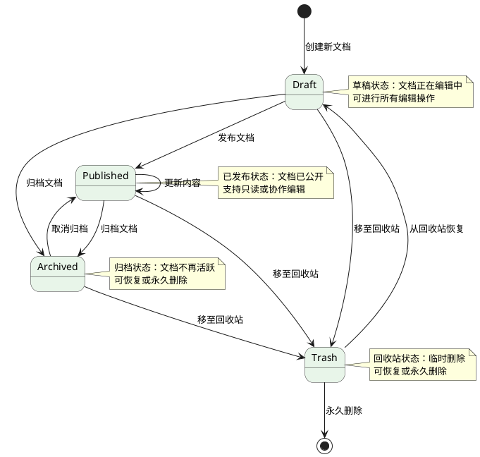

#### ASCII 状态图

```
+----------------+     +----------------+     +----------------+
|                |     |                |     |                |
|     DRAFT      | --> |   PUBLISHED    | --> |   ARCHIVED     |
|                |     |                |     |                |
|  (草稿状态)     |     |  (已发布状态)   |     |  (归档状态)     |
|                |     |                |     |                |
+----------------+     +----------------+     +----------------+
       |                      |                      |
       |                      |                      |
       v                      v                      v
+----------------+     +----------------+     +----------------+
|                |     |                |     |                |
|     TRASH      | --> |     [*]        |     |     TRASH      |
|                |     |                |     |                |
|  (回收站状态)   |     |  (永久删除)    |     |  (回收站状态)   |
|                |     |                |     |                |
+----------------+     +----------------+     +----------------+
       |
       |
       v
+----------------+
|                |
|  恢复 -> Draft |
|                |
+----------------+
```

### 1.2 文档状态详细定义

| 状态 | 描述 | 可执行操作 |
|------|------|------------|
| `draft` | 草稿状态，文档正在编辑 | 读取、编辑、删除、发布、归档 |
| `published` | 已发布状态，文档已公开 | 读取、编辑、归档、删除 |
| `archived` | 归档状态，文档不再活跃 | 恢复、删除 |
| `trash` | 回收站状态，已被软删除 | 恢复、永久删除 |

### 1.3 文档属性状态

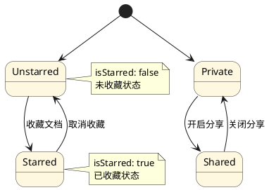

---

## 2. 块编辑状态机

### 2.1 块锁状态

用于实时协作时的并发控制，防止多人同时编辑同一块。

#### PlantUML 状态图

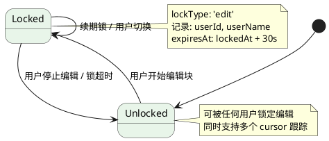

#### ASCII 状态图

```
+------------------------+        +------------------------+
|                        |        |                        |
|      LOCKED            | <----> |      UNLOCKED          |
|                        |        |                        |
|  (编辑锁占用状态)       |        |  (未锁定状态)          |
|                        |        |                        |
|  lockType: 'edit'      |        |  可被任意用户锁定       |
|  userId: xxx           |        |                        |
|  expiresAt: xxx        |        |                        |
|                        |        |                        |
+------------------------+        +------------------------+
              ^
              |
              | 用户开始编辑
              |
              v
              |
    +------------------------+
    |    锁自动续期           |
    |    (每10秒)            |
    +------------------------+
              ^
              |
              | 锁超时(30s) / 用户离开
              |
              v
```

### 2.2 块编辑状态

块内容的保存和同步状态。

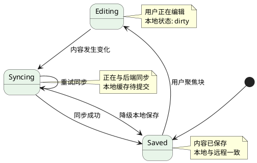

### 2.3 块类型状态

```
+----------------------------------------------------------+
|                                                          |
|  文本块状态:                                             |
|  text <-> h1 <-> h2 <-> h3                              |
|    |        |        |                                  |
|    v        v        v                                  |
|  callout  codeblock  divider                           |
|                                                          |
+----------------------------------------------------------+
```

---

## 3. 评论状态机

### 3.1 评论生命周期状态

#### PlantUML 状态图

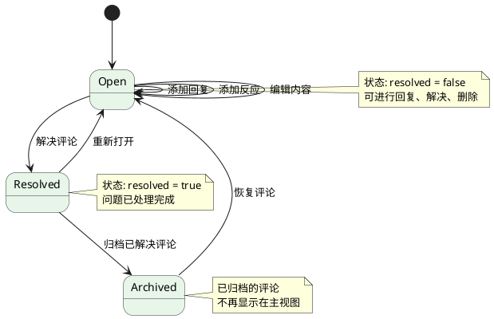

#### ASCII 状态图

```
+----------------------------------------------------------+
|                                                          |
|  评论生命周期:                                           |
|                                                          |
|      +---------+                                        |
|      |         |                                        |
|      |   OPEN  | <------------------+                  |
|      |         |                    |                  |
|      +---------+                    |                  |
|            |                        |                  |
|            | 解决评论                | 重新打开         |
|            v                        |                  |
|      +---------+                    |                  |
|      |         |                    |                  |
|      |RESOLVED | -------------------+                  |
|      |         |                                        |
|      +---------+                    |                  |
|            |                        | 恢复评论        |
|            | 归档评论                |                  |
|            v                        |                  |
|      +---------+                                    |
|      |         |                                    |
|      |ARCHIVED |                                    |
|      |         |                                    |
|      +---------+                                    |
|                                                          |
+----------------------------------------------------------+
```

### 3.2 评论反应状态

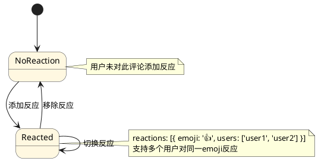

---

## 4. 批注状态机

### 4.1 批注状态

#### PlantUML 状态图

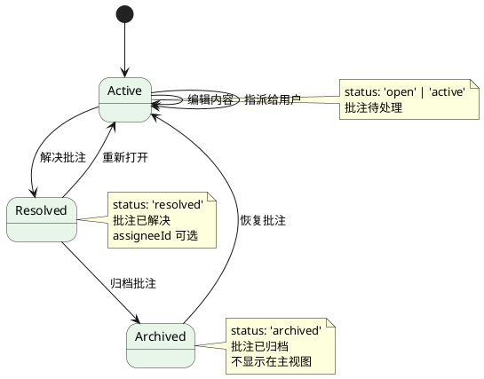

#### ASCII 状态图

```
+----------------------------------------------------------+
|                                                          |
|  批注状态转换:                                           |
|                                                          |
|    +----------+                                         |
|    |          |                                         |
|    |  ACTIVE  | <------------------+                    |
|    |          |                    |                    |
|    +----------+                    |                    |
|          |                         |                    |
|          | 解决批注                 | 重新打开           |
|          v                         |                    |
|    +----------+                   |                    |
|    |          |                   |                    |
|    | RESOLVED | -------------------+                    |
|    |          |                                        |
|    +----------+                    |                    |
|          |                         | 恢复批注           |
|          | 归档批注                |                    |
|          v                         |                    |
|    +----------+                                        |
|    |          |                                        |
|    | ARCHIVED |                                        |
|    |          |                                        |
|    +----------+                                        |
|                                                          |
+----------------------------------------------------------+
```

### 4.2 批注类型状态

```
+----------------------------------------------------------+
|                                                          |
|  批注类型:                                               |
|                                                          |
|  +-------------+  +-------------+  +-----------------+   |
|  | highlight   |  | underline   |  | strikethrough   |   |
|  | (高亮)      |  | (下划线)    |  | (删除线)        |   |
|  +-------------+  +-------------+  +-----------------+   |
|                                                          |
|  +-------------+  +-------------+                       |
|  | suggestion  |  |  comment    |                       |
|  | (建议修改)   |  | (评论锚点)   |                       |
|  +-------------+  +-------------+                       |
|                                                          |
+----------------------------------------------------------+
```

### 4.3 批注指派状态

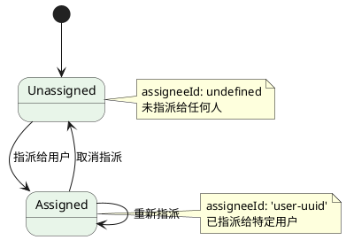

---

## 5. 项目任务状态机

### 5.1 任务状态

#### PlantUML 状态图

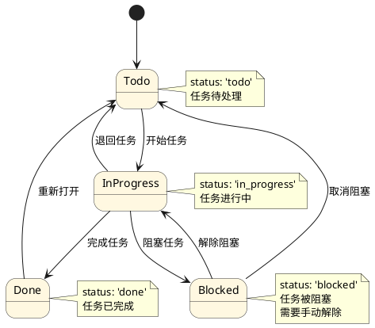

#### ASCII 状态图

```
+----------------------------------------------------------+
|                                                          |
|  任务状态转换:                                           |
|                                                          |
|    +-------+                                            |
|    |  TODO |                                            |
|    +-------+                                            |
|       |                                                  |
|       | 开始任务                                         |
|       v                                                  |
|    +----------------+                                    |
|    |                |                                    |
|    |  IN_PROGRESS   |                                   |
|    |                |                                    |
|    +----------------+                                    |
|       |                |                 |                |
|       | 完成任务       | 退回任务         | 阻塞任务       |
|       v                v                 v                |
|    +-------+      +-------+       +--------+            |
|    |  DONE |      |  TODO |       |BLOCKED |            |
|    +-------+      +-------+       +--------+            |
|       |                                    |             |
|       | 重新打开                           | 解除阻塞     |
|       +-----------------------------------+             |
|                                                          |
+----------------------------------------------------------+
```

### 5.2 任务优先级状态

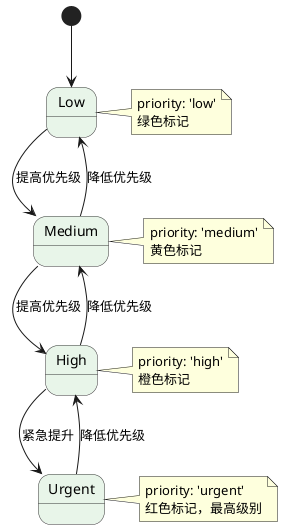

#### ASCII 状态图

```
+----------------------------------------------------------+
|                                                          |
|  优先级状态:      颜色编码:                               |
|                                                          |
|      +------+                                            |
|      | LOW  |  绿色                                       |
|      +------+                                            |
|        ^  |                                              |
|        |  v                                              |
|      +------+                                            |
|      |MEDIUM|  黄色                                       |
|      +------+                                            |
|        ^  |                                              |
|        |  v                                              |
|      +------+                                            |
|      | HIGH |  橙色                                       |
|      +------+                                            |
|        ^  |                                              |
|        |  v                                              |
|      +------+                                            |
|      |URGENT|  红色 (最高)                                |
|      +------+                                            |
|                                                          |
+----------------------------------------------------------+
```

### 5.3 项目成员角色状态

```plantuml
@startuml Project_Member_Role_State
skinparam state {
    BackgroundColor #E8F5E9
    BackgroundColor<<owner>> #FFF8E1
    BackgroundColor<<admin>> #E3F2FD
    BorderColor #333333
}

[*] --> Member

Member --> Admin : 提升为管理员
Admin --> Member : 降级为成员
Admin --> Viewer : 降级为查看者
Viewer --> Member : 提升为成员

note right of Owner
    角色: 'owner'
    所有者，拥有所有权限
end note

note right of Admin
    角色: 'admin'
    管理员，管理项目和成员
end note

note right of Member
    角色: 'member'
    成员，可编辑任务
end note

note right of Viewer
    角色: 'viewer'
    查看者，只读权限
end note
@enduml
```

---

## 6. 会议状态机

### 6.1 会议生命周期状态

#### PlantUML 状态图

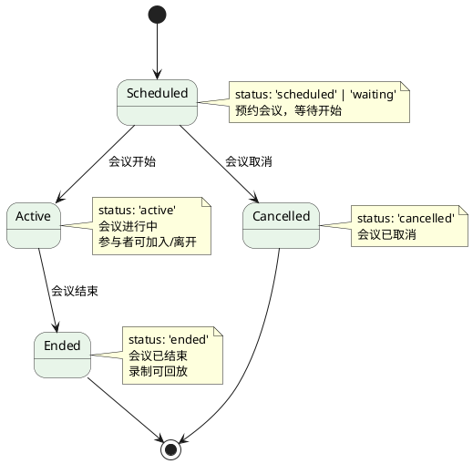

#### ASCII 状态图

```
+----------------------------------------------------------+
|                                                          |
|  会议生命周期:                                           |
|                                                          |
|    +-------------+                                      |
|    |             |                                      |
|    |  SCHEDULED |                                      |
|    |             |                                      |
|    +-------------+                                      |
|          |                                              |
|          | 会议开始                                      |
|          v                                              |
|    +-------------+      +-------------+                 |
|    |             |      |             |                 |
|    |   ACTIVE   | ---> |   ENDED     |                 |
|    |             |      |             |                 |
|    +-------------+      +-------------+                 |
|          |                   |                          |
|          | 会议取消           |                          |
|          v                   |                          |
|    +-------------+           |                          |
|    |             |           |                          |
|    | CANCELLED  | ----------+                          |
|    |             |                                      |
|    +-------------+                                      |
|                                                          |
+----------------------------------------------------------+
```

### 6.2 会议类型状态

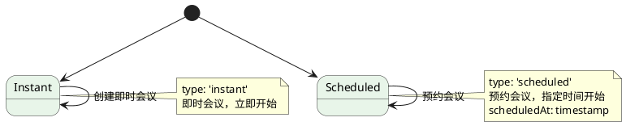

### 6.3 会议参与者状态

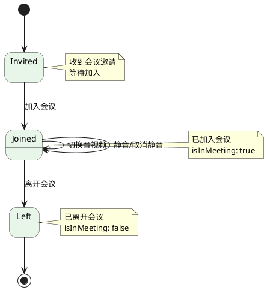

#### ASCII 状态图

```
+----------------------------------------------------------+
|                                                          |
|  参与者状态:                                             |
|                                                          |
|    +-------------+                                      |
|    |             |                                      |
|    |   INVITED   |                                      |
|    |             |                                      |
|    +-------------+                                      |
|          |                                              |
|          | 加入会议                                     |
|          v                                              |
|    +-------------+                                      |
|    |             |                                      |
|    |   JOINED   | <----------------------+              |
|    |             |                       |              |
|    +-------------+                       |              |
|          |                               | 离开会议     |
|          | 静音/取消静音                   |              |
|          | 开关摄像头                     |              |
|          | 屏幕共享                       |              |
|          v                               |              |
|    +-------------+                       |              |
|    |             |                       |              |
|    |    LEFT    | -----------------------+              |
|    |             |                                      |
|    +-------------+                                      |
|                                                          |
+----------------------------------------------------------+
```

### 6.4 参与者设备状态

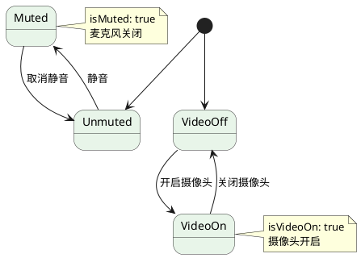

---

## 7. 知识库状态机

### 7.1 空间状态

#### PlantUML 状态图

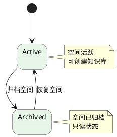

### 7.2 知识库状态

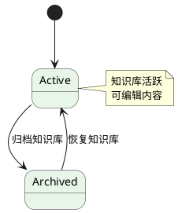

### 7.3 节点类型状态

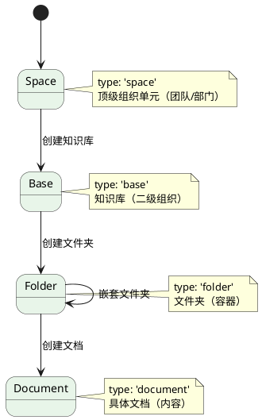

#### ASCII 状态图

```
+----------------------------------------------------------+
|                                                          |
|  知识库层级结构:                                         |
|                                                          |
|    +----------+                                         |
|    |  SPACE   |  (空间 - 顶级组织单元)                   |
|    |          |                                         |
|    +----------+                                         |
|        |                                                 |
|        | 创建知识库                                      |
|        v                                                 |
|    +----------+                                         |
|    |   BASE   |  (知识库 - 二级组织)                     |
|    |          |                                         |
|    +----------+                                         |
|        |                                                 |
|        | 创建节点                                        |
|        v                                                 |
|    +----------+     +----------+                        |
|    |  FOLDER  | --> |  FOLDER  | (嵌套文件夹)           |
|    +----------+     +----------+                        |
|        |                                                 |
|        | 创建文档                                        |
|        v                                                 |
|    +----------+                                         |
|    | DOCUMENT |  (文档 - 具体内容)                        |
|    +----------+                                         |
|                                                          |
+----------------------------------------------------------+
```

### 7.4 知识库成员权限状态

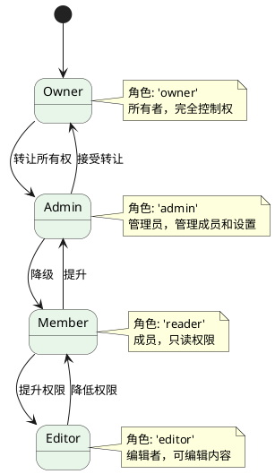

#### ASCII 权限对比表

```
+----------------------------------------------------------+
|                                                          |
|  权限层级 (从高到低):                                     |
|                                                          |
|  +-------------+--------+--------+--------+--------+    |
|  |    角色     |  空间  | 知识库 |  成员  |  内容  |    |
|  +-------------+--------+--------+--------+--------+    |
|  |   owner     |   √    |   √    |   √    |   √    |    |
|  +-------------+--------+--------+--------+--------+    |
|  |   admin     |   -    |   √    |   √    |   √    |    |
|  +-------------+--------+--------+--------+--------+    |
|  |   editor    |   -    |   -    |   -    |   √    |    |
|  +-------------+--------+--------+--------+--------+    |
|  |   reader    |   -    |   -    |   -    |   r    |    |
|  +-------------+--------+--------+--------+--------+    |
|                                                          |
|  √ = 完全权限  - = 无权限  r = 只读                      |
+----------------------------------------------------------+
```

### 7.5 分享状态

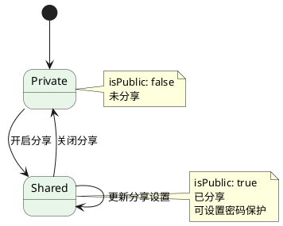

---

## 附录

### A. 状态机实现参考

所有状态机均在以下位置实现:

- **前端状态管理**: `frontend/src/store/`
  - `documentStore.ts` - 文档状态
  - `commentStore.ts` - 评论与批注状态
  - `projectStore.ts` - 项目任务状态
  - `meetingStore.ts` - 会议状态
  - `knowledgeStore.ts` - 知识库状态

- **后端实体**: `backend/src/`
  - `documents/document.entity.ts` - 文档实体
  - `documents/block-lock.entity.ts` - 块锁实体
  - `comments/comment.entity.ts` - 评论实体
  - `comments/annotation.entity.ts` - 批注实体
  - `projects/project.entity.ts` - 项目实体
  - `meetings/meeting.entity.ts` - 会议实体
  - `knowledge/knowledge.entity.ts` - 知识库实体

### B. 状态转换事件汇总

| 模块 | 事件 | 触发条件 |
|------|------|----------|
| 文档 | publish | 发布文档 |
| 文档 | archive | 归档文档 |
| 文档 | restore | 恢复文档 |
| 文档 | delete | 移至回收站 |
| 块锁 | lock | 开始编辑块 |
| 块锁 | unlock | 停止编辑/超时 |
| 评论 | resolve | 解决评论 |
| 评论 | archive | 归档评论 |
| 批注 | resolve | 解决批注 |
| 批注 | assign | 指派批注 |
| 任务 | start | 开始任务 |
| 任务 | complete | 完成任务 |
| 任务 | block | 阻塞任务 |
| 任务 | unblock | 解除阻塞 |
| 会议 | start | 会议开始 |
| 会议 | end | 会议结束 |
| 会议 | cancel | 取消会议 |
| 知识库 | share | 开启分享 |
