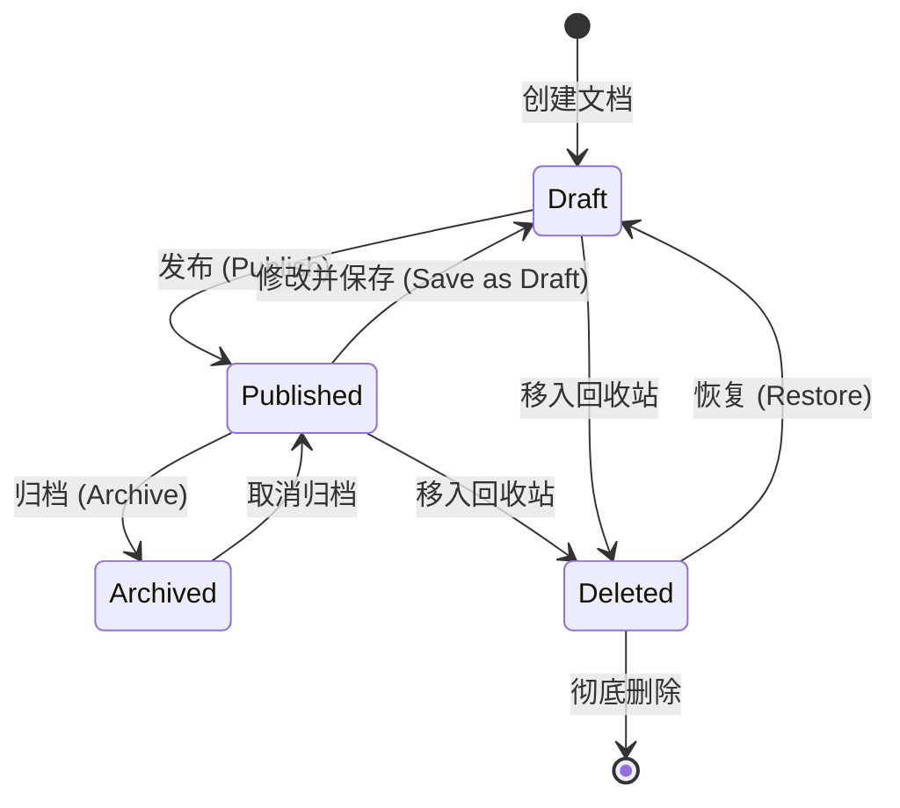
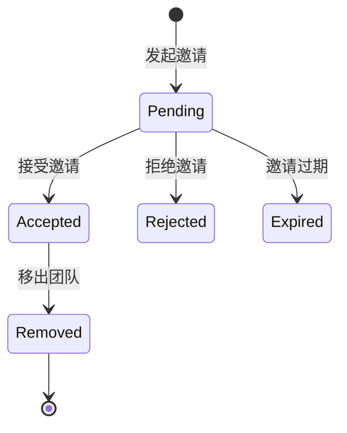

# 语雀（Yuque）系统需求规格说明书 (SRS)

## 1. 系统概述
语雀是一个专业的云端知识库，面向团队和个人提供文档、知识库、团队管理等功能。其核心理念是“知识沉淀”，通过结构化的知识库和强大的编辑器，帮助用户高效地进行知识创作、沉淀和分享。

## 2. 核心实体与状态模型

### 2.1 核心实体 (Core Entities)
*   **空间 (Space)**: 顶级容器，通常对应企业或组织。
*   **团队 (Group)**: 协作单元，包含成员和多个知识库。
*   **知识库 (Book/Repository)**: 文档的集合，支持多种类型（文档、资源、画板、数据表）。
*   **文档 (Document)**: 核心内容单元，支持富文本、Markdown 等格式。
*   **小记 (Note)**: 碎片化信息采集。
*   **会议 (Meeting)**: 具备时间、参与者属性的协作文档。

### 2.2 状态转换图 (State Machine)

#### 文档状态机 (Document Lifecycle)

#### 协作邀请状态 (Collaboration Invitation)

## 3. 技术规范 (Technical Specifications)

### 3.1 开放 API (Open API v2)
*   **Base URL**: `https://www.yuque.com/api/v2`
*   **认证方式**: 请求头 `X-Auth-Token`。
*   **核心端点**:
    *   `GET /user`: 获取当前认证用户信息。
    *   `GET /groups/{login}/repos`: 获取团队知识库列表。
    *   `GET /repos/{book_id}/docs`: 获取知识库文档列表。
    *   `GET /repos/{book_id}/docs/{id}`: 获取文档详情（支持 `body_lake` 格式）。
    *   `POST /repos/{book_id}/docs`: 创建文档。
    *   `PUT /repos/{book_id}/docs/{id}`: 更新文档。
*   **频率限制**: 每小时 5000 次，每秒 100 次。

### 3.2 核心数据结构
*   **User**: `id`, `login`, `name`, `avatar_url`, `description`.
*   **Group**: `id`, `login`, `name`, `avatar_url`, `owner_id`.
*   **Book (Repo)**: `id`, `type` (Book, Design, all, etc.), `slug`, `name`, `user_id`, `description`, `public` (0-私密, 1-公开).
*   **Doc**: `id`, `slug`, `title`, `book_id`, `user_id`, `format` (lake, markdown), `body`, `body_lake`, `public`, `status` (0-草稿, 1-发布).

## 4. 功能模块详细说明

### 4.1 编辑器模块 (Lake Editor)
语雀的核心是其自研的 Lake 编辑器，支持富文本与 Markdown 的混合编辑模式。

#### 4.1.1 核心编辑功能
*   **基础格式**: 标题 (H1-H6)、加粗、斜体、下划线、删除线、行内代码、超链接、引用、分割线、上/下标。
*   **列表**: 有序列表、无序列表、任务列表 (Checklist)，支持多级缩进和起始编号修改。
*   **快捷操作**: 
    *   **Slash 指令 (`/`)**: 快速插入卡片。
    *   **Markdown 快捷键**: 支持 `#` 标题、`*` 列表、`1.` 有序列表、`---` 分割线等实时转换。
    *   **格式刷**: 快速复制文本样式。

#### 4.1.2 增强卡片 (Advanced Cards)
*   **文本绘图**: 集成 PlantUML, Mermaid, Flowchart, Graphviz，支持全屏双栏编辑模式。
*   **代码块**: 支持 50+ 种语言高亮，提供多种颜色主题，支持代码折叠。
*   **多媒体**:
    *   **图片**: 支持拖拽上传、批量应用样式、图片描述、点击放大、缩放旋转。
    *   **视频/音频**: 支持本地上传及第三方链接（如 Bilibili, 优酷）嵌入播放。
    *   **本地文件**: 支持 Word, Excel, PPT, PDF 嵌入直接预览，无需下载。
*   **语雀内容卡片**: 可在当前文档中嵌入其他语雀文档、知识库或数据表片段，保持实时同步。
*   **公式**: 支持 LaTeX 数学公式，提供实时预览和计算功能（如时间乘除）。
*   **思维导图 & 画板**: 内置轻量级思维导图和矢量绘图工具，支持从外部（如 Sketch）导入。

### 4.2 数据表模块 (Data Table)
不同于传统表格，语雀数据表提供多维数据管理能力。

*   **多视图支持**:
    *   **表格视图**: 类似 Excel，支持 20+ 种字段类型（人员、日期、单/多选、附件、进度条）。
    *   **看板视图**: 按状态或人员分组展示卡片，支持拖拽更改状态。
    *   **日历视图**: 按时间维度展示记录，支持自定义节假日。
    *   **画册视图**: 强调图片展示。
    *   **图表视图**: 支持面积图、热力图、柱状图等数据可视化。
*   **计算能力**: 强大的公式系统，支持字段间的复杂计算和聚合统计。

### 4.3 知识库管理 (Knowledge Management)
*   **目录树管理**: 支持拖拽排序、多级目录、外部链接跳转。
*   **权限控制**: 
    *   公开范围: 私密、内部公开、互联网公开。
    *   角色权限: 读者、作者、管理员、拥有者。
*   **统计信息**: 字数统计、阅读量、每日更新量。
*   **回收站**: 具备完善的自动保存和版本历史，支持找回 30 天内删除的内容。

### 4.4 协作与交互
*   **实时协同**: 毫秒级同步，支持显示协作者光标位置。
*   **评论系统**:
    *   **全文评论**: 文档末尾进行讨论。
    *   **划词评论 (Annotation)**: 选中特定文本段落发起评论，支持 @ 成员。
*   **演示模式**: 一键将文档转换为 PPT 风格的幻灯片进行在线演示。

## 5. 安全与权限管理

### 5.1 权限矩阵
| 角色 | 查看文档 | 编辑文档 | 管理成员 | 设置属性 |
| :--- | :---: | :---: | :---: | :---: |
| 读者 (Reader) | √ | × | × | × |
| 作者 (Author) | √ | √ | × | × |
| 管理员 (Admin) | √ | √ | √ | × |
| 拥有者 (Owner) | √ | √ | √ | √ |

### 5.2 安全特性
*   **可见性控制**: 知识库可设置为“私密”、“内部公开”或“互联网公开”。
*   **访问保护**: 支持 IP 白名单设置，仅允许特定网络访问。
*   **内容防泄密**: 
    *   **动态水印**: 阅读页面显示访问者姓名/ID 水印。
    *   **防复制**: 禁止划词复制和右键保存。
*   **审计日志**: 记录成员的所有关键操作（创建、删除、下载、权限变更）。

## 6. 集成与扩展 (Integrations)
*   **钉钉集成**: 深度打通组织架构、扫码登录、文档动态推送。
*   **浏览器插件**: 支持网页剪藏，将网页内容一键保存至语雀小记或文档。
*   **Webhooks**: 支持文档发布、更新、评论等事件通知。
*   **API v2**: 提供完整的 RESTful 接口支持。

## 7. 非功能需求
*   **可靠性**: 自动保存草稿，版本历史回滚。
*   **并发性**: 支持大规模团队同时在线编辑。
*   **跨平台**: Web, Desktop (Windows/Mac), Mobile 一致性体验。

## 8. 用户流程 (Workflows)

### 8.1 文档创作流程
1. 用户选择“新建文档”。
2. 系统进入编辑器模式，状态设为 `Draft`。
3. 用户输入内容，系统自动保存草稿。
4. 用户点击“发布”，系统生成版本记录，状态变为 `Published`，并触发通知。

### 8.2 团队协作流程
1. 管理员创建团队并邀请成员（`Pending` 状态）。
2. 成员接受邀请（`Accepted` 状态）。
3. 成员在知识库中创建文档或对已有文档发起评论。
4. 文档作者收到评论通知，回复或采纳建议。

## 9. FastDoc vs Yuque 差距分析及追赶路线 (Gap Analysis & Roadmap)

通过对语雀完整产品矩阵的分析，为了全面对标语雀并打造商用级的协作文档体验，FastDoc 在以下几个核心模块存在缺失，需要在后续版本中重点实现：

### 9.1 核心功能缺失 (Feature Gaps)

1.  **碎片化知识沉淀（小记 / Memos）**
    *   **语雀特性**: 支持微信、移动端快速记录图文，类似单机版的微博/Flomo记录节点，后续可整理为正式文档。
    *   **FastDoc 需跟进**: 增加独立的小记页面 (Memos View)，提供轻量级的信息倾倒入口，支持一键转化为完整文档。

2.  **个人/团队数字花园 (Digital Garden / Public Spaces)**
    *   **语雀特性**: 允许用户将知识库对外公开发布（互联网公开），并生成具备 SEO 优化和高度美观的站点（我的花园）。
    *   **FastDoc 需跟进**: 提供“一键发布为静态网站/博客”功能，支持定制化域名和阅读器模式 (Reader UI)。

3.  **话题库与团队社区 (Discussions / Forum)**
    *   **语雀特性**: 提供异步话题讨论版块，结构化沉淀研发或团队问题。
    *   **FastDoc 需跟进**: 虽然 FastDoc 拥有强大的即时通讯(IM)模块，但缺乏结构化的论坛/帖子功能。需补充独立的“团队话题库”入口。

4.  **端到端跨平台客户端 (Clients & Web Clipper)**
    *   **语雀特性**: 全平台支持，包含完善的桌面端（离线可用）、移动APP，以及核心的浏览器剪藏插件（Web Clipper）。
    *   **FastDoc 需跟进**: 
        *   开发浏览器剪藏扩展（Chrome Extension），支持提取网页正文并保存至 FastDoc。
        *   打包 Electron 桌面端及 PWA 强化。

5.  **企业级安全管控 (Enterprise Security)**
    *   **语雀特性**: 动态全局水印保护、限制文本复制、IP访问白名单。
    *   **FastDoc 需跟进**: 补充企业安全策略中间件，在前端渲染时支持开启防泄漏水印和不可发聩的右键菜单。

### 9.2 技术与 UI 补齐方案 (Technical Enhancements Tooling)

为了快速追赶上述功能，我们将充分利用现代 Web 体系和 Ant Design 库生态：
*   **组件层**: 大量复用 `antd` 的高级数据展示组件、穿梭框、树形控件。引入成熟的富文本底层插件。
*   **Memos 小记**: 使用瀑布流或时间轴 (Timeline) UI 展现；集成快速文件上传 API 支持。
*   **防泄密**: 前端 Canvas 生成动态叠加层(Watermark 组件)。
