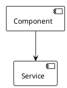
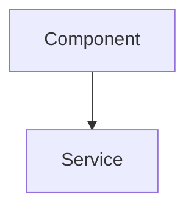

# FastDocument 文档规范

## 1. 文档目录结构

```
docs/
├── README.md                           # 文档索引
├── architecture/                       # 架构文档
│   ├── system-overview.md             # 系统概览
│   ├── component-hierarchy.md         # 组件层级
│   ├── state-machines.md              # 状态机图
│   ├── data-flow.md                   # 数据流图
│   └── infrastructure.md              # 基础设施
├── components/                        # 组件文档
│   ├── editor/                        # 编辑器组件
│   ├── layout/                        # 布局组件
│   ├── collaboration/                 # 协作组件
│   └── project/                       # 项目管理组件
├── business/                          # 业务逻辑文档
│   ├── document-flow.md              # 文档流程
│   ├── collaboration-flow.md         # 协作流程
│   ├── knowledge-flow.md             # 知识库流程
│   └── meeting-flow.md                # 会议流程
├── diagrams/                          # 图表资源
│   ├── plantuml/                     # PlantUML 源文件
│   └── ascii/                         # ASCII 图表
└── api/                              # API 文档
    ├── endpoints.md                   # 端点说明
    └── schemas.md                    # 数据模型
```

## 2. 命名规范

### 2.1 文件命名
- 使用 kebab-case: `document-store.md`
- 组件文档: `ComponentName.mdx`
- 流程文档: `feature-flow.md`

### 2.2 图表命名
- 架构图: `arch-[module]-[type].puml`
- 状态机: `state-[feature].puml`
- 时序图: `seq-[feature].puml`
- ASCII 图: `ascii-[name].txt`

## 3. 图表规范

### 3.1 PlantUML 规范


### 3.2 ASCII 图表规范
- 使用等宽字体
- 最大宽度 80 字符
- 使用标准 ASCII 字符

### 3.3 Mermaid 图表


## 4. 文档模板

### 4.1 组件文档模板
```markdown
# 组件名称

## 概述
组件功能描述

## Props 接口
| 属性 | 类型 | 默认值 | 说明 |

## 状态
| 状态 | 类型 | 说明 |

## 使用示例
```tsx
// 示例代码
```

## 内部实现
### 核心逻辑
### 性能优化
```

### 4.2 业务流程文档模板
```markdown
# 业务流程名称

## 概述
业务场景描述

## STAR 法则
### Situation (背景)
### Task (任务)
### Action (行动)
### Result (结果)

## 流程图
[ASCII 或 Mermaid 图]

## 状态机
[状态转换图]

## API 调用
| 操作 | 方法 | 路径 |
```

## 5. 文档内容规范

### 5.1 技术细节要求
- 必须包含 TypeScript 类型定义
- 必须包含 React Hooks 使用说明
- 必须包含性能考虑点
- 必须包含边界条件处理

### 5.2 代码示例
- 使用完整的可运行代码
- 包含错误处理
- 包含类型注解

### 5.3 图示要求
- 架构图: 清晰展示组件关系
- 流程图: 展示完整业务流程
- 时序图: 展示交互顺序
- 状态图: 展示状态转换

## 6. 审核标准

### 6.1 必须包含
- [ ] 概述说明
- [ ] 技术实现细节
- [ ] 代码示例
- [ ] 图表说明
- [ ] 性能考虑

### 6.2 推荐包含
- [ ] 边界条件处理
- [ ] 错误处理方式
- [ ] 测试用例
- [ ] 最佳实践

## 7. 更新维护

- 重大功能变更时更新相关文档
- 每月进行一次文档审查
- 文档与代码同步更新
- 使用版本控制管理文档
