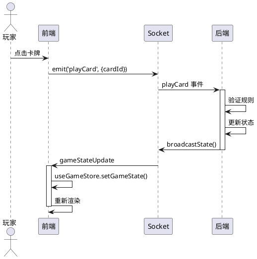

# 架构原则

## 一、后端权威原则

### 1.1 核心定义

后端权威原则是本项目的核心架构准则：**所有游戏规则、业务逻辑、状态管理都在后端实现，前端仅负责展示和发送用户意图**。

### 1.2 原则详解

```
┌─────────────────────────────────────────────────────────────────┐
│                      后端权威架构                               │
│                                                                  │
│   前端 (展示层)              后端 (权威层)                      │
│                                                                  │
│   ┌──────────┐              ┌──────────┐                       │
│   │ 用户点击 │              │ 规则校验 │                       │
│   │  卡牌   │ ──意图──▶   │ validate │                       │
│   └──────────┘              └────┬────┘                       │
│                                  │                             │
│   ┌──────────┐              ┌────▼────┐                       │
│   │ 接收状态 │ ◀──广播──   │ 状态更新 │                       │
│   │ 渲染UI   │              │  broadcast                     │
│   └──────────┘              └──────────┘                       │
└─────────────────────────────────────────────────────────────────┘
```

### 1.3 实现约束

| 约束类型 | 具体要求 |
|---------|---------|
| 前端禁止 | 实现游戏规则校验逻辑 |
| 前端禁止 | 自行决定出牌合法性 |
| 前端禁止 | 计算游戏结算结果 |
| 前端允许 | 发送用户意图（playCard、drawCard 等） |
| 前端允许 | 根据后端返回状态渲染 UI |

### 1.4 代码示例

**后端实现（GameService）**：
```typescript
// backend/src/game/game/game.service.ts
/**
 * 验证并执行玩家出牌。
 *
 * Args:
 *   roomId: 房间 ID。
 *   playerId: 玩家 ID。
 *   cardId: 要出的卡牌 ID。
 *   colorSelection: 万能牌颜色选择。
 *
 * Returns:
 *   更新后的游戏状态。
 *
 * Raises:
 *   Error: 当牌不存在、非当前玩家回合或出牌非法时抛出。
 */
async playCard(roomId, playerId, cardId, colorSelection) {
  const game = this.games.get(roomId);

  // 规则校验（权威逻辑）
  if (!this.validateMove(game, playerId, cardId)) {
    throw new Error('非法出牌');
  }

  // 执行出牌
  await this.executePlayCard(game, playerId, cardId, colorSelection);

  // 广播状态
  this.broadcastState(roomId);
}
```

**前端实现（仅发送意图）**：
```typescript
// frontend/src/context/GameSocketContext.tsx
/**
 * 发送出牌意图到后端。
 *
 * 注意：不进行规则校验，仅发送意图。
 * 规则校验由后端权威执行。
 */
const playCard = useCallback((cardId: string, colorSelection?: CardColor) => {
  if (!socket || !roomId) return;
  socket.emit('playCard', { roomId, cardId, colorSelection });
}, [socket, roomId]);
```

---

## 二、前后端分离原则

### 2.1 职责边界

| 层级 | 职责 | 关键文件 |
|------|------|---------|
| **后端（权威）** | 游戏规则、状态管理、计时、AI 决策、结算 | `game.service.ts`, `game.gateway.ts`, `ai.service.ts` |
| **前端（展示）** | 渲染 3D 场景、发送玩家意图、显示服务器状态 | `page.tsx`, `Scene3D.tsx`, `GameSocketContext.tsx` |

### 2.2 数据分离

```
┌─────────────────────────────────────────────────────────────────┐
│                        数据流向                                  │
│                                                                  │
│  后端私有数据（不发送到前端）：                                  │
│  ┌─────────────────────────────────────────────────────────┐    │
│  │ • deck (牌堆)                                          │    │
│  │ • hand[] (所有玩家手牌)                                │    │
│  │ • sessionId (会话 ID)                                  │    │
│  │ • reconnectToken (重连凭据)                            │    │
│  └─────────────────────────────────────────────────────────┘    │
│                                                                  │
│  广播数据（脱敏后）：                                           │
│  ┌─────────────────────────────────────────────────────────┐    │
│  │ • deck: undefined (隐藏牌堆)                           │    │
│  │ • hand: [] (非本人手牌隐藏)                            │    │
│  │ • handCount (保留手牌数量)                             │    │
│  └─────────────────────────────────────────────────────────┘    │
└─────────────────────────────────────────────────────────────────┘
```

---

## 三、状态同步原则

### 3.1 同步机制

| 机制 | 说明 |
|------|------|
| **Server Push** | 后端状态变化时主动广播 |
| **单向同步** | 前端不主动同步，仅响应后端广播 |
| **乐观更新** | 前端不缓存状态，每次全量接收 |

### 3.2 同步流程



### 3.3 断线处理

| 场景 | 处理方式 |
|------|---------|
| 网络闪断 | 自动重连，保持游戏状态 |
| 长时间断线 | 60 秒保留窗口，超时解散房间 |
| 重连成功 | 恢复完整游戏状态 |

---

## 四、组件分层原则

### 4.1 分层架构

```
┌─────────────────────────────────────────────────────────────────┐
│                        UI 组件层                                │
│  ┌──────────┐ ┌──────────┐ ┌──────────┐ ┌──────────┐        │
│  │  Scene3D │ │  Scene2D │ │ClassicGe │ │   HUD    │        │
│  │ (3D渲染) │ │ (2D渲染) │ │(Canvas)  │ │ (信息栏) │        │
│  └──────────┘ └──────────┘ └──────────┘ └──────────┘        │
├─────────────────────────────────────────────────────────────────┤
│                        业务逻辑层                               │
│  ┌──────────────────┐  ┌──────────────────┐                 │
│  │  GameSocketContext │  │   useGameStore   │                 │
│  │  (Socket 连接)    │  │  (Zustand 状态)   │                 │
│  └──────────────────┘  └──────────────────┘                 │
├─────────────────────────────────────────────────────────────────┤
│                        工具层                                   │
│  ┌──────────────┐  ┌──────────────┐  ┌──────────────┐        │
│  │ audioManager │  │  nicknameGen │  │  unoSound    │        │
│  │  (音效管理)  │  │  (昵称生成)  │  │  (程序音效)  │        │
│  └──────────────┘  └──────────────┘  └──────────────┘        │
└─────────────────────────────────────────────────────────────────┘
```

### 4.2 依赖规则

| 规则 | 说明 |
|------|------|
| 上层调用下层 | UI 组件调用 Context/Store |
| 下层不依赖上层 | Context 不直接调用 UI 组件 |
| 跨层通信通过 Props/Callback | 事件逐层传递 |

---

## 五、版本信息

| 版本 | 日期 | 说明 |
|------|------|------|
| 1.0.0 | 2026-03-08 | 初始版本 |

---

*本文档使用简体中文，遵循 Google 文档风格。*
