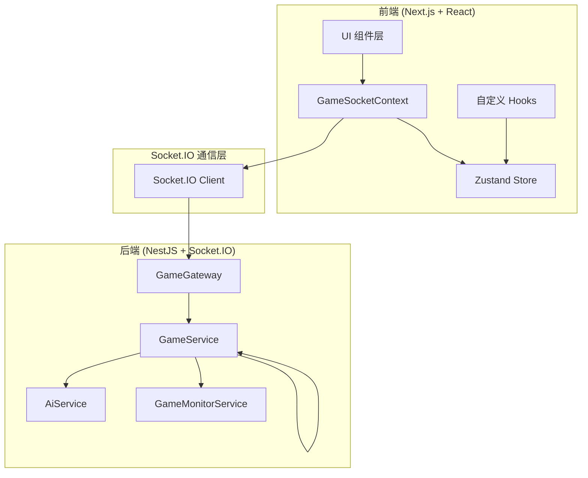

# 项目技术概览

## 一、项目简介

### 1.1 项目概述

`developingProject` 是一个高品质、3D 沉浸式的 UNO 联机对战游戏，采用 Next.js 16 + NestJS 11 技术栈，通过 WebSocket 实现实时双向通信。

### 1.2 核心特性

| 特性 | 说明 |
|------|------|
| 三模渲染 | 2D SVG / 3D WebGL / Canvas 经典模式 |
| 实时对战 | Socket.IO 毫秒级延迟通信 |
| AI 对战 | 三级难度 AI（EASY/MEDIUM/HARD） |
| 完整规则 | 质疑、抓漏、摸牌决策等高级机制 |
| 响应式设计 | 桌面/平板/手机全平台适配 |

---

## 二、STAR 法则分析

### 2.1 项目背景 (Situation)

随着 WebGL 技术成熟和浏览器性能提升，传统 2D 网页游戏已无法满足用户对沉浸式体验的需求。传统 UNO 网页版多为简单 2D 界面，缺少：
- 3D 视觉效果
- 复杂的 AI 策略
- 严谨的后端状态监控

### 2.2 项目目标 (Task)

开发一款高品质 3D 沉浸式 UNO 联机对战游戏，具备：
- 2D/3D/经典三种渲染模式可选
- 支持 4 人/8 人/12 人多房间布局
- 完整实现官方 UNO 规则（质疑、抓漏、摸牌决策）
- 后端权威架构确保游戏公平性

### 2.3 核心行动 (Action)

**架构设计**：
- 前端采用 Next.js 16 + React 19 + Zustand
- 3D 引擎使用 @react-three/fiber + @react-three/drei
- 后端采用 NestJS 11 + Socket.IO 4.8
- 状态管理遵循"后端权威"原则

**技术实现**：
```
┌─────────────────────────────────────────────────────────────────┐
│                         前端 (Next.js)                         │
│  ┌─────────┐  ┌─────────┐  ┌─────────┐  ┌─────────┐          │
│  │  Scene3D │  │  Scene2D │  │Classic  │  │   HUD   │          │
│  │ (WebGL)  │  │ (SVG)   │  │(Canvas) │  │(信息栏) │          │
│  └────┬────┘  └────┬────┘  └────┬────┘  └────┬────┘          │
│       │            │            │            │                │
│       └────────────┴──────┬─────┴────────────┘                │
│                            │                                    │
│                    ┌───────▼───────┐                          │
│                    │GameSocketContext│                         │
│                    │ (Socket连接)   │                          │
│                    └───────┬───────┘                          │
└────────────────────────────┼────────────────────────────────────┘
                             │ Socket.IO
┌────────────────────────────┼────────────────────────────────────┐
│                    ┌───────▼───────┐                          │
│                    │ GameGateway   │                          │
│                    │ (Socket网关)   │                          │
│                    └───────┬───────┘                          │
│                            │                                    │
│                    ┌───────▼───────┐                          │
│                    │ GameService   │                          │
│                    │ (游戏权威)    │                          │
│                    └───────┬───────┘                          │
│           ┌────────────────┼────────────────┐                │
│           │                │                │                  │
│    ┌──────▼──────┐ ┌──────▼──────┐ ┌──────▼──────┐        │
│    │  AiService  │ │GameMonitor  │ │   房间管理   │        │
│    │  (AI策略)   │ │  (监控日志)  │ │   (多房间)   │        │
│    └─────────────┘ └─────────────┘ └─────────────┘        │
│                         后端 (NestJS)                        │
└──────────────────────────────────────────────────────────────┘
```

### 2.4 项目成果 (Result)

- [x] 基础 UNO 逻辑（发牌、出牌、结算）
- [x] Socket.io 实时通信
- [x] 前端 3D 重构（坐标系重构、第一人称视角）
- [x] 资源本地化（3D 图案、字体、环境 100% 本地化）
- [x] 后端高级监控（GameMonitorService）
- [x] 在线可靠性与会话管理
- [x] 多房间支持（4人/8人/12人布局）
- [x] 响应式设计（桌面/平板/手机横竖屏适配）
- [x] 相机视角控制（锁定/解锁调节）
- [x] 玩家列表侧边栏（可展开/收起）
- [x] 2D 渲染模式（纯 SVG 精美界面）
- [x] 音效系统（useSoundEffects）
- [x] nginx 反向代理配置
- [x] 经典 UNO 模式（Canvas 仿真桌面）

---

## 三、系统架构图

### 3.1 整体架构



### 3.2 数据流闭环

```
用户点击卡牌
    ↓
Scene3D → page.tsx → GameSocketContext
    ↓ emit 'playCard'
Socket.IO → GameGateway
    ↓
GameService.playCard()（规则校验、状态更新）
    ↓
GameGateway.broadcastState()（个性化脱敏）
    ↓ emit 'gameStateUpdate'
GameSocketContext → useGameStore
    ↓
UI 渲染更新
```

### 3.3 组件交互图

```
┌─────────────────────────────────────────────────────────────────┐
│                         page.tsx                                │
│                     (游戏主页面协调器)                           │
│                                                                  │
│  ┌─────────────────────────────────────────────────────────┐   │
│  │                    GameSocketContext                    │   │
│  │              (useGameSocket 获取 socket)                 │   │
│  └─────────────────────────────────────────────────────────┘   │
│                                                                  │
│  ┌──────────────────┐  ┌──────────────────┐                  │
│  │    Scene3D       │  │     Scene2D      │                  │
│  │   (3D 渲染)      │  │    (2D 渲染)     │                  │
│  └──────────────────┘  └──────────────────┘                  │
│                                                                  │
│  ┌──────────────────┐  ┌──────────────────┐                  │
│  │  ClassicGame     │  │      HUD         │                  │
│  │ (Canvas 渲染)    │  │   (信息栏)       │                  │
│  └──────────────────┘  └──────────────────┘                  │
│                                                                  │
│  ┌──────────────────┐  ┌──────────────────┐                  │
│  │ NotificationLayer│  │   GameOverlay    │                  │
│  │   (通知层)       │  │   (游戏弹窗)     │                  │
│  └──────────────────┘  └──────────────────┘                  │
└─────────────────────────────────────────────────────────────────┘
```

---

## 四、技术选型理由

### 4.1 前端技术选型

| 技术 | 选型理由 |
|------|---------|
| Next.js 16 | App Router、Server Components、SEO 优化 |
| React 19 | 最新的 Hooks 改进和性能提升 |
| Zustand | 轻量级、TypeScript 友好、无 Provider 嵌套 |
| @react-three/fiber | React 声明式 3D 渲染 |
| Tailwind CSS 4 | 原子化 CSS、快速开发 |
| Ant Design 6 | 成熟的 UI 组件库 |

### 4.2 后端技术选型

| 技术 | 选型理由 |
|------|---------|
| NestJS 11 | 依赖注入、模块化、TypeScript 原生支持 |
| Socket.IO 4.8 | WebSocket 降级、房间管理、心跳机制 |
| Node.js | 与前端统一语言、事件驱动模型 |

---

## 五、关键文件清单

### 5.1 前端核心文件

| 文件路径 | 职责 |
|---------|------|
| `frontend/src/app/page.tsx` | 主页面协调器 |
| `frontend/src/context/GameSocketContext.tsx` | Socket 连接管理 |
| `frontend/src/store/useGameStore.ts` | Zustand 状态 |
| `frontend/src/components/game/Scene3D.tsx` | 3D 场景渲染 |
| `frontend/src/components/game/2d/Scene2D.tsx` | 2D 场景渲染 |
| `frontend/src/components/game/classic/ClassicGame.tsx` | Canvas 游戏 |
| `frontend/src/hooks/useResponsive.ts` | 响应式检测 |

### 5.2 后端核心文件

| 文件路径 | 职责 |
|---------|------|
| `backend/src/game/types.ts` | 类型定义 |
| `backend/src/game/game/game.gateway.ts` | Socket 网关 |
| `backend/src/game/game/game.service.ts` | 核心游戏服务 |
| `backend/src/game/game/ai.service.ts` | AI 策略服务 |
| `backend/src/game/monitor/game.monitor.service.ts` | 监控服务 |

---

## 六、版本信息

| 版本 | 日期 | 说明 |
|------|------|------|
| 1.0.0 | 2026-03-08 | 初始架构文档 |

---

*本文档使用简体中文，遵循 Google 文档风格。*
