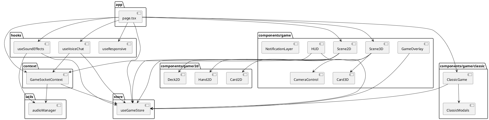
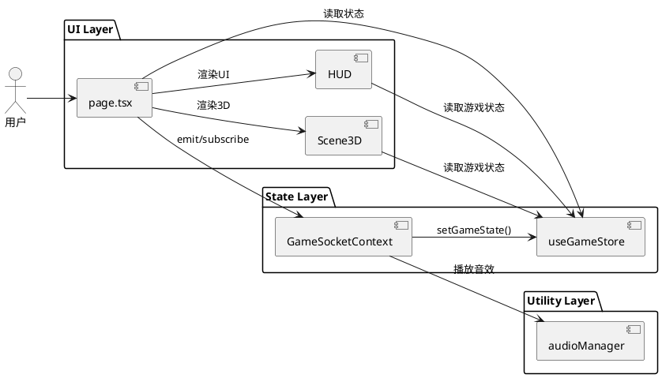

# 依赖关系图

## 一、组件依赖概述

### 1.1 依赖方向

```
┌─────────────────────────────────────────────────────────────────────────────┐
│                           依赖方向说明                                       │
│                                                                             │
│   数据流向 ←←←←←←←←←←←←←←←←←←←←←←←←←←←←←←←←←←←←←←←←                    │
│   依赖流向 →→→→→→→→→→→→→→→→→→→→→→→→→→→→→→→→→→→→→                    │
│                                                                             │
│   page.tsx 依赖  Context/Store                                              │
│   Scene3D 依赖  Store                                                      │
│   HUD 依赖      Store/Context                                              │
└─────────────────────────────────────────────────────────────────────────────┘
```

---

## 二、PlantUML 依赖图

### 2.1 完整依赖关系



### 2.2 核心依赖链



---

## 三、Context 与 Store 依赖

### 3.1 GameSocketContext 依赖

```typescript
// frontend/src/context/GameSocketContext.tsx
/**
 * Socket 连接上下文。
 *
 * 依赖：
 * - useGameStore (状态存储)
 * - audioManager (音效)
 * - WebSocket 连接
 */
const GameSocketProvider: React.FC<{ children: React.ReactNode }> = ({ children }) => {
  const { setGameState, setPlayerInfo, ... } = useGameStore();

  // Socket 连接
  const socket = useMemo(() => io(SERVER_URL, {
    transports: ['polling'],
    forceNew: true,
  }), []);

  // 事件监听
  useEffect(() => {
    socket.on('gameStateUpdate', (state) => {
      setGameState(state);  // 更新 Zustand Store
    });

    socket.on('error', (error) => {
      // 错误处理
    });
  }, [socket]);

  return (
    <GameSocketContext.Provider value={/* socket 方法 */}>
      {children}
    </GameSocketContext.Provider>
  );
};
```

### 3.2 Zustand Store 结构

```typescript
// 依赖关系：
// page.tsx → useGameStore
// Scene3D → useGameStore
// HUD → useGameStore
// GameSocketContext → useGameStore (写入)
```

---

## 四、Hooks 依赖链

### 4.1 useResponsive

```typescript
// frontend/src/hooks/useResponsive.ts
/**
 * 响应式检测 Hook。
 *
 * 依赖：useGameStore (setLayout)
 * 效果：监听 window.resize，更新设备类型和方向
 */
export function useResponsive() {
  const setLayout = useGameStore((state) => state.setLayout);

  useEffect(() => {
    const handleResize = () => {
      // 检测逻辑
      setLayout(deviceType, orientation);
    };

    window.addEventListener('resize', handleResize);
    return () => window.removeEventListener('resize', handleResize);
  }, [setLayout]);
}
```

### 4.2 useSoundEffects

```typescript
// frontend/src/hooks/useSoundEffects.ts
/**
 * 音效反馈 Hook。
 *
 * 依赖：
 * - useGameStore (gameState, masterVolume)
 * - audioManager (播放音效)
 */
export function useSoundEffects() {
  const gameState = useGameStore((state) => state.gameState);
  const masterVolume = useGameStore((state) => state.masterVolume);

  // 监听游戏状态变化播放音效
  useEffect(() => {
    if (gameState) {
      // 状态变化音效逻辑
    }
  }, [gameState, masterVolume]);
}
```

### 4.3 完整 Hooks 依赖图

```
┌─────────────────────────────────────────────────────────────────┐
│                         Hooks 依赖链                            │
│                                                                  │
│  ┌──────────────────┐                                          │
│  │  useResponsive   │                                          │
│  │  ┌────────────┐  │                                          │
│  │  │window.resize│ │                                          │
│  │  └─────┬──────┘  │                                          │
│  │        │         │                                          │
│  │        ▼         │                                          │
│  │  setLayout()    │                                          │
│  │        │         │                                          │
│  └────────┼────────┘                                          │
│           │                                                    │
│           ▼                                                    │
│  ┌──────────────────┐                                          │
│  │  useGameStore    │                                          │
│  │  (写入布局状态)  │                                          │
│  └──────────────────┘                                          │
│                                                                  │
│  ┌──────────────────┐    ┌──────────────────┐                │
│  │ useSoundEffects │    │  useVoiceChat    │                │
│  │ ┌────────────┐  │    │ ┌────────────┐  │                │
│  │ │ gameState │  │◄───┤ │  socket    │  │                │
│  │ └─────┬──────┘  │    │ └─────┬──────┘  │                │
│  │       │         │    │       │         │                │
│  │       ▼         │    │       ▼         │                │
│  │ playSound()    │    │ WebRTC 连接     │                │
│  └────────┬───────┘    └────────┬───────┘                │
│           │                      │                          │
│           ▼                      ▼                          │
│  ┌──────────────────────────────────────────────────┐        │
│  │              audioManager (单例)                  │        │
│  └──────────────────────────────────────────────────┘        │
└─────────────────────────────────────────────────────────────────┘
```

---

## 五、模块间依赖矩阵

### 5.1 依赖矩阵表

| 组件 | useGameStore | GameSocketContext | audioManager | 其他组件 |
|------|-------------|-------------------|--------------|----------|
| page.tsx | R/W | R | - | Scene3D, HUD |
| Scene3D | R | - | - | Card3D |
| Scene2D | R | - | - | Card2D, Hand2D |
| ClassicGame | R | - | - | Modals |
| HUD | R | R | - | - |
| GameOverlay | R | - | - | - |
| GameSocketContext | W | - | R | - |
| useResponsive | W | - | - | - |
| useSoundEffects | R | - | W | - |
| useVoiceChat | R | R | - | - |

> R = 读取, W = 写入

---

## 六、版本信息

| 版本 | 日期 | 说明 |
|------|------|------|
| 1.0.0 | 2026-03-08 | 初始版本 |

---

*本文档使用简体中文，遵循 Google 文档风格。*
