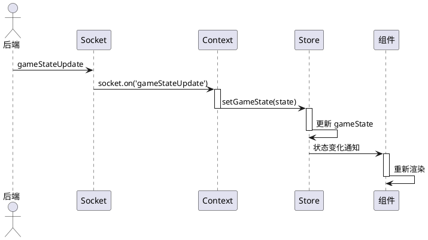

# Zustand Store 状态管理

## 一、Zustand 概述

### 1.1 什么是 Zustand

Zustand 是一个轻量级的状态管理库，专为 React 设计。其特点：
- **无 Provider 嵌套**：无需像 Redux 那样包裹 Provider
- **TypeScript 友好**：自动类型推断
- **最小化更新**：只订阅需要的状态片段
- **极简 API**：仅有几个核心概念

### 1.2 为什么选择 Zustand

| 特性 | Redux | Zustand | MobX |
|------|-------|---------|------|
| Provider 嵌套 | 需要 | 不需要 | 需要 |
| 模板代码 | 多 | 少 | 中 |
| 性能 | 中 | 高 | 高 |
| 学习曲线 | 陡 | 平缓 | 陡 |

---

## 二、Store 结构详解

### 2.1 完整 Store 定义

```typescript
// frontend/src/store/useGameStore.ts

/**
 * 游戏全局状态仓库。
 *
 * 使用 Zustand 创建，包含：
 * - 游戏状态（gameState, playerId, roomId）
 * - 连接状态（isConnected, isReconnecting）
 * - UI 状态（notifications, deviceType, orientation）
 * - 音频设置（masterVolume, isMicMuted）
 */
interface GameStore {
  // ============ 游戏状态 ============
  gameState: GameState | null;     // 当前游戏状态
  playerId: string | null;         // 当前玩家 ID
  playerName: string | null;       // 当前玩家名称
  roomId: string | null;           // 房间 ID
  inviteToken: string | null;     // 邀请码

  // ============ 连接状态 ============
  isConnected: boolean;            // Socket 连接状态
  isReconnecting: boolean;        // 重连中状态

  // ============ UI 状态 ============
  deviceType: DeviceType;         // 设备类型 (mobile/tablet/desktop)
  orientation: Orientation;       // 屏幕方向 (portrait/landscape)
  notifications: Notification[]; // 通知列表

  // ============ 音频与语音 ============
  masterVolume: number;           // 主音量 (0-1)
  isMicMuted: boolean;           // 麦克风静音状态

  // ============ 方法 ============
  setGameState: (state: GameState) => void;
  setPlayerInfo: (id: string, name: string) => void;
  setRoomId: (id: string | null) => void;
  setInviteToken: (token: string | null) => void;
  setConnected: (connected: boolean) => void;
  setReconnecting: (reconnecting: boolean) => void;
  setAudioSettings: (volume: number, muted: boolean) => void;
  setLayout: (device: DeviceType, orientation: Orientation) => void;
  addNotification: (notification: Omit<Notification, 'id'>) => void;
  removeNotification: (id: string) => void;
  resetGame: () => void;
}
```

### 2.2 Store 实现

```typescript
// frontend/src/store/useGameStore.ts

export const useGameStore = create<GameStore>((set) => ({
  // 初始状态
  gameState: null,
  playerId: null,
  playerName: null,
  roomId: null,
  inviteToken: null,
  isConnected: false,
  isReconnecting: false,
  deviceType: 'desktop',
  orientation: 'landscape',
  notifications: [],
  masterVolume: 0.8,
  isMicMuted: true,

  // 状态更新方法
  setGameState: (state) => set({ gameState: state }),

  setPlayerInfo: (id, name) => set({ playerId: id, playerName: name }),

  setRoomId: (id) => set({ roomId: id }),

  setInviteToken: (token) => set({ inviteToken: token }),

  setConnected: (connected) => set({ isConnected: connected }),

  setReconnecting: (reconnecting) => set({ isReconnecting: reconnecting }),

  setAudioSettings: (volume, muted) => set({
    masterVolume: volume,
    isMicMuted: muted
  }),

  setLayout: (device, orientation) => set({
    deviceType: device,
    orientation: orientation
  }),

  addNotification: (n) => set((state) => {
    // 防止重复通知
    const exists = state.notifications.some(
      existing => existing.type === n.type && existing.message === n.message
    );
    if (exists) return state;
    return {
      notifications: [
        ...state.notifications,
        { ...n, id: Math.random().toString(36).substring(2, 9) }
      ]
    };
  }),

  removeNotification: (id) => set((state) => ({
    notifications: state.notifications.filter((n) => n.id !== id)
  })),

  resetGame: () => set({
    gameState: null,
    roomId: null,
    playerId: null,
    playerName: null,
    inviteToken: null
  }),
}));
```

---

## 三、Store 使用模式

### 3.1 基本使用

```typescript
// 在组件中使用
function MyComponent() {
  // 读取状态
  const gameState = useGameStore((state) => state.gameState);
  const playerId = useGameStore((state) => state.playerId);

  // 更新状态
  const setGameState = useGameStore((state) => state.setGameState);

  return <div>{gameState?.status}</div>;
}
```

### 3.2 选择性订阅

```typescript
// 只订阅需要的片段，避免不必要渲染
function GameInfo() {
  // 只有 gameState 变化时才重新渲染
  const gameState = useGameStore((state) => state.gameState);

  // 只有 isConnected 变化时才重新渲染
  const isConnected = useGameStore((state) => state.isConnected);
}
```

### 3.3 派生状态

```typescript
// 在组件中计算派生状态
function CurrentPlayerInfo() {
  const gameState = useGameStore((state) => state.gameState);
  const playerId = useGameStore((state) => state.playerId);

  // 派生状态：在组件内计算
  const currentPlayer = useMemo(() => {
    if (!gameState || !playerId) return null;
    return gameState.players.find(p => p.id === playerId);
  }, [gameState, playerId]);

  return <div>{currentPlayer?.name}</div>;
}
```

---

## 四、状态更新流程

### 4.1 Socket 状态更新



### 4.2 用户操作状态更新

```typescript
// 用户点击卡牌 → Context 发送事件 → 后端处理 → 广播状态更新

// 1. 用户点击卡牌
function Card({ card, onClick }) {
  return <div onClick={onClick}>{card.value}</div>;
}

// 2. 组件调用 Context 方法
const { playCard } = useGameSocket();
playCard(cardId);

// 3. Context 发送 Socket 事件
const playCard = useCallback((cardId) => {
  socket.emit('playCard', { roomId, cardId });
}, [socket, roomId]);

// 4. 后端处理并广播
// 后端: gameService.playCard() → broadcastState()

// 5. Context 接收并更新 Store
socket.on('gameStateUpdate', (state) => {
  setGameState(state);  // 更新 Store
});
```

---

## 五、与其他方案对比

### 5.1 Zustand vs Redux

```
┌─────────────────────────────────────────────────────────────────┐
│                    Zustand vs Redux                             │
│                                                                  │
│  ┌─────────────────────┐    ┌─────────────────────┐          │
│  │       Redux        │    │      Zustand        │          │
│  ├─────────────────────┤    ├─────────────────────┤          │
│  │ Provider 包裹      │    │ 无需 Provider       │          │
│  │ Action/Reducer    │    │ 直接修改状态        │          │
│  │ 中间件支持        │    │ 中间件支持         │          │
│  │ 模板代码较多      │    │ 代码简洁           │          │
│  └─────────────────────┘    └─────────────────────┘          │
└─────────────────────────────────────────────────────────────────┘
```

### 5.2 本项目选择 Zustand 的理由

| 理由 | 说明 |
|------|------|
| 简洁 | API 极简，学习成本低 |
| 高效 | 细粒度订阅，避免不必要渲染 |
| TypeScript | 良好的类型推断 |
| 适配 | 适合游戏状态这种中型复杂度场景 |

---

## 六、版本信息

| 版本 | 日期 | 说明 |
|------|------|------|
| 1.0.0 | 2026-03-08 | 初始版本 |

---

*本文档使用简体中文，遵循 Google 文档风格。*
