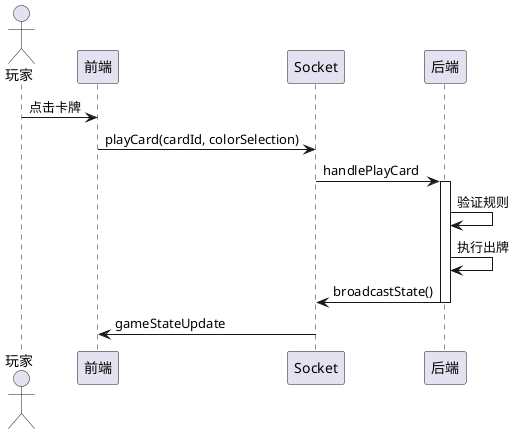

# Socket 事件定义

## 一、事件概述

### 1.1 事件方向

```
┌─────────────────────────────────────────────────────────────────┐
│                     Socket 事件方向                             │
│                                                                  │
│  C → S (客户端 → 服务器)                                        │
│  ┌──────────┐    ┌──────────┐    ┌──────────┐                │
│  │ joinRoom │    │ playCard │    │ drawCard │                │
│  └──────────┘    └──────────┘    └──────────┘                │
│                                                                  │
│  S → C (服务器 → 客户端)                                        │
│  ┌──────────┐    ┌──────────┐    ┌──────────┐                │
│  │gameState │    │  error   │    │roomClosed │                │
│  │ Update   │    │          │    │          │                │
│  └──────────┘    └──────────┘    └──────────┘                │
└─────────────────────────────────────────────────────────────────┘
```

---

## 二、客户端 → 服务器事件

| 事件名 | 参数 | 说明 |
|--------|------|------|
| `joinRoom` | roomId, playerName, config, inviteToken, reconnectToken | 加入房间 |
| `addAi` | roomId, difficulty | 添加 AI |
| `startGame` | roomId | 开始游戏 |
| `playCard` | roomId, cardId, colorSelection | 出牌 |
| `drawCard` | roomId | 摸牌 |
| `shoutUno` | roomId | 喊 UNO |
| `catchUnoFailure` | roomId, targetId | 抓漏 |
| `challenge` | roomId, accept | 质疑 |
| `handlePendingDrawPlay` | roomId, play | 摸牌决策 |
| `ping` | - | 心跳 |

---

## 三、服务器 → 客户端事件

| 事件名 | 参数 | 说明 |
|--------|------|------|
| `gameStateUpdate` | GameState | 游戏状态广播 |
| `reconnectCredentials` | sessionId, reconnectToken | 重连凭据 |
| `playerStatusUpdate` | playerId, isConnected | 玩家状态 |
| `playerShoutedUno` | playerId | 喊 UNO 广播 |
| `roomClosed` | reason | 房间关闭 |
| `error` | message | 错误通知 |
| `pong` | - | 心跳响应 |

---

## 四、事件处理流程

### 4.1 出牌流程



---

## 五、版本信息

| 版本 | 日期 | 说明 |
|------|------|------|
| 1.0.0 | 2026-03-08 | 初始版本 |

---

*本文档使用简体中文，遵循 Google 文档风格。*
