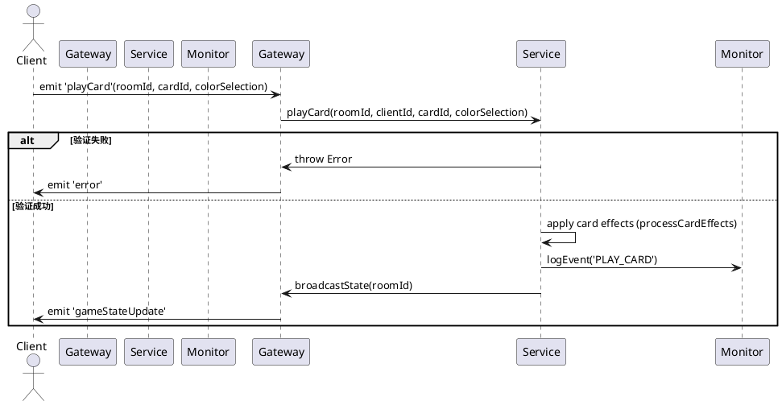
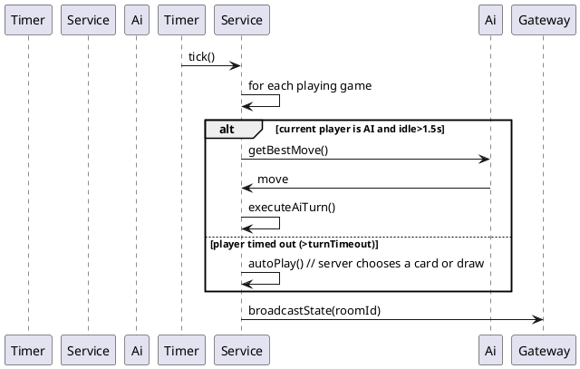
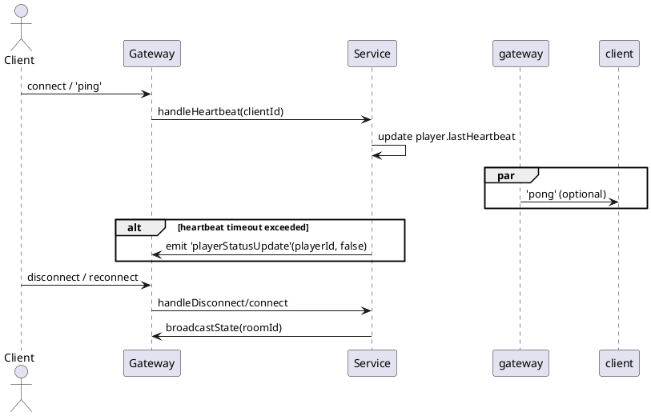

# 后端软件设计文档（UNO - 后端 / 权威服务）

作者：Shyu  | 日期：2026-02-15

> 文档入口：请先阅读 [README.md](README.md) 与 [documentation-governance.md](documentation-governance.md)。

## 目的与范围 🎯
本文档详述后端服务的架构、核心业务逻辑、重要代码段解析与 PlantUML 流程图。目标读者为后端维护者与想修改游戏规则的工程师。

---

## 目录
1. 概览
2. 后端文件树与职责
3. 主要业务流程（简述）
4. 关键流程 PlantUML 图
5. 重要代码片段逐行解析（可直接对照源码）
6. 测试/监控/性能注意点
7. PR / 变更清单（必须执行的同步项）

---

## 1. 概览
- 技术栈：NestJS + socket.io（WebSocket gateway）、TypeScript、Jest（单元/e2e）
- 网络配置：
  - **监听端口**：19191 (可通过 `BACKEND_PORT` 环境变量配置)。
  - **绑定地址**：`0.0.0.0` (允许局域网内所有网络接口访问)。
  - **CORS 策略**：允许所有 Origin 跨域访问，支持 Credentials，专门针对 Socket.io 握手做了动态 Origin 校验。
- **Socket.IO 路径**：使用 `/uno-socket/` 路径（nginx 反向代理配置），后端监听 `0.0.0.0:19191`。
- 服务器职责：房间管理、规则校验、时序（超时/AI）、计分与广播公共状态（脱敏）——后端为权威。
- 关键约定：在广播给客户端前会隐藏 `deck`（`deck: undefined`）；客户端仅基于 `gameStateUpdate` 渲染。

---

## 2. 后端文件树与职责
```
backend/
├─ src/
│  ├─ main.ts
│  ├─ app.module.ts
│  └─ game/
│     ├─ types.ts                      # 游戏类型定义（Card/Player/GameState）
│     ├─ game.module.ts
│     ├─ monitor/
│     │  └─ game.monitor.service.ts    # 日志与僵尸房间清理
│     └─ game/
│        ├─ game.gateway.ts            # Socket.io gateway（事件映射）
│        ├─ game.service.ts            # 游戏规则、时序、AI 调度（权威实现）
│        └─ ai.service.ts              # AI 策略实现（E/M/H）
└─ test/                               # 集成/脚本测试（reconnect/ai 等）
```

职责摘要：
- `GameGateway`：解析 socket 事件（`playCard`、`drawCard` 等），调用 `GameService` 并在出错时向客户端发送 `error`。
- `GameService`：核心规则引擎（出牌合法性、回合推进、AI 与自动出牌、超时处理、结算、房间生命周期）。
- `AiService`：不同难度的决策策略（决定出牌或抓牌、选择颜色）。
- `GameMonitorService`：房间活动追踪、日志、超时与清理。

---

## 3. 主要业务流程（简述）
- 房间生命周期：创建 => 玩家加入 => startGame => 回合循环（出牌/抓牌/特效） => 结算回合 => 多轮或达分结束。
- 权责分离：所有规则校验和计时在 `GameService`，gateway 只负责事件转发与广播。
- 时间驱动逻辑：全局定时器 `startGlobalTimer()` 每秒检查：AI 延迟（≈1.5s）触发、回合超时触发 `autoPlay`、心跳检测并标记离线玩家、清理僵尸房间。

---

## 4. 关键流程 PlantUML 图

### 4.1 `playCard` 流程（验证 -> 应用 -> 广播）


### 4.2 AI / 超时 / 自动出牌（全局定时器）


### 4.3 Heartbeat / 重连 / 断线检测


---

## 5. 重要代码片段逐行解析（可直接对照源码）
下面摘录自 `backend/src/game/game.service.ts` 与 `game.gateway.ts`，并给出要点与调试建议。

### 5.1 全局定时器（AI + 超时检测）
```typescript
private startGlobalTimer() {
  setInterval(() => {
    const now = Date.now();
    for (const [roomId, game] of this.games.entries()) {
      if (game.status === GameStatus.PLAYING) {
        const currentPlayer = game.players[game.currentPlayerIndex];

        if (currentPlayer.type === PlayerType.AI && now - game.lastActionTimestamp > 1500) {
          this.gameMonitorService.logEvent(roomId, 'AI_TURN', { playerId: currentPlayer.id });
          this.executeAiTurn(roomId, currentPlayer);
        } else if (now - game.lastActionTimestamp > game.config.turnTimeout * 1000) {
          this.gameMonitorService.logEvent(roomId, 'AUTO_PLAY_TIMEOUT', { playerId: currentPlayer.id });
          this.autoPlay(roomId);
        }
      }
      this.checkHeartbeats(game, roomId, now);
    }
    ...
  }, 1000);
}
```
- 逐行说明：
  - 每秒执行一次（setInterval 1000ms）。
  - 如果当前玩家为 AI 且自上次动作超过 1.5 秒，则触发 AI 决策并执行（executeAiTurn）。
  - 如果玩家超时（超过配置 turnTimeout），执行 autoPlay（服务器代为出牌或抓牌）。
  - checkHeartbeats 负责检查玩家心跳并标记离线。
- 调试要点：在测试中模拟时间推进（或降低超时阈值）以验证 AI/autoPlay 路径。

### 5.2 出牌校验（validateMove）与出牌执行（playCard）核心
```typescript
private validateMove(game: GameState, card: Card): boolean {
  const top = game.discardPile[game.discardPile.length - 1];
  if (card.color === CardColor.WILD || card.type === CardType.WILD_DRAW_FOUR) return true;
  if (card.color === game.currentColor) return true;
  if (card.type === CardType.NUMBER && top.type === CardType.NUMBER && card.value === top.value) return true;
  if (card.type !== CardType.NUMBER && card.type === top.type) return true;
  return false;
}

public playCard(roomId: string, playerId: string, cardId: string, colorSelection?: CardColor) {
  const game = this.games.get(roomId);
  if (!game || game.status !== GameStatus.PLAYING) throw new Error('无效状态');
  const currentPlayer = game.players[game.currentPlayerIndex];
  if (currentPlayer.id !== playerId) throw new Error('不是你的回合');
  const idx = currentPlayer.hand.findIndex(c => c.id === cardId);
  if (idx === -1) throw new Error('未持有该牌');
  const card = currentPlayer.hand[idx];
  if (!this.validateMove(game, card)) throw new Error('出牌非法');
  currentPlayer.hand.splice(idx, 1);
  game.discardPile.push(card);
  // ... 处理 UNO 标记、特效、回合推进
}
```
- 要点：
  - 校验流程严格：状态 -> 回合 -> 是否持有 -> 合法性（validateMove）。任何一步失败都会抛错并由 gateway 转译为 `error` 事件给客户端。
  - 处理包括：移除手牌、加入弃牌堆、触发卡牌效果（跳过/反转/罚牌）、记录 `lastActionTimestamp` 等。
- 安全提示：所有客户端发起的动作都必须经过这些校验才能改变服务端状态。

### 5.3 UNO 抓牌逻辑（catchUnoFailure）与宽限期
```typescript
public catchUnoFailure(roomId: string, targetId: string) {
  const game = this.games.get(roomId);
  if (!game) return;
  const t = game.players.find(p => p.id === targetId);
  const now = Date.now();
  const gracePeriodPassed = t?.handSizeChangedTimestamp ? (now - t.handSizeChangedTimestamp > 2000) : true;

  if (t && t.hand.length === 1 && !t.hasShoutedUno && gracePeriodPassed) {
    t.hand.push(...this.drawFromDeck(game, 2));
    t.hasShoutedUno = false;
    t.handSizeChangedTimestamp = undefined;
  }
}
```
- 说明：当目标玩家手牌降为 1 且未喊 UNO，并且超过 2s 宽限期，抓牌成功（罚 2 张）。宽限期允许玩家在手牌变化后短时间内喊 UNO。

### 5.4 结算（settleRound）与计分规则
```typescript
private settleRound(game: GameState, winnerId: string) {
  game.winner = winnerId;
  let score = 0;
  game.players.forEach(p => {
    if (p.id !== winnerId) p.hand.forEach(c => {
      if (c.type === CardType.NUMBER) score += c.value!;
      else if ([CardType.SKIP, CardType.REVERSE, CardType.DRAW_TWO].includes(c.type)) score += 20;
      else score += 50;
    });
  });
  const w = game.players.find(p => p.id === winnerId);
  if (w) w.score += score;
  // ... 判断是否结束游戏
}
```
- 规则要点：
  - 数字牌：按点数计分；特殊牌：SKIP/REVERSE/DRAW_TWO 计 20；WILD/WILD_DRAW_FOUR 计 50。
  - 胜者获得其它玩家手中所有牌的分数之和。

---

## 6. 测试 / 监控 / 性能注意点
- 单元测试覆盖点：`validateMove`、`processCardEffects`、`drawFromDeck`/`reshuffleDiscardPile`、`settleRound`。
- 集成测试：`test/reconnect-test.js`、`test/ai-test.js` 等用于验证心跳、重连与 AI 行为。
- 性能考量：rooms map 保存在内存中；长时间运行或大量房间时应考虑持久化或分片（例如 Redis + worker 模式）。
- 生产监控：`GameMonitorService` 已提供日志和僵尸房间检测；建议在部署时把日志接入集中化系统（ELK/Prometheus+Grafana）。

---

## 7. PR / 变更清单（必须同步的项目）
- 修改游戏规则或 GameState 类型：同时更新 `backend/src/game/types.ts`、`frontend/src/types/game.ts`、并补充后端单元 + 前端集成测试。
- 修改 Socket 事件或负载：同步更新 `backend/src/game/game.gateway.ts`、`frontend/src/context/GameSocketContext.tsx`、并在 `test/` 下添加对应集成脚本。
- 调整时序（AI 延迟 / turnTimeout）：更新 `GameService.startGlobalTimer()` 的注释与对应测试（使用加速或时间模拟）。

---

---

## 8. 扩展内容（详细 API 参考、方法级分析、并发/监控/测试示例）

### 8.1 Socket API 参考（逐事件）
- 统一契约主文档：见 [online-reliability-features.md](online-reliability-features.md) 第 3 节。
- 后端实现视角摘要：
  - 入房与重连：`joinRoom`（支持 `isReconnect`、`sessionId`、`reconnectToken`）。
  - 常规动作：`addAi`、`startGame`、`playCard`、`drawCard`、`shoutUno`、`catchUnoFailure`。
  - 在线状态：`ping`/`pong`、`playerStatusUpdate`、`roomClosed`。
  - 重连凭据：join 成功后单播 `reconnectCredentials`。


### 8.2 方法级深入（带代码片段 & 说明）
- joinGame / createGame
```typescript
public joinGame(roomId: string, playerId: string, playerName: string, config?: Partial<GameConfig>): GameState {
  let game = this.games.get(roomId);
  if (!game) game = this.createGame(roomId, config);
  const existing = game.players.find(p => p.name === playerName);
  if (existing) { existing.id = playerId; existing.isConnected = true; existing.lastHeartbeat = Date.now(); return game; }
  if (game.players.length >= game.config.playerLimit) throw new Error('房间已满');
  game.players.push({ id: playerId, name: playerName, type: PlayerType.HUMAN, ... });
  return game;
}

public createGame(roomId: string, config?: Partial<GameConfig>): GameState {
  const defaultConfig: GameConfig = { ..., playerLimit: 4, deckCount: 1 };
  const finalConfig = { ...defaultConfig, ...config };
  const gameState: GameState = { 
    ..., 
    deck: this.generateUnoDeck(finalConfig.deckCount),
    config: finalConfig 
  };
  return gameState;
}
```
说明：
- **可扩展性**：支持 4人/8人/12人 等不同规模的房间，通过 `playerLimit` 动态约束。
- **平衡性**：通过 `deckCount` 确保多人游戏时洗牌频率平衡。
- 合并重连逻辑：优先使用 `reconnectToken` / `sessionId` 恢复玩家身份，昵称仅作展示字段。
- 全员离线不会立即解散：进入 `disconnectGraceSeconds` 保留窗口；窗口内若有人恢复在线则取消解散。


- startGame
  - 关键：重置 `deck`、`discardPile`、为每位玩家发 7 张牌、选择首张（保证首张为 NUMBER）并初始化 `lastActionTimestamp`。
  - 测试点：验证首张为 NUMBER、手牌数量、当前颜色与 currentType/currentValue 一致。


- validateMove / playCard（关键校验点）
```typescript
private validateMove(game: GameState, card: Card): boolean { /* 比对 top/discard/currentColor 等 */ }
```
说明：检验逻辑要覆盖所有卡牌类型（WILD/WILD_DRAW_FOUR 总是可出），且 `playCard` 在做了 `validateMove` 后才变更状态。测试应覆盖：颜色匹配、数值匹配、类型匹配、万能牌。


- drawFromDeck / reshuffle（边界处理）
```typescript
private drawFromDeck(game: GameState, count: number): Card[] {
  if (game.deck.length < count) this.reshuffleDiscardPile(game);
  return game.deck.splice(0, count);
}
```
说明/风险：如果 `discardPile` 只剩一张（top），reshuffle 后 deck 长度可能仍小于 count（极端小概率）。对 `drawFromDeck` 的测试应模拟 deck 空并验证 reshuffle 后行为。


- startGlobalTimer / executeAiTurn / autoPlay
  - 定时器每秒运行：触发 AI 回合、超时代打、心跳检查、僵尸房间清理。
  - 可测行为：当 `currentPlayer.type === AI` 且 `now - lastActionTimestamp > 1500` 时 `executeAiTurn` 会调用 `AiService.getBestMove` 并执行移动。


### 8.3 并发、数据一致性与建议防护
问题背景：`games` 存为内存 Map，多线程/多实例环境与并发 socket 事件会导致竞态：例如两个 `playCard` 同时检查 `currentPlayerIndex` 并双重修改状态。
建议：
- 在单进程内，用轻量级房间锁（per-room mutex）防止并发修改：
  - 推荐包：`async-mutex` 或 `await-lock`。
  - 使用位置：`playCard`, `drawCard`, `autoPlay`, `executeAiTurn`, `joinGame`（涉及 players 数组修改）

示例（伪代码）：
```ts
await roomLock.acquire();
try { this.playCard(...); } finally { roomLock.release(); }
```
- 水平扩展策略：使用 Redis 保存游戏快照并引入单一 worker（或分布式锁）来保证某房间只由一个实例拥有写权限。


### 8.4 可观测性与指标建议（示例代码）
推荐监控指标：
- Counter: games_started_total, rounds_settled_total
- Gauge: active_rooms, players_connected
- Histogram: turn_duration_seconds, ai_decision_duration_seconds

示例：在 `GameMonitorService` 中引入 `prom-client`（演示片段）
```typescript
import client from 'prom-client';
const gamesStarted = new client.Counter({ name: 'uno_games_started_total', help: 'Total games started' });
// 在 startGame() 中调用 gamesStarted.inc();
```
另外建议：在 `startGlobalTimer()` 周期性导出 `active_rooms` 为 Gauge，记录 `games.size`。


### 8.5 单元 / 集成测试模板（示例片段）
- 目标：覆盖 `validateMove`, `playCard`（成功/失败）, `autoPlay`, `executeAiTurn`, `catchUnoFailure`。
- 示例（Jest）骨架：`backend/test/game.service.spec.ts`
```typescript
describe('GameService', () => {
  let service: GameService;
  beforeEach(() => { service = new GameService(...mockDeps); });

  test('validateMove allows same color', () => {
    const game = service.createGame('room1');
    // set top of discard and player card color...
    expect(service['validateMove'](game, card)).toBe(true);
  });

  test('playCard throws when not your turn', () => {
    const g = service.createGame('r');
    // setup players and attempt with wrong playerId
    expect(() => service.playCard('r', 'wrongId', 'cardId')).toThrow();
  });
});
```

集成测试：扩展 `test/reconnect-test.js`、新增 `test/playflow-test.js`（模拟 2 人游戏完整回合）。


### 8.6 部署 / 扩展与性能策略
- 单实例适合开发与小规模使用；生产建议：
  - 使用 socket.io-redis adapter + Redis pub/sub 支持多实例 WebSocket 横向扩展（并保证 sticky sessions 或共享会话层）。
  - 将长期房间状态持久化到 Redis（定期快照），减少内存占用并支持进程重启恢复。
  - 对 AI-heavy 逻辑可移入后台 worker 队列（例如 Bull / Redis queue）以释放主线程并提升吞吐。


### 8.7 常见故障排查清单（快速）
- 问题：玩家出牌被拒绝（错误：不是你的回合）
  - 检查：`game.currentPlayerIndex` 是否与 `playerId` 对应；是否存在并发修改导致索引不同步。
- 问题：AI 未行动
  - 检查：`game.lastActionTimestamp` 是否被正确更新；全局定时器是否运行（日志：`AI_TURN` 事件）。
- 问题：重连后手牌丢失
  - 检查：`joinGame` 中 existing player 名称匹配逻辑；客户端是否正确发送 `joinRoom` 并保留 `localStorage`。


### 8.8 数据迁移 / 版本兼容提示
- 当 `GameState` 或 socket 事件负载发生不兼容变更时：
  - 维护 `version` 字段（例如 `gameVersion`）并在 gateway 层进行兼容处理；
  - 在后端提供转换/兼容层或兼容性 shim，或者通过短时间的双写策略逐步迁移客户端/服务器。

---

需要我把上面的 Jest 测试模板写入 `backend/test`（生成若干测试文件）并运行一遍测试，还是先把观测/metrics 示例代码插入 `GameMonitorService` 以便 CI 校验？
