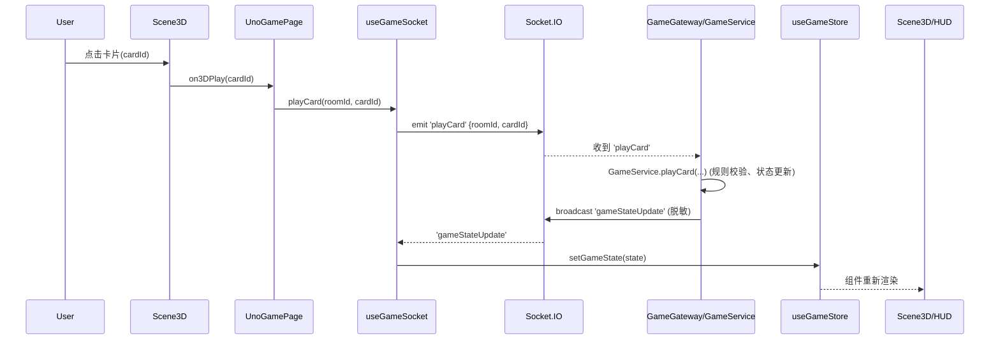
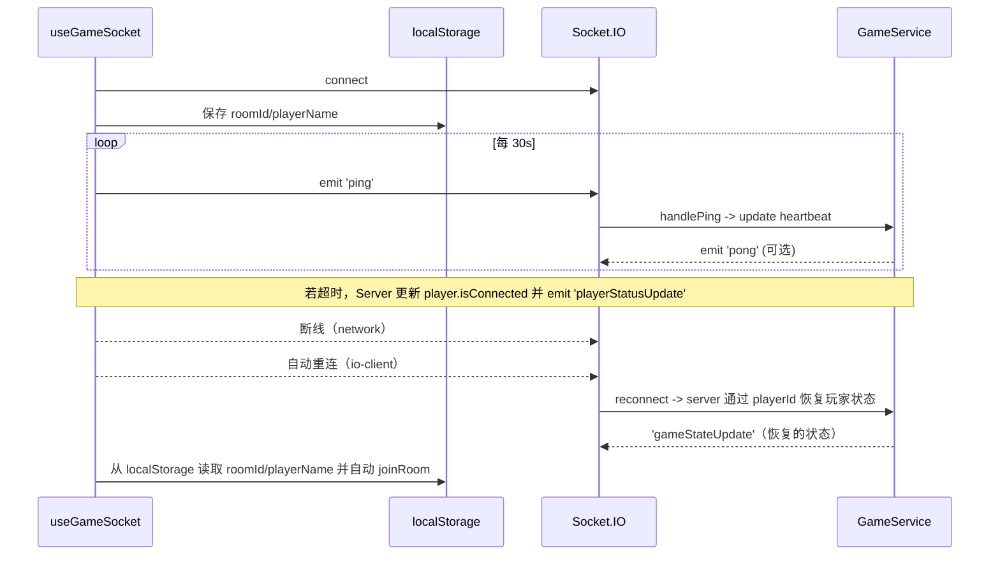
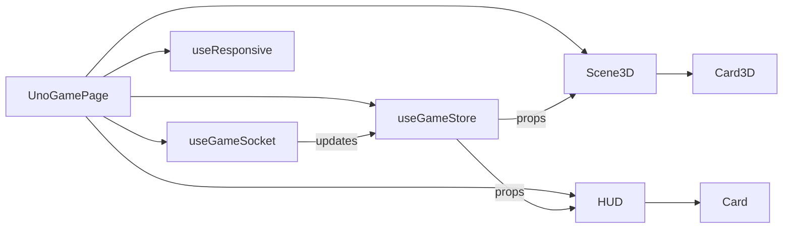

# 前端软件设计文档（UNO - 前端）

作者：Shyu  | 日期：2026-02-15

> 文档入口：请先阅读 [README.md](README.md) 与 [documentation-governance.md](documentation-governance.md)。

## 目的与范围 🎯
本文档为 `frontend` 子系统提供详细的功能与架构说明（自顶向下），面向开发者与维护者。内容包括组件职责、数据流/事件契约、状态模型、关键交互时序图、测试建议与常见变更检查清单。文档中的示意图使用 Mermaid，并嵌入在本文件中以便快速参考。

---

## 目录
1. 概览
2. 高层组件与职责
3. 状态模型（GameState 快照）
4. 关键 Socket 事件与消息契约
5. 核心交互流程（时序图）
6. 组件交互/布局图（组件图）
7. 响应式与 UI 行为
8. 测试建议（单元 / 集成 / E2E）
9. 性能与安全注意点
10. 开发者修改清单（PR 检查项）
11. 运行与调试命令

---

## 1. 概览
- 角色：**前端为展示层**，所有规则/权威状态由后端 `GameService` 提供。
- 单一真源：前端通过 `useGameSocket` 接收服务器的 `gameStateUpdate` 并写入 `useGameStore`。
- **视觉风格**：基于 UNO 官方经典的活力色系（红、黄、蓝、绿），支持 **2D 精美界面** 与 **3D 沉浸式场景** 双模式。
- 主要技术栈：React (Next.js)、TypeScript、@react-three/fiber、zustand、Socket.IO、Ant Design、TailwindCSS。
- **双模式渲染**：通过 `viewMode` 状态切换 2D/3D 视图，2D 使用纯 SVG 渲染，3D 使用 Three.js 渲染。

---

## 2. 高层组件与职责
- `UnoGamePage` (`frontend/src/app/page.tsx`)
  - 页面级协调器：实现全新 **UNO 主题建房页**，支持标准 (4人)、大房间 (8人)、超大房间 (12人) 配置选择。
  - **2D/3D 模式切换**：通过 `viewMode` 状态（`'2d' | '3d'`）切换渲染视图，默认使用 2D 模式。
  - **音效系统**：集成 `useSoundEffects` hook 管理游戏音效（出牌、抽牌、UNO 等）。
- `useGameSocket`（由 `frontend/src/context/GameSocketContext.tsx` 提供）
  - Socket 管理：支持 `joinRoom` 时发送房间配置 `config`。
  - 连接策略：默认优先 WebSocket，失败时自动降级轮询（polling）并重连；当页面主机为保留测试网段（198.18.0.0/15）或 `0.0.0.0` 时，后端地址回退到 `localhost:19191`。
  - **Socket.IO 路径**：使用 `/uno-socket/` 路径（nginx 反向代理配置）。
  - 重连身份策略：使用 `sessionId + reconnectToken` 作为重连凭据，断线重连按身份恢复，不依赖昵称。
  - 重连提示策略：区分"短断线重连中 / 长断线重连中 / 重连成功 / 房间关闭"四类提示，避免通知刷屏。
- `Scene2D` / `Scene3D`
  - **Scene2D**：2D 渲染模式，使用纯 SVG 组件实现精美桌面效果，包含 Table2D、PlayerArea2D、Hand2D、Deck2D、DiscardPile2D 等组件。
  - **Scene3D**：3D 渲染模式，使用 @react-three/fiber 实现沉浸式场景。
- `Card` / `Card3D` / `Card2D`
  - 视觉增强：引入 **JSDoc (Google Style)** 规范。2D 卡牌增加角标与中央椭圆装饰；3D 卡牌同步活力色系与万能牌四色切片。

---

## 12. 编码规范 (Google Style)
所有新增组件与核心逻辑必须包含详细的文档注释：
- **Args**: 参数说明。
- **Returns**: 返回值说明。
- **Side Effects**: 副作用说明（如有）。

### 2.1 前端文件树结构（详解）
下面按目录级别列出 `frontend` 的文件组织，并对关键文件与变更影响进行说明（基于仓库代码）。

```
frontend/
├─ package.json                # 脚本与依赖（dev: next dev）
├─ public/                     # 静态资源（favicon、字体等）
├─ src/
│  ├─ app/                     # Next.js App 路由：layout.tsx、page.tsx、globals.css
│  │  ├─ page.tsx              # 页面级协调器（UI、modals、socket 调用）
│  │  └─ layout.tsx            # 全局布局
│  ├─ components/              # 可复用 UI 组件
│  │  ├─ Card.tsx              # 2D 卡片组件（小尺寸、列表）
│  │  └─ game/                 # 游戏场景相关组件（3D + HUD）
│  │     ├─ Card3D.tsx         # three.js 卡牌交互（点击/hover）
│  │     ├─ Scene3D.tsx        # 3D 场景 & 摄像机逻辑
│  │     └─ HUD.tsx            # 顶部/侧边 HUD、PlayerCard
│  ├─ context/                 # React Context（含 Socket provider）
│  │  └─ GameSocketContext.tsx # Socket 客户端：事件、心跳、重连、localStorage 恢复
│  ├─ hooks/                   # React Hook 集合
│  │  └─ useResponsive.ts      # 响应式检测 -> 更新 store 布局信息
│  ├─ store/                   # 客户端状态（zustand）
│  │  └─ useGameStore.ts       # gameState、playerInfo、UI 布局
│  ├─ types/                   # 前端类型定义（必须与后端同步）
│  │  └─ game.ts               # Card/Player/GameState 等接口
│  └─ app/globals.css          # Tailwind / 全局样式
└─ eslint.config.mjs / tsconfig.json / postcss.config.mjs
```

说明与职责（针对修改者）：
- `src/app/page.tsx`：入口文件，任何更改会直接影响页面级交互（颜色选择 Modal、UNO 按钮的显示逻辑、与 `useGameSocket` 的桥接）。修改前请确认对应 UI 文案与测试。
- `src/context/GameSocketContext.tsx`：单点负责 socket 协议（事件名、负载、重连策略、心跳）。如需改事件名或负载结构，必须同时修改 `backend/src/game/game.gateway.ts` 与 `frontend/src/types/game.ts`，并增加后端单元/集成测试。
- `src/store/useGameStore.ts`：前端单一状态仓库。`setGameState` 应仅由 `gameStateUpdate` 驱动，避免在客户端做“规则性”变更。
- `src/components/game/Scene3D.tsx`、`Card3D.tsx`：渲染与交互高耦合；改动需关注性能（多实例数时的 FPS）与事件回调（onPlayCard）。
- `src/components/game/HUD.tsx`：影响玩家可视化信息（抓 UNO、分数等），修改 UI 行为前需保留并校验后端状态依赖字段（`handCount`、`hasShoutedUno`）。
- `src/types/game.ts`：**类型契约**；任何 shape 改动必须同步到 `backend/src/game/types.ts` 并更新前后端的测试。

测试与文件位置建议：
- 单元测试放置：`frontend/src/components/__tests__/` 或 `frontend/src/hooks/__tests__/`。
- 推荐测试样例文件名：
  - `frontend/src/components/game/__tests__/HUD.test.tsx`
  - `frontend/src/components/game/__tests__/Scene3D.test.tsx`（布局函数抽离后更易测试）
  - `frontend/src/hooks/__tests__/useGameSocket.test.ts`（socket 事件映射、localStorage 恢复逻辑）

变更影响映射（快捷检查表）：
- 修改 socket 事件名 → 更新：`GameSocketContext.tsx`、`game.gateway.ts`、前后端 types、相关测试与文档。
- 修改 GameState shape → 更新：`frontend/src/types/game.ts`、`backend/src/game/types.ts`、所有使用该字段的组件与测试。
- 修改渲染/布局 → 更新：`Scene3D`、`HUD`、并增加视觉回归或快照测试。

---

## 3. 状态模型（重要字段与说明）
主要类型定义见：`frontend/src/types/game.ts`（必须与 `backend/src/game/types.ts` 保持同步）。

- GameState（关键字段）
  - `roomId` string — 房间标识
  - `players` Player[] — 玩家数组（包含手牌数量、在线状态）
  - `discardPile` Card[] — 弃牌堆（前端只需展示顶部若干张）
  - `currentPlayerIndex` number — 当前回合索引
  - `currentColor` CardColor — 当前颜色（用于 UI 指示）
  - `status` GameStatus — 游戏状态（WAITING / PLAYING / ROUND_FINISHED / GAME_OVER）
  - `config` GameConfig — 回合超时等配置（供测试/展示使用）

重要约定：**`deck` 字段会被后端广播前脱敏（`undefined`）——客户端不得依赖或试图恢复该字段**。

---

## 4. 关键 Socket 事件与消息契约
（与 `backend/src/game/game.gateway.ts` 对应）

- 统一契约主文档：见 [online-reliability-features.md](online-reliability-features.md) 第 3 节。
- 本文仅保留前端消费视角摘要：
  - 上行关键事件：`joinRoom`、`playCard`、`drawCard`、`shoutUno`、`catchUnoFailure`、`ping`
  - 下行关键事件：`gameStateUpdate`、`reconnectCredentials`、`playerStatusUpdate`、`roomClosed`、`error`
  - 脱敏约束：`gameStateUpdate` 的 `deck` 为 `undefined`，且不广播 `sessionId` / `reconnectToken`。

---

## 5. 核心交互流程（时序图）
下面使用时序图展示“出牌”与“断线重连”两条关键路径。

### 5.1 出牌（普通牌）时序


### 5.2 断线/重连与心跳



---

## 6. 组件交互/布局图（组件图）


### 6.1 关键实现片段与逐行讲解（基于源码）
下面把文档要点与 **真实代码片段** 对齐，逐段说明行为、原因与调试要点（文件路径以反引号标注）。

#### `useGameSocket`（`frontend/src/context/GameSocketContext.tsx`）
- 作用：socket 连接/重连、心跳、所有 socket 事件的集中实现；负责把 `gameStateUpdate` 写入 `useGameStore`。

```typescript
const socket = io(SERVER_URL, {
  reconnection: true,
  reconnectionAttempts: 5,
  reconnectionDelay: 1000,
  reconnectionDelayMax: 16000,
  randomizationFactor: 0,
});
```
- 要点：指数退避 + 限制重连次数，客户端 **不做权威校验**，只负责重试与恢复。

```typescript
socket.on('connect', () => {
  const savedRoomId = roomId || (typeof window !== 'undefined' ? localStorage.getItem('uno_room_id') : null);
  const savedPlayerName = playerName || (typeof window !== 'undefined' ? localStorage.getItem('uno_player_name') : null);
  if (savedRoomId && savedPlayerName) {
    socket.emit('joinRoom', { roomId: savedRoomId, playerName: savedPlayerName });
    setPlayerInfo(socket.id || '', savedPlayerName);
  }
  startHeartbeat();
});
```
- 解释：连接建立后会尝试从 `localStorage` 恢复 `roomId`/`playerName` 并自动 `joinRoom`，这是断线重连的关键路径。

```typescript
const startHeartbeat = () => {
  stopHeartbeat();
  heartbeatTimer.current = setInterval(() => {
    if (socketRef.current?.connected) {
      socketRef.current.emit('ping');
    }
  }, 30000);
};
```
- 解释：30s 心跳（与后端 `heartbeatTimeout` 配合），后端以此判断 `player.isConnected`。

#### `useGameStore`（`frontend/src/store/useGameStore.ts`）
- 作用：客户端单一状态仓库（只读地反映服务器广播）。重要实现：`setGameState` 替换整个 `gameState`。

```typescript
setGameState: (state) => set({ gameState: state }),
setPlayerInfo: (id, name) => set({ playerId: id, playerName: name }),
```
- 说明：前端应当避免对 `gameState` 做结构化修改（不要在客户端自行变更规则或尝试恢复 `deck`）。

#### `Scene3D`：摄像机与手牌布局（`frontend/src/components/game/Scene3D.tsx`）
- **物理坐标系**：以牌桌中心为原点 `[0, 0, 0]`。
  - **玩家 1 (我)**：`[0, 0, 16]`，面向中心。
  - **玩家 2 (右)**：`[16, 0, 0]`，面向中心。
  - **玩家 3 (对家)**：`[0, 0, -16]`，面向中心。
  - **玩家 4 (左)**：`[-16, 0, 0]`，面向中心。
- **摄像机视角**：固定在玩家 1 后上方 `[0, 22, 35]`，视角锁定看向原点，确保“第一人称”沉浸感。
- **手牌布局**：
  - 我的手牌（`isMe: true`）以 `-0.45` 弧度向玩家仰起，确保牌面内容在俯视视角下清晰可见。
  - 对手手牌通过旋转组，使牌面背对桌心，玩家仅能看到其背面装饰。
- **资源方案**：彻底移除外部 HDR 和远程字体。所有卡牌图案（Skip/Reverse/Wild 等）均通过 `Card3D.tsx` 中的几何体组合与内置 Text 渲染，支持 100% 局域网离线运行。

#### `UnoGamePage`：出牌与颜色选择（`frontend/src/app/page.tsx`）
- 触发出牌（若是 WILD 弹窗选择颜色）：
```typescript
const onCardClick = (cardId: string, type: CardType, color: CardColor) => {
  if (color === CardColor.WILD) {
    setSelectedCardId(cardId);
    setColorModalVisible(true);
  } else {
    playCard(gameState!.roomId, cardId);
  }
};

const handleColorConfirm = () => {
  if (selectedCardId && gameState) {
    playCard(gameState.roomId, selectedCardId, selectedColor);
    setColorModalVisible(false);
    setSelectedCardId(null);
  }
};
```
- 说明：所有 UI 选择（颜色/确认）最终调用 `useGameSocket.playCard`，由服务器做合法性校验。

- `UNO` 按钮（本地展示逻辑）：
```tsx
{me && me.hand.length <= 2 && (
  <motion.button onClick={() => shoutUno(gameState!.roomId)}>{me.hasShoutedUno ? <CheckCircleOutlined /> : "UNO!"}</motion.button>
)}
```
- 说明：前端只负责触发 `shoutUno`，服务器在后端记录 `hasShoutedUno` 并在 `gameStateUpdate` 中传播给所有客户端。

#### `HUD`：检测可抓 UNO 的目标（`frontend/src/components/game/HUD.tsx`）
```typescript
const targetForCatch = gameState.players.find(p => p.handCount === 1 && !p.hasShoutedUno);
// PlayerCard 中：canCatch={!!targetForCatch && targetForCatch.id === p.id && p.id !== playerId}
```
- 说明：前端根据 `handCount` 和 `hasShoutedUno` 展示“CATCH”按钮，最终由 `catchUnoFailure` 事件请求服务器执行惩罚（从服务器端重新分配牌）。

#### 重要实现细节（服务端脱敏）
- 后端在广播前脱敏 `deck`：
```ts
// backend/src/game/game.gateway.ts
const publicState = { ...game, deck: undefined };
this.server.to(roomId).emit('gameStateUpdate', publicState);
```
- 含义：客户端不得假设或还原暗牌信息；所有规则/发牌/结算必须以服务器广播为准。

---
可测试点与调试建议：
- 使用 `test/reconnect-test.js` 验证 `localStorage` 恢复流程与心跳超时检测；在 `useGameSocket` 的 `connect`/`disconnect` 回调添加临时日志可快速定位重连问题。🔍
- 若要优化 3D 性能，可先测量 `Card3D` 数量带来的 FPS 影响，再考虑 `InstancedMesh` 重构。⚙️

## 7. 响应式与 UI 行为

---

## 7. 响应式与 UI 行为
- `useResponsive` 根据 `window.innerWidth/innerHeight` 写入 `deviceType: 'mobile'|'tablet'|'desktop'` 与 `orientation`。
- `Scene3D` 会根据 `deviceType` 改变手牌半径、摄像机位置与布局（见 `cameraPosition` 计算）。
- 颜色选择（WILD）由 `UnoGamePage` 弹出 `Modal` 并在确认后调用 `playCard` 带 `colorSelection` 参数。
- HUD：当某玩家手牌数 <= 2 时显示 `UNO` 按钮（本地触发 `shoutUno`）。

---

## 8. 测试建议（优先级排序）
- 单元测试（fast）：
  - `HUD`：`PlayerCard` 渲染、`canCatch` 按钮可见/不可见场景
  - `useResponsive`：window 尺寸变化 -> store 更新
  - `Scene3D.Hand` 布局函数（不同 deviceType）
- 集成 / E2E（必做）：
  - `test/reconnect-test.js`（已存在）扩展：断线后 UI 恢复、手牌一致性
  - 出牌流程（普通牌 + WILD + colorSelection）
  - AI 行为可通过后端的 `test/ai-test.js` 联合验证

测试框架：前端使用 React Testing Library + Jest（若需要补充，创建 `frontend/package.json` 的 test 脚本）。

---

## 9. 性能与安全注意点
- 性能：大量 `Card3D` 实例可能影响帧率，建议使用实例化（InstancedMesh）或减少渲染细节（LOD）作为优化项。
- 安全：前端不做权限验证，所有敏感决策必须在后端校验；切勿把 secrets 写入代码或日志。

---

## 10. 开发者修改清单（PR 必检）
- 修改 socket 事件名称或 `GameState` shape：
  - 更新 `backend/src/game/game.gateway.ts`、`frontend/src/context/GameSocketContext.tsx`、`frontend/src/types/game.ts`、`backend/src/game/types.ts`、并补充单元 + 集成测试。
- 修改 UI 文案：优先修改 `frontend/src/app` 下的文本，并同步本地化文件（如果引入 i18n）。
- 变更时序/超时（`GameService.startGlobalTimer`）：更新相关测试（`test/*.js`）和文档。

---

## 11. 运行与调试（快速命令）
- 后端（开发）： `npm --prefix backend run start:dev` （端口 19191）
- 前端（开发）： `npm --prefix frontend run dev` （端口 11451）
- 后端测试： `npm --prefix backend run test` / `npm --prefix backend run test:e2e`
- 集成脚本： `node test/reconnect-test.js` 等

---

## 附录：图示（如上）与参考源码位置
- 页面：`frontend/src/app/page.tsx`
- Socket Hook：`frontend/src/context/GameSocketContext.tsx`
- Store：`frontend/src/store/useGameStore.ts`
- 3D 渲染：`frontend/src/components/game/Scene3D.tsx`, `Card3D.tsx`
- HUD：`frontend/src/components/game/HUD.tsx`

---

需要我把上面的测试建议生成为具体的 `jest` 测试模板并添加到 `frontend/test` 或对某个组件添加示例单元测试吗？
