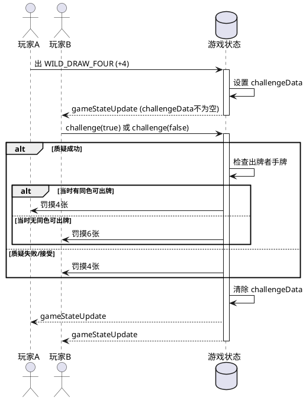
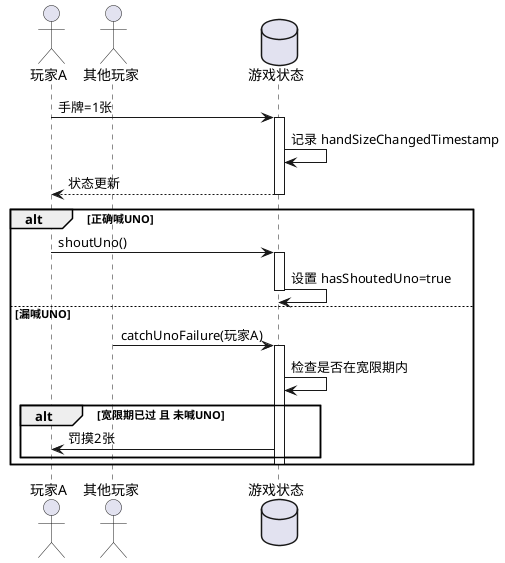
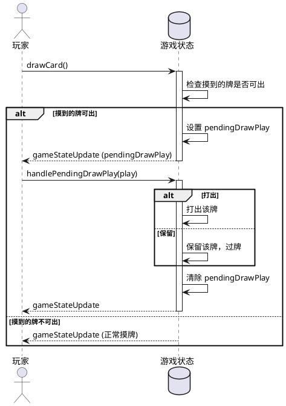
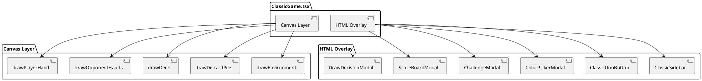
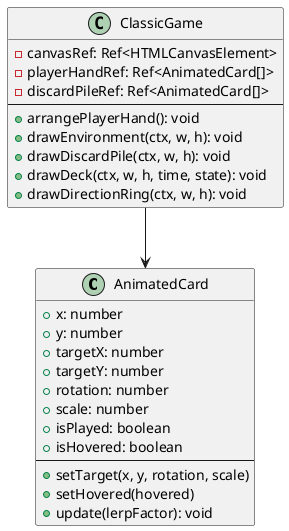
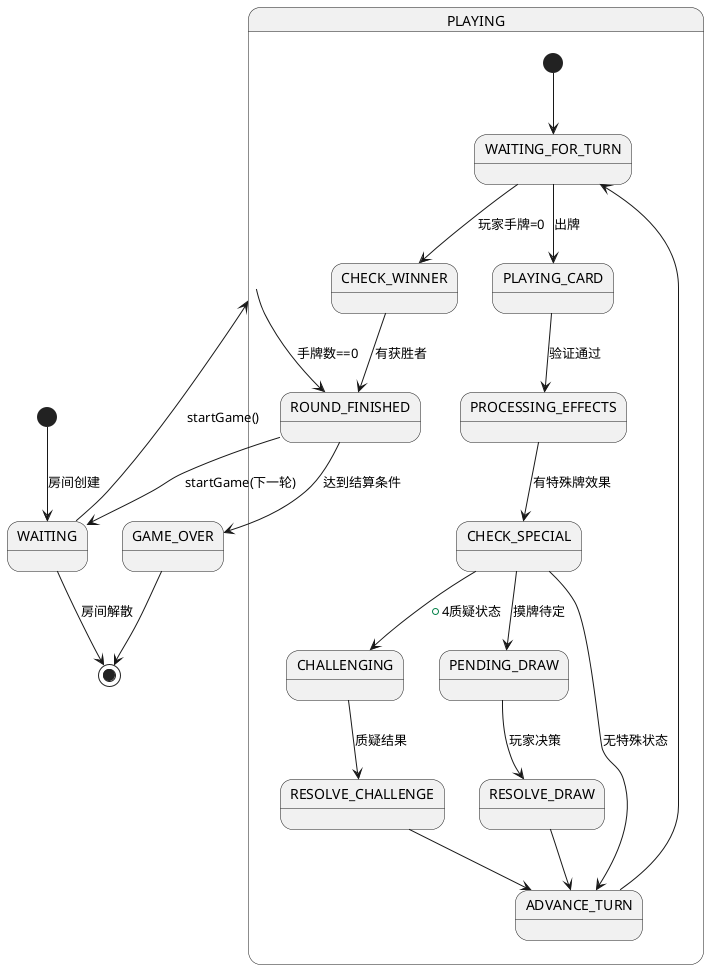

# UNO 游戏前后端状态机架构设计文档

## 一、项目概述

本文档详细描述 UNO 游戏的前后端状态机架构，包括所有状态、事件、数据结构和业务逻辑。

### 1.1 技术栈

| 层级 | 技术 | 说明 |
|------|------|------|
| 后端 | NestJS + Socket.IO | 游戏逻辑权威实现 |
| 前端 | Next.js + React + Zustand | 状态管理与渲染 |
| 通信 | Socket.IO (HTTP Polling) | 实时双向通信 |

### 1.2 架构原则

```
┌───────────────────────────────────────────────────────────────────────────┐
│                         后端权威架构                                    │
│                                                                    │
│  前端 ──发送意图──▶  后端 ──校验执行──▶  广播状态 ──▶  前端渲染   │
│   (仅展示)           (权威)           (脱敏)              (仅展示)    │
└───────────────────────────────────────────────────────────────────────────┘
```

---

## 二、核心状态定义

### 2.1 游戏状态枚举 (GameStatus)

```typescript
enum GameStatus {
  WAITING = 'WAITING',           // 等待中 - 玩家可加入/退出
  PLAYING = 'PLAYING',           // 游戏中 - 回合进行中
  ROUND_FINISHED = 'ROUND_FINISHED',  // 回合结束
  GAME_OVER = 'GAME_OVER',       // 游戏结束
}
```

### 2.2 状态流转图

```
┌───────────────┐    startGame()    ┌───────────────┐
│   WAITING    │ ───────────────▶ │   PLAYING     │
│   (等待中)   │                  │   (游戏中)    │
└───────┬───────┘                  └───────┬───────┘
        │                                    │
        │                                    │ 手牌数 == 0
        │                                    ▼
        │                          ┌───────────────┐
        │                          │ROUND_FINISHED │
        │                          │ (回合结束)    │
        │                          └───────┬───────┘
        │                                  │
        │    达到结算条件                   │ 达到结算条件
        │    (maxScore/maxRounds)          │ (maxScore/maxRounds)
        │                                  ▼
        │                          ┌───────────────┐
        └─────────────────────────│  GAME_OVER    │
                 startGame()      │  (游戏结束)    │
                 (下一轮)         └───────────────┘
```

---

## 三、Socket 事件定义

### 3.1 前端 → 后端事件 (Client → Server)

| 事件名 | 触发时机 | 携带数据 | 后端处理 |
|--------|---------|---------|---------|
| `joinRoom` | 加入房间 | roomId, playerName, config, inviteToken, reconnectToken | 创建/加入房间 |
| `addAi` | 添加 AI | roomId, difficulty | 添加 AI 玩家 |
| `startGame` | 开始游戏 | roomId | 初始化游戏 |
| `playCard` | 出牌 | roomId, cardId, colorSelection | 验证并执行出牌 |
| `drawCard` | 摸牌 | roomId | 执行摸牌 |
| `shoutUno` | 喊 UNO | roomId | 标记已喊 UNO |
| `catchUnoFailure` | 抓漏 | roomId, targetId | 检查并处罚 |
| `challenge` | 质疑 +4 | roomId, accept | 处理质疑结果 |
| `handlePendingDrawPlay` | 摸牌后决策 | roomId, play | 处理打出/保留 |
| `ping` | 心跳 | - | 更新心跳时间戳 |
| `leaveRoom` | 离开房间 | roomId | 移除玩家 |

### 3.2 后端 → 前端事件 (Server → Client)

| 事件名 | 触发时机 | 携带数据 | 前端处理 |
|--------|---------|---------|---------|
| `gameStateUpdate` | 任何状态变化 | 脱敏后的 GameState | 更新 Zustand store |
| `reconnectCredentials` | 玩家加入/重连 | sessionId, reconnectToken | 缓存到 localStorage |
| `playerStatusUpdate` | 玩家连接/断开 | playerId, isConnected | 更新玩家状态 |
| `playerShoutedUno` | 玩家喊 UNO | playerId | 显示通知 |
| `roomClosed` | 房间解散 | roomId, reason | 清理本地状态 |
| `error` | 操作错误 | message | 显示错误通知 |
| `pong` | 心跳响应 | - | 记录连接状态 |

---

## 四、数据结构

### 4.1 GameState (核心状态)

```typescript
interface GameState {
  roomId: string;                    // 房间 ID
  inviteToken?: string;              // 邀请码
  players: Player[];                 // 玩家列表
  spectators: Player[];              // 观众列表
  deck: Card[];                      // 牌堆 (仅服务端，广播时为 undefined)
  discardPile: Card[];               // 弃牌堆
  currentPlayerIndex: number;         // 当前玩家索引
  direction: 1 | -1;                // 方向 (1:顺时针, -1:逆时针)
  status: GameStatus;                // 游戏状态
  winner?: string;                   // 回合胜利者 ID
  gameWinner?: string;               // 游戏胜利者 ID
  currentColor: CardColor;           // 当前颜色 (Wild 用)
  currentType?: CardType;           // 当前卡牌类型
  currentValue?: number;            // 当前卡牌数值
  lastActionTimestamp: number;       // 最后操作时间戳
  pendingDissolveAt?: number;        // 房间待解散时间戳
  currentRound: number;              // 当前回合数
  challengeData?: ChallengeData;     // 质疑数据
  pendingDrawPlay?: PendingDrawPlay; // 摸牌待定数据
  config: GameConfig;                // 游戏配置
}
```

### 4.2 Player (玩家状态)

```typescript
interface Player {
  id: string;                        // Socket ID 或 AI UUID
  name: string;                      // 玩家名称
  sessionId?: string;                 // 会话 ID (仅服务端)
  reconnectToken?: string;           // 重连凭据 (仅服务端)
  type: PlayerType;                  // HUMAN | AI
  difficulty?: AIDifficulty;          // AI 难度 (E/M/H)
  hand: Card[];                      // 手牌 (仅服务端)
  handCount: number;                 // 手牌数 (脱敏后广播)
  score: number;                     // 累计得分
  isReady: boolean;                  // 是否准备
  hasShoutedUno: boolean;             // 是否已喊 UNO
  isMuted: boolean;                  // 静音状态
  isConnected: boolean;               // 在线状态
  lastHeartbeat: number;             // 最后心跳时间
  disconnectedAt?: number;           // 断开时间
  handSizeChangedTimestamp?: number; // 手牌变化时间戳 (用于 UNO 抓漏)
  achievements: Achievement[];       // 成就
  isSpectator: boolean;              // 是否观众
}
```

---

## 五、核心文件映射

### 5.1 后端文件

| 文件路径 | 职责 | 关键导出 |
|---------|------|---------|
| `backend/src/game/types.ts` | 类型定义 | GameStatus, CardColor, CardType, Player, Card, GameState |
| `backend/src/game/game/game.service.ts` | 核心游戏逻辑 | GameService 类 |
| `backend/src/game/game/game.gateway.ts` | Socket 事件处理 | GameGateway 类 |
| `backend/src/game/game/ai.service.ts` | AI 决策逻辑 | AiService 类 |
| `backend/src/game/monitor/game.monitor.service.ts` | 监控与日志 | GameMonitorService 类 |

### 5.2 前端文件

| 文件路径 | 职责 | 关键导出 |
|---------|------|---------|
| `frontend/src/types/game.ts` | 类型定义 | 同后端 |
| `frontend/src/context/GameSocketContext.tsx` | Socket 连接管理 | GameSocketProvider |
| `frontend/src/store/useGameStore.ts` | Zustand 状态管理 | useGameStore |
| `frontend/src/app/page.tsx` | 主页面 | UnoGamePage |
| `frontend/src/components/game/classic/ClassicGame.tsx` | 经典模式渲染 | ClassicGame |

---

## 六、特殊业务逻辑

### 6.1 质疑机制 (+4 专用) - PlantUML 流程图



### 6.2 UNO 抓漏机制 - PlantUML 流程图



### 6.3 摸牌待定机制 - PlantUML 流程图



---

## 七、会话管理与重连

### 7.1 重连凭据流程 - PlantUML 状态图

```plantuml
@startuml
[*] --> 离线

状态 离线: 网络断开
状态 已连接: 正常游戏

离线 -> 已连接: joinRoom(isReconnect=true,\n sessionId, reconnectToken)
activate 已连接
已连接 -> 已连接: 匹配凭据\n恢复玩家状态
deactivate 已连接

已连接 -> 离线: 网络断开
@enduml
```

### 7.2 房间保留窗口 - PlantUML 流程图

```plantml
@startuml
database 服务器

alt 所有人类玩家离线
  服务器 -> 服务器: 设置 pendingDissolveAt\n= now + 60秒
else 任意人类玩家恢复连接
  服务器 -> 服务器: 清除 pendingDissolveAt
else 超时 (60秒)
  服务器 -> 服务器: closeRoom()\n删除房间数据
end
@enduml
```

---

## 八、文件关系图

```
┌─────────────────────────────────────────────────────────────────────────────┐
│                            前端 (React)                                    │
│                                                                          │
│  ┌──────────────────┐              ┌──────────────────┐                │
│  │ Scene3D/Scene2D │              │   HUD/Overlay    │                │
│  │ (渲染卡牌/桌子)  │              │ (游戏信息/控制)   │                │
│  └────────┬─────────┘              └────────┬─────────┘                │
│           │                                   │                          │
│           ▼                                   ▼                          │
│  ┌─────────────────────────────────────────────────────────────┐         │
│  │              GameSocketContext (Socket 连接)               │         │
│  │  - socket: Socket.IO Client                              │         │
│  │  - emit: 发送事件到后端                                   │         │
│  │  - on:  接收后端广播                                     │         │
│  └─────────────────────────┬───────────────────────────────┘         │
│                            │                                          │
│                            ▼                                          │
│  ┌─────────────────────────────────────────────────────────────┐      │
│  │                 useGameStore (Zustand)                      │      │
│  │  - gameState: 当前游戏状态                                 │      │
│  │  - playerId: 玩家 ID                                     │      │
│  │  - notifications: 通知列表                               │      │
│  └─────────────────────────────────────────────────────────────┘      │
│                                                                          │
└─────────────────────────────────────────────────────────────────────────────┘
                                 │ Socket.IO
                                 │ (HTTP Polling)
                                 ▼
┌─────────────────────────────────────────────────────────────────────────────┐
│                            后端 (NestJS)                                   │
│                                                                          │
│  ┌─────────────────────────────────────────────────────────────┐          │
│  │                GameGateway (Socket.IO 网关)               │          │
│  │  - @SubscribeMessage: 事件处理                             │          │
│  │  - broadcastState(): 状态广播                             │          │
│  └─────────────────────────┬───────────────────────────────┘          │
│                            │                                          │
│                            ▼                                          │
│  ┌─────────────────────────────────────────────────────────────┐          │
│  │                   GameService (游戏逻辑)                    │          │
│  │  - games: Map<roomId, GameState>                        │          │
│  │  - 核心方法:                                             │          │
│  │    createGame/joinGame/startGame                         │          │
│  │    playCard/drawCard/shoutUno                          │          │
│  │    processCardEffects/advanceTurn                      │          │
│  │    handleChallenge/handlePendingDrawPlay              │          │
│  └─────────────────────────┬───────────────────────────────┘          │
│                            │                                          │
│           ┌───────────────┴───────────────┐                          │
│           ▼                               ▼                           │
│  ┌──────────────────┐         ┌──────────────────────┐              │
│  │    AiService    │         │ GameMonitorService │              │
│  │  (AI 决策逻辑)   │         │   (监控与日志)     │              │
│  └──────────────────┘         └──────────────────────┘              │
│                                                                          │
└─────────────────────────────────────────────────────────────────────────────┘
```

---

## 九、业务逻辑问题检查

### 9.1 已实现的功能

| 功能 | 状态 | 说明 |
|------|------|------|
| 状态同步 | ✅ | 后端权威，前端仅展示 |
| 敏感信息脱敏 | ✅ | deck 字段隐藏，手牌仅本人可见 |
| 质疑机制 | ✅ | 严格实现 +4 专用质疑 |
| UNO 抓漏 | ✅ | 2 秒宽限期完整实现 |
| 摸牌决策 | ✅ | 摸到可出牌时让玩家选择 |
| AI 决策 | ✅ | E/M/H 三个难度完整实现 |
| 心跳检测 | ✅ | 30 秒间隔，60 秒超时 |
| 房间清理 | ✅ | 60 秒保留窗口，完整清理 |

### 9.2 潜在问题

#### 问题 1: AI 质疑逻辑过于随机

**位置**: `backend/src/game/game/ai.service.ts` 第 224-227 行

```typescript
const shouldChallenge =
  game.challengeData.cardType === CardType.WILD_DRAW_FOUR &&
  Math.random() > 0.5;  // 50% 随机质疑
```

**影响**: AI 玩家质疑决策没有策略性，可能不符合真实玩家行为

**建议**: 根据手牌数量和当前颜色策略性决定是否质疑

#### 问题 2: 自动托管逻辑

**位置**: `backend/src/game/game/game.service.ts` 第 644-663 行

**描述**: 当人类玩家无可出牌时，自动摸一张并可能进入 pendingDrawPlay。如果 AI 玩家在 pendingDrawPlay 状态，会自动选择打出

**影响**: 可能不符合玩家预期

#### 问题 3: 超时处理分支

**描述**: `startGlobalTimer` 每秒检查，但 `turnTimeout` 是 15 秒。当 `challengeData` 或 `pendingDrawPlay` 存在时，超时处理不同

**影响**: 质疑阶段超时默认不质疑；摸牌待定超时默认不打

#### 问题 4: 前端无法知道剩余牌数

**描述**: 服务端在 broadcastState 时总是设置 `deck: undefined`

**影响**: 前端无法显示剩余牌数信息

---

## 十、前端状态管理

### 10.1 Zustand Store 结构

```typescript
interface GameStore {
  // 游戏状态
  gameState: GameState | null;
  playerId: string | null;
  roomId: string | null;

  // 连接状态
  isConnected: boolean;
  isReconnecting: boolean;

  // UI 状态
  notifications: Notification[];

  // 会话
  sessionId?: string;
  reconnectToken?: string;
  inviteToken?: string;

  // 方法
  setGameState: (state: GameState) => void;
  // ... 其他方法
}
```

### 10.2 Socket 连接管理

```typescript
// GameSocketContext 核心逻辑
const socket = io(SERVER_URL, {
  transports: ['polling'],
  forceNew: true,
});

// 监听后端广播
socket.on('gameStateUpdate', (state) => {
  store.setGameState(state);
});

// 发送玩家意图
socket.emit('playCard', { roomId, cardId, colorSelection });
```

---

## 十一、经典模式特殊设计

### 11.1 Canvas 渲染架构 - PlantUML 组件图



### 11.2 动画系统 - PlantUML 类图



---

## 十二、测试覆盖

### 12.1 测试文件

| 文件 | 用途 |
|------|------|
| `test/classic-mode-test.js` | 经典模式 6 轮自动化测试 |
| `test/auto-play-test.js` | 4 人自动对战测试 |
| `test/ai-test.js` | AI 行为测试 |
| `test/reconnect-test.js` | 重连流程测试 |

### 12.2 测试配置

```javascript
const ROUNDS = 6;           // 测试轮数
const THINK_TIME = 50;       // 思考时间(ms)
const AI_WAIT_TIME = 1600;  // 等待 AI 自动出牌(ms)
```

---

## 附录: 常量配置

### 后端配置 (GameConfig)

```typescript
const GameConfig = {
  // 游戏设置
  defaultDeckCount: 1,        // 默认牌组数
  defaultMaxRounds: 6,        // 默认最大回合数
  defaultMaxScore: 500,       // 默认最大分数
  defaultPlayerLimit: 4,      // 默认玩家上限

  // 超时设置
  turnTimeout: 15000,         // 回合超时 (15秒)
  disconnectGraceSeconds: 60, // 离线保留窗口 (60秒)
  unoGracePeriod: 2000,      // UNO 抓漏宽限期 (2秒)
  heartbeatInterval: 30000,  // 心跳间隔 (30秒)

  // AI 设置
  aiThinkDelay: 1500,        // AI 思考延迟 (1.5秒)
  aiEasyChance: 0.3,         // Easy AI 出牌概率
  aiMediumChance: 0.6,      // Medium AI 出牌概率
};
```

---

## 游戏状态完整流转图 - PlantUML 状态图



---

*本文档最后更新: 2026-02-20*
