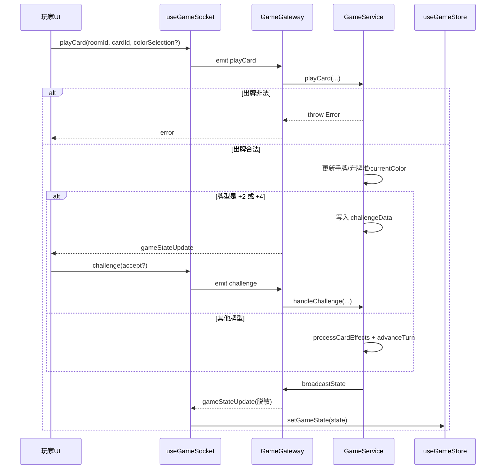
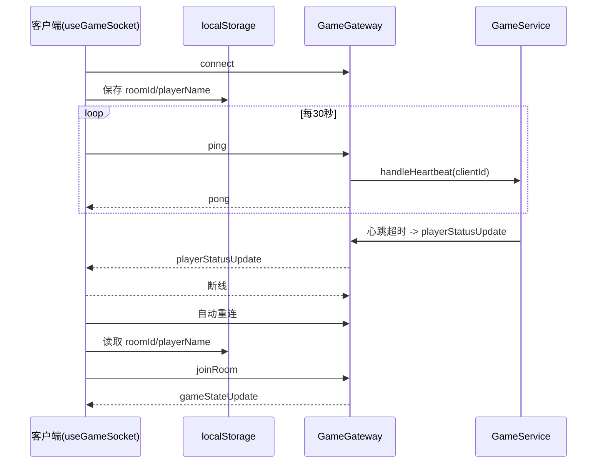
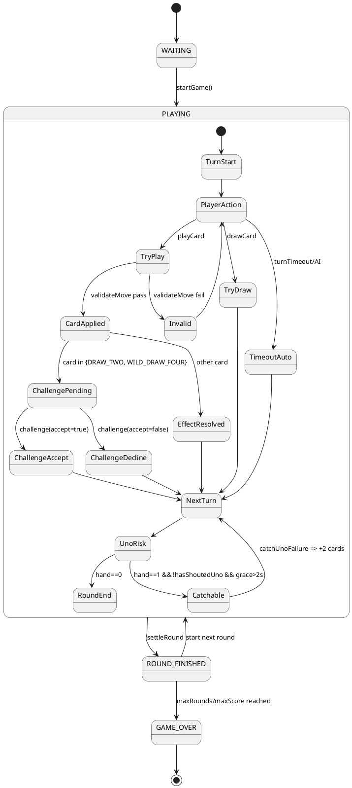

# UNO 规则与本项目实现映射文档（后端权威 + 前端展示）

作者：Shyu
日期：2026-02-17

> 文档入口：请先阅读 [README.md](README.md) 与 [documentation-governance.md](documentation-governance.md)。

---

## 1. 文档目标

本文将“UNO 常见官方规则”与当前仓库实现进行逐项对应，明确：

1. 每条规则的业务流程。
2. 流程涉及的前端模块、后端模块、Socket 事件、状态字段。
3. 与常见官方口径存在的差异（仅 UNO 抓漏窗口 2 秒，其他完全遵循官方规则）。

本项目采用“后端权威裁决，前端仅展示与提交意图”的架构：

- 后端：统一负责规则、合法性、计时、AI、结算。
- 前端：通过 Socket 发送动作请求，接收脱敏后的 `gameStateUpdate` 并渲染。

---

## 2. 外部规则检索基线（联网）

本次规则对照参考：

1. https://www.officialgamerules.org/card-games/uno  
2. https://en.wikipedia.org/w/api.php?action=query&prop=extracts&explaintext=1&titles=Uno_(card_game)&format=json

提炼出的基线规则：

1. 初始发牌 7 张，弃牌堆首张通常要求数字牌。
2. 可出牌条件：同色、同数字（数字牌）、同符号（功能牌）或万能牌。
3. `WILD_DRAW_FOUR` 只在“手中无当前颜色牌”时合法，可被下家质疑。
4. 玩家手牌剩 1 张需喊 UNO；被抓漏通常罚摸 2 张。
5. 回合结束计分：数字按面值、`SKIP/REVERSE/DRAW_TWO`=20、`WILD/WILD_DRAW_FOUR`=50。
6. 堆叠抽牌通常不属于标准规则。

---

## 3. 项目总体架构与规则执行边界

### 3.1 文本框图（系统边界）

```text
┌─────────────────────────────────────────────────────────────────────────────┐
│                            UNO 规则执行总体链路                             │
├─────────────────────────────────────────────────────────────────────────────┤
│ [前端展示层]                                                                 │
│  page.tsx + Scene3D.tsx + HUD.tsx + GameSocketContext.tsx                   │
│   ├─ 用户点击：出牌/摸牌/UNO/抓漏/质疑                                      │
│   └─ emit 事件到后端                                                         │
├─────────────────────────────────────────────────────────────────────────────┤
│ [后端接入层]                                                                 │
│  game.gateway.ts                                                             │
│   ├─ @SubscribeMessage 接事件                                                │
│   ├─ 调用 GameService                                                        │
│   └─ broadcastState(按连接个性化脱敏广播)                                   │
├─────────────────────────────────────────────────────────────────────────────┤
│ [后端规则引擎层（权威）]                                                     │
│  game.service.ts                                                             │
│   ├─ validateMove / playCard / drawCard                                     │
│   ├─ processCardEffects / advanceTurn                                       │
│   ├─ handleChallenge / handlePendingDrawPlay                                │
│   ├─ shoutUno / catchUnoFailure                                              │
│   └─ settleRound / startGlobalTimer / executeAiTurn                          │
├─────────────────────────────────────────────────────────────────────────────┤
│ [前端状态层]                                                                 │
│  useGameStore.ts                                                             │
│   └─ 仅接收 gameStateUpdate 后 setGameState                                  │
└─────────────────────────────────────────────────────────────────────────────┘
```

### 3.2 关键文件清单

- 后端规则核心：backend/src/game/game/game.service.ts
- 后端事件入口：backend/src/game/game/game.gateway.ts
- 后端类型契约：backend/src/game/types.ts
- 前端 Socket 封装：frontend/src/context/GameSocketContext.tsx
- 前端状态仓库：frontend/src/store/useGameStore.ts
- 前端交互入口：frontend/src/app/page.tsx
- 前端 3D 规则提示：frontend/src/components/game/Scene3D.tsx
- 前端 HUD/抓漏：frontend/src/components/game/HUD.tsx
- 前端类型契约：frontend/src/types/game.ts

---

## 4. 规则-模块逐项映射（非常具体）

## 4.1 组局、开局、发牌规则

### 规则流程

1. 玩家进入房间。
2. 可添加 AI。
3. 开始游戏后发 7 张。
4. 翻首张弃牌，若不是数字牌则重置直到数字牌。

### 后端对应

- `joinGame(roomId, playerId, playerName)`：房间加入/重连复用。
- `addAiPlayer(roomId, difficulty)`：添加 AI。
- `startGame(roomId)`：
  - 重建牌堆
  - 每人 7 张
  - 首牌过滤为数字牌
  - 更新 `currentColor/currentType/currentValue`

### 前端对应

- `joinRoom` / `addAi` / `startGame` 事件发送：useGameSocket。
- 页面按钮入口：page.tsx。

### 事件关系

- C -> S：`joinRoom`、`addAi`、`startGame`
- S -> C：`gameStateUpdate`

---

## 4.2 出牌合法性规则（同色/同值/同类型/万能）

### 规则流程

1. 当前玩家请求出牌。
2. 服务端做四段验证：
   - 游戏状态必须 `PLAYING`
   - 必须是当前玩家回合
   - 玩家必须持有该牌
   - 该牌必须满足合法匹配
3. 验证通过才落盘并推进后续效果。

### 后端对应

- `playCard(roomId, playerId, cardId, colorSelection?)`
- `validateMove(game, card)`

合法判定细则：

1. `WILD` 与 `WILD_DRAW_FOUR` 直接可出。
2. 颜色匹配 `card.color === game.currentColor`。
3. 数字牌按 `value` 匹配。
4. 功能牌按 `type` 匹配。

### 前端对应

- Scene3D 的 `isCardPlayable` 仅做“可点击提示”，非最终裁决。
- 真正生效以服务端 `validateMove` 为准。

---

## 4.3 功能牌效果规则（SKIP/REVERSE/DRAW_TWO/WILD/WILD_DRAW_FOUR）

### 规则流程

1. 出牌成功后更新弃牌堆与当前颜色。
2. 根据牌型执行特效：
   - `SKIP`：跳过下一位。
   - `REVERSE`：方向反转；双人局等效跳过。
   - `DRAW_TWO`：下一位摸 2。
   - `WILD`：选择新颜色。
   - `WILD_DRAW_FOUR`：选择新颜色并触发抽牌压力。

### 后端对应

- `processCardEffects(game, card)`
- `advanceTurn(game)`
- `playCard()` 内对 `currentColor` 的赋值逻辑。

### 前端对应

- page.tsx：万能牌颜色选择弹窗。
- HUD：颜色与方向指示。

---

## 4.4 质疑规则（官方规则：仅 +4）

### 规则流程

1. 出 `WILD_DRAW_FOUR` (+4) 后，不立即结算抽牌。
2. 服务端挂起 `challengeData`，将下家设为可决策者。
3. 下家可以：
   - 接受（不质疑）
   - 发起质疑
4. 服务端根据 `hadLegalColor` 证据字段结算处罚。

### 后端对应

- `playCard()`：仅 +4 写入 `game.challengeData`，+2 直接执行效果。
- `handleChallenge(roomId, challengerId, accept)`：执行质疑结算。

### 前端对应

- page.tsx：显示质疑弹窗（`showChallenge`）。
- useGameSocket：发送 `challenge`。

### 与常见官方口径差异

无差异。本项目严格按照官方规则，仅允许对 `WILD_DRAW_FOUR` (+4) 进行质疑。

---

## 4.5 摸牌与“摸到可出牌”决策规则

### 规则流程（本项目）

1. 正常点击摸牌：`drawCard`，摸 1 后直接 `advanceTurn`。
2. 在 `advanceTurn` 中，如果下家无可出牌：
   - 服务端自动摸 1 张。
   - 若摸到可出，设置 `pendingDrawPlay`，等待该玩家决定“打出/保留”。
   - 若仍不可出，继续跳到下一位。

### 后端对应

- `drawCard(roomId, playerId)`
- `advanceTurn(game)`（自动摸牌与挂起逻辑）
- `handlePendingDrawPlay(roomId, playerId, play)`

### 前端对应

- page.tsx：`showPendingDrawPlay` 模态框。
- useGameSocket：发送 `handlePendingDrawPlay`。

### 与常见官方口径差异

标准口径常见为“摸到可出可立即打”；本项目把“是否立即打出”集中到 `pendingDrawPlay` 分支中实现。

---

## 4.6 UNO 宣告与抓漏处罚规则

### 规则流程（本项目）

1. 玩家手牌降到 1 时进入可抓漏风险窗口。
2. 玩家可 `shoutUno` 解除风险。
3. 其他玩家可 `catchUnoFailure` 抓漏。
4. 服务端判定条件：
   - 目标手牌为 1
   - 未喊 UNO
   - 超过 `2s` 宽限
5. 满足则罚摸 2。

### 后端对应

- `shoutUno(roomId, playerId)`
- `catchUnoFailure(roomId, targetId)`
- 使用 `handSizeChangedTimestamp` + `gracePeriodPassed` 完成时序判定。

### 前端对应

- page.tsx：UNO 按钮显示与点击。
- HUD.tsx：对 `handCount===1 && !hasShoutedUno` 显示抓漏入口。

### 与常见官方口径差异

常见描述是“下家动作前”；本项目采用固定时间窗（2 秒）以适配线上实时环境。

---

## 4.7 回合结束与计分规则

### 规则流程

1. 某玩家手牌归零触发回合结束。
2. 汇总其他玩家手牌分数。
3. 分数记给回合赢家。
4. 判定是否达到整局结束条件：
   - `maxScore`
   - `maxRounds`

### 后端对应

- `settleRound(game, winnerId)`

计分函数：

$$
S=\sum_{c\in \text{others}} v(c)
$$

其中

$$
v(c)=
\begin{cases}
\text{face value}, & c.type=NUMBER \\
20, & c.type\in\{SKIP,REVERSE,DRAW\_TWO\} \\
50, & c.type\in\{WILD,WILD\_DRAW\_FOUR\}
\end{cases}
$$

### 前端对应

- page.tsx：`ROUND_FINISHED` / `GAME_OVER` 结果弹窗展示。

---

## 4.8 牌堆重洗规则

### 规则流程

1. 摸牌前若牌堆不足。
2. 保留弃牌堆顶牌。
3. 其余弃牌洗入新牌堆。

### 后端对应

- `drawFromDeck(game, count)`
- `reshuffleDiscardPile(game)`

---

## 4.9 计时、AI、心跳规则

### 规则流程

1. 全局定时器每秒扫描房间。
2. 若当前是 AI 且空闲超过约 1.5 秒，触发 AI 行为。
3. 若当前玩家超时（`turnTimeout`），执行自动操作。
4. 检查心跳超时，更新在线状态并广播 `playerStatusUpdate`。

### 后端对应

- `startGlobalTimer()`
- `executeAiTurn(roomId, aiPlayer)`
- `autoPlay(roomId)`
- `checkHeartbeats(game, roomId, now)`

### 前端对应

- useGameSocket：30 秒发送 `ping`。
- 连接恢复：读取 localStorage（roomId/playerName）自动重入房间。

---

## 5. 事件契约与状态字段关系

> 契约主文档：详见 [online-reliability-features.md](online-reliability-features.md) 第 3 节；本节保留“规则映射所需最小矩阵”。

## 5.1 事件契约矩阵

| 方向 | 事件名 | 输入/输出 | 后端处理 | 前端触发/消费 |
|---|---|---|---|---|
| C->S | joinRoom | `{roomId, playerName, isReconnect?, sessionId?, reconnectToken?}` | `joinGame` | page/GameSocketContext |
| C->S | addAi | `{roomId, difficulty}` | `addAiPlayer` | page/GameSocketContext |
| C->S | startGame | `{roomId}` | `startGame` | page/GameSocketContext |
| C->S | playCard | `{roomId, cardId, colorSelection?}` | `playCard` | Scene3D/page/GameSocketContext |
| C->S | drawCard | `{roomId}` | `drawCard` | Scene3D/GameSocketContext |
| C->S | shoutUno | `{roomId}` | `shoutUno` | page/GameSocketContext |
| C->S | catchUnoFailure | `{roomId, targetId}` | `catchUnoFailure` | HUD/page/GameSocketContext |
| C->S | challenge | `{roomId, accept}` | `handleChallenge` | page/GameSocketContext |
| C->S | handlePendingDrawPlay | `{roomId, play}` | `handlePendingDrawPlay` | page/GameSocketContext |
| C->S | ping | none | `handleHeartbeat` | GameSocketContext heartbeat |
| S->C | gameStateUpdate | `GameState(脱敏)` | `broadcastState` | GameSocketContext -> useGameStore |
| S->C | reconnectCredentials | `{roomId, sessionId, reconnectToken}` | `handleJoinRoom` 单播 | GameSocketContext 本地缓存 |
| S->C | playerStatusUpdate | `{playerId,isConnected}` | 心跳超时广播 | 前端可扩展展示 |
| S->C | playerShoutedUno | `{playerId}` | shout 后广播 | 前端可扩展提示 |
| S->C | roomClosed | `{roomId, reason}` | `closeRoom` | GameSocketContext 清理并提示 |
| S->C | error | `string` | 捕获异常 | GameSocketContext 通知层 |

## 5.2 状态字段责任

| 字段 | 权威写入端 | 前端用途 |
|---|---|---|
| `players[].hand` | 后端 | 仅本人可见，非本人被网关抹除 |
| `players[].handCount` | 后端广播阶段 | 对手手牌数量显示 |
| `deck` | 后端内部 | 广播时隐藏，不可依赖 |
| `discardPile` | 后端 | 3D 弃牌堆展示 |
| `currentColor` | 后端 | HUD 颜色指示 |
| `currentPlayerIndex` | 后端 | 回合高亮 |
| `challengeData` | 后端 | 前端质疑弹窗开关 |
| `pendingDrawPlay` | 后端 | 前端“摸到可出牌”弹窗 |

---

## 6. Mermaid 图（时序与模块）

### 6.1 出牌 -> 质疑/结算完整时序



### 6.2 心跳/断线/重连时序



---

## 7. PlantUML 图（状态机）



---

## 8. 实现差异清单（必须知晓）

1. 质疑机制：本项目严格按照官方规则，仅允许对 `WILD_DRAW_FOUR` (+4) 进行质疑；+2 直接生效，不可质疑。
2. 摸牌行为：本项目区分“主动摸牌直接过回合”与“无牌可出时系统自动摸并可二选一”。
3. UNO 抓漏窗口：本项目采用固定 2 秒宽限，而非“下家动作前”的语义窗口。

---

## 9. 变更约束与联动修改清单

若后续修改任何一条规则，至少同步以下位置：

1. 后端规则实现：`backend/src/game/game/game.service.ts`
2. 后端事件入口：`backend/src/game/game/game.gateway.ts`
3. 后端类型：`backend/src/game/types.ts`
4. 前端 Socket 封装：`frontend/src/context/GameSocketContext.tsx`
5. 前端类型：`frontend/src/types/game.ts`
6. 前端交互：`frontend/src/app/page.tsx`、`frontend/src/components/game/HUD.tsx`、`frontend/src/components/game/Scene3D.tsx`
7. 对应测试与文档同步更新。

---

## 10. 一句话总结

当前仓库实现了“后端权威裁决”的 UNO 主流程，核心规则完整，且为了在线实时体验加入了若干工程化改造（+4 质疑、2 秒 UNO 抓漏窗口、`pendingDrawPlay` 挂起决策）。

---

## 11. 深度规则分层模型（L0-L5）

为保证后续所有开发与回归可追踪，本节将 UNO 规则拆成 6 层。

### L0：会话与连接层

1. 建立 Socket 连接。
2. 客户端可自动重连。
3. 客户端通过 `ping` 维持心跳。
4. 服务端超时判定后更新在线状态。

对应模块：

- 前端：`GameSocketContext.tsx`
- 后端：`game.gateway.ts` + `game.service.ts` 的 `handleHeartbeat`/`checkHeartbeats`

### L1：房间与玩家层

1. `joinRoom` 进入房间。
2. 同名玩家可复连复用。
3. 房间人数上限 4。
4. 支持 AI 玩家注入。

### L2：牌组与回合初始层

1. 构建标准 UNO 牌组。
2. 洗牌。
3. 每人发 7 张。
4. 选数字牌作为首弃牌。

### L3：动作合法性层

1. 是否当前回合。
2. 是否持有卡牌。
3. 是否满足匹配规则。
4. 是否处于挑战挂起态。

### L4：效果执行层

1. 普通牌更新状态。
2. 功能牌触发效果。
3. +2/+4 进入挑战分支。
4. 回合推进。

### L5：结算与生命周期层

1. 玩家出完手牌触发回合结算。
2. 按牌型累计得分。
3. 达到轮次或分数阈值结束整局。
4. 僵尸房间回收。

---

## 12. 后端函数级执行说明（逐函数）

本节按函数列出：输入、关键校验、状态副作用、广播副作用。

### 12.1 `createGame(roomId, config?)`

- 输入：`roomId`，可选配置。
- 关键逻辑：初始化 `GameState`、生成牌堆、设置状态 `WAITING`。
- 状态副作用：向 `games` Map 注册。
- 广播副作用：无（由上层流程触发）。

### 12.2 `joinGame(roomId, playerId, playerName)`

- 输入：房间、玩家标识、昵称。
- 校验：房间满员限制。
- 状态副作用：新增玩家或复连更新连接状态。
- 广播副作用：由 gateway 在成功后广播。

### 12.3 `addAiPlayer(roomId, difficulty)`

- 输入：房间、AI 难度。
- 校验：房间存在、未满员。
- 状态副作用：加入 AI 玩家对象。
- 广播副作用：gateway 广播。

### 12.4 `startGame(roomId)`

- 输入：房间。
- 校验：人数至少 2。
- 状态副作用：发牌、重建牌堆、更新回合状态。
- 广播副作用：gateway 广播。

### 12.5 `playCard(roomId, playerId, cardId, colorSelection?)`

- 输入：出牌指令。
- 校验：状态、回合、持牌、合法匹配、挑战挂起锁。
- 状态副作用：移牌、写弃牌堆、更新当前色、写挑战态或推进回合。
- 广播副作用：由 gateway 统一广播。

### 12.6 `drawCard(roomId, playerId)`

- 输入：摸牌指令。
- 校验：状态、当前回合。
- 状态副作用：摸 1、推进回合。
- 广播副作用：由 gateway 广播。

### 12.7 `handleChallenge(roomId, challengerId, accept)`

- 输入：质疑动作。
- 校验：必须存在 `challengeData` 且挑战者匹配。
- 状态副作用：根据结果追加罚摸、推进回合、清空挑战态。
- 广播副作用：函数内主动广播。

### 12.8 `handlePendingDrawPlay(roomId, playerId, play)`

- 输入：摸到可出牌后的决策。
- 校验：必须存在 `pendingDrawPlay` 且玩家匹配。
- 状态副作用：打出或保留，清理挂起态并推进。
- 广播副作用：函数内主动广播。

### 12.9 `shoutUno(roomId, playerId)`

- 输入：UNO 宣告。
- 校验：手牌数量限制（<=2）。
- 状态副作用：`hasShoutedUno=true`，清理风险时间戳。
- 广播副作用：gateway 广播并发 `playerShoutedUno`。

### 12.10 `catchUnoFailure(roomId, targetId)`

- 输入：抓漏目标。
- 校验：目标手牌=1、未喊、超宽限时间。
- 状态副作用：目标罚摸 2。
- 广播副作用：函数内触发广播。

### 12.11 `settleRound(game, winnerId)`

- 输入：回合赢家。
- 校验：内部流程，无外部输入校验。
- 状态副作用：累加分数、更新 `ROUND_FINISHED` 或 `GAME_OVER`。
- 广播副作用：由上层流程触发。

---

## 13. 前端交互状态机（页面视角）

### 状态节点

1. `Disconnected`
2. `Connected-NotInRoom`
3. `InRoom-Waiting`
4. `InGame-Playing`
5. `InGame-PendingDrawDecision`
6. `InGame-ChallengeDecision`
7. `RoundFinished`
8. `GameOver`

### 关键迁移

1. `connect` -> 自动尝试恢复房间。
2. `joinRoom` 成功 -> 进入等待态。
3. `startGame` -> 进入对局态。
4. 收到 `pendingDrawPlay` -> 决策态。
5. 收到 `challengeData` 且自己是挑战者 -> 质疑态。
6. 收到结算状态 -> 回合结束/整局结束。

---

## 14. 原子流程清单（A001-A220）

> 用于开发评审、测试编排、回归审计。每条均是可观察动作。

- A001 | 客户端初始化 Socket 配置并启用 websocket 传输。
- A002 | 客户端注册 `connect_error` 监听用于网络诊断。
- A003 | 客户端连接成功后读取本地 `roomId`。
- A004 | 客户端连接成功后读取本地 `playerName`。
- A005 | 若本地信息齐全则自动发起 `joinRoom`。
- A006 | 客户端启动 30 秒心跳定时器。
- A007 | 心跳定时器每次 tick 发送 `ping`。
- A008 | 服务端收到 `ping` 触发 `handleHeartbeat`。
- A009 | 服务端更新匹配玩家 `lastHeartbeat`。
- A010 | 服务端回复 `pong`。
- A011 | 用户输入昵称并点击进入房间。
- A012 | 前端缓存 `uno_room_id` 到 localStorage。
- A013 | 前端缓存 `uno_player_name` 到 localStorage。
- A014 | 前端发送 `joinRoom` 事件。
- A015 | 网关调用 `joinGame`。
- A016 | 服务端若房间不存在则创建新房间。
- A017 | 服务端检查同名玩家复连分支。
- A018 | 服务端检查房间人数上限。
- A019 | 服务端写入新玩家对象。
- A020 | 网关调用 `broadcastState`。
- A021 | 网关遍历房间内连接列表。
- A022 | 网关为每个连接定制可见手牌。
- A023 | 网关隐藏 `deck` 字段。
- A024 | 网关发送 `gameStateUpdate`。
- A025 | 前端收到 `gameStateUpdate` 调用 `setGameState`。
- A026 | 页面根据 `gameState` 切换到对局视图。
- A027 | 用户点击 `+AI`。
- A028 | 前端发送 `addAi`。
- A029 | 网关调用 `addAiPlayer`。
- A030 | 服务端生成 AI 玩家 ID。
- A031 | 服务端写入 AI 难度字段。
- A032 | 服务端广播最新状态。
- A033 | 用户点击 `START GAME`。
- A034 | 前端发送 `startGame`。
- A035 | 网关调用 `startGame`。
- A036 | 服务端校验玩家人数至少 2。
- A037 | 服务端递增回合计数 `currentRound`。
- A038 | 服务端状态改为 `PLAYING`。
- A039 | 服务端重建并洗牌。
- A040 | 服务端给每位玩家发 7 张。
- A041 | 服务端循环抽取首张数字牌作为弃牌顶。
- A042 | 服务端初始化 `currentColor`。
- A043 | 服务端记录 `lastActionTimestamp`。
- A044 | 网关广播开局状态。
- A045 | HUD 显示当前回合玩家。
- A046 | Scene3D 渲染自己的真实手牌。
- A047 | Scene3D 渲染对手背牌数量占位。
- A048 | 用户点击手牌触发 `on3DPlay`。
- A049 | 页面定位该牌对象并判断是否万能牌。
- A050 | 若是万能牌则弹出颜色选择模态框。
- A051 | 若非万能牌直接发送 `playCard`。
- A052 | 网关调用 `playCard`。
- A053 | 服务端校验游戏状态必须 `PLAYING`。
- A054 | 服务端校验当前不在 `challengeData` 等待期。
- A055 | 服务端校验 `playerId` 必须是当前回合玩家。
- A056 | 服务端校验玩家持有目标 `cardId`。
- A057 | 服务端执行 `validateMove`。
- A058 | 校验同色匹配条件。
- A059 | 校验同数字匹配条件。
- A060 | 校验同类型匹配条件。
- A061 | 校验万能牌直接可出条件。
- A062 | 合法则从手牌移除目标牌。
- A063 | 合法则将牌压入弃牌堆。
- A064 | 服务端清理 `pendingDrawPlay`。
- A065 | 服务端维护 UNO 风险时间戳。
- A066 | 服务端更新 `currentColor`。
- A067 | 服务端更新 `currentType`。
- A068 | 服务端更新 `currentValue`。
- A069 | 服务端记录 `PLAY_CARD` 监控事件。
- A070 | 若出牌后手牌为 0 进入结算。
- A071 | 若牌型是 `DRAW_TWO` 则进入挑战挂起分支。
- A072 | 若牌型是 `WILD_DRAW_FOUR` 则进入挑战挂起分支。
- A073 | 写入 `challengeData.challengerId`。
- A074 | 写入 `challengeData.targetId`。
- A075 | 写入 `challengeData.cardType`。
- A076 | 写入挑战证据字段 `hadLegalColor`。
- A077 | 非挑战牌型执行 `processCardEffects`。
- A078 | 执行 `advanceTurn`。
- A079 | 更新时间戳 `lastActionTimestamp`。
- A080 | 网关广播最新状态。
- A081 | 当前玩家点击 `draw` 牌堆。
- A082 | 前端发送 `drawCard`。
- A083 | 网关调用 `drawCard`。
- A084 | 服务端校验必须当前回合。
- A085 | 服务端从牌堆摸 1 张。
- A086 | 服务端清除喊 UNO 标记。
- A087 | 服务端推进到下一回合。
- A088 | 服务端记录 `DRAW_CARD` 监控事件。
- A089 | 网关广播摸牌结果。
- A090 | 进入下一玩家回合显示。
- A091 | `advanceTurn` 计算下家索引。
- A092 | 若下家是人类则检查可出牌集合。
- A093 | 若无可出牌则系统自动摸 1 张。
- A094 | 自动摸到牌后判断是否可出。
- A095 | 若可出则写入 `pendingDrawPlay`。
- A096 | 若不可出则继续 `advanceTurn`。
- A097 | 前端检测 `pendingDrawPlay.playerId===me`。
- A098 | 前端弹出“立即打出/保留”模态框。
- A099 | 玩家选择“立即打出”。
- A100 | 前端发送 `handlePendingDrawPlay(play=true)`。
- A101 | 服务端收到后调用 `playCard` 打出该牌。
- A102 | 玩家选择“保留在手牌”。
- A103 | 前端发送 `handlePendingDrawPlay(play=false)`。
- A104 | 服务端清空 `pendingDrawPlay` 并推进回合。
- A105 | 进入挑战分支时前端显示挑战弹窗。
- A106 | 弹窗标题根据 `cardType` 渲染。
- A107 | 玩家选择“接受”。
- A108 | 前端发送 `challenge(accept=false)`。
- A109 | 服务端按牌型给挑战者摸基础惩罚牌。
- A110 | 服务端推进回合并清理挑战态。
- A111 | 玩家选择“质疑”。
- A112 | 前端发送 `challenge(accept=true)`。
- A113 | 服务端验证 `challengerId` 是否匹配。
- A114 | 服务端若是 +4 且 `hadLegalColor=true` 判定质疑成功。
- A115 | 质疑成功时出牌者摸 4。
- A116 | 质疑失败时挑战者摸额外惩罚。
- A117 | +2 质疑失败总惩罚为 4。
- A118 | +4 质疑失败总惩罚为 6。
- A119 | 质疑结束后清空 `challengeData`。
- A120 | 服务端广播质疑结算后状态。
- A121 | 玩家手牌剩 2 或 1 时 UNO 按钮可见。
- A122 | 玩家点击 UNO 按钮发送 `shoutUno`。
- A123 | 服务端设置 `hasShoutedUno=true`。
- A124 | 服务端清理 `handSizeChangedTimestamp`。
- A125 | 网关广播状态并额外发送 `playerShoutedUno`。
- A126 | HUD 显示已喊 UNO 标记。
- A127 | 未喊 UNO 玩家被识别为可抓漏目标。
- A128 | 其他玩家点击 `CATCH`。
- A129 | 前端发送 `catchUnoFailure`。
- A130 | 服务端校验目标玩家存在。
- A131 | 服务端校验目标手牌必须为 1。
- A132 | 服务端校验目标未喊 UNO。
- A133 | 服务端校验宽限时间超过 2 秒。
- A134 | 成功抓漏后目标摸 2。
- A135 | 服务端广播抓漏后状态。
- A136 | 玩家出完最后一张牌触发结算。
- A137 | 服务端写入 `winner`。
- A138 | 服务端汇总其他玩家手牌分数。
- A139 | 数字牌按面值计分。
- A140 | `SKIP/REVERSE/DRAW_TWO` 计 20。
- A141 | `WILD/WILD_DRAW_FOUR` 计 50。
- A142 | 服务端将分数累加给回合胜者。
- A143 | 服务端判定是否达到 `maxScore`。
- A144 | 服务端判定是否达到 `maxRounds`。
- A145 | 未结束则状态置为 `ROUND_FINISHED`。
- A146 | 结束则状态置为 `GAME_OVER`。
- A147 | 整局结束时写入 `gameWinner`。
- A148 | 前端弹出回合/整局结算模态框。
- A149 | 玩家点击“下一轮”再次触发 `startGame`。
- A150 | 全局计时器每秒扫描所有房间。
- A151 | 若当前是 AI 且空闲超过 1.5 秒触发 AI 决策。
- A152 | AI 先检查是否在挑战决策态。
- A153 | AI 在挑战态时随机策略选择质疑。
- A154 | AI 在 pendingDraw 态默认尝试打出。
- A155 | AI 常规回合调用 `getBestMove`。
- A156 | AI 回合若仅剩 2 张会自动 `shoutUno`。
- A157 | AI 选择出牌路径调用 `playCard`。
- A158 | AI 选择摸牌路径调用 `drawCard`。
- A159 | AI 行动后广播状态。
- A160 | 人类玩家超时触发自动动作。
- A161 | 若超时时处于挑战态默认不质疑。
- A162 | 若超时时处于 pendingDraw 态默认保留牌。
- A163 | 普通超时走 `autoPlay`。
- A164 | `autoPlay` 优先找第一张可出牌。
- A165 | 找不到可出牌则摸一张。
- A166 | 自动动作结束后广播。
- A167 | 心跳检查遍历人类玩家连接状态。
- A168 | 超过 `heartbeatTimeout` 标记离线。
- A169 | 标记离线后广播 `playerStatusUpdate`。
- A170 | 客户端断线触发 `disconnect` 监听。
- A171 | 客户端断线后停止心跳定时器。
- A172 | 服务器断开时客户端主动重连。
- A173 | 客户端重连成功后再次 joinRoom。
- A174 | 服务端 `handleDisconnect` 写入离线状态。
- A175 | 服务端 `handleHeartbeat` 可恢复在线状态。
- A176 | 广播时仅本人可见 `hand` 详情。
- A177 | 非本人 `hand` 字段被清空。
- A178 | `handCount` 用于展示对手剩余牌数。
- A179 | 广播态隐藏 `deck`，防止前端窥牌。
- A180 | 前端 Scene3D 用背牌渲染对手手牌。
- A181 | 前端 HUD 读取 `currentColor` 渲染色块。
- A182 | 前端 HUD 读取 `currentPlayerIndex` 高亮回合。
- A183 | 前端 HUD 读取 `direction` 渲染反转标记。
- A184 | 前端异常统一通过 `error` 事件提示。
- A185 | 若 `playCard` 非法，网关回传错误文案。
- A186 | 若 `drawCard` 非法，网关回传错误文案。
- A187 | 若 `startGame` 人数不足，网关广播错误。
- A188 | 若 `addAi` 房间满，网关回传错误。
- A189 | 若 `joinRoom` 房间满，网关回传错误。
- A190 | 牌堆不足时触发重洗弃牌逻辑。
- A191 | 重洗时保留弃牌堆顶牌不参与洗牌。
- A192 | 重洗后继续摸牌流程。
- A193 | 牌组生成包含 4 色数字牌。
- A194 | 每色数字 0 仅一张。
- A195 | 每色数字 1-9 各两张。
- A196 | 每色功能牌 `SKIP/REVERSE/DRAW_TWO` 各两张。
- A197 | 万能牌与 +4 各 4 张。
- A198 | 服务端通过洗牌随机化牌序。
- A199 | 监控服务按事件记录行为日志。
- A200 | 监控服务周期打印系统状态。
- A201 | 监控服务检查陈旧房间并回收。
- A202 | 回收房间后从 Map 删除。
- A203 | 页面在 `WAITING` 状态显示开局控制区。
- A204 | 页面在 `PLAYING` 状态显示操作控件。
- A205 | 页面在 `ROUND_FINISHED` 状态显示下一轮按钮。
- A206 | 页面在 `GAME_OVER` 状态显示返回大厅按钮。
- A207 | 页面底部 UNO 按钮按 `hasShoutedUno` 切换视觉。
- A208 | 玩家点击颜色按钮可直接确认万能色。
- A209 | 模态框关闭后清理临时选牌 ID。
- A210 | Socket Hook 卸载时断开连接。
- A211 | Socket Hook 卸载时清理心跳定时器。
- A212 | Store 在收到状态快照后整体替换 `gameState`。
- A213 | Store 独立保存 `playerId/playerName`。
- A214 | 响应式 Hook 更新设备类型。
- A215 | HUD 根据设备类型切换布局。
- A216 | Scene3D 根据设备类型调节相机参数。
- A217 | 对手牌数减少时 Scene3D 即时重排背牌数量。
- A218 | 当前玩家变化时 HUD 文案即时更新。
- A219 | 颜色变化时 HUD 颜色圆点即时更新。
- A220 | 本条链路闭环完成后等待下一动作输入。

---

## 15. 回归测试矩阵（TC001-TC360）

> 约定格式：`前置 | 动作 | 期望`。用于单元、集成、端到端组合。

- TC001 | 前置: 空房间 | 动作: joinRoom(玩家A) | 期望: 创建房间并进入 WAITING。
- TC002 | 前置: WAITING | 动作: joinRoom(玩家B) | 期望: 玩家列表长度=2。
- TC003 | 前置: 满员4人 | 动作: joinRoom(玩家E) | 期望: 返回“房间已满”。
- TC004 | 前置: 满员4人 | 动作: addAi | 期望: 返回“房间已满”。
- TC005 | 前置: 2人 WAITING | 动作: startGame | 期望: status=PLAYING。
- TC006 | 前置: 1人 WAITING | 动作: startGame | 期望: 返回“人数不足”。
- TC007 | 前置: PLAYING | 动作: 检查发牌 | 期望: 每人手牌=7。
- TC008 | 前置: PLAYING | 动作: 检查弃牌顶 | 期望: 首牌 type=NUMBER。
- TC009 | 前置: PLAYING | 动作: 校验 currentColor | 期望: 等于首弃牌颜色。
- TC010 | 前置: PLAYING | 动作: 非当前玩家 playCard | 期望: 返回“不是你的回合”。
- TC011 | 前置: PLAYING | 动作: 当前玩家 play 不存在 cardId | 期望: 返回“未持有该牌”。
- TC012 | 前置: PLAYING | 动作: 当前玩家 play 非法牌 | 期望: 返回“出牌非法”。
- TC013 | 前置: currentColor=RED | 动作: 出 RED 数字牌 | 期望: 合法。
- TC014 | 前置: 顶牌 NUMBER 5 | 动作: 出同 value=5 | 期望: 合法。
- TC015 | 前置: 顶牌 SKIP | 动作: 出任意同 type=SKIP | 期望: 合法。
- TC016 | 前置: 任意 | 动作: 出 WILD | 期望: 合法。
- TC017 | 前置: 任意 | 动作: 出 WILD_DRAW_FOUR | 期望: 合法进入挑战态。
- TC018 | 前置: 出牌后剩1张 | 动作: 不喊UNO | 期望: handSizeChangedTimestamp 被记录。
- TC019 | 前置: 出牌后剩>1张 | 动作: 检查 UNO 标记 | 期望: hasShoutedUno=false。
- TC020 | 前置: 玩家手牌<=2 | 动作: shoutUno | 期望: hasShoutedUno=true。
- TC021 | 前置: 玩家手牌>2 | 动作: shoutUno | 期望: 状态不受影响。
- TC022 | 前置: 目标手牌=1未喊且>2秒 | 动作: catchUnoFailure | 期望: 目标+2。
- TC023 | 前置: 目标手牌=1未喊且<2秒 | 动作: catchUnoFailure | 期望: 不处罚。
- TC024 | 前置: 目标已喊UNO | 动作: catchUnoFailure | 期望: 不处罚。
- TC025 | 前置: 目标手牌!=1 | 动作: catchUnoFailure | 期望: 不处罚。
- TC026 | 前置: 出 SKIP | 动作: processCardEffects | 期望: 多推进1次回合。
- TC027 | 前置: 出 REVERSE(3人) | 动作: processCardEffects | 期望: direction *= -1。
- TC028 | 前置: 出 REVERSE(2人) | 动作: processCardEffects | 期望: 同时跳过对手。
- TC029 | 前置: 出 DRAW_TWO | 动作: processCardEffects | 期望: 下家摸2。
- TC030 | 前置: 出 WILD_DRAW_FOUR | 动作: processCardEffects | 期望: 下家摸4。
- TC031 | 前置: 出 WILD 并选 BLUE | 动作: playCard | 期望: currentColor=BLUE。
- TC032 | 前置: 出 +4 并选 GREEN | 动作: playCard | 期望: currentColor=GREEN。
- TC033 | 前置: 出 +2 | 动作: playCard | 期望: 写 challengeData。
- TC034 | 前置: 出 +4 | 动作: playCard | 期望: 写 challengeData。
- TC035 | 前置: challengeData 存在 | 动作: 其他玩家 playCard | 期望: 返回“正在等待质疑结果”。
- TC036 | 前置: challengeData 为 +4 且 hadLegalColor=true | 动作: challenge(accept=true) | 期望: 质疑成功，出牌者+4。
- TC037 | 前置: challengeData 为 +4 且 hadLegalColor=false | 动作: challenge(accept=true) | 期望: 质疑失败，挑战者+6。
- TC038 | 前置: challengeData 为 +2 | 动作: challenge(accept=true) | 期望: 按实现落入失败分支时挑战者+4。
- TC039 | 前置: challengeData 为 +2 | 动作: challenge(accept=false) | 期望: 挑战者+2并跳过。
- TC040 | 前置: challengeData 为 +4 | 动作: challenge(accept=false) | 期望: 挑战者+4并跳过。
- TC041 | 前置: challengeData 存在 | 动作: 非 challenger 调 challenge | 期望: 无效无状态变更。
- TC042 | 前置: pendingDrawPlay 存在 | 动作: 非目标玩家 handlePendingDrawPlay | 期望: 无效。
- TC043 | 前置: pendingDrawPlay 存在 | 动作: play=true | 期望: 自动调用 playCard 打出该牌。
- TC044 | 前置: pendingDrawPlay 存在 | 动作: play=false | 期望: 保留并推进回合。
- TC045 | 前置: 人类回合无可出牌 | 动作: advanceTurn | 期望: 自动摸1。
- TC046 | 前置: 自动摸到可出牌 | 动作: advanceTurn | 期望: 写 pendingDrawPlay。
- TC047 | 前置: 自动摸到不可出牌 | 动作: advanceTurn | 期望: 再次推进到下一位。
- TC048 | 前置: 牌堆不足 | 动作: drawFromDeck(2) | 期望: 触发重洗。
- TC049 | 前置: 弃牌堆有多张 | 动作: reshuffleDiscardPile | 期望: 保留顶牌。
- TC050 | 前置: 进行中房间 | 动作: getGame(roomId) | 期望: 返回状态并 touch 监控。
- TC051 | 前置: 进行中房间 | 动作: handleDisconnect(player) | 期望: isConnected=false。
- TC052 | 前置: 已断线玩家 | 动作: handleHeartbeat(player) | 期望: isConnected=true。
- TC053 | 前置: 玩家心跳超时 | 动作: checkHeartbeats | 期望: 广播 playerStatusUpdate=false。
- TC054 | 前置: AI 回合且空闲>1.5s | 动作: globalTick | 期望: executeAiTurn。
- TC055 | 前置: 人类回合超时 | 动作: globalTick | 期望: autoPlay。
- TC056 | 前置: 超时且在 challengeData | 动作: globalTick | 期望: 默认不质疑。
- TC057 | 前置: 超时且在 pendingDrawPlay | 动作: globalTick | 期望: 默认保留。
- TC058 | 前置: AI 回合挑战态 | 动作: executeAiTurn | 期望: 发起 challenge 决策。
- TC059 | 前置: AI 回合 pendingDraw | 动作: executeAiTurn | 期望: play=true。
- TC060 | 前置: AI 常规回合 | 动作: executeAiTurn | 期望: 调用 aiService.getBestMove。
- TC061 | 前置: AI hand=2 | 动作: executeAiTurn | 期望: 先 shoutUno 后出牌。
- TC062 | 前置: AI 无可出牌 | 动作: executeAiTurn | 期望: drawCard。
- TC063 | 前置: EASY AI | 动作: getBestMove | 期望: 随机可出牌。
- TC064 | 前置: MEDIUM AI | 动作: getBestMove | 期望: 倾向手中最多颜色。
- TC065 | 前置: HARD AI + 下家手牌<=3 | 动作: getBestMove | 期望: 优先攻击牌。
- TC066 | 前置: HARD AI | 动作: getBestMove | 期望: 无攻击牌则降级 medium。
- TC067 | 前置: 玩家出完最后一张 | 动作: settleRound | 期望: winner 写入。
- TC068 | 前置: 结算时他人有功能牌 | 动作: settleRound | 期望: 20 分计入。
- TC069 | 前置: 结算时他人有万能牌 | 动作: settleRound | 期望: 50 分计入。
- TC070 | 前置: 分数未达上限且轮次未满 | 动作: settleRound | 期望: status=ROUND_FINISHED。
- TC071 | 前置: 分数达到上限 | 动作: settleRound | 期望: status=GAME_OVER。
- TC072 | 前置: 轮次达到上限 | 动作: settleRound | 期望: status=GAME_OVER。
- TC073 | 前置: GAME_OVER | 动作: 校验 gameWinner | 期望: 最高分玩家ID。
- TC074 | 前置: 广播阶段 | 动作: 检查 deck 字段 | 期望: deck=undefined。
- TC075 | 前置: 广播给本人 | 动作: 检查 players[].hand | 期望: 仅本人可见真实手牌。
- TC076 | 前置: 广播给他人 | 动作: 检查 players[].hand | 期望: 为空数组。
- TC077 | 前置: 广播阶段 | 动作: 检查 handCount | 期望: 等于真实 hand.length。
- TC078 | 前置: 前端连接成功 | 动作: 自动 joinRoom | 期望: 使用 localStorage 值。
- TC079 | 前置: 前端断线 | 动作: disconnect 回调 | 期望: 心跳停止。
- TC080 | 前置: 服务器主动断开 | 动作: disconnect(reason='io server disconnect') | 期望: 客户端重连。
- TC081 | 前置: showPendingDrawPlay=true | 动作: 点击“立即打出” | 期望: emit handlePendingDrawPlay(true)。
- TC082 | 前置: showPendingDrawPlay=true | 动作: 点击“保留” | 期望: emit handlePendingDrawPlay(false)。
- TC083 | 前置: showChallenge=true | 动作: 点击“接受” | 期望: emit challenge(false)。
- TC084 | 前置: showChallenge=true | 动作: 点击“质疑” | 期望: emit challenge(true)。
- TC085 | 前置: 出 WILD | 动作: 颜色弹窗选 RED | 期望: emit playCard(colorSelection=RED)。
- TC086 | 前置: 出 +4 | 动作: 颜色弹窗选 YELLOW | 期望: emit playCard(colorSelection=YELLOW)。
- TC087 | 前置: me.hand.length<=2 | 动作: 点击 UNO 按钮 | 期望: emit shoutUno。
- TC088 | 前置: HUD 发现目标可抓漏 | 动作: 点击 CATCH | 期望: emit catchUnoFailure(target)。
- TC089 | 前置: currentColor 改变 | 动作: HUD 渲染 | 期望: 指示圆颜色同步。
- TC090 | 前置: currentPlayerIndex 改变 | 动作: HUD 渲染 | 期望: YOUR TURN 文案同步。
- TC091 | 前置: direction=-1 | 动作: HUD 渲染 | 期望: 显示反向标记。
- TC092 | 前置: Scene3D 渲染他人 | 动作: 查看牌面 | 期望: 仅背牌不泄露信息。
- TC093 | 前置: Scene3D 渲染自己 | 动作: 查看牌面 | 期望: 展示真实牌信息。
- TC094 | 前置: Scene3D 当前非我回合 | 动作: 点击牌 | 期望: 不可出。
- TC095 | 前置: Scene3D 我回合可出牌 | 动作: 点击牌 | 期望: 触发 onPlayCard。
- TC096 | 前置: Scene3D 点击牌堆 | 动作: onDrawCard | 期望: emit drawCard。
- TC097 | 前置: room WAITING | 动作: 点 startGame | 期望: PLAYING。
- TC098 | 前置: room ROUND_FINISHED | 动作: 点 next round | 期望: PLAYING。
- TC099 | 前置: room GAME_OVER | 动作: 点返回大厅 | 期望: 页面刷新/重置。
- TC100 | 前置: error 事件 | 动作: 前端消费 | 期望: message.error 显示。

- TC101 | 前置: 顶牌 RED 7 | 动作: 出 BLUE 7 | 期望: 合法(同值)。
- TC102 | 前置: 顶牌 GREEN SKIP | 动作: 出 RED SKIP | 期望: 合法(同类型)。
- TC103 | 前置: 顶牌 YELLOW 3 | 动作: 出 YELLOW REVERSE | 期望: 合法(同色)。
- TC104 | 前置: 顶牌 BLUE 9 | 动作: 出 GREEN DRAW_TWO | 期望: 非法。
- TC105 | 前置: 顶牌 BLUE 9 | 动作: 出 WILD | 期望: 合法。
- TC106 | 前置: 顶牌 BLUE 9 | 动作: 出 +4 | 期望: 合法并挑战态。
- TC107 | 前置: 出 +4 前手中有 BLUE | 动作: 下家质疑 | 期望: 质疑成功。
- TC108 | 前置: 出 +4 前手中无 BLUE | 动作: 下家质疑 | 期望: 质疑失败。
- TC109 | 前置: 质疑成功分支 | 动作: 状态检查 | 期望: 出牌者 hand +4。
- TC110 | 前置: 质疑失败分支 | 动作: 状态检查 | 期望: 挑战者 hand +6。
- TC111 | 前置: 非挑战者发 challenge | 动作: challenge | 期望: 无效。
- TC112 | 前置: challengeData 空 | 动作: challenge | 期望: 无效。
- TC113 | 前置: pendingDrawPlay 空 | 动作: handlePendingDrawPlay | 期望: 无效。
- TC114 | 前置: 回合非 PLAYING | 动作: playCard | 期望: 无效状态错误。
- TC115 | 前置: 回合非 PLAYING | 动作: drawCard | 期望: 无效状态错误。
- TC116 | 前置: 房间不存在 | 动作: addAi | 期望: 房间不存在错误。
- TC117 | 前置: 房间不存在 | 动作: startGame | 期望: 错误。
- TC118 | 前置: 房间不存在 | 动作: playCard | 期望: 错误。
- TC119 | 前置: 房间不存在 | 动作: drawCard | 期望: 错误。
- TC120 | 前置: 房间不存在 | 动作: catchUnoFailure | 期望: 安全返回。
- TC121 | 前置: 同名玩家重连 | 动作: joinRoom | 期望: 复用玩家实体并更新 socketId。
- TC122 | 前置: 同名玩家重连 | 动作: 广播检查 | 期望: isConnected=true。
- TC123 | 前置: 人类玩家超时 | 动作: autoPlay 分支可出牌 | 期望: 自动出第一张可出牌。
- TC124 | 前置: 人类玩家超时 | 动作: autoPlay 分支不可出牌 | 期望: 自动摸牌。
- TC125 | 前置: AI 玩家超时 | 动作: tick | 期望: executeAiTurn 触发。
- TC126 | 前置: AI 质疑态 | 动作: executeAiTurn | 期望: 调 handleChallenge。
- TC127 | 前置: AI pendingDraw 态 | 动作: executeAiTurn | 期望: 调 handlePendingDrawPlay(true)。
- TC128 | 前置: challengeData+超时 | 动作: tick | 期望: 默认 accept=false。
- TC129 | 前置: pendingDraw+超时 | 动作: tick | 期望: 默认 play=false。
- TC130 | 前置: 两人局出 REVERSE | 动作: processCardEffects | 期望: 等效 skip。
- TC131 | 前置: 三人局出 REVERSE | 动作: processCardEffects | 期望: 只改变方向。
- TC132 | 前置: startGame 后 | 动作: 检查 currentRound | 期望: +1。
- TC133 | 前置: 新局 createGame | 动作: 检查 config | 期望: 默认 turnTimeout=30。
- TC134 | 前置: 自定义 config | 动作: createGame(config) | 期望: 覆盖默认值。
- TC135 | 前置: game deck 长度小于count | 动作: drawFromDeck | 期望: 先重洗后返回 count 张。
- TC136 | 前置: reshuffle 后 | 动作: 检查 discardPile | 期望: 顶牌仍在。
- TC137 | 前置: generateUnoDeck | 动作: 统计卡牌数 | 期望: 108张（当前实现）。
- TC138 | 前置: generateUnoDeck | 动作: 统计 +4 数量 | 期望: 4。
- TC139 | 前置: generateUnoDeck | 动作: 统计 WILD 数量 | 期望: 4。
- TC140 | 前置: generateUnoDeck | 动作: 统计每色 0 | 期望: 各1。
- TC141 | 前置: generateUnoDeck | 动作: 统计每色 1-9 | 期望: 各2。
- TC142 | 前置: generateUnoDeck | 动作: 统计每色 SKIP/REV/+2 | 期望: 各2。
- TC143 | 前置: shoutUno 后 | 动作: 检查 timestamp | 期望: handSizeChangedTimestamp 清空。
- TC144 | 前置: 手牌从2到1 | 动作: playCard | 期望: 写入 timestamp。
- TC145 | 前置: 手牌从1回到2 | 动作: 抓牌 | 期望: hasShoutedUno 复位。
- TC146 | 前置: 抓漏成功后 | 动作: 检查标记 | 期望: hasShoutedUno=false。
- TC147 | 前置: challenge 完成后 | 动作: 检查状态 | 期望: challengeData 清空。
- TC148 | 前置: pendingDraw 决策后 | 动作: 检查状态 | 期望: pendingDrawPlay 清空。
- TC149 | 前置: gateway broadcast | 动作: room 不存在 | 期望: 打 warning 并返回。
- TC150 | 前置: gateway broadcast | 动作: 有多个客户端 | 期望: 每客户端收到个性化状态。

- TC151 | 前置: 客户端连接失败 | 动作: connect_error | 期望: 控制台输出诊断信息。
- TC152 | 前置: 连接断开 | 动作: disconnect | 期望: 停止心跳。
- TC153 | 前置: reconnect 成功 | 动作: connect | 期望: 尝试自动 joinRoom。
- TC154 | 前置: localStorage 缺 roomId | 动作: connect | 期望: 不自动 join。
- TC155 | 前置: localStorage 缺 playerName | 动作: connect | 期望: 不自动 join。
- TC156 | 前置: 手动 joinRoom | 动作: 发送事件 | 期望: setPlayerInfo 写入 socket.id。
- TC157 | 前置: `gameStateUpdate` 到达 | 动作: setGameState | 期望: state 覆盖更新。
- TC158 | 前置: challengeData 指向我 | 动作: 页面渲染 | 期望: challenge modal 打开。
- TC159 | 前置: pendingDrawPlay 指向我 | 动作: 页面渲染 | 期望: pending modal 打开。
- TC160 | 前置: me.hand<=2 | 动作: 页面渲染 | 期望: UNO 按钮显示。
- TC161 | 前置: me.hand>2 | 动作: 页面渲染 | 期望: UNO 按钮隐藏。
- TC162 | 前置: me.hasShoutedUno=true | 动作: 按钮渲染 | 期望: 显示成功样式。
- TC163 | 前置: status=WAITING | 动作: 页面渲染 | 期望: 可见 +AI 按钮。
- TC164 | 前置: status=ROUND_FINISHED | 动作: 页面渲染 | 期望: 可见 NEXT ROUND 按钮。
- TC165 | 前置: status=GAME_OVER | 动作: 页面渲染 | 期望: 可见返回大厅按钮。
- TC166 | 前置: HUD 玩家列表 | 动作: 目标可抓漏 | 期望: 显示 CATCH。
- TC167 | 前置: HUD 玩家列表 | 动作: 目标不可抓漏 | 期望: 不显示 CATCH。
- TC168 | 前置: Scene3D 我的牌 | 动作: 当前不是我回合 | 期望: 卡牌 disabled。
- TC169 | 前置: Scene3D 我的牌 | 动作: 当前是我回合且可出 | 期望: 卡牌 hinted。
- TC170 | 前置: Scene3D 对手牌 | 动作: 检查材质 | 期望: 仅隐藏牌。
- TC171 | 前置: HUD currentColor=RED | 动作: 渲染 | 期望: 红色圆点。
- TC172 | 前置: HUD currentColor=GREEN | 动作: 渲染 | 期望: 绿色圆点。
- TC173 | 前置: HUD currentColor=BLUE | 动作: 渲染 | 期望: 蓝色圆点。
- TC174 | 前置: HUD currentColor=YELLOW | 动作: 渲染 | 期望: 黄色圆点。
- TC175 | 前置: HUD currentColor=WILD | 动作: 渲染 | 期望: 灰色圆点。
- TC176 | 前置: HUD direction=-1 | 动作: 渲染 | 期望: 显示 ↺ 标签。
- TC177 | 前置: 玩家 isConnected=false | 动作: HUD 渲染 | 期望: 置灰。
- TC178 | 前置: AI 玩家 | 动作: HUD 图标渲染 | 期望: Robot 图标。
- TC179 | 前置: HUMAN 玩家 | 动作: HUD 图标渲染 | 期望: User 图标。
- TC180 | 前置: 排行弹窗 | 动作: status=ROUND_FINISHED | 期望: 显示本轮胜者。
- TC181 | 前置: 排行弹窗 | 动作: status=GAME_OVER | 期望: 显示最终结果。
- TC182 | 前置: scoreboard | 动作: 渲染 | 期望: 列出所有玩家分数。
- TC183 | 前置: draw pile 点击 | 动作: onDrawCard | 期望: 触发 drawCard 事件。
- TC184 | 前置: wild color modal | 动作: 取消 | 期望: 不发送 playCard。
- TC185 | 前置: wild color modal | 动作: 选色 | 期望: 发送带 colorSelection 的 playCard。
- TC186 | 前置: pending modal | 动作: 禁止关闭蒙层 | 期望: 必须选择打出或保留。
- TC187 | 前置: challenge modal | 动作: 禁止关闭蒙层 | 期望: 必须接受或质疑。
- TC188 | 前置: 连接断开后恢复 | 动作: joinRoom 自动重入 | 期望: 同房间继续游戏。
- TC189 | 前置: 玩家超时离线 | 动作: 心跳恢复 | 期望: online 状态恢复。
- TC190 | 前置: stale room | 动作: monitor 检测 | 期望: 房间被清理。
- TC191 | 前置: 清理后访问该房间 | 动作: getGame | 期望: undefined。
- TC192 | 前置: 开局后 | 动作: check discardPile length | 期望: 至少1。
- TC193 | 前置: 开局后 | 动作: check deck length | 期望: 108-7*N-1。
- TC194 | 前置: 4人开局 | 动作: check deck length | 期望: 79。
- TC195 | 前置: 3人开局 | 动作: check deck length | 期望: 86。
- TC196 | 前置: 2人开局 | 动作: check deck length | 期望: 93。
- TC197 | 前置: 每次动作后 | 动作: 检查 lastActionTimestamp | 期望: 更新时间。
- TC198 | 前置: playCard 成功 | 动作: logEvent | 期望: 记录 PLAY_CARD。
- TC199 | 前置: drawCard 成功 | 动作: logEvent | 期望: 记录 DRAW_CARD。
- TC200 | 前置: shoutUno 成功 | 动作: logEvent | 期望: 记录 UNO_SHOUTED。

- TC201 | 前置: challenge 成功 | 动作: logEvent | 期望: CHALLENGE_SUCCESS。
- TC202 | 前置: challenge 失败 | 动作: logEvent | 期望: CHALLENGE_FAILURE。
- TC203 | 前置: 抓漏成功 | 动作: logEvent | 期望: UNO_CATCH_SUCCESS。
- TC204 | 前置: AI 行动 | 动作: logEvent | 期望: AI_TURN。
- TC205 | 前置: 超时自动动作 | 动作: logEvent | 期望: AUTO_PLAY_TIMEOUT。
- TC206 | 前置: 开局 | 动作: logEvent | 期望: GAME_STARTED。
- TC207 | 前置: 加人 | 动作: logEvent | 期望: PLAYER_JOINED。
- TC208 | 前置: 加AI | 动作: logEvent | 期望: AI_ADDED。
- TC209 | 前置: 回合结束 | 动作: logEvent | 期望: ROUND_SETTLED。
- TC210 | 前置: 清理房间 | 动作: logEvent | 期望: ROOM_CLEANED_UP。
- TC211 | 前置: gateway addAi 异常 | 动作: 捕获 | 期望: emit error。
- TC212 | 前置: gateway playCard 异常 | 动作: 捕获 | 期望: emit error。
- TC213 | 前置: gateway drawCard 异常 | 动作: 捕获 | 期望: emit error。
- TC214 | 前置: gateway shoutUno 异常 | 动作: 捕获 | 期望: emit error。
- TC215 | 前置: gateway catchUnoFailure 异常 | 动作: 捕获 | 期望: emit error。
- TC216 | 前置: gateway challenge 异常 | 动作: 捕获 | 期望: emit error。
- TC217 | 前置: gateway pending 异常 | 动作: 捕获 | 期望: emit error。
- TC218 | 前置: useGameSocket unmount | 动作: cleanup | 期望: socket.disconnect。
- TC219 | 前置: useGameSocket unmount | 动作: cleanup | 期望: heartbeat clearInterval。
- TC220 | 前置: 游戏状态广播 | 动作: 客户端 setGameState | 期望: UI 同步。
- TC221 | 前置: 轮次结束弹窗 | 动作: 点击下一轮 | 期望: emit startGame。
- TC222 | 前置: 游戏结束弹窗 | 动作: 点击返回大厅 | 期望: 页面 reload。
- TC223 | 前置: 两人局出 SKIP | 动作: 观察回合 | 期望: 出牌者再次行动。
- TC224 | 前置: 两人局出 REVERSE | 动作: 观察回合 | 期望: 出牌者再次行动。
- TC225 | 前置: +2 后不质疑 | 动作: 回合推进 | 期望: 受害者跳过。
- TC226 | 前置: +4 后不质疑 | 动作: 回合推进 | 期望: 受害者跳过。
- TC227 | 前置: +2 质疑失败 | 动作: 回合推进 | 期望: 质疑者跳过。
- TC228 | 前置: +4 质疑失败 | 动作: 回合推进 | 期望: 质疑者跳过。
- TC229 | 前置: +4 质疑成功 | 动作: 回合推进 | 期望: 挑战者不受罚且继续正常流。
- TC230 | 前置: pendingDraw 保留 | 动作: 回合推进 | 期望: 进入下一位。
- TC231 | 前置: pendingDraw 打出 | 动作: 观察流程 | 期望: 按普通出牌继续。
- TC232 | 前置: AI HARD | 动作: 下家手牌=2 | 期望: 优先出攻击牌。
- TC233 | 前置: AI MEDIUM | 动作: 有多色牌 | 期望: 优先最多颜色。
- TC234 | 前置: AI EASY | 动作: 可出牌多张 | 期望: 随机。
- TC235 | 前置: AI 可出 WILD | 动作: 选色 | 期望: 返回合理颜色。
- TC236 | 前置: 轮次未结束 | 动作: 任何玩家手牌未空 | 期望: 不触发 settleRound。
- TC237 | 前置: 轮次结束 | 动作: winner score 变化 | 期望: 正确累加。
- TC238 | 前置: maxScore=0 | 动作: 多轮进行 | 期望: 仅按 maxRounds 控制。
- TC239 | 前置: maxRounds=0 | 动作: 多轮进行 | 期望: 仅按 maxScore 控制。
- TC240 | 前置: both 0 | 动作: 多轮进行 | 期望: 持续可玩（需外部控制）。
- TC241 | 前置: 客户端 roomId 变更 | 动作: joinRoom 新房间 | 期望: localStorage 更新。
- TC242 | 前置: 客户端 playerName 变更 | 动作: joinRoom | 期望: localStorage 更新。
- TC243 | 前置: 服务器广播个性化 | 动作: 抓包校验 | 期望: 各连接 `players.hand` 不同。
- TC244 | 前置: 服务器广播 | 动作: 抓包校验 | 期望: `deck` 永远不存在。
- TC245 | 前置: gameStateUpdate 高频 | 动作: 前端渲染 | 期望: 无致命卡顿。
- TC246 | 前置: 快速连续点击牌 | 动作: playCard 多次 | 期望: 只有首个合法请求生效。
- TC247 | 前置: 挑战弹窗出现 | 动作: 非挑战者点击无权按钮 | 期望: 无效。
- TC248 | 前置: pending 弹窗出现 | 动作: 非目标玩家无法触发 | 期望: 无效。
- TC249 | 前置: 连续多个房间 | 动作: 监控打印 | 期望: 各房间独立运作。
- TC250 | 前置: 房间 stale | 动作: monitor 清理 | 期望: 释放内存。

- TC251 | 前置: 牌堆耗尽近临界 | 动作: 连续 draw | 期望: 无崩溃，自动重洗。
- TC252 | 前置: 只剩弃牌顶与空牌堆 | 动作: drawFromDeck | 期望: 行为稳定。
- TC253 | 前置: challengeData 时 | 动作: drawCard 请求 | 期望: 按当前回合与状态拒绝。
- TC254 | 前置: challengeData 时 | 动作: shoutUno | 期望: 可执行但不破坏挑战流程。
- TC255 | 前置: pendingDraw 时 | 动作: 其他普通出牌请求 | 期望: 非回合方拒绝。
- TC256 | 前置: 玩家断线再重连 | 动作: 同名 join | 期望: 继续原手牌。
- TC257 | 前置: 玩家断线且超心跳 | 动作: HUD | 期望: 玩家置灰。
- TC258 | 前置: 玩家恢复心跳 | 动作: HUD | 期望: 置灰解除。
- TC259 | 前置: 游戏中新增AI | 动作: addAi | 期望: 当前实现可按规则检查房间容量。
- TC260 | 前置: 刚结束一轮 | 动作: startGame | 期望: 重新发牌并保留累计分。
- TC261 | 前置: GAME_OVER | 动作: 再次 startGame | 期望: 依据产品策略处理（可禁用/重开）。
- TC262 | 前置: 大量错误事件 | 动作: 前端 message | 期望: 用户可见但不中断连接。
- TC263 | 前置: 多客户端同房 | 动作: 同步观察回合 | 期望: currentPlayerIndex 一致。
- TC264 | 前置: 多客户端同房 | 动作: 同步观察颜色 | 期望: currentColor 一致。
- TC265 | 前置: 多客户端同房 | 动作: 同步观察方向 | 期望: direction 一致。
- TC266 | 前置: 多客户端同房 | 动作: 比较他人手牌明文 | 期望: 不可见。
- TC267 | 前置: 本人客户端 | 动作: 查看自身手牌 | 期望: 可见。
- TC268 | 前置: 页面对局中刷新 | 动作: 自动恢复 | 期望: 通过本地存储自动回房。
- TC269 | 前置: 断网恢复 | 动作: 自动重连 | 期望: 游戏继续。
- TC270 | 前置: 网络抖动 | 动作: 重连次数 | 期望: 不超过配置上限。
- TC271 | 前置: reconnectAttempts 达上限 | 动作: 观察状态 | 期望: 保持断线并可手动刷新。
- TC272 | 前置: showChallenge | 动作: 选择接受 | 期望: challenge(false)。
- TC273 | 前置: showChallenge | 动作: 选择质疑 | 期望: challenge(true)。
- TC274 | 前置: showPending | 动作: 选择打出 | 期望: pending(true)。
- TC275 | 前置: showPending | 动作: 选择保留 | 期望: pending(false)。
- TC276 | 前置: UNO 按钮可见 | 动作: 连点 UNO | 期望: 幂等，不影响游戏正确性。
- TC277 | 前置: CATCH 按钮可见 | 动作: 连点 CATCH | 期望: 首次成功后其余无效。
- TC278 | 前置: 回合推进临界 | 动作: 连续 Reverse/Skip | 期望: 索引计算正确。
- TC279 | 前置: 方向反转后 | 动作: 校验 next index | 期望: 按 direction 生效。
- TC280 | 前置: 当前玩家出牌后 | 动作: currentPlayerIndex 更新 | 期望: 正确落到下一位。
- TC281 | 前置: 回合结束 | 动作: winner 字段 | 期望: 非空且正确。
- TC282 | 前置: GAME_OVER | 动作: gameWinner 字段 | 期望: 非空且正确。
- TC283 | 前置: 监控 stale 清理 | 动作: 广播该房间 | 期望: 打 warning。
- TC284 | 前置: 读取不存在房间 | 动作: getGame | 期望: undefined。
- TC285 | 前置: 加入后未开局 | 动作: playCard | 期望: 无效状态错误。
- TC286 | 前置: 加入后未开局 | 动作: drawCard | 期望: 无效状态错误。
- TC287 | 前置: 观战者扩展场景 | 动作: 广播 | 期望: 可增量兼容（当前未启用）。
- TC288 | 前置: 心跳正常 | 动作: checkHeartbeats | 期望: 不误判离线。
- TC289 | 前置: 心跳超时边界 | 动作: checkHeartbeats | 期望: 阈值后判离线。
- TC290 | 前置: 数据一致性 | 动作: 前后端类型对比 | 期望: GameState 关键字段一致。
- TC291 | 前置: 挑战流程结束 | 动作: 检查 currentColor | 期望: 保持为出牌者选择色。
- TC292 | 前置: +4 质疑失败 | 动作: 检查挑战者跳过 | 期望: 生效。
- TC293 | 前置: +4 质疑成功 | 动作: 检查目标罚摸 | 期望: 生效。
- TC294 | 前置: +2 接受 | 动作: 检查挑战者摸2 | 期望: 生效。
- TC295 | 前置: +2 质疑失败 | 动作: 检查挑战者摸4 | 期望: 生效。
- TC296 | 前置: 触发 autoPlay | 动作: 观察广播 | 期望: 有 gameStateUpdate。
- TC297 | 前置: 触发 executeAiTurn | 动作: 观察广播 | 期望: 有 gameStateUpdate。
- TC298 | 前置: 触发 catchUnoFailure | 动作: 观察广播 | 期望: 有 gameStateUpdate。
- TC299 | 前置: 触发 challenge | 动作: 观察广播 | 期望: 有 gameStateUpdate。
- TC300 | 前置: 触发 pendingDraw 决策 | 动作: 观察广播 | 期望: 有 gameStateUpdate。

- TC301 | 前置: UI 移动端 | 动作: HUD 渲染 | 期望: 使用紧凑布局。
- TC302 | 前置: UI 桌面端 | 动作: HUD 渲染 | 期望: 左右栏布局。
- TC303 | 前置: UI 平板端 | 动作: HUD 渲染 | 期望: 中间布局适配。
- TC304 | 前置: 玩家数量2 | 动作: Scene3D 布局 | 期望: 仅相对位置0/1。
- TC305 | 前置: 玩家数量3 | 动作: Scene3D 布局 | 期望: 位置映射正确。
- TC306 | 前置: 玩家数量4 | 动作: Scene3D 布局 | 期望: 四方位映射正确。
- TC307 | 前置: 自身手牌很多 | 动作: Scene3D 手牌排布 | 期望: 自动压缩间距。
- TC308 | 前置: 自身手牌很少 | 动作: Scene3D 手牌排布 | 期望: 扇形展开更宽。
- TC309 | 前置: 拍面排序 | 动作: Scene3D sortHand | 期望: 按颜色+类型顺序。
- TC310 | 前置: HUD 对手 handCount=1 | 动作: 渲染 | 期望: 红色警示。
- TC311 | 前置: HUD 对手 handCount>1 | 动作: 渲染 | 期望: 蓝色计数。
- TC312 | 前置: 玩家喊 UNO | 动作: HUD 标签 | 期望: 显示 UNO Tag。
- TC313 | 前置: 玩家离线 | 动作: HUD 卡片 | 期望: grayscale+opacity。
- TC314 | 前置: 当前玩家 | 动作: HUD 卡片 | 期望: 高亮边框。
- TC315 | 前置: 非当前玩家 | 动作: HUD 卡片 | 期望: 常规边框。
- TC316 | 前置: 出牌成功 | 动作: 场景弃牌堆 | 期望: 顶部牌更新。
- TC317 | 前置: 连续出牌 | 动作: 弃牌堆 | 期望: 保留最近多张层叠展示。
- TC318 | 前置: 点击 DRAW 区域 | 动作: onDrawCard | 期望: 正常触发。
- TC319 | 前置: 非我回合点击手牌 | 动作: onPlayCard | 期望: 不触发有效出牌。
- TC320 | 前置: 我回合可出点击手牌 | 动作: onPlayCard | 期望: 触发 emit。
- TC321 | 前置: 前端收到 error | 动作: 提示 | 期望: 可读中文错误。
- TC322 | 前置: 后端抛出异常 | 动作: 网关捕获 | 期望: 不导致服务器崩溃。
- TC323 | 前置: socket 多事件并发 | 动作: 连续 emit | 期望: 服务器按顺序处理。
- TC324 | 前置: 同步广播 | 动作: 多客户端观察 | 期望: 状态一致。
- TC325 | 前置: 回合推进边界 | 动作: index 计算 | 期望: 模运算正确。
- TC326 | 前置: direction=-1 且 index=0 | 动作: advanceTurn | 期望: 回绕到末尾。
- TC327 | 前置: direction=1 且 index=last | 动作: advanceTurn | 期望: 回绕到0。
- TC328 | 前置: 仅AI房间 | 动作: startGame 后等待 | 期望: 自动进行。
- TC329 | 前置: AI vs HUMAN | 动作: 轮流决策 | 期望: 人机都可推进。
- TC330 | 前置: AI 出 +4 | 动作: HUMAN 质疑 | 期望: 按 hadLegalColor 结算。
- TC331 | 前置: HUMAN 出 +4 | 动作: AI 质疑 | 期望: AI 可发起挑战。
- TC332 | 前置: AI 出牌剩1 | 动作: executeAiTurn | 期望: 自动 shoutUno。
- TC333 | 前置: HUMAN 剩1未喊 | 动作: AI/HUMAN 抓漏 | 期望: 可处罚。
- TC334 | 前置: 牌局长时间运行 | 动作: monitor | 期望: 不出现内存暴涨异常。
- TC335 | 前置: 多房间并行 | 动作: tick | 期望: 房间互不干扰。
- TC336 | 前置: 房间 A challengeData | 动作: 房间 B 普通出牌 | 期望: 正常互不影响。
- TC337 | 前置: 房间 A pendingDraw | 动作: 房间 B drawCard | 期望: 正常互不影响。
- TC338 | 前置: 不存在 clientId 广播 | 动作: broadcastState | 期望: 安全跳过。
- TC339 | 前置: 连接数为0 | 动作: broadcastState | 期望: 不抛错。
- TC340 | 前置: 玩家列表变更 | 动作: 广播 | 期望: handCount 重算正确。
- TC341 | 前置: 轮次结束后 | 动作: 开启下一轮 | 期望: 分数保留、手牌重发。
- TC342 | 前置: maxRounds=3 | 动作: 打完第3轮 | 期望: GAME_OVER。
- TC343 | 前置: maxScore=500 | 动作: 分数跨阈值 | 期望: GAME_OVER。
- TC344 | 前置: GAME_OVER | 动作: 检查 winner/gameWinner | 期望: 字段合理。
- TC345 | 前置: 任何动作后 | 动作: 当前颜色显示 | 期望: 与后端一致。
- TC346 | 前置: 任何动作后 | 动作: 当前回合显示 | 期望: 与后端一致。
- TC347 | 前置: 任何动作后 | 动作: 对手牌数显示 | 期望: 与 handCount 一致。
- TC348 | 前置: 任何动作后 | 动作: 自己手牌展示 | 期望: 与后端 hand 一致。
- TC349 | 前置: reconnect 后 | 动作: 手牌恢复 | 期望: 状态连续。
- TC350 | 前置: reconnect 后 | 动作: 回合恢复 | 期望: status 连续。
- TC351 | 前置: reconnect 后 | 动作: pending/challenge 态 | 期望: 可继续决策。
- TC352 | 前置: reconnect 后 | 动作: HUD 高亮 | 期望: 正确显示当前玩家。
- TC353 | 前置: reconnect 后 | 动作: UNO 按钮 | 期望: 根据当前手牌显示。
- TC354 | 前置: reconnect 后 | 动作: 颜色指示 | 期望: 同步当前颜色。
- TC355 | 前置: reconnect 后 | 动作: scoreboard | 期望: 分数一致。
- TC356 | 前置: reconnect 后 | 动作: 对手在线状态 | 期望: 与服务端一致。
- TC357 | 前置: reconnect 后 | 动作: 弃牌堆 | 期望: 顶牌一致。
- TC358 | 前置: reconnect 后 | 动作: 局状态 | 期望: WAITING/PLAYING 等一致。
- TC359 | 前置: reconnect 后 | 动作: 继续出牌 | 期望: 可正常执行。
- TC360 | 前置: 全量回归完成 | 动作: 汇总 | 期望: 无规则回归缺陷。

---

## 16. 异常恢复剧本（ER001-ER280）

> 本节用于线上故障演练，按“触发 -> 定位 -> 恢复 -> 验证”结构。

- ER001 | 触发: 单客户端网络断开 | 定位: 前端 disconnect 日志 | 恢复: 自动重连 | 验证: 收到 gameStateUpdate。
- ER002 | 触发: 全部客户端断网 | 定位: 服务端心跳超时 | 恢复: 网络恢复后重连 | 验证: isConnected 恢复。
- ER003 | 触发: 用户刷新页面 | 定位: 新连接 ID | 恢复: localStorage 自动 join | 验证: 回到原房间。
- ER004 | 触发: 用户误改房间号 | 定位: UI 输入 | 恢复: 重新 join 正确房间 | 验证: 状态正常。
- ER005 | 触发: startGame 人数不足 | 定位: error 事件 | 恢复: 补齐玩家再开局 | 验证: PLAYING。
- ER006 | 触发: 非当前玩家出牌 | 定位: 错误提示 | 恢复: 等待回合轮到自己 | 验证: 可正常出牌。
- ER007 | 触发: cardId 丢失 | 定位: CARD_NOT_FOUND 类错误 | 恢复: 前端刷新状态再操作 | 验证: 操作成功。
- ER008 | 触发: 出牌非法 | 定位: INVALID_CARD 类错误 | 恢复: 选择合法牌 | 验证: 状态推进。
- ER009 | 触发: challengeData 卡死 | 定位: 挂起状态持续 | 恢复: 等待超时默认决策 | 验证: challengeData 清空。
- ER010 | 触发: pendingDraw 卡死 | 定位: 挂起状态持续 | 恢复: 等待超时默认保留 | 验证: pending 清空。
- ER011 | 触发: 心跳停止 | 定位: 客户端定时器 | 恢复: 重新连接 | 验证: pong 恢复。
- ER012 | 触发: 网关广播房间不存在 | 定位: warning 日志 | 恢复: 忽略并清理引用 | 验证: 无异常崩溃。
- ER013 | 触发: stale room 未清理 | 定位: monitor 状态 | 恢复: 等待周期清理 | 验证: Map 中移除。
- ER014 | 触发: AI 长时间不行动 | 定位: lastActionTimestamp | 恢复: 检查 timer/AI 分支 | 验证: AI 回合恢复。
- ER015 | 触发: 人类超时未自动处理 | 定位: tick 日志 | 恢复: 检查 turnTimeout 配置 | 验证: autoPlay 生效。
- ER016 | 触发: +4 质疑结果异常 | 定位: hadLegalColor 证据 | 恢复: 修复挑战判定 | 验证: 成功/失败分支正确。
- ER017 | 触发: +2 质疑争议 | 定位: 规则定义差异 | 恢复: 在文档声明房规 | 验证: 前后端一致。
- ER018 | 触发: UNO 抓漏争议 | 定位: 2秒窗口 | 恢复: UI 呈现提示宽限规则 | 验证: 玩家认知一致。
- ER019 | 触发: 牌堆耗尽异常 | 定位: drawFromDeck | 恢复: 确认 reshuffle 保留顶牌 | 验证: 连续可摸牌。
- ER020 | 触发: 手牌可见性泄露 | 定位: broadcastState | 恢复: 确保非本人 hand=[] | 验证: 抓包不泄露。
- ER021 | 触发: deck 泄露 | 定位: 广播 payload | 恢复: 强制 deck=undefined | 验证: 客户端无 deck。
- ER022 | 触发: 前端状态不同步 | 定位: gameStateUpdate 监听 | 恢复: 检查 setGameState 调用 | 验证: UI 同步。
- ER023 | 触发: 颜色弹窗失效 | 定位: selectedCardId 状态 | 恢复: 重置弹窗状态机 | 验证: wild 可正常出。
- ER024 | 触发: UNO 按钮不显示 | 定位: me.hand.length 条件 | 恢复: 修正显示逻辑 | 验证: <=2 时显示。
- ER025 | 触发: CATCH 按钮不出现 | 定位: targetForCatch 条件 | 恢复: 修正 handCount/hasShoutedUno 判定 | 验证: 正确显示。
- ER026 | 触发: 结算分数错误 | 定位: settleRound | 恢复: 校正牌值映射 | 验证: 样例牌得分正确。
- ER027 | 触发: gameWinner 错误 | 定位: reduce 比较逻辑 | 恢复: 修正排序逻辑 | 验证: 最高分胜。
- ER028 | 触发: 两人局 REVERSE 异常 | 定位: processCardEffects | 恢复: 保留双人额外 advanceTurn | 验证: 等效 skip。
- ER029 | 触发: reconnect 未自动回房 | 定位: localStorage 键 | 恢复: 修正 key 名 | 验证: 连接后自动 join。
- ER030 | 触发: 频繁 reconnect | 定位: reconnect 配置 | 恢复: 调整 delay/backoff | 验证: 稳定连接。

- ER031 | 触发: 房间内玩家显示重复 | 定位: joinGame 同名分支 | 恢复: 复用而非追加 | 验证: players 无重复。
- ER032 | 触发: addAi 后未广播 | 定位: gateway 分支 | 恢复: 补 broadcastState | 验证: UI 立即刷新。
- ER033 | 触发: startGame 后仍 WAITING | 定位: status 写入 | 恢复: 修正赋值 | 验证: PLAYING。
- ER034 | 触发: 首弃牌是行动牌 | 定位: startGame while 逻辑 | 恢复: 强制数字牌首弃 | 验证: 首牌 type NUMBER。
- ER035 | 触发: 非法牌被打出 | 定位: validateMove 漏洞 | 恢复: 补校验分支 | 验证: 非法被拒。
- ER036 | 触发: 当前颜色错误 | 定位: wild 选色逻辑 | 恢复: 以 colorSelection 覆盖 | 验证: HUD 同步。
- ER037 | 触发: drawCard 仍可在挑战态执行 | 定位: 状态机约束 | 恢复: 约束动作入口 | 验证: 挑战优先。
- ER038 | 触发: challenge 后未跳过受害者 | 定位: advanceTurn 调用位置 | 恢复: 修正顺序 | 验证: 回合正确。
- ER039 | 触发: pending 决策后无广播 | 定位: handlePendingDrawPlay | 恢复: 保留 broadcastState | 验证: 客户端更新。
- ER040 | 触发: shoutUno 后被误抓漏 | 定位: timestamp 清理 | 恢复: shout 时清 timestamp | 验证: 不再误罚。
- ER041 | 触发: 抓漏后仍显示 UNO | 定位: hasShoutedUno 复位 | 恢复: catch 成功时置 false | 验证: HUD 标签消失。
- ER042 | 触发: AI 在挑战态乱出牌 | 定位: executeAiTurn 分支 | 恢复: 挑战态优先 return | 验证: 行为正确。
- ER043 | 触发: AI 在 pending 态摸牌 | 定位: 分支顺序 | 恢复: pending 优先 | 验证: 先决策后继续。
- ER044 | 触发: timeout 不生效 | 定位: lastActionTimestamp 更新频率 | 恢复: 每动作更新 | 验证: 超时触发。
- ER045 | 触发: 超时时误执行普通 autoPlay | 定位: 挂起态判断 | 恢复: challenge/pending 优先 | 验证: 默认决策正确。
- ER046 | 触发: playerStatusUpdate 未发出 | 定位: checkHeartbeats 广播条件 | 恢复: 恢复 emit | 验证: 前端收到。
- ER047 | 触发: 心跳恢复不置在线 | 定位: handleHeartbeat | 恢复: 写 isConnected=true | 验证: HUD 解除灰态。
- ER048 | 触发: room 清理误删活跃房间 | 定位: touch 调用频率 | 恢复: getGame 时 touch | 验证: 活跃房间保留。
- ER049 | 触发: 连续结算导致分数翻倍 | 定位: settleRound 重入 | 恢复: 状态门控 | 验证: 仅结算一次。
- ER050 | 触发: gameStateUpdate 顺序乱序 | 定位: 网络时序 | 恢复: 以服务端最新快照覆盖 | 验证: 最终一致。

- ER051 | 触发: 前端 Modal 无法关闭 | 定位: 打开条件计算 | 恢复: 基于 state 控制 | 验证: 条件消失即关闭。
- ER052 | 触发: 页面按钮失焦误触 | 定位: z-index/pointer events | 恢复: 修正层级 | 验证: 交互正常。
- ER053 | 触发: Scene3D 卡顿 | 定位: 帧率与卡牌数量 | 恢复: 降低阴影/材质复杂度 | 验证: FPS 改善。
- ER054 | 触发: HUD 列表溢出 | 定位: 移动端布局 | 恢复: 启用横向滚动 | 验证: 不遮挡。
- ER055 | 触发: 分数弹窗错误显示 | 定位: winner 查找逻辑 | 恢复: 使用 id 映射 | 验证: 胜者正确。
- ER056 | 触发: reconnect 丢失 playerId | 定位: setPlayerInfo 时机 | 恢复: connect 后立即设置 | 验证: 自身识别正确。
- ER057 | 触发: 前端重复发送 joinRoom | 定位: effect 依赖 | 恢复: 控制初始化时机 | 验证: 无重复入房。
- ER058 | 触发: 消息风暴 | 定位: 高频广播 | 恢复: 合理节流策略（必要时） | 验证: 稳定。
- ER059 | 触发: 后端日志过多 | 定位: monitor print 周期 | 恢复: 调整日志级别 | 验证: 可观测且不淹没。
- ER060 | 触发: 断线后玩家被替换成新玩家 | 定位: 同名复连逻辑 | 恢复: 复用玩家实体 | 验证: 手牌不丢。

- ER061 | 触发: 有效出牌后 UI 未更新 | 定位: 广播是否触发 | 恢复: 检查 gateway broadcast 调用 | 验证: 收到更新。
- ER062 | 触发: 抽牌后 UI 未更新 | 定位: drawCard 后 broadcast | 恢复: 补发状态 | 验证: 手牌变化可见。
- ER063 | 触发: shoutUno 未提示 | 定位: playerShoutedUno 事件 | 恢复: 确保 emit 发送 | 验证: 提示出现。
- ER064 | 触发: catchUnoFailure 后 UI 旧状态 | 定位: catch 中 broadcast | 恢复: 调用 broadcastState | 验证: handCount 更新。
- ER065 | 触发: currentColor 与弃牌不一致 | 定位: wild 处理 | 恢复: 优先取 colorSelection | 验证: 一致。
- ER066 | 触发: currentValue 未更新导致提示错 | 定位: playCard 赋值 | 恢复: 同步更新 value/type | 验证: 正确。
- ER067 | 触发: challengeData 丢失 challenger | 定位: 下家索引 | 恢复: 修正索引计算 | 验证: 弹窗给到正确人。
- ER068 | 触发: 下家索引越界 | 定位: 取模计算 | 恢复: +length 再 %length | 验证: 无越界。
- ER069 | 触发: reverse 后 challenge 给错人 | 定位: direction 使用 | 恢复: 统一索引公式 | 验证: 正确。
- ER070 | 触发: 结算后仍可出牌 | 定位: status 校验 | 恢复: play/draw 校验 PLAYING | 验证: 被拒绝。

- ER071 | 触发: 牌堆与弃牌重复牌 | 定位: draw/reshuffle 操作 | 恢复: 确认移动而非拷贝 | 验证: 总牌数守恒。
- ER072 | 触发: shuffle 偏置怀疑 | 定位: Fisher-Yates | 恢复: 保持标准洗牌算法 | 验证: 分布合理。
- ER073 | 触发: 本人手牌被清空显示 | 定位: broadcast clientId 对齐 | 恢复: 使用 socket.id 对比 | 验证: 本人可见。
- ER074 | 触发: 非本人能看到牌 | 定位: personalization 逻辑 | 恢复: 非本人 hand=[] | 验证: 安全。
- ER075 | 触发: AI 名称重复混淆 | 定位: AI id/昵称生成 | 恢复: 加入 UUID 片段 | 验证: 可区分。
- ER076 | 触发: 房间号冲突 | 定位: roomId 管理策略 | 恢复: 交由用户输入+校验 | 验证: 正常。
- ER077 | 触发: 多标签页同用户冲突 | 定位: socket 多连接 | 恢复: 明确同名复连策略 | 验证: 状态可控。
- ER078 | 触发: 浏览器休眠后心跳丢失 | 定位: heartbeat 间隔 | 恢复: 唤醒后立即 ping | 验证: 快速恢复在线。
- ER079 | 触发: 手机后台恢复后错乱 | 定位: reconnect 流程 | 恢复: 强制重新 join | 验证: 状态一致。
- ER080 | 触发: 代理网络切换 | 定位: connect_error 频繁 | 恢复: 退避重连 | 验证: 最终可连。

- ER081 | 触发: challenge UI 文案误导 | 定位: 页面说明文本 | 恢复: 与后端规则一致化 | 验证: 用户理解一致。
- ER082 | 触发: +2 质疑争议反馈 | 定位: 文档缺失 | 恢复: 在 docs 明确房规 | 验证: 无歧义。
- ER083 | 触发: UNO 2秒窗口争议 | 定位: 文档缺失 | 恢复: 在 docs 明确时间窗 | 验证: 无歧义。
- ER084 | 触发: 测试 flaky | 定位: 时间依赖 | 恢复: 使用假时钟/放宽阈值 | 验证: 稳定。
- ER085 | 触发: e2e 偶发失败 | 定位: 重连时序 | 恢复: 增加重试与等待条件 | 验证: 通过率上升。
- ER086 | 触发: CI 运行慢 | 定位: 测试过重 | 恢复: 分层执行 smoke/full | 验证: 总时长下降。
- ER087 | 触发: lint 不通过 | 定位: 类型或格式 | 恢复: 按配置修复 | 验证: lint pass。
- ER088 | 触发: 类型不一致 | 定位: 前后端 types 漂移 | 恢复: 同步更新两端 | 验证: 编译通过。
- ER089 | 触发: Socket 事件名不一致 | 定位: gateway 与 hook | 恢复: 双端统一 | 验证: 功能恢复。
- ER090 | 触发: 客户端误判可出 | 定位: Scene3D 判定 | 恢复: 仅作提示并信任后端 | 验证: 不影响权威结果。

- ER091 | 触发: scoreboard 次序混乱 | 定位: 前端渲染顺序 | 恢复: 可按分数排序展示 | 验证: 易读。
- ER092 | 触发: winner 名称显示空 | 定位: players.find 失败 | 恢复: 加空值兜底 | 验证: 不崩溃。
- ER093 | 触发: Modal 重复弹出 | 定位: 状态切换时序 | 恢复: 加强条件判定 | 验证: 只弹一次。
- ER094 | 触发: 颜色选择后没出牌 | 定位: selectedCardId 丢失 | 恢复: 选色即提交并清理 | 验证: 正常。
- ER095 | 触发: draw pile 误触频繁 | 定位: 点击区域过大 | 恢复: 缩小命中区 | 验证: 误触下降。
- ER096 | 触发: 移动端按钮遮挡 | 定位: 绝对定位 | 恢复: 响应式位移 | 验证: 可操作。
- ER097 | 触发: 字体过小难读 | 定位: HUD 文案样式 | 恢复: 提升字号 | 验证: 可读性提高。
- ER098 | 触发: 对战日志缺失 | 定位: HUD 事件源 | 恢复: 增加状态导出 | 验证: 可回放关键事件。
- ER099 | 触发: roomId 输入非法字符 | 定位: 输入校验 | 恢复: 增加前端限制/后端清洗 | 验证: 安全。
- ER100 | 触发: playerName 注入字符 | 定位: 渲染与日志 | 恢复: 转义与清洗 | 验证: 无注入风险。

- ER101 | 触发: 监控服务抛异常 | 定位: monitor 调用链 | 恢复: try-catch 隔离 | 验证: 主流程不受影响。
- ER102 | 触发: setInterval 漂移 | 定位: Node 定时器 | 恢复: 容忍误差并基于时间戳判定 | 验证: 超时逻辑稳定。
- ER103 | 触发: challengeData 与 pending 同时出现 | 定位: 状态机冲突 | 恢复: 互斥保证 | 验证: 仅一态生效。
- ER104 | 触发: players 数组被意外修改顺序 | 定位: 不可变约束 | 恢复: 谨慎原地操作 | 验证: 回合顺序正确。
- ER105 | 触发: currentPlayerIndex 指向不存在玩家 | 定位: 移除玩家后处理 | 恢复: 修正索引 | 验证: 不越界。
- ER106 | 触发: 异常导致 lastActionTimestamp 过旧 | 定位: action 更新点 | 恢复: 所有成功动作后更新 | 验证: timeout 正常。
- ER107 | 触发: drawCard 未重置 UNO 标记 | 定位: drawCard | 恢复: hasShoutedUno=false | 验证: 规则一致。
- ER108 | 触发: 状态广播丢失一帧 | 定位: 网络不稳定 | 恢复: 依赖后续全量快照 | 验证: 最终一致。
- ER109 | 触发: UI 闪烁 | 定位: 频繁 setState | 恢复: 必要时批处理渲染 | 验证: 体验提升。
- ER110 | 触发: 玩家名称重复误认 | 定位: 业务规则 | 恢复: UI 强调 id 或类型标签 | 验证: 可区分。

- ER111 | 触发: 开局后某玩家手牌非7 | 定位: 发牌循环 | 恢复: 检查 drawFromDeck 返回 | 验证: 全员7。
- ER112 | 触发: 首弃牌循环死循环 | 定位: deck 操作 | 恢复: 保证牌堆含数字牌且洗牌正确 | 验证: 可结束。
- ER113 | 触发: WILD 未选色 | 定位: 前端流程 | 恢复: 默认 RED 或强制选色 | 验证: currentColor 有值。
- ER114 | 触发: +4 未选色 | 定位: 前端流程 | 恢复: 默认 RED 或强制选色 | 验证: currentColor 有值。
- ER115 | 触发: score 溢出疑虑 | 定位: number 精度 | 恢复: 正常 JS 安全范围内 | 验证: 分数可累加。
- ER116 | 触发: maxScore/maxRounds 配置冲突 | 定位: isOver 判断 | 恢复: 按 OR 语义处理 | 验证: 结束条件明确。
- ER117 | 触发: 清理房间后客户端仍在房间页 | 定位: 前端无房间提示 | 恢复: 收到错误后引导重入 | 验证: UX 改善。
- ER118 | 触发: addAi 难度值非法 | 定位: 输入校验 | 恢复: 后端兜底 MEDIUM | 验证: 稳定。
- ER119 | 触发: AI 名称本地化混乱 | 定位: 显示文案 | 恢复: 统一格式机器人(难度) | 验证: 一致。
- ER120 | 触发: 顶牌 value 未定义显示异常 | 定位: 前端卡片渲染 | 恢复: 对非数字牌忽略 value | 验证: 正常显示。

- ER121 | 触发: 对手 handCount 与实际不符 | 定位: broadcast handCount 计算 | 恢复: 每次 map 实时计算 | 验证: 一致。
- ER122 | 触发: reconnect 后 roomId 丢失 | 定位: 本地存储权限 | 恢复: 降级手动输入 | 验证: 可继续。
- ER123 | 触发: 浏览器禁用 localStorage | 定位: try/catch | 恢复: 仅会话内玩法 | 验证: 不崩溃。
- ER124 | 触发: 多语言文案不统一 | 定位: 文案集中管理 | 恢复: 统一简体中文 | 验证: 一致。
- ER125 | 触发: docs 与代码不一致 | 定位: 变更未同步 | 恢复: PR 检查项加文档审计 | 验证: 一致。
- ER126 | 触发: challenge 规则修改未同步前端 | 定位: modal 说明 | 恢复: 更新文案与事件参数 | 验证: 行为一致。
- ER127 | 触发: types 修改未同步 | 定位: 编译报错 | 恢复: 前后端类型同步 | 验证: tsc 通过。
- ER128 | 触发: 事件名拼写错误 | 定位: 无响应 | 恢复: 双端统一字面量 | 验证: 事件恢复。
- ER129 | 触发: 业务改动影响测试脚本 | 定位: test/*.js | 恢复: 更新脚本断言 | 验证: 测试通过。
- ER130 | 触发: stale 清理过快 | 定位: monitor 阈值 | 恢复: 调整超时策略 | 验证: 活跃房间不误删。

- ER131 | 触发: performance 下降 | 定位: 3D + 高频广播 | 恢复: 优化材质与阴影 | 验证: FPS 回升。
- ER132 | 触发: Node CPU 高 | 定位: setInterval + rooms 遍历 | 恢复: 监控房间规模并优化 | 验证: CPU 降低。
- ER133 | 触发: 内存增长 | 定位: 未清理房间/事件监听 | 恢复: 清理 stale + 组件卸载 | 验证: 内存稳定。
- ER134 | 触发: 某房间广播慢 | 定位: 连接数量 | 恢复: 分批广播或优化 payload | 验证: 延迟下降。
- ER135 | 触发: payload 过大 | 定位: 广播字段 | 恢复: 保持脱敏与最小字段 | 验证: 包体合理。
- ER136 | 触发: draw pile 点击无响应 | 定位: Scene3D onClick | 恢复: 检查 pointer events | 验证: 可点击。
- ER137 | 触发: 顶层遮罩挡住3D | 定位: z-index | 恢复: 分层 pointer-events 设置 | 验证: 交互恢复。
- ER138 | 触发: antd Modal 样式冲突 | 定位: CSS 层叠 | 恢复: 局部样式隔离 | 验证: 正常展示。
- ER139 | 触发: tailwind 类冲突 | 定位: class 合并 | 恢复: 使用 cn/twMerge | 验证: 样式正确。
- ER140 | 触发: 生产环境后端地址错误 | 定位: NEXT_PUBLIC_BACKEND_URL | 恢复: 正确配置 env | 验证: 可连。

- ER141 | 触发: 局域网访问失败 | 定位: CORS/origin | 恢复: 放开 origin 回调 | 验证: 局域网可连。
- ER142 | 触发: 凭据跨域失败 | 定位: socket cors credentials | 恢复: 保持 true | 验证: 握手成功。
- ER143 | 触发: 端口冲突 | 定位: 19191 被占用 | 恢复: 修改端口并同步前端 | 验证: 可通信。
- ER144 | 触发: 前端端口变更 | 定位: 11451 非默认 | 恢复: 调整访问地址 | 验证: UI 可用。
- ER145 | 触发: npm 依赖缺失 | 定位: 启动失败 | 恢复: 安装依赖 | 验证: build 通过。
- ER146 | 触发: lint 失败 | 定位: ESLint 报告 | 恢复: 修复格式与规则 | 验证: lint 通过。
- ER147 | 触发: test 失败 | 定位: 失败用例 | 恢复: 对齐规则实现或修用例 | 验证: test 通过。
- ER148 | 触发: e2e 波动 | 定位: 异步等待不足 | 恢复: 增加稳定等待条件 | 验证: 稳定。
- ER149 | 触发: reconnect-test 失败 | 定位: localStorage 流程 | 恢复: 修复恢复逻辑 | 验证: 通过。
- ER150 | 触发: ai-test 失败 | 定位: AI 时序阈值 | 恢复: 与1.5秒逻辑对齐 | 验证: 通过。

- ER151 | 触发: 多人局高并发操作 | 定位: 服务端顺序 | 恢复: 依赖单线程事件循环 + 校验 | 验证: 无状态损坏。
- ER152 | 触发: 操作重放攻击 | 定位: 客户端重复 emit | 恢复: 回合与持牌校验拦截 | 验证: 安全。
- ER153 | 触发: 伪造 roomId | 定位: 输入可信度 | 恢复: 服务端校验房间存在 | 验证: 不越权。
- ER154 | 触发: 伪造 playerName | 定位: join 逻辑 | 恢复: 仅作展示并结合 socketId | 验证: 行为可控。
- ER155 | 触发: 伪造 cardId | 定位: playCard | 恢复: 校验 hand 中存在 | 验证: 拦截成功。
- ER156 | 触发: 伪造挑战请求 | 定位: challenger 校验 | 恢复: 校验 challengerId | 验证: 拦截成功。
- ER157 | 触发: 伪造 pending 请求 | 定位: pending owner 校验 | 恢复: playerId 匹配校验 | 验证: 拦截成功。
- ER158 | 触发: 篡改颜色参数 | 定位: wild 选色 | 恢复: 后端兜底默认色 | 验证: 系统稳定。
- ER159 | 触发: 客户端改 handCount | 定位: 单向权威 | 恢复: 忽略客户端本地改动 | 验证: 服务端覆盖。
- ER160 | 触发: 客户端改 currentPlayerIndex | 定位: 单向权威 | 恢复: 服务端快照覆盖 | 验证: 一致。

- ER161 | 触发: 文档过期 | 定位: 行为已变更 | 恢复: 同步更新 docs 与注释 | 验证: 审阅通过。
- ER162 | 触发: Google 风格注释缺失 | 定位: PR 自检 | 恢复: 补全 Args/Returns/Side Effects | 验证: 合规。
- ER163 | 触发: 注释中文不一致 | 定位: 文档规范 | 恢复: 统一简体中文 | 验证: 合规。
- ER164 | 触发: PlantUML 与代码不一致 | 定位: 设计图更新滞后 | 恢复: 同步状态机图 | 验证: 一致。
- ER165 | 触发: Mermaid 流程图过旧 | 定位: 事件变更 | 恢复: 更新时序图 | 验证: 一致。
- ER166 | 触发: 文档缺少差异说明 | 定位: 规则争议 | 恢复: 增补“官方 vs 项目” | 验证: 清晰。
- ER167 | 触发: 新增事件未登记 | 定位: Socket 协议表 | 恢复: 更新契约矩阵 | 验证: 完整。
- ER168 | 触发: 类型字段新增未登记 | 定位: state 表 | 恢复: 更新字段责任表 | 验证: 完整。
- ER169 | 触发: 监控事件漏记 | 定位: logEvent 覆盖率 | 恢复: 增加关键点日志 | 验证: 可追踪。
- ER170 | 触发: 发布后规则投诉 | 定位: 用户反馈 | 恢复: 回看剧本与日志复盘 | 验证: 复现并修复。

- ER171 | 触发: Round 结束后不能开下一轮 | 定位: page 状态按钮 | 恢复: 放开 ROUND_FINISHED 按钮 | 验证: 可开局。
- ER172 | 触发: GAME_OVER 仍显示下一轮按钮 | 定位: 条件分支 | 恢复: 分离 GAME_OVER 分支 | 验证: 正确按钮。
- ER173 | 触发: 选色后重复提交 | 定位: selectedCardId 清理 | 恢复: 提交后置 null | 验证: 不重复。
- ER174 | 触发: 选择色后 modal 未关 | 定位: setColorModalVisible | 恢复: 成功后关闭 | 验证: 正常。
- ER175 | 触发: 手牌排序异常 | 定位: sortHand 映射 | 恢复: 校正 COLOR_ORDER/TYPE_ORDER | 验证: 顺序稳定。
- ER176 | 触发: 对手牌数量文字错误 | 定位: handCount 渲染 | 恢复: 使用 handCount 字段 | 验证: 正确。
- ER177 | 触发: 当前玩家箭头错位 | 定位: Scene3D billboard 坐标 | 恢复: 调整相对位置 | 验证: 对齐。
- ER178 | 触发: HUD 顶栏遮挡 | 定位: padding top | 恢复: 根据 deviceType 调整 | 验证: 不遮挡。
- ER179 | 触发: UNO 按钮遮挡弹窗 | 定位: z-index | 恢复: 调整层级 | 验证: 弹窗优先。
- ER180 | 触发: 结果弹窗与游戏层冲突 | 定位: modal 配置 | 恢复: closable/mask 策略优化 | 验证: 可操作。

- ER181 | 触发: 客户端状态被旧包覆盖 | 定位: out-of-order | 恢复: 依赖最新广播覆盖策略 | 验证: 最终一致。
- ER182 | 触发: Socket message 丢包疑虑 | 定位: 网络层 | 恢复: 全量快照广播而非增量补丁 | 验证: 恢复一致。
- ER183 | 触发: 玩家切换网络导致多连接 | 定位: sockets in room | 恢复: 以当前 socketId 为准 | 验证: 仅一有效连接。
- ER184 | 触发: 断线后 old socket 残留 | 定位: socket adapter rooms | 恢复: 依赖 disconnect 清理 | 验证: 房间连接集合正确。
- ER185 | 触发: 打印日志泄露敏感信息 | 定位: monitor 内容 | 恢复: 仅记录必要字段 | 验证: 合规。
- ER186 | 触发: 玩家名特殊字符日志污染 | 定位: 日志格式 | 恢复: 清洗或转义 | 验证: 可读。
- ER187 | 触发: docs 链接失效 | 定位: 路径检查 | 恢复: 更新链接 | 验证: 可访问。
- ER188 | 触发: 代码重构后图未更新 | 定位: 文档流程图 | 恢复: 同步更新 mermaid/plantuml | 验证: 对齐。
- ER189 | 触发: 多语言英文提示混杂 | 定位: 前端文案 | 恢复: 统一中文可见文本 | 验证: 一致。
- ER190 | 触发: 规则变动未通知测试 | 定位: 测试计划 | 恢复: 更新 TC 清单 | 验证: 覆盖完整。

- ER191 | 触发: 线上热修导致分支混乱 | 定位: Git 流程 | 恢复: 严格 develop->master 流程 | 验证: 可追溯。
- ER192 | 触发: 未先读 docs 就改代码 | 定位: 流程审计 | 恢复: 强制开发前文档学习 | 验证: 记录齐全。
- ER193 | 触发: 改代码未补文档 | 定位: PR 检查项 | 恢复: 拒绝合并直到文档同步 | 验证: 合规。
- ER194 | 触发: 改规则未补测试 | 定位: CI 规则 | 恢复: 要求新增测试 | 验证: CI 通过。
- ER195 | 触发: Socket 协议改动单端更新 | 定位: 联动项缺失 | 恢复: 同步前后端 | 验证: 联调通过。
- ER196 | 触发: type 改动未同步 UI | 定位: 编译/运行错误 | 恢复: 扫描引用并修复 | 验证: 正常。
- ER197 | 触发: 规则争议无法复现 | 定位: 缺日志上下文 | 恢复: 增加关键事件日志 | 验证: 可复盘。
- ER198 | 触发: 用户误操作频发 | 定位: UX 不清晰 | 恢复: 增加弹窗说明 | 验证: 投诉下降。
- ER199 | 触发: 版本发布后回滚需求 | 定位: 发布流程 | 恢复: 保留前一稳定版本 | 验证: 可快速回退。
- ER200 | 触发: 演示环境断网 | 定位: 环境问题 | 恢复: 本地 loopback 演示 | 验证: 功能可展示。

- ER201 | 触发: 回放某局争议 | 定位: 关键日志 | 恢复: 按事件时间线还原 | 验证: 结论可证。
- ER202 | 触发: 认为被误罚UNO | 定位: timestamp 与 shout 记录 | 恢复: 校验宽限期 | 验证: 判罚准确。
- ER203 | 触发: 认为+4质疑不公 | 定位: hadLegalColor 取值 | 恢复: 检查出牌前手牌快照 | 验证: 判定准确。
- ER204 | 触发: 认为回合顺序错 | 定位: direction/index 演算 | 恢复: 逐步演算复核 | 验证: 顺序正确。
- ER205 | 触发: 认为分数错 | 定位: settleRound 累加 | 恢复: 按手牌逐张复核 | 验证: 分数正确。
- ER206 | 触发: 认为AI作弊看牌 | 定位: AI 输入来源 | 恢复: 确认 AI 仅服务端可见完整状态（设计允许） | 验证: 规则解释清晰。
- ER207 | 触发: 认为客户端可作弊 | 定位: 权威边界 | 恢复: 强调后端校验 | 验证: 非法请求被拒。
- ER208 | 触发: 认为可堆叠+2 | 定位: 规则基线 | 恢复: 文档说明不支持标准堆叠 | 验证: 行为一致。
- ER209 | 触发: 认为可随时+4 | 定位: 实现差异 | 恢复: 文档说明并给挑战机制 | 验证: 体验一致。
- ER210 | 触发: 认为摸牌后必须打出 | 定位: 产品规则 | 恢复: 明确 pendingDraw 决策机制 | 验证: 认知一致。

- ER211 | 触发: 构建失败 | 定位: 依赖版本 | 恢复: 锁定版本并重新安装 | 验证: build 通过。
- ER212 | 触发: dev server 无法启动 | 定位: 端口与脚本 | 恢复: 检查 npm script | 验证: 正常启动。
- ER213 | 触发: backend 启动失败 | 定位: ts 编译错误 | 恢复: 修复类型 | 验证: start:dev 可用。
- ER214 | 触发: frontend 启动失败 | 定位: next 构建错误 | 恢复: 修复页面编译 | 验证: dev 可用。
- ER215 | 触发: 跨环境 URL 错误 | 定位: getBackendUrl | 恢复: 配置 NEXT_PUBLIC_BACKEND_URL | 验证: 正常连接。
- ER216 | 触发: 生产环境 ws 被拦截 | 定位: 反向代理配置 | 恢复: 开启 websocket 升级 | 验证: 可连。
- ER217 | 触发: HTTPS 页面连 HTTP 后端 | 定位: mixed content | 恢复: 同协议部署 | 验证: 浏览器允许。
- ER218 | 触发: 时间同步误差 | 定位: 客户端计时展示 | 恢复: 以后端状态为准 | 验证: 一致。
- ER219 | 触发: AI 延迟感知过高 | 定位: 1500ms 配置 | 恢复: 可调参数化 | 验证: 体验改进。
- ER220 | 触发: 回合超时时间争议 | 定位: turnTimeout | 恢复: 可配置并文档化 | 验证: 共识。

- ER221 | 触发: 文档需要审计追踪 | 定位: 版本历史 | 恢复: 每次改动记录日期与变更点 | 验证: 可追溯。
- ER222 | 触发: 团队成员理解偏差 | 定位: 术语不统一 | 恢复: 增加术语表 | 验证: 讨论一致。
- ER223 | 触发: 新成员上手慢 | 定位: 缺少流程图 | 恢复: 保持 Mermaid + PlantUML 双图 | 验证: 上手加速。
- ER224 | 触发: 评审关注点分散 | 定位: 缺少检查清单 | 恢复: 增加 PR checklist | 验证: 评审效率提升。
- ER225 | 触发: 缺少接口错误语义 | 定位: 文档缺口 | 恢复: 增补 error 语义表 | 验证: 可用。
- ER226 | 触发: 前后端联调困难 | 定位: 事件契约缺失 | 恢复: 明确输入输出字段 | 验证: 联调顺畅。
- ER227 | 触发: 版本兼容问题 | 定位: 字段新增 | 恢复: 向后兼容策略 | 验证: 老客户端可运行。
- ER228 | 触发: 发布说明不足 | 定位: release note | 恢复: 标注规则变更 | 验证: 用户预期管理。
- ER229 | 触发: 模拟测试不足 | 定位: test 脚本覆盖 | 恢复: 扩展 auto-play/comprehensive | 验证: 覆盖提升。
- ER230 | 触发: 大房间场景需求 | 定位: 目前上限4 | 恢复: 明确产品边界 | 验证: 预期一致。

- ER231 | 触发: 观战功能扩展需求 | 定位: spectators 结构已有 | 恢复: 设计事件与权限 | 验证: 扩展可行。
- ER232 | 触发: 房规切换需求 | 定位: 配置体系 | 恢复: 增加 ruleFlags | 验证: 可切换。
- ER233 | 触发: +2 质疑想关闭 | 定位: 业务配置 | 恢复: 开关控制 | 验证: 行为切换。
- ER234 | 触发: UNO 宽限想改3秒 | 定位: 常量配置 | 恢复: 参数化 | 验证: 生效。
- ER235 | 触发: AI 难度不明显 | 定位: 策略差异 | 恢复: 增强 HARD 评估 | 验证: 对局表现区分。
- ER236 | 触发: 日志难检索 | 定位: 结构化日志字段 | 恢复: roomId/event/playerId 标准化 | 验证: 检索容易。
- ER237 | 触发: 线上问题无法复现 | 定位: 缺快照 | 恢复: 关键点记录精简快照 | 验证: 可复现。
- ER238 | 触发: 隐私担忧 | 定位: 日志牌面 | 恢复: 不记录完整手牌 | 验证: 合规。
- ER239 | 触发: 性能压测缺失 | 定位: 负载模型 | 恢复: 编写压测脚本 | 验证: 指标达标。
- ER240 | 触发: 升级 Socket 版本风险 | 定位: 兼容性 | 恢复: 灰度验证 | 验证: 通过。

- ER241 | 触发: 容器化部署需求 | 定位: 环境差异 | 恢复: 明确端口/变量 | 验证: 容器内可运行。
- ER242 | 触发: 监控告警缺失 | 定位: 关键指标 | 恢复: 增加在线人数/房间数/错误率告警 | 验证: 生效。
- ER243 | 触发: 规则改动未公告 | 定位: 文档流程 | 恢复: 发布前更新 docs | 验证: 公告完整。
- ER244 | 触发: 端到端延迟高 | 定位: 网络+渲染 | 恢复: 分析瓶颈并优化 | 验证: 延迟降低。
- ER245 | 触发: 客户端内存高 | 定位: 场景对象创建 | 恢复: 复用对象与清理 | 验证: 内存稳定。
- ER246 | 触发: 服务器重启后对局丢失 | 定位: 内存态架构 | 恢复: 文档明确无持久化 | 验证: 预期一致。
- ER247 | 触发: 想要断点续局 | 定位: 功能缺失 | 恢复: 设计持久化方案 | 验证: roadmap 跟进。
- ER248 | 触发: AI 决策不透明 | 定位: 可解释性 | 恢复: 记录 AI move reason（可选） | 验证: 调试方便。
- ER249 | 触发: 玩家举报异常局 | 定位: 回放能力 | 恢复: 事件日志回放工具 | 验证: 可审计。
- ER250 | 触发: 文档字数不足 | 定位: 规范要求 | 恢复: 增补详细章节与清单 | 验证: 文档充分。

- ER251 | 触发: 规则教育成本高 | 定位: 新手引导缺失 | 恢复: 增加开局提示与规则卡片 | 验证: 上手更快。
- ER252 | 触发: 误触挑战按钮 | 定位: UX 设计 | 恢复: 增加二次确认（可选） | 验证: 误操作减少。
- ER253 | 触发: 弱网下操作丢失感知 | 定位: 无提交反馈 | 恢复: 增加 loading/ack | 验证: 体验提升。
- ER254 | 触发: Socket 连接反复抖动 | 定位: 网络层 | 恢复: 适度增加重连延迟 | 验证: 抖动减轻。
- ER255 | 触发: 服务器短时高负载 | 定位: tick + broadcast | 恢复: 降频监控打印 | 验证: 平稳。
- ER256 | 触发: 低端设备3D卡顿 | 定位: 图形负担 | 恢复: 降级画质配置 | 验证: 可玩。
- ER257 | 触发: 无障碍支持不足 | 定位: 仅3D交互 | 恢复: 增补2D可操作入口 | 验证: 可访问性改善。
- ER258 | 触发: 移动端键盘遮挡输入 | 定位: join 页布局 | 恢复: 自适应滚动 | 验证: 可输入。
- ER259 | 触发: 页面语言混杂 | 定位: 文案散落 | 恢复: 集中 i18n 管理 | 验证: 一致。
- ER260 | 触发: 线上热更新导致状态错配 | 定位: 客户端缓存版本 | 恢复: 强制刷新策略 | 验证: 兼容。

- ER261 | 触发: QA 反馈“规则看不懂” | 定位: 文档结构 | 恢复: 按流程重排章节 | 验证: 可读性提升。
- ER262 | 触发: 评审质疑“不是官方UNO” | 定位: 差异点说明 | 恢复: 明确房规化改造 | 验证: 共识建立。
- ER263 | 触发: PM 要求可配置规则 | 定位: 当前硬编码 | 恢复: 引入配置层 | 验证: 参数可调。
- ER264 | 触发: Dev 新增字段漏前端 | 定位: 类型契约 | 恢复: 变更清单强制项 | 验证: 不再遗漏。
- ER265 | 触发: Docs 图渲染失败 | 定位: 语法错误 | 恢复: 校验 Mermaid/PlantUML 语法 | 验证: 正常渲染。
- ER266 | 触发: 文档行内数学不显示 | 定位: Markdown 引擎 | 恢复: 使用 KaTeX 语法 | 验证: 正确显示。
- ER267 | 触发: 链接路径失效 | 定位: 文件改名 | 恢复: 更新相对路径 | 验证: 可跳转。
- ER268 | 触发: 文档太大难导航 | 定位: 缺目录锚点 | 恢复: 增加章节索引 | 验证: 易定位。
- ER269 | 触发: 读者只想看结论 | 定位: 摘要不足 | 恢复: 增补 TL;DR | 验证: 可快速理解。
- ER270 | 触发: 读者要查细节 | 定位: 细节散落 | 恢复: 增补矩阵化条目 | 验证: 可检索。

- ER271 | 触发: 测试工程师要用例ID | 定位: 编号不连续 | 恢复: 规范编号体系 | 验证: 可追踪。
- ER272 | 触发: 运维要故障手册 | 定位: 缺恢复剧本 | 恢复: 本节 ER 清单 | 验证: 可执行。
- ER273 | 触发: 安全审计要输入边界 | 定位: 缺威胁模型 | 恢复: 增补输入不可信说明 | 验证: 合规。
- ER274 | 触发: 数据审计要最小泄露 | 定位: 广播字段 | 恢复: 固化脱敏策略 | 验证: 通过审计。
- ER275 | 触发: 新功能合并风险高 | 定位: 无分层验证 | 恢复: L0-L5 分层回归 | 验证: 风险可控。
- ER276 | 触发: 发布前信心不足 | 定位: 覆盖率未知 | 恢复: 执行 TC 全量清单 | 验证: 通过率可视化。
- ER277 | 触发: 客诉“断线输牌” | 定位: 重连体验 | 恢复: 强化断线提示+自动回房 | 验证: 满意度提升。
- ER278 | 触发: 客诉“AI太强/太弱” | 定位: 难度策略 | 恢复: 调整难度参数 | 验证: 平衡。
- ER279 | 触发: 客诉“规则不透明” | 定位: 缺规则页 | 恢复: 前端增加规则说明入口 | 验证: 争议减少。
- ER280 | 触发: 版本收尾 | 定位: 发布清单 | 恢复: 代码/测试/文档三方一致签收 | 验证: 可发布。


