# WebEnv-OS 项目架构详解

> **文档状态**: 2026-02-20 更新
> **项目定位**: 基于 Web 的类桌面开发环境 (Web-based Desktop IDE)

---

## 1. 项目概述

WebEnv-OS (Web Environment Operating System) 是一个运行在浏览器中的类桌面开发环境，模拟传统操作系统的用户体验，同时利用现代 Web 技术提供强大的开发能力。

### 1.1 核心特性

| 特性 | 描述 |
|------|------|
| 桌面环境 | 窗口管理、任务栏、Dock、通知系统 |
| VS Code 风格 IDE | 侧边栏、编辑器、终端面板 |
| 终端模拟器 | 基于 xterm.js + WebGL 高性能渲染 |
| 容器化后端 | 每个工作区运行在独立 Docker 容器中 |
| 实时协作 | 多用户协作编辑 |
| Claude Code 集成 | AI 辅助编程 |

---

## 2. 系统架构总览

### 2.1 整体架构图

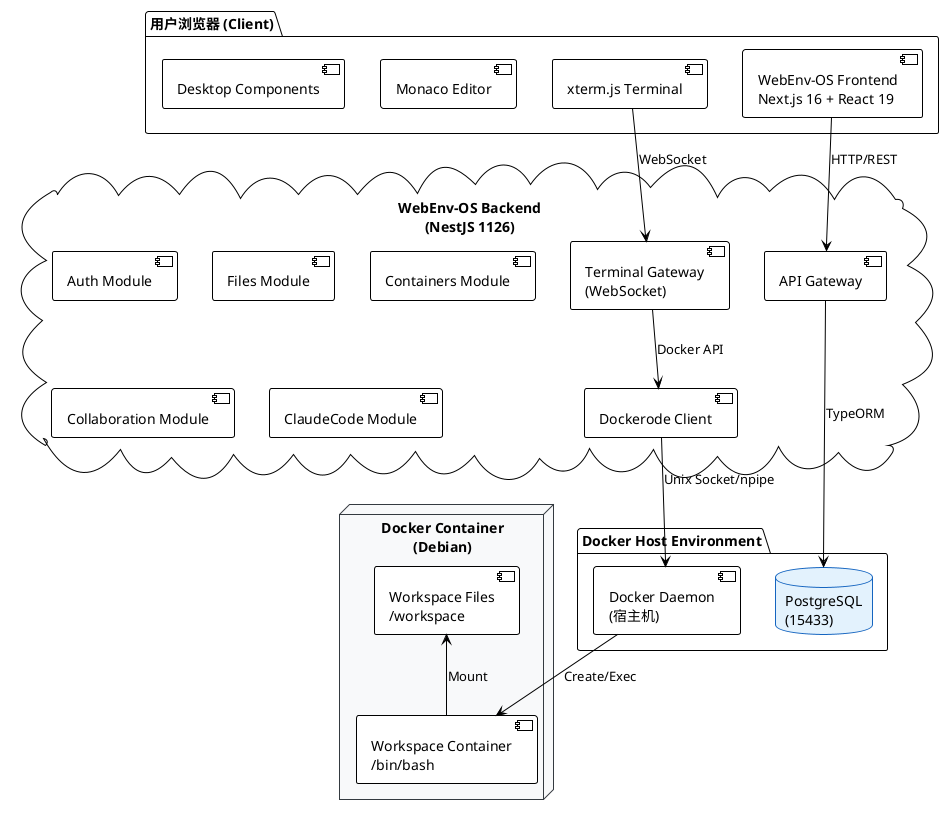

### 2.2 部署架构图

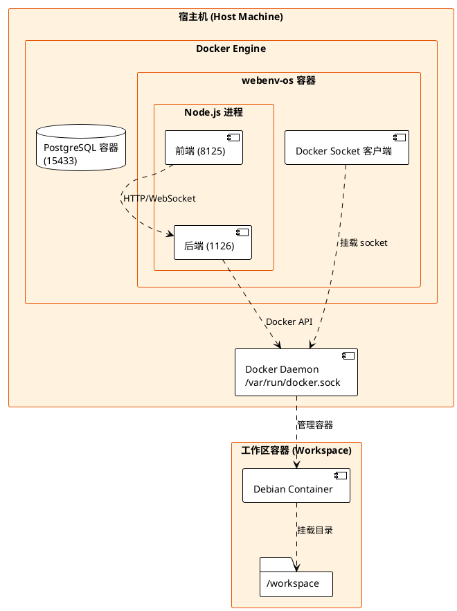

---

## 3. 技术栈详解

### 3.1 前端技术栈 (webenv-os)

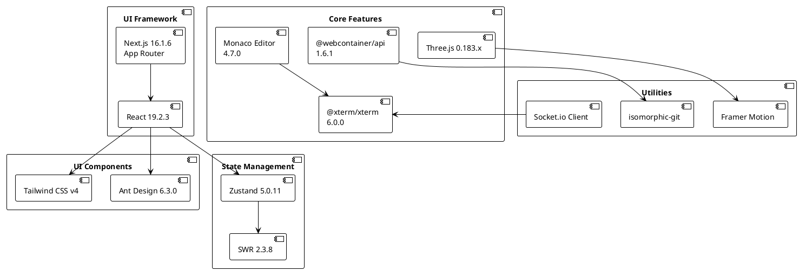

### 3.2 后端技术栈 (webenv-backend)

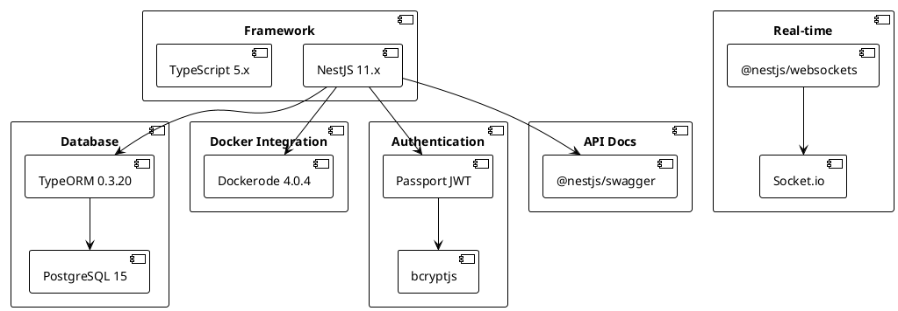

---

## 4. Docker 容器架构

### 4.1 终端服务架构

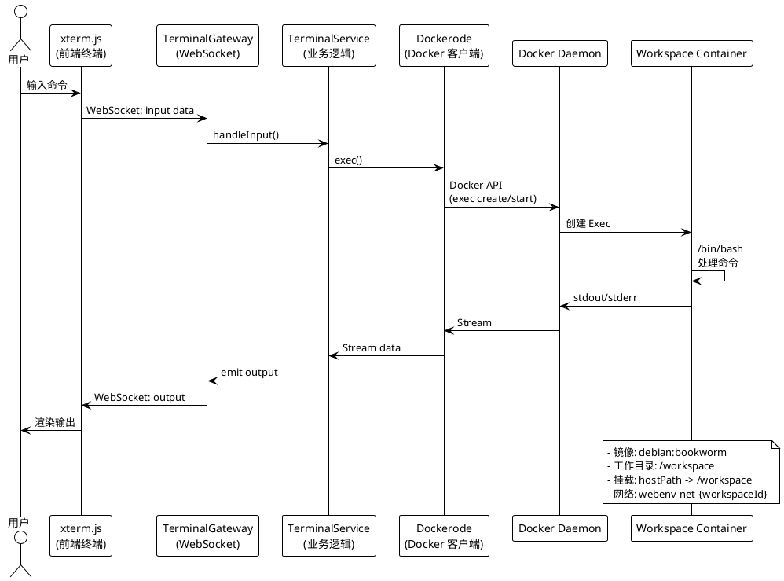

### 4.2 容器生命周期

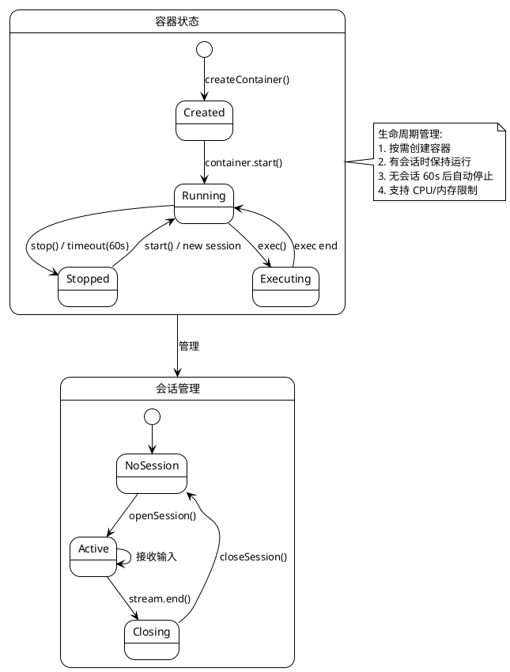

---

## 5. 核心模块详解

### 5.1 后端模块结构

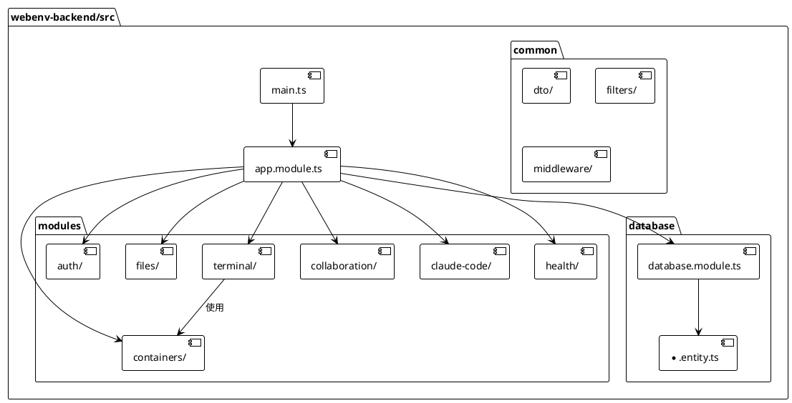

### 5.2 前端组件结构

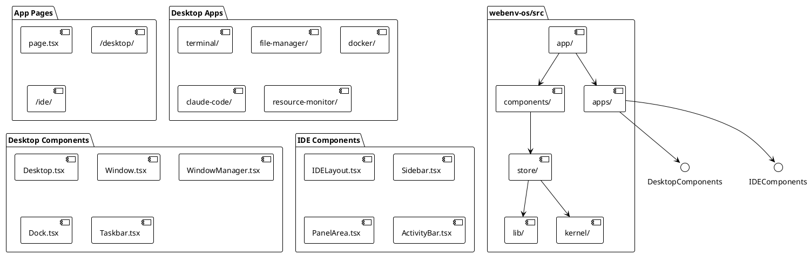

---

## 6. 目录结构

### 6.1 项目根目录

```
webEnv/
├── docker/                    # Docker 相关配置
│   ├── nginx.conf            # Nginx 反向代理配置
│   └── nginx-compose.yml     # Nginx 服务编排
├── docker-compose.yml        # 主服务编排
├── Dockerfile                # 应用镜像定义
├── scripts/                  # 启动脚本
│   ├── start.sh              # 容器内启动脚本
│   ├── verify.sh             # 验证脚本
│   └── docker-start.ps1      # PowerShell 启动脚本
├── docs/                     # 项目文档
├── webenv-backend/           # NestJS 后端
└── webenv-os/                # Next.js 前端
```

### 6.2 后端目录结构

```
webenv-backend/
├── src/
│   ├── main.ts              # 应用入口
│   ├── app.module.ts        # 根模块
│   ├── app.controller.ts    # 根控制器
│   ├── app.service.ts       # 根服务
│   ├── common/              # 公共模块
│   │   ├── dto/            # 数据传输对象
│   │   ├── filters/        # 异常过滤器
│   │   └── middleware/     # 中间件
│   ├── database/           # 数据库模块
│   │   ├── database.module.ts
│   │   └── *.entity.ts     # 实体定义
│   └── modules/            # 功能模块
│       ├── auth/           # 认证模块
│       ├── files/          # 文件模块
│       ├── terminal/       # 终端模块 (Docker 集成)
│       ├── containers/     # 容器管理模块
│       ├── collaboration/  # 实时协作模块
│       ├── claude-code/    # Claude Code 集成
│       └── health/         # 健康检查模块
├── package.json
└── tsconfig.json
```

### 6.3 前端目录结构

```
webenv-os/
├── src/
│   ├── app/                 # Next.js 页面
│   │   ├── page.tsx         # 首页
│   │   ├── desktop/         # 桌面环境页面
│   │   └── ide/             # IDE 页面
│   ├── apps/                # 桌面应用程序
│   │   ├── terminal/        # 终端应用
│   │   ├── file-manager/    # 文件管理器
│   │   ├── docker/          # Docker 管理器
│   │   ├── claude-code/     # Claude Code 对话
│   │   └── resource-monitor/# 资源监控
│   ├── components/          # React 组件
│   │   ├── desktop/         # 桌面组件
│   │   ├── ide/             # IDE 组件
│   │   ├── ui/              # 基础 UI 组件
│   │   └── ...              # 其他组件
│   ├── store/               # Zustand 状态管理
│   ├── kernel/              # 内核模块
│   ├── lib/                 # 工具库
│   └── types/               # TypeScript 类型
├── public/                  # 静态资源
│   └── icons/              # SVG 图标
└── package.json
```

---

## 7. API 端口映射

| 服务 | 端口 | 协议 | 说明 |
|------|------|------|------|
| 前端 | 8125 | HTTP | Next.js 开发/生产服务器 |
| 后端 | 1126 | HTTP/WebSocket | NestJS API 服务 |
| 数据库 | 15433 | PostgreSQL | 外部访问端口 |
| Nginx | 80 | HTTP | 反向代理 (可选) |

---

## 8. 关键设计决策

### 8.1 前后端分离但同容器部署

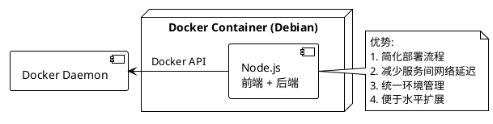

### 8.2 Docker in Docker

容器内通过挂载宿主机的 Docker Socket 实现容器管理：

```yaml
# docker-compose.yml
volumes:
  - /var/run/docker.sock:/var/run/docker.sock
```

### 8.3 工作区隔离策略

每个工作区拥有：
- 独立的 Docker 容器
- 独立的 Docker 网络 (`webenv-net-{workspaceId}`)
- 挂载的工作区目录 (`/workspace`)

---

## 9. 数据流详解

### 9.1 终端命令执行流程

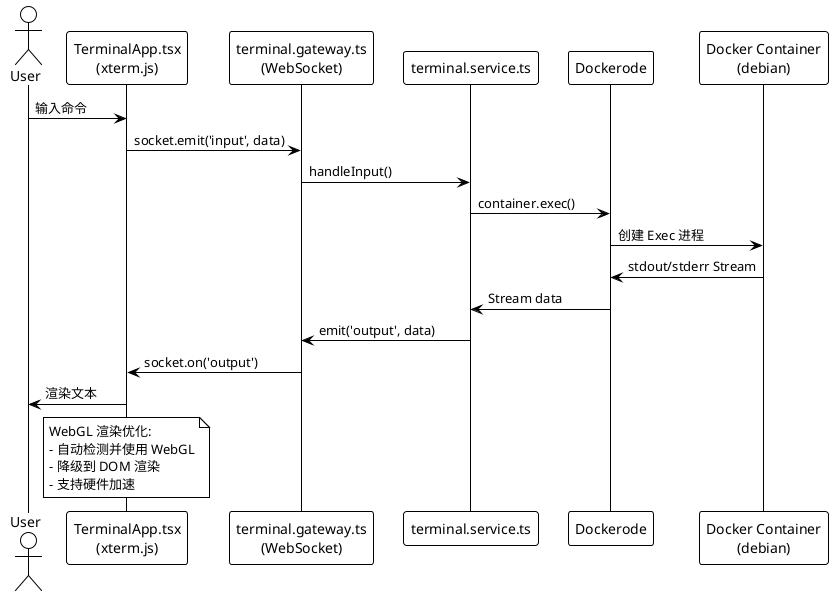

### 9.2 文件操作流程

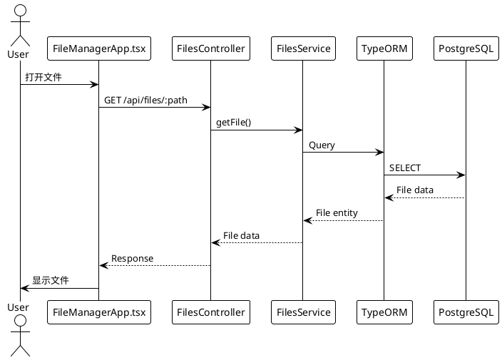

---

## 10. 依赖版本汇总

### 10.1 前端依赖

| 包名 | 版本 | 用途 |
|------|------|------|
| next | 16.1.4 | Web 框架 |
| react | 19.2.3 | UI 库 |
| antd | 6.2.1 | 组件库 |
| tailwindcss | 4 | 样式 |
| zustand | 5.0.10 | 状态管理 |
| @monaco-editor/react | 4.7.0 | 代码编辑 |
| @xterm/xterm | 6.0.0 | 终端 |
| @xterm/addon-webgl | 0.19.0 | WebGL 渲染 |
| three | 0.160.1 | 3D 渲染 |
| @webcontainer/api | 1.6.1 | 浏览器沙箱 |

### 10.2 后端依赖

| 包名 | 版本 | 用途 |
|------|------|------|
| @nestjs/core | 11.x | Web 框架 |
| @nestjs/typeorm | 11.x | ORM |
| typeorm | 0.3.20 | 数据库 ORM |
| pg | 8.13.1 | PostgreSQL 驱动 |
| dockerode | 4.0.4 | Docker 客户端 |
| @nestjs/websockets | 11.x | WebSocket |
| @nestjs/jwt | 11.x | JWT 认证 |
| passport-jwt | 4.0.1 | JWT 策略 |

---

## 11. 附录

### 11.1 环境变量

```bash
# 后端环境变量
NODE_ENV=production
PORT=1126
DB_HOST=postgres
DB_PORT=5432
DB_USERNAME=webenvos
DB_PASSWORD=webenvos
DB_DATABASE=webenvos
DOCKERIZED=true
DOCKER_HOST=unix:///var/run/docker.sock
DOCKER_DEFAULT_IMAGE=debian:bookworm
WORKSPACES_ROOT=/app/data/workspaces
```

### 11.2 启动脚本逻辑

```bash
# start.sh 核心逻辑
1. 设置环境变量 (NODE_ENV, TZ, DOCKERIZED)
2. 创建日志目录 /app/logs
3. 后台启动后端 (npm run start:prod)
4. 前端使用 Turbopack 启动 (NEXT_USE_WEBPACK=0)
5. 循环检查进程状态，异常退出时记录日志
```

---

## 12. 文档修订记录

| 日期 | 版本 | 变更内容 |
|------|------|----------|
| 2026-02-20 | 1.0 | 初始版本，完整架构分析 |
