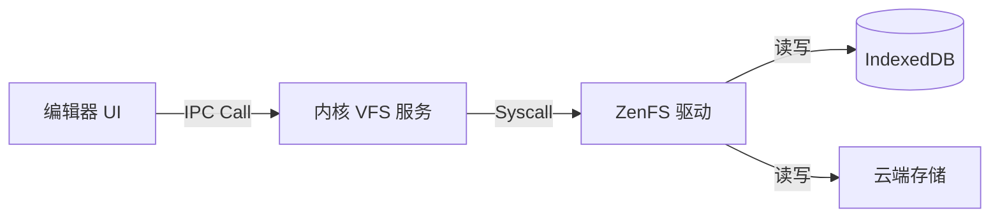
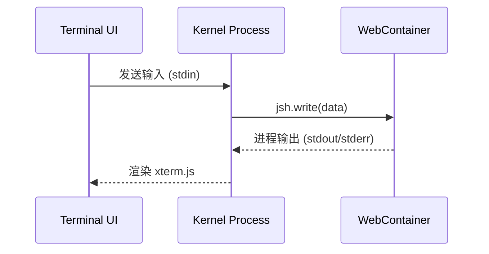

# webEnvOS 架构深度剖析

本文档提供 webEnvOS 的全栈架构分析，涵盖从顶层 UI 组件到低层内核服务的完整链路。

> **架构状态**: 2026-02-10 更新 (演进中)
> 本文档描述了从单页应用向微内核架构转型的目标设计。

## 1. 系统分层模型 (Layered Model)

webEnvOS 采用 **浏览器微内核 (Browser Microkernel)** 架构，将传统的操作系统层级映射到 Web 技术栈中。

### 1.1 用户体验层 (User Experience Layer)
- **桌面环境 (Desktop Environment)**:
  - **WindowManager**: 基于 React + Zustand 的窗口管理器，负责窗口的堆叠 (Z-Index)、拖拽、缩放与生命周期。
  - **Launcher**: 任务栏、Dock 与开始菜单，负责应用启动。
- **应用层 (Application Layer)**:
  - **Isomorphic Apps**: 同时支持 Web 端与本地端运行的应用 (如编辑器、文件管理器)。
  - **Sandboxed Apps**: 运行在 Web Worker 或 Iframe 中的隔离应用。

### 1.2 内核服务层 (Kernel Service Layer)
此层将逐步从 React 组件中解耦，形成独立的后台服务。

- **进程管理 (Process Manager)**:
  - 负责分配 PID。
  - 管理 Web Worker 实例的生命周期。
  - **IPC 总线**: 基于 `Comlink` 或自定义 `postMessage` 协议，提供应用间通信能力。
- **文件系统 (VFS)**:
  - **ZenFS**: 统一的 POSIX 文件系统接口。
  - **挂载点 (Mount Points)**:
    - `/`: IndexedDB (持久化存储)
    - `/tmp`: Memory (内存临时存储)
    - `/mnt/local`: File System Access API (用户本地磁盘)
- **网络栈 (Network Stack)**:
  - **Service Worker Proxy**: 拦截应用发出的网络请求，模拟本地网络环境。
  - **P2P**: 基于 WebRTC 实现浏览器节点间的互联。

### 1.3 运行时环境 (Runtime Environment)
- **WebContainers**: 在浏览器安全沙箱内运行原生的 Node.js 进程，支持 `npm`, `node`, `git`。
- **WASM 虚拟机**: 用于运行 Python (Pyodide), C++ (Emscripten) 等非 JS 负载。

## 2. 核心数据流 (Data Flow)

### 2.1 文件操作流
传统模式直接操作 IndexedDB，新架构通过内核代理：

### 2.2 终端执行流 (WebContainer)

## 3. 关键技术选型

- **前端框架**: Next.js 16 + React 19 (UI 渲染)
- **状态管理**: Zustand (轻量级全局状态)
- **文件系统**: **ZenFS** (原 BrowserFS，支持多后端与 POSIX 标准)
- **运行时**: **WebContainers** (核心计算引擎)
- **通信协议**: **Comlink** (简化 Worker 通信) + **PeerJS** (P2P)

## 4. 容错与恢复机制

- **崩溃隔离**: 单个应用的 Web Worker 崩溃不应影响主线程桌面。
- **状态持久化**: 
  - 关键系统状态 (窗口布局、设置) 存入 LocalStorage。
  - 文件数据通过 ZenFS 自动同步至 IndexedDB。
- **断网可用**: 依托 Service Worker 缓存静态资源，依托 IndexedDB 存储用户数据，实现 Offline-First。

---

**文档维护记录**:
- 2026-02-10: 重构架构文档，引入微内核与 ZenFS/WebContainers 设计理念。