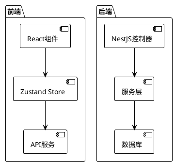

# WebEnv-OS 文档规范

## 1. 文档结构

```
docs/
├── architecture/          # 架构文档
│   ├── README.md         # 架构文档索引
│   ├── overview/         # 概览
│   │   └── system-overview.md
│   ├── frontend/        # 前端架构
│   │   ├── react-core.md
│   │   ├── component-hierarchy.md
│   │   ├── state-management.md
│   │   └── routing.md
│   ├── backend/         # 后端架构
│   │   ├── nestjs-core.md
│   │   ├── modules.md
│   │   └── database.md
│   ├── desktop/         # 桌面环境
│   │   ├── window-manager.md
│   │   └── apps.md
│   ├── docker/         # Docker部署
│   │   └── deployment.md
│   └── diagrams/       # 图表
│       ├── state-machine.puml
│       ├── architecture.puml
│       └── flow.puml
├── business/            # 业务逻辑文档
│   ├── ide/           # IDE业务
│   ├── terminal/      # 终端业务
│   └── collaboration/  # 协作业务
├── components/         # 组件文档
│   └── component-name/
└── standards/          # 规范文档
    ├── naming.md
    └── code-style.md
```

## 2. 文档命名规范

| 类型 | 命名规则 | 示例 |
|------|----------|------|
| 组件文档 | `{组件名}.md` | `CodeEditor.md` |
| 模块文档 | `{模块名}.md` | `terminal-service.md` |
| 架构图 | `{图表类型}.pu` 或 `.puml` | `state-machine.puml` |
| 流程图 | `{流程名}-flow.puml` | `login-flow.puml` |

## 3. 绘图规范

### 3.1 PlantUML 使用规范



### 3.2 字符图规范

```
┌─────────────────────────────────────┐
│           系统架构图                  │
├─────────────────────────────────────┤
│  前端层  │   API层   │   数据层     │
│  Next.js│  NestJS   │  PostgreSQL │
└─────────────────────────────────────┘
```

## 4. STAR 法则描述规范

### 4.1 业务功能描述模板

```
## 功能名称

### 背景 (Situation)
- 业务场景描述
- 现有问题

### 任务 (Task)
- 需要完成的目标
- 功能需求

### 行动 (Action)
- 技术实现方案
- 关键代码逻辑

### 结果 (Result)
- 功能效果
- 性能指标
```

### 4.2 示例

```
## 终端分屏功能

### 背景 (Situation)
用户在开发过程中需要同时查看多个终端输出，需要在一个窗口内显示多个终端。

### 任务 (Task)
实现终端分屏功能，支持水平和垂直分屏。

### 行动 (Action)
- 使用 react-split-pane 实现拖拽分屏
- 使用 xterm.js 创建多个终端实例
- 使用 Zustand 管理终端状态

### 结果 (Result)
- 支持最多 4 个终端同时显示
- 分屏调整响应时间 < 16ms
```

## 5. 代码分析规范

### 5.1 组件分析模板

```typescript
/**
 * 组件名称
 *
 * 职责：描述组件的主要职责
 *
 * 技术细节：
 * - 使用的 hooks: useState, useEffect, useCallback
 * - 状态管理: Zustand / Context
 * - 渲染优化: React.memo / useMemo
 *
 * 生命周期：
 * - mount: 初始化
 * - update: 状态更新
 * - unmount: 清理资源
 */
```

### 5.2 API 分析模板

```typescript
/**
 * 接口名称
 *
 * 请求：
 * - method: GET/POST/PUT/DELETE
 * - path: /api/v1/xxx
 * - params: 参数说明
 *
 * 响应：
 * - 成功: { code: 0, data: xxx }
 * - 失败: { code: xxx, message: xxx }
 *
 * 业务逻辑：
 * - 详细描述处理流程
 */
```

## 6. 状态机描述规范

### 6.1 状态机模板

```
状态: [初始状态]
  │
  ├─事件: [事件名] ─→ [新状态]
  │
  └─条件: [条件描述] ─→ [条件状态]

状态: [条件状态]
  │
  └─事件: [事件名] ─→ [结束状态]
```

### 6.2 字符图示例

```
┌──────────┐  新建终端  ┌──────────┐
│ 空闲状态  │ ─────────→ │ 活跃状态  │
└──────────┘            └──────────┘
       │                      │
       │ 关闭终端             │ 空闲>60s
       ▼                      ▼
┌──────────┐            ┌──────────┐
│ 已关闭   │            │ 自动停止  │
└──────────┘            └──────────┘
```

## 7. 中文使用规范

- 所有文档必须使用简体中文
- 技术术语首次出现时需给出英文原文
- 代码注释使用简体中文
- 标点符号使用中文全角符号

## 8. 文档质量检查清单

- [ ] 文档结构符合规范
- [ ] 所有图表已正确渲染
- [ ] 代码示例可运行
- [ ] 无错别字
- [ ] STAR 法则描述完整
- [ ] 技术细节描述清晰
- [ ] 状态机描述准确

## 9. 版本管理

- 文档版本与代码版本对应
- 重大架构变更需要更新文档
- 每次提交代码时同步更新相关文档

---

**创建日期**: 2026-03-08
**版本**: 1.0.0
**维护人**: Shyu-x
