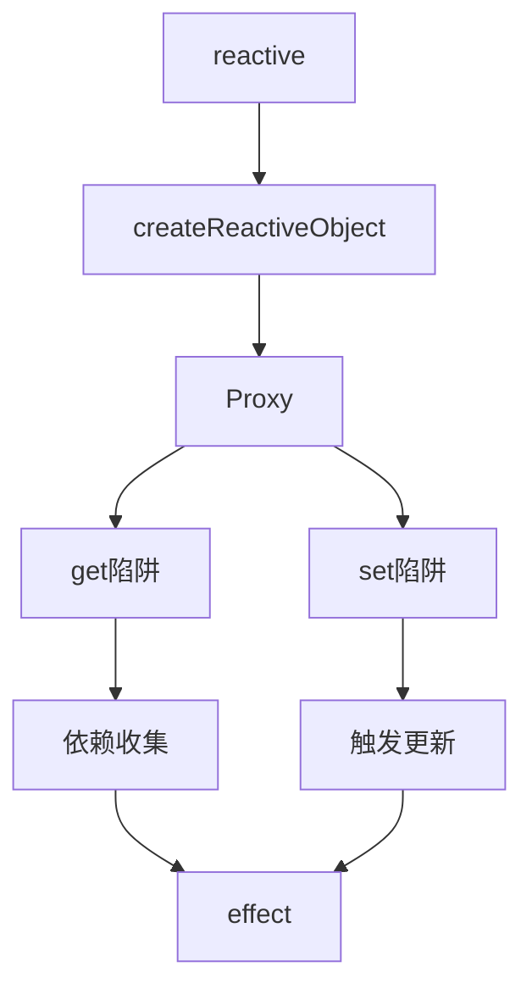

# 源码阅读方法完全指南

## 一、源码阅读的重要性与意义

### 1.1 为什么需要阅读源码

在现代前端开发中，我们每天都在使用各种开源框架和工具库。从React、Vue到Webpack、Rollup，从Lodash到Axios，这些优秀的开源项目蕴含着无数智慧和经验。然而，大多数开发者仅仅停留在"会用"的层面，没有深入理解其内部实现原理。这种浅层次的使用方式带来了一系列问题：

首先，当遇到框架内部的Bug或边界情况时，我们往往束手无策，只能等待官方修复或寻找临时 workaround。其次，在进行技术选型时，由于不理解底层原理，很难做出正确的判断。最后，个人的技术成长也会遇到瓶颈，难以突破到更高的层次。

阅读源码是突破这些瓶颈的关键途径。通过源码阅读，我们可以深入理解框架的设计思想和实现细节，学习业界顶尖工程师的编码技巧和架构能力，提升自己的代码审美和架构能力。正如Vue.js的作者尤雨溪所说："阅读源码是提升技术能力最有效的途径之一，它让你站在巨人的肩膀上前进。"

### 1.2 源码阅读的学习路径

源码阅读并非一蹴而就的过程，而是需要循序渐进、逐步深入的学习路径。对于不同阶段的学习者，应该采用不同的策略和方法：

初学者阶段应该从简单的工具函数库开始，如Lodash的工具函数实现，理解如何编写高质量、可复用的代码。这个阶段的重点是模仿和学习基础的编码技巧，而不是追求完全理解框架架构。

入门阶段可以开始阅读较简单的框架核心代码，如Vue的响应式原理、React的Hook实现等。这个阶段需要理解框架的基本概念和核心算法，逐步建立对框架的整体认知。

进阶阶段应该深入研究框架的架构设计、编译优化、状态管理等复杂模块，理解框架如何处理边界情况和性能优化。这个阶段需要具备一定的架构能力和系统性思维。

专家阶段可以尝试参与开源贡献，提交PR修复Bug或添加新特性，在与全球开发者的协作中进一步提升自己的能力。

## 二、源码阅读的前期准备

### 2.1 技术基础储备

在开始阅读源码之前，需要确保具备必要的技术基础。对于前端框架的源码阅读，以下知识是必备的：

JavaScript基础是根本，包括作用域、闭包、原型链、异步编程、ES6+新特性等。这些知识将在阅读过程中反复用到，如果基础不扎实，将很难理解框架的实现逻辑。建议系统复习《JavaScript高级程序设计》和《你不知道的JavaScript》这两本书。

TypeScript基础对于阅读现代框架源码非常重要，因为当前主流框架Vue3、React18等都使用TypeScript编写。了解类型系统、泛型、装饰器等概念，可以更准确地理解代码的含义。

计算机基础原理也是必要的，包括数据结构（栈、队列、链表、树、图等）、算法（排序、搜索、递归、动态规划等）、操作系统（进程与线程、内存管理、事件循环等）。这些基础知识将帮助理解框架内部的算法和数据结构设计。

设计模式知识也非常重要，框架中大量使用了单例模式、工厂模式、观察者模式、装饰器模式、策略模式等。了解这些模式可以帮助理解框架的架构设计。

### 2.2 开发环境搭建

阅读源码需要一个良好的开发环境，这包括代码编辑器、终端工具、版本控制工具等。

VS Code是阅读源码的首选编辑器，它具有良好的代码导航功能、强大的搜索能力、丰富的插件生态。通过安装GitLens插件可以查看代码的Git历史，Indent Rainbow插件可以更好地理解代码缩进，Error Lens插件可以快速定位问题。

终端工具建议使用Windows Terminal或iTerm2，配合zsh或PowerShell使用。一个好的终端可以提升开发效率，让源码阅读过程更加顺畅。

Git版本控制工具是必须的，大多数开源项目都托管在GitHub上，需要使用Git进行代码克隆、分支管理、版本切换等操作。

Node.js环境也是必要的，大多数现代前端工具都基于Node.js运行，需要安装LTS版本以确保稳定性。

### 2.3 源码获取与版本选择

获取源码前需要了解版本选择的重要性。不同版本的源码可能存在显著差异，对于学习来说，选择一个稳定且文档丰富的版本更为重要。

克隆仓库时应选择主要的发布版本，而不是开发分支。可以通过git tag查看所有版本标签，通过git checkout切换到特定版本。对于学习目的，选择最新的稳定版本通常是最佳选择。

```bash
# 克隆Vue.js源码仓库
git clone https://github.com/vuejs/core.git

# 查看所有版本标签
git tag

# 切换到特定版本（如v3.4.21）
git checkout v3.4.21

# 查看当前版本
git log --oneline -1
```

同时，建议star和watch仓库，关注项目的Issue和PR讨论，这些讨论中往往包含很多有价值的设计决策解释和实现细节。

## 三、源码阅读的方法论

### 3.1 黄轶老师的源码阅读心法

前Vue.js核心 contributor黄轶老师在源码阅读方面有着丰富的经验和深刻的见解。他的源码阅读方法论可以概括为"由浅入深、逐步推进、理论与实践结合"。

黄轶老师强调，阅读源码的第一步不是直接打开代码文件，而是先理解框架的设计理念和核心概念。以Vue.js为例，在开始阅读响应式原理之前，应该先通读官方文档中关于响应式系统的介绍，理解什么是响应式、响应式的应用场景、以及响应式的基本工作流程。这种"知其然再知其所以然"的学习方式可以大大提高阅读效率。

第二步是建立全局视图。黄轶老师建议使用思维导图或流程图工具，画出框架的整体架构图和核心模块之间的关系图。以Vue3为例，应该先理解Compiler模块、Runtime模块、Reactivity模块之间的关系，以及它们如何协同工作。只有建立了全局视图，才能在后续的细节阅读中不会迷失方向。

第三步是带着问题阅读。每次阅读源码前，先列出自己想要解答的问题，如"Vue3的ref是如何实现响应式的"、"watchEffect的回调函数何时被执行"等。这种问题驱动的阅读方式可以让阅读过程更有针对性，也更容易保持专注。

第四步是写注释和博客。黄轶老师强烈建议在阅读源码的过程中做笔记、写注释，将自己的理解记录下来。这个过程不仅可以帮助梳理思路、加深记忆，还可以形成自己的知识体系，方便日后复习和回顾。

### 3.2 庖丁解牛：模块分解法

模块分解法是黄轶老师极力推崇的源码阅读方法。它的核心思想是"自顶向下、逐层分解"，将一个复杂的系统分解为多个可理解的小模块，然后逐一攻克。

以阅读Vue3响应式系统为例，首先需要识别响应式系统包含哪些子模块：

1. reactive模块：负责将普通对象转换为响应式对象
2. ref模块：负责将基本类型值转换为响应式对象
3. computed模块：负责创建计算属性
4. effect模块：负责依赖收集和副作用执行
5. scheduler模块：负责调度任务的执行

识别出这些模块后，应该逐个深入研究每个模块的实现。建议从最简单的reactive模块开始，因为它是最基础的功能，其他模块都依赖于它。理解reactive后再阅读ref会更容易，因为ref内部使用了reactive来实现对象类型的响应式。

每个模块的阅读也应该遵循同样的分解策略。以reactive模块为例，可以进一步分解为：

1. createReactiveObject工厂函数：响应式对象的创建
2. Proxy处理器对象：get、set、deleteProperty等陷阱的实现
3. 集合类型的处理：Map、Set、WeakMap、WeakSet的特殊处理

这种层层分解的方法可以让看似复杂的代码变得有条理、可理解。

### 3.3 断点调试法

断点调试是理解代码执行流程最直观的方法。相比静态阅读，动态调试可以让你看到代码实际运行时的状态，观察变量的值、执行路径、分支跳转等。

以Chrome DevTools调试Vue3源码为例，可以按以下步骤操作：

1. 搭建调试环境：首先需要有一个可以运行Vue3源码的项目。Vue3官方仓库提供了示例项目，可以在其中进行调试实验。

2. 设置断点：在关键位置设置断点，如reactive函数的入口、Proxy的get/set陷阱、effect的执行位置等。

3. 触发代码执行：通过用户的交互操作或调用相关API，触发响应式系统的运行。

4. 观察执行过程：使用Step Into、Step Over、Step Out等调试工具，逐步跟踪代码的执行流程，观察每个变量的值变化。

5. 分析执行结果：理解代码为什么这样执行，与自己的预期进行对比，找出认知偏差，修正理解。

断点调试法特别适合理解异步代码的执行顺序、复杂算法的中间状态、边界条件的处理逻辑等难以通过静态阅读理解的场景。

### 3.4 对比分析法

对比分析法是一种通过比较不同实现或不同场景来加深理解的方法。它包括以下几种对比策略：

新旧版本对比：如果框架有重大版本更新，可以对比新旧版本的实现差异，理解为什么要做这些改变，以及新版本解决了什么问题。以Vue2和Vue3的响应式系统为例，Vue3使用Proxy替代了Vue2的Object.defineProperty，这种改变解决了Vue2响应式的哪些局限性？

官方实现与社区实现对比：有些功能可能有官方实现和社区实现两个版本，通过对比可以理解官方选择某种实现方式的原因。如Vue的虚拟DOM实现有多个版本，官方实现与snabbdom的对比可以揭示虚拟DOM的核心设计决策。

简化版与完整版对比：在学习某个模块时，可以先学习社区提供的简化版实现（如Mini Vue、Mini React），然后再过渡到官方完整版。简化版去除了边缘情况处理和性能优化代码，保留了核心逻辑，更容易理解。

### 3.5 知识迁移法

知识迁移法是指将源码中学到的知识和设计模式应用到自己的项目中，通过实践来加深理解。

学以致用是知识迁移的核心。每次阅读完一个模块的源码后，尝试使用学到的思想实现一个简化版本，或者将设计模式应用到自己的项目中。例如，学习了Vue3的响应式系统后，可以尝试为自己的项目实现一个简单的响应式数据管理系统。

这种实践方式可以检验自己是否真正理解了源码，也可以在实践中发现新问题，进一步加深对源码的理解。同时，实践过程中积累的代码可以成为自己的工具库，在未来的项目中复用。

## 四、源码阅读工具推荐

### 4.1 代码阅读工具

VS Code是源码阅读的首选工具，它具有以下适合源码阅读的特性：

首先，VS Code具有良好的代码导航功能。通过Cmd+P（Mac）或Ctrl+P（Windows）可以快速打开任意文件，通过Cmd+Shift+O可以查看当前文件的所有符号（函数、类、变量等），通过F12或Cmd+点击可以跳转到定义位置。

其次，VS Code支持多光标编辑，在需要同时修改多个相似位置时非常有用。

再次，VS Code的内置终端可以在阅读源码时运行测试、构建命令等，无需切换窗口。

最后，VS Code的插件生态非常丰富，可以扩展编辑器的功能。

推荐的VS Code插件包括：

GitLens插件可以显示每一行代码的Git提交历史、作者信息、变更时间等，帮助理解代码的演进过程和变更原因。

Import Cost插件可以显示每个导入语句的包大小，帮助理解依赖关系和性能考量。

Error Lens插件可以将编译错误和警告直接显示在代码行旁边，快速定位问题。

Bracket Pair Colorizer插件可以为匹配的括号对添加颜色，方便理解代码结构。

Highlight Matching Tag插件可以高亮显示当前标签的匹配标签，帮助理解HTML/XML的结构。

### 4.2 可视化工具

源码阅读过程中，可视化工具可以帮助理解复杂的架构和数据流。

draw.io是一款免费的在线 diagramming工具，可以用来绘制架构图、流程图、类图等。在阅读源码前，可以使用draw.io画出框架的整体架构图，帮助建立全局视图。在阅读过程中，可以不断修正和补充这个架构图。

Mermaid是一种基于文本的图表描述语言，可以嵌入Markdown中使用。使用Mermaid可以快速绘制流程图、时序图、甘特图等。例如，使用Mermaid可以描述Vue3响应式系统的工作流程：



Webpack Bundle Analyzer是一个用于分析Webpack打包结果的可视化工具。虽然它主要用于分析打包产物，但通过分析模块依赖关系，也可以帮助理解大型项目的结构。

### 4.3 调试工具

Chrome DevTools是前端调试的利器，也是源码阅读的重要辅助工具。

Sources面板可以设置断点、观察变量值、单步执行等。在调试Vue、React等框架时，可以将源码添加到Workspace中，直接在源码中设置断点进行调试。

Console面板可以执行任意JavaScript代码，用于测试某些API的行为、验证自己的理解是否正确。

Network面板可以观察网络请求，在阅读Ajax/Fetch相关源码时非常有用。

Performance面板可以录制页面的性能数据，分析函数的执行时间和调用栈，在阅读性能敏感代码时可以帮助理解优化策略。

React DevTools和Vue DevTools是专门为React和Vue设计的调试工具。它们可以展示组件树、组件状态、响应式依赖关系等信息，是阅读React和Vue源码的必备工具。

### 4.4 文档工具

好的文档可以让源码阅读事半功倍。以下是一些有用的文档工具：

GitBook可以生成漂亮的在线文档，支持Markdown编写，适合创建个人学习笔记和文档。

Notion是一款功能强大的笔记工具，支持表格、看板、文档等多种形式，非常适合整理源码阅读笔记。

Obsidian是一款基于本地Markdown文件的笔记工具，支持双向链接和图谱视图，适合构建个人知识图谱。

Docsify可以快速将Markdown文件生成为文档网站，支持实时预览、搜索等功能。

## 五、主流框架源码阅读指南

### 5.1 Vue.js源码阅读路径

Vue.js是目前最受欢迎的前端框架之一，其源码结构清晰、注释完善、文档丰富，是源码阅读的绝佳选择。

Vue3的源码仓库结构如下：

```
packages/
├── compiler-core/      # 平台无关的编译器核心
├── compiler-dom/       # DOM平台特定的编译器
├── compiler-sfc/        # 单文件组件编译器
├── compiler-ssr/        # SSR编译器
├── reactivity/          # 响应式系统
├── runtime-core/        # 平台无关的运行时核心
├── runtime-dom/         # DOM平台特定的运行时
├── runtime-ssr/         # SSR运行时
├── shared/              # 平台无关的工具函数
└── vue/                 # 完整版Vue（整合以上模块）
```

建议的阅读顺序是：

第一步，阅读 reactivity 模块。这是Vue3最重要的创新之一，理解响应式系统是理解整个框架的基础。

第二步，阅读 runtime-core 模块。这是Vue的运行时核心，包括组件系统、虚拟DOM、生命周期等核心概念。

第三步，阅读 compiler-core 模块。编译器将模板字符串转换为渲染函数，理解编译器的工作原理对于深入理解Vue非常重要。

第四步，阅读 vue 模块。这是整合所有子模块的入口文件，理解各个模块如何整合在一起工作。

### 5.2 React源码阅读路径

React是Facebook开发的UI库，其源码设计精巧、概念超前，是前端开发者的必读之物。

React18的源码仓库结构如下：

```
packages/
├── react/               # React核心包
├── react-dom/           # DOM渲染器
├── react-reconciler/    # 协调器（核心）
├── scheduler/           # 调度器
├── shared/              # 共享工具
└── react-server/        # 服务端渲染
```

建议的阅读顺序是：

第一步，阅读 scheduler 包。这是React实现异步渲染的基础，理解调度器的原理对于理解React的工作方式至关重要。

第二步，阅读 react-reconciler 包。这是React的核心，包括Fiber架构、Diff算法、Hooks实现等。这是最大也是最复杂的包，需要花费最多时间。

第三步，阅读 react-dom 包。这是DOM渲染器，将React Element渲染为真实的DOM元素。

第四步，阅读 react 包。这是React的核心API，包括Component、Fragment、PureComponent等基础类型，以及useState、useEffect等Hooks。

### 5.3 Webpack源码阅读路径

Webpack是现代前端构建工具的代表，其插件系统和加载器机制设计精巧，值得深入研究。

Webpack5的源码结构如下：

```
lib/
├── webpack.js           # Webpack主入口
├── Compiler.js          # 编译管理器
├── Compilation.js       # 编译结果
├── MainTemplate.js      # 主模板
├── RuntimeModule.js     # 运行时模块
├── HotModuleReplacement.js  # 热更新
└── stats/
```

建议的阅读顺序是：

第一步，理解Webpack的基本工作流程：初始化配置、编译（Compilation）、输出（Emit）。

第二步，深入研究Compiler和Compilation两个核心类，理解编译过程的各个阶段。

第三步，研究Loader和Plugin的实现原理，理解如何扩展Webpack的功能。

第四步，阅读常见的内置插件和加载器的实现，如BabelLoader、HtmlWebpackPlugin等。

### 5.4 Zustand源码阅读路径

Zustand是一个轻量级的状态管理库，代码量适中但设计精巧，非常适合作为状态管理方案的学习案例。

Zustand的源码结构如下：

```
src/
├── zustand.ts           # create函数的实现
├── react.ts             # React相关的集成代码
├── redux.ts             # Redux风格的API
├── middleware/          # 中间件系统
│   ├── persist.ts       # 持久化中间件
│   ├── devtools.ts      # Redux DevTools集成
│   └── immer.ts         # Immer集成
└── utils/
    ├── mapify.ts        # 工具函数
    └── shallow.ts       # 浅比较工具
```

建议的阅读顺序是：

第一步，阅读 zustand.ts，理解create函数如何创建store，以及set和get方法的实现原理。

第二步，阅读 react.ts，理解Zustand如何与React集成，包括useStore hook的实现。

第三步，阅读中间件系统，理解中间件的工作原理和常见的中间件实现。

### 5.5 Snabbdom虚拟DOM源码阅读

Snabbdom是Vue2虚拟DOM的实现，它以简洁的代码实现了虚拟DOM的核心功能，是学习虚拟DOM的优秀素材。

Snabbdom的源码结构如下：

```
src/
├── h.ts                 # 创建VNode的函数
├── vnode.ts             # VNode数据结构
├── htmldomapi.ts        # DOM API抽象
├── thunk.ts             # Thunk优化
├── modules/             # 模块（Attrs、Style、Events等）
└── snabbdom.ts          # 主入口
```

建议的阅读顺序是：

第一步，阅读 vnode.ts，理解VNode的数据结构设计。

第二步，阅读 h.ts 和 h.ts中的辅助函数，理解如何创建VNode。

第三步，阅读 snabbdom.ts，理解patch函数的实现和Diff算法的基本思路。

第四步，阅读 modules/ 下的各个模块，理解虚拟DOM如何处理属性、样式、事件等。

## 六、源码阅读实践案例

### 6.1 Vue3响应式系统阅读实践

下面以Vue3的响应式系统为例，展示完整的源码阅读过程。

首先，建立全局视图。Vue3的响应式系统主要包括以下核心概念：

1. reactive：将普通对象转换为Proxy代理对象
2. ref：将基本类型值包装为包含value属性的响应式对象
3. computed：创建计算属性
4. effect：注册副作用函数，当依赖变化时自动重新执行

这些概念之间的关系如下：reactive和ref用于创建响应式数据，effect用于注册副作用，计算属性是一种特殊的依赖响应式数据的副作用。

然后，深入阅读核心实现。以reactive为例：

```typescript
// packages/reactivity/src/reactive.ts

// reactive函数的入口
function reactive<T extends object>(target: T): TargetToReactive<T> {
  // 如果目标对象已经被代理，直接返回已有的代理对象
  // 这避免了重复代理的问题
  if (target && (target as Target).v_raw) {
    return target as TargetToReactive<T>
  }

  // 调用createReactiveObject创建代理对象
  return createReactiveObject(
    target,           // 目标对象
    false,             // isShallow：是否为浅响应式
    mutableHandlers,   // baseHandlers：基本操作的处理器
    readonlyHandlers,  // readonlyHandlers：只读操作的处理器
    proxyMap           // WeakMap：用于存储已代理的对象，避免重复代理
  )
}
```

createReactiveObject是创建响应式对象的核心函数：

```typescript
// 创建一个响应式代理对象
function createReactiveObject<T extends object>(
  target: T,                          // 目标对象
  isShallow: boolean,                 // 是否浅响应式
  baseHandlers: ProxyHandler<T>,      // 基本操作的处理器
  readonlyHandlers: ProxyHandler<T>, // 只读处理的处理器
  proxyMap: WeakMap<T, object>        // 已代理对象的缓存
): T {
  // 如果目标对象不是对象类型，或者已经是只读代理，直接返回
  if (!isObject(target)) {
    return target
  }

  // 如果目标对象已经在代理Map中，直接返回已有的代理
  const existingProxy = proxyMap.get(target)
  if (existingProxy) {
    return existingProxy as any
  }

  // 创建代理对象
  const proxy = new Proxy(
    target,                    // 目标对象
    isShallow                 // 浅响应式使用浅处理器
      ? shallowReactiveHandlers
      : baseHandlers          // 深响应式使用深处理器
  )

  // 将目标对象和代理对象存入Map
  proxyMap.set(target, proxy)

  return proxy
}
```

Proxy的处理器对象定义了get、set、deleteProperty等陷阱：

```typescript
// packages/reactivity/src/baseHandlers.ts

// Proxy的get陷阱，用于依赖收集
function get(target: object, key: string | symbol, receiver: object) {
  // 获取属性值
  const value = Reflect.get(target, key, receiver)

  // 如果是浅响应式，直接返回基本值
  if (isShallow(key)) {
    return value
  }

  // 如果属性值是对象，递归设置为响应式
  if (isObject(value)) {
    return reactive(value)
  }

  // 依赖收集：记录当前活跃的effect
  track(target, key)

  return value
}

// Proxy的set陷阱，用于触发更新
function set(
  target: object,
  key: string | symbol,
  value: unknown,
  receiver: object
): boolean {
  // 获取旧值
  const oldValue = (target as any)[key]

  // 设置新值
  const result = Reflect.set(target, key, value, receiver)

  // 如果值没有变化，不触发更新
  if (value !== oldValue) {
    // 触发更新：通知所有依赖此属性的effect
    trigger(target, key, value, oldValue)
  }

  return result
}
```

### 6.2 React Hooks实现阅读实践

React Hooks是React16.8引入的新特性，它让函数组件拥有了状态管理能力。下面以useState为例展示源码阅读过程。

useState的实现位于React-reconciler包中，核心逻辑如下：

```typescript
// packages/react-reconciler/src/ReactHooks.js

// useState的实现
function useState<S>(initialState: S): [S, Dispatch<SetStateAction<S>>] {
  const dispatcher = resolveDispatcher()
  return dispatcher.useState(initialState)
}

// 根据当前渲染阶段获取不同的dispatcher
function resolveDispatcher() {
  // 当前的dispatcher存储在当前的Fiber节点中
  const current = currentlyRenderingFiber.current
  if (!current) {
    // 已经在渲染阶段
    return ReactCurrentDispatcher.current
  }
  // 返回当前Fiber对应的dispatcher
  return current.memoizedState
}
```

真正的工作由dispatcher完成，以Fiber对应的dispatcher为例：

```typescript
// 挂载阶段的useState实现
function mountState<S>(
  initialState: S | (() => S)
): [S, Dispatch<SetStateAction<S>>] {
  // 创建Hook对象
  const hook = mountWorkInProgressHook()

  // 如果初始状态是函数，执行函数获取值
  if (typeof initialState === 'function') {
    initialState = initialState()
  }

  // 设置初始状态
  hook.memoizedState = hook.baseState = initialState

  // 创建queue和dispatch
  const queue = hook.queue = {
    pending: null,
    dispatch: null,
    lastRenderedReducer: basicStateReducer,
    lastRenderedState: initialState
  }

  // 创建dispatch函数
  const dispatch: Dispatch<SetStateAction<S>> =
    (queue.interactID = ++interactionThreadID)

  // 绑定dispatch到queue
  const boundDispatcher = dispatch.bind(null, queue)
  queue.dispatch = boundDispatcher

  return [hook.memoizedState, boundDispatcher]
}
```

更新阶段的实现涉及调度和优先级：

```typescript
// 更新阶段的useState实现
function updateState<S>(
  initialState: S | (() => S)
): [S, Dispatch<SetStateAction<S>>] {
  // 获取当前Hook
  const hook = updateWorkInProgressHook()

  // 获取上一个状态
  const queue = hook.queue
  const lastRenderedReducer = queue.lastRenderedReducer
  const current: HooksNode = hook.baseState

  // 计算新状态
  if (queue.pending) {
    const first = queue.pending
    let newState = current
    let hookUpdate = first
    do {
      const action = hookUpdate.action
      newState = lastRenderedReducer(newState, action)
      hookUpdate = hookUpdate.next
    } while (hookUpdate !== first)

    queue.pending = null
    hook.baseState = newState
    hook.memoizedState = newState
  }

  return [hook.memoizedState, hook.dispatch]
}
```

### 6.3 Lodash工具函数阅读实践

Lodash是一个广泛使用的基础工具库，其源码质量高、注释完善，适合作为编程基础的学习素材。

以debounce函数为例，其核心实现如下：

```typescript
// lodash/debounce.js

function debounce(func, wait, options) {
  let lastArgs, lastThis, maxWait, result
  let timerId, lastCallTime

  // 实际执行的函数
  function invokeFunc() {
    const args = lastArgs
    const thisArg = lastThis

    lastArgs = lastThis = undefined
    lastCallTime = Date.now()
    result = func.apply(thisArg, args)
    return result
  }

  // 启动定时器
  function startTimer(pendingFunc, wait) {
    return setTimeout(pendingFunc, wait)
  }

  // 取消函数
  function cancel() {
    if (timerId !== undefined) {
      clearTimeout(timerId)
    }
    lastArgs = lastCallTime = undefined
  }

  // 定时器回调
  function timerExpired() {
    const timeSinceLastCall = Date.now() - lastCallTime
    if (shouldInvoke(timeSinceLastCall)) {
      invokeFunc()
    } else {
      // 继续等待
      timerId = startTimer(timerExpired, wait - timeSinceLastCall)
    }
  }

  // 核心的debounced函数
  function debounced(...args) {
    lastArgs = args
    lastThis = this
    const timeSinceLastCall = Date.now()

    // 判断是否应该立即执行
    if (shouldInvoke(timeSinceLastCall)) {
      invokeFunc()
    }

    // 如果定时器未启动，启动定时器
    if (timerId === undefined) {
      timerId = startTimer(timerExpired, wait)
    }

    return result
  }

  return debounced
}
```

## 七、源码阅读笔记整理

### 7.1 笔记结构设计

良好的笔记结构可以让源码阅读成果更好地沉淀和复用。以下是一种推荐的笔记结构：

第一部分是概述，包括框架的基本介绍、设计目标、核心特性、版本信息等。这部分帮助快速回忆起框架的整体情况。

第二部分是架构图，包括模块关系图、数据流图、执行流程图等。图表比文字更容易记忆和理解，也方便日后快速查阅。

第三部分是核心模块分析，按模块逐一记录源码阅读的收获。每个模块的记录包括：模块职责、核心数据结构、重要函数解析、设计亮点、存在问题等。

第四部分是问题记录，记录阅读过程中遇到的疑问和解答，以及一些值得进一步研究的问题。

第五部分是实践应用，记录如何将学到的知识应用到自己的项目中，以及实践中遇到的问题和解决方案。

### 7.2 注释规范

在源码中添加注释是加深理解的好方法。以下是一些注释规范：

块级注释用于解释一段代码的功能和设计思路：

```typescript
/**
 * 创建响应式代理对象
 *
 * 工作流程：
 * 1. 检查目标对象是否已经代理，避免重复代理
 * 2. 创建Proxy对象，传入处理器
 * 3. 将目标对象和代理对象存入Map缓存
 *
 * @param target 目标对象
 * @param isShallow 是否浅响应式
 * @param handlers Proxy处理器
 * @returns 代理对象
 */
```

行内注释用于解释关键变量和表达式的含义：

```typescript
// 使用WeakMap存储已代理的对象，WeakMap的key是弱引用
// 当目标对象不再被其他地方引用时，可以被垃圾回收
const proxyMap = new WeakMap<object, object>()

// v_raw标记用于区分响应式对象和原始对象
if (target && (target as Target).v_raw) {
  return target
}
```

TODO注释用于标记需要进一步研究的问题：

```typescript
// TODO: 这里为什么使用Reflect.get而不是直接使用target[key]?
// 需要进一步研究两者在Proxy中的行为差异
const value = Reflect.get(target, key, receiver)
```

### 7.3 博客写作建议

将源码阅读的成果写成博客文章是很好的学习总结方式。写博客的过程可以强迫自己系统性地梳理知识，发现理解中的漏洞，同时也是与社区交流、获取反馈的好机会。

技术博客写作有以下几点建议：

标题要明确具体，让读者一眼就知道文章要讲什么。避免使用"深入理解XX原理"这样笼统的标题，更好的标题是"Vue3响应式系统源码解析： reactivity模块逐行解读"。

结构要清晰，使用多级标题将文章分为几个部分，每部分聚焦一个主题。开头部分介绍背景和阅读目标，中间部分是核心内容，结尾部分总结要点并提供进一步学习的资源。

代码示例要完整、可运行。最好提供完整的代码示例，读者可以直接复制运行验证。避免截取过于零散的代码片段，这会降低文章的可读性和可用性。

图表比文字更有表现力。尽量使用流程图、时序图、类图等可视化方式来解释复杂的概念和流程。

## 八、参与开源贡献

### 8.1 为什么参与开源

参与开源贡献是源码阅读的进阶阶段，它可以带来多方面的收益：

首先，提交PR被合并带来的成就感是学习的重要动力。当看到自己写的代码被数千个项目使用，那种成就感是学习任何其他东西都无法比拟的。

其次，与全球开发者的协作可以开阔视野，学习不同的编程风格和思维方式。在开源社区中，你会遇到来自不同背景、不同经验的开发者，他们的代码审查意见和改进建议可以让你快速成长。

再次，参与知名开源项目可以为简历增色。在求职面试中，能够展示自己在某知名开源项目中的贡献，会大大增加面试官的好感。

最后，回馈开源社区是每个开发者的责任。我们每天都在使用开源项目，参与贡献是回馈社区、帮助他人的方式。

### 8.2 如何开始贡献

选择项目是贡献的第一步。对于初学者，建议从自己日常使用的项目中选择，因为对这些项目比较熟悉，更容易找到可以改进的地方。

阅读项目的贡献指南。每个成熟的开源项目都有CONTRIBUTING文件，详细说明了如何设置开发环境、如何提交PR、如何编写测试等。仔细阅读这个文件可以避免走很多弯路。

寻找第一个issue。GitHub的good first issue标签标记了适合新手的issue，这些issue通常比较简单、明确，是入门的最佳选择。

从文档改进开始。如果觉得代码贡献太难，可以先从文档改进开始。修复错别字、改进表述、补充示例等都是有效的贡献方式。

### 8.3 PR提交流程

提交PR的一般流程如下：

首先，fork项目到自己的GitHub账户。然后，克隆fork后的仓库到本地，创建功能分支：

```bash
git clone https://github.com/your-username/project.git
cd project
git checkout -b feature/my-contribution
```

在本地进行开发，写好代码和测试。然后提交代码，推送到远程：

```bash
git add .
git commit -m "feat: 添加新功能"
git push origin feature/my-contribution
```

最后，在GitHub上创建PR，填写PR描述，说明这个PR的目的、解决的问题、测试情况等。等待项目维护者审查代码，根据反馈进行修改，直到PR被合并。

### 8.4 代码审查注意事项

代码审查是开源贡献中的重要环节，以下是一些注意事项：

理解审查意见。当审查者提出改进意见时，先理解为什么要这样改，而不是急于反驳。如果有不理解的地方，可以礼貌地询问。

保持谦逊的态度。开源社区中每个人都是志愿者，审查者的意见是帮助改进代码，而不是批评你个人。保持开放的心态，感谢审查者的付出。

解释设计决策。在PR描述中详细说明代码的设计决策，可以减少审查者的理解成本，加快审查进度。

遵守项目规范。每个项目都有自己的代码规范，要仔细阅读并遵守。如果项目使用ESLint、Prettier等工具，确保提交前运行这些工具。

## 九、常见问题与解决方案

### 9.1 源码太复杂看不懂怎么办

这是每个源码阅读者都会遇到的问题。解决方案包括：

回到更简单的版本。如学习Vue响应式，可以先学习Vue2的响应式系统，它基于Object.defineProperty实现，比Vue3的Proxy更简单一些。

寻找简化版实现。社区有很多优秀的学习项目，如Mini Vue、Mini React等，它们用几百行代码实现了框架的核心功能，更容易理解。

先看文档和教程。在看源码之前，先阅读官方文档、博客文章、视频教程等，建立基本的认知框架。

寻求帮助。在GitHub Issue、Stack Overflow、Discord服务器等社区提问，可能得到意想不到的解答。

### 9.2 看了就忘怎么办

看了就忘是因为没有形成长期记忆。解决方案包括：

多复习。按照艾宾浩斯遗忘曲线，在学习后的第1天、第3天、第7天、第14天、第30天分别复习，可以显著提高记忆效果。

做笔记。写笔记的过程本身就是加深理解的过程。笔记要用手写或打字，不要复制粘贴，因为手写/打字的过程会触发更深层次的认知加工。

实践应用。将学到的知识应用到项目中，通过实际使用加深理解。

教给他人。向别人讲解是检验和加深理解的最佳方式。可以写博客、录制视频、在社区回答问题等。

### 9.3 不知道该读什么源码怎么办

选择源码阅读材料时，可以考虑以下因素：

自己的技术短板。如果对异步编程不熟悉，可以阅读Promise、async/await的源码。如果对编译原理感兴趣，可以阅读Babel、TypeScript的编译器源码。

自己正在使用的工具。阅读自己每天使用的工具的源码最有动力，也最有实用价值。

项目的代码质量。选择代码质量高的项目阅读，可以学到更多好东西。可以查看项目的Star数、贡献者数量、代码规范程度等判断代码质量。

## 十、总结与展望

### 10.1 源码阅读的层次

源码阅读可以分为三个层次：

第一层次是"会用"。通过阅读文档和示例代码，学会使用框架提供的API。这是最低的层次，但也满足了大多数日常开发需求。

第二层次是"理解"。通过阅读源码，理解框架内部的工作原理，能够解释代码为什么这样设计，能够排查使用过程中遇到的问题。

第三层次是"改进"。在深入理解的基础上，能够为框架贡献代码，修复Bug、添加新特性、优化性能等。这是源码阅读的最高层次。

### 10.2 持续学习的方法

技术发展日新月异，框架不断更新迭代。持续学习的方法包括：

关注框架的Release Notes和Changelog，了解每次更新的内容和原因。

关注框架作者和技术专家的博客、Twitter、演讲视频等，了解最新的技术趋势和最佳实践。

参与社区讨论，在GitHub Issue、Discord、Reddit等平台与其他开发者交流。

定期回顾自己的笔记，更新知识体系，修正理解偏差。

### 10.3 推荐学习资源

以下是一些推荐的源码学习资源：

官方文档和源码注释：大多数优秀的开源项目都有详尽的官方文档和源码注释，是学习的第一手资料。

源码解读博客：社区中有许多优秀的源码解读博客和系列文章，如Vue3源码解读、React源码解读等。

视频教程：YouTube、Bilibili等平台上有许多源码解读的视频教程，适合喜欢视频学习的人。

源码分析书籍：有些技术书籍专门讲解源码分析，如《Vue.js设计与实现》、《深入React技术栈》等。

技术会议演讲：VueConf、React Conf、GMTC等技术会议的演讲视频，讲解框架的设计理念和实现细节。

源码阅读是一个需要长期坚持的过程，不可能一蹴而就。希望本指南能为你的源码学习之路提供一些帮助。记住，最重要的是开始阅读，并且持续阅读。祝你学习愉快！
